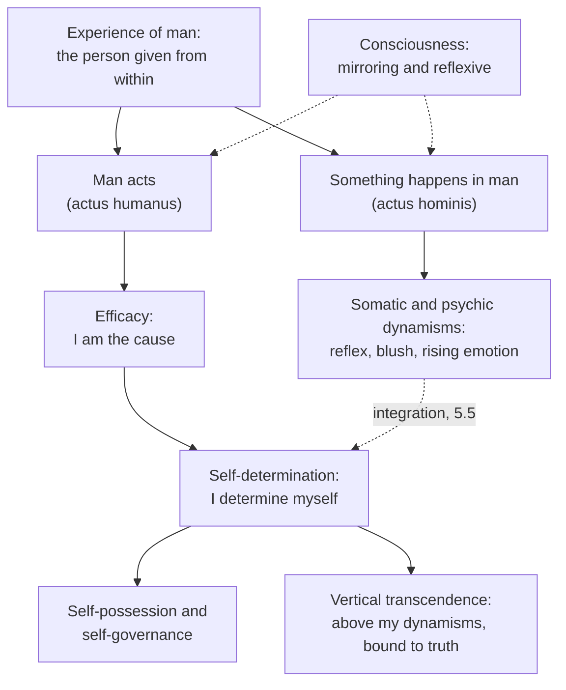

# Phenomenology & Personalism · Lesson 5.4: Action reveals the person

> ⏱ ~15 min · Module 5: Wojtyła: the acting person · Builds on: [5.1 Wojtyła and Scheler](05-01-wojtyla-and-scheler.md), [5.2 The personalistic norm](05-02-the-personalistic-norm.md) · Unlocks: [5.5 Integration, participation and the bridge](05-05-integration-participation-and-the-bridge.md)

## Why this matters

*Love and Responsibility* ([5.2](05-02-the-personalistic-norm.md)) said a person may never be merely used, because a person is a self-determining someone. That raises the obvious question: how do we know what a person is? Karol Wojtyła's answer is *Osoba i czyn* (Kraków, 1969; English *The Acting Person*, 1979). It does not deduce the person from a definition and then ask what such a being does. It reads the person off an experience everyone has from inside: doing something yourself, as against having something happen in you. Scheler's person was a unity of acts with no causal grip on them ([5.1](05-01-wojtyla-and-scheler.md)). Here that grip is the whole point. The same anthropology, freedom completed by truth, frames *Veritatis Splendor* ([`moral-theology` 4.4](../../moral-theology/lessons/04-04-veritatis-splendor.md)).

## The idea

Two episodes. On a train you sneeze. An hour later you close your book and decide to call the brother you have not forgiven. Both are yours: they occur in you, and you are aware of both. But they are given differently. The sneeze occurs, and you are where it occurs. The call you *make*, and you are its author. Wojtyła makes this contrast a term of art: "man acts" (*człowiek działa*) versus "something happens in man" (*coś dzieje się w człowieku*) ([acts and happenings](../reference.md#man-acts-and-something-happens)). The scholastics drew the same line as *actus humanus* (a deliberate human act) versus *actus hominis* (an act of a human being: digestion, a reflex). Wojtyła's claim is that the experience, not just the label, carries a philosophy.

**The starting point.** The Introduction begins from the *experience of man* (*doświadczenie człowieka*). Each of us experiences himself from within and others from without, and for Wojtyła that experience already contains understanding; it is not raw sensation. Its privileged moment is action (*czyn*). The tradition said *operari sequitur esse*: acting follows being, so what a thing does follows from what it is. Wojtyła keeps that order in being and reverses it in knowing. We come to know what the person is *through* what he does. The book does not take the person and then ask about action; it studies the person *in* action.

**Consciousness has two functions** (Part I, ch. 1). Its **mirroring** function reflects what the person knows and does, himself included, so that his actions are lit from within. It does not itself know objects; knowing, self-knowledge included, is the intellect's work. Its **reflexive** function turns that light back on the subject, so that I *live* my action as mine and experience myself as the one acting ([mirroring and reflexive functions](../reference.md#mirroring-and-reflexive-functions)). Wojtyła warns against making consciousness the whole person, which he treats as idealism's error. Consciousness is an aspect of a subject, not the subject.

**Efficacy** (Part I, ch. 2). In "man acts" I experience myself as the cause of what I do ([efficacy](../reference.md#efficacy), Polish *sprawczość*). In "something happens" I am the subject but not the cause. Below the level of action run what Wojtyła calls *dynamisms*: somatic ones (heartbeat, reflex) and psychic ones (an emotion rising). They belong to the person's nature and occur in him. An action is the one dynamism of which he is the efficient cause.

**Self-determination** (Part II, "The transcendence of the person in the action"). Acting is not only causing something outside me. In every "I will" I determine *myself* ([self-determination](../reference.md#self-determination), *samostanowienie*). Two structures make that possible. **Self-possession**: the person belongs to himself, and nobody else can do my willing for me. **Self-governance**: he has command over himself, and is at once the one who governs and the one governed ([self-possession and self-governance](../reference.md#self-possession-and-self-governance)). So self-determination has an object, and the object is the self. Someone who lies does not only say something false; he makes himself a liar. Action is where a person becomes good or bad *as a person*, which ch. 4 calls fulfilment.

**Transcendence and truth.** In self-determination the person rises above his own dynamisms and above the objects he chooses among. Wojtyła calls this *vertical* transcendence, as against the *horizontal* transcendence of intentionality, consciousness reaching out to objects ([1.1](01-01-intentionality-from-brentano-to-husserl.md)) ([transcendence of the person](../reference.md#transcendence-of-the-person)). Freedom is not indifference. A decision answers to the truth about the good: I choose this *as* really good, and conscience binds me to what I have recognized. For Wojtyła, freedom is self-determination that depends on truth. Take the truth away and you do not get more freedom. You get a person moved by whatever happens in him.

## The argument

Paraphrased from *The Acting Person*, Introduction and Parts I–II. Cite it by part and chapter. The 1979 English (*Analecta Husserliana* vol. 10, translated by Andrzej Potocki and edited by Anna-Teresa Tymieniecka, whose title page calls it the definitive text) was revised from the 1969 Polish, and critics dispute how faithfully it renders Wojtyła's technical vocabulary.

1. **The experience of man is a legitimate starting point: what is given in it is evidence about the person.** *In words:* begin from what acting is like, not from a definition.
2. **In that experience, "man acts" is given as different in kind from "something happens in man".** *In words:* doing and undergoing are not more and less of the same thing.
3. **What marks acting is efficacy: in acting, I am given to myself as the cause of my action.**
4. **Every action is also self-determination: in it I determine not only an outcome but myself.**
5. **Only a being that possesses and governs itself can determine itself.**
6. **∴ The acting person is a self-possessing, self-governing subject that transcends its own dynamisms: a someone, not a place where things happen.** *In words:* action reveals the person, and what it reveals is the structure the personalistic norm protects.

**Where the argument is weakest.** Premise 3, and the step from what is given to what is real. Hume searched the inward consciousness of the will moving a limb and found no impression of power, only one event following another (*Enquiry* §7; [`modern-philosophy` 4.2](../../modern-philosophy/lessons/04-02-causation-and-necessary-connection.md)). The psychologist Daniel Wegner (*The Illusion of Conscious Will*, 2002) pressed an empirical version. On his account the feeling of authorship is the mind's inference from a thought that precedes an act, and it can be present where the person caused nothing and absent where he did. If so, efficacy is a seeming, and a seeming cannot ground an account of what a person is. The defender replies in two steps. First, Wojtyła's "experience" is not a Humean impression. It includes understanding, so the question is what the whole experience means, not whether a separate impression of power turns up. Reid made a version of this point against Hume: our notion of active power comes from our own exertions ([`modern-philosophy` 4.5](../../modern-philosophy/lessons/04-05-reid-common-sense-against-the-way-of-ideas.md)). Second, Wegner's cases count as illusions only against normal cases where feeling and causing coincide. The phenomenologist describes the normal case first. Whether the given can carry metaphysical weight is the question [5.5](05-05-integration-participation-and-the-bridge.md) takes up.

## Picture

Consciousness lights both branches, so awareness alone does not separate acting from happening. Efficacy does. The dashed edge from the dynamisms is the work Part III does: bringing what happens in me under what I do.

## Worked examples

**Example 1 (clean: the smashed glass).** A waiter in a crowded café hears glass smash behind him. He flinches and his pulse jumps. A flush of irritation rises. Then he turns, sees a child crying over spilled juice, and chooses to kneel and help clean up instead of sighing at the parents.

- *The flinch and the pulse:* something happens. These are somatic dynamisms; he is their subject, not their cause. Mirroring consciousness registers them, and reflexive consciousness makes them lived as *his* startle, not as his deed.
- *The irritation:* also a happening, a psychic dynamism. An emotion rising is not yet an action. What he does with it is.
- *The kneeling:* man acts. Efficacy: he is the cause. Self-determination: in this choice he makes himself patient and kind, so he is the object of his own act as well as its subject. Self-governance: he governs the irritation instead of being governed by it. Vertical transcendence: he stands above the startle and the annoyance and answers to what is true of the scene, that a child needs help.

The person is revealed in the kneeling, not in the flinch.

**Example 2 (hard: the relapse).** A recovering gambler, three months clean, passes a betting shop on a bad day. Afterwards he says: "I didn't decide anything. I was just inside, with a slip in my hand." Act or happening?

The case strains the binary. His report is of a happening: efficacy is dimmed or absent from his experience. Yet walking in and filling out a slip are sequences only a will performs; nobody fills out a sneeze. Wojtyła has resources. The distinction is drawn by how an episode is given, so it admits degrees. Emotion can flood the mirroring function, and self-governance can be weak. Craving is a psychic dynamism not yet brought under self-determination, and that failure of *integration* is the subject of [5.5](05-05-integration-participation-and-the-bridge.md). But the account stops deciding here. It tells you what a full act is and what a pure happening is. It gives no test for the middle, and its evidence is the agent's own experience, which is least reliable in exactly this case: he may disown what he authored. Frankfurt's unwilling addict ([`metaphysics` 6.2](../../metaphysics/lessons/06-02-compatibilism.md)) is the analytic twin of this case.

## Watch out

- **You might think "experience" means sensation or a feeling of agency, but for Wojtyła *doświadczenie* already includes understanding**: the whole way the person is given to himself. Read it as a Humean impression and the argument seems to rest on a feeling. That is the critic's reading, and the defender rejects it.
- **You might think "reduction" in *The Acting Person* means Husserl's bracketing ([1.3](01-03-the-epoche-and-the-reductions.md)), but it does not.** The Introduction pairs *induction*, grasping one meaning across many experiences in Aristotle's sense, with *reduction* in the sense of explanation: tracing what is given back to its reasons. Nothing is bracketed. The acting person's existence is affirmed from the start, which is where Wojtyła parts from Husserl's transcendental turn.
- **You might think efficacy settles the free-will debate, but it is a claim about who is *given* as the cause, not about mechanism.** Whether that experience is compatible with determinism, or requires agent causation, is argued in [`metaphysics` 6.1–6.4](../../metaphysics/lessons/06-04-libertarianism-and-its-critics.md), and Wojtyła does not re-argue it.

## One-liner

> When a man acts rather than something happening in him, he is given as the cause of his action and the object of his own self-determination: we learn who a person is from what he does, because in doing it he makes himself.

## Problems

**P1 (🟢) *(Exegetical (a) · Evaluative (b).)*** Apply to a hard case. A nurse's day: (i) she sneezes while putting on a gown; (ii) asked about her brother in a meeting, she blushes; (iii) that evening she decides to forgive him for an old betrayal and writes to tell him so; (iv) a door slams and she flinches; (v) she drives home by her usual route without once thinking about it. (a) For each, say "man acts" or "something happens in man", name the dynamism or structure at work, and say what the episode reveals about her. One sentence each. (b) Which episode does Wojtyła's distinction leave hardest to classify, and why? 80 words or fewer.

**P2 (🟡) *(Exegetical (a) · Exegetical (b).)*** Find the crux. Sartre ([3.1](03-01-sartre-existence-precedes-essence-and-bad-faith.md)) and Wojtyła could both sign the sentence "In choosing, I make myself." (a) Say what each means by it, two sentences each, in his own terms. (b) Name the single premise about the chooser on which they part ways, say which of them denies it, and say what kind of consideration would move the denier. 120 words or fewer.

**P3 (🔴) *(Exegetical (a) · Evaluative (b).)*** Diagnose. An invented study guide:

> Wojtyła's big idea is self-determination: a person is free when nothing outside him decides for him, so he can do whatever he wants. The acting person follows his own desires rather than other people's rules. Wojtyła took this from phenomenology, which is why he starts with consciousness: for him the person just is his consciousness of acting.

(a) Name three misreadings and correct each from this lesson, in one or two sentences each. (b) A reader objects: "If freedom 'depends on truth', then truth decides, not the person. That is heteronomy in Kant's sense with a personalist label." Does the objection land? Any verdict; 120 words or fewer.

Solutions

**P1** *(Exegetical (a) · Evaluative (b).)*

**Accept:** (v) classed either as an act with dimmed consciousness or as a borderline case, if the reason given uses self-governance or the way the episode is given.

**Must hit, strict (a):**

- (i) Something happens: a somatic dynamism. It reveals only that she is a bodily subject, not anything she authored.
- (ii) Something happens: a psychic (and somatic) dynamism, an emotion rising. It reveals that her brother matters to her, but she is not its cause; it is material her self-governance may take up or not.
- (iii) Man acts: efficacy and self-determination. She makes herself someone who forgives, so she is the object of the act as well as its author, and she rises above the resentment (vertical transcendence) in answer to what she judges truly good.
- (iv) Something happens: a somatic reflex, like (i).
- (v) Habitual action. The route is driven, not undergone: the habit was formed by earlier acts and stays under her self-governance, since she could take over at any moment. But reflexive awareness of it as hers is faint.

**Must hit, any verdict (b):**

- Pick one episode and say which feature of Wojtyła's criterion (how efficacy is given, self-governance, consciousness) leaves it undecided.
- Say what would decide it: further facts about how the episode is given, or about whether she could govern it.

**Wrong turns:** classing (ii) as an act because the blush "says something" about her. Revealing something is not the same as being authored. Classing (v) with the flinch as a pure happening, which ignores that the habit was formed by acts and remains governable.

**Model answer (b), one of several:** The drive home. Efficacy is the mark of acting, and here efficacy is barely given: she does not experience herself deciding each turn. Yet the driving is not undergone like the flinch. It was learned through acts, it is steered by her, and she could take it over at any moment, so it falls under self-governance. The distinction as given in experience does not say whether faint efficacy is weak acting or a happening that she could convert into acting. That needs Part III's account of how habits integrate the dynamisms.

---

**P2** *(Exegetical (a) · Exegetical (b).)*

**Accept:** either form of the crux below, provided the answer shows why it is the premise the other differences follow from.

**Must hit, strict (a):**

- Sartre: existence precedes essence. There is no human nature before choice, so the for-itself is nothing but what it makes of itself, and in choosing it creates the values it lives by. Facticity (body, past, situation) is given, but it is not a self that sets ends.
- Wojtyła: self-determination makes the self the object of the act, so by choosing well or badly I become good or bad as a person. But the self I determine is already there, possessed and governed by me, with a nature and its dynamisms, and my choice answers to a truth about the good that it does not make.

**Must hit, strict (b):**

- The crux: whether a self with a nature is given prior to the choice, to be possessed and determined (Wojtyła affirms; Sartre denies). Equivalently, whether the good is there to be recognized before choice rather than made by it.
- What would move the denier: whether the experience of acting shows a self prior to the choice (Wojtyła's appeal to self-possession and to conscience as binding) or only a situation that the choice interprets.

**Wrong turns:** saying Sartre denies that anything is given; facticity is given. Treating the crux as "Sartre denies freedom is real"; both make freedom central.

**Model answer (b), one of several:** They part on whether the chooser is a self given before the choice. For Wojtyła, self-determination presupposes self-possession: there is a someone, with a nature and dynamisms, who governs himself and is shaped by his choices. For Sartre, existence precedes essence: there is facticity but no nature, so the choice does not shape a self but makes one. Sartre denies the premise. What could move him is a description of acting that shows the self already there, such as conscience binding me to a good I did not choose. Sartre would read the same experience as bad faith, a flight from freedom into a nature.

---

**P3** *(Exegetical (a) · Evaluative (b).)*

**Must hit, strict (a):** any three of:

- "Do whatever he wants": self-determination is the determination of the *self*, the self as the object of its own act, and it depends on truth about the good. It is not the absence of constraint.
- "Follows his own desires": desires rising in me are psychic dynamisms, things that happen in man. Acting on whatever desire arises is closer to being governed by happenings than to self-governance.
- "Starts with consciousness": he starts from the experience of man. Consciousness has mirroring and reflexive functions, but it is an aspect of the subject, and he warns against treating it as the whole person.
- "Took this from phenomenology": the method of description is phenomenological, but the distinction between the human act and the act of a human being is scholastic, and he keeps the method while rejecting Scheler's system ([5.1](05-01-wojtyla-and-scheler.md)).

**Must hit, any verdict (b):**

- State Kant's terms ([`ethics` 2.3](../../ethics/lessons/02-03-humanity-autonomy-and-the-lie.md)): autonomy is the will bound by a law its own reason gives. Heteronomy is the will determined by something outside it, such as an object of desire.
- Give Wojtyła's reply: truth binds through the person's own judgment and conscience. The decision is still his act, so the truth is not an external command.
- Say whether a good the will does not make, but must recognize, counts as "outside" the will in Kant's sense, and why.

**Wrong turns:** answering as if Kant's autonomy meant doing what you like, which is the study guide's error again. Treating the objection as settled by the claim that Wojtyła is right about truth.

**Model answer (b), one of several:** It lands only on Kant's dichotomy. For Kant, a will determined by its object, even a good one, is heteronomous; only a law reason gives itself is autonomous. By that test, Wojtyła's freedom, which answers to the truth about a good it does not make, is heteronomy. But Wojtyła rejects the test. The truth is not an outside force pushing the will. It is known by the person's own intellect, and he takes it up in his own act of decision, so the efficacy remains his. The disagreement is whether being bound by a recognized good is submission or self-possession. That is a dispute about what reason is, and the label does not settle it.

## Flashback

**From Lesson [5.2](05-02-the-personalistic-norm.md) (The personalistic norm):** *(Exegetical (a) · Evaluative (b).)* Counterexample. An invented case: a stand-up comedian plays the same club every Friday. His audience comes only to be amused, and every one of them would stop coming the week he stopped being funny. (a) Which of Wojtyła's two senses of "use" does the audience's attitude appear to fit, and which feature of the case makes it look that way? Two sentences. (b) Is the case a counterexample to the negative norm? Either show that the norm condemns the audience, or show what in Wojtyła's account clears them and what that costs. Any verdict; 100 words or fewer.

Solution

**Must hit, strict (a):**

- **Sense 2, use as enjoyment:** his capacity to give pleasure looks like the end of their attitude toward him.
- The tell is that their attendance lasts exactly as long as the pleasure does. It is not sense 1, since they direct him toward no end of their own; he sets the evening's end himself.

**Must hit, any verdict (b):**

- Say why the case presses: it has the structure of sense 2, yet ordinary judgment finds nothing wrong with a paying audience. Either the norm proves too much, or something in the account separates the two.
- Test the common-good route (joint subordination to an end both know and choose) against Wojtyła's own claim that pleasure, subjective and passing, cannot be the common good that holds persons together. The route works only if the comedian and audience share an objective good beyond amusement, such as the comic work itself; otherwise it fails here.
- Give a verdict with its cost. Counterexample: the norm must be narrowed, or "in either sense" softened. Not a counterexample: the price is an objective good in the performance, or reading sense 2 as an attitude toward the *person* rather than toward his work.

**Wrong turns:** clearing the audience because the comedian consents and is paid. Consent and payment are not Wojtyła's test; two people who agree to please each other are his example of a harmony of egoisms, not of a common good. Calling it sense 1 because the audience benefits; benefit is not the test.

**Model answer (b), one of several:** Not a counterexample, but it sets a price. The common-good route cannot run through amusement, since Wojtyła denies that pleasure can be the good that binds persons. It can run through the work: the comedian offers an act he made and chose to give, and the audience comes for that act. What they enjoy is his work, and they do not treat him as a mere source of good feeling. So the norm survives only if comedy is an objective good rather than a delivery of pleasure. A hedonist who denies that has a real counterexample.

## Connections

- **Backward:** [5.1](05-01-wojtyla-and-scheler.md) found that Scheler's value-experience lacked efficacy. This lesson supplies it, against Scheler's person as the unity of acts ([4.2](04-02-scheler-sympathy-love-and-the-person.md); [person as act-center](../reference.md#person-as-act-center)). The personalistic norm of [5.2](05-02-the-personalistic-norm.md) protects exactly the self-possessing someone described here: nobody else can do my willing. Horizontal transcendence is the intentionality of [1.1](01-01-intentionality-from-brentano-to-husserl.md), and Wojtyła's sense of "reduction" contrasts with [1.3](01-03-the-epoche-and-the-reductions.md). "In choosing, I make myself" is also Sartre's ([3.1](03-01-sartre-existence-precedes-essence-and-bad-faith.md); [existence precedes essence](../reference.md#existence-precedes-essence)).
- **Forward:** [5.5](05-05-integration-participation-and-the-bridge.md) covers Parts III–IV: how somatic and psychic dynamisms are integrated into action, and how the person acts *together with* others. *Veritatis Splendor*'s freedom and truth ([`moral-theology` 4.4](../../moral-theology/lessons/04-04-veritatis-splendor.md)) uses this anthropology. That course owns what the Church teaches with it.
- **Sideways:** the agent-causal libertarian's charge that the event-causal picture describes something happening in a person rather than a person acting ([`metaphysics` 6.4](../../metaphysics/lessons/06-04-libertarianism-and-its-critics.md)) closely parallels Wojtyła's distinction. Hume and Reid on the idea of power are [`modern-philosophy` 4.2](../../modern-philosophy/lessons/04-02-causation-and-necessary-connection.md) and [4.5](../../modern-philosophy/lessons/04-05-reid-common-sense-against-the-way-of-ideas.md). The sense of agency as a topic in the science of mind belongs to [`philosophy-of-mind`](../../philosophy-of-mind/syllabus.md).
