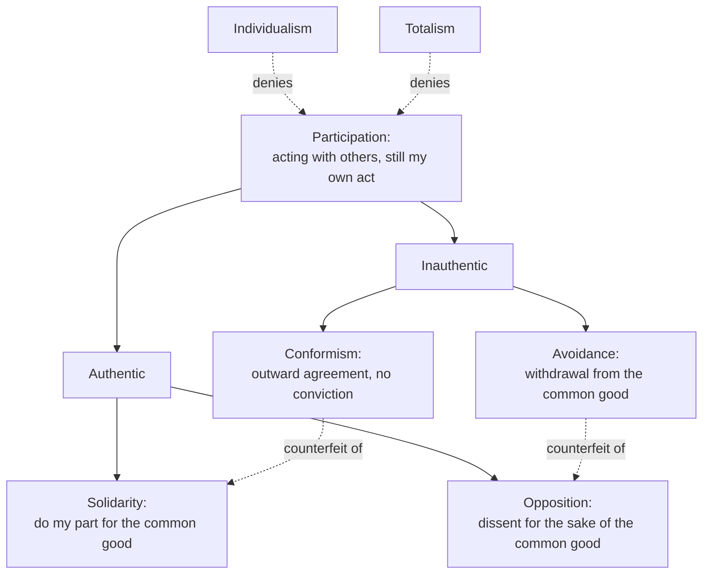

# Phenomenology & Personalism · Lesson 5.5: Integration, participation and the bridge

> ⏱ ~15 min · Module 5: Wojtyła: the acting person · Builds on: [5.4 Action reveals the person](05-04-action-reveals-the-person.md), [5.2 The personalistic norm](05-02-the-personalistic-norm.md) · Unlocks: [`moral-theology`](../../moral-theology/syllabus.md), [`catholic-social-teaching`](../../catholic-social-teaching/syllabus.md)

## Why this matters

[5.4](05-04-action-reveals-the-person.md) left three questions open. If the person rises above what happens in him, are his body and emotions just obstacles? If he determines himself, is acting with others a loss of self? And can an analysis that starts from experience reach what a Thomist calls the *suppositum*, the subject that exists and acts? Parts III and IV of *The Acting Person* answer the first two. The essay "Subjectivity and the Irreducible in Man" (English, 1978) answers the third. Most of the library's use of John Paul II hangs on these answers: *Fides et Ratio* asks philosophy to pass "from phenomenon to foundation" (§83), and the social encyclicals use solidarity.

## The idea

**Integration** (Part III: ch. 5, "Integration and the soma"; ch. 6, "Personal integration and the psyche"). In 5.4, self-determination raised the person above his dynamisms: vertical transcendence. Integration is its complement. In a full act the person also takes his dynamisms *into* the act, so the action belongs to the whole man ([integration](../reference.md#integration), *integracja*). The **soma** has its own dynamism: *reactivity*, the body responding to stimuli by itself (pulse, reflex, the body's growth and rhythms), plus movement that action can use. The **psyche** has *emotivity*: excitations, feelings and emotions, which Wojtyła reads as responses to values. Neither is the enemy. Integration means these dynamisms come under self-possession and self-governance and serve the act: trained hands that obey, a fear that sharpens attention. *Disintegration* is the failure of that. A dynamism runs past the person's command, and panic, compulsion or a body out of control takes the act over. Disintegration is a defect of self-governance, not of the body.

**Participation** (Part IV, ch. 7, "Intersubjectivity by participation"). People constantly act "together with others". That is a fact about outcomes. [Participation](../reference.md#participation) (*uczestnictwo*) is a property of the person in that fact: in acting together, he still performs *his own* act and fulfils himself in it, because he chooses the group's aim as a good he also sees as his. Two systems fail this test. In **individualism**, others are a limit and the community exists only to guard my good. In **totalism**, the individual is subordinate and the common good is imposed on him. Both, for Wojtyła, deny that a person can participate.

Participation shows itself in [four attitudes](../reference.md#authentic-and-inauthentic-attitudes):

- **Solidarity** (authentic): a standing readiness to do one's part for the common good. That means one's own part, not taking over other people's.
- **Opposition** (authentic): disagreeing with how the common good is understood or pursued, *for the sake of* that good. The opponent wants to participate more, not less, so opposition needs dialogue and a community that allows it.
- **Conformism** (inauthentic): outward agreement without conviction, going along to avoid trouble. The conformist acts with the group, but in him "something happens" rather than "man acts".
- **Avoidance** (inauthentic; also rendered non-involvement or evasion): withdrawing from the community and its good. It can be a deliberate protest against a community that gives no room to participate, but it still gives participation up.

One reference point is deeper than all of these. Being a **member** of this firm or this nation is narrower than being a **neighbour**, sharing in the humanity of every other person. For Wojtyła the neighbour relation is the root of every other form of participation, and the commandment of love makes it explicit. Participation is the social face of the [personalistic norm](../reference.md#personalistic-norm): acting together without using one another.

**The bridge** ("Subjectivity and the Irreducible in Man"; Polish *Podmiotowość i "to, co nieredukowalne" w człowieku*). Wojtyła names two ways of understanding the human being ([cosmological and personalist approaches](../reference.md#cosmological-and-personalist-approaches)). The **cosmological** approach is Aristotle's: the human being is a rational animal, defined by genus and difference as one kind of thing in the world, and explained from what he shares with it. The **personalist** approach attends to subjectivity as it is lived (*przeżycie*, lived experience). That is the irreducible: what cannot be derived from the cosmological terms and must be described as it shows itself. The two approaches are complementary, not rivals. Boethius's definition, *an individual substance of a rational nature* ([`metaphysics` 6.5](../../metaphysics/lessons/06-05-what-a-person-is.md)), on Wojtyła's reading marks out the ground of being on which personal subjectivity is realized. Experience builds on that ground. In the order of knowing, action comes first. In the order of being, *operari sequitur esse* (acting follows being) still holds. The companion essay "The Person: Subject and Community" calls the *suppositum* metaphysical in a sense that is "through-the-phenomenal": given *in* the phenomena, not behind them like Kant's thing in itself.

## The argument

Paraphrased from *The Acting Person* Parts III–IV and "Subjectivity and the Irreducible in Man". Cite *The Acting Person* by part and chapter, since the 1979 English diverges from the 1969 Polish.

1. **The experience of man gives the person as one who acts (5.4).** *In words:* the starting point is doing, not a definition.
2. **In acting, the person both transcends his dynamisms and integrates them into the act.** *In words:* he governs his body and emotions and acts through them.
3. **Acting together with others keeps its personal value only by participation: choosing the common good as one's own.** *In words:* a group act need not be something that happens to me.
4. **What is given across all three is a subject that can be reduced neither to its dynamisms nor to the group: the irreducible.**
5. **That subject is given through the phenomena as the one who exists and acts, the *suppositum*. Boethius's definition marks out its terrain, and *operari sequitur esse* links acting to that being.**
6. **∴ Phenomenological description of the person and Thomist metaphysics of the person are complementary.** *In words:* the cosmological approach says what a person is, the personalist approach shows who, and each needs the other.

**Where the argument is weakest.** Premise 5, attacked from both sides. The Lublin Thomist Mieczysław Krąpiec, reviewing the book (*Analecta Cracoviensia*, 1973–74), denied that it reached an adequate philosophical anthropology: it was an "aspect anthropology", built for the ethicist's use. Later commentators sharpen the Thomist worry: the person's being is presupposed, not established. Description shows how the person appears in action, and the metaphysics is brought in, not reached. From the other side, a Husserlian objects that the *suppositum* is exactly the kind of existence-thesis the [epoché](../reference.md#epoche) suspends ([1.3](01-03-the-epoche-and-the-reductions.md)), so "through-the-phenomenal" smuggles a metaphysics into what claims to be description. Defenders answer each. To the Thomist: Wojtyła never claimed to deduce the *suppositum* from experience. He claimed that experience gives a subject which the Boethian definition already names, and that the definition alone misses the irreducible. To the Husserlian: Wojtyła never performed the transcendental reduction (5.4's Watch out). His "experience of man" includes the existence of the one acting, as the Göttingen realists, Stein among them, had insisted against the reduction ([1.3](01-03-the-epoche-and-the-reductions.md), [4.4](04-04-stein-the-person-and-aquinas.md)). Whether that answers both critics or only stops talking to one of them is the open question of the module.

## Picture

On a common reading, each inauthentic attitude counterfeits an authentic one. Conformism looks like solidarity but lacks conviction. Avoidance looks like principled dissent but leaves the common good. The two systems at the bottom deny participation from opposite ends: the individual against the group, the group against the individual.

## Worked examples

**Example 1 (clean: the rescue).** A firefighter goes into a smoke-filled flat with her crew. Her pulse races and her breathing quickens (somatic reactivity); fear rises (psychic emotivity). She controls her breathing as trained, uses the fear as vigilance, and keeps her place in the search pattern. That is integration. Body and emotion are taken into the act and serve it; they neither run it nor are switched off. In the crew she does her own sector, not a colleague's, and trusts the others with theirs: solidarity. At the debrief she argues that the search pattern wasted two minutes and proposes another. That is opposition, aimed at doing the common task better. Had she panicked and bolted, it would be disintegration. Had she kept quiet about the pattern so as not to annoy the chief, it would be conformism.

**Example 2 (hard: the analyst who leaves).** A data analyst finds her firm overstating a product's safety record. She raises it internally, is overruled, then reports it to the regulator and resigns. Opposition or avoidance? Up to the report, it is plainly opposition: dissent for the sake of a good she shares with the firm. The resignation looks like avoidance, since she leaves the community. Wojtyła has two resources. Avoidance can be a deliberate protest when a community gives no room to participate. And the neighbour relation is deeper than membership, so her report participates in the good of the people at risk even as she leaves the firm. But the account strains. The attitudes are interior: from outside, principled exit and a sulk look the same. It also gives no rule for when a community has shut participation down enough to justify leaving it. It names the attitudes; it does not say when withdrawal becomes the authentic option.

## Watch out

- **You might think "participation" means taking part, or Aquinas's participation in being, but it is neither.** In the Thomist sense a creature has *esse* received from God ([`thomistic-synthesis` 2.3](../../thomistic-synthesis/lessons/02-03-participation.md)). That is a metaphysics of being. Wojtyła's *uczestnictwo* is a property of the person acting with others. And taking part without conviction is exactly what conformism is, so "she participated" in the everyday sense may describe its counterfeit.
- **You might think opposition is the inauthentic attitude because it breaks unity, but actually it is authentic.** The inauthentic pair is conformism and avoidance. Conformism also resembles Heidegger's *das Man* ([2.3](02-03-the-they-mood-and-care.md)), but the differences matter. *Das Man* is a structure of everyday existence. Conformism is an attitude measured against a common good, and a person can be faulted for it.
- **You might think the personalist approach replaces the cosmological one, but Wojtyła calls them complementary.** He keeps Boethius's definition and denies only that it is enough. Reading him as rejecting the definition turns the bridge into a demolition.

## One-liner

> The person who acts takes his body and emotions into the act (integration) and acts with others without being absorbed or used (participation: solidarity and opposition, not conformism or avoidance). What experience shows, in Wojtyła's claim, is the very subject Boethius defined, given through the phenomena, not behind them.

## Problems

**P1 (🟢) *(Exegetical (a) · Evaluative (b).)*** Apply to a hard case. A staff association at a hospital votes on a deal: a one-year pay freeze in exchange for no layoffs. (i) Amara studies the figures, votes yes because the deal protects the most junior staff, and volunteers to explain it at the night-shift meeting. (ii) Ben argues against it at the meeting, proposes a phased freeze instead, loses, and says he will keep working with the association to review the deal in a year. (iii) Chidi privately thinks the deal is bad but votes yes because the officers are counting hands and he wants no trouble. (iv) Dana stops attending: "They'll do what they want anyway." (a) Name each person's attitude and say what makes it authentic or inauthentic. One sentence each. (b) Elena argues against the deal, loses, and then abstains from all association business for the year as a declared protest. Opposition or avoidance? Any verdict; 80 words or fewer.

**P2 (🟡) *(Exegetical.)*** Find the crux. An invented exchange.

> **Tomasz:** Man is a rational animal, an individual substance of a rational nature. That definition tells us everything essential. Descriptions of lived experience are illustrations; they add nothing to what we know of the person.
>
> **Ola:** The definition is true, but it treats the person as one kind of thing in the world. What makes me a subject is given only in lived experience, and the definition cannot yield it.

(a) Which of Wojtyła's two approaches does each speaker take? Which speaker could Wojtyła accept as stated, and what would he add about how the approaches relate? (b) Name the single premise on which they part ways, and say what would move Tomasz. 100 words or fewer for (b).

**P3 (🔴) *(Evaluative.)*** Steelman and reply. A five-person research group must choose between two projects and can fund only one. It votes 3–2 to drop Rafael's project, and Rafael must now work on the winning one. An objector says: "Majority decision uses the outvoted as means to the group's end. Rafael's work now serves a goal he rejected, so participation is incompatible with the personalistic norm whenever a group decides." Give the objection at its strongest, then the best reply from Wojtyła's account of participation, and say where the reply stops deciding. 150 words or fewer.

Solutions

**P1** *(Exegetical (a) · Evaluative (b).)*

**Accept:** in (b), either verdict, if the reasoning uses the test of whether her withdrawal is still oriented to the common good.

**Must hit, strict (a):**

- Amara: solidarity. She chooses the common good as her own and does her part (explaining the deal) without taking over others' parts.
- Ben: opposition, which is authentic. He dissents about how the common good is pursued, for its sake, and stays in the association.
- Chidi: conformism, which is inauthentic. Outward agreement without conviction; in Wojtyła's terms his vote is closer to something happening in him than to his own act.
- Dana: avoidance, which is inauthentic. She withdraws from the community and its good instead of participating.

**Must hit, any verdict (b):**

- Say that avoidance can be a deliberate protest, and that what separates it from opposition is whether she stays oriented to the common good and to dialogue.
- Say what fact about Elena or the association would decide it (whether the association left room to participate; whether her protest seeks to reopen the question).

**Wrong turns:** calling Ben's dissent inauthentic because it breaks unity. Calling Chidi solidary because he voted with the majority; the vote's content is not the test, the conviction is.

**Model answer (b), one of several:** Avoidance, probably. Unlike Ben, she gives up participation for a year rather than working to change the deal. Wojtyła allows that withdrawal can be a deliberate protest, and her declaration makes it a chosen act, not a drift. But the protest is aimed at the association, not at a better common good, and she leaves no channel for dialogue. If the association had silenced dissent, her exit would look more like opposition by the only means left.

---

**P2** *(Exegetical.)*

**Must hit, strict (a):**

- Tomasz takes the cosmological approach (genus and difference, the human as one kind of thing in the world). Ola takes the personalist approach (subjectivity given in lived experience, the irreducible).
- Wojtyła could accept Ola as stated: she keeps the definition ("true") and holds that subjectivity must be described. He would add that the approaches are complementary: the definition marks out the ground of being, and the description of the irreducible builds on it. Tomasz denies that experience adds anything, which Wojtyła rejects.

**Must hit, strict (b):**

- The crux: whether lived experience of subjectivity gives knowledge of the person that the definition does not already contain. Tomasz denies it; Ola affirms it.
- What would move Tomasz: a feature of the person given in experience that cannot be derived from "individual substance of a rational nature", such as self-determination, the self as the object of its own act (5.4).

**Wrong turns:** saying Ola rejects Boethius; she grants the definition is true. Making the crux whether the person is a substance; both grant it.

**Model answer (b), one of several:** They part on whether lived experience adds knowledge of the person beyond the definition. Tomasz says the definition contains everything essential and experience only illustrates it. Ola says subjectivity, the person as the one living and authoring his acts, cannot be derived from genus and difference and must be described. What would move Tomasz is a case: self-determination, where the person is the object of his own act. If "rational nature" does not yield that structure without the description, experience has added something.

---

**P3** *(Evaluative.)*

**Accept:** any verdict on whether the reply succeeds, if both sides are stated at full strength.

**Must hit, any verdict:**

- State the objection precisely: the norm forbids treating a person merely as a means (5.2); after the vote, Rafael's work serves an end he did not choose; so the group uses him.
- Give Wojtyła's reply: participation does not require agreeing with every decision. Rafael can choose the common good of the group (its shared research, each member's fulfilment in it) as his own while opposing this decision. Opposition is authentic participation. Only a totalist group, which imposes its good and allows no dissent, uses him.
- Say where the reply stops deciding: how much overruling a member can absorb before the common good is no longer his, and whether the group's procedure keeps room for opposition.

**Wrong turns:** answering that majority rule is fair, which changes the subject from use to procedure. Treating Rafael's continued work as conformism by definition; he may work with conviction about the common good while dissenting about the project.

**Model answer, one of several:** At its strongest, the objection says Rafael's labour now serves a goal his own judgment rejected, so he is directed to an end not his own: use as a means. Wojtyła replies that participation never meant agreeing with each decision. Rafael can will the group's common good, a shared programme in which each member's work is his own, while opposing this choice and arguing for revisiting it. Opposition is an authentic form of participation. He is used only if the group is totalist: if it imposes its aim and shuts down dissent. The reply works when the common good is really shared and dissent stays possible. It does not say how often a member can be outvoted before the group's good stops being his. At that point avoidance may become his only honest option.

## Flashback

**From Lesson [5.3](05-03-the-anatomy-of-love.md) (The anatomy of love):** *(Exegetical.)* Diagnose. An invented forum post:

> Wojtyła's ethics of love comes down to three rules. First, real love wants nothing for itself: the moment I want something from a friend, even her conversation, because it does me good, I am using her, so mature love strips desire out and leaves pure goodwill. Second, it does not matter what a mutual love rests on, so long as both people love; mutual is mutual. Third, the gift of self works by surrender: the giver stops being master of himself, and the less of himself he keeps, the more he loves.

Name what each rule gets wrong about Wojtyła's analysis, using his terms. Two sentences per rule.

Solution

**Must hit, strict:**

- Rule 1: desire (*pożądanie*, *amor concupiscentiae*: "you are a good for me") is an element of love, because a human being is limited and needs others, and Wojtyła asks that desire be joined to goodwill, not abolished by it. The post runs together love as desire, which wants the person as a good, and concupiscence, which wants an experience; use as enjoyment threatens only when desire rules.
- Rule 2: following Aristotle (*Nicomachean Ethics* VIII), Wojtyła makes the basis of reciprocity decisive. Resting on utility or pleasure, it leaves each side suspecting the other's love is a calculation, and jealousy follows; resting on goodwill toward a true good, it breeds trust.
- Rule 3: only a free, self-possessing subject can give himself, so the gift is an act of self-determination, not its abdication, and the giver is not diminished but finds a fuller existence by going out of himself (the "law of ekstasis"). The person remains incommunicable (*alteri incommunicabilis*): what the order of love achieves is a free gift, not a transfer of ownership.

**Wrong turns:** Conceding rule 1 because Wojtyła calls goodwill love in its most unconditional sense; he says that and still keeps desire in love's structure. Treating rule 2 as merely incomplete ("mutuality is necessary but not sufficient") without naming what the basis changes: suspicion and jealousy against trust. Answering rule 3 with the objection that a "gift of self" either surrenders self-governance or is only a metaphor; that questions whether Wojtyła's account succeeds, while the exercise asks what the post misreports about it. Reading "desire" as lust; the lesson separates love as desire from concupiscence.

**Model answer:** Rule 1: For Wojtyła desire, *amor concupiscentiae*, belongs to love, since a limited being needs others and may take a friend as a good for him. The danger of use comes from desire left to rule, or from concupiscence, which wants the experience instead of the person; goodwill is to be joined to desire, not to replace it. Rule 2: Following Aristotle, Wojtyła makes the basis decisive. Reciprocity resting on usefulness or pleasure breeds the suspicion that the other's love is a calculation, while reciprocity resting on goodwill toward a true good breeds trust. Rule 3: The gift of self is possible only for one who possesses himself, so it is self-determination exercised, not surrendered. The giver is not diminished but finds a fuller existence by going out of himself, and he remains a person no one can own.

## Connections

- **Backward:** transcendence, self-determination and "man acts" are [5.4](05-04-action-reveals-the-person.md) ([self-determination](../reference.md#self-determination); [acts and happenings](../reference.md#man-acts-and-something-happens)). Integration generalizes what [5.3](05-03-the-anatomy-of-love.md) asked of love: sensuality and affectivity taken up into the person's act. Participation applies the personalistic norm of [5.2](05-02-the-personalistic-norm.md) to groups. Boethius's definition is [`metaphysics` 6.5](../../metaphysics/lessons/06-05-what-a-person-is.md). Stein's earlier attempt at the same join is [4.4](04-04-stein-the-person-and-aquinas.md), and the epoché Wojtyła does not perform is [1.3](01-03-the-epoche-and-the-reductions.md).
- **Forward:** *Fides et Ratio* §83 asks philosophy to pass "from phenomenon to foundation", and §59 names those who joined faith with the phenomenological method ([`fundamental-theology` 2.4](../../fundamental-theology/lessons/02-04-fides-et-ratio.md)). The theology of the body and the moral encyclicals use this anthropology ([`moral-theology` 6.1](../../moral-theology/lessons/06-01-the-theology-of-the-body-and-chastity.md), [4.4](../../moral-theology/lessons/04-04-veritatis-splendor.md)). Solidarity as a social virtue and the subjective dimension of work are [`catholic-social-teaching`](../../catholic-social-teaching/syllabus.md) 3.4 and 4.1. Those courses own what the Church teaches with these ideas, and at what level.
- **Sideways:** conformism against *das Man* ([2.3](02-03-the-they-mood-and-care.md)); participation against Marcel's availability ([3.3](03-03-marcel-mystery-presence-and-fidelity.md)) and against Sartre's claim that relations with others are conflict ([3.2](03-02-sartre-the-look.md)). Whether integration of the soma and psyche needs a soul as form, and the analytic debate over embodiment, belong to [`philosophy-of-mind`](../../philosophy-of-mind/syllabus.md) and [`thomistic-synthesis` 5.3](../../thomistic-synthesis/lessons/05-03-the-human-soul-in-the-system.md).

## Closing the course

The course followed one method to its moral payoff. Brentano said mental acts are directed at objects. Husserl turned that claim into a discipline: describe what is given as it is given, bracket the world's existence, and find essences ([1.1](01-01-intentionality-from-brentano-to-husserl.md)–[1.4](01-04-the-lifeworld-and-the-crisis-of-the-sciences.md)). Heidegger, reading Kierkegaard, turned description from consciousness to existence: care, the they, death ([Module 2](02-01-kierkegaard-the-single-individual.md)). Sartre, Marcel and Levinas asked what another person is, and answered with a gaze, a presence and a command ([Module 3](03-01-sartre-existence-precedes-essence-and-bad-faith.md)). Scheler and Stein described values, empathy and the person, and Stein joined the method to Aquinas ([Module 4](04-01-scheler-values-given-in-feeling.md)). Wojtyła took that road and made action the window on the person.

Where to go next: [`moral-theology`](../../moral-theology/syllabus.md) for what the Church teaches with this anthropology; [`catholic-social-teaching`](../../catholic-social-teaching/syllabus.md) for solidarity and work; [`philosophy-of-mind`](../../philosophy-of-mind/syllabus.md) for intentionality, other minds and embodiment in analytic form. Boss 5 asks the question the module leaves open: is Wojtyła's bridge a synthesis or a juxtaposition?
