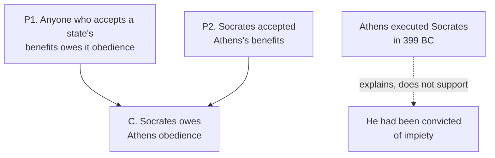

# Philosophical Method · Lesson 1.1: What an argument is

> ⏱ ~15 min · Module 1: The anatomy of an argument · Builds on: nothing — this is the first lesson · Unlocks: [1.2 Validity and soundness](01-02-validity-and-soundness.md)

## Why this matters

Everything else in Philosophy, Politics & Society and Catholic Theology starts here. Before you can ask whether Rawls is right, whether Trent settled a question, or whether a policy memo proves what it claims, you have to find the argument — and most prose hides it. A paragraph can assert, explain, report, insult, or argue, and only the last of those owes you reasons. Readers who cannot tell the difference end up arguing with a weather report.

## The idea

An **argument** is a set of claims offered as reasons to believe another claim. That's it: reasons, plus the thing they're meant to support.

The test that does the most work is the difference between arguing and **explaining**. Compare:

- "The Church forbade usury because Aristotle held that money is sterile." — This is an *explanation*. It takes a fact for granted (the prohibition happened) and tells you what caused it.
- "Money is not sterile, since idle capital could have been invested elsewhere; so the sterility argument fails." — This is an *argument*. It's trying to move you to a conclusion you might not already accept.

Both use "because" or "since." The difference isn't the word, it's the job: an explanation starts from something you already grant and accounts for it; an argument starts from something you already grant and tries to get you somewhere new.

## The argument

An argument in **standard form** is a numbered list of premises followed by a conclusion:

> **P1.** Every citizen who has accepted a state's benefits owes it obedience.
> **P2.** Socrates accepted Athens's benefits.
> **∴ C.** Socrates owes Athens obedience.

In words: the premises are what you're asked to grant; the conclusion is what you're asked to grant *because* of them; the "∴" marks the claim that the first support the second. That claim — the **inference** — is a third thing, separate from whether any premise is true, and it's what Lesson 1.2 tests.

**Indicator words** point to the parts, though they don't guarantee them:

| Usually before a conclusion | Usually before a premise |
|---|---|
| therefore, so, hence, thus, it follows that, we must conclude | because, since, for, given that, as, in view of |

**Finding the conclusion** — the move to practice:

1. Ask what the passage is *trying to get you to accept*. That's the conclusion, wherever it sits — first sentence, last, or buried in the middle.
2. Everything offered in its support is a premise.
3. Discard what does neither: background, hedges, insults, throat-clearing.
4. Check by inserting "therefore" in front of your candidate conclusion. If the passage now reads backwards, you have it upside down.

## Argument map

Solid arrows carry support: the premises are offered as reasons for the conclusion. The dashed arrow is an explanation — the second box is not being *argued for*, it's being *accounted for*. Keeping the two kinds of arrow apart is most of the skill.

## Worked examples

**Example 1 (mechanical — find the parts).**

> "No one should be surprised that turnout fell again. Polling places closed in the poorest wards, the ballot ran to four pages, and the election was held on a working Tuesday."

Is this an argument? Ask what it wants you to accept. Not that turnout fell — that's presupposed, and the opening line says so ("no one should be surprised"). The three facts *account for* a fact already granted. It is an **explanation**, and there is no conclusion to attack; you could only dispute whether those causes really did the work.

Change one word — "No one should *believe* that turnout fell by chance" — and the same three facts become premises for a conclusion you might resist. Same sentences, different job.

**Example 2 (why you'd care — the conclusion in the middle).**

> "Judges are not elected. So a court that strikes down a statute is overruling the only branch the people chose. Legislatures answer to voters every few years; judges hold office for life."

The conclusion is the *second* sentence, flagged by "So." Sentence one is a premise, and sentence three supports the same conclusion from another direction. In standard form:

> **P1.** Judges are not elected.
> **P2.** Legislatures answer to voters at regular elections.
> **∴ C.** A court striking down a statute overrules the only branch the people chose.

Two things are now visible that the prose hid. First, the argument has a gap: nothing yet says the legislature is the *only* elected branch (in a presidential system it isn't). Second, that gap is where the real fight is — and you can only see it once the parts are on separate lines. This is the whole reason for standard form, and Lesson 1.3 makes supplying such gaps a discipline.

## Watch out

- **"Because" doesn't settle it.** It introduces a cause in an explanation and a reason in an argument. Ask what the passage wants you to *accept*, not which connective it used.
- **You might think the conclusion comes last.** It often comes first, and in editorials it's frequently the title. Find it by function, never by position.
- **A rhetorical question can be a conclusion in disguise.** "Can a Church that changed its teaching on usury really claim to be unchanging?" asserts that it cannot. Rewrite it as a flat statement before you assess it — half the force usually evaporates, which tells you something.

## One-liner

> An argument offers reasons for something you might not yet accept; an explanation gives causes for something you already do.

## Problems

**P1 (🟢) *(Exegetical.)*** For each passage, say whether it is an argument or an explanation, and if it is an argument, state its conclusion in one sentence.

(a) "Attendance at Mass collapsed in the 1970s because the generation that filled the pews had been raised in an immigrant Church that was dissolving into the suburbs."
(b) "A regime that jails its opponents cannot call its elections free. Ours jailed two candidates last spring."
(c) "Every serious historian agrees the Inquisition killed fewer people than the myth claims. So the myth survives for reasons that have nothing to do with the evidence."

**P2 (🟡) *(Exegetical.)*** Put this passage into standard form — numbered premises and a conclusion — discarding anything that does no argumentative work. 150 words or fewer.

> "Let's be honest about what the sponsors want. Any city that caps rents will see landlords leave the market, because a capped return is still a return only if you can cover the mortgage, and mortgages have doubled. Fewer landlords means fewer units, and this council has spent three years promising more units, not fewer. The cap is a mistake."

**P3 (🔴, optional) *(Exegetical.)*** This passage contains a main conclusion and a sub-conclusion — a claim that is argued for and *then* used as a premise. Map it: which claim supports which, and which is the main conclusion? 150 words or fewer.

> "Nobody chooses the family they are born into. So a person's starting wealth is not something they earned. And what you did not earn, you have no claim of desert on — desert is built on what we do, not on what happens to us. Inheritance taxes therefore take nothing that the heir deserved."

Solutions

**P1** *(Exegetical — strict.)*

**Must hit, strict:**
- (a) **Explanation.** The collapse is granted, not argued; the passage gives its cause.
- (b) **Argument.** Conclusion: *our elections are not free* (equivalently, this regime cannot call its elections free). The general principle and the fact about jailed candidates are the premises, and the conclusion is left unstated — which is fine to name explicitly.
- (c) **Argument.** Conclusion: *the myth survives for reasons unrelated to the evidence*. The agreement of historians is the premise.

**Wrong turns:** calling (a) an argument because it contains "because"; giving (b)'s conclusion as "a regime that jails opponents cannot call its elections free" — that's the premise. The conclusion is the claim about *our* elections that the two premises jointly deliver.

**Model answer:** (a) Explanation — the fall in attendance is assumed and then accounted for. (b) Argument — conclusion: our elections are not free, since we jailed two candidates and a regime that jails opponents cannot hold free elections. (c) Argument — conclusion: the myth's survival has causes other than the evidence.

---

**P2** *(Exegetical — strict.)*

**Must hit, strict:** the conclusion is *the rent cap is a mistake* (or: the council should not pass it). The premises are the chain: capped returns don't cover doubled mortgages → landlords leave → fewer units; plus the council's commitment to more units. The first sentence ("let's be honest about what the sponsors want") is discarded — it does no argumentative work.

**Wrong turns:** keeping the sponsors' motives as a premise; making "fewer landlords means fewer units" the conclusion, when it is a step toward one.

**Model answer:**
> **P1.** A capped return covers a landlord's costs only if it covers the mortgage.
> **P2.** Mortgages have doubled, so capped returns will not cover them.
> **P3.** Landlords who cannot cover costs leave the market.
> **P4.** Fewer landlords means fewer available units.
> **P5.** This council is committed to increasing the number of units.
> **∴ C.** The rent cap is a mistake.

---

**P3** *(Exegetical — strict.)*

**Must hit, strict:** the sub-conclusion is *starting wealth is not earned*, supported by *nobody chooses their family*. That sub-conclusion then joins the desert principle (*you have no claim of desert on what you did not earn*) to yield the main conclusion: *inheritance taxes take nothing the heir deserved*. Identifying "therefore" in the last sentence as marking the main conclusion is the key move.

**Wrong turns:** listing all four claims as premises for one conclusion, which loses the two-stage structure; treating the desert principle as the main conclusion because it sounds most general.

**Model answer:**
> **P1.** Nobody chooses the family they are born into.
> **∴ S.** (sub-conclusion) A person's starting wealth is not earned.
> **P2.** You have no claim of desert on what you did not earn.
> **S + P2 ∴ C.** Inheritance taxes take nothing the heir deserved.

Two arrows, not one: P1 supports S, and S with P2 supports C.

## Connections

- **Forward:** [1.2](01-02-validity-and-soundness.md) asks whether the premises you've isolated actually deliver the conclusion, and [1.3](01-03-reconstruction-and-charity.md) makes supplying the missing ones — like the "only elected branch" gap in Example 2 — a disciplined move rather than a favour.
- **Sideways:** the argument-versus-explanation line is the same one [`philosophy-of-science`](../../philosophy-of-science/syllabus.md) draws when it asks what a scientific explanation *is*, and the distinction that [`social-theory`](../../social-theory/syllabus.md) needs to tell a causal story about a society from a case for changing it.
- **Where it bites hardest:** in [`history-of-political-thought`](../../history-of-political-thought/syllabus.md) and the theology courses, where a passage from Aristotle, Augustine or a conciliar decree may be doing any of the four jobs in a single paragraph.
