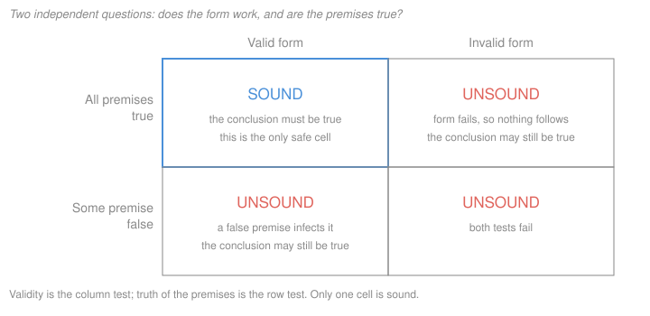

# Philosophical Method · Lesson 1.2: Validity and soundness

> ⏱ ~15 min · Module 1: The anatomy of an argument · Builds on: [1.1 What an argument is](01-01-what-an-argument-is.md) · Unlocks: [1.3 Reconstruction and charity](01-03-reconstruction-and-charity.md)

## Why this matters

Almost every unproductive argument you have ever watched was two people answering different questions at once — one disputing whether the reasoning holds, the other disputing whether the premises are true. Separating those two questions is the single highest-leverage habit in this course. It also gives you the one genuinely mechanical tool philosophy has: a way to *prove* that an argument fails, without knowing anything about the subject matter.

## The idea

Take an argument in standard form and ask two questions, in this order:

1. **If the premises were all true, would the conclusion have to be true?** This is about form, and the answer is yes or no regardless of what the world is like.
2. **Are the premises in fact true?** This is about the world, and often it's the hard part.

An argument that passes the first test is **valid**. One that passes both is **sound**. The order matters: if the reasoning doesn't hold, the truth of the premises buys you nothing, so test the form first — it's cheaper.

The surprising part is that validity has nothing to do with whether the premises *are* true. "All fish are mammals; every whale is a fish; therefore every whale is a mammal" is a perfectly valid argument with two false premises and a true conclusion. Validity is a promise about the *link*: it says the premises, if granted, transmit their truth. It says nothing about whether they deserve to be granted.

## The argument

**Validity.** An argument is valid when it is *impossible* for all its premises to be true and its conclusion false at the same time. In words: there is no way the world could be that makes the premises come out true while the conclusion comes out false.

**Soundness.** An argument is sound when it is valid *and* all its premises are true. In words: the form works and the inputs are good, so the conclusion is true. This is the only combination that establishes anything.

Four combinations, only one of which is worth having:

| | Valid | Invalid |
|---|---|---|
| **All premises true** | **Sound** — conclusion must be true | Unsound — conclusion unsupported |
| **Some premise false** | Unsound — conclusion may be anything | Unsound — nothing works |

**The counterexample method.** To show an argument invalid, do not argue about its subject. Instead:

1. Strip the argument to its **form**, replacing its content terms with letters.
2. Build a *new* argument with the same form, whose premises are obviously true and whose conclusion is obviously false.
3. That new argument is plainly bad, so the form cannot be truth-preserving, so the original is invalid.

In words: you refute a *pattern* by finding one case where the pattern fails. This is decisive, it takes a sentence, and it is the reason "that's like arguing…" is a real move rather than a rhetorical one.

## Picture

## Worked examples

**Example 1 (mechanical — running both tests).**

> **P1.** Every doctrine taught by an ecumenical council is binding on Catholics.
> **P2.** The divinity of Christ was taught by an ecumenical council.
> **∴ C.** The divinity of Christ is binding on Catholics.

Test 1: if both premises were true, could the conclusion be false? No — the form is "all A are B; this is an A; so this is a B." **Valid.** Test 2: are the premises true? P2 is straightforwardly so (Nicaea). P1 is where a theologian would want distinctions, since conciliar documents contain teachings of different weights. So the argument is valid; whether it is *sound* turns entirely on P1 — and that is now a precise, answerable question rather than a general unease. Notice what the split bought: an argument you can't fault as reasoning, with the whole dispute driven into one line.

**Example 2 (why you'd care — refuting a form in one move).**

> "If a policy were popular, the opposition wouldn't be campaigning against it. They are campaigning against it. So it isn't popular."

Strip it to form: *If P then not-Q. Q. Therefore not-P.* That form holds — it is modus tollens, and no counterexample can be built for it. The weakness is P1: oppositions campaign against popular policies all the time, sometimes precisely because they are popular. So the argument is **valid but unsound**, and the only productive reply attacks the premise. Shouting "fallacy" here would be a mistake, and an expensive one: the arguer would be right that the reasoning holds, and the real weakness would go unchallenged.

Now a genuine failure:

> "If the reform were working, crime would be falling. Crime is falling. So the reform is working."

Form: *If P then Q. Q. Therefore P.* Counterexample with the same form: *If it rained last night, the street is wet. The street is wet. Therefore it rained last night.* Both premises can be true — a street-cleaning truck came by — while the conclusion is false. The form fails, so the original argument is **invalid**, whatever the crime statistics say. That is the whole method: one sentence, no criminology required.

## Watch out

- **You might think "valid" means "good."** In ordinary speech "that's a valid point" means "true and relevant." Here it means only that the link holds. An argument can be valid and ridiculous.
- **You might think a true conclusion rescues an argument.** It doesn't. Arriving somewhere true by a broken route leaves you with no reason to believe you're there — and the route will fail you next time.
- **You might think invalid means the conclusion is false.** It means the conclusion isn't *established*. The reform may well be working; this argument just hasn't shown it.
- **A counterexample must share the form, not the topic.** Wet streets and crime statistics have nothing in common, and that's precisely why the counterexample works: it isolates the pattern.

## One-liner

> Validity is a promise about the link, soundness a promise about the link and the inputs — and one well-chosen counterexample breaks the link forever.

## Problems

**P1 (🟢) *(Exegetical.)*** For each argument, say whether it is valid, and whether it is sound. One sentence each.

(a) **P1.** Every government that suspends elections is authoritarian. **P2.** No democracy is authoritarian. **∴ C.** No democracy suspends elections.
(b) **P1.** All popes have been Italian. **P2.** Francis was a pope. **∴ C.** Francis was Italian.
(c) **P1.** If a text is in the canon, the Church received it as scripture. **P2.** The Church received Sirach as scripture. **∴ C.** Sirach is in the canon.

**P2 (🟡) *(Evaluative.)*** Show that this argument is invalid by constructing a counterexample with the same form — premises obviously true, conclusion obviously false. State the form in letters first. 150 words or fewer.

> "Every regime that fell in the last century lost the loyalty of its army first. Our regime still has its army. So it will not fall."

**P3 (🔴, optional) *(Exegetical, then evaluative.)*** (a) The argument below is invalid as written. Say why, in one sentence. (b) Add the single weakest premise that makes it valid — weakest meaning: the one that claims least while still doing the job. (c) Now that the premise is explicit, say what someone would have to show to defeat the argument. 150 words or fewer for (b) and (c) together.

> "The council never defined the matter. So Catholics are free to disagree about it."

Solutions

**P1** *(Exegetical — strict.)*

**Must hit, strict:**
- (a) **Valid.** If every election-suspender is authoritarian and no democracy is authoritarian, no democracy can be an election-suspender. Soundness depends on P1, which is arguable (emergency suspensions in wartime democracies), so: valid, soundness contested.
- (b) **Valid, unsound.** The form is impeccable; P1 is false — Francis was Argentine, and several popes were not Italian.
- (c) **Invalid.** Form: *If P then Q. Q. Therefore P* — affirming the consequent. Reception as scripture is what the premise says canonicity implies, not what implies it.

**Wrong turns:** calling (b) invalid because its conclusion is false — the conclusion's falsity here comes from a false premise, not a broken link; calling (c) valid because the conclusion happens to be true (Sirach is in the Catholic canon).

**Model answer:** (a) Valid; sound only if P1 survives scrutiny. (b) Valid but unsound — P1 is false. (c) Invalid — it affirms the consequent, even though its conclusion is true.

---

**P2** *(Evaluative — the counterexample must work; any well-formed one passes.)*

**Must hit:**
- State the form: *All F are G. This is not G. Therefore this is not F.* (Every regime that fell lost its army; ours hasn't lost its army; so ours won't fall.) The flaw: the premise says losing the army accompanied past falls, not that keeping it prevents a fall — the premise gives a necessary-looking condition drawn only from *past* cases and treats it as sufficient for survival.
- Build a same-form counterexample with true premises and a false conclusion.

**Wrong turns:** arguing about this regime's army instead of the form — that answers a different question; offering a counterexample whose premises are themselves disputable, which weakens the refutation.

**Model answer:** Form: every F that ended was G first; this F is not G; therefore this F will not end. Counterexample: "Every person who has died so far was born before today. I was not born before today's cases. So I will not die." Or more cleanly: "Every building that has burned down had faulty wiring. This building has sound wiring. So it will not burn down." Premises can be granted; the conclusion is false, since buildings burn for other reasons. The form doesn't preserve truth, so the regime argument is invalid — a regime can fall for a reason no previous regime fell for.

---

**P3** *(a) exegetical — strict; (b)–(c) evaluative.*

**Must hit, strict (a):** as written there is a gap — nothing connects "not defined by a council" to "free to disagree." Defining is one way teaching binds; the argument assumes it is the only way.

**Must hit (b), any formulation that does the job:** supply something like *"Catholics are free to disagree about any matter a council has not defined."* Weakest-premise discipline: don't supply a stronger claim such as "only conciliar definitions bind," which asserts more than the argument needs.

**Must hit (c):** name what defeats it — show a way teaching binds without a conciliar definition (the ordinary universal magisterium, a papal definition, a definitive teaching). Any verdict on whether the argument survives passes, as long as the added premise is what gets attacked.

**Wrong turns:** rewriting the conclusion instead of supplying a premise; adding several premises when one suffices; treating the argument as valid as written because its conclusion sounds plausible.

**Model answer:** (a) Invalid — a missing link between "undefined by a council" and "open to disagreement." (b) Add: *any matter not defined by a council is open to disagreement among Catholics.* The argument is now valid. (c) That premise is exactly what an opponent attacks: they need only exhibit one binding teaching that no council defined, which is what the levels of authority in [`fundamental-theology`](../../fundamental-theology/syllabus.md) are for. The argument stands or falls there, not on the historical claim about councils.

## Connections

- **Backward:** [1.1](01-01-what-an-argument-is.md) got the parts onto separate lines; validity is the test of the "∴" between them.
- **Forward:** [1.3](01-03-reconstruction-and-charity.md) turns P3's move — supplying the weakest premise that makes an argument valid — into a standing discipline, and [1.4](01-04-argument-forms-and-formal-fallacies.md) names the forms that keep recurring, including the affirming-the-consequent pattern from Example 2.
- **Sideways:** [`mathematical-logic`](../../mathematical-logic/syllabus.md) makes this precise with truth-table semantics and a proof system; here validity stays informal, tested by counterexample rather than by derivation.
