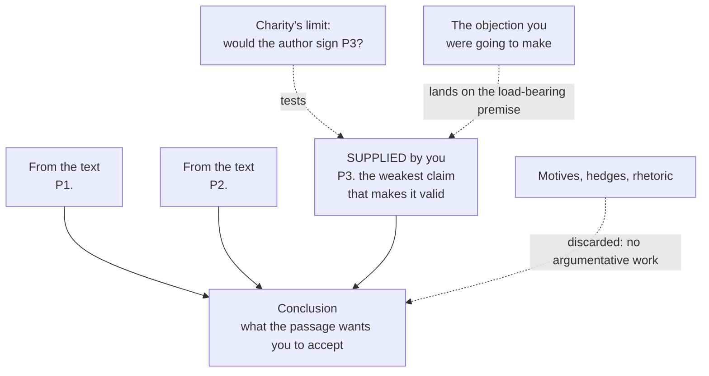

# Philosophical Method · Lesson 1.3: Reconstruction and charity

> ⏱ ~15 min · Module 1: The anatomy of an argument · Builds on: [1.2 Validity and soundness](01-02-validity-and-soundness.md) · Unlocks: [1.4 Argument forms and formal fallacies](01-04-argument-forms-and-formal-fallacies.md)

## Why this matters

Nobody writes in standard form. Locke, Mill, an encyclical, a committee memo — every one of them omits the premise it thinks too obvious to say, and that omitted premise is usually the one the whole thing turns on. Reconstruction drags it into the open. It is also the most abusable move in the course: the same licence that lets you supply a missing premise lets you install a stupid one and declare victory. What follows is the discipline that keeps the first from becoming the second.

## The idea

An argument with a premise left unstated is an **enthymeme** — which is to say, nearly every argument you will ever read. "Socrates is a man, so he is mortal" is missing "all men are mortal," and nobody minds, because the missing line is one everybody grants. The interesting cases are the ones where the missing line is exactly what a reader should refuse to grant, and where leaving it out is how the argument survives.

Getting it out requires holding two pressures against each other:

- **Fidelity.** Reconstruct *this* argument, not a nearby one you find more interesting.
- **Charity.** Among the readings the text permits, take the one on which the argument comes out strongest.

Charity is not politeness. It is self-interest: if you refute a weak reading, the author says "that isn't what I meant" and you have wasted an afternoon. But charity has a hard limit — **the strongest version the author would still sign.** Build past that and you have an excellent argument that nobody made, and no one to hold responsible for it.

## The argument

Reconstruction is a five-step procedure. Steps 1–3 are already yours from the last two lessons.

1. **Find the conclusion.** What is the passage trying to get you to accept? ([1.1](01-01-what-an-argument-is.md))
2. **List what is offered in support, and discard the rest.** Motives, hedges, throat-clearing and insults do no argumentative work.
3. **Test validity.** Do the stated premises already deliver the conclusion? ([1.2](01-02-validity-and-soundness.md)) If yes, stop — there is nothing to supply.
4. **If invalid, supply the missing premises,** marking each supplied line as yours.
5. **Locate the load-bearing premise** — the one the argument can least afford to lose.

Step 4 runs under two rules:

> **Rule 1 (charity).** Of the readings the text permits, take the one that makes the argument strongest — but never one the author would disown.
>
> **Rule 2 (the weakest-premise rule).** Supply the *logically weakest* premise that makes the argument valid: the one that claims the least while still doing the job.

In words: charity chooses the *reading*, and the weakest-premise rule chooses the *addition*. Rule 2 has a reason behind it that is worth internalising. Anything you supply becomes a target — so if you hand the author a sweeping premise when a modest one would have sufficed, the opponent knocks over the sweeping version and both of you mistake that for a refutation. Supply the least that works, and the argument can only be beaten by beating something it genuinely needs.

**Careful — "weakest" is doing two jobs.** In Rule 2, *weakest* means *claims least* and is a virtue: you want the weakest premise that validates. In step 5, "find the weakest premise" means *most likely to be false* — the weak point, where an objection should land. Rule 2 is about what you add; step 5 is about what you attack. When the two might be confused below, step 5's sense is called the **load-bearing premise**.

**The exegetical kind, named.** This is the first course skill whose problems have right answers, so it is where the first **problem kind** gets its name. An **exegetical** problem asks what a text, principle or doctrine actually says or implies — and it is graded **strictly**, on two things only: *fidelity* (every premise traceable to the text, or a licit supply under Rules 1–2; the conclusion the one the passage actually wants) and *validity* (the reconstruction reaches it). Not on style, not on elegance, and emphatically not on whether the argument is any good — that is a separate, evaluative question you are not being asked yet. A graceless reconstruction that is faithful and valid is a full-marks answer. A beautiful one that quietly improves the author's argument is wrong.

## Argument map

Solid arrows are support; dashed arrows are everything else. Two features of the shape matter more than the content. First, the supplied box is marked as supplied — a reconstruction that hides which lines came from you is unauditable. Second, the objection and the charity test both point at the same box, which is the usual outcome: the line the author didn't bother to write is the line the argument stands on.

## Worked examples

**Example 1 (mechanical — the five steps on an invented policy paragraph).**

> "In its first year the Ninth Street pilot bike lane saw injury collisions fall by a third. This council ran on evidence-led streets. So make the lane permanent — and put the same design on Eleventh, which carries the same traffic."

*Step 1.* Two conclusions, joined: make the Ninth Street lane permanent, and extend the design to Eleventh. *Step 2.* Offered in support: the collision figure, and the fact that Eleventh carries the same traffic. "This council ran on evidence-led streets" is a jab about consistency; it adds no reason the collision figure doesn't already give, so it goes. *Step 3.* Invalid as it stands — a fall in collisions is not yet a reason to do anything. *Step 4.* Supply, weakest-first:

> **P1.** Injury collisions on Ninth Street fell by a third in the lane's first year. *(text)*
> **P2.** *(supplied)* The lane caused that fall.
> **P3.** *(supplied)* A street design that reduces injury collisions should be kept.
> **∴ C1.** The Ninth Street lane should be made permanent.
> **P4.** Eleventh Street carries the same traffic as Ninth. *(text)*
> **P5.** *(supplied)* A design that reduces collisions on one street will do so on a street with the same traffic.
> **∴ C2.** The same design should go on Eleventh.

Notice Rule 2 at work in P3. The tempting supply is "the council should always follow the evidence" — grander, and a gift to anyone who can name one case where it shouldn't. P3 claims less and does the same job. *Step 5.* The load-bearing premise is P2: one street, one year, no control, and collisions fall for a dozen reasons at once. That is now a precise empirical question, which is the entire payoff — the paragraph's weakness was never its rhetoric.

**Example 2 (where it strains — Locke, and the limit of charity).**

> "Though the earth, and all inferior creatures, be common to all men, yet every man has a property in his own person: this no body has any right to but himself. The labour of his body, and the work of his hands, we may say, are properly his. Whatsoever then he removes out of the state that nature hath provided, and left it in, he hath mixed his labour with, and joined to it something that is his own, and thereby makes it his property."
> — Locke, *Second Treatise of Government*, §27

The word to stare at is "thereby." Locke moves from *the labour was yours* to *the thing is now yours*, and states no principle licensing the move. Reconstructed:

> **P1.** Every man has a property in his own person. *(text)*
> **P2.** Therefore his labour and the work of his hands are his. *(text; a sub-conclusion from P1)*
> **P3.** Removing a thing from the common state of nature mixes one's labour with it. *(text)*
> **P4.** *(supplied)* Mixing what is yours with an unowned thing makes that thing yours.
> **∴ C.** What a man removes from the common by his labour becomes his property — at least where enough, and as good, is left in common for others.

Two decisions carry the reconstruction. **Fidelity:** that trailing qualification is not a kindness, it is Locke's, stated a few lines on in the same section; dropping it would hand him a stronger conclusion than he claimed and an easier one to refute. **Charity's limit:** there is a slicker supply available — *whoever puts an unowned thing to productive use should own it, because that leaves more for everyone*. It dodges the objection below and it is easier to defend. It is also a consequentialist premise standing where §27 has a natural-rights argument from self-ownership, and Locke would not sign it. (He does argue elsewhere that labour supplies most of the value of what we use, but he offers that in support of the title, not in place of its ground.) Supplying it produces a good argument for Locke's conclusion and a bad reconstruction of Locke.

The load-bearing premise is P4, and once it is on its own line the standard objection is obvious — Robert Nozick's, in paraphrase: if I pour my tomato juice into the sea, I have mixed something of mine with something unowned; why does that make the sea mine rather than making the juice lost? Nothing in P4 explains why mixing transfers ownership one way rather than the other. That objection is not available to a reader of the prose, where "thereby" slides past in a subordinate clause.

## Watch out

- **You might think charity means making the argument as strong as possible.** It means as strong as *the text permits*. The diagnostic: if your version survives an objection only by shedding a commitment the author states elsewhere, you have written your own argument and attached someone else's name to it.
- **You might think supplying a premise is a favour to the author.** It is closer to the opposite — you are naming the target. The premise nobody wrote down is the premise nobody has defended, and it is where the argument was always going to be won or lost.
- **You might think an invalid argument is repaired by softening its conclusion.** Usually not: rewriting the conclusion changes which argument you are assessing. Narrow it only when step 1 over-read the text in the first place — when the passage never claimed the stronger thing. If the conclusion is genuinely the author's, the repair belongs in the premises.

## One-liner

> Supply the least that makes the argument valid, take nothing the author would not sign — and then attack the line you had to supply.

## Problems

**P1 (🟢) *(Exegetical.)*** Each of these is an enthymeme. Supply the single weakest premise that makes it valid. One line each.

(a) "The measure passed without a recorded vote, so there is no way to hold anyone accountable for it."
(b) "Torture is degrading, so it is wrong."
(c) "The word 'trinity' appears nowhere in scripture, so the doctrine is a later addition."

**P2 (🟡) *(Exegetical (a) · Evaluative (b).)*** Take this invented op-ed paragraph.

> "Three states now require a year of civics before graduation, and in all three youth turnout rose at the next election. Our legislature has been debating the same requirement for two years and cannot make up its mind. It should stop dithering. A generation that does not vote will be governed by one that does."

(a) Put it into standard form, marking every supplied line and keeping each supply to the weakest claim that does the job. (b) Name the load-bearing premise and say what evidence or argument would bear on it. 150 words or fewer for (b).

**P3 (🔴, optional) *(Exegetical.)*** Mill states his principle:

> "That the only purpose for which power can be rightfully exercised over any member of a civilized community, against his will, is to prevent harm to others. His own good, either physical or moral, is not a sufficient warrant."
> — Mill, *On Liberty*, ch. 1

A reader reconstructs the passage like this:

> **P1.** Power may rightfully be exercised over a person against his will only to prevent harm to others. *(text)*
> **P2.** *(supplied)* No one can be harmed by another person's freely chosen conduct.
> **∴ C.** Power may never rightfully be exercised over an adult against his will.

(a) Name the line Mill would disown and say why. (b) Give a faithful reconstruction of the passage. 150 words or fewer, total.

Solutions

**P1** *(Exegetical — strict.)*

**Must hit, strict:** each supplied premise must be (i) general enough to license the inference and (ii) no stronger than that.
- (a) *A recorded vote is the only way to hold legislators accountable for a measure.*
- (b) *Whatever is degrading to a person is wrong.*
- (c) *Any doctrine whose term does not appear in scripture is a later addition.*

**Wrong turns:** supplying something that restates the conclusion ("so we can't hold them accountable"), which makes the argument circular rather than valid; supplying a stronger claim than needed — e.g. for (c), "scripture contains every Christian doctrine explicitly," which asserts far more than this inference uses. Also: answering whether the premise is *true*. That is not the question; (c)'s supply is highly contestable and is still the correct supply.

**Model answer:** as listed. Note what the exercise reveals in (c): the argument looked like a point about a word, and the supplied line shows it was always a claim about how doctrine may develop.

---

**P2** *(a) exegetical — strict; (b) evaluative — any verdict.*

**Must hit, strict (a):** conclusion — *our legislature should adopt the civics requirement*. Textual premises: three states adopted the requirement; youth turnout rose in all three at the next election. Supplied lines must be marked, and must include a causal premise (the requirement caused the rise) and a transfer premise (what raised turnout there would raise it here). The "cannot make up its mind" sentence is discarded. The last sentence is charitably read as supplying why turnout matters, not as a separate argument.

**Must hit, any verdict (b):** name a specific load-bearing premise and say what would bear on it — not merely that it is doubtful. Either the causal premise or the transfer premise is a defensible choice if the reason given is specific.

**Wrong turns:** listing "the legislature has debated for two years" as a premise; supplying a maximal premise such as "whatever raises turnout should be adopted" when "a measure that raises youth turnout should be adopted, other things equal" suffices; treating the correlation as itself the conclusion.

**Model answer (a):**
> **P1.** Three states adopted a civics requirement. *(text)*
> **P2.** In all three, youth turnout rose at the next election. *(text)*
> **P3.** *(supplied)* The requirement caused those rises.
> **P4.** *(supplied)* A measure that raised youth turnout in those states would raise it here.
> **P5.** *(supplied)* Raising youth turnout is a sufficient reason to adopt a measure, other things equal.
> **∴ C.** Our legislature should adopt the requirement.

**Model answer (b), one of several:** P3. Three states is three data points, and states that pass civics mandates are exactly the states where civic attention is already rising — the mandate and the turnout may share a cause. What bears on it: turnout in comparable states that did not adopt the requirement over the same cycle, the timing of the rise relative to the first mandated cohort's graduation, and whether the rise shows up in the mandated cohort specifically rather than across all ages.

---

**P3** *(Exegetical — strict.)*

**Must hit, strict (a):** P2. Mill's principle explicitly *permits* interference to prevent harm to others, which presupposes that people can be harmed by others' freely chosen conduct; P2 denies exactly that presupposition. The reconstruction is valid, which is precisely the problem — it buys validity with a premise that contradicts the text it is reconstructing. Credit also for seeing that the conclusion is over-read: the passage forbids compulsion for the person's *own* good, and says nothing that rules out compulsion generally.

**Must hit (b):** a reconstruction with a conclusion narrowed to what the text claims, and no premise the passage contradicts.

**Wrong turns:** repairing by weakening P2 ("people are rarely harmed by others' conduct") — still not Mill's, and now the argument is invalid too; calling the reconstruction invalid, when its defect is fidelity, not validity; supplying a definition of "harm" the passage doesn't give in order to save C.

**Model answer:**
> **P1.** Power may rightfully be exercised over a person against his will only to prevent harm to others. *(text)*
> **P2.** A person's own good, physical or moral, is not a case of harm to others. *(supplied — the minimum that connects P1 to C, and Mill's evident sense)*
> **∴ C.** Power may not rightfully be exercised over a person against his will for his own good.

(a) P2 of the original: Mill would disown it, since his principle's whole point is that harm to others *is* a warrant for interference. (b) The fix is to narrow the conclusion to the one the passage argues for — the error was in step 1, reading a general prohibition into a passage that states a restriction on grounds.

## Flashback

**From Lesson 1.1 (What an argument is):** For each passage, say whether it is an argument or an explanation; for any that is an argument, state its conclusion in one sentence.

(i) "Bread prices in Paris doubled between August and October of 1788 while wages did not move at all, and the riots that autumn came out of that gap."

(ii) "Enrolment in the classics department has fallen for nine straight years. That is no reason to close it. The people who edit the texts every other department quotes are trained in three places in the country, and this is one of them."

Solution

*(Exegetical — strict.)*

**Must hit, strict:** (i) **Explanation** — the riots are granted, and the price–wage gap is offered as their cause. (ii) **Argument**, with the conclusion in the middle: *the classics department should not be closed* (equivalently: falling enrolment is not a reason to close it). The last sentence is the premise supporting it.

**Wrong turns:** treating the enrolment figure in (ii) as a premise for the conclusion — it is the consideration being rebutted, background rather than support; taking (ii)'s last sentence as the conclusion because it comes last; calling (i) an argument because it gives a reason-shaped "because" relation. As in 1.1: ask what the passage wants you to *accept*, not which connective it used.

## Connections

- **Backward:** [1.2](01-02-validity-and-soundness.md) ended by asking you to add the weakest premise that makes an argument valid; this lesson makes that a standing procedure and pairs it with the fidelity constraint that stops it being a licence. Step 1 is [1.1](01-01-what-an-argument-is.md)'s find-the-conclusion move, and it is still where most reconstructions go wrong.
- **Forward:** [1.4](01-04-argument-forms-and-formal-fallacies.md) names the recurring valid forms, which turns step 3 from a judgement call into recognition — and tells you which premise to supply, since a half-finished modus tollens announces its own missing line. [4.2](04-02-steelmanning-and-the-burden-of-proof.md) pushes charity past its limit here on purpose: a steelman improves the *position* and drops the requirement that the author would sign it. Module 1's boss problem is a reconstruction of the Laws' speech in Plato's *Crito*.
- **Sideways:** [`history-of-political-thought`](../../history-of-political-thought/syllabus.md) reads the Locke passage above as political theory rather than as an exercise, and [`fundamental-theology`](../../fundamental-theology/syllabus.md) is where suppressed premises get expensive: an argument from a conciliar text usually hides a premise about what that kind of text is authorised to settle.
