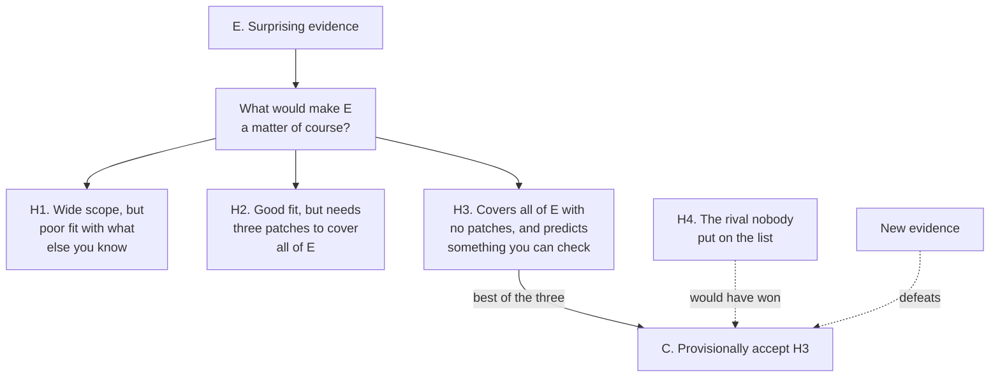

# Philosophical Method · Lesson 2.1: Inference to the best explanation

> ⏱ ~15 min · Module 2: Reasoning that isn't deduction · Builds on: [1.4 Argument forms and formal fallacies](01-04-argument-forms-and-formal-fallacies.md) · Unlocks: [2.2 Arguments from analogy](02-02-arguments-from-analogy.md)

## Why this matters

Module 1 gave you a test that either passes or fails: valid or invalid, sound or unsound. Almost nothing outside mathematics will pass it. No historian deduces why the Roman army stopped being paid; no prosecutor deduces who was in the room; no theologian deduces from the manuscripts what the community that produced them believed. What they all do instead is argue that one account makes the surviving evidence unsurprising and the rivals don't. That move has a name, a structure, and a characteristic way of going wrong — and the way it goes wrong is the single most productive source of confident nonsense in public life.

## The idea

Deduction runs forwards: from a hypothesis to what it entails. **Abduction**, or inference to the best explanation, runs backwards: from something you have observed to the hypothesis that would best account for it.

You come home. The door is ajar, the tin where you keep cash is empty, and the dog is shut in the bedroom. Each fact on its own is odd. Burglary makes all three ordinary at once — that is what makes it the explanation rather than merely *an* explanation. You are not deducing anything; your brother has a key and has borrowed money before. But if no story on your list accounts for the three facts as economically, you provisionally conclude burglary, and you act on it.

Notice three things that will carry the whole lesson. The evidence has to be **surprising** — facts that need no accounting for support nothing. The hypothesis wins by **comparison**, never on its own merits. And the conclusion is **provisional**: your brother can phone, and nothing you reasoned was wrong.

## The argument

The schema, in standard form:

> **P1.** Evidence E obtains, and E is surprising — unlikely given what you would otherwise have expected.
> **P2.** If hypothesis H were true, E would be a matter of course.
> **P3.** No rival hypothesis explains E as well as H does, judged by the explanatory virtues.
> **∴ C.** Provisionally, H is true.

In words: something needs accounting for; H would account for it; nothing else accounts for it as well; so believe H until something better turns up. Everything interesting lives in P3 — both the work and the danger.

**The explanatory virtues** are the standards by which "as well as" is judged. Four do most of the labour:

| Virtue | The question it asks |
|---|---|
| **Explanatory scope** | How much of the evidence does it cover — all of it, or only the piece that prompted the hypothesis? |
| **Fit with background knowledge** | How much else would you have to give up to accept it? |
| **Simplicity** | How many independent assumptions does it introduce, and are any of them there *only* to save the hypothesis? |
| **Fruitfulness** | Does it imply something not yet checked, which could then be checked? |

In words: cover more, cost less, assume less, predict something.

**They trade off, and the sharpest trade is scope against simplicity.** You can buy scope with patches: any hypothesis can be made to cover any evidence by adding enough auxiliary claims. This is why a conspiracy theory feels so powerful — maximal scope, purchased at a price its holder never totals up. An added assumption is **ad hoc** when its only support is that it rescues the hypothesis; the test is whether you would have had any reason to believe it otherwise. Fruitfulness is the one virtue that can be checked in advance of the argument you want to win, which is why it is the most honest.

**Defeasibility.** A valid deduction is *monotonic*: add a hundred true premises and the conclusion still follows. Abduction is not. New evidence can overturn C, and so can a rival you simply hadn't thought of — with no premise you asserted turning out false. So "H is true" here always carries an unspoken rider: *as the field of rivals currently stands.*

**The standing danger: the best of a bad lot.** P3 says no rival does as well. What you can actually check is that no rival *you generated* does as well. If the true explanation never made the list, the inference delivers the best of a bad lot with full confidence and no visible symptom. There is no fix, only a discipline: **generating rivals is part of the argument, not preparation for it.** Three generators worth running every time:

1. **The deflationary rival.** What would someone say who thinks E isn't surprising at all? Usually: a selection effect, a change in how things were recorded, or a coincidence in a large enough sample.
2. **The interest rival.** Who benefits from E being believed, or from the evidence surviving in this form rather than another?
3. **The combination.** Two mediocre hypotheses jointly, each doing part of the work. This often wins on scope — and always costs simplicity, so it has to be priced, not assumed.

## Argument map

Solid arrows are the inference as it is actually run: three rivals generated, one preferred. The two dashed arrows are the ways the conclusion dies without anyone having reasoned badly — an ungenerated rival, and evidence arriving later. A deductive argument has no dashed arrows; that is precisely the difference.

## Worked examples

**Example 1 (mechanical — running the schema on a clean case).** Why was Socrates prosecuted in 399 BC?

The evidence is surprising in a specific way. He was seventy, and had been a public figure for decades — Aristophanes had put him on stage in the *Clouds* in 423 with no legal consequence. The charge, as reported, was religious: failing to recognize the city's gods, introducing new divinities, corrupting the youth. Yet the trial came four years after the democracy was restored in 403 and the Thirty were overthrown, and the restoration had included a general amnesty barring prosecution for offences committed before it.

Three rivals:

- **H1. The charge means what it says.** Athens genuinely prosecuted impiety. *Scope:* covers the charge, not the timing. *Fit:* excellent — impiety trials are well attested. *Simplicity:* high.
- **H2. Political revenge, laundered through a religious charge.** Socrates' associates included Critias, a leader of the Thirty, and Alcibiades. The amnesty made a direct political prosecution impossible; an impiety charge was not covered by it. *Scope:* covers both the charge and the timing, and explains why the indictment was framed so vaguely. *Fit:* good — Xenophon's *Memorabilia* I.2 opens by answering the accusation that Socrates trained Critias and Alcibiades, which tells us the political reading was in circulation at the time. *Simplicity:* one extra assumption, that the stated charge was a vehicle.
- **H3. He convicted himself at trial.** Plato's *Apology* has Socrates propose free meals at public expense as his counter-penalty before being talked into a fine, and has him say that a shift of thirty votes would have acquitted him. *Scope:* covers the death sentence, not the prosecution.

Run P3. H1 leaves the timing unexplained; H3 explains the sentence but not why he was in court. H2 has the widest scope at the cost of a single assumption that the amnesty independently makes plausible — so it wins, provisionally. And H3 is not a rival at all once you look: it answers a different question. **Splitting E into "why charged" and "why condemned" lets H2 and H3 both stand, each on its own evidence.** That is the combination generator earning its keep, and it costs nothing in simplicity here because the two hypotheses are about different events.

**Example 2 (where it strains — rivals, patches, and a defeat).** Why did Britain abolish the slave trade in 1807?

Evidence to be covered: the Abolition of the Slave Trade Act received royal assent in March 1807; mass petition campaigns had run in 1788 and 1792; a gradual-abolition motion passed the Commons in 1792 and then died; nothing moved for over a decade; the Foreign Slave Trade Act of 1806 banned British subjects from supplying enemy and neutral colonies, and took effect first; slavery itself was not abolished in the British colonies until 1833, with 20 million pounds in compensation paid to owners.

- **H1. The moral and religious campaign succeeded.** *Scope:* strong on the campaign, weak on timing — the campaign peaked in 1792 and the law came in 1807.
- **H2. Economic decline.** The West Indian sugar interest had become unprofitable, so abolition cost little. This is the thesis Eric Williams argued in 1944, and it has enormous scope: it covers the timing, the political weakness of the planters, and the eventual compensated emancipation.
- **H3. Wartime strategy.** With Britain at war, banning the trade to foreign and captured colonies damaged rivals more than Britain. The 1806 Act is exactly what this predicts, and it was passed first.

Then the defeat. In 1977 Seymour Drescher argued in *Econocide* that the British slave trade and the West Indian colonies were not in decline at all in the years before 1807 — by the available measures the trade was near its peak. That is a **fit** failure, and it is fatal in a way no amount of scope repairs: H2's central factual claim is the thing the evidence contradicts. A defender can patch — *the decline was anticipated rather than actual* — and should then be asked the ad hoc test: is there any reason to believe contemporaries expected decline, other than that H2 needs them to have? Where the answer is yes, the patch is legitimate; where it is no, the patch is a cost.

Two lessons. First, **the argument was overturned by evidence, not by a flaw in the reasoning** — Williams's inference was a good one on the field of rivals and evidence available in 1944. That is defeasibility, working as designed. Second, H3 barely existed as a live rival for decades; drawing attention to the 1806 Act put it on the list, and once it was there, H1's timing problem stopped looking like a small gap. **A rival is not a minor addition to the field; adding one can change which hypothesis wins.** Most historians now argue some combination — which is honest, and which should be stated as the combination it is, with its simplicity cost visible, rather than smuggled in as "it was complicated."

## Watch out

- **You might think the conclusion is "H is true."** What the inference licenses is "H is the best of the ones on my list." That is a claim about your list as much as about the world, and it gets stronger only as the list gets better.
- **You might think a hypothesis that explains everything is winning.** A hypothesis that would have explained the opposite evidence just as comfortably has told you nothing. Unlimited scope is a symptom, not a virtue — [2.4](02-04-weighing-evidence-in-odds-form.md) gives this a number.
- **You might think a surprising hypothesis is disqualified by poor fit.** Fit is a price, not a veto; otherwise nothing new could ever be accepted. The question is always whether the scope bought is worth the background knowledge spent.
- **You might think being overturned means you argued badly.** In deduction a failed conclusion means a false premise or a broken link. In abduction it can mean neither. Treating every defeated explanation as a scandal is how people end up refusing to conclude anything.

## One-liner

> It is only ever an inference to the best explanation *you thought of* — so generating rivals is the argument, not the warm-up.

## Problems

**P1 (🟢) *(Exegetical.)*** The column below runs an inference to the best explanation.

> "The party lost thirty seats in a year when wages rose, unemployment fell, and no scandal touched the leadership. Something other than the economy did this, and we all know what: the candidate selection rules imposed from head office. Every seat lost was one where a local choice had been overruled. And the pattern is not new — the same rules cost us the council elections two years ago, when the economy was also fine."

(a) State the surprising evidence, the preferred hypothesis, and one rival the column rules out. (b) The column makes two supporting moves after stating its hypothesis. Name the explanatory virtue each appeals to. One sentence each; 150 words or fewer in total.

**P2 (🟡) *(Evaluative.)*** A historian observes that the number of surviving charters recording gifts of land to English monasteries rises sharply between 1000 and 1200, and concludes that monastic landholding expanded sharply over those two centuries.

Generate **two rivals the historian has not considered**, each of a different kind, and for each say which explanatory virtue it would beat the stated hypothesis on — or where it would lose. You do not need to say which hypothesis is right. 150 words or fewer.

**P3 (🔴, optional) *(Exegetical (a) · Evaluative (b).)*** An internal memo, written for this problem:

> "Four deputy ministers were removed within a fortnight. Three had backed the rival faction at the last congress. The only account that makes a coordinated removal of this size intelligible is a factional purge."

Three months later, two of the four are appointed to senior positions in state enterprises. The memo's author replies: "Those appointments are cosmetic, arranged precisely so the purge would not be visible."

(a) State the memo's original inference in the schema of this lesson — evidence, hypothesis, and the claim the memo makes about rivals. (b) Make the best case you can for the reply, then apply the ad hoc test to it and give a verdict. 150 words or fewer for (b).

Solutions

**P1** *(Exegetical — strict.)*

**Must hit, strict (a):**
- **Evidence:** thirty seats lost in conditions where loss was not expected — rising wages, falling unemployment, no scandal. The surprise is the whole engine of the argument.
- **Hypothesis:** the centrally imposed candidate selection rules caused the losses.
- **Rival ruled out:** the economic explanation (voters punishing economic performance), dismissed by the first sentence.

**Must hit, strict (b):**
- "Every seat lost was one where a local choice had been overruled" — **explanatory scope**: the hypothesis covers all of the evidence, not part of it.
- "The same rules cost us the council elections two years ago" — **fruitfulness** (the hypothesis holds up on a case outside the one it was invented for), or equally acceptably **fit with background knowledge**. Either naming passes if the reason is given.

**Wrong turns:** calling the second move "simplicity" with no argument — nothing in the column counts assumptions; treating the leadership's freedom from scandal as the hypothesis rather than as part of what makes the loss surprising.

**Model answer:** (a) Surprising evidence: thirty seats lost despite a good economy and no scandal. Hypothesis: the imposed selection rules. Rival dismissed: the economy. (b) The first move claims scope — the rule-overruled seats and the lost seats coincide exactly. The second claims fruitfulness: the hypothesis was not built for the council elections but accounts for them too.

---

**P2** *(Evaluative — any pair of genuinely distinct rivals passes; the verdict is not graded.)*

**Must hit, any verdict:**
- Two rivals of **different kinds**, not two versions of one. The three generators from the lesson each produce one:
  - *Deflationary / selection effect:* the survival rate of documents rose, not the number of gifts. Later monastic cartularies copied and preserved earlier grants, and what survives from 1200 had two fewer centuries of fire, damp and dissolution to survive.
  - *Changed practice:* transactions that had been oral began to be written down, especially after the Norman Conquest made written title matter in a dispute. The gifts may not have increased at all; the *recording* of them did.
  - *Interest:* monasteries had a strong motive to produce documents supporting their title, including forgeries, which are well attested for this period. Charters were evidence in land disputes, not neutral records.
- For each, name the virtue at stake. The deflationary and changed-practice rivals beat the stated hypothesis on **fit with background knowledge** (what is known about medieval record-keeping and document survival) while matching it on scope. The forgery rival is narrower — it explains suspiciously convenient charters, not the whole rise — so it loses on **scope** and works best as part of a combination.

**Wrong turns:** offering "maybe the monasteries were richer" and "maybe the monasteries got more gifts" as two rivals — one hypothesis twice; declaring the historian wrong, which the problem does not ask for and the evidence does not support; forgetting that a rival must explain the *same* evidence, not change the subject.

**Model answer (one of several):** Rival 1, a selection effect: survival rates rise with recency and with the growth of cartulary copying, so the same rate of gifts would leave a rising number of surviving charters. It matches the hypothesis on scope and beats it on fit. Rival 2, an interest rival: charters were title deeds in litigation, and houses had both motive and demonstrated willingness to forge them, so some of the rise reflects documents made to defend land already held. Narrower scope, so it is best run as a component rather than a replacement. Both leave the historian's conclusion possible; neither leaves it established.

---

**P3** *(a) exegetical — strict; (b) evaluative — the verdict is free, the test is not.*

**Must hit, strict (a):**
- **E:** four deputy ministers removed within a fortnight, three of them backers of the rival faction. Surprising because coordinated removals of that size are not routine.
- **H:** a factional purge.
- **The claim about rivals:** "the only account that makes this intelligible" is P3 asserted, not argued. The memo names no rival and rules none out — the fourth minister, who did not back the faction, is left unexplained, and ordinary rivals (a reshuffle, a corruption sweep, retirements) are not on the list at all.

**Must hit, any verdict (b):**
- **Steelman first:** state the reply at its strongest. A regime that wanted the purge invisible would have reason to place the removed elsewhere; visible destitution advertises a purge, and a state-enterprise posting is a known way to remove someone from power while preserving appearances. Stated that way the reply is not absurd.
- **State the ad hoc test explicitly:** is there support for the patch other than that it saves H? Then answer it with something checkable — do the new posts carry authority or only a title; was the same done to people removed for other reasons; is this pattern attested in the system generally.
- **Give a one-line verdict.** Either verdict passes. "Ad hoc, because the only evidence offered for cosmetic intent is that H requires it" passes. So does "not ad hoc, because sidelining via state-enterprise posts is independently attested here, and the reply predicts the posts carry no real authority — which is checkable."

**Wrong turns:** rejecting the reply merely because it is a patch — patches are legitimate when independently supported, and the lesson says so; treating the two promotions as decisive against the purge hypothesis without noticing that the reply might be right; answering (b) without ever stating the test.

**Model answer (b), one of several:** At its best the reply says: purges in this system are executed by sideways promotion, not by disgrace, so the appointments are what H predicts rather than evidence against it. Applied test: does anything support cosmetic intent besides the need to save H? If the posts can be shown to carry no budget or staff, or if the same treatment is documented for others removed on factional grounds, the patch has independent support and is not ad hoc. If the only argument is that a real purge would look like this, it is ad hoc, and the memo's confidence should fall — not to zero, but to a hypothesis competing on level terms with a routine reshuffle it never bothered to list.

## Flashback

**From Lesson 1.3 (reconstruction and charity):** Put the passage below into standard form, marking every line you supply and keeping each supply to the weakest claim that does the job. Then name the load-bearing premise. 150 words or fewer.

> "The general cannot have ordered the massacre. The order was given by word of mouth in the camp that morning, and he was three hundred miles away."

Solution

*(Exegetical — strict.)*

**Must hit, strict:**
- A reconstruction along these lines, with the supplied line marked as supplied:
  > **P1.** The order was given by word of mouth in the camp that morning. *(text)*
  > **P2.** The general was three hundred miles from the camp that morning. *(text)*
  > **P3.** *(supplied)* An order given by word of mouth is given only by someone present where it is given.
  > **∴ C.** The general did not order the massacre.
- **Rule 2 discipline:** P3 is the weakest supply that validates. "The general gave no orders that day," or "a commander is responsible only for orders he gives in person," both claim more than the inference uses and hand an opponent a larger target.
- **Load-bearing premise: P3** — and once it is on its own line the equivocation is visible. "Ordered" can mean *uttered this order* or *is the one whose order this was*; P3 is plausible on the first reading and false on the second, since orders are relayed. The passage survives only by not distinguishing them.

**Wrong turns:** naming P2 as load-bearing because it is the factual-looking one — its truth is not what the argument is buying with; supplying a premise that restates the conclusion ("an absent man cannot have ordered it"), which validates by circularity; declaring the argument invalid and stopping, when step 4 exists precisely to repair that.

**Model answer:** P1 and P2 from the text; supply P3, that a spoken order comes only from someone present. Valid as repaired. The load-bearing premise is P3, which trades on two senses of "ordered" — utterance versus authorship — and fails on the sense the conclusion needs. Worth noticing for this lesson: P1 itself is not an observation but somebody's inference to the best explanation of the testimony about how the order was passed.

## Connections

- **Backward:** [1.2](01-02-validity-and-soundness.md) and [1.4](01-04-argument-forms-and-formal-fallacies.md) tested whether premises *force* a conclusion. Nothing here forces anything, which is why the explanatory virtues have to do the work the form used to do — and why [1.3](01-03-reconstruction-and-charity.md)'s discipline of writing down what an argument leaves unsaid matters more, not less: the suppressed premise in an abductive argument is almost always P3.
- **Forward:** [2.2](02-02-arguments-from-analogy.md) is the same non-deductive weighing applied to a different structure, and the design argument it uses as its test case is an inference to the best explanation wearing analogical clothes. [2.3](02-03-informal-fallacies-and-when-they-arent.md) handles the ad hoc patch as a named vice. [2.4](02-04-weighing-evidence-in-odds-form.md) turns "would be a matter of course" into a likelihood ratio and "surprising" into prior odds, which is what Module 2's boss problem on Hume's argument against miracle testimony needs.
- **Sideways:** [`philosophy-of-science`](../../philosophy-of-science/syllabus.md) owns this properly — whether the explanatory virtues track truth or only convenience, what confirmation is, and whether success licenses realism about unobservables. Here it stays a tool for reading prose. Its home ground is [`church-history`](../../church-history/syllabus.md) and [`history-of-political-thought`](../../history-of-political-thought/syllabus.md), where every claim about why something happened is an abduction over a source record with survivors and gaps; [`apologetics-foundations`](../../apologetics-foundations/syllabus.md) and [`philosophy-of-religion`](../../philosophy-of-religion/syllabus.md) run it explicitly and contest the fit-with-background-knowledge term; and [`social-theory`](../../social-theory/syllabus.md) lives on the interest rival.
