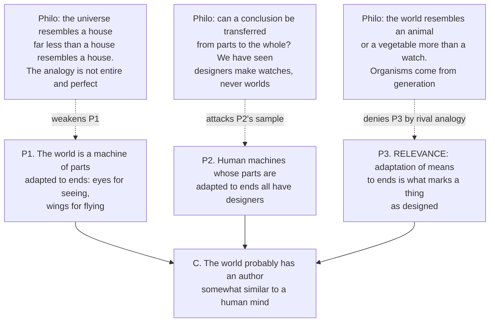

# Philosophical Method · Lesson 2.2: Arguments from analogy

> ⏱ ~15 min · Module 2: Reasoning that isn't deduction · Builds on: [2.1 Inference to the best explanation](02-01-inference-to-the-best-explanation.md) · Unlocks: [2.3 Informal fallacies, and when they aren't](02-03-informal-fallacies-and-when-they-arent.md)

## Why this matters

You will meet more analogical arguments in the rest of this curriculum than any other kind. Every argument from legal precedent is one. Most moral arguments that open "but you'd never say that about…" are one. The design argument, the body politic, the social contract, the state as a household running up debt in its children's name — analogies, all of them, and each has been won or lost on a single question: does the likeness reach as far as the conclusion? The answer is never "count the similarities." This lesson gives you the real test, and the one objection that beats a bad analogy without collapsing into "well, that's different."

## The idea

An analogical argument says: these two things are alike in certain ways; one of them has a further feature; so the other probably does too.

What makes this more than free association is that the shared features have to be **relevant** to the further feature — and relevance is a specific thing. It means there is a causal or principled connection: the shared features are (part of) *why* the first thing has the feature you're trying to transfer.

This is worth dwelling on, because the natural instinct is wrong. The natural instinct is that a long list of similarities makes an analogy strong. It doesn't. A drug that works in rhesus monkeys is evidence it will work in humans, and the reason is not that monkeys and humans are similar in a thousand respects — it's that they share the *one* physiological pathway the drug acts on. A rat shares fewer features with you than a chimpanzee does and is still the better model for a liver toxin, if the liver enzyme is the one that matters. **One relevant similarity beats twenty irrelevant ones**, and twenty irrelevant ones beat nothing at all.

Which tells you immediately what a good objection looks like, and this is the whole lesson: you break an analogy by naming a difference that **bears on the conclusion**. Not any difference. Any two things differ in infinitely many ways, so "but they're different" is always available and therefore never informative.

## The argument

The form, with the premise most arguers leave unsaid written out:

> **P1.** A and B share the features F1, …, Fn.
> **P2.** A also has the feature G.
> **P3.** F1, …, Fn are relevant to G — they are part of what makes A have G.
> **∴ C.** Probably, B has G too.

In words: the likeness gets you somewhere only if it is a likeness in the respects that produce the thing you're trying to carry across. **P3 is almost always suppressed** — which is exactly why [reconstruction](01-03-reconstruction-and-charity.md) matters here. Write it out and the argument usually either becomes obviously good or obviously hopeless, with very little in between.

Note the "probably." This is not a deductive argument and should never be dressed as one. Like [inference to the best explanation](02-01-inference-to-the-best-explanation.md), it is **defeasible**: new information can destroy it without any premise turning out false.

**What makes one strong.** In descending order of importance:

| Factor | Why it matters |
|---|---|
| **Relevance of F1…Fn to G** | The only factor that can carry the argument by itself. Ask: what is the principle or mechanism by which the shared features produce G? |
| **Variety of cases** | If the F-cluster went with G across cases that differ in every *other* respect, the F-cluster is doing the work. Variety, not count. |
| **Modesty of the conclusion** | A weaker conclusion is easier to support. "Somewhat similar to a mind" asks less than "omniscient." |
| **Absence of relevant disanalogies** | The next section. |

**The disanalogy objection** — the standard reply, and the one you should reach for first:

> **D1.** B differs from A in respect H.
> **D2.** H bears on G: either H is part of why A has G, or H is enough to stop B from having G.
> **∴ D.** The shared features do not carry G across.

In words: find a difference, then *show it matters*. **D2 is the entire objection.** An objection that stops at D1 has told you only that A and B are two things, which you knew. Conversely, a defender of an analogy does not have to deny the difference — the standard, and usually correct, reply is to grant H and deny D2.

## Argument map

The design analogy, with the classic objections attached to the premises they actually attack:

Three dashed arrows, three different objections, and they are not equally good. O1 says the resemblance is weak — true, but a matter of degree, and Paley's reply is that degree of resemblance in the *relevant* respect is what counts. O3 attacks the sample the generalization rests on. **O2 is the dangerous one**, because it goes straight at P3: it grants that resemblance licenses inference and then offers a rival likeness with better fit, pointing to a different cause entirely. That is what a first-rate disanalogy objection looks like.

## Worked examples

**Example 1 (mechanical — precedent).**

A court once held that police need a warrant before attaching a tracking device to a suspect's car. A new case: police fly a drone that follows the same car for a month. Does the precedent govern?

> **P1.** Both involve continuous, month-long surveillance of one person's movements in public.
> **P2.** The tracker case was held to require a warrant.
> **P3.** What made a warrant necessary was that aggregating a month of movements reveals an intimate picture of a life.
> **∴ C.** The drone surveillance requires a warrant.

Now try the objection. *Difference:* the tracker was physically attached to the car; the drone touches nothing. Does it bear on the conclusion? **It depends entirely on P3** — that is, on which principle the first case actually rested on. If the court's reason was trespass on property, the difference is decisive and the precedent does not reach. If the reason was the aggregation of movements, the difference is real and irrelevant, and the precedent governs.

This is the shape of all legal argument from precedent: you are never arguing about how similar two fact patterns look. You are arguing about which principle the earlier case stood on, because that principle *is* P3.

**Example 2 (why you'd care — the design analogy).**

William Paley opens *Natural Theology* (1802) by imagining himself crossing a heath. He strikes his foot against a stone, and if asked how it came to be there, might answer "that, for anything I knew to the contrary, it had lain there forever." But a watch found on the ground is different: its parts are "framed and put together for a purpose," so that "the inference, we think, is inevitable; that the watch must have had a maker."

Paley then spends several pages doing something that should now look familiar — **pre-emptively blocking disanalogies**, by granting the difference and denying that it bears on the conclusion. It would not weaken the inference, he says, that we had never seen a watch made; nor "that the watch sometimes went wrong, or that it seldom went exactly right"; nor that some parts had uses we could not discover. Each is a difference between our situation and a clean case of observed manufacture, and Paley's claim in each case is that it fails D2. He is right about all three. The imperfection point is the sharpest: a machine need not be perfect to show it was made with a design, "still less necessary, where the only question is, whether it were made with any design at all."

The organism is then the B-term: an eye is a machine of parts adapted to seeing, so it too had a maker.

Hume's *Dialogues Concerning Natural Religion* had already put the case and the reply, published in 1779 — the pairing with Paley is the classic exchange, though it is not a literal one, since the objections were in print twenty-three years before the watch. Cleanthes states the argument at its strongest: the world is "one great machine, subdivided into an infinite number of lesser machines," whose "curious adapting of means to ends, throughout all nature, resembles exactly, though it much exceeds, the productions of human contrivance." Therefore, "by all the rules of analogy," like effects give like causes.

Philo's replies are a catalogue of the move this lesson teaches. First, degree: "If we see a house, Cleanthes, we conclude, with the greatest certainty, that it had an architect" — but "surely you will not affirm, that the universe bears such a resemblance to a house, that we can with the same certainty infer a similar cause, or that the analogy is here entire and perfect." Second, part and whole: "Can a conclusion, with any propriety, be transferred from parts to the whole?"

And then the one that bites (Part VII): "The world plainly resembles more an animal or a vegetable, than it does a watch or a knitting-loom. Its cause, therefore, it is more probable, resembles the cause of the former."

Look at what that does. It does not deny that the world resembles a machine. It accepts Cleanthes' own rule — like effects, like causes — and argues that the world's *closer* likeness is to a thing whose observed cause is generation, not contrivance. It is a relevance objection dressed as a rival analogy, which is why it survives when the others only bruise. Whether it succeeds is a live question and not one this lesson settles; [`philosophy-of-religion`](../../philosophy-of-religion/syllabus.md) owns the argument itself. Notice only that the reply available to Paley is exactly the one the schema predicts: organisms are *themselves* full of means adapted to ends, so pointing at them may not escape the argument at all.

## Watch out

- **You might think naming any difference refutes an analogy.** It never does on its own. Every two things differ endlessly; "that's different" without D2 is a stall, not an objection. The discipline is to say, in one sentence, *why the difference bears on the conclusion.*
- **You might think more shared features make a stronger analogy.** Count does nothing. A single similarity in the respect that produces G beats a page of shared trivia, and a long list is often a sign the arguer could not find the relevant one.
- **You might think an analogy is a weak deduction.** It isn't a deduction at all, and the practical consequence is that it can be destroyed by *adding* a true premise — something that can never happen to a [valid argument](01-02-validity-and-soundness.md), where adding premises cannot break the link.
- **Don't confuse an argument from analogy with an illustrative one.** "Think of the soul as a chariot" is a teaching device; it asserts nothing and cannot be refuted. Ask whether the analogy is carrying a conclusion. If it isn't, attacking it is wasted effort.

## One-liner

> An analogy carries exactly as far as the similarities that explain the conclusion — and it is broken by a difference that bears on the conclusion, never by any difference at all.

## Problems

**P1 (🟢) *(Exegetical.)*** Put this argument into the four-line schema: name A, B, the shared features, and G — then write out the suppressed relevance premise P3 in your own words. 150 words or fewer.

> "We ground airline pilots at sixty-five and nobody calls it an insult. Pilots make high-stakes calls, the faculties those calls need decay with age, and the decay is gradual enough that the person losing them is the last to notice. Every one of those things is true of a federal judge. If a fixed retirement age is right for the cockpit, it is right for the bench."
> — from an invented op-ed, attributed to no one

**P2 (🟡) *(Evaluative.)*** A common argument runs: a government that borrows without the consent of the generation that will repay is doing what a parent does who runs up debt in a child's name; the second is wrong, so the first is too. (a) Name one disanalogy that bears on the conclusion, and say which part of the relevance premise it breaks. (b) Name one genuine difference that does **not** bear on the conclusion, and say why not. (c) Verdict: does the analogy survive? Any verdict passes if (a) and (b) are done. 150 words or fewer for all three.

**P3 (🔴, optional) *(Exegetical (a) · Evaluative (b).)*** Philo, in Hume's *Dialogues Concerning Natural Religion*, Part VII:

> "The world plainly resembles more an animal or a vegetable, than it does a watch or a knitting-loom. Its cause, therefore, it is more probable, resembles the cause of the former."

(a) Which objection from this lesson is this — a denial of P1, of P2, or of P3 — and which two or three words in the passage decide it? (b) What would Cleanthes have to show to answer it? 150 words or fewer for both.

Solutions

**P1** *(Exegetical — strict.)*

**Must hit, strict:**
- A = airline pilots; B = federal judges; G = a fixed mandatory retirement age is justified.
- Shared features: decisions with high stakes; age-related decline in the faculties those decisions require; decline that is gradual and poorly self-detected.
- P3, the suppressed premise, must state the *connection*, roughly: a fixed age cap is justified for pilots **because** the decline is real, hard to catch case by case, and the errors it produces are severe — so a blunt rule beats individual assessment.

**Wrong turns:** listing the similarities the op-ed mentions and stopping, as if the count were the argument; writing P3 as "pilots and judges are similar in these ways," which just restates P1 instead of saying why those ways bear on G. The relevance premise always names a mechanism or a principle, never a resemblance.

**Model answer:**
> **P1.** Pilots and federal judges both make high-stakes decisions using faculties that decline with age, and in both the decline is gradual and poorly self-detected.
> **P2.** For pilots, a fixed retirement age is justified.
> **P3.** It is justified because undetectable gradual decline plus severe consequences makes a blunt age rule better than case-by-case assessment.
> **∴ C.** A fixed retirement age is justified for federal judges.

---

**P2** *(Evaluative — verdict-neutral. Graded on the moves, not the conclusion.)*

**Must hit, any verdict (a):** one disanalogy plus an explicit statement of how it breaks the relevance premise. The relevance premise is something like: *imposing a repayment obligation on someone who neither consented nor benefited is wrong.* Candidates that genuinely bear on it: the future generation inherits the assets the borrowing bought (roads, a won war, an educated workforce), so it is not a pure burden — this attacks the "neither benefited" clause. Or: the future generation inherits the political machinery to repudiate, refinance or tax differently, whereas the child cannot; this attacks the "no consent" clause by supplying a substitute for consent. Or: the child is a named individual with a fixed liability, while "the next generation" is a shifting population that includes the bondholders themselves, so the transfer is partly internal.

**Must hit, any verdict (b):** an irrelevant difference, with the reason it fails D2 — e.g. the state is a corporate body rather than a natural person, or the sums are vastly larger, or the debt is contracted through a legislature rather than privately. Each is a real difference; none of them touches *why* binding a non-consenting non-beneficiary is wrong, unless the answer develops a further claim that does.

**Must hit (c):** a one-line verdict, separate from the reasoning.

**Wrong turns:** the lesson's central error — naming a difference and stopping, with no account of how it bears on the wrongness. Also: arguing that the state is not a person and leaving it there, which is (b) mistaken for (a). Also: treating the parent case as obviously wrong without noticing the analogy needs it to be wrong *for a reason that transfers*.

**Model answer (one of several):** (a) The future generation inherits what the borrowing bought; the child inherits only the bill. That breaks the relevance premise at the "no benefit" clause, which is doing much of the work in making the parent case wrong. (b) That the state is a corporate body, not a person — true, but it does not explain why binding a non-consenting party would stop being wrong. (c) Verdict: the analogy survives only for borrowing that funds current consumption, and fails for borrowing that funds durable assets. The right response to a disanalogy is often to restrict the conclusion rather than abandon it.

---

**P3** *(a) exegetical — strict; (b) evaluative.*

**Must hit, strict (a):** this is an attack on **P3, the relevance premise**, made by offering a rival analogy — not a denial that the world resembles a machine at all. The deciding words: **"more"** (a comparative; Philo concedes some machine-likeness and disputes which likeness is closer), **"plainly"** (he claims the comparison needs no expertise), and **"probable"** (the conclusion is graded, matching the graded premise — he is playing by Cleanthes' own rules rather than demanding proof). Credit also for noticing that "its cause, therefore, it is more probable, resembles the cause of the former" *uses* Cleanthes' principle — like effects, like causes — and turns it around.

**Must hit, any verdict (b):** Cleanthes must show that the respect in which the world resembles a machine — adaptation of means to ends — is the respect **relevant** to inferring a designer, and that resemblance to an organism either is not relevant or does not compete. The obvious line, and the one Paley takes: organisms are themselves saturated with means adapted to ends, so an eye is a case *for* the argument, not against it; Philo's rival analogy then needs generation itself to be a cause of contrivance rather than a transmission of it. Any verdict on whether that reply works passes.

**Wrong turns:** reading Philo as denying that the world resembles a machine — he does not, and "more" rules it out; treating this as the same objection as the house passage, which is about degree of resemblance rather than about which resemblance is relevant; answering (b) by attacking Hume's conclusion instead of naming what Cleanthes must establish.

**Model answer:** (a) An attack on the relevance premise by rival analogy. "More" concedes partial machine-likeness and contests which likeness is closer; "probable" shows Philo is accepting Cleanthes' inference rule and running it the other way; "plainly" claims the comparison is available to anyone. (b) Cleanthes must show that means-to-ends adaptation is the feature that licenses the inference, and that organisms exhibit it too — so that pointing at vegetables does not escape the argument but supplies more instances of it.

## Flashback

**From Lesson [1.4](01-04-argument-forms-and-formal-fallacies.md) (Argument forms and formal fallacies):** Two arguments below have the same look and different forms. (a) State each one's form in letters, name it, and say which is valid. (b) For the invalid one, build a same-form counterexample — obviously true premises, obviously false conclusion.

> **A.** "If the treasurer had approved the transfer, her signature would be on the ledger. Her signature is not on the ledger. So she did not approve it."
>
> **B.** "If the vaccination campaign had reached the outer villages, infant deaths would have fallen. The campaign never reached them. So infant deaths did not fall."

Solution

**Must hit, strict (a):**
- **A.** *If P then Q. Not Q. Therefore not P.* **Valid** — modus tollens.
- **B.** *If P then Q. Not P. Therefore not Q.* **Invalid** — denying the antecedent. The conditional says passage would suffice for a rise; it never said passage was the only route to one.

**Must hit (b):** any same-form counterexample with granted premises and a false conclusion.

**Wrong turns:** calling B valid because wages plausibly didn't rise — a true conclusion never rescues a form. Building a counterexample that shares B's topic instead of its form.

**Model answer:** (b) "If a man is a bishop, he is baptized. He is not a bishop. So he is not baptized." Both premises are granted and the conclusion is plainly false, so the form does not preserve truth — and B is invalid whatever happened to wages.

## Connections

- **Backward:** [2.1](02-01-inference-to-the-best-explanation.md) and this lesson are the two non-deductive workhorses, and Philo's animal-or-vegetable move shows they are cousins: offering a rival analogy is offering a rival hypothesis. From [1.2](01-02-validity-and-soundness.md), note the contrast — a same-form counterexample kills a deductive form outright, while a disanalogy only lowers the weight an analogy carries.
- **Forward:** [2.3](02-03-informal-fallacies-and-when-they-arent.md) takes "false analogy" as a named fallacy and asks when the charge is earned, which is precisely the D1-versus-D2 line drawn here; [2.4](02-04-weighing-evidence-in-odds-form.md) gives you a way to say *how much* a defeasible argument should move you; [3.3](03-03-thought-experiments.md) is analogy built to order — a thought experiment is a case constructed so that one relevant feature varies and the rest hold still.
- **Sideways:** argument from precedent is the native form of [`philosophy-of-law`](../../philosophy-of-law/syllabus.md) and [`constitutional-law`](../../constitutional-law/syllabus.md), where "distinguishing" a case is the disanalogy objection under another name; the design argument belongs to [`philosophy-of-religion`](../../philosophy-of-religion/syllabus.md); the borrowing analogy in P2 is examined properly in [`philosophy-of-debt`](../../philosophy-of-debt/syllabus.md).
