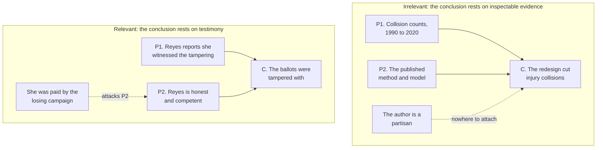

# Philosophical Method · Lesson 2.3: Informal fallacies, and when they aren't

> ⏱ ~15 min · Module 2: Reasoning that isn't deduction · Builds on: [2.2 Arguments from analogy](02-02-arguments-from-analogy.md) · Unlocks: [2.4 Weighing evidence in odds form](02-04-weighing-evidence-in-odds-form.md)

## Why this matters

The list of informal fallacies is the most-memorized and least-useful thing in an introductory logic course, because every item on it has a legitimate twin — a move with the same shape that is exactly the right thing to do. Nearly everything you believe about the age of the universe or the safety of a drug rests on an appeal to authority. Some attacks on a speaker are decisive. Some slopes really are slippery. Learn the list without the twins and you get a reader who can shout labels and still can't tell a bad argument from a good one.

## The idea

Formal fallacies ([1.4](01-04-argument-forms-and-formal-fallacies.md)) fail by shape alone: affirming the consequent is invalid in every instance, no exceptions, no context. Informal fallacies do not work that way. There is no shape that makes an argument an appeal-to-authority *fallacy* — the shape is shared with "my doctor examined the lump and says it's benign," which is not a mistake but the ordinary route to a justified belief.

So where is the mistake, when there is one? Each of these moves needs a **bridge premise**: an unstated claim connecting the move to the conclusion. *This speaker is a reliable guide on this question. Each step in the chain really does make the next one likely. The two options I listed are the only ones.* The fallacy is never making the move. The fallacy is helping yourself to the bridge.

That reframes the whole skill. You are not matching a passage against a list of Latin names. You are asking one question: **what does this move need in order to work, and did the arguer supply it?**

## The argument

**The diagnostic.** Given a passage that smells fallacious:

1. **State the move without the label.** Not "ad hominem" but "he attacks the author's funding rather than the study."
   *In words:* a label ends the inquiry; a description keeps it open long enough to check.
2. **Write the bridge premise the move needs** — the smallest claim that would make the move do its work.
   *In words:* this is the weakest-premise discipline from [1.3](01-03-reconstruction-and-charity.md), aimed at an inference rather than at a gap.
3. **Ask whether the bridge is supplied, defensible, or merely assumed.** Merely assumed and false → a genuine fallacy. Stated and defended → a real argument you now owe an answer on the merits. Assumed but obviously true → fine, and objecting is pedantry. A bridge whose only support is that the argument needs it is **ad hoc** — the vice [2.1](02-01-inference-to-the-best-explanation.md) named for rescue patches, met here one level up, attached to an inference rather than to a hypothesis.
4. **Answer the argument, not the label.** To name a fallacy just *is* to claim that a bridge premise is missing or false. That claim is itself an argument, and it can be wrong.

**The seven pairs.** Each row is one shape, used well and used badly.

| Move | Fallacious when | Legitimate twin | The bridge at issue |
|---|---|---|---|
| [Equivocation](../reference.md#equivocation) | A term shifts sense between premises, and the argument needs both senses | One sense held fixed throughout, even a stipulated technical one | "The term means the same thing in every premise" |
| [Begging the question](../reference.md#begging-the-question) | The premise is no more acceptable *to this audience* than the conclusion | A premise the audience independently grants, shown to entail something they resist | "You grant P without already granting C" |
| [Straw man](../reference.md#straw-man) | You refute a version the opponent would not sign | A **reductio**: the absurdity is derived from what they actually hold | "The version I attack is one my opponent is committed to" |
| [Ad hominem](../reference.md#ad-hominem) | The claim rests on an argument you can inspect yourself | The claim rests on the speaker's testimony, or their interest shaped which evidence you got | "This fact about the speaker bears on whether the claim is true" |
| [Appeal to authority](../reference.md#appeal-to-authority) | Wrong field, lone dissenter passed off as the field, or a question expertise can't settle | A genuine expert, inside their field, reporting the consensus of that field | "This person is a reliable guide on this question" |
| [Slippery slope](../reference.md#slippery-slope) | The chain is asserted whole: "and then X will happen" | Each step defended on its own — an incentive, a precedent, a doctrine that generalizes | "Every link holds, and they hold jointly" |
| [False dilemma](../reference.md#false-dilemma) | A third option exists and is quietly dropped | A genuine dichotomy: P or not-P, or exhaustive under a stated restriction | "These options are exhaustive" |

Three of these need more than a row.

**Circularity is not a property of an argument.** It is a property of an argument *plus an audience*. Every valid argument contains its conclusion in its premises — that is what validity is — so "the conclusion follows from the premises" can never be the complaint. The complaint is dialectical: *you have offered me, as a reason, something I would only accept if I already accepted your conclusion.* The same three lines can be a question-begging evasion against one interlocutor and a perfectly good application of a shared principle against another. Before calling an argument circular, name the person it is supposed to move.

**A relevant ad hominem attacks a premise, never a conclusion.** When someone's claim rests on testimony, their honesty and competence are not background noise about them — they are the evidence. Showing the witness was paid by an interested party is an attack on a premise, and a legitimate one. But notice what it does and doesn't buy: it lowers the credibility of one support, and a claim with a weakened support may still be true. If you cannot point at the premise your attack lands on, you don't have a relevant ad hominem; you have an insult with a diagram.

**Slope arguments are conjunctions of conditionals,** which is both why they can be sound and why they are usually weaker than they sound. A chain of five steps each of which you'd give 80 percent survives at about a third. Defending each link is necessary; it isn't sufficient, because the links multiply. [2.4](02-04-weighing-evidence-in-odds-form.md) makes that arithmetic precise.

## Argument map

Where an attack on the person can and cannot attach:

On the left the attack has nowhere to land: the conclusion is held up by counts and a method you can check yourself, and the author's politics change neither. On the right the attack lands on P2 — because P2 *is* the speaker. And even there it does not reach C2 directly; it weakens one of C2's two supports. Every legitimate ad hominem has this structure, which is why the test is a question about the map: **which premise does your attack touch?**

## Worked examples

**Example 1 (mechanical — running the diagnostic).**

> "Every law requires a lawgiver. The regularities of nature are laws. So the regularities of nature require a lawgiver."

*Step 1, describe the move:* the word "law" carries both premises. *Step 2, the bridge:* "law" means the same thing in P1 and in P2. *Step 3, is it supplied?* No, and it is false. P1 is plausible only for **prescriptive** law — a rule laid down by an authority, which is precisely the kind of thing that needs a lawgiver. P2 is true only for **descriptive** law — an exceptionless regularity, which needs a lawgiver only if it is the other kind of law. The argument needs one sense to make P1 true and the other to make P2 true, so it equivocates.

*Step 4, what that shows.* Not that the conclusion is false, and not that design arguments fail — only that this route to it fails. The defender's next move is available and respectable: argue that exceptionless regularities call for an explanation of a kind only an agent can give. That is a different argument, weighed as an inference to the best explanation ([2.1](02-01-inference-to-the-best-explanation.md)) against its rivals. Naming the equivocation closes one argument and opens a better one. That is the most a fallacy label ever does.

**Example 2 (why you'd care — a label that doesn't stick).**

> "We shouldn't lower the voting age to 16. The reasons offered — that 16-year-olds work, pay tax, and are bound by the law — hold with equal force at 14, and at 12: those cohorts contain working people too, and all of them are bound by the law. Anyone who accepts those reasons owes us a principled place to stop, and 'sixteen feels about right' is not one."
>
> **Reply:** "That's a slippery slope fallacy."

Run the diagnostic on the *reply*. Step 1: what is the arguer actually doing? Not predicting a chain of events — nobody claims that lowering the age to 16 will cause a lowering to 12. He claims the opponent's **premises generalize**: the reasons given, taken at face value, license conclusions the opponent rejects. Step 2: his bridge is that those reasons really do apply at 14 and 12. Step 3: he defends it, case by case, instead of asserting it.

So the label is wrong twice over. This is not a causal slope at all but a **proves-too-much** objection ([4.1](04-01-objections-and-replies.md)) — a demand for a principle — and even read as a slope, every step was argued rather than assumed. The one-word reply accomplished nothing, and worse, it let the replier feel finished. The work actually left is to name the stopping point: a capacity threshold that 16-year-olds clear and 12-year-olds don't, an empirical claim about civic knowledge, or a frank appeal to the convenience of a bright line. Any of those is a real answer. "Slippery slope" is not.

## Watch out

- **You might think naming a fallacy refutes an argument.** A label is shorthand for a claim — *your bridge premise is missing or false*. Say the claim instead. If you can't name the premise, you don't have an objection, you have a word. Labels can also be **misapplied**, and misapplying one ("straw man!" to a fair reductio) is itself a bad argument that now needs defending.
- **You might think a relevant ad hominem refutes a claim.** It never does. At most it weakens a premise, and only when that premise is the speaker's own testimony or their control over which evidence you saw. If the reasoning is on the page in front of you, the arguer's character is irrelevant, however venal.
- **You might think appealing to authority is a weakness to be apologized for.** Almost all of your knowledge is second-hand and could not be otherwise. The discipline is not avoiding authority but checking the bridge: right field, inside the consensus rather than against it, and a question of a kind expertise can settle at all — an economist can tell you what a policy will cost, not whether the cost is worth paying.
- **You might think "circular" is something you can see from the page.** You can't. The same valid argument begs the question against one audience and is a legitimate application of a granted principle against another. Ask who is being argued with before you reach for the label.

## One-liner

> Every informal fallacy is a legitimate move with its bridge premise missing — so name the bridge, not the fallacy.

## Problems

**A new problem kind.** Some parts below are labelled *(Evaluative.)* An evaluative part asks whether an argument works, whether a move is legitimate, who has the better of an exchange — questions with no answer key. The rubric grades the **moves**, never the verdict: it lists what either side has to do (state the bridge premise, say what would defend it, name the strongest reply), and *any* conclusion passes if those moves are made. If you catch yourself guessing what the grader believes, you've misread the task. Say what you think and show the moves.

**P1 (🟢) *(Exegetical.)*** For each passage, (i) name the classic label its shape fits, and (ii) write the bridge premise the move needs, in one sentence. Do not yet say whether it is a fallacy.

(a) "You can ignore the bishop's letter on the living wage — he has never held a job outside the Church."
(b) "The end of a thing is its perfection. Death is the end of life. So death is the perfection of life."
(c) "Either we keep police funding where it is, or we accept a rise in violent crime."

**P2 (🟡) *(Exegetical (a) · Evaluative (b).)*** Here is a paragraph from an invented op-ed in a regional paper, "The Safety Study Nobody Should Believe."

> "The Institute for Road Futures released a study last week concluding that the new roundabout design cuts injury collisions by a third. Before anyone quotes it at Tuesday's council meeting, note two things. The Institute is funded almost entirely by the consortium that builds the design, and the study's author is not a traffic engineer but an economist. And note who is *not* quoted anywhere in it: the national association of traffic engineers has taken no position on this design at all."

(a) The writer makes three distinct moves against the study. Name each and write the bridge premise it needs. (b) Suppose the study's collision data and full method are published and anyone can rerun them. Does that change which of the three moves still has force? 150 words or fewer for (b).

**P3 (🔴, optional) *(Evaluative.)*** Two readers disagree about whether this argument begs the question.

> **P1.** Deliberately killing a human being is wrong.
> **P2.** Capital punishment deliberately kills a human being.
> **∴ C.** Capital punishment is wrong.

Settle it the only way it can be settled — by naming the audience. For whom is P1 more acceptable than C, and for whom is it not? Then say what the arguer's next move should be. 150 words or fewer.

Solutions

**P1** *(Exegetical — strict.)*

**Must hit, strict:**
- (a) **Ad hominem.** Bridge: *the bishop's lack of outside employment bears on whether his claim about the living wage is true.* (Naming it as an appeal to a lack of relevant expertise is also acceptable — the bridge is the same.)
- (b) **Equivocation** on "end." Bridge: *"end" means the same thing in P1 and P2.* (P1 needs *end* as purpose or *telos*; P2 needs *end* as termination.)
- (c) **False dilemma.** Bridge: *current funding levels and a rise in violent crime are the only two possibilities.*

**Wrong turns:** writing a verdict instead of a bridge premise ("this is fallacious because bishops can have views on wages") — the task is to surface the silent assumption, not yet to judge it; calling (b) begging the question because the conclusion sounds like the premise.

**Model answer:** (a) Ad hominem; it needs the bishop's employment history to bear on the truth of his claim. (b) Equivocation; it needs "end" to hold one sense across both premises. (c) False dilemma; it needs the two listed options to exhaust the possibilities.

---

**P2** *(Exegetical (a) — strict · Evaluative (b) — any verdict.)*

**Must hit, strict (a):** three separate moves, each with its bridge.
1. **Conflict of interest** (funding by the builder). Bridge: *an interested funder plausibly shaped which results were produced or reported.*
2. **Ad hominem on credentials** — the author is an economist, not an engineer. Bridge: *training in traffic engineering is required for competence on this question.*
3. **Appeal to the silence of an authority** — the engineers' association has taken no position. Bridge: *if the finding were sound, that body would have endorsed it; silence is evidence against it.*

**Must hit, any verdict (b):** draw the distinction the lesson turns on — whether the conclusion rests on **testimony** or on **inspectable evidence** — and apply it to each of the three. Say what work is left for each move rather than declaring them all dead or all alive.

**Wrong turns:** treating all three as one "ad hominem" and giving one bridge; concluding that published data makes the funding irrelevant full stop (interest can shape which specifications are reported, so it survives as a reason to check the choices, even when the numbers are open); accepting move 3 without noticing that professional bodies are routinely silent about new findings for reasons unconnected to soundness.

**Model answer (b), one of several acceptable:** Published data and method move the study off testimony and onto evidence a reader can inspect, which is exactly where an attack on the arguer stops reaching the conclusion. Move 2 loses most of its force: if the model is checkable, the author's degree is a reason to read carefully, not a reason to disbelieve. Move 1 survives in weakened form — funding cannot fake collision counts, but it can shape which comparison was run and which was shelved, so it remains a reason to check the specification. Move 3 was the weakest from the start: silence from a professional body is consistent with the finding being sound, contested, or simply new, and the writer never supplies the missing premise that would make silence informative.

---

**P3** *(Evaluative — any verdict, if the moves are made.)*

**Must hit, any verdict:**
- Note first that the argument is **valid**, so the complaint cannot be about form. Every valid argument's conclusion is contained in its premises; that is never what "begs the question" means.
- Identify an audience for whom P1 is independently accepted and C is not — someone who holds an exceptionless prohibition on deliberate killing but has not applied it to this institution. For them the argument is a legitimate application, and possibly news.
- Identify the audience the argument is aimed at — someone who defends capital punishment. They accept a prohibition on killing *with exceptions*, one of which is judicial punishment. For them P1, read strongly enough to deliver C, simply is C generalized, so it begs the question.
- Say what comes next: either defend P1 on grounds the opponent already accepts, or restrict the argument to those who grant it and stop presenting it as a refutation.

**Wrong turns:** deciding the matter by whether capital punishment is in fact wrong — that is the question, not the test; calling the argument invalid or "circular reasoning" because C follows from P1 and P2; answering "it depends" without naming the two audiences.

**Model answer, one of several acceptable:** The argument is valid, so the charge has to be dialectical. Against someone who already holds that deliberate killing is always wrong, P1 is granted independently and the argument does real work — it shows them a commitment they may not have drawn out. Against a retentionist it does none: retentionists don't deny that killing is generally wrong, they deny it is wrong *as judicial punishment*, so P1 in the exceptionless form the argument needs is just the conclusion stated at a higher altitude. In this debate the second audience is the intended one, so the charge sticks. The abolitionist's next move is to argue for P1's exceptionlessness on grounds a retentionist accepts — otherwise the syllogism is a summary of a position, not an argument for it.

## Flashback

**From Lesson [2.1](02-01-inference-to-the-best-explanation.md) (Inference to the best explanation):**

> An airline replaces the boarding music on half its routes. Over the next quarter those routes log 20 percent fewer complaints about cabin crew than the routes that kept the old music. The operations director concludes the music calms passengers.

Generate **two rivals of different kinds** and, for each, name the explanatory virtue on which it beats or loses to the director's hypothesis. Then name one thing you could check that would discriminate between them, and say which virtue that appeals to. 120 words or fewer.

Solution

*(Evaluative — any two genuinely distinct rivals pass; no verdict is required.)*

**Must hit, any verdict:**
- Two rivals from **different generators**, not two phrasings of one. The lesson's three: a *deflationary* rival (the routes were not comparable — whichever half got the new music differs in length, load factor or season, so the complaint gap was there already, or complaints on the trial routes reverted after an unusually bad prior quarter); a *changed-practice* rival (the trial changed how complaints were logged or how crew behaved, since crew on a monitored trial know they are being watched); an *interest* rival (whoever chose which routes to trial had a stake in the result).
- Name the virtue for each. The deflationary and changed-practice rivals typically match the director on **scope** — they cover the same gap — and beat him on **fit with background knowledge**, since selection effects and observation effects are well attested and "music alters complaint behaviour about crew" is not.
- Name a discriminator and its virtue: a checkable consequence is **fruitfulness**. Randomizing route assignment, checking the same routes' complaint rates in the prior quarter, or looking at whether complaints about *food* moved too all distinguish the hypotheses.

**Wrong turns:** offering "the passengers were calmer" and "the music worked" as two rivals — one hypothesis twice; declaring the director wrong, which is not asked and not established; proposing a discriminator that no hypothesis makes a different prediction about.

**Model answer:** Rival 1, selection: the trial half may differ systematically (short-haul, lighter loads), so the gap predates the music. Same scope, better fit. Rival 2, observation effect: crew on a monitored trial behave differently, so the music is incidental. Also same scope, better fit, and it explains why the effect is on *crew* complaints specifically — something the music hypothesis has to strain for. Discriminator: compare the same routes' complaint rates in the quarter before the trial, and check whether non-crew complaints moved. That is fruitfulness — the hypotheses predict different answers, and the answers are available.

## Connections

- **Backward:** [2.1](02-01-inference-to-the-best-explanation.md) and [2.2](02-02-arguments-from-analogy.md) assessed non-deductive arguments by asking what makes them strong; this lesson does the same job from the other side, asking what makes a move fail — and the answer turns out to be the same thing, a bridge premise nobody defended.
- **Forward:** [2.4](02-04-weighing-evidence-in-odds-form.md) puts numbers on two claims made loosely here — how much a conflict of interest should move you, and how fast a chain of defended steps decays. [4.1](04-01-objections-and-replies.md) classifies the proves-too-much and reductio objections that Example 2 turned on, and [4.2](04-02-steelmanning-and-the-burden-of-proof.md) makes the straw man's positive twin a discipline.
- **Sideways:** equivocation is the practical edge of a topic [`philosophy-of-language-and-logic`](../../philosophy-of-language-and-logic/syllabus.md) takes up in its own right (ambiguity, context-sensitivity, scope); the legitimate appeal to authority is testimony, which [`epistemology`](../../epistemology/syllabus.md) treats as a source of knowledge in its own right rather than a second-best substitute for seeing for yourself.
