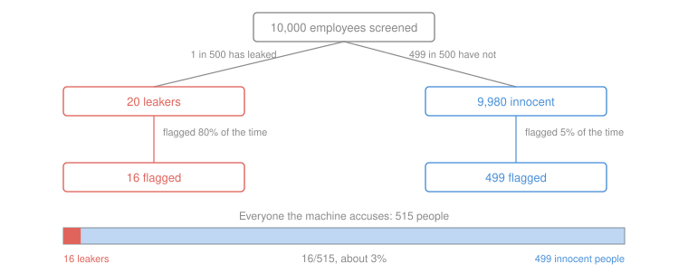

# Philosophical Method · Lesson 2.4: Weighing evidence in odds form

> ⏱ ~15 min · Module 2: Reasoning that isn't deduction · Builds on: [2.3 Informal fallacies, and when they aren't](02-03-informal-fallacies-and-when-they-arent.md) · Unlocks: [3.1 Conceptual analysis](03-01-conceptual-analysis.md)

## Why this matters

The last three lessons gave you verdicts: the explanation is better, the analogy is weak, the ad hominem is relevant. What they could not give you is a *quantity*. "That's some evidence, but not much" is the most common sentence in serious argument and the least disciplined, and whole debates — miracles, conspiracies, the reliability of a witness, whether a screening test justifies an accusation — turn on how much is "not much."

This is the one piece of machinery in the course. It is small: one equation, three terms. It buys you two things nothing else does. It separates *how surprising the evidence is* from *how unlikely the claim was to begin with*, which is where almost all bad reasoning about evidence hides. And it tells you when several weak items really do add up to a strong case, and when they are just one item wearing four hats.

## The idea

Stop asking "does this evidence support the claim?" Ask instead: **is this evidence more expected if the claim is true than if it is false, and by what factor?**

That factor is the whole of what the evidence is worth. Notice it is a *comparison*. A piece of evidence that would be astonishing if the claim were true still favours the claim, provided it would be even more astonishing if the claim were false. Evidence never speaks about one hypothesis alone; it always speaks about a contest between two.

And it does not tell you what to believe — it tells you how far to *move*. That is the second half of the idea. If you begin convinced the claim is a thousand-to-one long shot and then meet evidence twenty times more expected on the claim than against it, you end at fifty-to-one against. You have moved a long way and you still don't believe it. Nothing has gone wrong: a factor of twenty was never going to cover a thousand.

Three terms, then: where you started, how hard the evidence pushes, where you end.

## The argument

Write $H$ for the hypothesis, $\neg H$ ("not-$H$") for its denial, and $E$ for the evidence in hand. **Odds** are a ratio of chances rather than a share of them: a claim with probability $\tfrac{1}{5}$ has odds of $1:4$, one chance for against four chances against.

**Prior odds** — $\dfrac{P(H)}{P(\neg H)}$ — how the contest stood before $E$ arrived.

**Likelihood ratio** — $L = \dfrac{P(E \mid H)}{P(E \mid \neg H)}$, where $P(E \mid H)$ is the chance of seeing $E$ *supposing* $H$ true. In words: how much more expected this evidence is if the hypothesis holds than if it doesn't. This number, and only this number, is the strength of the evidence.

**The rule.**

$$\underbrace{\frac{P(H \mid E)}{P(\neg H \mid E)}}_{\text{posterior odds}} \;=\; \underbrace{\frac{P(H)}{P(\neg H)}}_{\text{prior odds}} \;\times\; \underbrace{\frac{P(E \mid H)}{P(E \mid \neg H)}}_{\text{likelihood ratio}}$$

In words: **where you end up is where you started, multiplied by the strength of the evidence.** To recover a probability from odds $a:b$, take $\frac{a}{a+b}$.

**Reading a likelihood ratio.** A rough working scale, worth internalising because real arguments rarely announce their numbers:

| $L$ | What the item is worth |
|---|---|
| $1$ | nothing at all — as expected either way |
| $2$ to $3$ | barely worth mentioning |
| $3$ to $10$ | moderate; the honest value of most single items |
| $10$ to $30$ | strong |
| above $100$ | very strong, and rarer than people claim |
| below $1$ | evidence *against*; $L = \tfrac{1}{5}$ counts against exactly as hard as $L = 5$ counts for |

**Cumulative cases.** For several items $E_1, \ldots, E_n$:

$$\text{posterior odds} \;=\; \text{prior odds} \times L_1 \times L_2 \times \cdots \times L_n$$

In words: independent items multiply, so four moderate items at $L = 5$ each are worth $625$ — genuinely strong. But each $L_k$ must be the strength of item $k$ **given everything already counted**. Independence is exactly the condition that lets you use an item's stand-alone ratio. When a second item is largely implied by the first, its ratio *given the first* is near $1$, and it contributes nothing however impressive it looks on its own.

## The case

A firm screens 10,000 employees for a leak with an instrument — call it a polygraph, an audit model, a behavioural flag; the structure is the same. One employee in 500 has leaked. The instrument flags 80% of leakers and 5% of the innocent. It flags you. How worried should the firm be?

Count bodies rather than probabilities and it is almost too easy. Of the 20 leakers, $80\%$ — that is, $16$ — get flagged. Of the 9,980 innocent, $5\%$ — that is, $499$ — get flagged too. So $515$ people are accused, and $16$ of them did it: $\frac{16}{515}$, about $3\%$.

Now by the rule, which is the same arithmetic in three steps:

- Prior odds: $20 : 9{,}980 = 1 : 499$.
- Likelihood ratio: $L = \dfrac{0.80}{0.05} = 16$.
- Posterior odds: $\dfrac{1}{499} \times 16 = 16 : 499$, i.e. probability $\dfrac{16}{515} \approx 3.1\%$.

Two things are now visible that "80% accurate" hid completely. The instrument is *real evidence* — $L = 16$ is strong, and being flagged makes you sixteen times likelier to be the leaker than you were. And the flagged employee is still almost certainly innocent, because sixteen was never going to cover 499. Both are true at once, and only the odds form lets you say both.

## Worked examples

**Example 1 (mechanical — the same instrument in a different room).**

The firm narrows the screen to the six people with access to the leaked file, and believes on other grounds that there is roughly an even chance the leaker is among them — say one of the six, at prior odds $1:5$ for any given one of them. Same instrument, same $L = 16$. Flagging one of the six gives posterior odds $\frac{1}{5} \times 16 = 16:5$, a probability of $\frac{16}{21}$, about $76\%$.

The instrument did not change. The evidence is worth exactly what it was worth before. What changed was the prior, and it changed the verdict from "almost certainly innocent" to "probably guilty." **This is what it means to say a likelihood ratio is not a conclusion.** It is a multiplier, and a multiplier needs something to multiply.

**Example 2 (why you'd care — a cumulative case, honestly and dishonestly counted).**

An unlikely historical claim: prior odds, on background knowledge, $1:100$ against. Three witnesses independently report it, each report being (say) five times more expected if the claim is true than if it is false — moderate evidence, the honest value of a single decent testimony.

If the three really are independent, they multiply: $\frac{1}{100} \times 5 \times 5 \times 5 = \frac{125}{100} = 5:4$, a probability of $\frac{5}{9}$, about $56\%$. The case has carried a hundred-to-one long shot past even. That is the genuine power of cumulative arguments, and why they are the standard form of argument in history, apologetics and prosecution.

Now suppose the second and third witnesses are repeating the first — a chronicler and his two copyists, or three outlets running one wire report. Given the first report, the second is just what you would expect *whether or not* the claim is true: its ratio, conditional on what you already have, is $1$. So is the third. The case is $\frac{1}{100} \times 5 = 1:20$, a probability of $\frac{1}{21}$, under $5\%$.

Same three documents. $56\%$ against under $5\%$ — the odds move by a factor of twenty-five — and the entire difference is a question no one in the argument was asking: *would this second item still have shown up if the first had never existed?* Independence is not a technicality tucked into the footnotes. In a cumulative case it is usually the crux.

## Watch out

- **You might think a likelihood ratio measures how likely the evidence is on your hypothesis.** It measures a *ratio*. Both figures can be tiny. A detail no one would invent may be improbable on the hypothesis and far more improbable without it, and that is a strong item.
- **You might think "the test is 95% accurate" is a likelihood ratio.** It isn't — it is one of the two numbers you need, and "accuracy" is ambiguous between them. You need the hit rate *and* the false-positive rate; a test that flags 95% of the guilty and 30% of the innocent has $L \approx 3.2$, which is weak. Whenever a percentage is quoted without its partner, the missing number is doing the persuading.
- **You might think a low posterior means the evidence was bad.** Base-rate neglect and its mirror image are the same error: the posterior is a product of two things, and confusing either factor with the answer loses the argument. Strong evidence for a very unlikely claim leaves you with a still-unlikely claim, and this is the structure of Hume on miracles.
- **You might think more items always make a case stronger.** Adding an item whose ratio, given what you already hold, is $1$ leaves the case exactly where it was — and adding *many* such items makes it look far stronger while leaving it exactly where it was. This is the standing failure of cumulative arguments on every side.

## One-liner

> Evidence is a multiplier, not a verdict: where you end up is where you started times how much more expected the evidence was if the claim were true — and items that would have turned up anyway multiply by one.

## Problems

**P1 (🟢) *(Formal.)*** A benefits agency runs an algorithm on every claim. Two claims in every 1,000 are fraudulent. The algorithm flags 90% of fraudulent claims and 3% of honest ones.

(a) State the prior odds, the likelihood ratio, and the posterior odds that a flagged claim is fraudulent, and give the posterior as an exact fraction.
(b) The agency wants flagged claims to be more likely fraudulent than not. Holding the 90% hit rate fixed, how low must the false-positive rate go?

**P2 (🟡) *(Exegetical (a) · Evaluative (b).)*** An internal memo, written for this problem and attributed to no one:

> **Office of Program Integrity — internal, not for release.** "The audit model is 94 percent accurate. It flagged 1,200 of last quarter's claims. We should therefore expect roughly 1,100 of those to be fraudulent, and we recommend suspending payment on all 1,200 pending review. Critics who call this a fishing expedition should explain why they think a 94-percent-accurate instrument is a fishing expedition."

(a) Name the quantity the memo never states, say which two different numbers "94 percent accurate" could mean, and say precisely where the inference from 1,200 flags to "roughly 1,100" breaks. (b) The memo's defenders reply that suspension pending review is not an accusation, so the base rate is beside the point. Assess that reply, and state what the memo would have to establish for its recommendation to go through. 150 words or fewer for (b).

**P3 (🔴, optional) *(Exegetical (a) · Evaluative (b).)*** A historian argues for a contested event. She grants prior odds of $1:1{,}000$ against it on background knowledge, and offers four items: **A**, a near-contemporary chronicle entry ($L = 6$); **B**, **C** and **D**, three later chronicles from different monasteries, each carrying the same detail ($L = 3$ apiece). Her opponent establishes that B, C and D all descend from A's chronicle, and that no later writer had access to anything A did not.

(a) Compute the posterior odds and probability the historian's own counting gives, then the posterior odds and probability on the opponent's finding, treating B, C and D as adding nothing once A is counted. (b) The historian replies that three independent monastic houses choosing to *copy* this entry rather than omit it is itself evidence, so their ratio is above 1 even if their content is derivative. Say what she would have to show for that to be right, and whether her case survives either way. 150 words or fewer for (b).

Solutions

**P1** *(Formal — strict.)*

**Must hit, strict (a):** prior odds $2 : 998 = 1 : 499$. Likelihood ratio $L = \frac{0.90}{0.03} = 30$. Posterior odds $\frac{1}{499} \times 30 = 30 : 499$, probability $\frac{30}{529} \approx 5.7\%$.

**Must hit, strict (b):** posterior odds exceed $1$ when $L > 499$, so the false-positive rate $f$ must satisfy $\frac{0.90}{f} > 499$, i.e. $f < \frac{0.90}{499} = \frac{9}{4990} \approx 0.18\%$.

**Wrong turns:** reading 90% as the answer, or $1 - 0.03$ as the answer; computing $L$ as $0.90 - 0.03$; forgetting that the prior odds use $2:998$, not $2:1000$ (the difference is immaterial here, but the habit matters when base rates are large).

**Model answer:** (a) $1:499$, $L = 30$, posterior $30:499 = \frac{30}{529}$, about 5.7%. Check by frequencies: per 100,000 claims, 200 fraudulent of which 180 are flagged, 99,800 honest of which 2,994 are flagged; $\frac{180}{3{,}174} = \frac{30}{529}$. (b) Below $\frac{9}{4990}$, about 0.18% — a false-positive rate roughly sixteen times better than the current 3%. The agency's problem is not its hit rate.

---

**P2** *(a) exegetical — strict; (b) evaluative — any verdict.*

**Must hit, strict (a):** the missing quantity is the **base rate** — the proportion of claims that are fraudulent at all — without which no flag count converts into a fraud count. "94 percent accurate" could mean the hit rate (94% of fraudulent claims get flagged) or the true-negative rate (94% of honest claims don't), and it may also be quoted as overall agreement, which on a rare condition is achieved by flagging almost no one. The break: "roughly 1,100" applies $94\%$ to the 1,200 *flagged*, which requires $P(\text{fraud} \mid \text{flag})$ — the reverse of whatever the 94% measures. On any plausible base rate, most of the 1,200 are honest claimants.

**Must hit, any verdict (b):** state the reply precisely (suspension is provisional, so the standard is lower than for an accusation); test whether the base rate is actually beside the point — it fixes how many honest claimants bear the cost of suspension, which is a cost whatever the label. Then say what the memo must supply: the base rate, the hit rate and the false-positive rate separately, hence the posterior, and a threshold argument for what posterior justifies suspension. Either verdict on whether provisional action needs a lower threshold passes.

**Wrong turns:** calling the memo's last sentence the main error — the burden-shifting is real but it is rhetoric on top of an arithmetic mistake; answering (b) as though (a) settled it, when a lower threshold for provisional action is a serious reply; supplying a base rate the memo never gives and then calling the memo wrong about *that* number.

**Model answer (b), one of several:** The reply has force — a provisional hold is not a finding, and thresholds for investigating should be lower than for concluding. But "beside the point" is too strong. The base rate is precisely what determines how many honest claimants lose payment per fraud caught, and on any base rate low enough to make the model worth running at all, that ratio is many to one. It is the fact a reviewer needs and the memo suppresses. So the recommendation is not refuted, it is unargued. To go through, the memo must give the base rate, the hit rate and the false-positive rate separately, derive the posterior for a flagged claim, and defend a threshold: at what posterior does suspending payment become proportionate to the harm of suspending an honest claimant?

---

**P3** *(a) exegetical — strict; (b) evaluative — any verdict.*

**Must hit, strict (a):** the historian's counting: $\frac{1}{1{,}000} \times 6 \times 3 \times 3 \times 3 = \frac{162}{1{,}000} = 81 : 500$, probability $\frac{81}{581} \approx 13.9\%$. The opponent's: B, C and D have ratio $1$ given A, so $\frac{1}{1{,}000} \times 6 = 6 : 1{,}000 = 3 : 500$, probability $\frac{3}{503} \approx 0.6\%$. A factor of 27 sits entirely in the independence question.

**Must hit, any verdict (b):** state what the reply requires — that monastic houses were *selective*, i.e. that copying this entry rather than dropping it is itself more expected if the event happened than if it didn't, which needs evidence about what those scriptoria omitted from the same source. Note the ceiling: whatever that ratio is, it is a ratio about copying behaviour, not about the event, and three such ratios are themselves unlikely to be independent of one another. Then a verdict on whether the case survives; any verdict passes if the ceiling is acknowledged.

**Wrong turns:** treating derivative sources as worth *nothing* rather than worth a ratio near 1 — the reply in (b) is not absurd, and saying so is part of the work; multiplying $6 \times 3$ for A and one survivor of B/C/D, which double-counts the same content unless an argument is given for it; concluding that because the honest figure is under 1%, the claim is refuted — a posterior of 0.6% is a claim left unestablished, not a claim shown false (Lesson 1.2's distinction, in numbers).

**Model answer (b), one of several:** She would have to show selectivity: that these scriptoria routinely dropped entries from the same exemplar, so that retaining *this* one is a choice carrying information. Absent that, copying is what copyists do and the ratio is 1. Even granted, the ratio attaches to the copying, not the event, and would be small — perhaps 1.5 apiece — and the three choices are plainly correlated with one another, since houses copied from a shared exemplar under shared conventions. Taking 1.5 once rather than three times gives $6 \times 1.5 = 9$, posterior odds $9:1{,}000$, under 1%. So the case does not survive as stated. That is not a refutation: it says she needs a source A does not supply, which is a research question, not a rhetorical one.

## Flashback

**From Lesson 2.2 (Arguments from analogy):** A reformer argues:

> "We treat the physically sick without first asking whether they deserve treatment, and we release them when they are well, not when a sentence expires. The criminal is sick in the will as the patient is sick in the body. So punishment should be replaced by treatment, and the offender held until cured."

(a) Put it into the four-line schema: name $A$, $B$, the shared features $F_1, \ldots, F_n$ and the feature $G$ being carried across, and write out the suppressed relevance premise **P3**. (b) Give the strongest disanalogy in **D1–D2** form, and say whether it defeats the argument outright or only narrows the conclusion. 150 words or fewer.

Solution

*(a) exegetical — strict; (b) evaluative — any verdict.*

**Must hit, strict (a):** $A$ = the physically sick, $B$ = the offender. $F_1, \ldots, F_n$ = a condition not chosen, treatable, harmful to the person and to others. $G$ = the right response is treatment, ended by cure rather than by a term fixed in advance. **P3**, written out: *that a harmful condition is unchosen and treatable is what makes treatment-until-cured the right response to it.* Supplying P3 is the graded move; the shared features listed must be the ones P3 makes relevant, not any similarity between illness and crime.

**Must hit, any verdict (b):** state **D1** (a difference between $B$ and $A$) and then **D2** — why that difference bears on $G$. D2 is the whole objection; a difference stated without it is not yet one. Then rule on scope: outright defeat, or a narrowing of $G$? Any verdict passes once D2 is actually argued.

**Wrong turns:** stopping at D1 — listing differences between illness and crime without connecting them to $G$; attacking the reformer's motives; treating the analogy as a claim of identity ("crime is not literally a disease") rather than as a defeasible inference, which is exactly what writing the schema out prevents.

**Model answer, one of several:** **D1:** the patient may refuse treatment and walk out; the offender held "until cured" cannot. **D2:** that difference bears on $G$ because the patient's consent is what keeps treatment-until-cure from being open-ended detention — remove it and "until cured" has no fixed endpoint, where a sentence is bounded in advance by desert. So the disanalogy attacks the release half of $G$, not the treatment half, and does not defeat the analogy outright: it narrows the conclusion to treatment *within* a term fixed on other grounds. Note what the reformer can still say — that consent is absent in involuntary psychiatric commitment too, which is a live reply and shows the objection is not a knockdown.

## Connections

- **Backward:** [2.1](02-01-inference-to-the-best-explanation.md) ranked rival explanations by their virtues; the likelihood ratio is that ranking made quantitative, since "this explanation fits the evidence better" just is "the evidence is more expected on it." And 1.2's distinction survives intact in numbers: a low posterior means a claim *unestablished*, never a claim shown false.
- **Forward:** **Boss problem 2** is Hume on miracles, and it is this lesson in prose. Hume's claim in the *Enquiry* §10 — that testimony suffices only when "its falsehood would be more miraculous than the fact, which it endeavours to establish" — is the demand that the testimony's likelihood ratio exceed the prior odds against the miracle. Recasting it that way is what makes the argument assessable rather than merely quotable. Module 3 then turns from weighing evidence to the concepts the evidence is about, beginning with [3.1](03-01-conceptual-analysis.md).
- **Sideways:** this returns as the central tool in [`philosophy-of-religion`](../../philosophy-of-religion/syllabus.md) (miracles, fine-tuning), in [`apologetics-foundations`](../../apologetics-foundations/syllabus.md) (the resurrection, argued as a cumulative case — where the independence question of Example 2 is the whole ballgame), and in [`epistemology`](../../epistemology/syllabus.md), which asks whether degrees of belief *ought* to obey this rule at all. [`decision-theory`](../../decision-theory/syllabus.md) adds what to do once you have the posterior. The probability machinery this lesson deliberately skips — the full theorem, conditional independence, priors over continuous parameters — belongs to [`prob-stat-refresher`](../../prob-stat-refresher/syllabus.md).
