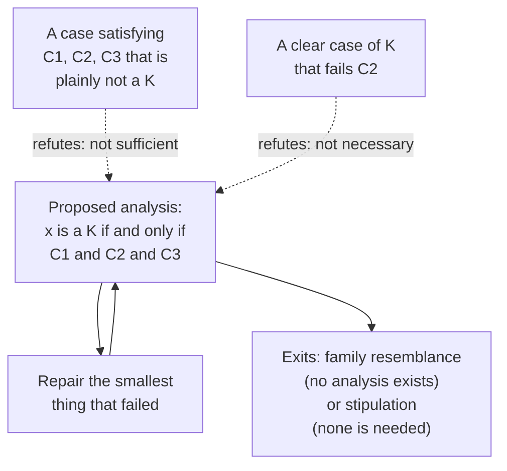

# Philosophical Method · Lesson 3.1: Conceptual analysis

> ⏱ ~15 min · Module 3: Concepts, cases, and intuitions · Builds on: [2.4 Weighing evidence in odds form](02-04-weighing-evidence-in-odds-form.md) · Unlocks: [3.2 Distinctions and verbal disputes](03-02-distinctions-and-verbal-disputes.md)

## Why this matters

A startling share of the arguments in the later courses turn on what a word covers. Is a preemptive strike an act of defence? Is withdrawing a ventilator killing? Is a central bank's asset purchase lending? Is what Trent condemned the same thing modern Lutherans affirm? Each dispute has a factual layer, but underneath it sits a question about a concept — and it is answered not by consulting a dictionary but by proposing a definition precise enough to be wrong, then trying to break it. That method is the engine of `epistemology` and `metaphysics`, and this lesson is where you learn to run it and, just as importantly, to recognize when it has nothing left to give.

## The idea

Think of a definition as a **net**. You describe the mesh — the conditions something must meet — and then check what the net actually holds.

There are exactly two ways a net can be the wrong net, and they are the two ways an analysis fails:

- It **catches something it shouldn't**: a case that meets every condition you listed but is plainly not an instance of the concept. Your conditions are not *enough*.
- It **lets something through it should hold**: an undisputed instance of the concept that fails one of your conditions. Your conditions are not *required*.

That's the whole game. Propose the mesh, then hunt in both directions. The hunting is done with imagined cases, which is why this module puts conceptual analysis, thought experiments and intuitions next to each other: the cases are the evidence, and a proposed definition is the hypothesis they test.

## The argument

**The shape of an analysis.** An analysis of a concept **K** is a biconditional:

> *x* is a K **if and only if** *x* satisfies C1, C2, … Cn.

In words: these conditions are exactly what it takes to be a K — no more and no less. The biconditional is doing two jobs at once, and each can fail on its own.

**Necessary condition.** C is necessary for K when nothing can be a K without C. In words: no C, no K.

**Sufficient condition.** C is sufficient for K when anything that has C is thereby a K. In words: C is enough, and you need check nothing further.

The analysis claims that the conjunction C1 and … and Cn is *both* necessary and sufficient. So:

**Failure 1 — the conditions aren't sufficient.** Exhibit a case that satisfies every Ci and is not a K. In words: your net caught a fish that isn't one. This refutes the "if" half and tells you something is missing.

**Failure 2 — the conditions aren't necessary.** Exhibit a clear case of K that fails some Ci. In words: a real fish swam through. This refutes the "only if" half and, better, names the guilty condition: whichever one the case fails.

**The procedure.**

1. State the analysis sharply enough that a case can decide against it. Vague conditions are unbreakable, which is a vice, not a virtue.
2. Hunt in both directions. Beginners hunt only the first.
3. When a case bites, repair **minimally** — add or weaken one condition, don't rewrite the whole thing.
4. Return to 2 with the repaired analysis.

**Exit A — family resemblance.** Wittgenstein's suggestion (*Philosophical Investigations*, §§66–67; paraphrased, since it is in copyright) is that some concepts have no common thread at all. Look at what we call games — board games, card games, ball games, the Olympic games, a child bouncing a ball against a wall — and you find not one shared feature but a web of overlapping similarities, some shared here and dropped there, like the fibres in a rope where no single fibre runs its whole length. He calls the pattern a *family resemblance*: family members look alike without any one feature being common to all. If a concept is like that, no set of necessary and sufficient conditions exists to be found, and repeated failure is not your incompetence but a fact about the concept.

**Exit B — stipulation.** Sometimes you don't need the concept, only a sharp line for the argument at hand. Then you **stipulate**: "by *coercion* I shall mean, here, any threat that makes an option worse than the person's pre-offer baseline." A stipulation cannot be refuted by a counterexample — it isn't a claim about how the word is used. The cost is that it also cannot be *used* for anything the ordinary concept was carrying. Stipulate, then draw only conclusions your stipulated term supports.

## Argument map

The loop is the method. The dashed edges are the two, and only two, ways in.

## Worked examples

**Example 1 (mechanical — the loop on a small concept).** What is a lie?

*Draft 1: a lie is a false statement.* Both directions break immediately. Not sufficient: a weather forecaster who sincerely predicts sun and is wrong has said something false and told no lie. Not necessary: a witness who believes the defendant was in Chicago and says so in order to mislead has lied — and has, by bad luck, said something true.

*Draft 2: a lie is a statement the speaker believes to be false.* The second direction is now fine. The first still fails: an actor delivering a line, a novelist writing a sentence, a friend saying "lovely weather" in a downpour all assert what they believe false and lie to no one.

*Draft 3: … asserted sincerely, with the intent to deceive.* Better. Now hunt the other direction again — and here the analysis hits live philosophical territory. A witness who lies under oath knowing the court has the tapes and will not be fooled intends to deceive nobody, yet has plainly lied. That is the bald-faced lie, and whether it is a counterexample or a borderline case is genuinely disputed.

Three drafts, four counterexamples, and the concept is sharper than when you started even though you have no finished definition. That is the normal yield.

**Example 2 (why you'd care — the analysis that broke on three pages).**

For a long stretch, the standard analysis of knowledge was the **justified true belief** account, with an ancestry running back to the *Theaetetus*, where Socrates entertains — and does not settle on — knowledge as true belief with an account:

> **C1.** *P* is true.
> **C2.** S believes that *P*.
> **C3.** S is justified in believing that *P*.
> **∴** S knows that *P* if and only if C1, C2 and C3.

In words: knowledge is getting it right, believing it, and having good reason to. Each condition looks necessary — you can't know a falsehood, can't know what you don't believe, and a lucky guess isn't knowledge. The question is whether the three are *enough*.

In 1963 Edmund Gettier published a three-page paper arguing they are not. His two cases rest on two premises he makes explicit: first, a person can be justified in believing something that is in fact false; second, justification carries across a deduction you actually perform — if you are justified in believing *P*, *P* entails *Q*, and you deduce *Q* from *P* and accept it on that basis, you are justified in believing *Q*.

*Case I (the ten coins).* Smith and Jones have both applied for a job. The company president tells Smith that Jones will be the one hired, and Smith has just counted ten coins in Jones's pocket. So Smith is justified in believing: *Jones will get the job and Jones has ten coins in his pocket*. From this he deduces, and accepts, the weaker claim: *the man who will get the job has ten coins in his pocket*. Now the twist. Smith, not Jones, gets the job — and Smith, unknown to himself, happens to have ten coins in his own pocket. So Smith's belief is true, believed, and justified. But he does not know it: what makes it true has nothing to do with what made him believe it.

*Case II (Brown in Barcelona).* Smith has excellent evidence that Jones owns a Ford — Jones has always owned one, and has just offered him a ride in one. Smith has a second friend, Brown, whose whereabouts he has no idea of. He picks a city at random and constructs a disjunction that his evidence entails: *either Jones owns a Ford, or Brown is in Barcelona*. He is justified in believing it, and believes it on that basis. But Jones's Ford is rented, and Brown, by sheer coincidence, is in Barcelona. True, believed, justified — and plainly not knowledge.

Both cases are Failure 1: they satisfy every condition and are not instances. The natural repair is Failure 1's usual remedy — add a condition. Notice what both Smiths have in common: each reasons through a false premise. So require that the justification rest on **no false lemma**. And that repair breaks too, on cases that use no inference at all. Add a condition about defeating evidence, and that breaks. Add a condition about how the belief tracks the truth across nearby possibilities, and that breaks.

**The pattern is the finding.** Six decades of patch-and-break is not a scoreboard of failures; it is an argument. It says the counterexamples are not a ragged collection but variations on one theme — a belief that is true by luck, where the thing that makes it true is disconnected from the thing that justifies it — and that no condition phrased in terms of the believer's reasons has caught that theme yet. Some conclude the concept needs a different kind of condition; some that knowledge is not analysable at all and should be treated as basic. Either conclusion is a *result*, reached by the method failing in an informative way. [`epistemology`](../../epistemology/syllabus.md) takes the repairs from here, in its first module, and does not re-run these two cases; it assumes you have them.

## Watch out

- **You might think necessary and sufficient are two names for the same relation.** Oxygen is necessary for fire and nowhere near sufficient; being a square is sufficient for being a rectangle and not necessary. Swapping them is the single most common error in this lesson, and it inverts which half of the biconditional a case refutes.
- **You might think any odd case refutes an analysis.** A counterexample only works if you and your opponent classify the case the same way *before* the theory is in view. If your opponent shrugs and says "that just is knowledge," you no longer have a refutation, you have a clash of intuitions — which [3.4](03-04-intuitions-and-reflective-equilibrium.md) is about.
- **You might think a dictionary settles it.** Dictionaries report how words are used, competently and for a different purpose; they are almost always too wide to survive five minutes of this method. "Lie: an untrue statement" is a dictionary entry and a broken analysis.
- **The family-resemblance exit is cheap if you take it early.** "It's a family-resemblance concept" can be said of any analysis you failed to complete. Earn it by showing that candidate conditions keep failing in *different* directions with no convergence — and note that Wittgenstein's own claim was about particular concepts, not a general licence.
- **A stipulation that smuggles is worse than no definition.** Define *coercion* your way, argue to a conclusion about coercion, then cash the conclusion in the ordinary sense of the word, and you have changed the subject mid-argument. That is a verbal dispute wearing a disguise, and [3.2](03-02-distinctions-and-verbal-disputes.md) is how you strip it.

## One-liner

> A definition is a net: state its mesh exactly, then hunt for the thing it catches that it shouldn't and the thing it should catch that slips through — and when the hunting never converges, that failure is itself a finding.

## Problems

**P1 (🟢) *(Exegetical.)*** (a) For each pair, say whether the italicized condition is necessary for the concept, sufficient, both, or neither — with a clause of reason.

1. *Being unmarried*, for being a bachelor.
2. *Being valid*, for being a sound argument.
3. *Having been born in the country*, for being one of its citizens.

(b) Against the proposed analysis "a person is bilingual if and only if they learned two languages before the age of five," say which direction of failure each case shows:

1. A woman who learned Portuguese at thirty and now writes novels in it.
2. A man raised speaking two languages at home who has not used the second since childhood and cannot now form a sentence in it.

**P2 (🟡) *(Evaluative.)*** Here is a proposed analysis:

> An utterance is a **promise** if and only if the speaker tells a hearer that he will do something.

Break it in both directions — one case that satisfies the condition without being a promise, one clear promise that fails it — then repair the analysis minimally for *one* of your two cases and say which direction your repair does nothing about. 150 words or fewer.

**P3 (🔴, optional) *(Exegetical (a) · Evaluative (b).)*** An invented working-group memo:

> **Academic Integrity Working Group — draft 3.** We propose: *plagiarism is the submission for credit of work containing material the student did not write.* Objections minuted at the last meeting: (i) a student who quotes a source at length with full citation submits material she did not write; (ii) a student who buys an essay and then rewrites every sentence in her own words submits nothing she did not write. Draft 2 added "without attribution"; the subcommittee broke it within the hour. Draft 3 now runs to four clauses and the subcommittee has a case against each.

(a) Name the direction of failure each objection shows, and say what it establishes about the proposed condition. (b) The group has patched twice and been broken twice. In 150 words or fewer, say whether it should keep analysing or stipulate a definition for the policy, and name what your choice costs.

Solutions

**P1** *(Exegetical — strict.)*

**Must hit, strict (a):**
- 1. **Necessary, not sufficient.** No married bachelors; but unmarried women and unmarried infants are unmarried and not bachelors.
- 2. **Necessary, not sufficient.** Soundness is validity plus true premises ([1.2](01-02-validity-and-soundness.md)), so validity is required and not enough.
- 3. **Neither.** Not necessary — naturalization and descent make citizens who were born elsewhere. Not sufficient — birth on the soil does not confer citizenship everywhere, and even where it does there are exceptions (children of accredited diplomats).

**Must hit, strict (b):**
- 1. The conditions are **not necessary** — a clear case of the concept that fails the stated condition. The guilty condition is the age limit.
- 2. The conditions are **not sufficient** — the case satisfies the condition and is not an instance; learning two languages early does not survive losing one.

**Wrong turns:** answering (b) with "the definition is too narrow / too wide" and stopping — the point is which half of the biconditional dies, and in (b)(1) *which* condition the case indicts; treating 3 as necessary because the paradigm citizen is born at home (paradigms don't establish necessity).

**Model answer:** (a) 1 necessary only; 2 necessary only; 3 neither. (b) Case 1 refutes necessity, and names the age condition as the culprit; case 2 refutes sufficiency.

---

**P2** *(Evaluative — any well-built pair of cases and any defensible repair passes.)*

**Must hit, any verdict:**
- A case meeting the condition that is not a promise. It must be one an opponent would concede, not a borderline one.
- A clear promise that fails the condition — and the condition it fails must be named (typically the "tells … that he will do something" clause, i.e. that promising must be verbal and explicit, or that the content must be the speaker's own future act).
- A repair that adds or weakens **one** thing, and an honest statement that it leaves the other direction untouched.

**Wrong turns:** offering two cases that both refute sufficiency and calling them "both directions" — the commonest error; rewriting the analysis from scratch rather than minimally; picking a contested case (a coerced promise, a promise to the dead) as the refuting case, which converts a refutation into a clash of intuitions.

**Model answer, one of several:** Not sufficient: a weather forecaster tells viewers he will be on air at six. He states his own future act to hearers and promises nothing — prediction is not promising. Not necessary: a bidder raises a numbered paddle at auction, or a man answers "I do." Both are promises and neither *tells* the hearer anything of the required form, so the verbal-statement condition is not required. Minimal repair for the first: add that the speaker undertakes an obligation to the hearer, and does so in uttering the words. That kills the forecaster. It does nothing for the auction paddle, which still fails the condition that the undertaking be stated — a second direction, needing a second repair.

---

**P3** *(a) exegetical — strict; (b) evaluative.*

**Must hit, strict (a):**
- (i) shows the condition is **not sufficient**: the quoting student satisfies "submitted material she did not write" and has not plagiarised. Something is missing from the analysis — attribution.
- (ii) shows the condition is **not necessary**: the essay-buyer is a clear case of plagiarism who wrote every word submitted. The authorship condition is the wrong condition, not merely an incomplete one — which is why draft 2's patch, aimed only at (i), was going to break.

**Must hit, any verdict (b):** say what the choice buys and costs on both sides — that a stipulated policy definition is decidable by an administrator and immune to counterexample, and that it buys this by no longer tracking the offence students are actually blamed for; that continued analysis is aiming at the concept the blame attaches to, at the price of a rule nobody can apply. Whichever is chosen, name one concrete consequence of the loss.

**Wrong turns:** treating (ii) as showing insufficiency because "the essay-buyer did something wrong" — the direction is fixed by whether the case *meets* the condition, and he does; concluding that plagiarism is a family-resemblance concept after two failures, when the failures point at one diagnosis (dishonest claim of credit) rather than scattering; recommending stipulation without naming what it gives up.

**Model answer (b), one of several acceptable ones:** Stipulate, but honestly. A disciplinary code needs a rule an administrator can apply to a file at 11 p.m., and the working group is chasing a moral concept — deceiving a reader about whose intellectual work this is — that the two objections have already shown is not a fact about typing. Write the policy as a list of prohibited acts, labelled as the policy's own term of art, and put the moral concept in the preamble where it belongs. The cost is real: a student who does something genuinely dishonest in a way the list did not anticipate goes unsanctioned, and the list will need amending. The alternative cost is worse — a four-clause definition that the subcommittee itself can break becomes a four-clause definition a student's lawyer can break.

## Flashback

**From Lesson 2.3 (Informal fallacies, and when they aren't):** One of the replies below is a straw man and the other is a legitimate reductio. Say which is which, and name the single test that separates them.

> (a) **Proposal.** "Sentences for non-violent drug possession should be served through treatment courts rather than prison."
> **Reply.** "So we should stop punishing crime altogether and hope addicts sort themselves out. No society that abolished consequences has ever kept its streets."
>
> (b) **Claim.** "No statement is true unless it can be verified by observation."
> **Reply.** "Then take your own statement. No observation verifies it, so by its own rule it isn't true. I'm not attacking a view you don't hold — I'm applying the one you do."

Solution

**Must hit, strict:** (a) is a **straw man**; (b) is a **legitimate reductio**.

- The test: does the version under attack *follow from what the opponent is committed to*, or was it *substituted* for what they said? That is the bridge premise the straw-man shape needs — "the version I attack is one my opponent is committed to."
- In (a) the bridge is false. Treatment courts are a consequence, not the absence of one; "stop punishing crime altogether" and "abolish consequences" are claims the proposer would refuse to sign. The reply also widens the scope from non-violent possession to crime as such.
- In (b) the bridge is satisfied in the strongest possible way: the sentence attacked is the opponent's own, applied to itself. Nothing was added or exaggerated, and the absurd result is derived rather than imputed.

**Wrong turns:** calling (b) a straw man because the opponent would reject its conclusion — an opponent rejecting the conclusion is exactly what a reductio is for, and would make every reductio fallacious; defending (a) on the ground that treatment courts really might weaken deterrence — that is a substantive objection worth making, but it is not the objection the reply makes.

**Model answer:** (a) straw man, (b) reductio. The test is whether the attacked version is derived from the opponent's own commitments or swapped in for them.

## Connections

- **Backward:** this is [1.2](01-02-validity-and-soundness.md)'s counterexample method turned on a definition instead of an argument form. There you built a case with true premises and a false conclusion to kill a pattern of inference; here you build a case that meets the conditions and isn't the thing, to kill a pattern of classification. Same move, new target.
- **Forward:** [3.2](03-02-distinctions-and-verbal-disputes.md) supplies the repair this lesson keeps calling for — when a counterexample bites, the usual fix is a distinction — and shows how to tell that from a dispute about words. [3.3](03-03-thought-experiments.md) is about building the cases well, and [3.4](03-04-intuitions-and-reflective-equilibrium.md) about what entitles a case to refute anything.
- **Sideways:** [`epistemology`](../../epistemology/syllabus.md) owns everything after Gettier — the no-false-lemmas and defeasibility repairs, the modal conditions, and the argument that no repair can work — and assumes this lesson for the cases themselves. [`metaphysics`](../../metaphysics/syllabus.md) is where the method gets its heaviest use: what a cause is, what a person is, what it is for one thing to be part of another are all run exactly this way.
