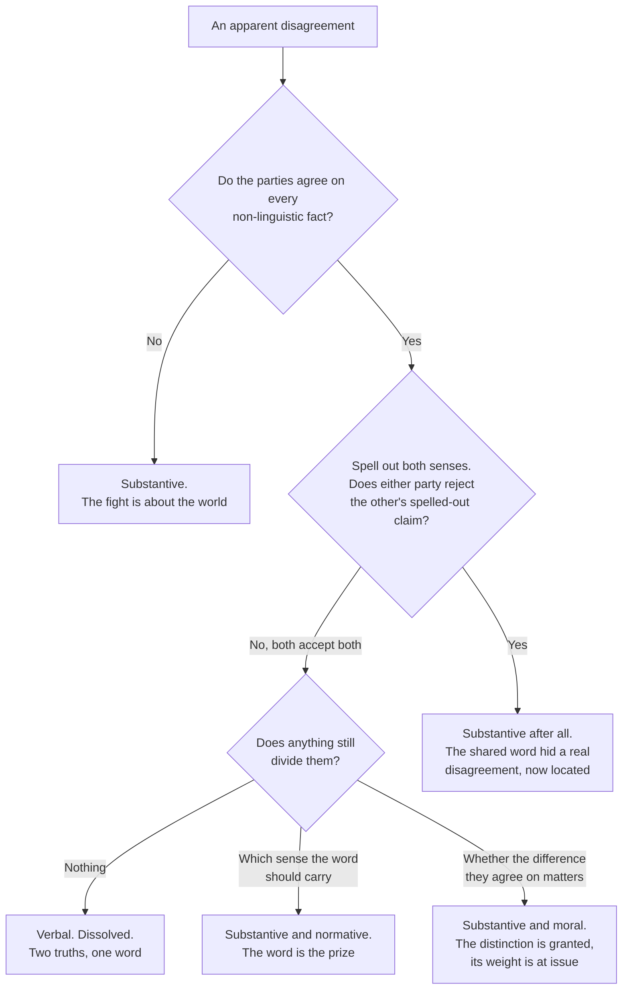

# Philosophical Method · Lesson 3.2: Distinctions and verbal disputes

> ⏱ ~15 min · Module 3: Concepts, cases, and intuitions · Builds on: [3.1 Conceptual analysis](03-01-conceptual-analysis.md) · Unlocks: [3.3 Thought experiments](03-03-thought-experiments.md)

## Why this matters

Some disagreements end the moment somebody draws a line: both sides were right, about different things, and the argument was never about the world at all. Other disagreements survive every line anyone draws, because what is at stake is which line to draw. Telling these apart is the difference between dissolving a dispute and pretending to. And the same move — the distinction — is also the standard escape hatch of a cornered arguer, so you need a test for when a distinction is real work and when it is a dodge.

## The idea

The scholastic reflex when handed an objection is not to accept it or deny it. It is to say **distinguo** — *I distinguish*: the claim is true in one sense, false in another, and the objection needs the sense in which it is false. Aquinas's *Summa* is built out of this move; every "Reply to Objection" that begins by splitting a term is one.

Two examples of the shape, before the machinery:

- "Withdrawing the ventilator killed him." *Distinguo.* Killed, in the sense of *caused his death by an act* — denied. Killed, in the sense of *allowed a fatal condition to run its course* — granted.
- "God cannot make a stone He cannot lift." *Distinguo.* Cannot, in the sense of *lacks the power* — denied. Cannot, in the sense of *the description is incoherent, so there is nothing to make* — granted.

When a distinction works, the disagreement evaporates and leaves two compatible truths behind. When it doesn't, the disagreement moves — usually to the question of whether the distinction *matters*, which is a substantive question in its own right and often the real one.

The mirror-image move is **diagnosis**: seeing that a dispute was verbal all along, so that no one needs to win it. Both moves rely on the same test.

## The argument

**The distinguo, as a procedure.**

1. Identify the term the two parties are using differently. It is almost always a single word doing two jobs.
2. State both senses explicitly, so that each is a claim you could assert on its own.
3. Assert the disputed sentence in one sense and deny it in the other.
4. Check which sense the objection actually needs. If it needs the sense you granted, the objection is untouched and you have achieved nothing.

In words: split the word, then check that the split lands where the fight is. Step 4 is the one people skip, and skipping it is what makes a distinction look like an evasion.

**The test for a verbal dispute.** Given two parties who appear to disagree about whether *S*:

1. Ask whether they agree on every **non-linguistic fact** — everything about the world that could be settled without settling what a word means. If they don't, the dispute is substantive; go argue about the facts.
2. If they do, **eliminate the disputed term.** Replace *S* with *S₁* (the first party's sense spelled out) and *S₂* (the second's), and put both to both parties.
3. If each party now accepts *S₁* and *S₂* alike, the dispute was **verbal**. Nothing was ever in contention but a word.
4. If disagreement survives the substitution, it was **substantive**, and you have just located it precisely.

In words: take the word away and see whether the fight is still there.

**Why some apparently verbal disputes are substantive.** Step 4 has a characteristic failure that looks like a bug and isn't. Sometimes the parties agree on every fact, accept both spelled-out claims, and still disagree — about **which sense the word should carry**. That happens whenever the word is an honorific or a trigger: *democracy*, *torture*, *marriage*, *science*, *recession*, *genocide*. Calling a regime a democracy is not a neutral report; it confers standing, and in some legal systems it releases funds. So "is X *really* a democracy?" can be a genuine question even between people who agree on every ballot cast — a question about which concept deserves the word's authority. The substitution test doesn't dissolve those; it clarifies them, by showing that the disagreement is normative rather than factual.

**When a distinction is an evasion.** A distinction is **ad hoc** when it has no motivation independent of the objection it is deflecting. Three marks, and you need all three to convict:

| Mark | The question to ask | A good distinction |
|---|---|---|
| **Independent motivation** | Is there a reason to draw this line other than escaping this objection? | Tracks something the parties already treat as different elsewhere |
| **Prior availability** | Would the arguer have drawn it before the objection came? | Yes — it is part of the position, not a patch |
| **Generality** | Does it apply to cases beyond the awkward one, including cases that go against the arguer? | Yes, and the arguer accepts the other results |

In words: a real distinction was already there to be drawn, and it costs its maker something. Note that ad hoc is not the same as false: a distinction can be pulled out of thin air and still turn out to be correct. The charge is that nothing has been *shown*, not that the line doesn't exist.

**Four distinctions the later courses run on.** Each splits a term that prose treats as one.

| Distinction | The split | Where it does work | What survives it |
|---|---|---|---|
| **Act / omission** | Doing something that brings about a harm vs. not doing something that would prevent it | Killing vs. letting die; duties of rescue; what a doctor may withdraw | Whether the difference carries *moral* weight, and how much — fiercely disputed |
| **Intending / foreseeing** | The effect you aim at vs. the effect you accept as a side effect | Aquinas on self-defense, *ST* II-II q.64 a.7, where the assailant's death is "beside the intention"; double effect; bombing cases in just-war theory | Whether agents can honestly distinguish their own intentions, and whether foreseen harm is really lighter |
| **Negative / positive liberty** | Freedom *from* interference by others vs. freedom *to* achieve, having the capacity and resources | "Poverty makes people unfree" vs. "no one is stopping them" — both true, different senses | Which sense a constitution or a theory of justice should protect. Entirely substantive |
| **De dicto / de re** (informally) | A claim about *whatever satisfies a description* vs. a claim about *the particular thing* that does | "The Church cannot err in defining the faith" — de dicto: necessarily, what is definitively taught is true; de re: no individual formula is necessary in itself | Scope ambiguities in any modal or intentional claim: *must*, *knows*, *wants*, *believes* |

The scholastics ran the fourth as *in sensu composito* versus *in sensu diviso* — the necessity of the consequence versus the necessity of the consequent. Same split, older clothes.

## Argument map

Only one of the five exits is a dissolved dispute. That ratio is roughly right for real arguments, and it is why "you're just arguing semantics" is so often wrong.

## Worked examples

**Example 1 (mechanical — a dispute that really does dissolve).**

Two analysts fight over whether the department cut its budget. The first says obviously yes; the second says obviously no. They agree on every number in the accounts: the appropriation rose from 400 million to 412 million, prices rose 4 percent, and the population served grew 3 percent.

Run the test. Step 1: do they agree on the non-linguistic facts? Completely — they are reading the same table. Step 2: eliminate the word. *S₁*: real per-capita spending fell. *S₂*: the nominal appropriation rose. Step 3: put both to both. Each accepts both without hesitation; neither wanted to deny the other's sentence, only the other's use of "cut." Step 4: nothing survives. **Verbal**, and dissolved.

Now watch how thin the ice is. Suppose the first analyst adds: "and that is why the department's commitment weakened." The second denies *that* — and no substitution helps, because they now disagree about which measure tracks commitment. One extra sentence turned a verbal dispute into a substantive one. The test is a test of a dispute at a moment, not of a word forever.

**Example 2 (where it strains — the word as the prize, and a distinction under suspicion).**

A country holds elections that international monitors call clean. It also has a supreme court whose judges were replaced en masse by the ruling party, and a broadcast regulator that has closed two opposition stations. Two commentators agree on every one of these facts, in detail. One says: a flawed democracy. The other: not a democracy at all.

Substitute. *S₁*: the country holds competitive elections whose count is honest. *S₂*: the country lacks the independent courts and free press that make electoral competition meaningful over time. Both accept both — so by step 3 this looks verbal. It isn't. What survives is the question of whether "democracy" names a procedure or a system, and that question has consequences: aid eligibility, treaty membership, whether the opposition is obliged to keep contesting elections or entitled to treat the regime as illegitimate. This is the exit marked *the word is the prize*. Naming it verbal here would not dissolve the dispute; it would suppress it.

Now the evasion. The ruling party's spokesman replies that replacing the judges was not court-packing but "a restructuring of judicial administration," on the ground that the reform changed the retirement age rather than the number of seats. Test it. Independent motivation: is there any reason to treat retirement-age changes as different in kind from seat changes, other than that this government used the first one? Prior availability: did the party draw this line before it was accused? Generality: would it accept the same defence from an opposition government that retired its appointees? If the answers are no, no, and no, the distinction is **ad hoc**. That verdict does not show the distinction is false — someone could argue that retirement rules bind future governments too and so are less abusive. It shows that nothing has yet been argued, and that the burden sits where it did.

## Watch out

- **You might think "that's just semantics" ends a dispute.** It is a claim, and it needs the test. The vast majority of disputes people dismiss as verbal survive substitution, usually at the *word is the prize* exit.
- **You might think agreement on the facts makes a dispute verbal.** It doesn't. Two people can agree on every fact about a case and disagree about whether the act/omission difference carries any moral weight. That is a disagreement in values, not in language, and step 2 exposes it rather than dissolving it.
- **You might think drawing a distinction is always progress.** A distinction with no motivation beyond the objection it deflects buys nothing. Apply the three marks before you accept one — including to your own, which is where it is hardest.
- **Don't conflate negative liberty with the old liberty/licence distinction.** Negative liberty is freedom from interference, full stop; licence is freedom misused. A theorist who holds that real freedom requires virtue is making a *positive* liberty claim, not a negative one.
- **A distinguo that grants the wrong half is a concession dressed as a reply.** Step 4 exists for this. Always ask which sense the objection needs.

## One-liner

> A distinction earns its keep when it was already there to be drawn; substitute the two senses and see what still disagrees.

## Problems

**P1 (🟢) *(Exegetical.)*** For each dispute, say whether it is verbal, substantive, or mixed — and where it is verbal or mixed, name the two senses. One sentence each.

(a) Two readers argue about whether Locke is an empiricist. One means the doctrine that all concepts come from experience; the other means the doctrine that all justification rests on experience. They agree about every passage in the text.
(b) Two lawyers argue about whether solitary confinement is "cruel" within the meaning of a constitutional clause. They agree on every finding about what solitary confinement does to prisoners.
(c) Two officers argue about whether the commander killed the villagers or merely failed to save them. They agree on every order given, every movement of troops, and every time of death.

**P2 (🟡) *(Exegetical (a) · Evaluative (b).)*** The paragraph below is from an invented budget memo. (a) Name the distinction the writer is relying on, in one sentence, and say precisely what work it is doing. (b) Run the three marks of ad hoc-ness on it and reach a verdict. 150 words or fewer for (b).

> "The Minister's pledge was that this government would introduce no new taxes, and that pledge stands. The waterway access fee is not a tax. A tax is a compulsory transfer levied on the general population to fund the general budget; the fee is paid only by those who choose to use the locks, and every cent is returned to lock maintenance. Those who prefer not to pay it need only not use the waterway. To describe this as a broken promise is to abandon the ordinary meaning of the word."

**P3 (🔴, optional) *(Exegetical (a) · Evaluative (b).)*** Two commentators agree that a certain state funds religious schools on the same terms as secular ones. The first says this violates religious neutrality, because public money now supports religious instruction. The second says it *is* religious neutrality, because withholding the money would penalise families for a religious choice. (a) Apply the substitution test and say which exit of the map this dispute takes. (b) Name the crux — the one claim one side must deny — and say what kind of consideration would bear on it. 150 words or fewer for (b).

Solutions

**P1** *(Exegetical — strict.)*

**Must hit, strict:**
- (a) **Verbal.** Two senses of *empiricist*: a thesis about the origin of concepts, and a thesis about the source of justification. Both readers accept both spelled-out claims about Locke; nothing survives the substitution.
- (b) **Substantive**, though it looks verbal. The parties agree on all the facts about solitary confinement, but what "cruel" covers in the clause *is* the question before the court — the word is the prize, and the answer determines the outcome. This is the normative exit, not the verbal one.
- (c) **Mixed.** The act/omission distinction dissolves the *descriptive* dispute: he did not fire, and he did not intervene, and both officers grant that. What survives is whether the difference between doing and allowing carries moral or legal weight here — a substantive disagreement in values, not in language.

**Wrong turns:** calling (b) verbal because the facts are agreed — agreement on facts is step 1 of the test, not its conclusion; calling (c) purely verbal and stopping there, which is exactly the move the lesson warns against.

**Model answer:** (a) Verbal — concept-origin empiricism vs. justification empiricism. (b) Substantive — the extension of "cruel" is the legal question itself. (c) Mixed — verbal about the description, substantive about whether the act/omission difference matters.

---

**P2** *(a) exegetical — strict; (b) evaluative — any verdict.*

**Must hit, strict (a):** the distinction is between a **tax** and a **user charge** (or fee for a service actually used), split on two grounds the memo states: who pays — the general population vs. only those who opt in and benefit — and where the money goes — general revenue vs. the service itself. Its work is to let the government raise a compulsory payment while keeping the no-new-taxes pledge. Naming the distinction without saying what it is deployed to protect misses half of (a).

**Must hit, any verdict (b):** run all three marks explicitly, with a reason for each.
- *Independent motivation:* say whether the tax/charge line exists outside this memo. It does — public finance and many legal codes distinguish benefit-linked charges from general taxation, and hypothecated fees are a standard category.
- *Prior availability:* ask whether the line was drawn before the accusation, e.g. whether the pledge itself or earlier budget documents used it.
- *Generality:* test it on cases that cut against the government — a fee on an activity people cannot realistically avoid, or one whose proceeds are later swept into general revenue.
Then give a verdict, and it must follow from the three answers rather than from distaste for the memo.

**Wrong turns:** convicting the distinction of being ad hoc merely because it is self-serving and convenient — a distinction can serve its maker and still be principled, and the three marks are what separate those; conversely, acquitting it just because economists really do use the category, without asking whether *this* fee satisfies it. Also: attacking the pledge instead of the distinction.

**Model answer (b), one of several acceptable:** The line has genuine independent motivation — the benefit principle is standard in public finance, not invented here — so it clears the first mark. It plausibly clears the third too, if the government would accept that a fee swept into general revenue *is* a tax; the memo's own two criteria are testable and cut both ways. The weak mark is availability: nothing shows the pledge was ever understood to exclude compulsory charges, and voters almost certainly heard it as a promise about the total burden. So: the distinction is real but the pledge was not made in its terms. Not ad hoc, but not exculpatory either — which is the useful verdict, and it puts the burden back on the Minister to show the pledge meant what the memo now needs it to mean.

---

**P3** *(a) exegetical — strict; (b) evaluative — any verdict.*

**Must hit, strict (a):** substitute. *S₁*: the state's money reaches religious instruction. *S₂*: the state's rules treat religious and secular choices identically. Both commentators accept both — the facts and both spelled-out claims are agreed. So the dispute is **not** verbal: it takes the *word is the prize* exit, because "neutrality" is being used as an honorific, and what is really in dispute is which conception of neutrality the state owes its citizens — neutrality of *effect* (no public support for religion) or neutrality of *treatment* (no religious classification in the rules).

**Must hit, any verdict (b):** name a single crux claim, stated sharply enough that one side must deny it — for example, *that a state acts neutrally when its rules make no reference to religion, whatever their effects*. Then say what bears on it: cases where the two conceptions come apart and one verdict is clearly unacceptable to both parties, or an account of *why* neutrality is owed at all, since the two conceptions serve different rationales. A crux that both sides could happily accept is not a crux.

**Wrong turns:** declaring the dispute verbal because "they just mean different things by neutrality" — that is the diagnosis the map's normative exit exists to block; offering an entire theory of church and state instead of one crux claim; giving a verdict on the policy in place of locating the disagreement, which is what the problem asks for.

**Model answer:** (a) Not verbal — the normative exit. Both grant that money reaches religious instruction and that the rules are formally even-handed; they disagree about which of those facts "neutrality" names. (b) Crux: *a rule that makes no reference to religion is neutral regardless of what it funds.* The second commentator must affirm it, the first must deny it. What bears on it: a case where formally even-handed rules predictably support one religion overwhelmingly, which tests whether treatment-neutrality can survive its own effects — and, on the other side, a case where withholding a general benefit from religious families is the only way to get neutrality of effect, which tests whether effect-neutrality can avoid penalising belief.

## Flashback

**From Lesson 2.4 (Weighing evidence in odds form):** A sermon of disputed authorship is attributed to a well-known preacher. Before looking at the text, a specialist puts the prior odds that it is his at $1:9$.

She then examines two features.

1. A rare rhetorical tic appears. It occurs in 60 percent of his undisputed sermons and in 5 percent of sermons by his contemporaries.
2. The sermon dates a feast by a convention he uses in only 30 percent of his undisputed works, but which 60 percent of his contemporaries use.

(a) Give the likelihood ratio of each feature and the posterior odds after both, and convert the result to a probability. (b) A colleague says: "The tic shows up in 60 percent of his sermons, so it is more likely his than not." Name the error and say what his figure leaves out. 80 words or fewer for (b).

Solution

**(a)** Odds form: posterior odds = prior odds $\times$ likelihood ratio, and independent pieces of evidence multiply.

Feature 1: $L_1 = \dfrac{0.60}{0.05} = 12$. Feature 2: $L_2 = \dfrac{0.30}{0.60} = \tfrac{1}{2}$ — this one tells *against* him.

$$\text{posterior odds} = \frac{1}{9}\times 12 \times \frac{1}{2} = \frac{12}{18} = \frac{2}{3}.$$

So $2:3$, i.e. a probability of $2/5 = 0.4$. Worth noting the intermediate step: after the tic alone the odds are $\tfrac{1}{9}\times 12 = \tfrac{4}{3}$, a probability of $4/7 \approx 0.571$ — the tic moved a 10 percent prior past even, and the dating convention pulled it back under.

**(b)** **Base-rate neglect**, plus a confusion of $P(E \mid H)$ with $P(H \mid E)$. His figure is the probability of the *tic given authorship*, not of authorship given the tic. It omits the prior — nine rival candidates for every one of him — and omits how often contemporaries use the tic, which is what makes it diagnostic at all. Sixty percent on its own licenses nothing.

## Connections

- **Backward:** [3.1](03-01-conceptual-analysis.md) tested definitions by counterexample; a distinction is what you do when the counterexample shows the term was carrying two definitions at once. The *distinguo* is the constructive half of conceptual analysis — and it is the first real answer to the question 3.1 opened with, whether withdrawing a ventilator is killing.
- **Forward:** [3.3](03-03-thought-experiments.md) varies a case one factor at a time — and the factors worth varying are exactly the ones a distinction has already isolated, which is why act/omission and intending/foreseeing structure the trolley literature. [4.1](04-01-objections-and-replies.md) lists *distinguish* as one of the three standard replies to an objection, alongside deny and concede-and-restrict, and [4.3](04-03-finding-the-crux.md) is this lesson's test run to completion: when substitution fails to dissolve a dispute, what remains is the crux. The scholastic form itself arrives in [4.4](04-04-arguing-within-a-tradition-the-disputed-question.md).
- **Sideways:** act/omission and intending/foreseeing are the working machinery of [`ethics`](../../ethics/syllabus.md) and [`moral-theology`](../../moral-theology/syllabus.md), which owns double effect; negative and positive liberty organise [`political-philosophy`](../../political-philosophy/syllabus.md), and the "is X really a democracy?" dispute is a live methodological problem in [`comparative-politics`](../../comparative-politics/syllabus.md), where regime classification has to be operationalised. The de dicto/de re scope split is made precise with quantifiers and modal operators in [`philosophy-of-language-and-logic`](../../philosophy-of-language-and-logic/syllabus.md).
