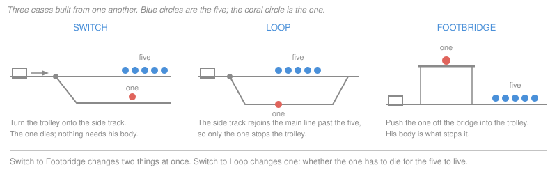

# Philosophical Method · Lesson 3.3: Thought experiments

> ⏱ ~15 min · Module 3: Concepts, cases, and intuitions · Builds on: [3.2 Distinctions and verbal disputes](03-02-distinctions-and-verbal-disputes.md) · Unlocks: [3.4 Intuitions and reflective equilibrium](03-04-intuitions-and-reflective-equilibrium.md)

## Why this matters

Philosophy has no laboratory, so it built one out of descriptions. The veil of ignorance, the state of nature, the brain in a vat, the runaway trolley — each is a situation invented so that a principle has to say something, and you can see whether what it says is something you can live with. Ethics and political philosophy run on these almost entirely. Used properly, an imaginary case isolates the one factor a disagreement turns on; used badly, it is a short story that makes you feel something and then calls the feeling evidence.

## The idea

The point of an imaginary case is never the case. It is the *contrast*.

One case gives you a verdict and nothing more. "That would be monstrous" tells you where you stand, not what made it monstrous — the description has a dozen features and any of them might be doing the work.

Now build a second case identical to the first except for one feature. If the verdict moves, that feature is doing work: it is the only thing that changed, so it is the only thing that can explain the change. If the verdict holds, the feature is idle, however much the story leaned on it. **A single case is a reaction; a minimal pair is a finding.**

That is just a controlled experiment — hold conditions fixed, change one variable, read the output. It also explains the barrage of stipulations that annoys newcomers. You know with certainty the five will die; there is no third option; you will never be found out. Each is a variable clamped down so that it cannot be what is explaining your reaction.

## The argument

**The method of controlled variation.**

1. **Fix the target.** State the principle or candidate factor precisely enough that it delivers a verdict on a described situation. *In words:* if you cannot say what the principle forbids, no case can test it.
2. **Build the base case.** A situation where the principle speaks clearly and your reaction is stable on re-reading. *In words:* you need a fixed point before you can vary anything.
3. **Vary one factor.** Everything else — the numbers, the certainty, who you are in the story, the tone of the telling — stays word for word fixed. *In words:* a variant that changes two things tells you nothing about either.
4. **Compare the verdicts.** Verdict moves: the factor is live. Verdict holds: it is idle, at least around here. *In words:* the pair is the evidence, not the case.
5. **Hunt the confound.** List every *other* difference between the two descriptions, including the ones you did not intend. Each is a rival explanation of any shift you found. *In words:* a difference you did not notice is a variable you did not control.
6. **Turn the framing knob.** Re-tell both cases flatly, or vividly, or in the opposite order. If the verdict moves under that, what moved it was the telling. *In words:* the description is part of the apparatus, so it gets tested too.

**Three rules for building one.**

- **Stipulate away the irrelevant.** What you leave open, the reader fills in — usually with the most familiar version, which imports exactly the features you meant to exclude. Say explicitly that the five cannot be warned, that you will not be prosecuted.
- **Keep it minimal.** Every added detail is another candidate explanation of the verdict. The thinnest case that makes the principle speak is the best one; names, professions and backstories are noise.
- **Do not smuggle the conclusion into the description.** "Harvesting his organs," "sacrificing one to save five," "a frail old man with nothing left to lose" — each settles the question in the telling. Write it flat, then see whether the verdict survives.

## The case

Four cases and the two factors that separate them:

| Case | Threat to the one | Is the one's death needed to save the five? | What most readers report |
|---|---|---|---|
| **Switch** — divert the trolley onto a side track | An existing threat redirected | No — he dies as a by-product; an empty track would do as well | Permissible |
| **Footbridge** — push a large man off a bridge into the trolley's path | A new threat introduced by you | Yes — his body is what stops it | Impermissible |
| **Loop** — divert onto a side track that rejoins the main line past the five | An existing threat redirected | Yes — with the track empty the trolley comes round and kills the five | Split |
| **Transplant** — a surgeon kills one healthy patient to give five others his organs | A new threat introduced by you | Yes — his organs are what save them | Impermissible, near-unanimously |

The last column is a report about what people say, not a claim about what is true. Nothing in this lesson tells you which verdicts are correct; that question is [3.4](03-04-intuitions-and-reflective-equilibrium.md)'s.

## Worked examples

**Example 1 (mechanical — a pair that isn't controlled).**

Switch and Transplant are the canonical pair, and a useful start: the ratio is identical, the certainty is identical, and in both the agent knowingly causes a death. So whatever explains the difference in verdict, it is *not* the arithmetic — which kills off the simplest principle on the table, "minimize deaths," for anyone who holds both verdicts.

Now run step 5. A hospital versus a trackside; a doctor with professional duties versus a bystander with none; a patient who arrived trusting the institution; a practice that would collapse if known; physical contact; a body used as raw material; a threat already in motion versus one you start. Seven confounds. The pair shows that *something* other than the numbers matters and names none of the candidates. Treating it as though it had identified a principle is the commonest misuse of a thought experiment — and one you can now diagnose by asking how many things changed.

**Example 2 (where it earns its keep — Footbridge, then Loop).**

Footbridge kills most of that list: no hospital, no doctor, no institution — you are a bystander at a railway in both it and Switch. Most readers still flip from permissible to impermissible, so the medical features were not what was doing the work. Two differences survive: in Footbridge you *introduce* the threat to the one rather than redirecting an existing one, and his death is *needed* — move him aside and the five still die.

Those two travel together in both cases, so neither pair separates them. Hence Loop, invented for exactly that job: the trolley is redirected, as in Switch, but the spur rejoins the line beyond the five, so the man on it is the only thing that stops it — his death is needed, as in Footbridge. One factor from each, everything else held fixed.

That is the whole reason to build it. A principle resting on redirecting-versus-introducing says Loop is permissible; one resting on whether the one is *used* says it is not. They agreed everywhere else, so your verdict on Loop discriminates between them — and finding that you have no stable verdict is informative too, since it says the two factors were never cleanly separated in your thinking. Building the principle that fits all four cases is Module 3's boss problem; the skill here is knowing which fourth case to invent.

**What a case can show.** Refute a universal — "it is never permissible to kill an innocent" falls to a single case, for anyone who shares the verdict on it. Show that a factor is not doing the work (Footbridge, on the hospital features). Show that two principles which agreed everywhere come apart (Loop). Show what a position costs.

**What it cannot show.** It cannot establish a positive principle on its own: any one verdict is consistent with indefinitely many principles that would deliver it, which is why you need a family of variants rather than a case. It cannot settle a dispute where the verdicts themselves diverge — it relocates the disagreement somewhere sharper, which is progress but not a result. And it says nothing about policy: the stipulations deleted uncertainty, error and precedent, which are exactly what a real rule has to survive. "Would you push him?" and "should surgeons be permitted to?" are different questions.

## Watch out

- **You might think a vivid case is a strong case.** Dennett's name for the danger is the *intuition pump*: a case whose concrete, memorable details generate a verdict the underlying principle never earned. Vividness is a cause of belief, not a reason for one. His remedy is the method itself — turn the knobs and see which details the verdict actually depends on. A detail you can change without moving the verdict was scenery.
- **You might think framing effects sink the whole enterprise.** Reported verdicts do shift with wording and with the order cases are presented in, which is a genuine worry about how much weight one reaction can bear. But framing is just another factor, tested the same way as any other: hold the case fixed, vary the telling, see whether the verdict moves. A verdict that survives being re-described flatly has passed a test that one you merely felt has not.
- **You might think a stipulation cannot be questioned.** "Assume you know with certainty" is a fair control. "Assume the surgeon is never found out, no one's trust is affected, and nothing follows from the precedent" may have stipulated away the very thing that made the case feel wrong — leaving you with a verdict about a situation nobody has considered views about. Stipulate to control a variable, never to disarm an objection.
- **You might think the trolley cases are about trolleys.** They are a test rig, chosen because trolleys carry no ideological baggage and the numbers come out clean. "That would never happen" mistakes the apparatus for the subject, like refusing a physics problem because the surface is frictionless.

## One-liner

> One case gives you a reaction; a minimal pair gives you a reason — so always build the second case, and make it differ in exactly one thing.

## Problems

**P1 (🟢) *(Exegetical.)*** Each pair below is meant to test one factor. For each, say what factor it varies and what principle that tests. Then say which of the two pairs is badly controlled, name the confound, and repair it. One sentence per part.

> **Pair A.** (1) A runaway mine cart will kill five miners unless you divert it down a siding where it will kill one. (2) Word for word the same, except the siding holds two miners rather than one.
>
> **Pair B.** (1) A captain orders a sailor to a deck post where he will certainly drown, and doing so saves the other twenty aboard. (2) The sailor, knowing what the post means, volunteers for it, and the twenty are saved.

**P2 (🟡) *(Exegetical.)*** The paragraph below is from an invented op-ed opposing a bill that would release hospital records in anonymized, aggregate form to public-health researchers. (a) The case it tells is not a controlled variant of the bill: name the features the story adds that the bill does not contain. (b) Write the description that *would* test the author's stated principle — same principle, nothing smuggled in. 150 words or fewer for (a) and (b) together.

> "Picture the clerk. A windowless room, a badge on a lanyard, coffee going cold, and on the screen in front of him your daughter's file — the hospital stay she has told no one about, the diagnosis she is still deciding how to explain to her father. He scrolls. He is bored. Somewhere in a ministry a form was signed, and that form is all that stands between her worst week and a stranger's idle afternoon. No one should have that power over another person's life without her leave. If the sponsors of this bill believe otherwise, let them publish their own records first."

**P3 (🔴, optional) *(Evaluative.)*** A friend defends this principle: *breaking a promise is permissible only when keeping it would cause serious harm to someone other than yourself.* (a) Build a minimal-pair variant — a base case the principle clearly handles, and a second case differing in exactly one factor — that either breaks the principle or leaves it with no verdict. (b) Say what your pair establishes and what it does not. Any verdict on whether the principle survives; you are graded on the construction. 150 words or fewer.

Solutions

**P1** *(Exegetical — strict.)*

**Must hit, strict:**
- **Pair A** varies the *ratio* (five-versus-one against five-versus-two) with everything else word-for-word fixed. It tests whether, and how steeply, the verdict depends on the numbers alone — i.e. whether the principle in play is sensitive to magnitude or only to the direction of the trade.
- **Pair B** is meant to vary *consent*. It is the badly controlled one.
- **The confound:** case (2) changes the captain's act as well as the sailor's consent. In (1) the captain orders a man to his death; in (2) he accepts an offer. Two factors move at once — consent, and whether the agent commands or permits — so a shift in verdict is unattributable.
- **The repair:** hold the captain's act fixed and vary consent alone. For example, (2') the captain gives the same order, to a sailor who on enlistment expressly accepted that he could be ordered to such a post. Now only the consent differs. (A repair that instead holds consent fixed and varies command-versus-permission is equally good, as long as only one factor moves.)

**Wrong turns:** calling Pair A badly controlled because the two cases have different numbers — that difference *is* the factor under test, not a confound; naming "how the sailor feels about it" as the confound, which is a consequence of the change rather than a second independent variable.

**Model answer:** A varies the ratio, testing whether the numbers alone drive the verdict. B is meant to vary consent but also swaps ordering for accepting a volunteer; repair it by keeping the order identical and varying only whether the sailor had consented in advance.

---

**P2** *(Exegetical — strict.)*

**Must hit, strict (a):** the story adds features the bill does not contain, and each is doing persuasive work: a named, identified individual rather than anonymized aggregates; one reader's own daughter rather than a stranger; a single human reader scrolling a full clinical file rather than statistical release; the reader's idleness and boredom, i.e. no research purpose at all; a secret the subject is actively concealing; and a hint of illegitimate process ("somewhere a form was signed"). Anonymization — the entire mechanism of the bill — is silently removed. Credit for naming any three or four of these plus the removal of anonymization, which is the central one.

**Must hit, strict (b):** the repaired description keeps the author's stated principle — no one may hold another's medical information without her leave — and strips the added features: an aggregate count of diagnoses by district, with no name, record or reader identifiable, released to an accredited researcher under the bill's procedure, from a patient who was not asked. Does the principle still condemn it? That is the test the op-ed never ran.

**Wrong turns:** saying "it is an appeal to emotion" and stopping — the task is to name *which* features carry the emotion and which of them the policy lacks; rebutting the op-ed's conclusion, which is not asked for and not gradeable here.

**Model answer:** (a) The case adds identifiability, kinship, a human reader with no research purpose, a concealed diagnosis and a whiff of procedural irregularity, and quietly deletes anonymization and aggregation — the whole substance of the bill. (b) Controlled version: a district-level count of diagnoses, no individual recoverable, released to an accredited researcher under the statutory procedure, without the patient's having been asked. If the principle still forbids that, the author has an argument; if it does not, the clerk was doing the work.

---

**P3** *(Evaluative — graded on construction, not on the verdict.)*

**Must hit, any verdict:**
- A base case the principle handles cleanly, with your reaction stated: e.g. you promised to meet a friend for lunch, and keeping the promise would cost only your own afternoon — the principle says keep it, and that sits fine.
- A variant differing in **exactly one** factor, with the factor named explicitly. The clause offering the most purchase is "serious harm to someone other than yourself": vary the *size* of the harm (trivial harm to a third party), *who* bears it (grave harm to yourself alone), or the *nature* of the cost (no harm at all, but keeping the promise now requires a lie).
- A statement of what the pair delivers: either a counterexample (the principle gives a verdict you reject) or an undetermined case (the principle is silent), and which of the two you got.
- Explicit confound check: confirmation that nothing else moved between the two descriptions.

**Wrong turns:** changing two things at once — a common one is making the third party a child *and* raising the stakes, after which no shift can be attributed; building a variant so extreme that your reaction is unreliable, which surrenders the fixed point the pair depends on; concluding that the principle is "just wrong" without saying which of the two results your case produced.

**Model answer (one of several acceptable):** Base: I promised to help you move on Saturday; keeping it costs me a pleasant afternoon. Principle: keep it. Agreed. Variant, one factor changed — who bears the harm: keeping it now costs me a surgery date that will not come round again for a year, and no third party is affected either way. The principle says the promise binds, since the serious harm falls on me alone. If that verdict is one you reject, the pair is a counterexample to the "someone other than yourself" clause. What it shows: that clause, as written, is too strong. What it does not show: what should replace it — a proportionality condition, a threshold, or an exception for promises whose keeping is merely inconvenient are all still on the table, and only further variants will separate them.

## Flashback

**From Lesson 3.1 (Conceptual analysis):** Someone proposes: *an act is courageous if and only if the agent does what he is afraid to do.* (a) Give a counterexample showing the condition is not sufficient. (b) Give one showing it is not necessary, or argue that it is. (c) Add one condition that blocks your counterexample in (a), and say what your repaired definition now excludes that it should not. Three sentences or fewer per part.

Solution

**Must hit, strict (a):** a case where the agent does what he fears and the act is plainly not courageous. A burglar terrified of the alarm who breaks in anyway; a man who fears heights and jumps off a roof on a dare. The condition is met and the verdict fails, so fear-overcoming is not sufficient — courage looks to require something about the end pursued, or about the proportion of the risk to it.

**Must hit (b), any verdict:** either a counterexample to necessity — the veteran who feels no fear at all and still stands his ground, or the rescuer who acts before fear registers — or a defended denial that these are courage, e.g. on the ground that the fearless soldier displays a trained disposition rather than an exercise of courage. Both directions pass; what is graded is that the necessity claim is tested rather than assumed.

**Must hit (c):** a repair plus its cost. Typical repair: *and the act is undertaken for a worthy end.* The cost must be named — this now excludes the mountaineer who risks his life for no end but the climb, and it makes every judgment of courage wait on a judgment about the worth of the end, which is a much larger commitment than the original definition made.

**Wrong turns:** offering a counterexample to (a) that the definition already excludes, such as someone who is not afraid at all — that bears on necessity, not sufficiency; repairing in (c) by stipulating "and the act is courageous," which is circular.

**Model answer:** (a) A burglar who dreads the alarm and forces the door anyway does what he fears; nothing here is courageous, so the condition is not sufficient. (b) The experienced firefighter who feels no fear entering the building still seems to act courageously, so fear is not necessary either — though one could hold instead that what he shows is trained steadiness, and courage strictly requires fear mastered. (c) Add "for a worthy end": that blocks the burglar, but it now denies courage to the reckless climber and makes every attribution of courage depend on an evaluation of the goal.

## Connections

- **Backward:** [3.2](03-02-distinctions-and-verbal-disputes.md) taught you to draw a distinction; a variant case is how you *test* one — Loop exists precisely to check whether "redirect versus introduce" and "used versus not used" are one distinction or two. And [3.1](03-01-conceptual-analysis.md)'s counterexample to a definition is the same move applied to a concept rather than a principle: build the case the analysis gets wrong.
- **Forward:** [3.4](03-04-intuitions-and-reflective-equilibrium.md) takes up the question this lesson deliberately leaves open — when a case and a principle collide, which one gives way. Module 3's boss problem then asks you to build the principle that fits the trolley/transplant pair and to break it with a variant of your own, which is steps 1 through 5 run in anger. In Module 4, [4.1](04-01-objections-and-replies.md) classifies the objection a variant case constitutes, and [4.3](04-03-finding-the-crux.md) uses variants to locate the premise a disagreement turns on.
- **Sideways:** this is the working method of [`ethics`](../../ethics/syllabus.md), where the trolley family is used to build principles rather than to demonstrate a technique, and of [`political-philosophy`](../../political-philosophy/syllabus.md), whose central device — choosing principles behind a veil of ignorance — is one enormous thought experiment with the stipulations doing all the argumentative work. [`metaphysics`](../../metaphysics/syllabus.md) and [`epistemology`](../../epistemology/syllabus.md) run the same apparatus on non-moral questions: personal identity under teleportation, knowledge in a world of lucky guesses.
