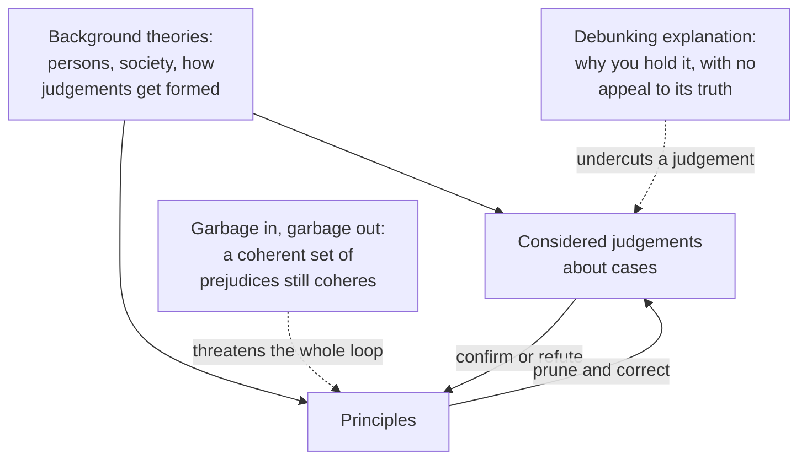

# Philosophical Method · Lesson 3.4: Intuitions and reflective equilibrium

> ⏱ ~15 min · Module 3: Concepts, cases, and intuitions · Builds on: [3.3 Thought experiments](03-03-thought-experiments.md) · Unlocks: [4.1 Objections and replies](04-01-objections-and-replies.md)

## Why this matters

Lesson 3.3 built cases and read verdicts off them, which leaves the question the module has been deferring: when your verdict on a case collides with a principle you believe, which gives way? Every ethical theory and every theory of justice is settled by how that collision is handled — and it is also where philosophy looks worst from outside, because "that seems wrong to me" gets offered as though it were a measurement.

## The idea

An **intuition**, in the philosopher's sense, is not a hunch or a feeling. It is a **considered judgement about a case**: you judge that *this* is what the case shows, under conditions that give the judgement a chance of being right. Four conditions do the work:

1. **You understand the case** — and have not silently filled in details that change it.
2. **It is stable** on re-reading. A first flash you would withdraw is not data.
3. **No stake, no heat.** Self-interest, loyalty and disgust are known distorters.
4. **It is not a theory-report.** "I'm a utilitarian, so the surgeon acts rightly" is the principle talking, and data has to be able to disagree with the theory it tests.

Why should such a judgement count as evidence at all? Because principles in ethics and epistemology are not read off the world directly — so if case-judgements are not evidence, nothing is.

## The argument

**A. Intuitions as evidence.**

> **P1.** A method with no judgements about cases has nothing to test its principles against.
> **P2.** Our only access to the subject matter of ethics, and much of epistemology and metaphysics, is through judgements about particular cases.
> **P3.** Evidence need not be infallible: defeasible, theory-laden observation reports function as evidence throughout the sciences.
> **∴ C.** Considered judgements are evidence for and against philosophical principles — defeasible evidence, not data to be preserved at all costs.

In words: throw out case-judgements and you have nothing left to be wrong about, and the fact that they can be wrong no more disqualifies them than it disqualifies a thermometer.

**B. The procedure: reflective equilibrium.**

1. Collect considered judgements across a range of cases, marking the surest as **provisional fixed points**.
2. Propose principles that systematize them.
3. Where a principle and a judgement conflict, there are exactly three moves: **amend the principle**, **withdraw the judgement**, or **redescribe the case** so that a distinction dissolves the conflict.
4. Iterate: an amended principle is a new principle, so re-run it against cases you had already settled.
5. Stop when the two cohere. That is the **equilibrium**, and it is provisional — the next case can break it.
6. **Widen it.** Bring in rival conceptions and background theories — of persons, of society, of how judgements like yours get formed — and ask of each survivor whether it would still look right to someone who knew where it came from. Rawls distinguished the narrow version from this **wide** one; the wide one is what the method now means.

**The ad-hoc test for step 3.** An amendment is *principled* if it follows from something you would have accepted anyway and commits you about cases you have not looked at; *ad hoc* if its only motivation is the case that forced it. "Lying is wrong, except when it isn't" predicts nothing.

**C. The two ancestors.** Goodman set this structure out for *inductive rules*, not morals, in *Fact, Fiction, and Forecast* (1955) — modern, so paraphrased. A rule of inference is justified by the particular inferences it licenses and the inferences by the rules: amend a rule when it sanctions an inference you are genuinely unwilling to accept, reject an inference when it violates a rule you are unwilling to amend. Goodman granted the circle and argued it is not vicious. Rawls carried the structure into moral theory in *A Theory of Justice* (1971), named it reflective equilibrium, and credited Goodman with it. His fixed points are judgements like *religious intolerance and slavery are unjust*, and his adjustments run not only between those and principles of justice but between them and the description of the choice situation built to generate the principles.

**D. The fork.** When a valid argument runs from a theory to a verdict you hate, two people can accept every step and part ways:

> **Shared premise.** If theory **T** is true, then verdict **V** follows.

| | Keeps | Concludes | Called |
|---|---|---|---|
| The theorist | **T** | **V**, counterintuitive as it is | running *modus ponens* — "biting the bullet" |
| The critic | the judgement that **not-V** | **T** is false | running *modus tollens* — a reductio of **T** |

Hence the saying, whose author is disputed: *one person's modus ponens is another's modus tollens*. In words: nobody is reasoning badly. The disagreement is entirely about which end of the argument carries more confidence, and saying that out loud is usually more progress than another round of the argument.

**Biting the bullet honestly.** Three checkable conditions:

1. **State the implication at full strength**, in the words of someone who finds it monstrous — no quiet redescription of the case.
2. **Price it.** Say what it costs and what the theory buys that is worth the cost.
3. **Say what would be too much.** Name an implication that would make you drop the theory. A theory that can absorb anything is being protected, not tested.

Fail the first and you are dodging the bullet, not biting it; fail the third and there was never a bullet at all.

## Argument map

Solid arrows are the loop: each side is evidence about the other, which is why neither is the foundation. The dashed arrows are the two standing objections — one aimed at a single judgement, one at the method as a whole.

## Worked examples

**Example 1 (mechanical — the loop on inductive rules).**

Take a rule anyone starts with: *if every observed F has been G, infer that the next F will be G.*

Run it: every president of the United States so far has been male, so the next one will be male. Almost nobody will accept that with the confidence the rule licenses — so let the rejected inference bear on the rule, and amend it to require a regularity of the kind that supports a generalization rather than an accidental run produced by a mechanism that can change. That amendment is *principled* by the test above: it follows from something you already believed about accidents versus laws, and it commits you about cases you have not looked at.

Now the other direction: *everyone I surveyed at the rally supports the measure, so the measure is popular.* Here a rule you are unwilling to amend — don't project a property your sample's selection guaranteed — makes you reject the inference instead. Same procedure, opposite direction, neither side sovereign.

**Example 2 (why you'd care — a bullet, bitten well and badly).**

A sheriff can stop a riot that will kill five by framing and hanging one innocent man. Act utilitarianism — do whatever produces the most good overall — says he should. Almost everyone judges that he must not.

**Badly bitten:** "In the real world the frame-up would be discovered, trust in the courts would collapse, and utility would not in fact be maximized." The case stipulates that the frame-up succeeds, so this changes the case rather than confronting it — condition 1 fails, and so does condition 3, since no possible case could embarrass a theory defended this way.

**Bitten well:** "In the case as stipulated the theory says hang him, and that is as bad as it sounds — I am endorsing the judicial murder of an innocent man. What I get is a principle that explains why we build institutions against exactly this, that answers where rival theories go silent, and that never lets an abstract rule outrank five actual lives. My limit: if maximizing good recommended framing people in ordinary, unstipulated circumstances, I would abandon it."

**The tollens reply:** "Agreed that the theory implies it — that is my premise. An acceptable moral theory does not license the judicial murder of the innocent; this one does; so it is false." Same conditional, opposite direction, and the argument is finished. What remains is a comparison of confidences: is your grip on the sheriff verdict firmer than your grip on the theory? Made explicit, that question is what [4.3](04-03-finding-the-crux.md) calls the crux.

## Watch out

- **You might think coherence is the goal and therefore the proof.** It is the constraint, not the source: a perfectly coherent set of prejudices is perfectly coherent — **garbage in, garbage out**. Coherence certifies that nothing in your set contradicts anything else, and nothing about where the set came from. That is what step 6 is for.
- **"Whose intuitions?" is a real question, not a rhetorical one.** The judgements anchoring the literature were produced by a narrow slice of people. Experimental philosophers have reported that some case-verdicts vary with culture, presentation order and framing; replication has been mixed and the effect's size is contested, so the honest statement is that the worry is live and its extent unsettled. Either way, a judgement that differently situated people do not share is weaker evidence, and you should know which of your fixed points those are.
- **A debunking explanation undercuts without refuting.** If the best account of why you hold a judgement never mentions its being true — you were raised to it, your interests are served by it, it is a leftover of some selection pressure — its evidential force drops, though the judgement may still be correct. The move works only when the causal story is independently supported rather than invented to fit, and does not generalize far enough to swallow the debunker's own judgements. Naming a genetic fallacy is not by itself a refutation of one, nor is asserting one an argument; [2.3](02-03-informal-fallacies-and-when-they-arent.md) is where that line is drawn.
- **You might think the fork has a neutral answer.** No algorithm tells you which way to run it. Nor is it arbitrary: compare your confidence in each end, check whether either end has a debunking explanation against it, and ask which choice costs more elsewhere in the system.

## One-liner

> Principles and case-judgements are evidence about each other, so either can be revised — and biting a bullet is honest only when you state the cost at full strength, price it, and name what would be too much.

## Problems

**P1 (🟢) *(Exegetical.)*** Which of these count as considered judgements in the philosopher's sense, and which do not? One clause of reason each.

(a) "On first reading the transplant case I thought the surgeon acts wrongly; re-reading it with the numbers clear and nobody I know involved, I still do."
(b) "Torturing a child for entertainment is wrong."
(c) "I'm a utilitarian, so I judge that the surgeon acts rightly."
(d) "Something about that case makes my skin crawl, though I couldn't tell you what is supposed to have happened in it."

**P2 (🟡) *(Exegetical (a) · Evaluative (b).)*** The paragraph below is from a newspaper column written for this problem; the author is fictional.

> "We punish because we think people deserve it. But desert requires that a person be the ultimate author of his own character, and nobody is: temperament is inherited, formation is dealt out by a childhood no one chose, and the will that picks between them was assembled by those same two forces. Strip out desert and what is left — deterrence, incapacitation, repair — justifies a fraction of the sentences we hand down. Yes, my readers will feel that the man who murdered a child deserves to suffer. They feel it because selection installed a taste for revenge in animals that had to deter free-riders without courts. A feeling with that pedigree is not evidence about what anyone deserves."

(a) State the conditional that the columnist and his opponent both accept, say which direction each of them runs it, and name each side's fixed point.
(b) The last two sentences are a debunking explanation. Does it do its work? 150 words or fewer for (b).

**P3 (🔴, optional) *(Evaluative.)*** A principle and a judgement collide:

> **Principle.** A law binds a person only if that person consented to it.
> **Considered judgement.** The law against assault binds a violent man who has never consented to anything.

(a) Run one iteration: make the move you think right — amend the principle, withdraw the judgement, or redescribe the case — and state the result precisely enough to test. (b) Say whether your amendment is principled or ad hoc by the lesson's test, and name the implication that would make you abandon it. 150 words or fewer for (a) and (b) together.

Solutions

**P1** *(Exegetical — strict.)*

**Must hit, strict:**
- (a) **Yes.** Case understood, judgement stable on re-reading, no stake — the four conditions are met.
- (b) **Yes**, and about as secure as they come: a provisional fixed point, the kind of judgement a principle has to answer to rather than the other way round.
- (c) **No.** It is a theory-report, read off the principle it would be used to test. Data that cannot disagree with the theory is not data.
- (d) **No.** Two failures: the case is not understood, and a reaction is reported rather than a judgement about the case.

**Wrong turns:** rejecting (b) because it is "obvious" — obviousness is what makes a fixed point useful, not what disqualifies it; accepting (c) because a utilitarian sincerely believes it, which confuses sincerity with independence.

**Model answer:** (a) considered judgement — stable, understood, disinterested. (b) considered judgement, and a fixed point. (c) not one — the theory is speaking, so it cannot test the theory. (d) not one — the case is not understood, and a feeling is not a verdict.

---

**P2** *(Exegetical (a) — strict · Evaluative (b) — any verdict.)*

**Must hit, strict (a):** the shared conditional is roughly *if desert requires ultimate authorship of one's own character, and nobody has that, then nobody deserves to suffer for what they do.* The columnist runs **modus ponens**: he keeps the premise about desert and accepts the counterintuitive conclusion, and his fixed point is the theoretical claim about authorship. The opponent runs **modus tollens**: he keeps the judgement that the child-murderer deserves punishment and concludes that the authorship requirement is false, and his fixed point is the judgement about the case. Both accept the same valid argument.

**Must hit, any verdict (b):** state what the debunking claims — that the best account of why readers hold the judgement never mentions its truth — and test it on at least one of these: (i) is the causal story independently supported, or posited because it gets the required result? (ii) does it single out this judgement, or does it generalize to the columnist's own moral judgements, including his judgement that excessive punishment is wrong (a proves-too-much check)? (iii) does an origin that makes no reference to truth actually undercut, given that a faculty can be selected for and still track something real? Any verdict passes if one of these tests is actually run.

**Wrong turns:** deciding (b) by whether retribution is in fact justified, which assumes the very thing in dispute; dismissing the paragraph as a genetic fallacy without further argument — debunking explanations are a legitimate move when the causal story stands on its own, so the label settles nothing; answering (a) with "the columnist is wrong" instead of naming the direction and the fixed point.

**Model answer (b), one of several acceptable:** The debunking is stated well but overreaches. It needs the causal story to be supported independently of the conclusion it rescues, and a general claim that moral emotions were selected for deterrence is not evidence about this judgement in particular. Worse, it generalizes: if a selected-for origin drains a judgement of evidential force, the columnist's own conviction that we hand down too many long sentences is in the same position, since compassion has as plausible a selective history as revenge. That leaves him with no judgements to argue from. The move could be repaired by narrowing it — showing that *this* judgement varies exactly as the evolutionary story predicts and not as the truth of desert would predict — but as written it is a general solvent, and general solvents dissolve the beaker.

---

**P3** *(Evaluative — any verdict, graded on the moves.)*

**Must hit, any verdict:**
- Name the conflict exactly: the principle denies what the judgement asserts, because the man never consented.
- Make one of the three moves and state the result as something testable. Amending: e.g. restrict the principle to laws that do more than prohibit what is independently wrong, or replace actual with hypothetical consent and say which act or condition counts. Withdrawing the judgement is the bullet here, and it is a live position — philosophical anarchism accepts that the assault law does not bind him, while adding that we may still restrain him. Redescribing: distinguish *binding in conscience* from *enforceable against you*, and let the principle govern only the first.
- Apply the ad-hoc test to your own move: does the amendment follow from something you already held, and does it commit you about cases you have not examined? If its only support is this case, say so.
- Name a would-be-too-much implication — the result that would make you drop the amended principle rather than patch it again.

**Wrong turns:** offering "tacit consent" with no account of which act constitutes it, which is an amendment too vague to be tested and the standard ad hoc patch here; treating philosophical anarchism as self-evidently absurd instead of as a bullet someone bites openly, which is exactly the move condition 1 forbids; amending the principle and then not re-running it against cases you had already settled (step 4).

**Model answer, one of several acceptable:** Amend: *a law binds a person only if he consented, or it prohibits conduct that is wrong independently of any law.* This is principled rather than ad hoc — the wrong-independently clause is something I held before meeting this case, and it commits me in advance about tax law, traffic law and conscription, none of which it covers. The cost is visible: my amended principle now says a great deal of ordinary legislation does not bind, which is close to the anarchist's conclusion for everything except a small core. That is the bullet I am biting, and I would state it that strongly. What would be too much: if the wrong-independently clause turned out to cover almost every statute, the amendment would have preserved the principle by emptying it, and I would drop it rather than patch it again.

## Flashback

**From Lesson 3.2 (Distinctions and verbal disputes):** Two historians:

> **A:** "The English Civil War was a revolution. They tried the king, cut off his head, and abolished the monarchy — nothing in Europe had gone that far."
>
> **B:** "It was not a revolution. Within twelve years the monarchy was back, and the same families owned the same land before and after. Nothing fundamental changed hands."

Is this dispute verbal, substantive, or mixed? Draw the distinction that dissolves whatever is verbal in it, and state precisely what substantive disagreement, if any, is left once the distinction is drawn. 150 words or fewer.

Solution

**Must hit:** identify the two senses of "revolution" in play — a *constitutional or political* rupture (who holds sovereign power, by what title) versus a *social* one (which class owns what, and who is on top afterwards). Once those are separated, A and B can both be right: it was a revolution in the first sense and not in the second, and they are not contradicting each other while both use the unqualified word.

**Must hit:** state the substantive residue rather than declaring the dispute purely verbal. Candidates: whether the constitutional rupture was durable enough to count even in its own sense, given the Restoration; whether the eventual settlement left royal power permanently reduced; and, underneath, which kind of change matters for whatever the historians are arguing about — a disagreement about which concept earns the name, which is itself substantive if a claim about historical significance rides on it. Any well-supported account of the residue passes.

**Wrong turns:** calling it purely verbal and stopping — "they're just using the word differently" abandons the question before the residue is found; calling it purely substantive and picking a winner on the facts, which ignores that the two sides are pointing at different facts, neither disputed.

**Model answer:** Mixed. Distinguish political revolution (sovereignty changes hands and the title to rule is remade) from social revolution (the distribution of property and class power is remade). A's evidence establishes the first, B's the second, so the flat "was it a revolution" question has no single answer and that part of the dispute dissolves. The residue is real: whether the Restoration cancels the political revolution or merely interrupts it, and which of the two kinds of change the historians think carries the weight they are actually arguing about.

## Connections

- **Backward:** [3.3](03-03-thought-experiments.md) produced verdicts on cases; this lesson says what a verdict is worth and what to do when one collides with a principle. The third move in step 3 — redescribe the case — is [3.2](03-02-distinctions-and-verbal-disputes.md)'s distinction-drawing put to work, and the counterexamples that broke analyses in [3.1](03-01-conceptual-analysis.md) are the same loop running one turn.
- **Forward:** [4.1](04-01-objections-and-replies.md) turns "amend the principle" into the concede-and-restrict reply, made under fire from a named objector; [4.3](04-03-finding-the-crux.md) is the fork in Example 2 made into a general technique. Module 3's boss problem is exactly this lesson applied to the trolley and transplant pair.
- **Sideways:** [`ethics`](../../ethics/syllabus.md) and [`political-philosophy`](../../political-philosophy/syllabus.md) run on this method almost entirely — theories of justice are built by mutual adjustment between principles and judgements about slavery, intolerance and inequality, and the argument between them is usually a fork rather than a mistake. [`epistemology`](../../epistemology/syllabus.md) is where the method is put on trial: whether intuitions are evidence, whose they are, and whether coherence buys anything are live questions there, not settled background.
