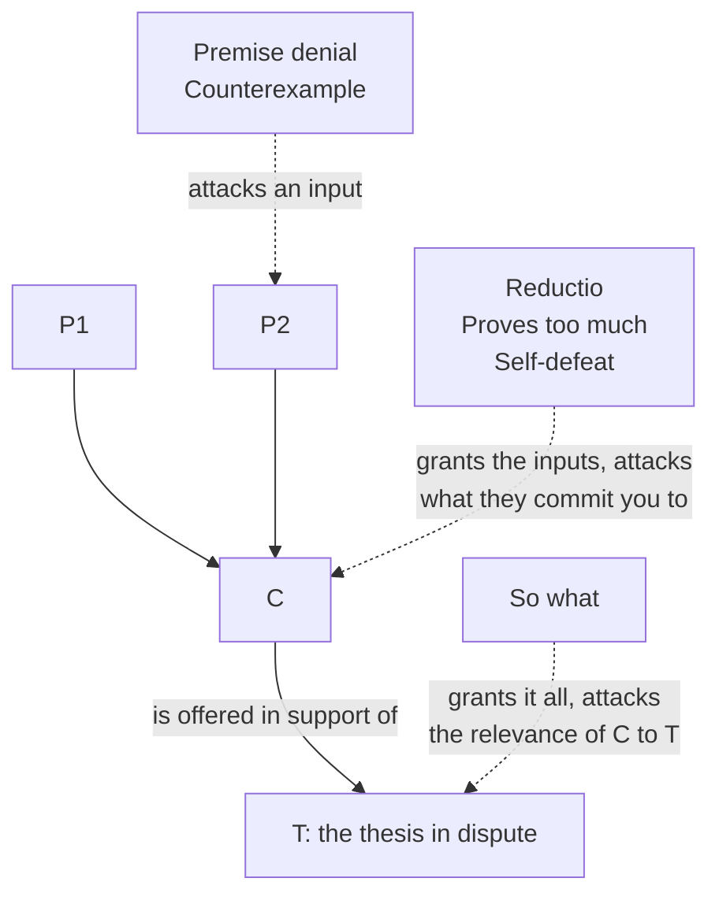

# Philosophical Method · Lesson 4.1: Objections and replies

> ⏱ ~15 min · Module 4: Dialectic — engaging a position · Builds on: [3.4 Intuitions and reflective equilibrium](03-04-intuitions-and-reflective-equilibrium.md) · Unlocks: [4.2 Steelmanning and the burden of proof](04-02-steelmanning-and-the-burden-of-proof.md)

## Why this matters

Nothing in philosophy, politics or theology is settled by a first statement of a position. It is settled — when it is settled at all — by what survives objection. So the skill that decides whether an exchange goes anywhere is not *can you object* but **can you tell which kind of objection you just received**, because each kind attacks a different part of the argument and each admits a different kind of reply. Answer a proves-too-much the way you'd answer a premise denial and you will have said something true, at length, that misses entirely.

## The idea

One fact organizes everything: **an objection is itself an argument.** It has premises, a conclusion, and an inference between them, so every tool from Module 1 applies to it — reconstruct it, test it, find *its* weakest premise. If it can't be put in standard form it isn't an objection yet.

What separates the kinds is just **what the objection's conclusion says**, and so what it asks you to give up. There are only three things it can be:

- **An input.** One of your premises is false.
- **A commitment.** Grant every premise — now look what you're stuck with.
- **The relevance of the whole thing.** Grant the premises *and* the conclusion; it doesn't touch the question.

So classify by asking: *if I accepted this completely, what exactly would I have to change?* The answer names the repair, and the repair is the reply.

## The argument

Let the argument under attack be **A**, with premises P1…Pn and conclusion C, offered in support of a thesis **T**.

**1. Premise denial.** Concludes ¬Pi, with a reason. *In words:* that input is false, and here's the evidence.

**2. Counterexample.** Exhibits a case on which Pi — usually a universal principle or a proposed analysis — gives the wrong verdict. *In words:* premise denial with a witness. This is [3.1](03-01-conceptual-analysis.md) turned into a dialectical move.

**3. Reductio.** Shows that P1…Pn (or C) entail some Q, and that Q is absurd. *In words:* I grant your premises and hand you back something nobody could accept. [1.4](01-04-argument-forms-and-formal-fallacies.md) gave the form; *deploying* one takes two more things — the derivation must be tight, with no premise smuggled in by the objector, and the absurdity of Q must be something the arguer will actually concede.

**4. Proves too much.** Shows that A's *reasoning*, run on a parallel case, yields a conclusion the arguer himself rejects. *In words:* if that argument worked, this one would too — and you don't accept this one. Weaker than a reductio in the abstract (Q need only be rejected by *you*) and stronger in practice, because it can't be met by shrugging at the absurdity: it is bolted to commitments already made. The most useful objection in the set, and the least taught.

**5. Self-defeat.** Applies A's own standard to A and shows it fails. *In words:* your test, run on your claim, rejects it. Two classic cases: verificationism — a statement is meaningful only if empirically verifiable or true by definition, which that statement is neither; and global relativism — all truth is relative to a culture, which if true absolutely refutes itself, and if merely relative need not trouble anyone else.

**6. So what (irrelevance).** Grants P1…Pn *and* C, and denies that C bears on T. *In words:* all true, none of it settles what we're arguing about. The least theatrical and often the deepest, because it attacks the arrow from C to T — the part of an argument people rarely state and therefore never defend.

**The five replies,** roughly in order of how often a good arguer reaches for them:

- **R1. Concede and restrict.** Narrow the claim to what survives. The most honest and most common reply — but it is only honest if you then say whether the narrowed claim still supports T. Often it doesn't, and noticing that is the whole value of the exchange.
- **R2. Deny the objection's own premise.** It's an argument; it has a weakest premise too.
- **R3. Draw a distinction,** so that what the objection attacks isn't what you asserted — the machinery is [3.2](03-02-distinctions-and-verbal-disputes.md). Honesty test: would you have drawn it *before* the objection, and does it do work elsewhere? If not, it's ad hoc.
- **R4. Bite the bullet.** Accept the consequence, deny it's unacceptable — the reflective-equilibrium calculus of [3.4](03-04-intuitions-and-reflective-equilibrium.md).
- **R5. Grant the counterexample and outweigh it.** The case is a real cost; the principle earns more elsewhere than it loses here. The only reply that loses a point and still claims the position.

## Argument map

Three attack surfaces. Where an objection lands decides which replies are even available:

| Objection | Give up… | Replies that fit | Reply that misfires |
|---|---|---|---|
| **Premise denial** | one input | R2 · R1 (weaken Pi, then check C still follows) · R3 (Pi is true on the reading you used) | R4 — no consequence is in dispute, so there's no bullet |
| **Counterexample** | the principle as stated | R3 (the case is outside its scope — say why that's not ad hoc) · R1 (add the missing condition) · R4 · R5 | denying the case is *possible*; rarely available, usually just stubbornness |
| **Reductio** | the position, via what it entails | R2 (the derivation smuggles in a premise) · R4 (Q isn't absurd) · R3 (so distinguished, nothing entails Q) | R1, unless the restricted position actually blocks the derivation — check, don't assume |
| **Proves too much** | the reasoning, on your own commitments | R3 (a principled difference) · R4 (accept the parallel conclusion too) · R1 (narrow it, then re-check it still reaches C) | disputing the facts of the parallel case — the objector picks another |
| **Self-defeat** | the claim's standing | R1 (restrict the scope so the claim exempts itself) · R3 (distinguish levels: a rule *for* inquiry, not an item *in* it) | R4 — you can't bite this bullet; the bullet is that you've said nothing |
| **So what** | the link from C to T | supply the missing premise that closes the gap · R1 (retreat T to what A delivers) | attacking the objector's premises — they granted yours and asserted almost nothing |

## Worked examples

**Example 1 (mechanical — one argument, all six).** The argument from moral disagreement:

> **P1.** Cultures disagree deeply about what is right.
> **P2.** If there were objective moral facts, cultures would not disagree deeply about them.
> **∴ C.** There are no objective moral facts.

- **Premise denial (P1):** much apparent moral disagreement is disagreement about non-moral facts — who counts as a member of the community, what a practice actually does — laid over shared values.
- **Counterexample (P2):** cosmology, nutrition and the causes of the First World War all have objective facts *and* deep, persistent disagreement.
- **Reductio:** if C, no practice any culture ever adopted was wrong — including the ones cited to show how badly cultures differ.
- **Proves too much:** run the same inference on disagreement about history or constitutional interpretation. No objective facts there either? If he won't say that, the form is doing something he rejects.
- **Self-defeat:** only once he adds the conclusion many do add — *therefore we ought to tolerate other cultures' practices* — which is an objective moral claim.
- **So what:** grant C outright. It settles nothing about which practices to permit; the practical claims drawn from it need a bridge the argument never builds.

Six objections, six different repairs — only two of which touch a premise.

**Example 2 (why you'd care — one objection, three replies, three prices).** Kant held the duty not to lie unconditional. Benjamin Constant pressed the case in 1797: a murderer asks where your friend is hiding. Kant answered that year in *On a Supposed Right to Lie from Philanthropy*. The objection is a **counterexample** to a universal principle, and three replies were live:

- **R4, bite the bullet** — Kant's route: the duty holds even here. Price: the verdict itself, which most readers find monstrous. He had to argue *visibly* that the principle is better evidence than the intuition.
- **R1, concede and restrict** — Constant's proposal: the duty runs only toward one who has a *right* to the truth, which the murderer forfeited. Price: you now owe an independent account of who has that right, or the restriction is shaped to fit the case that prompted it. That is where Kant attacks.
- **R3, draw a distinction** — the scholastic route: *asserting a falsehood* versus *prudently withholding the truth*. Aquinas holds every lie sinful yet allows concealing what one need not reveal (ST II-II q.110 a.3). If misdirection needs no assertion, the case never reaches the principle. Price: the distinction must carry weight in ordinary cases too, and the harder the murderer presses for a yes or no, the thinner the room it leaves.

None of the three is cheating. What separates good dialectic from bad is that each says what it costs, in advance, in a sentence.

## Watch out

- **You might think a reductio and a proves-too-much are the same move.** A reductio says the consequence is absurd, full stop, so denying the absurdity answers it. A proves-too-much says only that *you* reject it — so it survives a shrug, and you must drop the further conclusion, accept it, or find a principled difference.
- **You might think conceding is losing.** Concede-and-restrict is the normal outcome of a good exchange; a position that never narrows was never in contact with anything. The failure is conceding without asking whether what's left still supports the thesis you came to defend.
- **You might think a distinction always works.** It works when it was available before the objection and does work elsewhere. Invented on the spot for exactly one case, it is ad hoc, and everyone in the room can see it.
- **You might think a proves-too-much is an ad hominem.** It cites the arguer's own commitments, which looks personal, but it is the legitimate cousin from [2.3](02-03-informal-fallacies-and-when-they-arent.md): it says nothing about his character and everything about whether his principle and his beliefs can both stand.

## One-liner

> Classify the objection by what it asks you to give up — an input, a commitment, or the relevance of the whole thing — and the right reply is the one that gives up exactly that much and says what it cost.

## Problems

**P1 (🟢) *(Exegetical.)*** Name the objection type each of these is — premise denial, counterexample, reductio, proves-too-much, self-defeat, or so-what — in a phrase each.

(a) "Your definition says a promise binds only if the promisee relied on it. I promised my dying father I would visit his grave. No one relied on anything."
(b) "Grant everything: the policy does raise wages. Nothing you have said shows it raises them for the workers the bill is named after."
(c) "If knowledge really required certainty, you would not know your own name."
(d) "Your argument assumes the council's vote was free. Two of the signatories cast it under house arrest."

**P2 (🟡) *(Exegetical (a) · Evaluative (b).)*** An invented op-ed column, by no one real:

> "The council wants to ban facial recognition because — they say — a technology that lets the state identify anyone standing in a public street destroys the privacy a free society requires. Fine. This city already runs plate readers on every arterial, keeps a decade of transit-card taps, and subpoenas phone-location records in nearly every homicide case. Councilman Reyes voted for all three. Either the principle he invoked tonight condemns those too — in which case he should say so, and move to repeal them — or the principle is not what is moving him."

(a) Name the objection type, and say what the tempting misclassification is and why it's wrong. (b) Give the strongest reply for Reyes, name which of R1–R5 it is, and state its price. 150 words or fewer for (b).

**P3 (🔴, optional) *(Exegetical (a) · Evaluative (b).)*** Consider the claim: *no claim should be believed unless it can be established by the methods of the natural sciences.*

(a) State the self-defeat objection to it precisely. (b) Give the best reply available to its defender, name which of R1–R5 it is, and say what the reply costs him. Any verdict passes. 150 words or fewer for (b).

Solutions

**P1** *(Exegetical — strict.)*

**Must hit, strict:**
- (a) **Counterexample** — to a proposed analysis: a case where the stated condition fails but the verdict holds. "Premise denial by counterexample" passes; bare "premise denial" does not, since the *witness* is the whole force.
- (b) **So what / irrelevance.** The conclusion is granted outright; what's denied is that it reaches the thesis in dispute.
- (c) **Reductio.** A consequence is derived and presented as absurd by anyone's lights.
- (d) **Premise denial.** A named premise, a reason. No parallel case, no derived consequence.

**Wrong turns:** calling (c) a proves-too-much — it would be one only if the objector had said "and *you* accept that you know your own name"; as written the consequence is offered as absurd for everyone. Calling (b) a premise denial because it mentions wages: nothing in the argument is denied.

**Model answer:** (a) counterexample to an analysis; (b) so-what; (c) reductio; (d) premise denial with evidence.

---

**P2** *(a) exegetical — strict · (b) evaluative — verdict-neutral.*

**Must hit, strict (a):** **proves too much.** The columnist grants the privacy principle for the sake of argument and shows the same reasoning condemns three programs Reyes voted for. The "either … or" indexed to *his* commitments is the signature. The tempting misclassification is **ad hominem** or hypocrisy — wrong because the column makes no claim about his character and would lose nothing if he were a stranger; the force is that his principle and his votes can't both stand. Naming **reductio** as the tempting misread also passes if the student says why it isn't one: the plate readers are offered as rejected-by-him, not as absurd.

**Must hit, any verdict (b):** name a reply from R1–R5, state it so the columnist would recognize it as responsive, and give its price — the price is the graded part. Live options: **R3**, distinguishing continuous real-time identification of everyone from retrospective, warrant-gated record checks (price: must show the distinction isn't ad hoc); **R4**, accept the parallel and move to repeal the other three (price: the admission that his earlier votes were wrong); **R1**, narrow the principle to real-time mass identification (price: re-check that the narrowed principle still condemns facial recognition).

**Wrong turns:** disputing the facts about the plate readers — the columnist substitutes another program. Replying "that's an ad hominem," which mislabels the objection and forfeits the exchange. Drawing a distinction and never testing it for ad-hocness; the most common miss here.

**Model answer (b), one of several acceptable:** R3. The principle concerns *continuous identification of everyone in public, in real time* — not retention of records later searched against a named suspect under warrant. Plate readers and transit taps are retrospective and targeted at the point of use; facial recognition identifies the innocent by default as they walk past. The price is that Reyes must have been able to draw this line last year, and he should be asked whether the city's warrantless bulk access to those same databases falls on the wrong side of it. If it does, the column has won something real.

---

**P3** *(a) exegetical — strict · (b) evaluative — verdict-neutral.*

**Must hit, strict (a):** the claim is not itself establishable by the methods of the natural sciences — no observation confirms a norm about what may be believed — so by its own standard it should not be believed. The precision asked for: aim it at the claim *as something the defender believes*, and note that recasting it as a definition or a recommendation is the escape route, not a refutation.

**Must hit, any verdict (b):** name the reply, state it, price it. **R1**, restrict the scope: the principle governs first-order claims about the world and exempts claims about method (price: the exemption must be principled, and he has now conceded that some non-scientific route to belief exists — he owes an account of it). **R3**, distinguish levels: it is a rule of method, like a court's rule of evidence, not a proposition competing for scientific support (price: a rule adopted is a rule others may decline, so he can no longer convict a rival claim of being *unwarranted* — only report his own policy). Arguing that no reply works also passes.

**Wrong turns:** R4 — there is no bullet; "fine, then I don't believe it" concedes everything. Answering that science works, which is true and irrelevant: the objection is about the standing of the principle, not the success of the practice.

**Model answer (b), one of several acceptable:** R3, distinguish levels. The claim is a rule of method he adopts, not a belief about the world, so the standard was never meant to range over it. That blocks the self-defeat cleanly. The price is heavy: a rule adopted is a rule others may decline, so he can no longer say a rival's non-scientific claim is unwarranted — only that his policy excludes it. The claim survives and stops doing the work it was introduced to do, which is the characteristic shape of a successful reply to self-defeat.

## Flashback

**From Lesson 3.3 (Thought experiments):** A town's bridge inspector signs the annual certificate without inspecting the bridge.

> **Case A.** The bridge is sound. Nothing happens. He is fined for a paperwork violation.
> **Case B.** Everything about the inspector, his reasons and his act is identical — but a corroded pin fails a month later and four people die. He is tried for negligent homicide.

Most people judge B far more harshly. (a) Name the single factor that differs. (b) Build **one** further variant, changing one factor only, that tests whether that factor is really driving the different verdicts. (c) In one sentence: what can this pair *not* show? 150 words or fewer.

Solution

**Must hit, strict (a):** the only difference is the **outcome** — luck, outside his control and unknown to him when he acted. Intention, knowledge, care taken and the act itself are stipulated identical.

**Must hit, any verdict (b):** one variant, **one factor changed**, aimed at the outcome's role. Any clean control passes:
- Same collapse, but he *did* inspect carefully and missed a flaw no competent inspector would catch — separates outcome from negligence.
- Same negligence and same corroded pin, but a passing driver spots it and the bridge is closed in time — separates outcome from near-outcome.
- Two inspectors, identically negligent, two identical bridges, only one fails — the purest control, and the one that makes the luck visible.

**Wrong turns:** changing two things at once (making the inspector in B drunk as well), which destroys the control; arguing about what the law *does* punish rather than what the cases show; concluding the verdicts are simply irrational — that's a verdict, not a variant.

**Must hit (c):** the pair shows our verdicts *track* outcome; it cannot by itself show they are *justified* in doing so, nor settle whether to revise the intuition or the principle — that is the reflective-equilibrium question of [3.4](03-04-intuitions-and-reflective-equilibrium.md).

## Connections

- **Backward:** an objection is an argument, so [1.2](01-02-validity-and-soundness.md) tests it and [1.3](01-03-reconstruction-and-charity.md) reconstructs it before you answer. The counterexample row is [3.1](03-01-conceptual-analysis.md) as a dialectical move; R3 is the distinction-drawing of [3.2](03-02-distinctions-and-verbal-disputes.md); R4 is the bullet-biting calculus of [3.4](03-04-intuitions-and-reflective-equilibrium.md).
- **Forward:** [4.2](04-02-steelmanning-and-the-burden-of-proof.md) asks which objections you owe an answer to at all and who must move first; [4.3](04-03-finding-the-crux.md) uses the taxonomy to find the one premise a disagreement rides on; [4.4](04-04-arguing-within-a-tradition-the-disputed-question.md) meets the scholastic article, which is this lesson turned into a literary form.
- **Sideways:** the problem of evil is a reductio against theism, met with all five replies in [`philosophy-of-religion`](../../philosophy-of-religion/syllabus.md); proves-too-much is the workhorse of [`ethics`](../../ethics/syllabus.md) and [`political-philosophy`](../../political-philosophy/syllabus.md), where a principle admitted for one case is shown to license a policy its author rejects; self-defeat is a standing topic in [`epistemology`](../../epistemology/syllabus.md); and stating the opposing view before replying is the rule in [`apologetics-foundations`](../../apologetics-foundations/syllabus.md).
