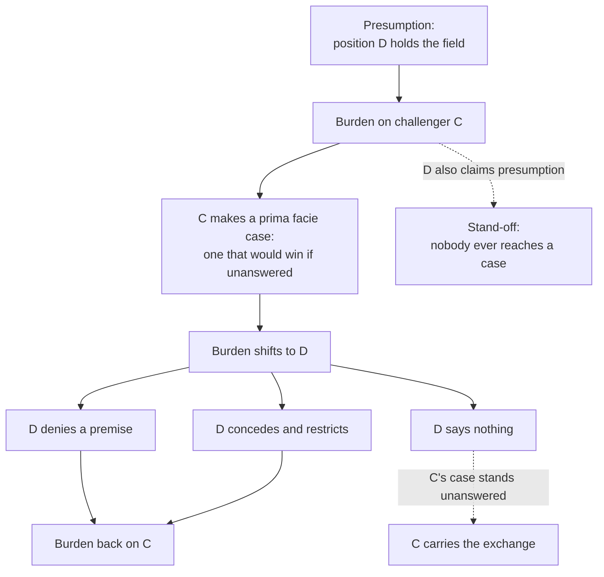

# Philosophical Method · Lesson 4.2: Steelmanning and the burden of proof

> ⏱ ~15 min · Module 4: Dialectic — engaging a position · Builds on: [4.1 Objections and replies](04-01-objections-and-replies.md) · Unlocks: [4.3 Finding the crux](04-03-finding-the-crux.md)

## Why this matters

Two failures end more arguments than every fallacy in Module 2 combined. In the first, you demolish a version of the view that nobody actually holds; its defenders read your reply, recognize nothing, and move on — you have spent an hour and changed no mind, including your own. In the second, both sides insist the *other* one has to go first, and so nobody argues at all. The two fixes are the subject of this lesson, and they are a pair: the first tells you what to attack, the second tells you who has to swing.

There is also a practical reason to get this right early. In [`apologetics-foundations`](../../apologetics-foundations/syllabus.md) and [`apologetics-catholic-claims`](../../apologetics-catholic-claims/syllabus.md), every problem is in two parts, and part (a) — your statement of the view you are about to argue against — is graded *first*, strictly, as exegesis. A caricature fails the problem no matter how good the reply that follows. Those courses are just enforcing what this lesson teaches.

## The idea

A **steelman** is a statement of a position in the form its best defenders would sign. That last word is the whole test:

> **The signature test.** Would a competent proponent, reading your statement, say "yes — that is my view, and well put"?

Not "would they concede it's fair." Would they *sign* it.

You have met this test once already, in its narrow form: [1.3](01-03-reconstruction-and-charity.md) set charity's limit at the strongest version the *author* would still sign. Steelmanning is its cousin, but the object is different, and the difference sets the rules. Charity's object is a **text**: you are bound by the words on the page, you supply what the author left unsaid in the way that makes *this* argument best, and you may not quietly swap in premises the author didn't hold. A steelman's object is a **position**, which no single text owns. So you may range: take the best defence anyone has given, drop a defender's bad auxiliary argument, borrow a distinction from a rival defender, restrict an overreaching claim to the version that survives the obvious objection. Improving on any one defender is permitted, because the position is not their property.

What is *not* permitted is improving past the signature test. Build a view strong enough that its supposed defenders would disown it, and you have quietly changed the subject — you are now refuting something you invented, which is a straw man in better clothes and harder to spot, since it looks generous. The honest move when it happens is to say so out loud, and then notice that you still owe the real position a reply.

That handles what to attack. The other half is who has to attack.

## The argument

**The steelman test.** A statement **S** of a position **P** is a steelman of **P** when all three hold:

> **1.** A competent proponent of **P** would accept **S** as a statement of their view. *(the signature test)*
> **2.** **S** is the strongest such statement available — no better defence of **P**, from any defender, is left out.
> **3.** **S** rests on nothing the proponent rejects: no premise they would refuse, and no motive imputed to them.

In words: right view, best version, nothing smuggled in. Condition 3 is the one people break without noticing, and it is almost always a motive.

**Building one — four moves.**

1. **Vocabulary.** State the view in its defenders' terms, not the terms your side uses to describe it. Half of all straw men are built entirely out of loaded labels.
2. **Upgrade the support.** Replace the argument its worst advocate gives with the best one anyone gives.
3. **Restrict.** Concede-and-restrict from [4.1](04-01-objections-and-replies.md), applied to the *other* side's view: if defenders would settle for the narrower claim that dodges the obvious objection, attack that one.
4. **Sign it.** Run the test. If it fails, label what you built: "the strongest nearby position, which I don't know anyone to hold."

**The dialectical burden.** Four statements, which govern every exchange:

> **B1.** In any dispute, one position holds the field by default. That default is the **presumption**.
> **B2.** The **burden of proof** lies on the side arguing against the presumption.
> **B3.** A **prima facie case** — one that would win if it went unanswered — discharges that burden and shifts it to the other side.
> **B4.** Presumption is *procedural*, not evidential.

In words: B1 says what stands if nobody argues; B2 says who therefore has to speak first; B3 says that a good enough argument transfers the debt, so the other side now owes a reply; B4 caps the prize. Reaching the end of an exchange and announcing "so my side wins by default" is not a discovery about the world. It is a report that nobody argued well.

Where a presumption comes from — four grounds, each defeasible:

| Ground | Presumption favours | Instance |
|---|---|---|
| Possession, the status quo | what already stands | the existing law, the standing practice, the received teaching |
| Cost asymmetry | the cheaper error | a false conviction is treated as worse than a false acquittal |
| Access to evidence | the side that cannot easily get it | the party holding the records owes the showing |
| What both sides grant | the shared ground | you need not argue for what your opponent concedes |

The legal instance is the clearest and the most abused. **Innocent until proven guilty** is three things at once: the accused holds the field (B1), the prosecution carries the burden (B2), and because the cost asymmetry is severe the case must be made beyond reasonable doubt — a *standard of proof*, which is a separate dial from the burden and is set high here for reasons specific to this setting. The package is tuned to a state with subpoena power facing an individual whose liberty is at stake. Lift the slogan into a hiring decision, a historical judgment or a dispute about doctrine, and you have kept the words and left behind everything that justified them.

## Argument map

The solid path is a working exchange, and every arrow is a debt incurred and paid. Two things the map makes visible. First, the bottom-right outcome is weaker than it looks: D's silence means C's case stands *unanswered*, not that D's position is false — the win is over the exchange, not over the world. Second, the dashed edge on the left is the abuse. If D answers the demand for an argument by claiming presumption in turn, no one ever reaches the "prima facie case" box, and the dispute becomes a dispute about procedure that both sides can sustain forever at no cost.

## Worked examples

**Example 1 (mechanical — building a steelman).**

The position: *thought experiments carry no evidential weight* — the intuition-pump worry from [3.3](03-03-thought-experiments.md), which you met there as a caution and are now going to state as a position.

The version that circulates: "Made-up stories can't tell you anything about the real world. You can't learn ethics from runaway trolleys."

Run the four moves. **Vocabulary:** the objection is not about fiction. Its target is *intuitions about cases*, used as evidence. **Upgrade:** the best support is not "it's imaginary" but a reliability claim — verdicts about cases shift with wording, order of presentation and framing; the cases are selected by the arguer who already knows which verdict he wants; and bizarre cases run judgment far outside the ordinary conditions under which it was formed. **Restrict:** don't saddle the objector with "worthless" if defenders would settle for less. **Sign it:**

> Verdicts about imagined cases count as evidence only if our dispositions to produce them are reliable. Those dispositions demonstrably shift with framing, wording and order; the cases themselves are chosen by an arguer who knows the verdict he wants; and exotic cases operate far outside the conditions in which ordinary judgment was formed and tested. So an intuition about an exotic case carries no *independent* weight against a principle that is otherwise well supported.

Notice what that did to *your* reply. Against the circulating version you could answer "but intuitions are all we have." Against the steelman you can't: you now have to address the reliability claim, which means distinguishing framing-sensitive intuitions from robust ones and saying how you tell them apart. That is a hard, live question — and that is the payoff. **A steelman tells you what your reply has to do.**

**Example 2 (where it strains — a stand-off over presumption).**

Does the theist or the atheist owe the argument? Antony Flew argued for a "presumption of atheism," taking atheism to mean the *absence* of theistic belief rather than the denial of God: the one asserting that something exists owes the case, and the default before any argument is simply not believing. Against this, defenders of theism have pressed two different replies — that a negative claim about the most consequential question there is is still a claim and carries its own burden, and, in the line associated with Alvin Plantinga, that belief in God may be *properly basic*, rationally held without being inferred from anything, in which case no debt exists until someone produces a defeater. Whether either reply works is the business of [`philosophy-of-religion`](../../philosophy-of-religion/syllabus.md); this course takes no side.

What the lesson *does* say is what to do inside such a stand-off. First, apply B4 and price the prize: whoever wins the presumption fight gets to speak second, not to be right. Second, notice that once presumption is genuinely contested by serious people, claiming it is nearly worthless — you will spend the exchange arguing about who argues. So waive it. Argue as though the burden were yours and invite the other side to do the same; the exchanges that go anywhere are almost all double waivers. [`apologetics-foundations`](../../apologetics-foundations/syllabus.md) takes this dispute up directly in its 1.3, and makes its student do exactly that bookkeeping: state Flew's presumption at full strength, then say which part of it you accept and which you deny, before arguing anything.

## Watch out

- **You might think steelmanning is a courtesy.** It is a weapon. An objection that kills only the weak version leaves the position standing, so the strong statement is what makes your attack worth anything. The useful test: if your steelman doesn't unsettle you a little, you probably haven't built one.
- **You might think stronger is always better.** Only up to the signature test. Past it you are arguing with yourself, and the original view — the one people actually hold — is still untouched and still owed a reply. Say which one you are addressing.
- **You might think presumption is evidence.** It is a rule about who speaks first. A default that has never been argued for is exactly as well supported as it was before you won the right to make your opponent go first.
- **You might think "innocent until proven guilty" travels.** It is earned by a particular asymmetry of costs and evidence. Change the asymmetry and the presumption can reverse outright: a drug regulator presumes a new compound unsafe, and puts the burden on the party that has the trial data.

## One-liner

> A steelman is the version its defender would sign; presumption says who speaks first, and never who is right.

## Problems

**P1 (🟢) *(Exegetical.)*** The paragraph below is from an invented op-ed in a city paper. (a) It states an opponent's view; name the two moves that make it a straw man rather than a steelman, citing the condition of the steelman test each one breaks. (b) What presumption does the writer claim, on what ground, and where does it put the burden? 150 words or fewer in total.

> "The proposal to have the council appoint school-board members instead of electing them is the usual contempt for ordinary people dressed up as reform. Its backers think voters are too stupid to pick a board, so they would rather install their friends. And nobody has shown that an appointed board would raise a single test score. Until someone does, there is no reason to abandon a system this city has used for ninety years."

**P2 (🟡) *(Exegetical (a) · Evaluative (b).)*** The position: **a democracy should abolish judicial review — no court should have the power to strike down legislation.** (a) State the strongest case for it, in a form a defender would sign. (b) Reply. 150 words or fewer for each part.

**P3 (🔴, optional) *(Exegetical (a) · Evaluative (b).)*** An invented exchange at a diocesan review meeting:

> **A:** "We have run the same catechetical program for thirty years. Anyone who wants to replace it has to show that it is failing."
> **B:** "It is your program under review, and in thirty years your office has never produced one measure of whether it works. Until you do, the presumption runs against continuing it."

(a) State each speaker's presumption claim and which of the four grounds it rests on. (b) Say whether either deserves the presumption here and what the winner actually gets; then say what the meeting should do if the presumption question cannot be settled. 150 words or fewer for (b).

Solutions

**P1** *(Exegetical — strict.)*

**Must hit, strict (a):** two moves, and both must be named as moves, not just disliked.
- **Imputed motive** — "contempt for ordinary people," "think voters are too stupid," "install their friends." This breaks condition **3**: it rests the opponent's view on something no defender would accept, and a motive is not a premise.
- **The real case is never stated,** so condition **2** fails: the actual argument for appointment runs on expertise requirements, near-invisible turnout in down-ballot board races, insulation from single-issue slates, and accountability through an elected council. None of it appears, so nothing that is defeated here is the position.

**Must hit, strict (b):** the presumption claimed is the **status quo** (ground 1) — ninety years of use — which puts the burden on the reformers. Credit for also noticing that the writer sets a *standard* along with the burden ("a single test score"), which is a second dial and a demanding one: a case for appointment could succeed on legitimacy or accountability grounds without touching test scores.

**Wrong turns:** calling the paragraph a straw man merely because it is hostile in tone — the flaw is structural, not rude; answering (b) with "the burden is on whoever is wrong."

**Model answer:** (a) It imputes motives (contempt, cronyism) rather than stating premises, breaking condition 3; and it omits the actual case — expertise, low-information turnout, insulation from slates — breaking condition 2. (b) Presumption from the status quo, ninety years of practice, putting the burden on reformers; the writer also smuggles in a test-score standard the presumption does not license.

---

**P2** *(a) exegetical — strict · (b) evaluative — any verdict.*

**Must hit, strict (a):** the signature test is the grader. The statement must rest on **reasonable disagreement**: citizens disagree about rights in good faith, and that disagreement does not disappear when it reaches a court — it reappears there as a split decision among a handful of unelected lawyers. It must contain the **equality premise**: when we reasonably disagree and must still decide, each citizen is entitled to an equal say, and majority decision among representatives is the procedure that respects that. It should note that legislatures do in fact protect rights, so the choice is between two imperfect protectors and the argument is about the *legitimacy of the procedure*, not about who gets more outcomes right.

The statement **fails** if it rests on judges being corrupt, stupid or partisan; on hostility to rights themselves; or on the claim that majorities are always right. Those are the discarded version (this is condition 3 in action).

**Must hit, any verdict (b):** the reply must engage the equality premise or the reasonable-disagreement premise — the load-bearing ones — and not the motives the steelman removed. It must concede something true (that courts are counter-majoritarian, that judicial disagreement mirrors public disagreement). If you defend judicial review, say how an outcome-based justification can be squared with equal say, or deny the equality premise outright and say what legitimacy requires instead. If you side with abolition, name the cost — a case where a majority strips a minority's rights and nothing stops it — and say why you accept it.

**Wrong turns:** attacking judicial competence in (a), which rebuilds the straw man the problem asked you to dismantle; settling (b) by pointing at a single admirable court decision, which concedes that outcomes are the test and so walks past the argument.

**Model answer (a):** Citizens disagree reasonably and persistently about what rights we have. That disagreement is not resolved by sending it to a court; it is relocated, and reappears as a five-to-four vote among nine unelected lawyers whose split tracks the public's. Given that we must decide anyway, the question is which procedure to settle by — and the one that treats citizens as equals lets each have an equal say through representatives who answer to them. Legislatures deliberate about rights, and often protect them well. So judicial review buys no reliable gain in outcomes, and pays for that uncertain gain with the one thing a democracy cannot trade: the equal standing of each citizen in deciding the terms of common life.

**Model answer (b), one of several:** Grant the relocation point, which is true and usually denied. But the equality premise describes a procedure for people already inside the political community on equal terms, and the standard case for review is about those placed outside it — where majority decision is not equal say but the stronger party ruling on its own case. A court is not a better moral reasoner; it is a forum where someone can compel the majority to give reasons. I therefore accept the counter-majoritarian cost and locate the legitimacy of review not in better outcomes but in the requirement to justify.

---

**P3** *(a) exegetical — strict · (b) evaluative — any verdict.*

**Must hit, strict (a):** A claims presumption from **possession / the status quo** (ground 1): the program stands, so the challenger must show failure. B claims presumption from **access to evidence** (ground 3): the office that runs the program is the only party that could have measured it, and a party who holds the evidence and has not produced it cannot rest on the default. Credit for seeing that B is not claiming the program *has* failed — that would be a different and much stronger claim.

**Must hit, any verdict (b):** apply B4 explicitly — whoever wins gets to speak second, not to be right, and the program is neither vindicated nor condemned by the outcome. Pick one ground and say why it bears here rather than asserting a rule. Then name the exit: waive the presumption and argue, or convert the procedural fight into a substantive one by agreeing in advance what evidence would settle the question — which is what B's demand for a measure already half is.

**Wrong turns:** deciding it with "the status quo always wins," which treats a default as though it were a reason — exactly what B4 denies; reading B's point as evidence that the program is failing, when it is a claim about who owes the showing.

**Model answer (b), one of several:** B has the better of it, because ground 1 and ground 3 collide here and ground 3 is the stronger: possession earns a presumption from the fact that something has been working, and the office has never produced any evidence that it has. But the win is small — B gets to hear A's case first, and nothing about thirty years of catechesis has been established either way. The productive move is for both to waive: A states the case for the program, B the case against, and the meeting agrees now on what measure, over what period, would count as an answer. Otherwise the review spends its hour deciding who speaks first.

## Flashback

**From Lesson 3.4 (Intuitions and reflective equilibrium):** A principle and a judgement collide.

> **Principle (aggregation).** When you can benefit one group or another but not both, benefit whichever group's total benefit is greater.
> **Considered judgement.** A hospital holding one dose of an indivisible drug must give it to the one patient who will otherwise die, not to the million who will otherwise spend an afternoon with a headache.

Take the numbers and the indivisibility as stipulated.

(a) *(Exegetical.)* For each response below, name which of the three moves it makes — amend the principle, withdraw the judgement, or redescribe the case. One clause of reason each.

> (i) "A benefit counts toward the total only if it is in the same range of moral importance as the greatest individual claim in play; a headache is not in the range of a death."
> (ii) "At some number the headaches really do outweigh the death. The verdict feels monstrous only because nobody can picture a million people."
> (iii) "This is not one choice between two groups. It is a set of comparisons between the dying patient and each headache sufferer taken one at a time, and no such pair favours the headache."

(b) *(Evaluative.)* Adopt one of the three and defend it: apply the ad-hoc test to your move, and name the implication that would make you abandon it. 150 words or fewer.

Solution

**Must hit, strict (a):** (i) **amend the principle** — the summation rule itself is rewritten, with a relevance condition on what may enter the total. (ii) **withdraw the judgement** — biting the bullet; the principle is kept whole and the intuition about the dose is given up. (iii) **redescribe the case** — the principle is untouched, and the choice is re-described as a series of pairwise comparisons so that no aggregate is ever formed.

**Wrong turns in (a):** calling (iii) an amendment because the verdict changes — what changed is the description of the decision, not the rule; calling (ii) a redescription because it explains the intuition away, which is a diagnosis of the judgement, not a new account of the case.

**Must hit, any verdict (b):**
- Say which end you hold more firmly — the principle or the judgement — rather than just announcing a move. That comparison is what reflective equilibrium runs on.
- Apply the ad-hoc test to the move you chose. For (i): what fixes the "range," does the criterion follow from something you held anyway, and what does it commit you to in cases nobody has looked at — a thousand broken arms against one death? For (iii): pairwise comparison also implies that saving five is no better than saving one when the harms are equal; say whether you accept that, since it is the price, not an objection you get to dodge.
- For (ii), meet the three conditions for biting well: state the implication at full strength (the patient dies, and you chose that), price it, and name the limit.
- Name a would-be-too-much implication for whichever move you took.

**Wrong turns:** attacking the stipulations — splitting the dose, finding more of the drug — which changes the case rather than confronting it; calling (i) principled without offering any criterion for the range, which is the standard ad hoc patch here; taking (iii) without noticing what it does to ordinary numbers cases.

**Model answer (one of several):** I take (i). My grip on the verdict about the dose is far firmer than my grip on unrestricted summation, so summation is what gives. The amendment is principled rather than ad hoc if the range condition comes from something independent, and I think it does: what justifies an allocation to the loser of it is that his claim was *answerable* by the other's, and a headache is not an answer to a death — a condition I already accept when I refuse to weigh trivial conveniences against serious injury. It commits me in advance about the broken arms, where the claims plausibly are in range and the number should tell. What would be too much: if no two harms ever turned out to be in range, the condition would have abolished aggregation rather than limited it, and I would drop it.

## Connections

- **Backward:** [4.1](04-01-objections-and-replies.md) gave the taxonomy of objections; steelmanning is 4.1 run in reverse — concede-and-restrict applied to the view you are attacking, before you attack it. The principle of charity in [1.3](01-03-reconstruction-and-charity.md) is the same virtue with a smaller object: a text you are bound to, rather than a position you may improve.
- **Forward:** [4.3](04-03-finding-the-crux.md) is impossible without this — there is no crux between a straw man and anything, because a fake premise can be denied for free. And [4.4](04-04-arguing-within-a-tradition-the-disputed-question.md) shows the pairing built into a literary form: the scholastic article makes its author write the objections himself, at full strength, before he is allowed to reply.
- **Sideways:** [`apologetics-foundations`](../../apologetics-foundations/syllabus.md) and [`apologetics-catholic-claims`](../../apologetics-catholic-claims/syllabus.md) turn the steelman-and-reply pairing into an assessment rule — the opposing statement graded strictly before the reply is read — and foundations 1.3 takes up the presumption dispute of Example 2 directly. The substantive assessment of that dispute belongs to [`philosophy-of-religion`](../../philosophy-of-religion/syllabus.md); the position in P2 is argued properly in [`political-philosophy`](../../political-philosophy/syllabus.md) 5.2, on the legitimacy of judicial review.
