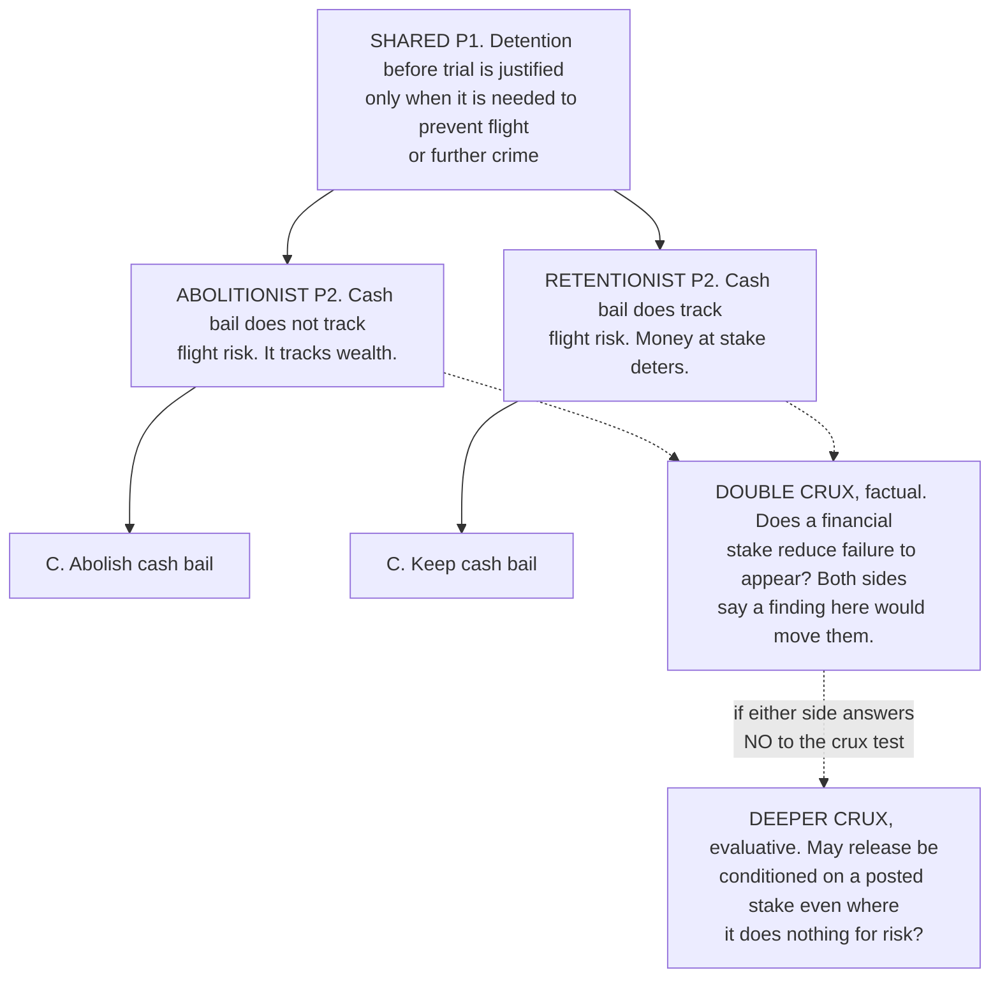

# Philosophical Method · Lesson 4.3: Finding the crux

> ⏱ ~15 min · Module 4: Dialectic — engaging a position · Builds on: [4.2 Steelmanning and the burden of proof](04-02-steelmanning-and-the-burden-of-proof.md) · Unlocks: [4.4 Arguing within a tradition: the disputed question](04-04-arguing-within-a-tradition-the-disputed-question.md)

## Why this matters

Two people argue for an hour, cite twelve facts each, and end exactly where they started. Nothing was wrong with the facts. What was wrong is that neither side knew which of the twelve mattered — so every point landed on a premise the other side had already granted, and the one line they actually disagreed about never got said out loud. Finding the crux is the move that ends this. It costs ten minutes, it works on disputes that have been running for centuries, and it produces something a shouting match never does: a statement of what would change each side's mind.

## The idea

Take any real disagreement and write out both sides in standard form. What you almost always find is that the two arguments agree for most of their length. They share the framing, the principle, three of the four premises — and then, at one line, they come apart.

That line is the **crux**: the premise the disagreement actually turns on. Everything above it is common ground you were wasting breath on. Everything below it is downstream — the conclusions differ *because* that line differs, so arguing about the conclusions is arguing about the symptom.

The test for whether you've found it is a question you ask each side about themselves:

> *If you came to believe the other side's version of this line, would you change your view?*

If the answer is yes, it's a crux. If the answer is "no, I'd still hold my position" — then whatever you found, it isn't the thing doing the work, and there is a deeper line you haven't reached yet. The test is about what *moves someone*, not about who is right, which is why it can be answered honestly by both parties before either has won anything.

## The argument

**The procedure.**

1. **Reconstruct both sides in parallel standard form**, numbered alike, so P1 answers P1. In words: don't write two arguments, write one grid — divergence is only visible when the lines are aligned.
2. **Mark each line shared or contested.** In words: most lines are shared, and the premises nobody disputes are the premises nobody should be defending.
3. **Take the highest contested line.** In words: the earliest divergence, because a difference at P2 usually explains every difference after it.
4. **Apply the crux test to it, for each side separately.** In words: a line that passes for one side is a **crux for that side**; one that passes for both is a **double crux** — the term is borrowed from the applied-rationality literature — and it is the best outcome available, because one question now governs two minds.
5. **Classify the divergence: fact, value, or meaning.** In words: what kind of line it is fixes what could possibly settle it.
6. **If the test fails, go deeper.** In words: "I'd still hold my view" means you found a talking point, not a crux. Ask why the conclusion survives, and reconstruct again.
7. **State the crux as a conditional both sides sign.** In words: *"If X turned out true, I'd hold your view — if it turned out false, would you hold mine?"*

**Three kinds of divergence.** Naming which one you have is not pedantry — it tells you what to do next.

| Kind | The contested line is | What could settle it | The tell |
|---|---|---|---|
| **Factual** | a claim about how the world is or was | evidence, in principle | both sides can say what finding would count against them |
| **Evaluative** | a claim about what matters, what is owed, what may be overridden | argument from deeper commitments, consistency, cases | neither side expects a study to decide it |
| **Semantic** | what a term covers | a distinction — [3.2](03-02-distinctions-and-verbal-disputes.md)'s move | the two sides stop contradicting each other once the term is split |

A semantic crux is where [3.2](03-02-distinctions-and-verbal-disputes.md)'s verbal disputes live, with one warning attached: finding that the crux is about a word does *not* show the dispute was merely verbal. Sometimes splitting the term dissolves everything; more often both readings were live and a substantive disagreement survives under one of them. The distinction doesn't end the argument, it locates it.

**A stack of cruxes.** Positions are rarely held by a single thread: deny someone's crux and they fall back on a second premise that supports the same conclusion independently. Facing a stack, take **the crux closest to evidence** first — the most checkable, not the most fundamental. What the historical record contains can be settled this afternoon; what authority may settle the question cannot. That is not cowardice: the checkable layer is the only place the two of you can do something together, and settling it usually changes the shape of what remains.

**When the crux is a value.** Data won't resolve a value crux, and you should stop trying. But identifying it is worth a great deal: it ends the proxy war over statistics neither side would have accepted as decisive, and it forces each side to defend the value in its own terms or admit the argument bottoms out there. "We disagree about whether a creditor's claim can be overridden" is a stable place to end a conversation. "You're ignoring the data" is not.

**The payoff.** A stated crux is a forecast about yourself — it says in advance what would move you, which makes it checkable: if the finding arrives and you don't move, you misidentified your crux. That is the whole difference between a debate and a stalemate. A debate has a question in it.

## Argument map

Read it top down. The chains are identical until P2, so every sentence spent on P1 was spent on common ground. Solid arrows carry support; the dotted ones run from each side's P2 into the single question both sides admit would move them — one empirical claim, reached from opposite directions. The bottom box is what appears if someone fails the crux test: the argument was never about failure-to-appear rates, and the honest disagreement is one level down and evaluative.

## Worked examples

**Example 1 (mechanical — running the procedure on a clean case).**

Two city councillors, on the bail ordinance mapped above. In parallel:

| | Abolitionist | Retentionist |
|---|---|---|
| **P1** | Pre-trial detention is justified only when needed to prevent flight or further crime | *same* |
| **P2** | Cash bail does not track flight risk; it tracks the ability to pay | Cash bail does track flight risk; a forfeitable stake deters absconding |
| **P3** | Risk-based release conditions are available and work at least as well | Risk assessment tools are unreliable and biased |
| **∴ C** | Abolish cash bail | Keep it |

P1 is shared, so a speech defending it is wasted. The first divergence is P2. Crux test, asked of each: *if a well-identified study showed that posting money makes no difference to appearance rates once you control for the charge, would you drop your view?* The retentionist says yes, so P2 is a crux for her; asked in reverse, the abolitionist says yes too. That is a **double crux**, factual, and the conversation now has an assignment rather than a winner.

P3 is contested too — a second crux in the stack — but it is downstream of P2 and harder to settle, so P2 goes first. And note what the procedure did *not* do: it decided nothing. It converted an argument into a question, which is all it is for.

**Example 2 (where it strains — a crux that is partly about a word).**

The Reformation dispute over justification. Crudely: one side says a person is justified by faith alone, the other that he is not. Put in parallel, the disagreement will not stay where you put it.

| | Lutheran confessional position | Catholic position, as defined at Trent |
|---|---|---|
| **P1** | Salvation is by grace; nothing merits the initial grace | *same* |
| **P2** | To justify is to declare righteous — God imputes Christ's righteousness to the sinner, who is counted righteous on Christ's account | To justify is to *make* righteous — remission of sins together with sanctification and renewal of the inner man (Session VI, ch. VII; DH 1528) |
| **P3** | Renewal genuinely follows, as sanctification, but is a distinct work and is not what justifies | The renewal is not a separate consequence but part of what the word names |
| **∴ C** | Faith alone justifies | Faith alone does not justify |

The first divergence, P2, is **semantic**: the two sides are not using "justify" for the same thing, and once that is seen the flat contradiction at C softens. Much twentieth-century ecumenical work runs along this line — and this is exactly where a careless reader stops and declares the dispute verbal, 3.2's diagnosis misapplied.

It isn't verbal, and the parallel reconstruction shows why. Disambiguate, re-ask in each sense, and a real disagreement survives in the second: *does the grace that saves transform the person interiorly, so that the transformation is part of what saves rather than its fruit?* Both traditions have a determinate answer and they differ. Below that sits a further crux, about authority: what settles such a question — scripture read alone, or scripture read with a tradition that can define? That one is furthest from evidence, which is why the productive work has happened one layer up, where a shared question about Paul's vocabulary is at least something both sides can work on with the same tools.

So: the first divergence can be semantic without the dispute being merely verbal, a stack can mix kinds, and you work the checkable layer even when everyone knows the deepest one is the real disagreement. ([4.4](04-04-arguing-within-a-tradition-the-disputed-question.md) takes up argument from authority as its own discipline.)

## Watch out

- **You might think a crux is an objective feature of the dispute.** It is indexed to a person — a crux *for her*, given what else she believes. Two people arguing the same question can have different cruxes, which is why the same evidence can thrill one of them and bore the other. A double crux is a coincidence to look for, not to assume.
- **You might think the first contested line is the crux.** It's a candidate. Until someone answers the counterfactual you have a difference, not a pivot — and stated reasons are very often not the operative ones, with no dishonesty involved.
- **You might think a semantic crux means the dispute was hot air.** Split the term and re-ask in each sense. If a substantive disagreement survives under either reading, the distinction located the argument rather than ending it.
- **You might think naming a value crux is conceding.** It concedes nothing about who is right; it only reports what would and wouldn't move you. Refusing to name it is what looks evasive, because it leaves you arguing evidence you have already decided not to be bound by.

## One-liner

> The crux is the one line where two reconstructions come apart and each side admits they'd move — name it, and a stalemate becomes a question.

## Problems

**P1 (🟢) *(Exegetical.)*** For each disagreement, say whether the crux is **factual**, **evaluative**, or **semantic**, and give in one sentence what could settle it.

(a) Two legislators agree that capital punishment is justified if and only if it deters murder better than life imprisonment. One holds that it does; the other that it does not.
(b) Two curators agree on every established fact about a canvas: Rembrandt designed it, two pupils in his studio laid in most of the paint surface, and he reworked the face and hands himself before it was sold. One catalogues it as a Rembrandt; the other refuses to.
(c) Two economists accept the same projections for a debt-relief program: debtor consumption rises, creditors recover forty cents on the dollar, borrowing costs rise for a decade. One supports the program, the other opposes it.

**P2 (🟡) *(Exegetical (a)–(b) · Evaluative (c).)*** Two unsigned columns ran in the same paper on the same day. (a) Reconstruct both in parallel standard form, three lines each, aligned so the shared premise is visible. (b) Name the first contested line. (c) Apply the crux test to Column A and say what you find — including what you would conclude if A answers "no." 150 words or fewer for (b) and (c) together.

> **Column A.** "A twelve-year-old cannot sign a lease or consent to surgery, and we do not pretend otherwise. Yet we let her enter an agreement that trades her attention to a system engineered by hundreds of people to defeat exactly the self-control a twelve-year-old does not have. Require a parent's signature. We already do it everywhere else that matters."
>
> **Column B.** "The consent rule will not work. Teenagers defeated age gates the week they were invented, and they will defeat this one by supper. What the rule will do is hand every platform a reason to demand government identification from every adult in the country — a surveillance system we would never vote for directly. Protecting children is the goal. This does not protect them."

**P3 (🔴, optional) *(Exegetical (a) · Evaluative (b).)*** The old prohibition of usury and its modern critics.

> **The prohibition.** Money is sterile — it produces nothing by itself, as a field or a flock does. In a loan of money the lender parts with nothing he could have used, since the coin is consumed in the using and is returned in kind. To charge for the loan itself is therefore to sell what one does not own: time, which is common to all.
>
> **The critic.** Money lent is capital. The lender gives up the use of it — a use that would have earned him something elsewhere — and bears the risk of not getting it back. Charging for that is charging for a real thing surrendered, exactly as rent charges for a house surrendered.

(a) Put the two in parallel standard form, three lines each, and name the first contested line. (b) Say which of the three kinds of divergence it is, what would move each side, and whether this crux is the one closest to evidence or whether a deeper one is doing the work. Any verdict on (b) if you name what would move each side. 150 words or fewer for (b).

Solutions

**P1** *(Exegetical — strict.)*

**Must hit, strict:**
- (a) **Factual.** The shared conditional is granted outright, so the whole dispute rests on a claim about the world — settled, in principle, by comparative evidence on homicide rates across jurisdictions and reforms (with the honest caveat that the identification is genuinely hard, which is a reason the crux is contested, not a reason it isn't factual).
- (b) **Semantic.** Every fact about the canvas is agreed, so nothing empirical is left to move: the divergence is over what the attribution covers — a work by the master's own hand, or a work of his studio designed and finished by him. Settled by splitting the term and re-asking in each sense. Worth adding, though not required: calling it semantic does not make it idle — the label carries a price and a wall text, which is [3.2](03-02-distinctions-and-verbal-disputes.md)'s "the word is the prize."
- (c) **Evaluative.** Identical projections, opposite verdicts: the crux is whether creditors' claims may be overridden for the sake of the gains listed, and no further projection can decide it.

**Wrong turns:** calling (a) evaluative because capital punishment is a moral issue — the moral premise is the part they *agree* on, which is what makes the crux factual; calling (b) factual because paintings and studios are physical things, when every relevant physical fact is stipulated as agreed; hunting for a hidden empirical disagreement in (c) when the stipulation rules one out.

**Model answer:** (a) factual — comparative deterrence evidence. (b) semantic — split the attribution into autograph and workshop senses and the contradiction goes. (c) evaluative — the standing of creditors' claims, which no projection settles.

---

**P2** *(a)–(b) exegetical — strict; (c) evaluative — any verdict.*

**Must hit, strict (a):** aligned reconstructions with the shared premise visible. Both columns accept something like *the state should impose this requirement only if it actually protects children at an acceptable cost*. Column A's second line asserts that a consent requirement protects them (minors cannot meaningfully consent to a system built to defeat their self-control); Column B's denies it (the gate will be routed around) and adds a cost line (mandatory adult identification).

**Must hit, strict (b):** the first contested line is the effectiveness claim — does a parental-consent requirement actually reduce minors' exposure? B's surveillance premise is a second contested line, not the first.

**Must hit, any verdict (c):** actually ask A the counterfactual — *if the rule provably did not reduce minors' use, would you drop it?* — and say what each answer implies. If yes, the effectiveness claim is a crux for A, and since B already treats it as decisive, it is a double crux and the dispute is factual. If no — because A's real premise is that a minor *cannot* be party to such an agreement whether or not the rule changes anyone's behaviour — then the effectiveness fight was a proxy, and the crux is one layer down and evaluative.

**Wrong turns:** stopping at "they disagree about whether it works" without asking whether that would move A, which is the entire exercise; arguing the merits of the policy instead of locating the crux; treating B's surveillance point as the first divergence when it comes after the effectiveness claim.

**Model answer (c), one of several:** Column A's non-consequentialist first sentence is a strong hint that it would answer "no" — the analogy to leases and surgery does not depend on how a consent rule performs. If so, the columns are not even engaged: B has been arguing effectiveness at someone whose position doesn't rest on it. The crux is then evaluative — may a minor be party to an agreement of this kind at all? — and the useful next sentence is: "Suppose the rule works perfectly. Would you still oppose it?" If B says yes, the second crux is the surveillance cost, and that one is at least partly checkable.

---

**P3** *(a) exegetical — strict; (b) evaluative — any verdict.*

**Must hit, strict (a):** aligned reconstructions. The shared line is roughly *one may charge only for something real that one surrenders or provides*. The prohibition's second line: in a money loan nothing real is surrendered, because money is barren and the same sum returns. The critic's second line: something real is surrendered — the use of the sum for the term, plus the risk borne. The first contested line is therefore whether the lender parts with anything of value beyond the sum itself. (The parties do *not* differ on the moral principle, which is the finding that matters.)

**Must hit, any verdict (b):** name the kind and defend it — the contested line is at least partly **semantic**, turning on what a loan of money transfers and hence on what "money" is (a consumable medium, or capital with a forgone use). Say what would move each side: for the critic, a case where a lender demonstrably forgoes nothing; for the prohibition's defender, the extrinsic titles the tradition itself came to recognize — lost profit, risk, delay — which concede that something real can be surrendered. Then address the stack: the deeper crux is usually about *authority* — what the Church's past teaching binds, and how development works — and that one is further from evidence, so the economic layer is where progress is available. Any verdict on which crux is doing the work passes if both are stated.

**Wrong turns:** arguing whether interest is wrong, which is not the task and belongs to [`philosophy-of-debt`](../../philosophy-of-debt/syllabus.md) and [`theology-of-debt`](../../theology-of-debt/syllabus.md); declaring the dispute merely verbal because it turns on a word — the substantive question of whether forgone use is real survives the disambiguation; putting Aristotle's sterility claim and the modern opportunity-cost claim as the conclusions rather than as the contested premise.

**Model answer (b), one of several:** Semantic, with a substantive remainder. The word "money" is doing the work: barren coin on one side, capital with an opportunity cost on the other. Split it and the crux becomes checkable — does a lender forgo a use that has a price? The historical development answers it from inside the tradition rather than against it: the extrinsic titles (*lucrum cessans*, *damnum emergens*, risk) grant that he sometimes does. What remains is the deeper crux about whether that development is a clarification or a reversal, which is a question about authority and not about economics, and which no interest-rate datum will touch.

## Flashback

**From Lesson 4.1 (Objections and replies):** An invented op-ed argues: *"An institution that has taught error cannot claim reliable authority. The Church condemned Galileo. So it cannot claim reliable authority."* Three readers write in. Classify each objection by type, and name which of the replies R1–R5 fits it. One sentence each.

(a) "My doctor misread an X-ray in 2019. I still call him about my knee."
(b) "The Galileo affair was a disciplinary proceeding of a Roman congregation, not a definition of doctrine."
(c) "Run your principle on the Royal Society, on the Supreme Court, and on your own newspaper. If it disqualifies them all, you've proved more than you meant to."

Solution

**Must hit, strict:**
- (a) **Counterexample** to P1 — it hands over a witness: a case where the principle gives a verdict the arguer won't accept (one error, authority intact). Fitting reply: **R1, concede and restrict** — narrow P1 to errors of a certain kind or frequency, then say whether the narrowed principle still condemns the Church, which is the obligation that makes R1 honest.
- (b) **Premise denial** of P2 — the claim that the Church taught error is named false, on the ground that the act was disciplinary rather than doctrinal. Fitting reply: **R2, deny the objection's own premise** (contest the historical characterization), or **R3, draw a distinction** between levels of teaching authority — which passes 4.1's ad-hoc test only if the distinction predates the objection, and it does.
- (c) **Proves too much** — it grants the reasoning and shows the same argument disqualifies bodies the arguer plainly relies on. Fitting reply: **R1** again, but at a different place: exhibit a principled difference between the Church's claim to authority and the Royal Society's, or **R4, bite the bullet** and accept the generalized conclusion about all fallible institutions.

**Wrong turns:** answering (a) with bare "premise denial" — the *witness* is the whole force, which is what makes it a counterexample; collapsing (a) into (c) — a counterexample shows the principle misfires on one case, while proves-too-much shows the argument generalizes to conclusions its author himself rejects; calling (c) a reductio, which would require the generalized conclusion to be absurd for everyone rather than merely unacceptable to this arguer.

## Connections

- **Backward:** the parallel reconstruction is [1.3](01-03-reconstruction-and-charity.md)'s standard form run twice, and it only works on a [4.2](04-02-steelmanning-and-the-burden-of-proof.md) steelman — a straw man's premises diverge everywhere, which tells you nothing. The semantic kind of divergence is [3.2](03-02-distinctions-and-verbal-disputes.md)'s verbal dispute, now as one outcome among three rather than as the diagnosis.
- **Forward:** [4.4](04-04-arguing-within-a-tradition-the-disputed-question.md) is this move in its native habitat — every reply in a scholastic article names the crux between the *respondeo* and one objection, usually with a distinction. Boss problem 4(c) asks for exactly that on Aquinas's article on war.
- **Sideways:** value cruxes are the standing condition of [`political-philosophy`](../../political-philosophy/syllabus.md) and [`ethics`](../../ethics/syllabus.md), where the useful question is rarely who is right but which premise the traditions part on; [`epistemology`](../../epistemology/syllabus.md) asks the further question this lesson ducks — what you should do once a crux is named and your equally careful opponent still disagrees.
