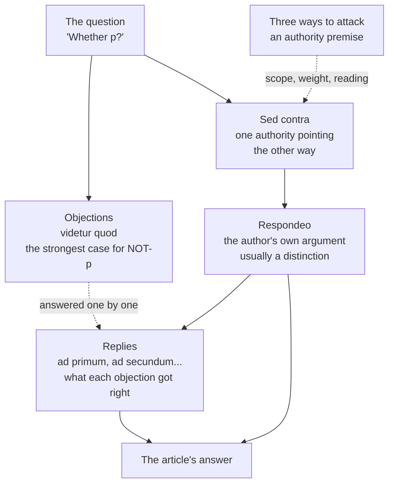

# Philosophical Method · Lesson 4.4: Arguing within a tradition: the disputed question

> ⏱ ~15 min · Module 4: Dialectic — engaging a position · Builds on: [4.3 Finding the crux](04-03-finding-the-crux.md) · Unlocks: nothing — this is the last lesson of the course

## Why this matters

Almost every text the Catholic Theology courses hand you, and a great many in political and legal thought, were written by someone arguing *inside* a tradition — for readers who already grant its authorities. Read those texts with only the tools for arguing *about* a tradition and you will misfile the whole genre: you will see appeals to authority where there are shared premises, and you will answer arguments nobody was making. This lesson gives you the reading protocol, the form the tradition itself invented for disputing, and the one distinction that keeps these conversations from collapsing.

## The idea

Two people can argue about the same question from two quite different places.

**Inside the tradition,** certain sources are agreed in advance: scripture, a council, a body of precedent, a founding text. Both parties grant them, so citing one is not bullying — it is appealing to a premise already on the table. The live question is what those sources, read rightly, actually require.

**Outside the tradition,** those sources are exactly what is in dispute. Citing them settles nothing, because the other side never granted them.

Neither stance is the respectable one. Both are ordinary argument; they simply run on different premise sets. What is *not* ordinary is the discipline the medieval universities built for the first kind — the **disputed question**, whose written form is the article of Aquinas's *Summa Theologiae*. It is the best-engineered argumentative form anyone has produced, because it forces the author to state the case against himself first, in full strength, and to say afterwards what each objection got right.

## The argument

**The scholastic article has four parts, each with a distinct job.**

1. **The objections** (*videtur quod* — "it seems that…"). Two to four arguments for the answer the author will reject, each stated as a real argument with real support. **What it is for:** the strongest case against, written by the author, before he says a word in his own voice. A straw man here would be a defect of the form, not a use of it.
2. **The *sed contra*** ("on the contrary…"). One short counter-move, almost always a citation: scripture, a Father, Aristotle, a council. **What it is for:** it marks which way the weight of the tradition falls and licenses the enquiry — not to prove the conclusion. It is a signpost, not the road.
3. **The *respondeo*** ("I answer that…"). The body: the author's own argument, in his own voice. **What it is for:** this is the argument. It usually turns on a distinction (4.3's crux, located and named), which is why the form and the tool fit together so well.
4. **The replies** (*ad primum*, *ad secundum*…). One answer per objection, in order. **What it is for:** to say precisely what each objection got right and where exactly it went wrong — most often by granting its premise in one sense and denying it in another. Notice the shape from [4.1](04-01-objections-and-replies.md): concede-and-distinguish, not deny.

**Argument from authority, inside a tradition, has a form you can test.**

> **P1.** Source *A* is authoritative, at weight *w*, on questions of kind *K* — a premise both parties grant.
> **P2.** The question at hand is of kind *K*.
> **P3.** *A*, correctly read, holds that *p*.
> **∴ C.** *p*, with whatever force *w* carries.

In words: the authority functions as a premise, not as a crowd. That is the whole difference from the fallacious appeal you met in [2.3](02-03-informal-fallacies-and-when-they-arent.md) — the bad version borrows *prestige* to stand in for a reason; this version cites a proposition both sides have already accepted as a reason. And because it has a form, it has three places to attack, all of them internal:

- **Scope (P2).** Is the authority speaking on *this*? Aristotle on friendship carries weight a Thomist grants; Aristotle on the number of planetary spheres does not.
- **Weight (P1).** How much force does it carry — defined dogma, or a theologian's opinion? Overstating the level is a straight error, graded strictly; the ladder belongs to [`fundamental-theology`](../../fundamental-theology/syllabus.md).
- **Reading (P3).** Does the source actually say that, in context, as its own tradition has received it? This is where most real disputes live, and it is plain exegesis.

**Internal and external critique are different arguments.**

> **Internal.** **P1.** The tradition holds *p* (by its own sources). **P2.** It also holds *q*. **P3.** *p* and *q* cannot both stand — or *q* is what the tradition's own principles forbid. **∴ C.** It must give something up.
>
> In words: you argue from premises *it* grants. You need not grant them yourself.

> **External.** **P1.** The tradition holds *p*. **P2.** *p* is false, for reasons drawn from outside it. **∴ C.** The tradition is wrong about *p*.
>
> In words: you attack a premise from outside, so its authorities are unavailable to either side.

Conflating them wrecks the exchange in one move, in either direction. Answer an internal critique externally ("but the council said so") and you have cited the very thing whose consistency is in question — a textbook beg. Answer an external critique internally ("but Aquinas addressed that in the reply to the second objection") and you have answered a question nobody asked. The dialectical burdens differ too ([4.2](04-02-steelmanning-and-the-burden-of-proof.md)): the internal critic borrows his premises and owes only the inconsistency, while the external critic owes an argument for the premise he is denying.

**A third kind of problem: apologetic.** You have met **exegetical** problems, graded strictly on accuracy ([1.3](01-03-reconstruction-and-charity.md)), and **evaluative** ones, graded on the moves and never on the verdict ([2.3](02-03-informal-fallacies-and-when-they-arent.md)). An **apologetic** problem is the third: *the task assigns the stance.* You are told which side to defend. It is graded in two halves — first your statement of the opposing view, strictly, as exegesis, because a defence of a position you have misdescribed is worth nothing; then the reply, on the quality of its moves. What is never graded is the verdict, and conceding a point that is genuinely true counts in your favour rather than against it. This is the form every problem in the apologetics courses takes.

## Argument map

Read the solid arrows as the argument and the dashed ones as service the form performs on itself. The *sed contra* feeds the *respondeo* but does not carry it; the replies are downstream of the *respondeo*, because you cannot say what an objection got wrong until you have said what is right.

## Worked examples

**Example 1 (mechanical — map an article).** Aquinas, *Summa Theologiae* I, q.2, a.1: *Whether the existence of God is self-evident?* Map it by part, in the English Dominican translation.

- **Objections (three).** (1) What is naturally implanted in us is self-evident; Damascene says knowledge of God is naturally implanted in all; so it is self-evident. (2) A proposition is self-evident when it is known as soon as its terms are known; once "God" is understood to mean that than which nothing greater can be thought, it is seen that God exists. (3) The existence of truth is self-evident, since anyone denying it affirms it; God is truth; so that God exists is self-evident. Three genuinely good arguments — (2) is Anselm's, given without condescension.
- ***Sed contra*.** "The fool said in his heart, There is no God" (Ps. 52:1). One line, one citation. Its job is not to refute Anselm; it is to establish that the opposite of this proposition *can* be mentally entertained, which is precisely what a self-evident proposition does not permit.
- ***Respondeo*.** The distinction that does all the work: self-evident **in itself** versus self-evident **to us**. A proposition is self-evident in itself when the predicate is contained in the subject. "God exists" is such a proposition — but only for someone who knows what God is, and we do not. So it is self-evident in itself and not to us, and therefore needs demonstration from what is better known to us, namely God's effects.
- **Replies.** (1) Concedes a great deal: a general, confused knowledge of God is implanted in us, since God is our beatitude — but knowing that someone is approaching is not knowing that it is Peter, even when it is Peter. Not a denial; a distinction between two kinds of knowing. (2) Grants the definition and denies the inference: that a name signifies something than which nothing greater can be thought does not yet give you that the thing exists outside the mind. (3) Grants that truth in general is self-evident and denies that a *first* truth is.

Every reply concedes before it distinguishes. That is the signature of the form, and the reason an article is worth reading even when you reject its conclusion: the objections and replies together are a complete map of the dispute.

**Example 2 (where it strains — the same complaint, two stances).** [4.3](04-03-finding-the-crux.md) took the usury prohibition apart on its merits — sterility against opportunity cost. Set that aside and take the *other* complaint people make about it: that the Church condemned lending at interest for centuries and now permits it.

Put as an **internal** critique it runs: the tradition binds itself to consistency in what it teaches as required; it taught that such lending is always sinful and now teaches otherwise; therefore something in its own account of its teaching authority has to give. Every premise here is one the tradition grants. A reply that says "the magisterium is authoritative, so the objection fails" has cited the thing under examination — it begs. A reply that *works* has to be internal too: distinguish the sense in which the old teaching bound from the sense in which the new permission operates, and show the change is a development rather than a reversal. Whether that reply succeeds is exactly the live question, and it is [`theology-of-debt`](../../theology-of-debt/syllabus.md)'s to answer.

Put as an **external** critique the same facts serve a different argument: no institution changes its mind like that unless its claim to teach with divine assistance is false. Now the tradition's own sources are unavailable, because P2 denies their standing. A reply quoting Aquinas here answers nothing.

Same historical facts, two arguments, two burdens, two ranges of admissible evidence. Most unproductive arguments about a tradition are a failure to say which one is on the table — and each side is usually answering the *other* argument, sincerely, at length.

## Watch out

- **You might think the *sed contra* is the argument.** It isn't; the *respondeo* is. The *sed contra* is a one-line signpost, and treating it as the proof makes Aquinas look like someone who settles questions by quotation — precisely the reading the form is built to prevent.
- **You might think the objections are straw men.** They are the opposite: the author's own best case against himself, and in q.2 a.1 one of them is Anselm's. If your reconstruction makes an objection look silly, you have misread it ([1.3](01-03-reconstruction-and-charity.md)).
- **You might think arguing from authority is automatically fine inside a tradition.** It has a form and therefore three failure modes — wrong scope, overstated weight, bad reading. Overstating the weight of a source is an error the tradition itself will convict you of.
- **You might think an internal critique commits you to the tradition.** It commits you to nothing. You are running the tradition's premises to see where they go, which is why an atheist can produce a devastating internal critique and a believer a very bad one.
- **Quoting a tradition's texts at it does not make your critique internal.** What makes it internal is arguing from premises that tradition grants, in the senses it grants them. An external argument decorated with citations is still external, and calling it internal is the commonest way to make an exchange go nowhere.

## One-liner

> Inside a tradition an authority is a shared premise with a scope, a weight and a reading — three things you can argue about — and the whole point of the scholastic article is to make the case against you the first thing on the page.

## Problems

**P1 (🟢) *(Exegetical.)*** Below are five moves, scrambled and paraphrased, from *Summa Theologiae* I, q.1, a.2, on whether sacred doctrine is a science. Assign each to its part — objection, *sed contra*, *respondeo*, or reply — and give the one-line job that part performs in the article. One sentence each.

(a) Augustine, in *De Trinitate*, assigns to this science the work by which saving faith is begotten, nourished and strengthened.
(b) It seems that sacred doctrine is not a science, because every science proceeds from self-evident principles, and this one proceeds from articles of faith, which are not self-evident.
(c) Some sciences take their principles from a higher science, as optics takes its principles from geometry and music from arithmetic; sacred doctrine takes its principles from the knowledge God and the blessed have.
(d) The principles of any science are either self-evident or reducible to the principles of a higher science; the principles of this one are of the second sort, so the objection holds only of sciences of the first sort.
(e) It seems that sacred doctrine is not a science, because a science does not treat of individuals, whereas this one treats of Abraham, Isaac and Jacob.

**P2 (🟡) *(Exegetical (a) · Evaluative (b).)*** An invented opinion column, attributed to no one real:

> "Every constitutional lawyer I know swears by the doctrine of precedent — right up to the moment a precedent inconveniences them, at which point we are told it was 'wrongly decided' and may go. You cannot have it both ways. Either past decisions bind or they don't, and a court that overrules whenever it disagrees has no doctrine of precedent at all; it has a mood."

(a) Is this an internal or an external critique of the legal tradition it addresses? Name the premise that decides it. (b) Write the reply that fits the stance you identified in (a), and say what the reply must *not* do. 150 words or fewer for (b).

**P3 (🔴, optional) *(Apologetic — (a) exegetical, strict; (b) graded on the reply's quality.)*** The evidentialist tradition running from Locke to W. K. Clifford holds that the sufficiency of one's evidence is a matter of duty, not taste: "It is wrong always, everywhere, and for anyone, to believe anything upon insufficient evidence" (Clifford, *The Ethics of Belief*, 1877). On that view the *sed contra* looks like a scandal — a proposition believed because a text says so.

(a) State the evidentialist objection to arguing from authority inside a tradition in three or four sentences, as its best defenders would put it — strong enough that an evidentialist would sign it. Do not reply yet. (b) Now defend the disputed-question form against it, in 150 words or fewer. Your stance is assigned; concede whatever is true.

Solutions

**P1** *(Exegetical — strict.)*

**Must hit, strict:**
- (b) and (e) are **objections** — each opens *videtur quod* and argues for the position the article will deny. Job: state the strongest case against, in the author's own hand.
- (a) is the ***sed contra*** — a single authority cited against the objections. Job: mark where the tradition's weight falls and license the enquiry; it does not carry the argument.
- (c) is the ***respondeo*** — the author's own argument, turning on the distinction between sciences that proceed from self-evident principles and subalternated sciences that take theirs from a higher science. Job: this is the argument.
- (d) is a **reply**, and specifically the reply to (b): it grants the objection's premise for one class of sciences and denies that the class exhausts the cases. Job: say what the objection got right and locate exactly where it fails.

**Wrong turns:** calling (a) the argument because it is the only authority cited; assigning (d) to the *respondeo* because it sounds conclusive — a reply is always addressed to one numbered objection and can be recognised by that; missing that (b) and (e) are two separate objections rather than one.

**Model answer:** (b), (e) objections; (a) *sed contra*; (c) *respondeo*; (d) reply to (b). The ordering of jobs: case against → signpost → argument → concession-and-distinction.

---

**P2** *(a) exegetical — strict; (b) evaluative — any verdict.*

**Must hit, strict (a):** **internal.** The decisive premise is that the tradition itself holds past decisions bind — the column argues entirely from a commitment lawyers grant, and asserts nothing about whether precedent *ought* to bind. It charges the practice with inconsistency with its own principle. (An external version would have to deny that precedent has any claim on a court in the first place.)

**Must hit, any verdict (b):** the reply must be internal too — it must argue from premises the doctrine of precedent itself supplies. The available move is the one the *respondeo* always makes: distinguish. Precedent binding *defeasibly* (with stated grounds for departure — workability, reliance, erosion by later cases) is not the same commitment as precedent binding absolutely, and the column's dilemma assumes the second. Any verdict passes: you may conclude the distinction rescues the practice, or that it is the "mood" the column describes wearing a better suit.

**Must not do:** cite the tradition's authority as such — "the Court has said precedent is defeasible, so the objection fails" is exactly the beg the internal form is designed to expose, because the consistency of the tradition's own practice is what is in question.

**Wrong turns:** calling it external because it is hostile in tone — stance is fixed by the premise set, not the temperature; supplying an external reply ("precedent is a bad doctrine anyway"), which concedes the charge; missing the false-dilemma structure of "either past decisions bind or they don't" ([2.3](02-03-informal-fallacies-and-when-they-arent.md)).

**Model answer (b), one of several:** Internal, so the reply is internal. The column offers a false dilemma: the choice is not between absolute binding and none, but between absolute and defeasible binding. The doctrine as actually held sets out *grounds* for departure — unworkability, reliance interests, erosion by subsequent decisions — and specifies who may invoke them and with what justification. A court that overrules on those stated grounds is applying the doctrine, not abandoning it. What the reply may not do is invoke the tradition's authority to certify itself. Whether the stated grounds are tight enough to be more than a mood is a fair further question, and one that has to be settled case by case rather than by the dilemma.

---

**P3** *(a) exegetical — strict; (b) apologetic — graded on the reply, never on the verdict.*

**Must hit, strict (a):** the objection must be recognisable to an evidentialist, which means it must contain (i) belief as answerable to evidence in proportion to that evidence, as a duty rather than a preference; (ii) the specific charge that testimony from a source whose reliability has not itself been established transfers no warrant, so the appeal is either circular or a regress; (iii) the observation that traditions with incompatible authorities all argue this way, so the form cannot be what distinguishes true belief from false. A statement that reduces the objection to "you shouldn't just believe what you're told" is too weak and fails the part.

**Must hit, any verdict (b):** the reply must (i) grant what is true — an authority premise does need support, and a tradition whose authorities were never independently examinable would be in the position the objection describes; (ii) engage the *form* of the authority premise rather than its prestige, i.e. note that P1 is itself arguable and is argued for elsewhere in the tradition (the grounds of revelation, the standing of a council) rather than assumed; (iii) address the parity charge, either by accepting it and pointing to where the tradition's authority premise is defended, or by denying that all such premises are equally supported and saying what would distinguish them.

**Wrong turns:** treating the *sed contra* as the argument and so defending something Aquinas does not claim; replying "Clifford's principle is self-undermining because it is itself believed on insufficient evidence" and stopping there — the tu quoque may well be a live move, but on its own it defends nothing; conceding nothing at all, which the kind explicitly penalises.

**Model answer (b), one of several:** Concede the core: an authority premise is a premise, and it needs support. The disputed question does not hide this — it exposes it, by putting the authority on a line of its own where its scope, its weight and its reading can each be challenged. What the objection misses is that the *sed contra* is not offered as the proof; the *respondeo* is, and it argues. The regress worry is real but not special: every enquiry rests somewhere on testimony it has not personally verified, including the sciences, and the question is always whether *this* source has been examined by the standards appropriate to it. Where the tradition has not done that work, the objection lands and should be granted. The form's virtue is that it makes such gaps visible instead of burying them.

## Flashback

**From Lesson 4.2 (Steelmanning and the burden of proof):** A seminar handout — invented for the problem, attributed to no one real — summarises a position it means to dismiss:

> "The people who insist on judging historical figures by today's morality are indulging in vanity. They assume our own century happens to be the summit of moral progress, and they enjoy passing sentence on the dead, who are conveniently unable to answer back."

(a) That is a straw man. State the strongest version of the position it attacks — the one a defender would actually sign. (b) A historian now replies that the burden falls on whoever wants to *judge* a past agent, "because the historian's default is to describe, not to evaluate." Is that presumption claim doing legitimate work, and what would have to be shown to establish it? 120 words or fewer in total.

Solution

*(a) exegetical — strict, against the steelman conditions; (b) evaluative — any verdict.*

**Must hit, strict (a):** the steelman must drop both smuggled premises — that the judge believes the present is the moral summit, and that the motive is enjoyment — and give reasons the handout cannot absorb. At least one of: moral standards are not indexed to the agent's own community, so if a practice was wrong it was wrong then; past societies contained contemporaries who condemned the practice on grounds available at the time, so the standard is not anachronistic; refusing to evaluate is itself a choice with consequences, not a neutral default.

**Must hit, any verdict (b):** say what a presumption claim needs in order to be more than an assertion — a ground such as asymmetric cost of error, asymmetric access to evidence, or an established default that both parties already accept. Then test "the historian's default is to describe" against that: a description of disciplinary habit is not yet a reason. Either verdict passes — that the presumption is earned (say, because evaluation without context is systematically unreliable, which would need showing) or that it is question-begging, since whether description is the discipline's proper default is the very thing in dispute.

**Wrong turns:** steelmanning by softening the position ("we may judge the past *sometimes*") rather than strengthening it — a steelman keeps the claim and improves its support; arguing the first-order question of whether past agents may be judged instead of the burden question in (b).

**Model answer:** (a) Moral claims are not indexed to their era: if a practice was unjust, it was unjust when it was done, and contemporaries who said so were not time travellers. Declining to evaluate is a verdict too. (b) The claim needs a ground, and "historians describe" supplies only a habit. To establish it one would have to show an asymmetry — that mistaken evaluations corrupt historical understanding in a way mistaken abstentions do not. Absent that, the presumption assumes what is in dispute.

## Connections

- **Backward:** the article is Module 4 assembled. Its objections are [4.1](04-01-objections-and-replies.md)'s taxonomy in use, its replies are concede-and-distinguish, its objections are written to [4.2](04-02-steelmanning-and-the-burden-of-proof.md)'s standard, and its *respondeo* is almost always [4.3](04-03-finding-the-crux.md)'s crux located and named. The authority premise is [2.3](02-03-informal-fallacies-and-when-they-arent.md)'s legitimate appeal given a form you can attack.
- **Boss problem 4** is the full exercise: map, reconstruct, find the crux and argue both sides of *Summa Theologiae* II-II q.40 a.1, "Whether it is always sinful to wage war?"
- **Forward:** [`thomistic-synthesis`](../../thomistic-synthesis/syllabus.md) works in this form natively and reads articles at length; [`fundamental-theology`](../../fundamental-theology/syllabus.md) owns the levels of authority that fix the *weight* term in P1; [`apologetics-foundations`](../../apologetics-foundations/syllabus.md) and [`apologetics-catholic-claims`](../../apologetics-catholic-claims/syllabus.md) run on apologetic-kind problems throughout, with the opposing view stated first and graded as exegesis every time.
- **Sideways:** the internal/external distinction is the whole argumentative structure of [`constitutional-law`](../../constitutional-law/syllabus.md) — precedent, text and original meaning are authority premises with scope, weight and contested readings — and [`history-of-political-thought`](../../history-of-political-thought/syllabus.md) reads thinkers who argue inside traditions (Roman law, scripture, the ancient constitution) that a modern reader will misfile if the two stances are run together.

## Closing the course

Sixteen lessons, one habit: get the argument onto separate lines before you do anything else with it.

Module 1 was that habit's mechanics — find the conclusion, supply what the prose leaves unsaid, test the link separately from the premises, and prove a bad form bad with a counterexample nobody can dispute. Module 2 was for the arguments that will never be proofs, which is most of them: explanations competing on explanatory virtues, analogies standing or falling on relevant similarity, fallacies that are only sometimes fallacies, and evidence weighed in odds form so that "this changes everything" becomes a number. Module 3 was the distinctively philosophical part — definitions built to be broken, distinctions that dissolve disputes about words, imaginary cases varied one factor at a time, and the decision, when a principle and an intuition collide, about which one to give up. Module 4 put you in the exchange: objections classified, opponents stated at their strongest, disagreements reduced to the one premise they turn on, and finally the form a tradition uses to dispute with itself.

What generalises is smaller than it looks. Nearly every move in this course is one of three: **separate two things that were running together** (form from content, argument from explanation, verbal from substantive, internal from external); **make the tacit explicit** (the suppressed premise, the crux, the scope of an authority); or **find the case that breaks it** (the counterexample, the variant thought experiment, the objection that proves too much). If you remember nothing else, those three will reconstruct most of the rest.

Deliberately left elsewhere: logic as a mathematical system, which [`mathematical-logic`](../../mathematical-logic/syllabus.md) owns; the positions themselves, which the subject courses own. You now have the tools those courses assume. The natural next steps are [`ethics`](../../ethics/syllabus.md) and [`political-philosophy`](../../political-philosophy/syllabus.md), where Module 3's method is the method, and [`fundamental-theology`](../../fundamental-theology/syllabus.md), where this lesson's authority premise gets the precision it has been waiting for.
