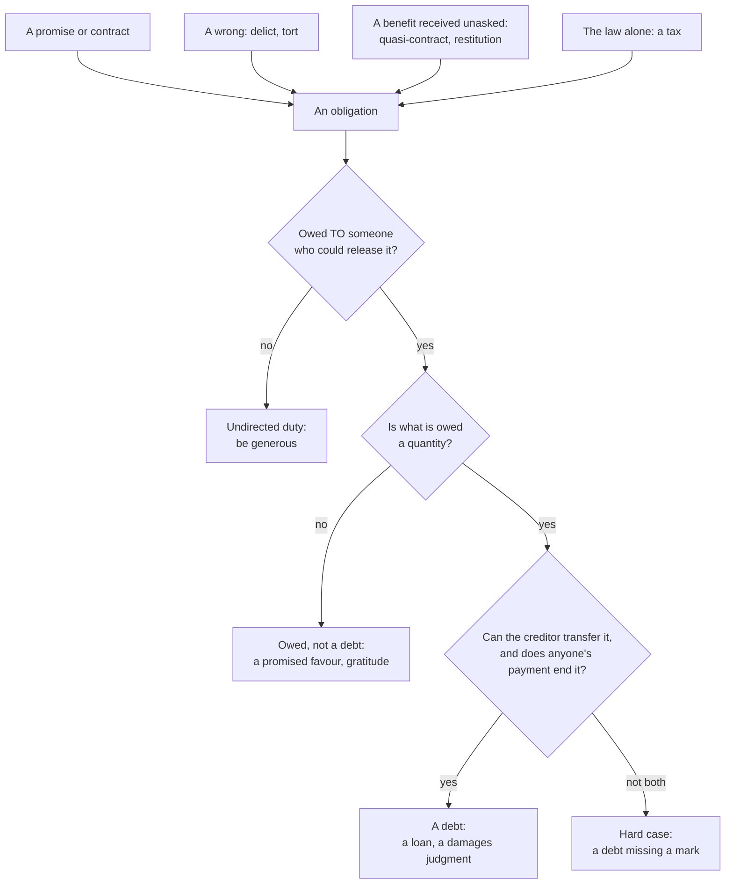

# Philosophy of Debt · Lesson 1.1: The grammar of owing

> ⏱ ~15 min · Module 1: What is it to owe? · Builds on: [`ethics` 2.2 The Formula of Universal Law](../../ethics/lessons/02-02-the-formula-of-universal-law.md), [`history-of-debt` 1.1 Credit before coins](../../history-of-debt/lessons/01-01-credit-before-coins.md) · Unlocks: [1.2 Hume: promises as artificial obligation](01-02-hume-promises-as-artificial-obligation.md)

## Why this matters

You owe the bank for the car, a friend an apology, your parents more than you can say, and, some say, a debt to society. This course asks six questions about owing, one per module. What is it to owe (1)? Can charging for a loan be just (2)? What makes a loan exploitative (3)? Did guilt grow out of debt, as Nietzsche claimed (4)? Who may cancel a debt, and at whose expense (5)? Can generations, nations and societies owe (6)? This is the philosophy course of the four-course debt thread. [`history-of-debt`](../../history-of-debt/syllabus.md) supplies the episodes. [`theology-of-debt`](../../theology-of-debt/syllabus.md) reads usury, the Jubilee and sin as debt from inside the Catholic tradition. [`economics-of-debt`](../../economics-of-debt/syllabus.md) builds the models. This course argues about all of it and takes no side ([syllabus](../syllabus.md)).

It starts with groundwork: what a debt is, and which obligations only borrow the word.

## The idea

Start with the verb. *Owe* takes three places: **someone owes something to someone**. English keeps a trace of what happens when the last place drops out. *Ought* began as a past tense of *owe*, and "you ought to be generous" names no one the generosity is owed to.

That third place is the course's first distinction.

- A **[directed obligation](../reference.md#directed-obligation)** is owed *to* someone. Break it and you do not just act wrongly; you wrong *her*. She can demand it as hers, complain in her own right, and let you off. In Hohfeld's terms your duty is the correlative of her claim-right ([`philosophy-of-law`](../../philosophy-of-law/syllabus.md) 6.1).
- An **undirected duty** concerns others without being owed to any of them. Kant's imperfect duty of beneficence ([`ethics` 2.2](../../ethics/lessons/02-02-the-formula-of-universal-law.md)) is the standard case: you must make others' good your end, but on the usual reading no one can demand your help as hers.

The quick test for direction is *who could release me?* Ana can cancel the 50 dollars you owe her. No one can cancel your duty to be generous.

A **[debt](../reference.md#debt)** is a directed obligation with four marks.

1. **A quantity.** What is owed is a sum of money, or so much of something counted, weighed or measured. Any units of the right kind will do.
2. **A determinate creditor.** At every moment a rule settles who holds the claim, even when the debtor cannot say who that is. A bearer bond is owed to whoever holds it.
3. **Transferability.** The creditor can sell or give the claim away (lawyers say *assign* it), so you can come to owe a stranger. You cannot swap in a new debtor without the creditor's agreement.
4. **Discharge by payment or [release](../reference.md#release).** Anyone's payment ends it, not only yours. Short of the law's own power to cancel (Module 5), only the creditor can end it without payment.

Seen from the other side, a debt is a credit, from *credere*, to trust. Simmel made trust in the social order the footing of money and credit alike ([`social-theory`](../../social-theory/syllabus.md) 5.2).

## Source

Justinian's *Institutes* (533), a textbook for law students, opens its account of obligations at III.13. In J. B. Moyle's translation (5th ed., 1913):

> Let us now pass on to obligations. An obligation is a legal bond, with which we are bound by a necessity of performing some act according to the laws of our State. … By another division they are arranged in four classes, contractual, quasicontractual, delictal, and quasidelictal. And first, we must examine those which are contractual, and which again fall into four species, for contract is concluded either by delivery, by a form of words, by writing, or by consent

Three things to notice.

- **A knot and its untying.** Moyle's "legal bond" renders *iuris vinculum*, a tie of law, and his "performing" renders a form of *solvere*, which means both to untie and to pay; Title XXIX's word for performance is *solutio*. The definition speaks from the debtor's side ("we are bound") and leaves the other end of the tie, the creditor, implicit. This is *[obligatio](../reference.md#obligatio)*.
- **Whose law.** The necessity holds "according to the laws of our State", so this defines *legal* obligation. The text later sets beside it a "natural" obligation, such as a slave's, which a surety may still guarantee (III.20.1). Whether a legal debt also binds in conscience is the question of 1.2–1.4.
- **Four sources, one of them agreement.** A delict is a wrong such as theft or damage (Book IV). The two "quasi" classes collect obligations that are not quite contracts or delicts and are treated as if they were. A man whose business another managed in his absence is bound "even though he knows nothing" (III.27.1): that is **[quasi-contract](../reference.md#quasi-contract)**. And three of the four species of contract need more than bare agreement: a delivery, set words, or writing.

## The argument

**Debt is narrower than owing and wider than promising.** This is the course's working analysis, built on Justinian's sources.

1. **To owe something to someone is to be under an obligation directed to her.** *In words:* owing has an address.
2. **A directed obligation is a debt if and only if it has the four marks:** a quantity, a determinate creditor, a transferable claim, and discharge by anyone's payment or the creditor's release. *In words:* debt is a shape an obligation can take, and the test never asks where the obligation came from.
3. **Some directed obligations lack the marks.** A promise to help a friend move owes your own help, not a quantity. Gratitude cannot be priced or sold.
4. **Some obligations with all four marks arose from no promise.** A damages judgment against a careless cyclist is one. So is the duty to return money paid to you by mistake, which Justinian already lists (III.14.1).

∴ **Not everything owed is a debt (1–3), and not every debt rests on a promise (2, 4).**

**Where the argument is weakest.** The "if" half of premise 2, applied to morality. Premise 4's examples are legal debts, and Justinian defines *legal* bonds, so the argument shows at most that legal debt is wider than promising. A critic can grant that and deny that the four marks make a *moral* debt: its moral force, she says, depends on how it arose. On the strictest view only a promise will do. On a looser, voluntarist view any act of the debtor's own will serves, a wrong freely done included, so the cyclist qualifies. The hard case for both is the mistaken payment, whose recipient promised nothing and did nothing. The voluntarist replies that the moral debt begins only when the recipient learns of the mistake and keeps the money. If a reply like that succeeds, origin matters after all, and 1.2–1.4 take up the question.

## Sorting an obligation

Four sources feed in at the top, and none of the three questions asks which one an obligation came from. The bottom-right box is where the "only if" half of premise 2 gets tested: a claim the law forbids selling still looks like a debt.

## Worked examples

**Example 1 (clean: three obligations, one person).** Maya owes her bank 12,000 dollars on a car loan. She promised her friend Leo to help him move on Saturday. She earns well and gives nothing to anyone.

- *The loan* has all four marks. It is a sum, owed to the bank. The bank may sell the loan, and Maya then owes the buyer. Her father can pay it off without asking her, and only the bank can waive it. **A debt.**
- *The promise* is directed: Leo can hold her to it or let her off. But what she owes is her own help, not so much of anything. Leo cannot sell it to a stranger, and her brother turning up in her place keeps it only if Leo accepts the swap. **Owed, not a debt.**
- *The refusal to give* breaks a duty, if Kant is right, that no one can demand or waive. **Undirected.**

**Example 2 (hard: a debt born of a wrong).** A cyclist runs a red light and breaks a pedestrian's wrist. Nobody promised anything.

- *The next morning* he owes her repair, and the obligation is directed: she can demand it, sue, or let it go. It is not yet a debt. No sum is fixed (lawyers call the claim *unliquidated*), and many legal systems restrict selling a personal-injury claim before judgment.
- *After judgment for 8,000 dollars* every mark is present: a sum, a named creditor, a judgment she may sell to a collector, and discharge by anyone's payment (his insurer's, say) or by her release.

The same wrong produced first a directed claim, then a debt. The strain is in the timing. When did he come to owe 8,000 dollars: at the crash, or at the judgment? If the court *measures* a debt that already existed, quantity can be a moral fact that law discovers. If the court *creates* it, the quantity mark is a legal artifact, and what morality supplies underneath is a duty of repair with no number attached. The answer decides whether "moral debt" is ever more than a figure of speech, and [1.4](01-04-contract-debt-and-the-duty-to-repay.md) asks the same of debts that began as promises.

## Watch out

- **You might think that classifying something as a debt settles whether it must be paid.** It settles only its shape. That a payday loan or a tyrant's loan has all four marks is a conceptual claim. Whether it binds is normative ([3.2](03-02-predatory-lending-and-usury-caps.md), [6.3](06-03-whose-debt-is-it.md)). How the words got their weight (*credere*, *ought* from *owe*, German *Schuld* for both debt and guilt) is history ([4.1](04-01-the-animal-with-the-right-to-make-promises.md)). Most bad arguments about debt slide between the three.
- **You might think the creditor is whoever benefits.** If you promise me that you will pay my mother 100 dollars, she benefits, but the promise was made to me, and my say-so can let you off. Whether she can also sue is settled differently by different legal systems, and the will and interest theories of rights give the rival rationales ([`philosophy-of-law`](../../philosophy-of-law/syllabus.md) 6.2).
- **You might think "Is gratitude really a debt?" is a quarrel about a word.** Often it is ([`philosophical-method` 3.2](../../philosophical-method/lessons/03-02-distinctions-and-verbal-disputes.md)). It stops being one when someone draws a debt's consequences from [gratitude](../reference.md#gratitude): that it can be demanded, priced, or paid off and closed. [6.4](06-04-debts-of-gratitude.md) asks whether that is ever legitimate.

## One-liner

> Debt is narrower than owing and wider than promising: an obligation owed to someone, for a quantity, transferable by the creditor and ended by anyone's payment, whether it began in a promise, a wrong, a windfall or a law.

## Problems

**P1 (🟢) *(Exegetical.)*** For each obligation, say which of the four marks it has, classify it as a debt, owed but not a debt, or an undirected duty, and name its source (a promise or contract, a wrong, a benefit received, or law). Two sentences each.

(a) Your aunt hands you a voucher she bought from a bakery: "Good for 40 dollars of bread to the bearer."
(b) Your city bills you 2,400 dollars in property tax. By local law the city may sell overdue tax claims to investors, anyone may pay the bill for you, and the council may waive it.
(c) A stranger drove you to hospital at 3 a.m. and refused your offer of 50 dollars for petrol.

**P2 (🟡) *(Exegetical.)*** Justinian, *Institutes* III.29, from the opening and §1 (Moyle, 1913):

> An obligation is always extinguished by performance of what is owed, or by performance of something else with the creditor's assent. It is immaterial from whom the performance proceeds—be it the debtor himself, or some one else on his behalf: for on performance by a third person the debtor is released, whether he knows of it or not, and even when it is against his will. … Acceptilation is another mode of extinguishing an obligation, and is, in its nature, an acknowledgement of a fictitious performance. For instance, if something is due to Titius under a verbal contract, and he wishes to release it, it can be done by his allowing the debtor to ask … and by his replying 'I have received it.'

(a) Whose agreement does discharge by performance need, and whose does it expressly not need? Quote the deciding words. (b) What does the passage say acceptilation *is*, and whose act is it? What does that show about release? (c) Maya's brother offers to help Leo move in her place (Example 1). Using the first sentence, say what decides whether Leo must agree. 120 words or fewer in all.

**P3 (🔴) *(Evaluative.)*** An invented critic: "Every debt rests on a promise. Where no one promised, 'debt' is a courtesy title." (a) Build a case not used in this lesson: an obligation with all four marks that arose from no promise by the one who owes. (b) Give the critic's strongest reply, and say whether it generalizes: if it saves the thesis in your case, what does it do to the word "promise"? Any verdict. 150 words or fewer.

Solutions

**P1** *(Exegetical — strict.)*

**Must hit, strict:**
- (a) **A debt, with all four marks.** 40 dollars' worth of bread; owed to whoever holds the voucher, so the creditor is fixed by a rule (possession), not by name; transferred by handing it over; discharged when the bakery redeems it or the holder gives it up. Source: **contract**, the bakery's sale to your aunt. You acquired the claim by transfer, though the bakery never promised *you* anything.
- (b) **A debt, with all four marks:** a sum, owed to the city, saleable, payable by anyone, waivable by the council. Source: **law**. You agreed to nothing.
- (c) **Owed, not a debt.** It is directed, since ingratitude would slight *her*, but it has no quantity, cannot be sold, and is not ended by payment: she refused the money, and paying would not close the matter. Source: **a benefit received**.

**Wrong turns:** denying that (a) is a debt because the bakery promised you nothing, which confuses how you came to hold the claim with whether it exists. Denying that (b) is a debt because no one consented, which confuses source with shape. Calling (c) undirected: the gratitude is owed to her, not to people in general.

**Model answer:** (a) All four marks, with the creditor fixed by possession rather than by name: a debt, from the bakery's contract of sale, which reached you by transfer. (b) All four marks: a debt, from law alone. (c) Directed, since it is owed to her, but with no quantity, no transfer and no discharge by payment: owed, not a debt, from a benefit received.

---

**P2** *(Exegetical — strict.)*

**Must hit, strict (a):** performance "of what is owed" needs no one's agreement, not even the debtor's: a third person's performance releases him "whether he knows of it or not, and even when it is against his will". Only performance "of something else" needs "the creditor's assent".

**Must hit, strict (b):** acceptilation is "an acknowledgement of a fictitious performance", and it is the creditor's act: Titius "wishes to release it" and replies "I have received it". Release belongs to the creditor alone, and Roman law frames it as a payment he declares he has received.

**Must hit, strict (c):** the deciding question is whether the brother's help is "performance of what is owed" or "of something else". A sum of money is the same whoever pays it. Maya promised her *own* help, so who performs is part of what is owed; her brother's help is something else and needs Leo's assent.

**Wrong turns:** reading "with the creditor's assent" as governing both halves of the first sentence. Calling acceptilation the debtor's act because the debtor asks the question. Answering (c) with "Leo must agree because it was a promise": the passage makes the answer turn on what is owed, not on where the obligation came from.

**Model answer:** (a) Paying what is owed needs nobody's agreement: a third person's payment releases the debtor "whether he knows of it or not, and even when it is against his will". Substituting "something else" needs "the creditor's assent". (b) Acceptilation is "an acknowledgement of a fictitious performance": the creditor declares he has received what he has not. Only he can make that declaration, so release is his act. (c) Whether the brother's help counts as what is owed. Money is the same from any hand, but Maya owes her own help, so her brother's is "something else", and Leo must assent.

---

**P3** *(Evaluative — any verdict.)*

**Must hit, any verdict (a):** a case with each mark checked: a sum, a determinate creditor, a claim the creditor could sell, and an end by anyone's payment or the creditor's release. Its origin must plainly involve no promise by the one who owes. Emergency services given to someone unconscious, or a charge imposed by statute, will serve.

**Must hit, any verdict (b):**
- The critic's reply at full strength: a tacit, implied or hypothetical promise ("he would have agreed"), or its voluntarist cousin, on which some act of the debtor's own will grounds the debt.
- A test of whether it generalizes. If a promise is imputed whatever the debtor did or would have said, "promise" now means "whatever grounds a debt", and the thesis is saved by being emptied. If the reply needs a real act, say whether your case contains one.
- A one-line verdict with a reason.

**Wrong turns:** a case missing a mark (gratitude, a promise to visit), which the critic can concede is no debt at no cost. A case where the debtor did undertake something (a guarantor, an auto-renewing subscription). Answering (b) with a legal fact ("a court would make him pay"), which says nothing about what grounds the debt.

**Model answer (one of several):** (a) An ambulance carries an unconscious man to hospital and bills its published flat fee of 900 dollars (illustrative). The sum is owed to the ambulance service, which may sell the bill to a collector; his sister may pay it, or the service may waive it. He promised nothing: he was unconscious. (b) The critic's best reply: he would have agreed if he could, and that imputed agreement is what makes the fee fair. But no one made that promise. If a promise nobody made can ground a debt, "promise" has come to mean "whatever makes a charge reasonable". That is the objection to hypothetical consent in [`political-philosophy`](../../political-philosophy/syllabus.md) 1.2. Verdict: the reply keeps the word and gives up the thesis. A reader who holds that the imputed agreement still sets the terms, by capping the fee at what he would have accepted, can conclude the other way and pass.

## Connections

- **Backward:** [`ethics` 2.2](../../ethics/lessons/02-02-the-formula-of-universal-law.md) gave the imperfect duty that serves here as the model undirected duty, and the false promise that [1.2](01-02-hume-promises-as-artificial-obligation.md) builds on. The title of Scanlon's book in [`ethics` 5.2](../../ethics/lessons/05-02-contractualism-what-no-one-could-reasonably-reject.md), *What We Owe to Each Other*, uses "owe" in this lesson's broad sense: duties with an address, few of them debts. The four marks are an analysis in the sense of [`philosophical-method` 3.1](../../philosophical-method/lessons/03-01-conceptual-analysis.md), a biconditional whose two halves can fail separately. [`history-of-debt` 1.1](../../history-of-debt/lessons/01-01-credit-before-coins.md) shows the quantity mark at the start, in debts measured in silver and barley.
- **Forward:** [1.2](01-02-hume-promises-as-artificial-obligation.md) asks how a promise can create a directed obligation at all. [1.4](01-04-contract-debt-and-the-duty-to-repay.md) asks whether Justinian's legal bond carries a moral one, including to a stranger who bought your debt. Release by the creditor is [5.1](05-01-forgiving-a-debt-forgiving-a-wrong.md)'s subject, and the law's power to cancel is [5.3](05-03-bankruptcy-as-a-moral-institution.md)'s. [6.4](06-04-debts-of-gratitude.md) asks whether a "debt to society" is a debt, and meets Bourgeois, who grounds it in a quasi-contract.
- **Sideways:** in the debt thread, [`history-of-debt` 1.5](../../history-of-debt/lessons/01-05-nexum-and-the-roman-plebs.md) shows Rome's *nexum*, where the bond was literal and the debtor's body answered for the loan. [`theology-of-debt` 3.1](../../theology-of-debt/lessons/03-01-from-burden-to-debt.md) shows what changed once sin was spoken of as a debt: it raised a debt's questions, how much is owed and whether someone else can pay, which are the first and fourth marks. [`economics-of-debt` 1.1](../../economics-of-debt/lessons/01-01-costly-state-verification.md) derives why a fixed claim, the quantity mark, is the optimal contract when outcomes are costly to verify.
