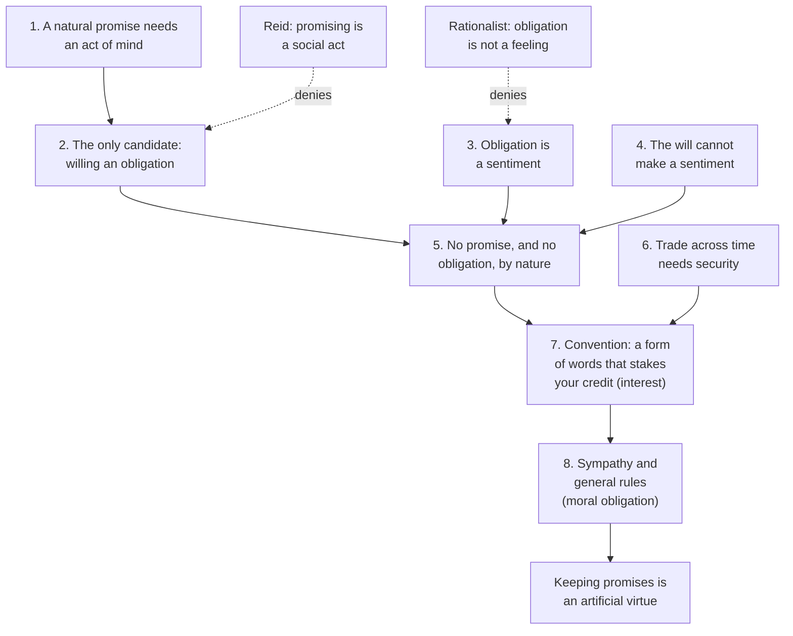

# Philosophy of Debt · Lesson 1.2: Hume: promises as artificial obligation

> ⏱ ~15 min · Module 1: What is it to owe? · Builds on: [1.1 The grammar of owing](01-01-the-grammar-of-owing.md), [ethics 2.2 The Formula of Universal Law](../../ethics/lessons/02-02-the-formula-of-universal-law.md) · Unlocks: [1.3 Promising after Hume](01-03-promising-after-hume.md)

## Why this matters

[1.1](01-01-the-grammar-of-owing.md) sorted debts by their sources, and a loan rests on the most familiar one, a promise. What makes a promise bind? David Hume put the question with a loan. Someone has lent you money, to be restored in a few days, and now asks for it: "What reason or motive have I to restore the money?" (*Treatise* III.ii.1). His answer is that nothing in nature makes a promise bind. Promising is a human invention, like language and money, and its obligation is real because the invention works. This is the classic statement of conventionalism about promising, and each account in [1.3](01-03-promising-after-hume.md) is built with it or against it. [1.4](01-04-contract-debt-and-the-duty-to-repay.md) and Module 4 ask whether a debt resting on a convention binds any less.

## The idea

Before you say "I'll repay you on Friday," you may spend Friday's money however you like. Afterwards you may not. Nothing in the world has changed, except that you spoke and, it seems, meant it. So the obligation looks as if an act of will made it. Hume's puzzle is whether a will can do that.

His way in is the distinction between [natural and artificial virtues](../reference.md#natural-and-artificial-obligation) (III.ii.1). A natural virtue has a motive in human nature that would move us even if nobody called it a duty: humanity moves us to relieve the miserable, and affection moves a parent. An artificial virtue has none. Ask what moves you to repay a lender who is a miser, or your enemy. Not love of him, and not love of mankind. Only the thought that you must, and that thought presupposes the duty it was supposed to explain. Hume grants that a sense of duty can move someone once the duty exists. His claim is about the *first* motive, the one that makes the act a duty at all. For keeping promises nature supplies none, so the duty must come from elsewhere.

It comes from a [convention](../reference.md#convention): not a contract anyone signed, but a pattern of conduct kept up because each person sees that it serves him provided others keep it too, and knows they see the same. Two men rowing a boat keep time this way without promising each other anything. Languages, and gold and silver as money, grew up the same way (III.ii.2). A [promise](../reference.md#promise) is one more such invention: a form of words that lets people who do not love each other trade across time. Kant's false-promise test ([ethics 2.2](../../ethics/lessons/02-02-the-formula-of-universal-law.md)) already treats promising as a practice that universal false promising would destroy. Hume asks what that practice is.

## Source

Hume, *A Treatise of Human Nature*, Book III (1740), Part ii, section 5, "Of the obligation of promises": the opening sentence, and the hinge of the argument (Project Gutenberg text).

> That the rule of morality, which enjoins the performance of promises, is not natural, will sufficiently appear from these two propositions, which I proceed to prove, viz, that a promise would not be intelligible, before human conventions had established it; and that even if it were intelligible, it would not be attended with any moral obligation.
>
> All morality depends upon our sentiments; and when any action, or quality of the mind, pleases us after a certain manner, we say it is virtuous; and when the neglect, or nonperformance of it, displeases us after a like manner, we say that we lie under an obligation to perform it. … But it is certain we can naturally no more change our own sentiments, than the motions of the heavens; nor by a single act of our will, that is, by a promise, render any action agreeable or disagreeable, moral or immoral…

Two propositions, two kinds of claim. The first is conceptual: before a convention, "I promise" means nothing. The second is normative: give the words a meaning, and still no obligation follows. The second paragraph carries both. If to be obliged *is* for your failing to act to displease in a certain way, and displeasure does not obey the will, then no one can oblige himself just by willing to. Notice "naturally". Hume does not deny that promises bind. He denies that they bind unaided.

## The argument

**Hume's case** (III.ii.5, with III.ii.1–2; reconstructed).

1. **If promising were natural, "I promise" would express some act of mind, and the obligation would depend on that act.** *In words:* a natural promise needs something inside for the words to report.
2. **That act is not a resolution to perform, since a resolution alone never obliges; not a desire, since we can bind ourselves while averse; and not willing the performance, since the will governs only present actions and a promise concerns the future. It would have to be [willing an obligation](../reference.md#willing-an-obligation).** *In words:* the only candidate left is "I hereby will that I be bound."
3. **To be under an obligation is for the neglect of an act to displease us in a certain way.** *In words:* for Hume an obligation is a fact about moral sentiment, not a truth of reason.
4. **No one can change a sentiment by an act of will.**
5. **So by nature a promise is unintelligible, and even if it made sense it would oblige no one.** *In words:* the Source's two propositions.
6. **People of limited generosity lose the gains of exchanges that cannot be completed at once.** Transfer by consent moves only present, particular goods, not so many bushels of corn in general or a day's labour tomorrow, and gratitude is weak security. *In words:* your corn is ripe today and mine tomorrow; with no way to bind the future, we both lose our harvests.
7. **A convention supplies the way: a known form of words by which the speaker stakes his credit, subjecting himself to "the penalty of never being trusted again in case of failure".** *In words:* promising is a practice kept up because it pays, which Hume thought anyone sees after brief experience of society; interest is the first obligation.
8. **Sympathy with the public interest, helped by education and the praise and blame of politicians, then makes breaches displeasing even to people they do not touch, and general rules carry that displeasure over to our own conduct.** *In words:* the practice acquires a moral obligation, by the same route as property.

∴ **Keeping promises is an artificial virtue. Its obligation is real, but a convention makes it; nature does not supply it.** ([Interest and sympathy](../reference.md#interest-and-sympathy) are its two sources.)

**Where the argument is weakest.** Premise 2, the inventory. Hume searches the acts a person could perform alone, such as resolving, desiring and willing, and finds no promise. Thomas Reid (*Essays on the Active Powers of Man*, 1788, Essay V, ch. 6) answered that Hume searched the wrong list, taking a promise for an act of will that might or might not be expressed. Promising belongs with asking a question, giving a command and testifying: [social operations](../reference.md#social-operations) of the mind, which exist only when expressed to another who understands them. A promise is a will to be bound, expressed, understood and accepted. It needs a hearer and shared signs, which Reid thought nature supplies before any compact, but no convention of promising. Reid then turned Hume's loan against him: to borrow on condition of repaying, with no conception that you must repay, is not a primitive state but a contradiction. The Humean reply is that without the convention there is no borrowing at all, only gifts made in hope of gratitude. Problem 2 tests that reply. Rationalists attack premise 3 instead; Hume's footnote replies that a will-made obligation fares no better if morals are relations.

## Argument map

## Worked examples

**Example 1 (clean: the neighbour's loan).** Run Hume's own case, set in a village. A neighbour lent you a sum, to be restored in a few days, and the day has come.

- *Not nature.* Perhaps you still intend to pay, perhaps not; perhaps you like him, perhaps not. Neither your resolution nor your affection is what binds you (premise 2).
- *The convention.* When you borrowed, you used the form of words that everyone in the village knows stakes the speaker's credit. That is why he lent to a man he does not love. The arrangement serves you both, as it would have served the reaping neighbours.
- *First obligation, interest.* Default, and you lose your credit with him and with everyone who hears of it.
- *Second obligation, morals.* A third villager, who lent nothing and loses nothing, still disapproves of a default. Through sympathy he feels the unease of everyone whose dealings rest on promises. You judge your own conduct by the same general rule, and feel the duty as yours.

Verdict: bound twice over, and both bonds come from the practice, not from anything inside you that the words report.

**Example 2 (hard: the loan no one will know about).** Hume raised a secret loan himself (III.ii.1). Sharpen it. On her last night in a port she will never revisit, a traveller borrows her fare home from a rich stranger, who will barely notice the loss. No one else knows. She promises to send the money on.

The first obligation is gone: default costs her no credit she will ever need. Benevolence gives her little reason either, since the stranger is rich. Hume still holds her bound. What is left is premise 8. Moral disapproval attaches to promise-breaking as a kind, and a general rule, once formed, reaches beyond the cases that gave rise to it. A traveller brought up in the practice feels the rule as her own duty, and now that the duty exists, the sense of it can move her.

This is where the account strains. Asked "why must I pay, here?", it answers with a fact about how breaches of this kind are felt. For Hume that is no evasion, since to be bound just is for a breach to meet that disapproval (premise 3). A critic replies that it explains why we would blame her without showing that she owes anything *to* the stranger, the [directed obligation](../reference.md#directed-obligation) a debt is. [1.3](01-03-promising-after-hume.md) starts from that complaint.

## Watch out

- **You might think "artificial" means fake or optional.** Hume: "Though the rules of justice be artificial, they are not arbitrary." He even calls them laws of nature, if "natural" means common to the species. What he denies is only that the obligation exists before and apart from the practice.
- **You might think the convention is a promise to keep promises.** That would be circular, and Hume says outright that a convention is not a promise, since promises themselves arise from conventions (III.ii.2). It is a shared sense of common interest, expressed and mutually known, like the rowers' stroke. Promises are built on it.
- **You might think any objection to Hume's picture of life before conventions will do.** Reid's two were of different kinds. One was historical: name a single people who borrowed with no idea of repaying. That touches only Hume's conjectural story of origins. The other, the contradiction charge, is conceptual, and it meets Hume's claim that a promise is unintelligible without a practice. Neither touches the normative claim that the obligation, once made, is real. And explaining where a duty came from does not dissolve it ([the genetic fallacy](../reference.md#genetic-fallacy); Module 4 returns to it).

## One-liner

> No one can oblige himself just by willing it, so a promise is a social invention: a form of words that stakes your credit, bound first by interest and then by the sympathy that makes breaking it odious, and no less binding for being made.

## Problems

**P1 (🟢) *(Exegetical.)*** A later paragraph of III.ii.5 (Project Gutenberg text):

> …nor will a man be less bound by his word, though he secretly give a different direction to his intention, and with-hold himself both from a resolution, and from willing an obligation. … and one, who should make use of any expression, of which he knows not the meaning, and which he uses without any intention of binding himself, would not certainly be bound by it. Nay, though he knows its meaning, yet if he uses it in jest only, and with such signs as shew evidently he has no serious intention of binding himself, he would not lie under any obligation of performance… All these contradictions are easily accounted for, if the obligation of promises be merely a human invention for the convenience of society; but will never be explained, if it be something real and natural, arising from any action of the mind or body.

(a) The passage describes three speakers. For each, say whether Hume holds him bound, and quote the words that decide it. (b) What looks contradictory about these verdicts, and why can neither a theory that grounds the obligation in an act of mind nor one that grounds it in the words alone explain all three? Name the kind of argument Hume is making. 120 words or fewer for (b).

**P2 (🟡) *(Exegetical (a) · Evaluative (b).)*** An invented case. On an island, people trade only hand to hand. They respect one another's possessions and hand things over by consent, but they have no form of words for binding the future: saying what you will do tomorrow is taken as news of your plans, nothing more. A stranded trader is handed two things one morning: a canoe to use for the day, and a basket of dried fish to eat. In their language he says he will bring the canoe back that evening, and a basket of fish next week, when his nets are dry.

(a) On Hume's account, is the trader obliged to return the canoe? To bring the fish? For each, say which of Hume's three fundamental laws does the work or fails to: the stability of possession, its transfer by consent, or the performance of promises. Two sentences each.
(b) A critic says the fish case refutes Hume: the trader surely wrongs the islanders if he eats the fish and never brings any. Can Hume absorb that verdict? Name the premise of this lesson's reconstruction that the critic must deny. Any verdict; 150 words or fewer.

**P3 (🔴, optional) *(Exegetical (a) · Evaluative (b).)*** Hume's second route to the same conclusion, later in III.ii.5:

> No action can be required of us as our duty, unless there be implanted in human nature some actuating passion or motive, capable of producing the action. This motive cannot be the sense of duty. A sense of duty supposes an antecedent obligation … Now it is evident we have no motive leading us to the performance of promises, distinct from a sense of duty. If we thought, that promises had no moral obligation, we never should feel any inclination to observe them. This is not the case with the natural virtues. Though there was no obligation to relieve the miserable, our humanity would lead us to it…

(a) Reconstruct the argument in at most five numbered premises and a conclusion, and flag the premise you think weakest. (b) Reid (1788) rejected the maxim behind the passage's first two sentences, calling its consequences "shocking absurdities": on it, a man who pays his debt only because justice requires it would not be acting virtuously, when that is the clearest case of virtue there is. Does this answer Hume? Use Hume's distinction between the first motive to an act and later ones, and say which premise Reid must deny to win. Any verdict; 150 words or fewer.

Solutions

**P1** *(Exegetical, strict.)*

**Must hit, strict (a):**
- **The secret withholder: bound.** "nor will a man be less bound by his word, though he secretly give a different direction to his intention". He is bound even though he performs neither a resolution nor the willing of an obligation.
- **The speaker who does not know what the words mean, and does not intend to bind himself: not bound.** "of which he knows not the meaning … would not certainly be bound by it".
- **The jester: not bound,** provided he speaks "in jest only, and with such signs as shew evidently he has no serious intention of binding himself".

**Must hit, strict (b):**
- What looks inconsistent: the inner will is irrelevant in the first case and decisive in the other two. The deciding contrast is between a lack of intention that is hidden ("secretly") and one that is shown ("shew evidently", or not knowing the meaning).
- If the obligation came from an act of mind, the secret withholder, who performs no such act, would go free. If it came from the words alone, the jester would be bound. Each "natural" theory gets a verdict wrong.
- A human invention for the convenience of society fits all three. People must be able to rely on words, so hidden reservations cannot cancel them, but words only count when they are offered as serious.
- The argument is an inference to the best explanation ([philosophical-method 2.1](../../philosophical-method/lessons/02-01-inference-to-the-best-explanation.md)): Hume argues from the pattern of verdicts to the hypothesis that explains it.

**Wrong turns:** holding the secret withholder free because he willed no obligation. That is the natural theory Hume is attacking, and the text binds him. Reading Hume as saying the words alone bind: the jest and ignorance cases are exactly where they do not. Taking "contradictions" as a flaw Hume admits in his own view. They are apparent inconsistencies in common practice, which his view claims to explain.

**Model answer:** (a) The secret withholder is bound: "nor will a man be less bound by his word, though he secretly give a different direction to his intention." The man who does not know what the words mean, and does not mean to bind himself, is not: he "would not certainly be bound by it". Nor is the jester whose "signs … shew evidently" he is not serious. (b) The inner will counts in two cases and not in the third. If promises bound by an act of mind, the secret withholder, who performs none, would go free. If they bound by the words alone, the jester would be caught. A convention serving society predicts all three verdicts: others must be able to rely on words, so hidden reservations cannot cancel them, though only words offered seriously count. This is an inference to the best explanation.

---

**P2** *(Exegetical (a), strict · Evaluative (b), any verdict.)*

**Must hit, strict (a):**
- **Canoe: obliged to return it, by the stability of possession.** The canoe is still the islanders' property, held by him for the day with their leave, so keeping it would be injustice. His words about the evening add nothing, since the obligation needs no promise.
- **Fish: no obligation of promise.** Handed over by consent for him to eat, the basket became his (transfer by consent). A basket *next week* is future and general, which consent cannot transfer (Hume's corn), so binding it takes the promise convention, and the island has none. His words express a resolution and create no new obligation.
- What remains is natural virtue. Never returning the kindness would be ingratitude, which Hume counts a vice, but gratitude fixes no quantity and no date.

**Must hit, any verdict (b):**
- Hume's verdict stated precisely: the trader may be blameworthy (ungrateful), but he is not a promise-breaker, and he is not a debtor for a basket next week.
- The critic's objection at full strength: the wrong seems to be breaking *his word*, owed to these people, with this content (this much fish, next week), which ingratitude does not capture.
- The premise the critic must deny, with a reason. Usually premise 2, the inventory: that a promise without a convention could only be a solitary act of mind (Reid: it is a social act, needing shared signs, not a convention). Premise 3 also qualifies, for a rationalist critic who then answers Hume's footnote. Alternatively, the critic can reject the stipulation, in the spirit of Reid's contradiction charge: people who understand "a basket next week" cannot fail to hear an engagement.
- A verdict: counterexample, or absorbed, with a reason.

**Wrong turns:** grounding the canoe obligation in his promise. Counting any wrong the trader might do as a counterexample, for instance deception, if he never meant to bring fish. Hume's thesis concerns the obligation *of promises*, and he has other vices to cite. Saying Hume thinks the trader does nothing wrong.

**Model answer (a):** Canoe: yes, by the stability of possession. It is still the islanders', lent for the day, and his words add nothing. Fish: no obligation of promise. The basket became his by consent, and a basket next week could be bound only by the promise convention the island lacks, so his words announce a resolution; at most, never returning the kindness would be ingratitude.

**Model answer (b), one of several:** Hume absorbs part of it. The trader who eats and never brings fish is ungrateful and earns the islanders' resentment, but he breaks no promise, because there was none to break. The critic says this misdescribes the wrong. Ingratitude could be answered by any fitting return, but the islanders are wronged by *this* failure: no basket, next week, as he said. To press that, the critic must deny premise 2, that a promise without a convention could only be a solitary act of will. Reid's social-operations view denies it. But Reid also needs the engagement understood and accepted, and the stipulation says the islanders heard only news of his plans. So the case tells against Hume only if the stipulation is incoherent, which Reid, who thought the power to promise natural to everyone, might claim. My verdict: absorbed, unless that claim holds.

---

**P3** *(Exegetical (a), strict · Evaluative (b), any verdict.)*

**Must hit, strict (a):**
1. An act can be required as a duty only if human nature contains some motive capable of producing it.
2. That motive cannot be the sense of duty, since a sense of duty presupposes an obligation already in place.
3. So a natural obligation to an act needs a natural motive to it other than the sense of duty.
4. We have no motive to keep promises other than the sense of duty: if we thought promises did not oblige, we would feel no inclination to keep them. (Contrast humanity, which would move us to relieve the miserable even with no obligation.)

∴ Keeping promises is not a natural virtue; promises have no force before human conventions.

Weakest premise: any, with a reason. The usual candidates are 4, a psychological generalization resting on a counterfactual Hume does not test, and 1–2, the maxim Reid attacks.

**Must hit, any verdict (b):**
- Reid's objection stated precisely: the maxim seems to imply that acting from duty alone is never virtuous, yet paying a debt because justice requires it looks like virtue's paradigm.
- Hume's reply: the maxim concerns the *first* motive, the one that makes an act virtuous in the first place. He grants that once a virtue exists, the sense of duty can produce the act on its own (III.ii.1), so paying from justice is creditable for him too. The counterexample alone therefore does not refute the maxim.
- What Reid must deny to win, with a reason: premise 4 (show a natural inclination to keep faith, prior to duty), or premises 1–2 (hold that keeping faith is right in itself, so a regard for its rightness can come first without a circle).
- A one-line verdict with its reason.

**Wrong turns:** saying Hume holds that the sense of duty never moves anyone; he says it can. Treating the dispute as settled by how admirable dutiful debtors seem: both sides agree they are admirable and disagree about why.

**Model answer (b), one of several:** Aimed at motives in general, Reid's objection misses. Hume grants that a sense of duty can move a man to pay his debt and that the payment is then virtuous (III.ii.1). His maxim concerns the first motive, which makes paying a duty at all, and a regard for duty cannot play that role without circularity. So Reid needs more than the example. He can deny premise 4: children, he says, are disposed by constitution to good faith and trust before they know their use. Or he can deny the circle, holding that keeping faith is right in itself, so regard for its rightness can come first. My verdict: the first route rests on a developmental claim neither side establishes, and the second trades Hume's sentimentalism for moral realism, which is the real crux.

## Connections

- **Backward:** [1.1](01-01-the-grammar-of-owing.md) separated debts that rest on a promise from debts that do not. Hume's three fundamental laws (possession, transfer by consent, promises) give a second map of where obligations come from, and Problem 2 runs on it. Kant's false promise is [ethics 2.2](../../ethics/lessons/02-02-the-formula-of-universal-law.md). The sentimentalism behind premise 3 is argued at the start of Book III (III.i), where the is–ought passage read in [ethics 4.5](../../ethics/lessons/04-05-the-new-natural-law-theory.md) appears. Hume's account of reason and the passions is [`modern-philosophy` 4.4](../../modern-philosophy/lessons/04-04-the-self-belief-and-the-passions.md).
- **Forward:** [1.3](01-03-promising-after-hume.md) sets the practice view, which keeps the convention, against accounts that locate the wrong in what the promisee is owed, and runs them on promises like Example 2's. [1.4](01-04-contract-debt-and-the-duty-to-repay.md) asks what the law adds; Hume made government a separate invention, one of whose objects is making people keep their promises (III.ii.8). [4.1](04-01-the-animal-with-the-right-to-make-promises.md) gives Nietzsche's rival origin story: promising is artificial for him too, but its making was slow and cruel, not the lesson of brief experience. And [4.3](04-03-graebers-thesis-examined.md) asks whether any genealogy of debt can dissolve the duty to repay.
- **Sideways (the debt thread):** the same Hume predicted that Britain's great debt would end in bankruptcy or conquest ([`history-of-debt` 3.4](../../history-of-debt/lessons/03-04-humes-prophecy-carrying-a-great-debt.md)). [`theology-of-debt` 6.3](../../theology-of-debt/lessons/06-03-the-ethics-of-personal-debt.md) reads the duty to repay as a matter of commutative justice (CCC 2409–2411). Hume's "penalty of never being trusted again" is the whole enforcement story in the reputational model of sovereign debt: [`economics-of-debt` 6.2](../../economics-of-debt/lessons/06-02-reputation-and-eaton-gersovitz.md) (Eaton–Gersovitz) asks when exclusion from future credit sustains repayment, and 6.3 (Bulow–Rogoff) shows why it can fail. The game theory is grim trigger in [`grad-game-theory` 3.3](../../grad-game-theory/lessons/03-03-repeated-games-finite-infinite.md): cooperation survives only if the future weighs enough, and Example 2's traveller has no future to weigh. Hume's rowers are also where the modern theory of convention starts; David Lewis's *Convention* (1969) rebuilt it with game theory.
