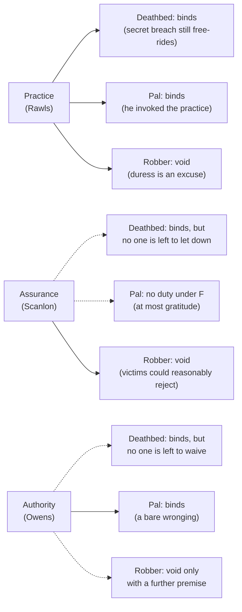

# Philosophy of Debt · Lesson 1.3: Promising after Hume: practice, expectation, authority

> ⏱ ~15 min · Module 1: What is it to owe? · Builds on: [1.2 Hume: promises as artificial obligation](01-02-hume-promises-as-artificial-obligation.md), [ethics 5.2 Contractualism](../../ethics/lessons/05-02-contractualism-what-no-one-could-reasonably-reject.md) · Unlocks: [1.4 Contract, debt and the duty to repay](01-04-contract-debt-and-the-duty-to-repay.md)

## Why this matters

The paper a borrower signs is often called a promissory note. [1.2](01-02-hume-promises-as-artificial-obligation.md) gave Hume's account of why the promise in it binds: a [convention](../reference.md#convention) that serves everyone's interest, backed by sympathy. It ended on a complaint. Hume explains why a defaulter is blamed, not what she owes the person she promised. Three modern accounts answer it. For Rawls a promise is a move in a social practice. For Scanlon it is an assurance deliberately given. For Owens it hands the promisee authority over what you do. On an ordinary loan they agree. They split on cases a lender actually meets: a promise to someone now dead, a repayment promise the lender never believed, and a promise extracted by a threat.

## The idea

Take 1.2's loan again: you borrow 200 dollars and say, "I'll pay you back on Friday." Set aside the debt, which [1.1](01-01-the-grammar-of-owing.md) separated from the promise. What *further* wrong would you do by keeping the money?

- **Practice.** "I promise" works like a bid at bridge: a move that exists only because a shared practice has rules, and the rule says promisers perform unless an accepted excuse applies. You used the practice to get the money, so breaking the promise takes its benefits without doing your part. *Plainly: you cheated at a game you chose to play.*
- **Assurance.** Forget the practice. You deliberately led her to expect the money, knowing she wanted to be able to count on it, and she knew you meant her to. Letting that expectation drop wrongs her. *Plainly: you gave her your word on purpose, then let her down.*
- **Authority.** Your promise gave her a say over what you do on Friday. She may demand the money or let you off, and you may not let yourself off. Breaking it overrides her, whether or not she believed you. *Plainly: it was her call, and you made it for her.*

The answers differ about who is wronged. On the practice view it is, first, everyone whose promise-keeping sustains the practice. On the other two it is the promisee, to whom the obligation is [directed](../reference.md#directed-obligation).

## Source

Hume took the rule that force voids a promise as further evidence that promises are artificial. *Treatise* III.ii.5, the section's last paragraph (Project Gutenberg text):

> If we consider aright of the matter, force is not essentially different from any other motive of hope or fear, which may induce us to engage our word, and lay ourselves under any obligation. A man, dangerously wounded, who promises a competent sum to a surgeon to cure him, would certainly be bound to performance; though the case be not so much different from that of one, who promises a sum to a robber, as to produce so great a difference in our sentiments of morality, if these sentiments were not built entirely on public interest and convenience.

"Competent" means adequate: a proper fee, so price is not the difference. Both men promise out of fear. Hume's evidence is a report of what we feel, an empirical claim: we judge that the surgeon's promise binds and the robber's does not. His conclusion is normative, about the ground: only "public interest and convenience" can draw that line. Every successor faces the test: draw the surgeon–robber line without appeal to public convenience, or concede Hume's point.

## The argument

Contractualism, reloaded from [ethics 5.2](../../ethics/lessons/05-02-contractualism-what-no-one-could-reasonably-reject.md): an act is wrong if principles no one could reasonably reject forbid it.

1. **A promise is a move defined by a practice's rules** (Rawls, "Two Concepts of Rules", 1955, and *A Theory of Justice*, 1971). Saying "I promise to do X" in the right circumstances commits you to X unless an excusing condition holds, and "breaking it would do more good" is not an excuse the practice accepts. *In words:* the rules make the move; you justify the practice by its benefits, never a single promise by its own.
2. **Whoever voluntarily takes the benefits of a just practice must do his part as its rules define it** (Rawls's principle of fairness, 1971). *In words:* breaking a promise is free-riding on everyone who keeps theirs. Premises 1–2 are the [practice view](../reference.md#practice-view).
3. **But a broken promise wrongs the promisee first, not the practice** (Scanlon, "Promises and Practices", 1990). *In words:* the practice view names the wrong victim.
4. **Scanlon's [Principle of Fidelity](../reference.md#principle-of-fidelity) (F) explains the wrong with no practice** (*What We Owe to Each Other*, 1998, ch. 7, paraphrased). If A voluntarily and intentionally leads B to expect that A will do X, knows B wants this assurance, aims to give it and has good reason to think he has, and all this is mutual knowledge, then, absent special justification, A must do X unless B consents otherwise. It passes the contractualist test because promisees have strong reason to want assurance. *In words:* deliberately give someone your word and have her take it, and you owe it to her. No reliance is needed: losses from reliance fall under a separate principle, which a warning or compensation can satisfy, while F demands performance. Scanlon's Guilty Secret shows the gap: you promise an acquaintance not to reveal an embarrassing old episode while you visit his campus. He can do nothing in reliance on the promise, yet breaking it adds a wrong to the hurt.
5. **Yet a promise binds even when the promisee is not assured.** Scanlon's own case: a Profligate Pal, who habitually fails to repay his friends, begs one more loan and sincerely promises to repay. You don't believe him for a moment, but lend out of pity. F is not triggered, and Scanlon accepts that: if the pal owes you anything, it is not under F, and more likely gratitude for a gift politely called a loan. David Owens replies that the pal is bound, and that breaking the promise wrongs you.
6. **So a promise confers authority, not just information** (Owens, *Shaping the Normative Landscape*, 2012). People often want, for its own sake, to be the one who decides what another will do. A promise is a communicated undertaking of an obligation, and it grants that say: the right to require performance or to waive it. Breach is a "bare wronging", a wrong to the promisee even if it sets back none of her other interests. This is the [authority interest](../reference.md#authority-interest).

∴ **If premises 3 and 5 hold, only the authority view explains both that the wrong is done to the promisee and that it survives the absence of assurance.**

Hume's puzzle returns, too. For your word to assure her, she must think you already bound, yet under F you are bound only once she is assured. Scanlon states this circle himself; Kolodny and Wallace ("Promises and Practices Revisited", 2003) argue that his replies fail and that a social practice breaks it.

**Where the argument is weakest.** Premise 5 is a case intuition, and Scanlon rejects it on purpose: the pal gave no assurance, so he broke none. Owens's critics add that social practices may explain what his normative interests are posited to explain. Premise 3 is contested too. Kolodny and Wallace's hybrid keeps the practice as the ground of the obligation and uses assurance to explain why the promisee is wronged, so the pal is bound by fairness but breaks no assurance to you. If a broken promise can involve two wrongs, the conclusion fails.

## Map of positions

Solid: the account reaches the verdict most people give, unaided. Dotted: it denies that verdict or needs a further premise. The Pal verdicts are published ones (the practice view's is Kolodny and Wallace's); the rest apply the accounts, as the worked examples do.

## Worked examples

**Example 1 (clean): the deathbed promise.** Invented. Dying, Rosa asks her son Tom to promise to repay, from his own pocket, the 3,000 dollars she owes a neighbour, which her insolvent estate cannot pay and no court will make Tom pay. He promises, no one else hears, and she dies.

- *Practice.* Bound. Tom used the practice to comfort his mother, and it has no exception for dead promisees. A secret breach would not undermine the practice, but it would still exploit it. Hume's own motor, interest backed by reputation, is idle here, as for 1.2's traveller.
- *Assurance.* F's conditions were met while Rosa lived, and only she could release Tom, so on F's wording the duty stands. The strain is in the rationale: at the moment of breach, nobody's assurance is let down. The contractualist answers from Rosa's standpoint when she asked. A principle freeing promisers once the promisee dies would make assurance to the dying worthless, and the dying could reasonably reject it.
- *Authority.* Rosa's power to demand or waive died with her. The authority theorist replies that the obligation arose when she accepted the promise, and only her waiver could end it. Critics answer that authority nobody can exercise is authority in name only.

All three bind Tom, which is what makes the case clean. The neighbour is only the beneficiary; the promisee is Rosa.

**Example 2 (hard): the surgeon and the robber.** Every account wants the surgeon paid and the robber not, and must meet the Source's test.

- *Practice.* Draws it Hume's way. Our practice counts duress as an excuse, because a practice that enforced extorted promises would pay robbers. The line is only as firm as the practice, though, and Hobbes drew it elsewhere (*Leviathan* ch. XIV, 1651 spelling):

  > And even in Common-wealths, if I be forced to redeem my selfe from a Theefe by promising him mony, I am bound to pay it, till the Civill Law discharge me.

  His reason: the victim gets his life in the bargain.
- *Assurance.* F binds only absent special justification, and the contractualist test supplies one. Potential victims could reasonably reject a principle holding them to promises extracted by threats, and the robber, whose threat is itself a wrong, has no complaint worth weighing. The same test keeps the surgeon's promise: the badly wounded could reject a principle voiding promises made in fear of death, since it would leave them unable to buy help. That answers Hume with reasons weighed person by person, not public convenience.
- *Authority.* Here the view strains. The robber really does want authority over the victim's money, and the victim, as Hobbes saw, has an interest in being able to grant it. To void the promise, an authority theorist needs a further premise: the power to bind oneself holds only where granting authority serves interests worth protecting, and an extorted grant does not. Owens can accept that this echoes Hume, since he holds that the power to promise must be socially recognized to be real.

## Watch out

- **You might think that because promising is a social practice, the practice is what makes breaking a promise wrong.** The first claim is conceptual and historical, the second normative. Owens grants the first and denies the second.
- **You might think Scanlon's verdict means the pal owes nothing.** It means only that his *promise* adds no obligation under F. Whether he owes the money as a debt is [1.1](01-01-the-grammar-of-owing.md)'s question, and Scanlon's suggestion that it was really a gift is a claim about what the transaction was.
- **You might think release separates the views.** All three let the promisee [release](../reference.md#release) the promisor: by the practice's rules, by F's consent clause, by Owens's waiver. None lets the promisor release himself.

## One-liner

> A promise binds because you made a move in a practice, gave someone assurance on purpose, or handed her authority over your act; the deathbed, the disbelieved lender and the robber show what each answer costs.

## Problems

**P1 (🟢) *(Exegetical.)*** Jonah borrows 500 dollars from his sister Mia. For each version, say which of the three accounts (practice, assurance, authority) hold Jonah under a *promissory* obligation to repay by Christmas, and name the feature that decides. One sentence per version.

(a) He writes in his diary, "I promise Mia I'll repay her by Christmas," and never tells her.
(b) He tells her, "I promise I'll repay you by Christmas." She laughs, says she doesn't believe a word of it, and hands over the money anyway.
(c) He makes the same promise, and she believes it. In November she tells him, "Forget Christmas. Pay me when you can."

**P2 (🟡) *(Exegetical.)*** Dana is anxious about moving house on Saturday. To reassure her, her neighbour Eli says: "Stop worrying. I've hired a van for my own move that morning, I'll be done by noon, so you'll have it from then." He sees that she is reassured, and she knows that reassuring her was his aim; all this is mutual knowledge. He never says he promises or undertakes anything: he describes his plans. She had no other arrangements to drop. On Saturday Eli takes the van to the coast instead, and Dana hires one at the usual price.

(a) Using F as premise 4 states it, and Owens's account as premise 6 states it, say whether each binds Eli to let Dana have the van, and why. Two sentences each.
(b) Set Eli beside the Profligate Pal. Name the single premise that divides Scanlon and Owens across the two cases, and say what would move each. 100 words or fewer.

**P3 (🔴, optional) *(Evaluative.)*** Build a case, not in this lesson or in 1.2, in which the practice view (premises 1–2) gives the wrong verdict or picks the wrong victim. Then say whether Kolodny and Wallace's hybrid absorbs it. Any verdict; 150 words or fewer.

Solutions

**P1** *(Exegetical, strict.)*

**Must hit, strict (a)–(c):**
- (a) **None.** Nothing was communicated. The practice's move is made by saying the words to the promisee; F needs Mia to be led to expect and to know Jonah's aim; Owens's promise is a communicated undertaking.
- (b) **Practice and authority, not assurance.** Jonah took the opportunity the practice offers and made its move, so fairness binds him (Kolodny and Wallace's verdict on the pal); his undertaking gave Mia the say whether or not she believed it. F is not triggered because Mia was never assured, which is Scanlon's own verdict on the Profligate Pal.
- (c) **None, as to Christmas.** Mia has released the date. The practice lets the promisee release, F binds only unless B consents, and authority includes the power to waive. The debt survives, now without a date.

**Wrong turns:** binding Jonah in (a) because he sincerely resolved, which is the "willing an obligation" that [1.2](01-02-hume-promises-as-artificial-obligation.md) rejects. Saying the assurance view binds him in (b) because Mia *could* have relied on him: F needs her actually to be assured. Saying (c) cancels the debt.

**Model answer:** (a) No account binds him: a promise must be communicated to the promisee, and a diary entry is not. (b) Practice and authority bind him, since he invoked the practice and gave Mia the say; assurance does not, since she was never assured. (c) No account binds him to Christmas, because the promisee released the date; he still owes her the 500 dollars.

---

**P2** *(Exegetical, strict.)*

**Must hit, strict (a):**
- **F: bound.** Eli voluntarily and intentionally led Dana to expect the van, knew she wanted assurance, aimed to give it and saw that it worked, and all of it was mutual knowledge. A trip to the coast is no special justification, Dana never consented, and F needs neither a promise formula nor reliance.
- **Owens: not bound by any promise.** A promise is a communicated undertaking of an obligation, and Eli communicated plans, not an undertaking, so Dana was given no authority to require the van. Whatever duty he did break, such as care not to mislead her, is not a promissory one.

**Must hit, strict (b):**
- The crux, in any wording that isolates it: what creates the directed obligation of fidelity. Is it successfully giving someone assurance she wants (Scanlon), or declaring an undertaking that gives her authority (Owens)?
- The cases are mirror images. The pal undertook without assuring; Eli assured without undertaking.
- What would move each: firm judgments about such pairs. Scanlon should yield if the pal wrongs the lender as a promise-breaker, not merely as an ingrate. Owens should yield if Eli wrongs Dana exactly as a promise-breaker would. Also acceptable: showing that the circularity worry has no answer short of an undertaking (moves Scanlon), or that the interest in authority for its own sake is posited only to fit the cases (moves Owens).

**Wrong turns:** treating Eli's case as one of reliance, when Dana lost nothing by relying and F does not need reliance. Holding that Owens binds Eli because Dana wanted the van: wanting a performance is not having authority over it. Naming "whether promising is a practice" as the crux, when neither grounds the obligation in fairness to a practice.

**Model answer:** (a) On F, Eli is bound: he deliberately reassured an anxious Dana, knew she wanted it, saw it work, and all of it was mutual knowledge; a trip to the coast is no special justification. On Owens's account he made no promise: he reported plans and undertook nothing, so Dana has no authority to require the van. (b) They divide on what creates the duty: assurance successfully given (Scanlon), or an undertaking that confers authority (Owens). The pal undertook without assuring; Eli assured without undertaking. Scanlon should yield if the pal wrongs the lender as a promise-breaker and not just as an ingrate; Owens should yield if Eli wrongs Dana exactly as a promise-breaker would.

---

**P3** *(Evaluative, any verdict.)*

**Must hit, any verdict:**
- A new case in which premises 1–2 clearly deliver a verdict: say what practice exists, whether it is just, and what the promisor took from it.
- Why that verdict, or its choice of victim, looks wrong, with a reason.
- The hybrid applied: does F supply the missing directed wrong, and does the practice still do any work? Say what the hybrid concedes in absorbing the case.
- A one-line verdict: a counterexample to the practice view as such, or only to premise 2 as the whole ground.

**Wrong turns:** reusing the deathbed, the pal or the robber. Attacking Hume's reputation motive when premise 2 rests on fairness. Offering a secret breach as the counterexample, when premise 2 already condemns exploiting a practice unseen.

**Model answer (one of several):** In a society whose practice voids a woman's promise unless a male guardian confirms it, Ana promises her friend Rui to be at his daughter's wedding. Her guardian refuses to confirm, and she skips the wedding for no reason. By the practice's rules she made no binding promise. Premise 2 cannot rescue it either: it binds only within a just practice, and the just version of this one exists nowhere. Yet Ana plainly wrongs Rui. The hybrid absorbs this. Rui trusted her word anyway, so F applies and names him as the one wronged; only the fairness duty is missing. Verdict: a counterexample to premises 1–2 as the whole ground of promissory obligation, not to the hybrid, which survives by conceding that the wrong that matters here is Scanlon's.

## Flashback

**From Lesson [1.1](01-01-the-grammar-of-owing.md) (The grammar of owing):** *(Exegetical (a) · Evaluative (b).)* Counterexample. An **invented** case: a country's law forbids workers to sell or give away claims to unpaid wages, though anyone may pay the wages on the employer's behalf and the worker may waive them. Leila's employer owes her 1,200 dollars for last month's work.

(a) Check the four marks of a debt: a quantity, a determinate creditor, a claim the creditor can transfer, and discharge by anyone's payment or the creditor's release. Which mark does Leila's claim lack, and what does 1.1's analysis (a directed obligation is a debt if and only if it has all four), read strictly, then say her claim is? **One sentence.**

(b) Is Leila's claim a counterexample to the "only if" half of that analysis, or can a defender absorb it? Give the strongest move for the side you reject, and say whether your verdict carries over to other claims the law forbids selling. **Any verdict; 80 words or fewer.**

Solution

**Must hit, strict (a):** the claim lacks only **transferability**. It is a sum, Leila is a determinate creditor, and anyone's payment or her waiver ends it. Read strictly, the analysis makes it **owed but not a debt**, which is why 1.1's diagram files such claims as a hard case.

**Must hit, any verdict (b):**
- The counterexample at full strength: the employer owes Leila 1,200 dollars in every way that makes debt-talk fit. She can demand the sum, anyone can pay it, and only she can waive it. The law changes who may *hold* the claim, not what is owed.
- The defender's best move, for example: separate a claim that cannot pass to another because of **what is owed** (a promise of your own help to a friend, which no stranger could receive in his place) from one that **the law forbids** selling. A sum is the same to any holder, so Leila's claim is transferable in content, and on that reading it has the mark. Biting the bullet also counts, if the answer says why the power to sell matters to being a debt.
- Whether the verdict carries over to other money claims the law forbids selling. If Leila's claim is absorbed, all of them are, and on the content reading the transferability mark adds little to the quantity mark: say whether that cost is acceptable. If it is a counterexample, all of them are, and the "only if" half must drop the mark or restrict it.
- A one-line verdict with its reason.

**Wrong turns:** calling the claim undirected, when it is owed to Leila and only she can waive it. Treating the ban as a release: it takes nothing from what the employer owes. Counting the risk that the employer never pays as a missing mark: discharge concerns how the claim ends, not whether it will be paid.

**Model answer:** (a) It lacks only transferability, so the analysis, read strictly, classes it as owed but not a debt. (b), one of several: Absorbed. The counterexample's best point is that Leila can demand the sum, take it from anyone and waive it, and the statute limits only who may hold it. Exactly: a promise of my help cannot pass to a stranger because of what is owed, while 1,200 dollars could, and only a statute stops it. Read the mark as transferability in content, and every such claim has it. The cost: so read, it adds little to the quantity mark.

## Connections

- **Backward:** [1.2](01-02-hume-promises-as-artificial-obligation.md) ended on the complaint that Hume explains the blame, not what is owed to the promisee. Premises 3–6 are rival answers, and the Source is the last paragraph of the section 1.2 read. Premise 3 accuses the practice view of losing [1.1](01-01-the-grammar-of-owing.md)'s directed obligation. Scanlon's test is [ethics 5.2](../../ethics/lessons/05-02-contractualism-what-no-one-could-reasonably-reject.md). Ross's fidelity, a self-evident prima facie duty resting on one's own past act, is [ethics 5.3](../../ethics/lessons/05-03-pluralism-and-particularism.md).
- **Forward:** [1.4](01-04-contract-debt-and-the-duty-to-repay.md) asks what a contract adds to a promise, and Boss problem 1 in the [syllabus](../syllabus.md) runs Hume, Scanlon and Owens on a strategic default. [4.1](04-01-the-animal-with-the-right-to-make-promises.md) gives Nietzsche's story of how an animal came to have the right to make promises. [5.1](05-01-forgiving-a-debt-forgiving-a-wrong.md) takes up release, the power Owens puts at the centre of promising.
- **Sideways (the debt thread):** Paul's note of hand to Philemon, written in the legal form of a bond, and the cancelled bond of Colossians 2:14 are read as theology in [`theology-of-debt` 2.4](../../theology-of-debt/lessons/02-04-the-bond-and-the-ransom.md). How a borrower who writes the rules makes his promise believable is [`history-of-debt` 3.2](../../history-of-debt/lessons/03-02-did-1688-make-britain-creditworthy.md), modelled in [`economics-of-debt` 6.3](../../economics-of-debt/lessons/06-03-bulow-rogoff-and-sanctions.md). Owens's authority is a Hohfeldian power over a waivable claim, and the dead promisee troubles it as children and incapacitated adults trouble the will theory of rights ([`philosophy-of-law`](../../philosophy-of-law/syllabus.md) 6.1–6.2). Premise 2 is the fair-play principle of [`political-philosophy`](../../political-philosophy/syllabus.md) 1.3. P2 is a [minimal pair](../../philosophical-method/lessons/03-03-thought-experiments.md) built to [find the crux](../../philosophical-method/lessons/04-03-finding-the-crux.md).
