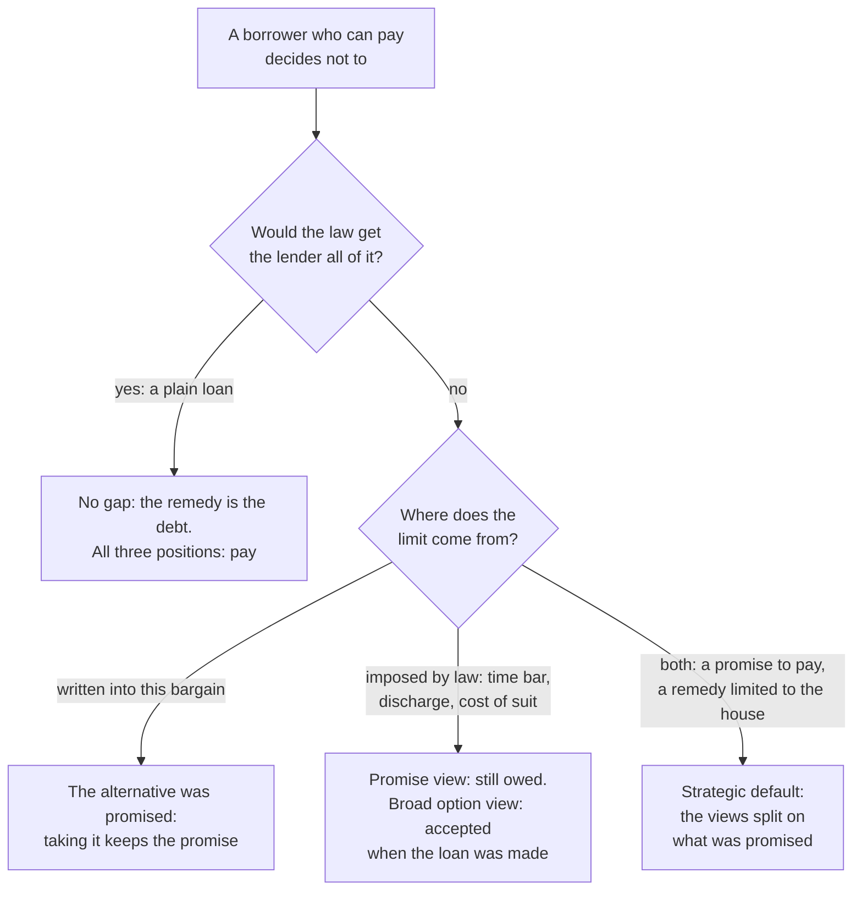

# Philosophy of Debt · Lesson 1.4: Contract, debt and the duty to repay

> ⏱ ~15 min · Module 1: What is it to owe? · Builds on: [1.2 Hume: promises as artificial obligation](01-02-hume-promises-as-artificial-obligation.md), [1.3 Promising after Hume](01-03-promising-after-hume.md) · Unlocks: [2.1 Aristotle: money is barren](02-01-aristotle-money-is-barren.md), [5.3 Bankruptcy as a moral institution](05-03-bankruptcy-as-a-moral-institution.md)

## Why this matters

A loan is a promise, a contract and a debt at once. [1.2](01-02-hume-promises-as-artificial-obligation.md) and [1.3](01-03-promising-after-hume.md) asked why a promise binds. Contract law adds a question of its own, because it puts a price on breaking a contract. If the law will let you walk away for less than you owe, do you still owe the rest? The answer decides whether a solvent homeowner may abandon a loan secured only by the house, whether a firm may break a deal when damages cost less than performing, and whether you owe full face value to a collector who bought your debt for pennies.

## The idea

Three positions on what a signed contract obliges you to do.

- **[Contract as promise](../reference.md#contract-as-promise).** Charles Fried (*Contract as Promise*, 1981) treats the obligation of contract as a special case of the obligation to keep promises: the promises that have acquired legal as well as moral force. By signing, the borrower deliberately invokes the convention of promising ([1.2](01-02-hume-promises-as-artificial-obligation.md)) to give the lender grounds to count on repayment, and breaking it abuses a trust he chose to invite. Expectation damages, the value of the performance, are then the right remedy, because it is fair to make a promise-breaker hand over its equivalent. Paying them remedies the wrong; it does not undo it.
- **[Contract as prediction](../reference.md#prediction-theory).** Oliver Wendell Holmes (1897, the Source) says a legal duty is nothing but a forecast of what a court will make you suffer. At law, a contract gives you an option: perform, or pay damages. Law-and-economics writers from Robert Birmingham to Richard Posner built a policy on it, [efficient breach](../reference.md#efficient-breach): if breaking a contract and paying full damages leaves the promisor better off and the promisee no worse off, the law should not deter it. Daniel Markovits and Alan Schwartz (2011) read the option into the promise itself: a contract backed by expectation damages is a [promise in the alternative](../reference.md#promise-in-the-alternative), so paying is one way of keeping it.
- **[Divergence](../reference.md#divergence-thesis).** Seana Shiffrin ("The Divergence of Contract and Promise", 2007) agrees with Fried about morality: absent the promisee's consent, handing over the cash value does not keep a promise. But American contract law does not track that. It makes damages rather than performance the usual remedy, awards no punitive damages for deliberate breach, and puts the burden of mitigation on the victim. Law should not aim to enforce interpersonal morality as such, she argues, but its rules and their justifications must be ones a virtuous agent could accept, and a rule justified by the economic gains of wrongful breach is not one.

Debt adds a twist. When the promised performance is money, its value *is* the money. A court's remedy for an unpaid loan is the sum due with interest, so "perform or pay" collapses into "pay", and all three positions agree that a solvent borrower owes it all. They part only where the law's remedy falls short of the debt: a loan secured only by collateral, a time bar, a bankruptcy discharge, a claim too small to be worth suing on.

A debt also differs from a bare promise in that it can be sold ([1.1](01-01-the-grammar-of-owing.md)). You cannot sell my promise to help you move house, but you can sell my debt, and I then owe the buyer: [assignment](../reference.md#assignment). A promise view must explain this; the natural answer is that the borrower promised inside a practice of transferable credit. Hamilton argued in 1790 that the public's paper promised payment to its first holder or anyone he sold it to; Madison objected that discount buyers took a windfall, though his plan still paid the full sum, divided differently ([`history-of-debt` 4.1](../../history-of-debt/lessons/04-01-hamiltons-assumption-plan.md)). Selling a claim transfers it; only releasing it ends it.

## Source

Holmes, "The Path of the Law" (*Harvard Law Review* 10, 1897), public domain:

> Nowhere is the confusion between legal and moral ideas more manifest than in the law of contract. … The duty to keep a contract at common law means a prediction that you must pay damages if you do not keep it—and nothing else. If you commit a contract, you are liable to pay a compensatory sum unless the promised event comes to pass, and that is all the difference.

Three phrases fix what kind of claim this is. **"At common law"** makes it a thesis about legal duty, and the paragraph opens by attacking the confusion of legal with moral ideas. **"And nothing else"** is the deflation: no further duty to perform sits behind the liability. **"Commit a contract"** deliberately echoes committing a tort: both are events that make you liable for a compensatory sum. The paragraph then credits the option to Coke: a covenantor intends it to be "at his election either to lose the damages or to make the lease".

The passage does not say that breaking a contract is morally fine. Holmes takes the bad man's view only to isolate the law, and warns his hearers not to take it for cynicism. Whether a legal duty really is a prediction is jurisprudence: H. L. A. Hart replied that judges and citizens use legal rules as standards, and that being obliged differs from having an obligation ([`philosophy-of-law`](../../philosophy-of-law/syllabus.md) 1.2). Here the thesis is taken as a claim about law.

## The argument

**The argument from promise** (Fried's premises, extended to debt; paraphrased).

- **P1. Borrowing includes a promise to repay**, made by invoking the practice of promising.
- **P2. A promise binds whether or not a court will enforce it.** Hume's convention and the practice, assurance and authority accounts of [1.3](01-03-promising-after-hume.md) agree on this, for different reasons.
- **P3. A promise entitles the promisee to the performance, not to a substitute of the promisor's choosing.** This is Fried's view of what a promise gives, and Shiffrin agrees about morality.
- **P4. A limit on what the law will compel is not a [release](../reference.md#release).** Collateral-only remedies, time bars, discharge and the cost of suing limit what a creditor can collect, for reasons of liberty, finality, a fresh start or cost. Only the creditor can release a debt ([1.1](01-01-the-grammar-of-owing.md)).
- **∴ C. A borrower who can repay, and whom the creditor has not released, owes the whole debt, even where the law would let him go for less.** *In words:* the remedy measures what can be taken from you, not what you owe.

**Where the argument is weakest.** P4, for limits both parties could see when the loan was made. The critic reads the option view broadly: a promise's content is fixed by the whole bargain, including the law it was made under. A lender who lends against a house alone, under a rule anyone could read, and charges a higher rate for the chance that the borrower hands over the keys, has sold that chance, and the borrower who takes it performs. On this reading P4 begs the question: whether the borrower promised to repay in full is the point at issue. The defender replies that pricing a risk is not consenting to it: restaurants price in no-shows, yet a diner who books and never comes has still broken his word. And the note itself says the borrower promises to pay. So the dispute is over what fixes a promise's content: the words, or the words plus every rule both sides could foresee.

## Map of positions

## Worked examples

**Example 1 (clean): the café's tables.** An invented case. A furniture maker agrees to build 20 tables for a café for 6,000 dollars. Before delivery a hotel offers 10,000 dollars for them. The café can buy equivalent tables elsewhere for 7,000 dollars, so its expectation damages are $7{,}000 - 6{,}000 = 1{,}000$ dollars. If the maker sells to the hotel and pays up, he nets $10{,}000 - 1{,}000 = 9{,}000$ dollars, 3,000 more than performing. The café still pays a net 6,000 dollars for its tables, and the tables go to the buyer who values them most.

- **Holmes:** the maker's legal duty was the forecast that he would owe about 1,000 dollars if he did not deliver.
- **Efficient breach:** someone gains and no one loses, so the law should not deter this breach with punitive damages or an order to deliver.
- **Fried:** a promise was broken, and the 1,000 dollars is a remedy, not performance. What respects the promise is asking the café for a release. Offer it 2,000 dollars and both gain, the maker 2,000 and the café 1,000. Critics such as Ian Macneil (1982) and Daniel Friedmann (1989) doubt that breach even wins on efficiency. A bought release also gets the tables to the hotel, so breach does not create the 3,000-dollar gain; it decides who keeps it. Defenders answer that bargaining for a release costs time and can fail.
- **Shiffrin:** the law may decline to order delivery for reasons of its own, such as the cost of supervising a reluctant performer. It may not rest that rule on the good of breaking promises.

**Example 2 (hard): the same logic on a loan.** Suppose the café had instead borrowed 6,000 dollars for a year at 8 percent, and can repay the $6{,}000 \times 1.08 = 6{,}480$ dollars. If it does not, a court awards the 6,480 dollars plus interest for the delay. The damages *are* the performance, so non-payment cannot be an efficient breach: whatever the café keeps, the bank loses, and the dispute adds only the cost of the lawsuit. Holmes's option is empty here.

The option reopens only where the remedy stops short, as in [strategic default](../reference.md#strategic-default). Invented figures: a homeowner owes 300,000 dollars on a loan whose only remedy is the house, now worth 200,000 dollars. She can pay but walks away; the lender takes the house and loses $300{,}000 - 200{,}000 = 100{,}000$ dollars against repayment, before foreclosure costs. If the terms named the house as the whole remedy and the rate priced it in, the option view says she performed the second branch. The promise view replies that the note records a promise to repay, and the collateral-only rule only limits compulsion (P4). The tool strains because in some jurisdictions that rule is set by statute, not negotiated, so it is unclear whether it is a term of the deal or a limit imposed from outside: the map's last branch. [`theology-of-debt` 6.3](../../theology-of-debt/lessons/06-03-the-ethics-of-personal-debt.md) sets this dispute from inside the Catholic tradition, and Boss problem 1 in the [syllabus](../syllabus.md) runs Hume, Scanlon and Owens on it.

## Watch out

- **You might think Holmes licenses breach.** His sentence is a conceptual claim about what a legal duty is, not a normative claim about what anyone ought to do. Moving from "the law asks only for damages" to "I owe only damages" slides from one to the other, which is the confusion his own paragraph opens by attacking.
- **You might think efficient breach covers an unpaid debt.** The theory requires full compensation, which for a money debt is the debt itself. Keeping the money puts nothing to better use; it moves wealth from lender to borrower.
- **You might think Shiffrin wants courts to enforce promissory morality.** She denies it. Her target is the reasons given for the divergence, and she accepts distinctively legal ones, such as the burden of supervising a reluctant performer.

## One-liner

> For a money debt the law's remedy is the debt itself, so contract and promise agree that a solvent borrower must pay; they part only where the law stops short, and there everything turns on whether that limit was part of what was promised.

## Problems

**P1 (🟢) *(Exegetical.)*** Three invented debtors, each able to pay. For each, say (i) whether the law would get the creditor all of it, and if not, whether the shortfall was written into the bargain or imposed by law; and (ii) what Fried's promise view says the debtor owes. Two sentences per case.

(a) A restaurant group owes a produce supplier 4,000 dollars on an overdue invoice. Suing would cost the supplier about 3,000 dollars in fees that no court would make the group repay, so the group expects never to be sued.
(b) Omar owes a phone company 900 dollars, nine years overdue. Under the local (invented) law, courts dismiss suits on debts more than six years overdue, but money paid voluntarily on such a debt cannot be reclaimed.
(c) Dev pawns a guitar for 200 dollars. The ticket says he may redeem it within 30 days for 220 dollars or let the shop keep and sell it, and that either way he owes nothing more. The guitar is now worth 150 dollars, and Dev lets it go.

**P2 (🟡) *(Formal (a) · Evaluative (b).)*** Invented figures. A bank sells 1,000 overdue card accounts, each with a balance of 2,000 dollars, to a collector for 4 cents on the dollar. The collector expects 5 percent of the accounts to pay in full, 10 percent to settle for 40 percent of the balance, and the rest to pay nothing. Collecting costs it 25 percent of whatever it collects.

(a) Compute the price, the expected net collections and the expected return on the price. What did the collector pay for any one account, and what multiple of that price is one full payment?
(b) Tomás holds one of the accounts and can pay. He says: "The bank sold my debt for 80 dollars, so I owe the buyer 80 dollars at most." Does he owe the collector 2,000 dollars? Use (a). Any verdict; 150 words or fewer.

**P3 (🔴, optional) *(Exegetical.)*** Two invented commentators on contract law's refusal to award punitive damages for deliberate breach:

- **A:** "Breaking a promise may well be wrong. But contract law exists to make exchange efficient, and punitive damages would deter breaches that move goods to whoever values them most. The morality of breach is not contract law's business."
- **B**, a follower of Shiffrin: "Grant that punitive damages would deter some efficient breaches. A virtuous agent still cannot accept the gains from a wrongful breach as a reason for the law's content."

(a) Name two things A and B agree on. (b) Name the single premise they divide on, and say what argument or evidence could move each. 150 words or fewer.

Solutions

**P1** *(Exegetical, strict.)*

**Must hit, strict:**
- (a) (i) No. A court would award the 4,000 dollars with interest, but the supplier would spend about 3,000 dollars it cannot recover, so the law nets it roughly 1,000. The shortfall comes from the rule leaving each side its own fees: imposed by law, not bargained for. (ii) Promise view: the group owes 4,000 dollars, because a barrier to collection is not a release (P4).
- (b) (i) No: the time bar is a limit imposed by law. (ii) Promise view: Omar owes 900 dollars, because the bar limits what can be compelled and only the creditor can release.
- (c) (i) The shop gets the guitar and nothing more, and nothing more was promised: the limit is written into the bargain. (ii) Promise view: Dev owes nothing, since what he promised was at most "220 dollars or the guitar", and letting it go performs that promise. The promise view and the option view agree here.

**Wrong turns:** letting the unlikelihood of a suit in (a) shrink what the promise view says is owed; calling (a) an efficient breach, when the supplier gets no compensation at all; treating the time bar in (b) as a release on the promise view, when only the broad option view, which counts every foreseeable legal limit as part of the bargain, releases Omar; calling (c) a strategic default that wrongs the shop.

**Model answer:** (a) No: a court would award the full 4,000 dollars if asked, but unrecoverable fees would eat most of it, a shortfall imposed by the rules of litigation. Fried: the group owes all of it, since only the supplier can release it. (b) No: the time bar is imposed by law. Fried: Omar owes the 900 dollars, because a limit on compulsion is not a release, and the rule that voluntary payment cannot be reclaimed shows the law itself treats such a payment as paying a debt. (c) The limit is the bargain's own, since the ticket makes forfeiting the guitar a full alternative. Fried: Dev owes nothing more, because he never promised 220 dollars outright, and giving up the guitar keeps the promise he did make.

---

**P2** *(Formal (a) · Evaluative (b).)*

**Must hit, strict (a):**
- Price: total face $1{,}000 \times 2{,}000 = 2{,}000{,}000$ dollars, so the price is $0.04 \times 2{,}000{,}000 = 80{,}000$ dollars.
- Collections: $0.05 \times 1{,}000 = 50$ full payers, $50 \times 2{,}000 = 100{,}000$ dollars; $0.10 \times 1{,}000 = 100$ settlers at $0.40 \times 2{,}000 = 800$ dollars each, $80{,}000$ dollars. Gross $180{,}000$; costs $0.25 \times 180{,}000 = 45{,}000$; **net $135{,}000$ dollars**.
- Return: $(135{,}000 - 80{,}000)/80{,}000 = 55{,}000/80{,}000 = 0.6875$, **68.75 percent** over the collection period.
- One account cost $0.04 \times 2{,}000 = 80$ dollars. A full payment is $2{,}000/80 = 25$ times that (net of collection costs, $1{,}500/80 = 18.75$ times).

**Must hit, any verdict (b):**
- Say what grounds the debt (a promise to the bank, or only the legal claim) and how it reached the collector: assignment of the bank's claim within a practice of transferable credit, or, if you deny that the moral duty transfers, why not.
- Use (a): the 80 dollars is the price of a chance of payment spread over 1,000 accounts, not a valuation of Tomás's promise. Say whether that matters to what he owes.
- State the strongest objection to your verdict and answer it. If he owes 2,000 dollars, the windfall objection. If he owes less, the objection that a debt would then shrink to its market price, which his own default helped to lower. Say whether your principle generalizes, for example to bonds bought at a discount.

**Wrong turns:** quoting 25 times as the collector's return, when the portfolio return is 68.75 percent; treating the sale as a release, when selling a claim transfers it; treating the windfall objection as settling how much is owed, when Madison's version moved money between claimants without reducing the sum paid.

**Model answer (b), one of several:** He owes the 2,000 dollars. His promise was made to the bank inside a practice of transferable credit, and the collector holds the bank's claim, not a new one; the sale transferred the claim and released nothing. The 80 dollars prices a lottery over 1,000 accounts: the collector expects to net 135 dollars an account, 68.75 percent on its outlay, because most accounts pay nothing. It measures the collector's chance of being paid, not the size of Tomás's promise. The strongest objection is the windfall: why should a buyer who risked 80 dollars collect 2,000? But that objection concerns who should receive the money, as in Madison's 1790 plan, which still paid the full sum. If debts shrank to their market price, every default would cut the defaulter's own debt, and no creditor could sell a doubtful claim.

---

**P3** *(Exegetical, strict.)*

**Must hit, strict (a):** any two of: breaking a promise may be morally wrong (A concedes it, B asserts it); law should not aim to enforce interpersonal morality as such (A: "not contract law's business"; Shiffrin says so explicitly); punitive damages would deter some efficient breaches (B grants it for the argument).

**Must hit, strict (b):**
- **The crux:** whether the reasons for a legal rule must be ones a moral agent could accept without compromising her commitments. A denies it: contract law may pursue efficient exchange as its own end, so the gains from a wrongful breach can count in a rule's favour. B affirms it.
- **What could move A:** an argument that law must be justifiable to those who live under it as moral agents, or evidence that the rule and its rationale erode the habit of keeping one's word on which exchange itself depends.
- **What could move B:** an argument that a legal practice's reasons need satisfy its participants only as participants, or evidence that people keep the legal and moral codes apart without harm to their character.

**Wrong turns:** naming whether efficient breach really is efficient (B grants it); naming whether breach is wrong (A concedes it); naming whether law should enforce morality (both deny it); giving a verdict on punitive damages instead of a crux.

**Model answer:** (a) Both allow that breaking a promise may be wrong, and both deny that contract law should enforce interpersonal morality as such; B even grants the efficiency claim. (b) They divide on whether a legal rule's justification must be acceptable to a moral agent. A lets contract law count a wrongful breach's gains in favour of a rule, because the law has its own end; B says no virtuous agent could accept that reason. A would move if shown that law must be justifiable to people as moral agents, or that treating breach as good business is eroding fidelity. B would move if shown that a practice's reasons need satisfy its participants only as participants, or that people keep the two codes apart without damage to character.

## Flashback

**From Lesson [1.2](01-02-hume-promises-as-artificial-obligation.md) (Hume: promises as artificial obligation):** *(Exegetical (a) · Evaluative (b).)* Close reading. In *Treatise* III.ii.11, "Of the laws of nations", Hume holds that princes are bound to keep their promises, as subjects are: "The same interest produces the same effect in both cases." But dealings between states, though advantageous and sometimes necessary, are neither so necessary nor so advantageous as dealings between individuals. He concludes (Project Gutenberg text):

> Since, therefore, the natural obligation to justice, among different states, is not so strong as among individuals, the moral obligation, which arises from it, must partake of its weakness; and we must necessarily give a greater indulgence to a prince or minister, who deceives another; than to a private gentleman, who breaks his word of honour.

(a) What is the "natural obligation" here, and how does the moral obligation depend on it? Match each to one of the two obligations 1.2 found in Hume's account of promises, and quote the words that fix the dependence. **Two sentences.**

(b) A critic replies: "By the same reasoning, a promise to a stranger you will never deal with again serves less interest than a promise to a neighbour, so it should bind less. Hume must accept that, or say why his scale stops at states." Give Hume's best reply from 1.2's account, and say whether it survives the critic. **Any verdict; 80 words or fewer.**

Solution

**Must hit, strict (a):** the natural obligation is **interest**, the advantage everyone has in the rules of justice being kept (III.ii.2 glosses "the natural obligation to justice" as interest). It is 1.2's **first obligation**. The moral obligation is the **second**: the approval and blame that sympathy with the public interest attaches to keeping and breaking faith. It "arises from" interest and "must partake of its weakness", so its force is proportioned to the interest behind the rule. Princes stay bound; only the force is less.

**Must hit, any verdict (b):**
- Hume's reply from 1.2: disapproval attaches to promise-breaking **as a kind**, and a general rule, once formed, reaches cases where its reason is idle. A promise to a stranger belongs to the kind "private promise", whose interest is at full strength, so it binds fully. Dealings between states are a different kind, with less interest behind the whole of it.
- The critic's rejoinder at full strength: what fixes the kinds? If kinds are sorted by interest, "promises to people you will never meet again" is as much a kind as "treaties", and should bind less.
- A verdict with its reason: can Hume say why the line falls between states and persons rather than inside private promising?

**Wrong turns:** reading "natural obligation" in the sense of III.ii.5, which says that "promises impose no natural obligation", meaning none that exists before convention. Here the phrase names the interest the convention serves. Taking the passage to free princes from their promises: it grants that no one approves a prince who breaks his word of his own accord. Answering (b) by making Hume hold that the stranger's promise binds less: 1.2's traveller is fully bound.

**Model answer:** (a) The natural obligation is interest, the advantage everyone has in promises being kept, which 1.2 called the first obligation; the moral obligation, the approval and blame that sympathy adds, is the second. It "arises from" interest and "must partake of its weakness", so it is only as strong as the interest behind the rule. (b), one of several: Disapproval attaches to kinds through general rules. A promise to a stranger is a private promise, a kind whose interest is at full strength, so it binds fully. The critic asks what fixes the kinds. Hume can answer that private promising exists for dealings between people with no other tie, so promises to strangers cannot be split off without losing what the practice is for. The reply survives.

## Connections

- **Backward:** [1.1](01-01-the-grammar-of-owing.md) gave the marks of a debt: a quantity, a determinate creditor, transferability, discharge by payment or release. The first is why "perform or pay" collapses for loans, the third is why a debt can be sold when a promise cannot, and the last is P4. [1.2](01-02-hume-promises-as-artificial-obligation.md)'s Hume already gave promising a sanction: the promisor who uses the form of words stakes his credit, and if he fails he will never be trusted again. Holmes gave contract a court-imposed sanction, without Hume's second stage, in which a moral sentiment joins interest. [1.3](01-03-promising-after-hume.md) supplies P2. Kant's false promise ([ethics 2.2](../../ethics/lessons/02-02-the-formula-of-universal-law.md)) is a borrower who never meant to repay; this lesson's borrower meant it, and asks what the law's limits change.
- **Forward:** [2.1](02-01-aristotle-money-is-barren.md) turns from what the borrower owes to whether the lender may ask for more than he lent. Release as the creditor's power is [5.1](05-01-forgiving-a-debt-forgiving-a-wrong.md), and the discharge, the largest limit the law imposes, is [5.3](05-03-bankruptcy-as-a-moral-institution.md). Boss problem 1 in the [syllabus](../syllabus.md) reads Holmes's sentence closely and runs Hume's, Scanlon's and Owens's accounts on the strategic defaulter.
- **Sideways (the debt thread):** [`theology-of-debt` 6.3](../../theology-of-debt/lessons/06-03-the-ethics-of-personal-debt.md) answers the same question from inside the Catholic tradition: the Catechism's duty to repay (CCC 2409–2411), and a split within one moral manual over whether a discharge leaves a residue in conscience. [`history-of-debt` 4.1](../../history-of-debt/lessons/04-01-hamiltons-assumption-plan.md) has Hamilton and Madison on paying face value to buyers of discounted paper, [4.2](../../history-of-debt/lessons/04-02-debtors-prisons-and-the-invention-of-bankruptcy.md) the invention of the discharge, and [6.3](../../history-of-debt/lessons/06-03-holdouts-and-the-law-of-sovereign-restructuring.md) holdouts who refuse a sovereign restructuring and sue for face value. [`economics-of-debt`](../../economics-of-debt/syllabus.md) 1.1 derives the fixed-payment debt contract, and its 8.1 treats strategic default as an incentive effect. Hart's reply to Holmes is [`philosophy-of-law`](../../philosophy-of-law/syllabus.md) 1.2; fidelity as a Rossian duty is [ethics 5.3](../../ethics/lessons/05-03-pluralism-and-particularism.md).
