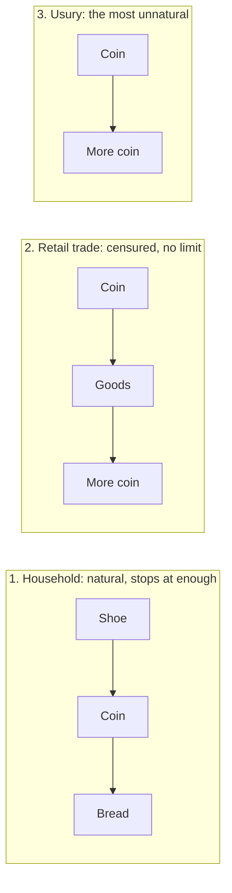

# Philosophy of Debt · Lesson 2.1: Aristotle: money is barren

> ⏱ ~15 min · Module 2: The justice of interest · Builds on: [1.4 Contract, debt and the duty to repay](01-04-contract-debt-and-the-duty-to-repay.md), [`ethics` 4.1 Aristotle: the human good](../../ethics/lessons/04-01-aristotle-the-human-good.md) · Unlocks: [2.2 Aquinas: selling what does not exist](02-02-aquinas-selling-what-does-not-exist.md)

## Why this matters

Module 1 asked whether a borrower must repay. Module 2 asks whether a lender may ask for more. For centuries the philosophical case against it drew on a few lines at the end of *Politics* I.10. Aquinas cites Aristotle for what money is for and for the verdict itself (ST II-II q.78 a.1 and ad 3). Shakespeare's Antonio asks whether Shylock's gold and silver are ewes and rams, hears that Shylock makes it breed as fast, and still calls interest "a breed for barren metal". The argument ends in a superlative: interest is the most unnatural way of getting wealth. This lesson reconstructs it and finds the premise it stands or falls on.

## The idea

Things have uses, and one of them is what the thing is for. A shoe is for wearing. You can also trade it, and that is a use of the shoe too, but a secondary one, since shoes are not made to be bartered (I.9). That is the distinction between [proper and secondary use](../reference.md#proper-and-secondary-use). Money is the odd case, because exchange is exactly what it is for. With that in hand, three ways of getting wealth line up.

- **The household's way.** Farm, herd, fish, and trade the surplus for what you lack. Money sits in the middle of the trade, and the activity stops when the household has enough. The limit is natural, Aristotle argues, because wealth is "a number of instruments" for living, and no art needs unlimited instruments (I.8). He quotes Solon's line that no bound to riches is fixed for man, only to deny it.
- **The trader's way.** Buy to sell dearer. Money now sits at both ends, and nothing in the activity says stop, since more money is always more. Its root is a mistake about life: people "intent upon living only, and not upon living well" want unlimited means because their desires have no limit (I.9).
- **The lender's way.** Money goes out and comes back larger, with no goods in between. The Greek for interest was [*tokos*](../reference.md#tokos), "offspring", as if coins bred like sheep. Aristotle takes the pun seriously.

His terms: household management (*oikonomia*) uses what wealth-getting ([*chrematistike*](../reference.md#chrematistike)) provides (I.8). Wealth-getting then splits in two. The natural kind is part of household management and has a limit. The kind that works by exchange, retail trade and lending at interest, has none (I.9–11).

Behind all this sits an account of money, which *Nicomachean Ethics* V.5 supplies. Shoes and a house can be exchanged only if something makes them commensurable. Money does it by standing in for need (demand), which is what really holds exchange together, and it does so by agreement. Its name, *nomisma*, comes from *nomos*, "law" or "custom". [Money is a convention](../reference.md#money-as-convention) and a measure, not a natural thing.

## Source

*Politics* I.10, 1258a38–b8, in Jowett's translation as revised for the Oxford *Works of Aristotle* (1921):

> There are two sorts of wealth-getting, as I have said; one is a part of household management, the other is retail trade: the former necessary and honourable, while that which consists in exchange is justly censured; for it is unnatural, and a mode by which men gain from one another. The most hated sort, and with the greatest reason, is usury, which makes a gain out of money itself, and not from the natural object of it. For money was intended to be used in exchange, but not to increase at interest. And this term interest, which means the birth of money from money, is applied to the breeding of money because the offspring resembles the parent. Wherefore of all modes of getting wealth this is the most unnatural.

Read three phrases slowly.

- **"Gain from one another."** Retail trade is censured on two counts: its gain does not come from nature, and it comes out of other people. Usury is "the most hated sort" of this exchange-based art, and it adds a third fault.
- **"The natural object of it."** The Greek (*ouk eph' hoper eporisthē*) says only "not from that for which it was provided", in the lesson's translation. "Natural" is the translator's word. The premise concerns a purpose money was *given*, which is why *NE* V.5's convention matters.
- **"The offspring resembles the parent."** The text does not say lent money fails to increase. It says interest makes it increase, which is why the name fits. The charge is that the increase is unnatural, not that it is impossible. "Barren" is the later tradition's word for this: money has no natural power to breed, so its breeding is against nature.

## The argument

**[Aristotle against *tokos*](../reference.md#aristotle-against-tokos)** (*Politics* I.8–10 with *NE* V.5, reconstructed; premise 5 is implicit in "most").

1. **Acquisition is natural when it serves use.** Getting belongs to household management when it supplies what a household or city needs to live well, and that need sets a limit (I.8). *In words:* getting is natural when it is for using, and using says when to stop.
2. **Acquisition for its own sake is unnatural and unlimited.** When accumulation becomes the end, nothing bounds it. Retail trade is like this, and it gains "from one another" rather than from nature (I.9–10). *In words:* once more money is the goal, there is no "enough".
3. **Money exists for exchange.** It was introduced, by convention, to measure goods and carry them between people who need each other's products (I.9; *NE* V.5). *In words:* money is a tool whose job is helping goods change hands.
4. **Usury gains from money itself.** The lender's money comes back increased without being used in exchange, the use it was provided for. Hence the name *tokos*: the increase is money born of money (I.10). *In words:* interest treats a tool for trading as if it were a breeding animal.
5. **Unnaturalness comes in degrees.** Retail trade departs from nature once, in its unlimited end. Usury departs twice: in its end, and in turning money from its own use.

∴ **Of all modes of getting wealth, usury is the most unnatural and the most reasonably hated.**

Premises 1 and 2 concern the purpose of acquisition, premise 3 the nature of money, and premise 4 applies both to the lender. Notice what no premise needs: a claim that the borrower gets less than he gave. The *Ethics* files the lender under character. In *NE* IV.1 those who "lend small sums and at high rates" stand with pimps and gamesters among the mean, who take "more than they ought and from wrong sources". Injustice in the exchange is the charge Aquinas makes central ([2.2](02-02-aquinas-selling-what-does-not-exist.md)).

**Where the argument is weakest.** Premise 4, at the words [gain out of money itself](../reference.md#gain-out-of-money-itself). A critic says a loan *is* an exchange: present money for future money. Aristotle's own list in I.11 files usury under the art "which consists in exchange". If money now is worth more to its holder than the same sum next year, which is the claim [2.3](02-03-justifying-interest.md) tests, then the increase is the price of an exchange, and exchange is what money was provided for. A defender replies that the lender's claim is fixed in money whatever it bought and however it fared. Nothing he receives depends on an exchange or a harvest, so his gain comes from the contract alone, and that is what "out of money itself" means. The dispute is over what counts as money's use, and premise 3 does not settle it.

## The three circuits

Read each row from its right-hand end. Row 1 ends in a thing to use, so need sets the limit. Rows 2 and 3 end in a sum, and a sum can always be larger. Row 3 has also lost its middle, the exchange that is money's job. Marx, who quotes this passage in *Capital* vol. 1 (ch. 5), wrote the rows C–M–C, M–C–M′ and M–M′ ([2.4](02-04-marx-interest-bearing-capital.md)).

## Worked examples

**Example 1 (clean: three Athenians).** Invented. Chremes sells surplus oil and buys a plough. Nikon buys oil at Piraeus to sell dearer in Egypt. Pheidon lends 100 drachmas to a neighbour whose crop failed, for 118 back at next harvest.

- **Chremes:** money used in exchange (premise 3) for a use, and he stops once the farm has its plough (1). Natural.
- **Nikon:** money at both ends, an end with no limit (2), and a gain that comes out of his buyers. Censured, though money still does its job in the middle.
- **Pheidon:** money out, more money back, and no exchange by him in between (4). He departs in end and in means (5): usury, the most unnatural.

Now change Pheidon's terms to 101 drachmas, or make the borrower rich. The verdict does not move. The argument condemns the form of the gain, not its size or its victim. That separates it from the Fathers' charge of cruelty to the needy ([`theology-of-debt` 4.1](../../theology-of-debt/lessons/04-01-the-fathers-against-usury.md)) and from Module 3's arguments about exploitation.

**Example 2 (hard: a loan for ewes).** Invented. Pheidon lends 100 drachmas to a shepherd, who buys ewes, sells the spring lambs, and repays 110. The shepherd's gain is natural by Aristotle's own lights: "the art of getting wealth out of fruits and animals is always natural" (I.10). Does premise 4 still apply to Pheidon? It depends on what "a gain out of money itself" means.

- **Source reading:** the phrase is about where the increase comes from. Here it comes from lambs, reached through two exchanges, so the 10 drachmas are a share of natural increase and premise 4 fails for this loan. Pushed, it fails for nearly every loan, since every borrower repays out of some harvest, wage or trade.
- **Form reading:** the phrase is about the lender's contract. Money goes out, and a fixed larger sum is owed back whether the ewes lamb or die. Pheidon's 10 drachmas never depended on the lambs, so this loan is usury exactly as his first was.

The text fits both readings, and the choice decides the argument's reach. The scholastic tradition drew its line where the form reading does: an investor who shares a venture's gains and losses may share its profit, and a lender owed a fixed sum may not ([`theology-of-debt` 4.5](../../theology-of-debt/lessons/04-05-contracts-that-are-not-loans.md)).

## Watch out

- **You might think the argument says lent money cannot grow.** The Source grants that interest makes it grow; the charge is that the growth is unnatural, since money has no natural power to breed. A deposit that earns interest is an empirical fact the argument already concedes. Keep the empirical claim (money lent comes back larger) apart from the normative one (that increase misuses money).
- **You might think "unnatural" means "against biology".** For a made thing, the natural use is the one it was made for, and *NE* V.5 makes money a convention. So "unnatural" here means turned from the end money was provided for, and the argument is exactly as strong as its claim about money's purpose.
- **You might think the argument is dated because Aristotle knew only coins.** He did picture money as stamped metal (I.9). Odd Langholm (*The Aristotelian Analysis of Usury*, 1984) reads the whole Aristotelian theory of usury as built on money as coin, and on his reading Aquinas's consumptibles argument keeps the idea of sterility but widens it from coin to anything lent by *mutuum*. Whether credit money has a different purpose is still a conceptual question, which the date of a text cannot answer. Lending at interest is also far older than coins ([`history-of-debt` 1.1](../../history-of-debt/lessons/01-01-credit-before-coins.md)).

## One-liner

> Money exists for exchange, so interest, money born of money with no exchange between, is for Aristotle the most unnatural way to get rich; everything turns on whether a loan is itself an exchange.

## Problems

**P1 (🟢) *(Exegetical.)*** An **invented** op-ed paragraph, not the words of any real person:

> "My savings account paid 5 percent last year, so Aristotle was simply wrong that money cannot breed. Anyway, the same Aristotle defended natural slavery, so nothing he said about money deserves a hearing. Charging interest raises no moral question at all."

(a) The first two sentences each rest on a supporting claim. Classify each claim as historical/empirical, conceptual or normative, and say which premise of this lesson's reconstruction it touches, if any. (b) Name the step the op-ed skips to reach its last sentence. **One sentence per claim in (a); one sentence for (b).**

**P2 (🟡) *(Exegetical (a) · Evaluative (b).)*** *Nicomachean Ethics* V.5, 1133a26–31 and 1133b10–13 (Ross; Greek words transliterated):

> Now this unit is in truth demand, which holds all things together (for if men did not need one another's goods at all, or did not need them equally, there would be either no exchange or not the same exchange); but money has become by convention a sort of representative of demand; and this is why it has the name 'money' (*nomisma*)—because it exists not by nature but by law (*nomos*) and it is in our power to change it and make it useless. … And for the future exchange—that if we do not need a thing now we shall have it if ever we do need it—money is as it were our surety; for it must be possible for us to get what we want by bringing the money.

(a) Which words say what money *is*, and which say where it *comes from*? What does the second answer imply about the kind of "nature" premise 3 appeals to? **Two sentences.**
(b) The critic of premise 4 says a loan is itself an exchange of present money for future money. Which sentence here gives that critic the most support from Aristotle himself? Does it defeat premise 4? Give the defender's best reply either way. **Any verdict; 150 words or fewer.**

**P3 (🔴, optional) *(Exegetical (a) · Evaluative (b).)*** Invented. Kleo, a widow with 2,000 drachmas and no land, lends at interest to merchants she knows. She spends the interest on food and on her daughters' dowries, and she stops lending once the dowries are paid.

(a) Which premises of the reconstruction apply to her lending, and which do not? Take premise 4 on Example 2's form reading. **Two sentences.**
(b) Is she a counterexample to the argument's conclusion, or can a defender absorb her? Say where the argument stops determining a verdict. **Any verdict; 150 words or fewer.**

Solutions

**P1** *(Exegetical — strict.)*

**Must hit, strict (a):**
- **Sentence 1** rests on an **empirical** claim (the account paid 5 percent). It touches **no premise**. The Source grants that interest makes money increase, "the birth of money from money"; what it denies is that the increase is natural, which is a normative claim about money's use. The op-ed refutes a thesis Aristotle never held.
- **Sentence 2** rests on a **historical** claim, and a true one: *Politics* I defends natural slavery ([`history-of-political-thought` 1.3](../../history-of-political-thought/lessons/01-03-aristotle-the-city-exists-by-nature.md)). It also touches **no premise**. It is a claim about the author, and premises 1–4 stand or fall on their own. An ad hominem is irrelevant when the claim rests on an argument you can inspect for yourself ([`philosophical-method` 2.3](../../philosophical-method/lessons/02-03-informal-fallacies-and-when-they-arent.md)).

**Must hit, strict (b):** even if Aristotle's argument failed, "no moral question at all" would not follow. Refuting one argument does not settle a question that other arguments address: Aquinas's charge of injustice in exchange ([2.2](02-02-aquinas-selling-what-does-not-exist.md)), exploitation (Module 3). And the op-ed never reaches the argument's real crux, premise 4.

**Wrong turns:** treating sentence 1 as a counterexample to premise 3 or 4. Money that comes back larger is exactly what premise 4 describes. Calling the slavery claim false: it is true, and the problem is that it is irrelevant. Classifying "money cannot breed" as Aristotle's empirical thesis.

**Model answer:** (a) Sentence 1 is empirical and touches no premise, because Aristotle grants that lent money grows and objects only that the growth is unnatural. Sentence 2 is historical and true, but it attacks the author, so it too leaves every premise standing. (b) It skips from the failure of one argument to the failure of all, ignoring the injustice and exploitation arguments that do not depend on Aristotle at all.

---

**P2** *(Exegetical (a) — strict · Evaluative (b) — any verdict.)*

**Must hit, strict (a):** what money **is**: "a sort of representative of demand", and "our surety" for future exchange. Where it **comes from**: "by convention", "not by nature but by law (*nomos*)", and "it is in our power to change it and make it useless". So the "nature" premise 3 appeals to is an **instituted purpose**, not a physical nature, and "unnatural" in I.10 must mean contrary to the use money was given. That fits the Greek's "that for which it was provided".

**Must hit, any verdict (b):**
- The **surety sentence**, identified, and what it adds: bridging time is part of money's exchange job, since money keeps for its holder the power to "get what we want" later.
- **Run on premise 4:** if carrying that power across time is part of money's use, a lender who hands it over for a year uses money for its function, and the increase reads as the price of an exchange, not a gain "out of money itself".
- **The defender's reply at strength**, e.g. the surety is what money does for whoever holds it, not a service the lender renders. The borrower gets the surety with the money; the lender gets an equal surety back; so the extra pays for nothing he handed over.
- A **verdict** with a reason.

**Wrong turns:** picking the "not by nature but by law" sentence for (b). It bears on what kind of purpose premise 3 names, not on whether a loan is an exchange. Reading the surety sentence as Aristotle endorsing interest: it describes the holder's future purchases, and he draws no conclusion about lending. Giving a verdict with no reply.

**Model answer (b), one of several:** The surety sentence helps the critic most. Money lets its holder get what he wants later, so bridging time is part of its exchange function. A loan then trades present purchasing power for future purchasing power, and a premium is the price of that trade, which is money's own use; premise 4's "out of money itself" fails. The defender replies that the sentence says what money does for whoever holds it. Once lent, the money and its surety are the borrower's to use. The lender gets back an equal surety, so the extra pays for nothing he still had to give. That reply saves premise 4 only by assuming what a lender hands over, which is exactly what [2.2](02-02-aquinas-selling-what-does-not-exist.md) and [2.3](02-03-justifying-interest.md) dispute. Verdict: the sentence weakens premise 4 without defeating it.

---

**P3** *(Exegetical (a) — strict · Evaluative (b) — any verdict.)*

**Must hit, strict (a):** **premise 4 applies** (with premise 3 behind it): she is owed more money than she lent, fixed whatever the merchants do with it, so her gain is money from money, and she makes premise 5's departure in means. **Premise 2 does not apply**: her getting serves the household's use (food, dowries) and stops at a limit, which is premise 1's mark of natural acquisition.

**Must hit, any verdict (b):**
- **The structure:** her case separates the *mode* of gain (money from money) from the *end* (unlimited accumulation), two things premise 5 lets travel together in usury.
- **Either** absorb her (the conclusion ranks a mode of getting wealth, not a motive, so she pursues a natural end by the most unnatural means) **or** treat her as a counterexample (with premise 2 idle, the whole condemnation rests on premise 4, the contested premise).
- **Where it stops:** whether "most unnatural" is a verdict on the lender or only on the practice. *NE* IV.1 blames the "sordid love of gain", which she lacks, and neither text ranks a lender whose aim is limited.
- A **verdict** with a reason.

**Wrong turns:** clearing her because her borrowers are merchants or her rate is modest. The argument ignores rate and need (Example 1). Saying premise 1 condemns her, when her aim is exactly the limited, household aim premise 1 approves.

**Model answer (b), one of several:** Kleo pulls apart what premise 5 lets travel together, the unlimited end and the unnatural means. A defender absorbs her: the conclusion ranks modes of getting wealth, and hers is still money born of money. She pursues a natural end by the most unnatural means, as a household might pay for bread out of retail profits. That keeps the conclusion but changes what it condemns: a practice, not a vice. Then the critic's point bites. With premise 2 idle, the whole weight sits on premise 4, and the *Ethics*' charge of sordid love of gain does not reach her at all. The argument stops at a question it never asks: is "most unnatural" a verdict on her, or only on the circuit she uses? Verdict: absorbed, but only by making the argument about the form of a contract rather than the character of a lender.

## Flashback

**From Lesson [1.3](01-03-promising-after-hume.md) (Promising after Hume: practice, expectation, authority):** *(Exegetical (a) · Evaluative (b).)* Apply to a new case. An **invented** case: Marta borrows 800 dollars from her friend Paulo, who asks when he will have it back. "I promise I'll repay you on 1 May," she says, and he believes her. On 30 April a storm wrecks a neighbour's roof. The neighbour cannot pay for the repair, 800 dollars would cover it, and Paulo, who is comfortable, would not miss his money for months. Without asking Paulo, Marta pays the roofer and repays him in July.

(a) On each of the three accounts (practice, after Rawls; assurance, Scanlon's Principle of Fidelity; authority, after Owens), did her promise bind her to repay on 1 May despite the good she did? Name the feature of each account that decides. **One sentence per account.**

(b) Change one fact: that day, the 800 dollars would pay for treatment that saves a stranger's life, and Paulo cannot be reached. On the account you find strongest, is Paulo wronged? Say what that answer costs the account. **Any verdict; 80 words or fewer.**

Solution

**Must hit, strict (a):**
- **Practice: bound.** The practice's rules fix the excuses, and "breaking it would do more good" is not among them: the practice is justified by its benefits, a single promise never by its own. She used the practice to get the loan, so breaking the promise free-rides on everyone who keeps theirs.
- **Assurance: bound.** She deliberately assured Paulo, who wanted the assurance and got it, and he never consented otherwise. The roof is no special justification: promisees could reasonably reject a principle letting promisors break their word whenever they judge the money better spent, since it would make assurance worthless. No reliance or loss is needed.
- **Authority: bound.** The date was Paulo's call, and only he could waive it. She made the call for him, which wrongs him whatever he loses.

**Must hit, any verdict (b):**
- The chosen account run on the new fact. *Practice:* no breach if preventing grave harm is among the practice's excuses. *Assurance:* saving a life is special justification, since promisees could not reasonably reject a principle allowing breach to save a life when they cannot be asked and lose little, set against the stranger's reason to want it; so there is no wrong. *Authority:* the call was Paulo's and she made it, so the account finds a bare wronging, justified but real.
- The cost, stated. The practice view's verdict is only as firm as the practice's list of excuses. The assurance view must say where, between the roof and the life, special justification begins. The authority view must accept justified wrongs that leave something owed, such as an apology, or else limit the authority a promise confers.
- A one-line verdict.

**Wrong turns:** excusing Marta on the practice view because breaking the promise did more good, an excuse the practice expressly rules out. Letting the assurance view off because Paulo lost nothing: it needs no reliance. Saying the debt lapsed: she owes the 800 dollars throughout, and only the date is in question. Treating the verdicts in (a) as settling (b).

**Model answer:** (a) Practice: bound, because the practice decides what excuses a breach, and "more good elsewhere" is not on its list. Assurance: bound, because she gave Paulo an assurance he wanted, he never released her, and promisees could reasonably reject a rule letting promisors break their word for better causes. Authority: bound, because the date was Paulo's to waive, and she waived it for him. (b), one of several: On the authority account Paulo is wronged, though Marta was right to act. The date was his call and she made it: a bare wronging, justified by the life but not erased, so she owes him an explanation and an apology as well as the money. The cost is admitting justified wrongs. The alternative, that a promise gives no authority in emergencies, needs a limit the promisee never set.

## Connections

- **Backward:** [1.4](01-04-contract-debt-and-the-duty-to-repay.md) asked whether a borrower must repay. Aristotle's case against the lender never mentions that duty; it is about what money is for. [`ethics` 4.1](../../ethics/lessons/04-01-aristotle-the-human-good.md) supplies living well, the end that sets premise 1's limit, and [4.2](../../ethics/lessons/04-02-aristotle-virtue-and-practical-wisdom.md) gives liberality, the virtue whose treatment in *NE* IV.1 files the petty lender among the mean. [`history-of-political-thought` 1.3](../../history-of-political-thought/lessons/01-03-aristotle-the-city-exists-by-nature.md) builds the household and city that *Politics* I.8–10 equips.
- **Forward:** [2.2](02-02-aquinas-selling-what-does-not-exist.md) turns money's being for exchange into the claim that its use is its spending, and makes the charge injustice. [2.3](02-03-justifying-interest.md) builds the critic's case that a loan is an exchange across time. [2.4](02-04-marx-interest-bearing-capital.md) takes up Marx's M–M′, the form for which he cited this passage. [3.1](03-01-what-exploitation-is.md) asks what an argument blind to the rate cannot: whether the terms themselves are unfair. Antonio's bond with Shylock is [3.3](03-03-what-may-be-pledged.md)'s case.
- **Sideways (the debt thread):** [`history-of-debt` 1.1](../../history-of-debt/lessons/01-01-credit-before-coins.md) pairs *tokos* with the Sumerian *máš*, "young goat", and shows interest-bearing credit long before coins. *Politics* I.8 quotes Solon on unbounded riches only to deny it; Solon the debt reformer is [`history-of-debt` 1.4](../../history-of-debt/lessons/01-04-solons-shaking-off-of-burdens.md). In [`theology-of-debt`](../../theology-of-debt/syllabus.md), [4.1](../../theology-of-debt/lessons/04-01-the-fathers-against-usury.md) has Basil's *tokos* pun and the Fathers' charge of cruelty rather than sterility, [4.3](../../theology-of-debt/lessons/04-03-aquinas-on-usury-ii-ii-q78.md) reads q.78, which cites both of this lesson's texts, and [5.4](../../theology-of-debt/lessons/05-04-did-the-usury-doctrine-change.md) asks whether the principle that a loan as such is barren survived the doctrine's development. Why lenders prefer the fixed claim of Example 2's form reading to a share of the flock is [`economics-of-debt` 1.1](../../economics-of-debt/lessons/01-01-costly-state-verification.md): the standard debt contract derived from the cost of verifying what the borrower earned.
