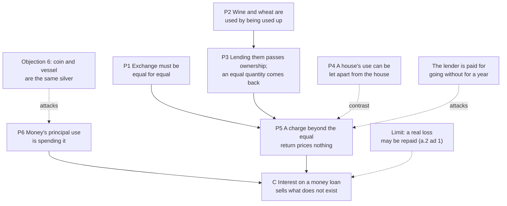

# Philosophy of Debt · Lesson 2.2: Aquinas: selling what does not exist

> ⏱ ~15 min · Module 2: The justice of interest · Builds on: [2.1 Aristotle: money is barren](02-01-aristotle-money-is-barren.md) · Unlocks: [2.3 Justifying interest: time, abstinence, opportunity](02-03-justifying-interest.md), [2.4 Marx: interest-bearing capital](02-04-marx-interest-bearing-capital.md)

## Why this matters

Aristotle called gain from money itself the most unnatural way to get wealth ([2.1](02-01-aristotle-money-is-barren.md)). Thomas Aquinas made a sharper charge in the *Summa Theologiae*, II-II q.78 a.1: a lender who asks back more than he lent is paid for nothing, so the charge is *unjust*, at any rate and from any borrower. It became the schools' standard argument against interest for centuries, and it explains why rent can be just when interest is not, using a distinction everyone already draws. It also poses the question every defender of interest in [2.3](02-03-justifying-interest.md) must answer: what does a lender sell? The doctrine built on q.78, with its authority and history, belongs to `theology-of-debt`: [4.3](../../theology-of-debt/lessons/04-03-aquinas-on-usury-ii-ii-q78.md) reads the question as teaching, and [5.4](../../theology-of-debt/lessons/05-04-did-the-usury-doctrine-change.md) asks whether the teaching changed. Here it is tested as philosophy.

## The idea

Lend a neighbour your flat for a month and you may charge rent. The flat comes back. What you sold was its use, and you kept the flat.

Lend her a cup of sugar and something different happens. Sugar's only use is to be eaten, so handing over its use *is* handing over the sugar. It becomes hers, and what comes back is not your sugar but an equal cup. That cup repays everything you gave. Ask for a spoonful more "for the use" and you are charging either for the sugar a second time or for a use that never existed apart from it.

Aquinas's claim is that money is sugar, not a flat. Coins are not eaten, but their use is to be spent, and once you use money it is gone from you. So a loan of money hands the money over, an equal sum repays it, and interest is a price for nothing.

The wrong is not cruelty to the poor but a broken equality in an exchange, so it would hold if the borrower were a millionaire. The test is twofold: is money really like sugar, and has the argument assumed the answer to the question it claims to settle?

## Source

ST II-II q.78 a.1, the body (English Dominican Province translation, 1920). The thesis, then the premise that brings money in:

> "To take usury for money lent is unjust in itself, because this is to sell what does not exist, and this evidently leads to inequality which is contrary to justice. … Now money, according to the Philosopher (Ethic. v, 5; Polit. i, 3) was invented chiefly for the purpose of exchange: and consequently the proper and principal use of money is its consumption or alienation whereby it is sunk in exchange."

Three phrases do the work. **"Unjust in itself"**: the wrong lies in the exchange, whatever the rate, the borrower's need or the lender's motive. **"Sell what does not exist"**: the conclusion has the shape of a sale with no object. **"Proper and principal use … alienation"**: money counts as a consumable not because coins are destroyed (a coin can circulate for decades) but because using money means parting with it. That premise is about what money is *for*, borrowed from Aristotle, and it is where the argument gets tested. "Principal" leaves room for other uses, and Aquinas uses that room himself ([proper and secondary use](../reference.md#proper-and-secondary-use); see P1).

## The argument

The [consumptibles argument](../reference.md#consumptibles-argument), reconstructed from a.1 and its replies (the numbering is this lesson's):

**P1.** Justice in exchange requires equality: a lender is repaid justly if he is repaid as much as he lent, and no more ([commutative justice](../reference.md#commutative-justice); a.1 ad 5).

**P2.** Some things are used by being used up: we drink wine and eat wheat. In such things the use cannot be counted apart from the thing ([consumptibles](../reference.md#consumptibles)).

**P3.** So whoever is granted the use of such a thing is granted the thing. Lending it transfers ownership, and the borrower returns not the same thing but an equal quantity of the same kind. This is the Roman loan for consumption, the [*mutuum*](../reference.md#mutuum) (Justinian, *Institutes* III.14), and the borrower bears the risk: if the wheat burns, he still owes wheat (a.2 ad 5; *Institutes* III.14.2). *In words:* lending sugar is giving sugar, with a promise of equal sugar back.

**P4.** Where use is not consumption, as with a house, use and ownership can be split: the owner may sell the use (rent) and reclaim the thing.

**P5.** In a *mutuum* the equal return pays for everything handed over. A further charge "for the use" prices either the thing again (selling it twice) or a use existing apart from the thing, and no such use exists. *In words:* there is no second item on the invoice.

**P6.** Money was invented for exchange, so its proper and principal use is its alienation in exchange. *In words:* spending is to money what drinking is to wine.

**∴ C.** A loan of money is a *mutuum*, and taking payment for its use (usury) sells what does not exist and breaks the equality of exchange. It is unjust in itself, and what was taken must be restored. *In words:* interest is a price with nothing behind it.

**What it does not forbid.** The target is a price *for the loan*. By Aquinas's own replies, a lender may agree to be compensated for a loss the loan actually causes him, but not for a profit he might have made, since that would sell what he does not yet have (a.2 ad 1). An investor who keeps ownership and risk may share a merchant's profits (a.2 ad 5). Loss incurred and profit forgone became two of the later [extrinsic titles](../reference.md#extrinsic-titles) ([`theology-of-debt` 4.4](../../theology-of-debt/lessons/04-04-the-extrinsic-titles.md)), and partnership leads to the contracts that are not loans ([4.5](../../theology-of-debt/lessons/04-05-contracts-that-are-not-loans.md)). So the argument is not hostile to gain from money; its whole weight falls on one contract.

**The sale of time.** An older argument, usually traced to William of Auxerre's *Summa aurea* early in the thirteenth century, held that the usurer sells time, which is common to every creature and so no one's to sell ([sale of time](../reference.md#sale-of-time)). It is not q.78's argument. There time enters only in a.2 ad 7, where raising a price because payment will come later counts as charging for a loan.

**Where the argument is weakest.** Critics attack two premises. P6 is functional, not physical. Objection 6 notes that coin silver and vessel silver are one metal, and Aquinas answers only by appeal to money's *principal* use. The Roman text he cites for the category (a.1 ad 3) counts coin among things consumed by use only with a hedge: "and perhaps we may also say coined money" (*Institutes* II.4.2, Moyle). The deeper attack is on P5. It counts two things a lender might sell, the money and its use, and finds the second empty. The critic says the lender sells neither: she is paid for going without her money for a year while the borrower has it. P5 excludes that third thing only by assuming that a loan transfers nothing but a quantity, which is the very question at issue. That is the charge of [begging the question](../../philosophical-method/lessons/02-03-informal-fallacies-and-when-they-arent.md). Defenders answer that going without is an absence, not something the lender owns, and that where it causes a real loss, equality itself (P1) allows repayment.

## Argument map

## Worked examples

**Example 1 (clean: one lender, three loans).** Rosa lends a neighbour her van for a month at 400 dollars. She lends a second neighbour 50 litres of diesel, to be repaid with 55. She lends her brother 2,000 dollars for a year, to be repaid with 2,100.

- **The van.** Driving it leaves it standing (P4). Rosa keeps ownership, and if it is stolen through no fault of the borrower, the loss is hers. The 400 dollars buys a use she still owns: rent, **lawful**.
- **The diesel.** It is burnt in the using (P2), so the loan passed ownership (P3). Fifty litres back repay everything she handed over, and the extra 5 litres, 10 percent, price nothing (P5): **usury**.
- **The cash.** By P6 money sides with the diesel, so the extra 100 dollars (5 percent) is **usury**. It would be at 1 percent or at 50, to a pauper or to a bank (C).

One refinement. The van wears with every kilometre, so "not used up" cannot mean "untouched". Read charitably, the line is the Roman one: a loan for use returns the very thing lent (*Institutes* III.14.2), a *mutuum* only its equivalent, and only where the same thing comes back can ownership stay with the lender.

**Example 2 (hard: "I charge for the year").** Nadia lends Omar 1,000 dollars for a year and asks for 1,040 back. "I charge nothing for the money or for its use," she says. "I charge for the year I go without it."

- **The sale-of-time reply** says the year is not hers to sell. But that proves too much, because her landlord also charges by the year. Unless it adds that the landlord sells the use of a flat, with time only measuring it, it condemns rent along with interest.
- **The consumptibles reply** adds exactly that, which is why it survives the rent objection. The landlord sells a use she still owns. Once the 1,000 dollars passed to Omar, Nadia owns only a claim to 1,000 dollars; the money, and the risk of losing it, are his (P3). Her going-without is the absence of a thing, and a price for it prices nothing (P5). A real loss the absence causes, say a 25 dollar overdraft fee, she may recover (a.2 ad 1); a return she might have earned elsewhere, she may not.
- **Where it strains.** Nadia presses the parallel: her landlord is also paid for going without, and Nadia's claim persists all year just as the flat does. And she, not Omar, bears the risk that he never repays. The defender answers that the flat persists *in the landlord's ownership*: she lets a use of her own thing, while Nadia owns no thing whose use Omar has. A real risk to the principal, later moralists added, is a separate title ([`theology-of-debt` 4.4](../../theology-of-debt/lessons/04-04-the-extrinsic-titles.md)). The critic answers that going without is a cost to the lender whether or not it shows up as a fee. The dispute is now one question: whether giving up the present use of money is something a person can sell. That is where [2.3](02-03-justifying-interest.md) begins.

## Watch out

- **You might think the argument fell when practice moved on.** That interest became legal and ordinary is a *historical* claim. Whether a charge on a *mutuum* prices anything is a *conceptual* claim, and whether it is unjust a *normative* one. A common practice can still be unjust. Nor does the later admission of profit forgone ([`theology-of-debt` 4.4](../../theology-of-debt/lessons/04-04-the-extrinsic-titles.md)) show by itself that P5 or P6 is false.
- **You might think it condemns only steep rates or loans to the poor.** Its ground is equality in exchange, not harm, so it condemns any agreed surplus on a *mutuum*, even at 1 percent to a rich borrower. Taking unfair advantage of need is a different charge, exploitation, and [3.1](03-01-what-exploitation-is.md) keeps the two apart.
- **You might think "consumptible" means destroyed.** Coins outlive their spending. P6 claims that using money means parting with it, a claim about what money is *for*, so a case where money is used without being parted with tests P6 directly.

## One-liner

> A loan of money hands over the money, so an equal sum repays it and interest sells nothing; the argument stands or falls on whether spending is money's use and whether going without is something a lender can sell.

## Problems

**P1 (🟢) *(Exegetical.)*** Objection 6 of a.1 argued that coined silver and silver made into a vessel are the same metal, and one may charge for the loan of a silver vessel, so one may charge for the loan of coins. Aquinas replies (a.1 ad 6):

> The principal use of a silver vessel is not its consumption, and so one may lawfully sell its use while retaining one's ownership of it. On the other hand the principal use of silver money is sinking it in exchange, so that it is not lawful to sell its use and at the same time expect the restitution of the amount lent. It must be observed, however, that the secondary use of silver vessels may be an exchange, and such use may not be lawfully sold. [In] like manner there may be some secondary use of silver money; for instance, a man might lend coins for show, or to be used as security.

(a) Does the reply locate the line between a lawful and an unlawful charge in the *object* lent (coin or vessel) or in the *use* lent? Name the words that decide it. (b) An invented case: a film studio borrows 20,000 dollars in banknotes from a collector as props for a two-week heist shoot and pays a fee of 300 dollars. The contract lists the serial numbers, and the same notes must come back. What does ad 6 imply about the fee? Then change one term of the contract so that, on Aquinas's reasoning, the same fee becomes usury. **Two sentences per part.**

**P2 (🟡) *(Exegetical (a) · Evaluative (b).)*** An invented case. A pension fund lends 1,000 shares of a listed company to a trader for 90 days, for a fee of 150 dollars. The trader sells them at once, hoping to buy them back more cheaply before the return date. The contract makes the trader owner of the shares until he delivers 1,000 shares of the same company back.

(a) Run a.1 and ad 6 (quoted in P1) on the fee. Is a share a consumptible? Does ownership pass? What use is being paid for, and what verdict follows on Aquinas's reasoning? **Four sentences or fewer.**
(b) A critic compares a second loan: the trader borrows the shares only to pledge them as security for 90 days, returning the very same shares, for the same fee. "On ad 6 that fee is lawful and this one is usury. But the fund's position is identical: it gets 1,000 of the company's shares back on day 90 and bears the same risk that the trader defaults. A principle that condemns one fee and allows the other has put the injustice in the wrong place." Assess the objection. Any verdict; **150 words or fewer.**

**P3 (🔴) *(Exegetical (a) · Evaluative (b).)*** An **invented** online comment, not the words of any real person:

> "Aquinas's usury argument is a textbook circle. His key premise is that a loan of money transfers ownership to the borrower. But that just *is* the claim that the lender has nothing left to charge for. He assumed his conclusion."

(a) The comment aims at the wrong premise. Say which premise it attacks, why that premise does not beg the question against a defender of interest, and which step is the real target. **Three sentences or fewer.**
(b) Using the audience test of [`philosophical-method` 2.3](../../philosophical-method/lessons/02-03-informal-fallacies-and-when-they-arent.md), say against whom the real target begs the question, if anyone. Then give the best reply open to a defender of a.1, and say in one line whether it works. Any verdict; **150 words or fewer.**

Solutions

**P1** *(Exegetical — strict.)*

**Must hit, strict (a):**
- The **use**, not the object. The deciding words are "the secondary use of silver vessels may be an exchange, and such use may not be lawfully sold": one object, a vessel, has a use that may be sold and a use that may not.
- "[In] like manner there may be some secondary use of silver money", "for show, or to be used as security": coins lent for a use other than exchange stand where the rented vessel stands. The object's *principal* use only fixes the default case.
- Aquinas never denies the objection's premise that the metal is the same. He moves the question from the metal to the use.

**Must hit, strict (b):**
- The fee is **lawful** on ad 6. Display is a secondary use in which the money is not sunk in exchange, and the collector keeps ownership (the very notes return), so this is letting, not a *mutuum*.
- The change must touch the **use or the return**: let the studio spend the notes and repay any 20,000 dollars. Then the use granted is exchange, ownership passes, and the 300 dollars becomes a price for the use of money lent.

**Wrong turns:** calling the fee usury because "money is always consumed", which is exactly what ad 6 denies. Changing the size of the fee or adding a deposit: the rate is irrelevant to a.1, and only the use lent and what must come back decide. Reading "secondary use of silver money" as a further prohibition, when the parallel with the vessel runs the other way.

**Model answer:** (a) The reply draws the line by the use lent: the same vessel has a use that may be sold and an exchange use that "may not be lawfully sold", and "[in] like manner" coins have non-exchange uses, "for show, or to be used as security". The object's principal use only sets the default. (b) The fee is lawful, since the notes are lent for show rather than sunk in exchange and the collector keeps ownership of the very notes, so this is a letting. Let the studio spend them and repay any 20,000 dollars, and ownership passes, the use lent is exchange, and the same 300 dollars is usury.

---

**P2** *(Exegetical (a) — strict · Evaluative (b) — any verdict.)*

**Must hit, strict (a):**
- A share is **not a consumptible** in a.1's sense. Its principal use to an owner, holding it for its income and votes, does not use it up, so like the house or the vessel its use could be let while the fund keeps ownership.
- **Ownership passes** here, and must, because the use the trader wants is to sell the shares: exchange.
- The fee prices an **exchange use**, the use ad 6 says "may not be lawfully sold" even of a thing whose principal use is not consumption. After the sale the fund holds only a claim to 1,000 equivalent shares, which is the *mutuum*'s structure (P3, P5).
- **Verdict:** on Aquinas's reasoning the 150 dollars is usury. Reaching it by treating shares as fungibles lent in kind is acceptable if the answer says why ownership passes.

**Must hit, any verdict (b):**
- **The principle stated precisely:** a charge is just only if it prices a use the lender still owns apart from the thing, and an exchange use cannot be had apart from ownership.
- **Run on both loans:** the pledge returns the very shares, so the fund keeps ownership and lets a use (lawful); the sale leaves it only a claim to equivalents (usury).
- **The premise the objection attacks:** that justice in exchange is measured by what passes between the parties (things, and uses owned), not by the lender's position (what she gives up and risks). Naming P5 in these terms is equivalent.
- **Whether it generalizes:** it applies equally to money, since a cash lender is placed identically whether the borrower spends or holds, as the studio did in P1. So it strikes P6 and ad 6 together, not a detail about shares.
- A one-line verdict.

**Wrong turns:** calling a share a consumptible because the trader sells it. A sale alienates the share without using it up, which is exactly ad 6's distinction. Calling the fee lawful rent because "shares are like a house", ignoring that the use lent is exchange and ownership passes. Answering (b) by noting that share lending is legal and common, a historical fact rather than an assessment.

**Model answer (b), one of several:** The principle is that a fee is just only when it prices a use the lender still owns apart from the thing. In the pledge the fund keeps the very shares and lets a use of them. In the sale it holds only a claim to equivalents, so the fee prices nothing. The objection attacks the premise that justice in exchange is measured by what passes between the parties rather than by what the lender gives up and risks. It generalizes: a cash lender is placed identically whether the borrower spends the money or holds it, as the studio did in P1, so it strikes P6 and ad 6 together. A defender can accept that, since for Aquinas ownership is what licenses selling a use. Verdict: the objection succeeds only if giving up the use of a thing is itself saleable, which is what 2.3's defenders claim and a.1 denies.

---

**P3** *(Exegetical (a) — strict · Evaluative (b) — any verdict.)*

**Must hit, strict (a):**
- It attacks **P3**: a *mutuum* transfers ownership (with a.2 ad 5).
- P3 **does not beg the question**, because a defender of interest grants it. It is the Roman definition of the loan for consumption, in which "meum or mine becomes tuum or thine" (*Institutes* III.14), and a lender can grant that the money became the borrower's and still say she is paid for something else.
- The **real target is P5**: the step from "ownership passed and an equal quantity returns" to "a further charge prices nothing", which assumes the only candidates for sale are the thing and its use. Naming P6 alongside it is fine.

**Must hit, any verdict (b):**
- **The test stated:** a premise begs the question against an audience who could accept it only by already accepting the conclusion.
- **Applied to two audiences:** against a lender who holds that she is paid for going without her money, P5 simply denies her view, so a.1 gives her no independent reason. Against someone who already grants that a charge on a loan of consumables prices nothing, and that money is used by being spent, a.1 is a legitimate application of what they grant.
- **The defender's best reply stated:** for example, P5 rests on an independent principle, that one may sell only what exists and is one's own (a.1; a.2 ad 1). Going without is an absence, not a possession, and any real loss it causes is repayable.
- A one-line verdict on whether the reply works.

**Wrong turns:** agreeing that the argument assumes "usury is unjust", when no premise says that. Calling it circular because the conclusion follows from the premises, which is only validity. Offering the wine case as neutral ground, when a critic who accepts interest will also accept a charge on wine lent for a year.

**Model answer:** (a) The comment attacks the premise that a *mutuum* transfers ownership, but defenders of interest accept that premise: it is the Roman definition of the loan and leaves room to charge for something else. The real target is P5, the step from "an equal quantity returns" to "a further charge prices nothing". (b), one of several: A premise begs the question against an audience who could accept it only by already accepting the conclusion. Against a lender who thinks she is paid for going without her money, P5 simply denies her view, so a.1 gives her no reason to move. Against someone who grants that a charge on lent wine prices nothing and that money is used by being spent, it is a fair application. The defender's best reply is that P5 rests on an independent principle, that one may sell only what exists and is one's own. Going without is an absence, and any real loss it causes is repayable. Verdict: the reply clears a.1 of circularity but not of controversy, since the critic denies exactly that principle for the present use of money.

## Flashback

**From Lesson [1.4](01-04-contract-debt-and-the-duty-to-repay.md) (Contract, debt and the duty to repay):** *(Exegetical.)* Find the crux. Two **invented** one-year leases, each at 1,500 dollars a month:

- **Lease A:** "Tenant will pay the rent monthly for twelve months. If Tenant leaves before the twelve months are up, Tenant will pay the landlord 3,000 dollars as damages."
- **Lease B:** "Tenant will pay the rent monthly for twelve months, or may end this lease at any time by paying the landlord 3,000 dollars."

Each tenant could afford to stay, leaves after six months for a cheaper flat, and pays the 3,000 dollars on leaving.

(a) On Fried's contract-as-promise view, did each tenant keep his promise? What decides it, given that both landlords receive the same money? **Two sentences.**

(b) A critic says the leases are one bargain in two wordings: either way, the tenant bought the right to leave for 3,000 dollars. Name the single premise that divides the critic from Fried, and say what argument or evidence could move each. **80 words or fewer.**

Solution

**Must hit, strict (a):**
- **Lease B: kept.** The tenant promised a year's rent *or* the 3,000-dollar exit, and performed the second branch.
- **Lease A: broken.** He promised a year's rent. The 3,000 dollars is a remedy fixed in advance for breaking that promise, and paying it remedies the wrong without undoing it.
- What decides: what each tenant undertook (one performance backed by a remedy, or a choice between two performances), not the money that changes hands.

**Must hit, strict (b):**
- **The crux:** what fixes a promise's content, its words or the whole bargain, including every priced remedy both sides could foresee. The critic takes the second, as the promise-in-the-alternative reading does: pricing the exit sold it. Fried takes the first: pricing a risk is not consenting to it.
- **What could move the critic:** evidence that the parties treat Lease A's clause as a sanction, not a price (the landlord regards an early leaver as having let him down, or the sum was set to cover his loss rather than to sell a choice); or the no-show analogy, since a restaurant that prices in no-shows has not licensed them.
- **What could move Fried:** evidence that both sides understood and priced the clause as an exit (a lease without it would have cost more, or the landlord advertises it as flexibility), or an argument that what both parties understood, not the grammar of the clause, fixes what was promised.

**Wrong turns:** saying both tenants broke their promises because both left early, when Lease B promised the exit. Answering (a) with the critic's verdict, that paying the damages performed Lease A. Naming the size of the sum, or whether a court would enforce the clause, as the crux: both sides can accept the clause as the legal remedy and still disagree about what was promised.

**Model answer:** (a) Lease B's tenant kept his promise, since he promised a year's rent or the exit payment and chose the exit. Lease A's tenant broke his, since he promised a year's rent and the 3,000 dollars is damages, which remedy the breach without undoing it; what decides is what each undertook, not what each landlord receives. (b) They divide on what fixes a promise's content: its words, or the whole bargain with its priced remedies. The critic would move on evidence that the landlord treats early leaving as a wrong rather than a sale; Fried, on evidence that both sides priced the clause as an exit.

## Connections

- **Backward:** [2.1](02-01-aristotle-money-is-barren.md) supplies P6: Aquinas cites Aristotle both for money's being invented for exchange and for the verdict that making money by usury is exceedingly unnatural (a.1 ad 3). [1.1](01-01-the-grammar-of-owing.md)'s marks of a debt fit the *mutuum* exactly, since the borrower owes a quantity, not a thing. Circularity as a charge relative to an audience is [`philosophical-method` 2.3](../../philosophical-method/lessons/02-03-informal-fallacies-and-when-they-arent.md). Building a minimal pair to isolate one premise, as P1 and P2 do, is its [3.3](../../philosophical-method/lessons/03-03-thought-experiments.md).
- **Forward:** [2.3](02-03-justifying-interest.md) says what the defenders of interest think a lender gives up (waiting, a forgone return, risk) and splits a rate into those parts. Each part is a candidate for the third thing P5 excludes. [2.4](02-04-marx-interest-bearing-capital.md) gives a different answer to what interest pays for. The reply to Objection 7, that the borrower pays usury not simply voluntarily but under a certain necessity, is where [3.1](03-01-what-exploitation-is.md)'s question about consent begins. The module's boss problem asks you to reconstruct a.1 yourself and test it on a case of your own.
- **Sideways (the debt thread):** [`theology-of-debt` 4.3](../../theology-of-debt/lessons/04-03-aquinas-on-usury-ii-ii-q78.md) reads q.78 as Catholic teaching, [4.4](../../theology-of-debt/lessons/04-04-the-extrinsic-titles.md) follows its limits into the extrinsic titles, and [5.4](../../theology-of-debt/lessons/05-04-did-the-usury-doctrine-change.md) asks whether the teaching changed. [`history-of-debt` 2.1](../../history-of-debt/lessons/02-01-commerce-around-the-prohibition.md) shows what merchants did around the prohibition. [`economics-of-debt`](../../economics-of-debt/syllabus.md) prices the forgone return and the default risk that the critic says a lender gives up. How to read a whole *Summa* question, objections and replies included, is [`thomistic-synthesis` 1.2](../../thomistic-synthesis/lessons/01-02-reading-a-whole-question.md). The Islamic prohibition of *riba* is a live parallel that this course names but does not cover.
