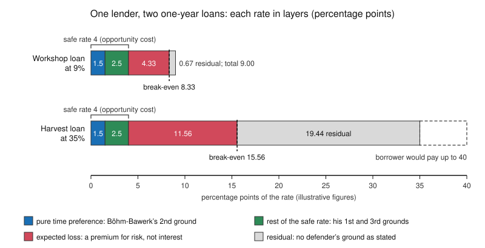

# Philosophy of Debt · Lesson 2.3: Justifying interest: time, abstinence, opportunity

> ⏱ ~15 min · Module 2: The justice of interest · Builds on: [2.1 Aristotle: money is barren](02-01-aristotle-money-is-barren.md), [2.2 Aquinas: selling what does not exist](02-02-aquinas-selling-what-does-not-exist.md) · Unlocks: [2.4 Marx: interest-bearing capital](02-04-marx-interest-bearing-capital.md), [3.1 What exploitation is](03-01-what-exploitation-is.md)

## Why this matters

Aristotle called interest money born of money ([2.1](02-01-aristotle-money-is-barren.md)), and Aquinas called it a charge for what does not exist ([2.2](02-02-aquinas-selling-what-does-not-exist.md)). By the nineteenth century most economists had stopped asking *whether* a lender may charge and started asking *what the charge pays for*. Each answer names something the lender gives up. This lesson states four answers, stacks them as layers of one rate, and finds the part of a rate that none of them covers. That leftover is where Module 3 begins.

## The idea

You lend a friend 100 dollars today and get 109 back in a year. What did you give up that the 9 pays for? Four standard answers:

- **Enjoyment now.** Nassau Senior (*An Outline of the Science of Political Economy*, 1836) called the sacrifice of present enjoyment [abstinence](../reference.md#abstinence-theory) and ranked it a third instrument of production beside labour and natural agents. Profit, interest included, is its reward, as wages reward toil.
- **A better good.** Eugen von Böhm-Bawerk (*The Positive Theory of Capital*, tr. William Smart, 1891) held that a present 100 is worth more than a future 100 of the same kind. A loan swaps one for the other, so the borrower pays a premium, the [agio](../reference.md#agio), to even the trade.
- **The next-best use.** The 100 could have earned something elsewhere. That forgone return is its [opportunity cost](../reference.md#opportunity-cost), and Hume's essay *Of Interest* (1752) tied interest to the profits of trade.
- **Safety.** Your friend might not pay, and a premium for expected losses keeps you whole on average.

All four deny 2.2's charge that interest sells nothing. They disagree about what the something is. Is it a cost the lender bears, like abstinence, forgone profit or risk? Or a difference in value that a market sets, whatever this lender feels?

## Source

Böhm-Bawerk, *The Positive Theory of Capital*, Book VI, ch. I (Smart's translation). A is the lender, B the borrower:

> A loan is nothing else than a real and true exchange of present goods for future goods … B gets full and free possession of the goods to deal with as he likes, and, as equivalent, he gives into A's full and free possession a sum of entirely similar, but future, goods … Between them there is perfect homogeneity, but for the fact that the one belongs to the present, the other to the future. … He must thus pay an "agio" or premium …, and this agio is interest.

"Full and free possession" concedes what Aquinas says of the [*mutuum*](../reference.md#mutuum): ownership passes to the borrower. Böhm-Bawerk also mocked the jurists' separate "use" of lent money (a coal burned to cinders on New Year's Day, yet somehow used all year), so here too he sides with Aquinas. The weight falls on "entirely similar, but future" and "but for the fact". For Aquinas, returning the same kind and amount is equality. For Böhm-Bawerk, a difference of date is a difference of good. Everything between them turns on whether that "but for" matters to justice.

## The argument

**Böhm-Bawerk's case for interest** (*Positive Theory*, Books V–VI, reconstructed).

1. **Present goods are, as a rule, worth more than future goods of like kind and number** (V.1). *In words:* a bushel now beats a bushel next year.
2. **Three grounds make it so** (V.2–4). (a) *Want and provision:* many people are worse provided now than they expect to be later, and a present good can nearly always be kept for later, so it is seldom worth less. (b) *Underestimate of the future:* we undervalue future wants, through weak imagination, weak will and the uncertainty of life. (c) *Technical superiority:* present goods put into longer, roundabout production yield more. *In words:* we need things more now, care less about later, and can set present things to work.
3. **A loan is an exchange of present goods for future goods** (VI.1).
4. **(Supplied.) An exchange is just when equal values change hands**, value being fixed where valuations meet in a market. *In words:* he keeps the scholastics' equality premise and changes what it measures.
5. **So a present sum is matched in value only by a larger future sum, and the difference is interest** (VI.1).
6. **A premium for risk is a separate deduction for uncertainty, not interest proper** (V.1).

∴ **Interest as such is not unjust.** Usury lies not in any gain on a loan "but in the immoderate extent of that gain" (VI.9), as where lenders do not compete.

Premise 3 is conceptual, 1–2 empirical and 4 normative; the argument needs all three kinds.

Senior's version differs at the root: abstinence is a cost the lender bears, so interest is earned. Böhm-Bawerk kept saving as a condition of capital but denied it explains interest, since much interest is pocketed with no abstinence worth rewarding (VI.9). Hume supplied the market side (*Of Interest*, Green and Grose text):

> High interest arises from three circumstances: A great demand for borrowing; little riches to supply that demand; and great profits arising from commerce: And these circumstances are a clear proof of the small advance of commerce and industry, not of the scarcity of gold and silver.

The first two are habits of prodigality and frugality: how a people weighs present against future. The third is what money earns in trade, and since no one lends cheap while trade pays well, interest and profits hold each other level. And what a borrower takes, he added, is in effect labour and commodities, not metal, which bears directly on 2.1's barren coin.

**Where the argument is weakest.** Premise 4, applied to ground (b). By Böhm-Bawerk's own account "we estimate the utility of future goods at a lower figure than expresses their true value" (V.3). A critic says the part of the agio that exists because people misjudge their own futures measures an error, not a value, and a lender who collects it profits from the error. Frank Ramsey ("A Mathematical Theory of Saving", 1928) refused to discount later enjoyments at all in his main model of a nation's saving, judging the practice to have no ethical defence and to come from a failure of imagination. The same pressure falls on ground (a) at its sharpest: Böhm-Bawerk's first proof of the agio is the usurious terms that people in distress accept. A defender replies that ground (a) for the prosperous and ground (c) involve no error; that a just price is the common estimate, not each party's ideal valuation; and that impatience is not irrational, since Hume's *Treatise* (II.iii.3) held that preferring one's own acknowledged lesser good to one's greater is not contrary to reason. The general debate over pure [time preference](../reference.md#time-preference) is [`philosophy-of-economics`](../../philosophy-of-economics/syllabus.md) 4.1's. Here the only question is whether it can ground a lender's claim.

## The decomposition

The four answers are layers of one rate, not rival totals. Write $i$ for the loan rate, $r_f$ for the safe rate the lender could earn instead, $p$ for the chance of default, $\ell$ for the share of what is owed that is lost if it happens, and $\pi$ for a residual premium. The exact (multiplicative) form is

$$1+i=\frac{(1+r_f)(1+\pi)}{1-p\ell}.$$

*In words:* match the safe return, gross it up so that expected repayment after defaults still matches it, and call whatever remains the residual. The **break-even rate** $b$ sets $\pi=0$, so $1+b=(1+r_f)/(1-p\ell)$. Split the safe rate into pure time preference $\rho$ and the rest, and read each [layer](../reference.md#rate-decomposition) as the points it adds:

| Layer | What the lender gives up | Whose ground |
|---|---|---|
| $\rho$ | waiting as such | Böhm-Bawerk's (b); Senior's abstinence at its purest |
| $r_f-\rho$ | a present good's edge when later provision is better | Böhm-Bawerk's (a), with (c) behind it |
| $b-r_f$ | safety | Böhm-Bawerk's premium for risk, outside interest proper |
| $i-b$ | nothing yet named | none, without more argument |

The first two layers together are the safe rate, the lender's opportunity cost, and Hume's link between interest and profits covers them jointly. The layers add to $i$ exactly. The additive shortcut $i\approx r_f+p\ell+\pi$ is close for safe loans and understates the risk layer for risky ones. The Euler equation ([`grad-macro` 1.3](../../grad-macro/lessons/01-03-euler-transversality.md)) splits the safe rate the same way: with flat consumption it equals pure time preference, and with consumption growing at $g$ the growth model's rule $r=\rho+\sigma g$ ([`grad-macro` 2.3](../../grad-macro/lessons/02-03-ramsey-cass-koopmans.md), $\sigma$ the curvature of utility) adds ground (a), while $r=f'(k)-\delta$, capital's marginal product net of depreciation, is ground (c).

## Worked examples

**Example 1 (clean): the workshop loan.** A lender whose safe alternative earns 4%, and whose own pure time preference is stipulated at 1.5%, lends to an established workshop at 9% for a year. The chance of default is 4%, with nothing recovered. All figures here and in Example 2 are illustrative.

- Break-even: $1+b=1.04/0.96=1.0833$, so $b=8.33\%$.
- Layers: $\rho=1.50$; the rest of the safe rate is $4.00-1.50=2.50$; risk is $8.33-4.00=4.33$; the residual is $9.00-8.33=0.67$ points. Check: $1.50+2.50+4.33+0.67=9.00$.
- The shortcut would put the risk layer at $p\ell=4.00$, a third of a point low.

Every layer but the last is some defender's ground, and the 0.67 left could be the lender's costs of arranging and collecting the loan. Senior, Böhm-Bawerk and Hume all pass this loan and differ only on what interest proper rewards. Ramsey's objection, if it succeeds, touches 1.5 of the 9 points.

**Example 2 (hard): the harvest loan.** Same lender, safe rate and $\rho$. A smallholder whose crop failed borrows to feed his family until the next harvest, and this lender is the only one within reach. The default chance is 10%, with nothing recovered. He would pay up to 40% rather than go without, and the lender charges 35%.

- Break-even: $1.04/0.90=1.1556$, so $b=15.56\%$.
- Layers: $1.50+2.50+11.56+19.44=35.00$. The shortcut's risk layer, 10 points, is now 1.56 short.

The residual is more than half the rate, and no ground covers it. The cost-side answers (abstinence, opportunity, risk) stop at 15.56% plus servicing costs. Böhm-Bawerk's value side explains why the borrower will pay so much: this is ground (a) at its sharpest, very nearly his own example of a peasant after a bad harvest. Hume's "little riches to supply that demand" explains the village rate too. Neither explanation justifies it. Böhm-Bawerk himself calls the excess usury where competition is suspended, so even he draws the line by competition, not by what the loan costs. All three defenders justify the first 15.56 points. None says who is owed the 24.44-point gap between the lender's break-even and the borrower's 40%, of which the lender takes 19.44, about four-fifths. That is a question about dividing the gains from an exchange, and it is [3.1](03-01-what-exploitation-is.md)'s.

## Watch out

- **You might think the four answers compete to explain the whole rate, but actually they stack.** Opportunity cost is also relative. It justifies the going rate only if the going rate is itself justified, and the forgone alternative is another loan or a profit, so it passes the question down to time preference and productivity. Whether productivity's return belongs to the owner is [2.4](02-04-marx-interest-bearing-capital.md)'s question.
- **You might think an explanation of interest is a justification of it, but actually the two are different claims.** Hume's three circumstances are empirical: they say what sets the rate, not whether taking it is just. Böhm-Bawerk blamed much harm on confusing the theoretical problem of interest with the socio-political one. His premises 1–3 answer the first, and only premise 4 carries the argument into the second.
- **You might think Ramsey's charge condemns interest, but actually it targets one layer.** With $\rho=0$ a growing economy still has a positive safe rate, $r=\sigma g$, and risk and opportunity cost are untouched. The objection reaches only the part of a rate that pays for impatience.

## One-liner

> A lender gives up enjoyment now, a present good worth more than its future twin, the return the money could earn elsewhere, and safety; a rate stacks these as layers, and whatever is left over still needs an argument.

## Problems

**P1 (🟢) *(Formal (a) · Exegetical (b).)*** Lena, an invented lender, makes one-year loans at 24% to market traders, secured on their stock. Her safe alternative earns 5%, of which her pure time preference is 2% (stipulated). There is a 20% chance a trader defaults, and selling the seized stock then recovers half of what is owed. (a) Compute the break-even rate and the four layers in points, and check that they sum to 24. By how many points does the additive shortcut misstate the risk layer? (b) Which layer or layers does each of these cover: Böhm-Bawerk's second ground; Hume's link between interest and profits; Böhm-Bawerk's premium for risk? Which layer does none of them cover, and what is one thing that could fill it? Two sentences for (b).

**P2 (🟡) *(Exegetical.)*** An invented case. On an island whose only mine is closing, nearly everyone expects to be worse off in ten years, so savers are many, borrowers are few, and safe loans pay nothing. Mara cuts her family's food budget to lend 5,000 dollars to the island's hospital for five years, repaid in full, and says her sacrifice entitles her to interest. (a) What does Senior's theory say about her claim, and what does Böhm-Bawerk's? (b) Name the single premise one side must deny, and say what argument would move each side. 150 words or fewer.

**P3 (🔴, optional) *(Exegetical (a) · Evaluative (b).)*** An invented op-ed, not the words of any real person:

> "Interest is simply the price of time. Economists have proven that everyone prefers a dollar today to a dollar next year. So any rate a borrower freely agrees to is the fair price of the time he buys, and people who call a rate 'too high' are quarrelling with human nature."

(a) Name the two slides the paragraph makes, one between kinds of claim and one between layers of a rate. Two sentences. (b) Give the strongest version of the op-ed's conclusion a defender of interest could offer. Name the premise the strongest objection attacks, and say whether that objection reaches all interest or only some loans. Any verdict; 120 words or fewer.

Solutions

**P1** *(Formal (a) · Exegetical (b), both strict.)*

**Must hit, strict (a):** the expected share lost is $p\ell=0.20\times0.5=0.10$, so $1+b=1.05/0.90=1.1667$ and $b=16.67\%$. Layers: $\rho=2.00$; rest of the safe rate $5.00-2.00=3.00$; risk $16.67-5.00=11.67$; residual $24.00-16.67=7.33$. Sum: $2.00+3.00+11.67+7.33=24.00$. The shortcut puts the risk layer at $p\ell=10$ points, understating it by $1.67$.

**Must hit, strict (b):** the second ground covers $\rho$ (2.00). Hume's link covers the safe rate, $\rho$ and the rest together (5.00), because that is what the money earns elsewhere. The premium for risk covers $b-r_f$ (11.67). None covers the residual (7.33). Candidates are the cost of seizing and selling stock, a premium for bearing uncertainty beyond its expected cost, or market power.

**Wrong turns:** using $p=0.20$ as the loss share, which gives $1.05/0.80$, a break-even of $31.25\%$, above the rate charged. Subtracting $\rho$ from the loan rate instead of the safe rate. Reporting the multiplicative residual premium ($1.24/1.1667-1=6.29\%$) as the residual layer; the layer in points is 7.33. Assigning Hume's link to the residual, as if "profits" meant Lena's markup.

**Model answer:** (a) $b=1.05/0.90-1=16.67\%$; layers 2.00, 3.00, 11.67 and 7.33, summing to 24.00; the shortcut's 10-point risk layer is 1.67 points low. (b) The second ground covers the 2-point time-preference layer, Hume's interest–profits link covers the whole 5-point safe rate, and the premium for risk covers the 11.67-point layer. Nothing covers the 7.33-point residual, which might be filled by the costs of seizing and selling stock, or might be market power.

---

**P2** *(Exegetical, strict.)*

**Must hit, strict (a):**
- **Senior:** interest is the reward of abstinence, a real sacrifice of present enjoyment on a par with labour's toil. Mara's sacrifice is real and severe, so her claim rests on exactly the ground his theory names, and a zero rate leaves a real cost unrewarded.
- **Böhm-Bawerk:** interest is the agio on present goods, and on this island there is none. Ground (a) runs the other way, and a present good can at worst be kept, so the agio is zero rather than negative. A loan at zero trades equal values and is fair on premise 4. Her sacrifice, however real, does not enter the price, so she is owed her 5,000 back.

**Must hit, strict (b):**
- **The crux:** whether a lender is owed interest for a cost she bears (Senior) or for a difference in value between present and future goods that the market sets (Böhm-Bawerk). Böhm-Bawerk denies that sacrifice grounds interest. Senior's side denies that the value difference alone settles what a lender is owed.
- **What moves each:** Senior's side is pressed by the island itself. Sacrifice is great and the rate is zero, while elsewhere lenders who sacrifice nothing earn the going rate, so the rate does not measure sacrifice. Böhm-Bawerk's side is pressed by an argument that a just exchange must answer to what it costs each party, not only to market valuations, or by his own admission that gain without desert can strike one as unfair (VI.9).

**Wrong turns:** treating risk as the issue, when the loan is repaid in full. Saying Böhm-Bawerk denies that her sacrifice is real; he denies only that it fixes the price. Answering only with an heir who sacrifices nothing, an agio with no sacrifice, and missing what the island adds: a sacrifice with no agio.

**Model answer:** (a) For Senior, interest rewards abstinence, a sacrifice like labour's toil, so Mara's cut food budget is just the cost interest pays for, and a zero rate leaves it unrewarded. For Böhm-Bawerk, interest is the agio on present goods, and this island has none. A loan at zero trades equal values, so it is fair, and her sacrifice, though real, does not enter the price. (b) The crux is whether a lender is owed interest for a cost she bears or for a value difference the market sets. Senior's side is pressed by the island: great sacrifice and a zero rate here, while elsewhere lenders who give up nothing are paid, so the rate does not measure sacrifice. Böhm-Bawerk's side is pressed by the thought that a just exchange must answer to what it costs each party.

---

**P3** *(Exegetical (a), strict · Evaluative (b), any verdict.)*

**Must hit, strict (a):**
- **Between kinds of claim:** from an empirical claim (people value present goods more) to a normative one (any freely agreed rate is fair). Explaining why a premium exists does not show that every premium is just, which is the separation Böhm-Bawerk himself insisted on.
- **Between layers:** it treats the whole rate as the price of time. Time preference is one layer beside the rest of the safe rate, the risk premium and the residual, and whatever a rate carries above the safe rate is risk or residual.

**Must hit, any verdict (b):**
- **The best version,** usually Böhm-Bawerk's: where lenders compete, the agio is the price at which present and future goods exchange at equal value, so a competitive rate freely agreed is fair, and "too high" can only mean above the competitive level, which he himself calls usury.
- **The premise attacked,** such as premise 4 for valuations formed in distress or by underestimating the future, or the step from "freely agreed" to "fair" (exploitation, [3.1](03-01-what-exploitation-is.md)).
- **Reach:** whether the objection touches all interest or only loans priced off distress, bias or absent competition (plus the $\rho$ layer, if Ramsey is right), with a reason.

**Wrong turns:** answering (a) with "economists have not proven it". The empirical claim may be true, and the slide is the problem. Rebutting the op-ed in (b) before stating its best version. Treating Ramsey's objection as condemning every layer.

**Model answer (b), one of several:** At its best the op-ed says that where lenders compete, the agio is the rate at which present and future goods trade at equal value, so a competitive rate freely agreed is fair, and a rate is "too high" only above that level. The strongest objection attacks the step from valuation to equal value. When a borrower's valuation comes from distress, or from systematically underestimating his own future, the market agio measures his weakness or his error, not a value. That objection reaches loans priced off desperation or bias, and the time-preference layer if Ramsey is right. It leaves the safe-rate and risk layers of an ordinary competitive loan standing, so it limits interest rather than condemning it.

## Flashback

**From Lesson [2.1](02-01-aristotle-money-is-barren.md) (Aristotle: money is barren):** *(Exegetical (a) · Evaluative (b).)* *Politics* I.9, in Jowett's translation as revised for the Oxford *Works of Aristotle* (1921):

> As in the art of medicine there is no limit to the pursuit of health … (but of the means there is a limit, for the end is always the limit), so, too, in this art of wealth-getting there is no limit of the end, which is riches of the spurious kind, and the acquisition of wealth. But the art of wealth-getting which consists in household management, on the other hand, has a limit.

Two invented Athenians. Glaukos, a smallholder, sells his surplus figs and drops every coin into a jar he never opens; it holds 40 drachmas, and all he wants is to see it fuller. Theron, a landowner, sells his grain to put by 3,000 drachmas, the sum his steward reckons will rebuild the storehouses and carry the household through two failed harvests.

(a) Whose acquisition is unlimited in the passage's sense? Name the words that decide it, and say what the pair shows "limit" means. (b) The steward now admits that no one can say how many bad harvests will come, so Theron keeps adding to the store with no figure in view. Is his acquisition still limited in the passage's sense, and where does the passage's test stop giving a verdict? **Two sentences per part; any verdict in (b).**

Solution

**Must hit, strict (a):**
- **Glaukos's** acquisition is unlimited though his sum is small: accumulation is itself his end, and of this art "there is no limit of the end, which is … the acquisition of wealth".
- **Theron's** is limited though his sum is large: his coin is a means to a further end, the household's needs, and "of the means there is a limit, for the end is always the limit".
- So "limit" is set by **what the wealth is for, not by how much of it there is**. Both men get their coin the same way, by selling what they grow, so the way of getting cannot be what separates them.

**Must hit, any verdict (b):**
- **The test stated:** wealth sought as a means is limited by the end it serves.
- **Run on Theron:** his end is still the household's provision, so the end still measures his store, and he would stop if the household were secure, where Glaukos would not.
- **The strain named:** "the end is always the limit" assumes that an end fixes a determinate amount. Against an open-ended risk it fixes none, so Theron's store and Glaukos's jar grow alike and only motive tells them apart.
- **Reach and verdict:** the strain extends to every household that saves against an uncertain future; say whether the distinction survives it, with a reason.

**Wrong turns:** ranking the two men by the size of their sums, which is exactly what the passage's criterion ignores. Calling both limited because both sell what they grow, which draws the passage's line by the way of getting when the passage draws it by the end. In (b), calling Theron unlimited merely because no figure is fixed, without saying what then separates him from Glaukos.

**Model answer ((b) is one of several):** (a) Glaukos's acquisition is unlimited, because accumulation is his end and "there is no limit of the end, which is … the acquisition of wealth"; Theron's is limited, because "the end is always the limit" and his coin serves the household's needs. The pair shows that the limit is set by what wealth is for, not by how much of it there is. (b) On the passage's test Theron is still limited, since his end is still the household's provision and he would stop if it were secure, where Glaukos never would. But the test now works only through motive: an end with no determinate requirement fixes no figure, so from outside his store and Glaukos's jar grow alike, and the same strain reaches every household that saves against an uncertain future.

## Connections

- **Backward:** [2.1](02-01-aristotle-money-is-barren.md) held money barren. Hume answers that a borrower in effect borrows labour and commodities, and Böhm-Bawerk's third ground says present goods set to work yield more. [2.2](02-02-aquinas-selling-what-does-not-exist.md) held that a loan of a consumable transfers ownership and that returning the same kind and amount is equality. Böhm-Bawerk accepts the first and denies the second, which is exactly where the two traditions part. The Euler equation behind the layer split is [`grad-macro` 1.3](../../grad-macro/lessons/01-03-euler-transversality.md).
- **Forward:** [2.4](02-04-marx-interest-bearing-capital.md) asks whether an owner who lends contributes anything, which is where opportunity cost bottoms out, and answers the abstinence theory directly. [3.1](03-01-what-exploitation-is.md) takes up the residual as a question about dividing gains, and [3.2](03-02-predatory-lending-and-usury-caps.md) applies it to high-cost credit. [6.2](06-02-public-debt-and-the-unborn.md) turns discounting on burdens left to the unborn.
- **Sideways (the debt thread):** the scholastic tradition itemized what a lender may recover in its own terms, the extrinsic titles, in [`theology-of-debt` 4.4](../../theology-of-debt/lessons/04-04-the-extrinsic-titles.md). *Of Interest* appeared in the same *Political Discourses* (1752) as *Of Public Credit*, which [`history-of-debt` 3.4](../../history-of-debt/lessons/03-04-humes-prophecy-carrying-a-great-debt.md) reads. Why a lender facing risky borrowers may ration credit rather than raise the rate is [`economics-of-debt` 1.2](../../economics-of-debt/lessons/01-02-credit-rationing-stiglitz-weiss.md). The ethics of discounting in general is [`philosophy-of-economics`](../../philosophy-of-economics/syllabus.md) Module 4, and P2's method is [finding the crux](../../philosophical-method/lessons/04-03-finding-the-crux.md).
