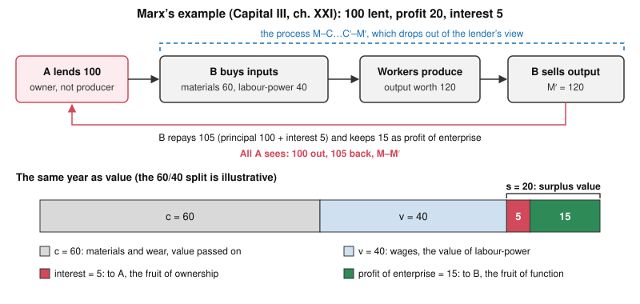

# Philosophy of Debt · Lesson 2.4: Marx: interest-bearing capital

> ⏱ ~15 min · Module 2: The justice of interest · Builds on: [2.3 Justifying interest: time, abstinence, opportunity](02-03-justifying-interest.md), [2.2 Aquinas: selling what does not exist](02-02-aquinas-selling-what-does-not-exist.md) · Unlocks: [3.1 What exploitation is](03-01-what-exploitation-is.md), [3.2 Predatory lending and usury caps](03-02-predatory-lending-and-usury-caps.md)

## Why this matters

This module keeps asking what a lender gives that interest could pay for. Aristotle: nothing, because breeding is not what money is for, so interest is an unnatural increase ([2.1](02-01-aristotle-money-is-barren.md)). Aquinas: nothing beyond the principal, because the use of money is its spending ([2.2](02-02-aquinas-selling-what-does-not-exist.md)). The modern defenders: something real, namely waiting, abstinence or a forgone opportunity ([2.3](02-03-justifying-interest.md)). Marx, in *Capital* vol. 3, Part V, gives a fourth answer. The lender does hand over something real, the power to make a profit, but contributes nothing to making it. Interest is a slice of value produced by workers he never meets, paid to him because he owns the money. This is the root of the *structural* idea of exploitation that [3.1](03-01-what-exploitation-is.md) sets against the transactional one.

## The idea

Marx's own example (vol. 3, ch. XXI). A owns 100 pounds. B runs a business in which capital earns the average rate of profit, 20 percent. A lends B the 100 for a year. B buys materials, hires workers, sells the product and ends the year with 120. He repays A 105 and keeps 15.

From A's side, money went out and came back larger: $M \to M'$, where $M$ is a sum of money and $M'$ the larger sum. Marx's claim is that this appearance is upside down. The 20 was produced in B's business by B's workers. The 5 is a slice of it, handed to A for one reason: A owned the money B needed. [Interest-bearing capital](../reference.md#interest-bearing-capital) is, in Marx's terms, capital as ownership set against capital as a function. The lender is an owner, not a producer.

It rests on Marx's labour theory of value, given here only as far as the argument needs. The value of a product is the labour socially necessary to make it. Workers are paid the value of their labour-power, what it costs to maintain them, and they work longer than it takes to produce that value. The difference is [surplus value](../reference.md#surplus-value), the one fund from which profit, rent and interest are all paid (vol. 1).

Keep three kinds of claim apart. *Explanatory (empirical):* interest is a share of surplus value. *Conceptual:* a loan of capital is not a sale, and interest is not a price in the ordinary sense. *Normative:* whether any of this makes interest unjust. On the last, Marx himself is guarded (see Watch out).

## Source

*Capital* vol. 3, ch. XXIV (Ernest Untermann's translation, 1909), on the form $M \to M'$:

> In the interest-bearing capital, the relations of capital assume their most externalised and most fetish-like form. … Capital appears as a mysterious and self-creating source of interest, a thing increasing itself. … It becomes a faculty of money to generate value and yield interest, just as it is a faculty of a pear tree to bear pears. … While interest is only a portion of the profit, that is, of surplus-value, which the investing capitalist squeezes out of the laborer, it looks now on the contrary as though the interest were the typical fruit of capital, the primal thing, and profit, in the shape of profit of enterprise, a mere accessory and by-product of the process of reproduction.

Read the verbs: "appears", "looks … as though". Marx does not say that money breeds. He describes how a loan looks from the lender's chair, and names two illusions. First, a relation among people shows up as a property of a thing, as bearing pears is a property of a tree. This is the [fetish form](../reference.md#fetish-form), an extension of vol. 1's "fetishism of commodities" (ch. I §4). Second, the order of derivation flips. Interest looks like capital's first fruit and profit of enterprise like a by-product, when on his account interest is carved out of profit. Aristotle called interest *[tokos](../reference.md#tokos)*, offspring, and condemned money that breeds. Marx denies that money breeds of itself, for a reason of his own: the return is real, and the breeding is only how it looks.

## The argument

Reconstructed from vol. 3, Part V (chs. XXI–XXIV).

1. **Surplus value.** All profit is surplus value: value that workers produce beyond the value of their own labour-power (vol. 1). *In words:* property income is paid out of unpaid labour.
2. **Money as capital.** Under capitalism a sum of money has an extra use-value: in a functioning capitalist's hands it can be advanced as capital and bring in the average profit (ch. XXI).
3. **Lending is not selling.** The lender parts with that use-value for a time, gets no equivalent back, and remains the owner. The borrower must return the sum plus part of the profit made with it (ch. XXI). *In words:* a loan is a temporary transfer of a power to profit, not a sale.
4. **Interest is a share.** So interest is the part of the profit paid to the owner. The remainder, [profit of enterprise](../reference.md#profit-of-enterprise), stays with the functioning capitalist (chs. XXI, XXIII). To call interest the "price" of capital is, Marx says, an irrational expression, since a sum of money cannot have a price beside its own; a given profit is simply split.
5. **No natural rate.** Because interest only divides one profit between two holders of titles to the same capital, no law fixes the split. The rate is capped by the rate of profit and tends to move with it, has no definable floor, and is set by competition, custom and legal tradition (chs. XXI–XXII). *In words:* nothing in the nature of things makes one rate the right one.
6. **Ownership, not function.** The lender performs no function in production, so his only title to interest is ownership. The functioning capitalist's share looks like the fruit of his own activity, even like a wage for managing (ch. XXIII).

∴ **C. Interest rewards ownership, not a contribution to production, and money that seems to breed ($M \to M'$) is the form that hides where interest comes from** (ch. XXIV).

Marx then turns on the justifications: reasons for *who gets* a share pose as reasons *there is* one.

> The reasons for dividing the profit among two kinds of capitalists thus turn surreptitiously into reasons for the existence of the surplus-value to be divided (ch. XXIII).

The charge fits Senior's [abstinence theory](../reference.md#abstinence-theory) ([2.3](02-03-justifying-interest.md)), which Marx mocks in vol. 1 (ch. XXIV §3, Moore and Aveling's translation). He quotes Senior and replies:

> I substitute … for the word capital, considered as an instrument of production, the word abstinence. … If the corn is not all eaten, but part of it also sown — abstinence of the capitalist. If the wine gets time to mature — abstinence of the capitalist.

The joke carries an argument. Setting seed aside and letting wine age are conditions of the labour process, whoever owns the corn; the theory relabels them as the owner's sacrifice and bills for it. A footnote adds that every act is "abstinence" from its opposite (eating from fasting, working from idling), so the word picks out no contribution. Abstinence might explain why an owner has a sum to lend, not why the sum grows. Böhm-Bawerk, no Marxist, answered that saving is no pure negation, since people find it hard, though he granted that it cannot by itself justify interest (*Positive Theory*, Book II, ch. VI).

**Where the argument is weakest.** Premise 1 carries the whole conclusion about where interest comes from, and most economists abandoned it after the marginalist revolution of the 1870s. Böhm-Bawerk pressed the attack in *Karl Marx and the Close of His System* (1896; English 1898): vol. 3's prices of production, he argued, contradict vol. 1's theory of value. Defenders reply that the charge survives without that theory. G. A. Cohen (1979) argued that it needs only the weaker claim that workers alone produce the product that has value, while owners who do no work receive part of it. The critic then targets that claim: someone had to save the capital, and whether only labour counts as a contribution is exactly what is in dispute.

## The decomposition

The top row is the whole movement, $M - C \dots C' - M'$; the lender's view, $M \to M'$, cuts out everything between. The bar is the same year as value; only the 60/40 split is not Marx's.

## Worked examples

**Example 1 (clean: one surplus, three parties).** Add C, who runs an identical business on his own 100 pounds.

- *B, on borrowed capital.* His workers produce 20 of surplus value; B pays 5 to A and keeps 15 as profit of enterprise. A takes a quarter of the surplus, a 5 percent rate on his 100.
- *C, on his own capital.* Again 20. C pays no one, yet, Marx notes (ch. XXIII), he books it the same way: 5 as "interest" on his own capital, as if lent to himself, and 15 as the return to his activity. Economists call that 5 an [opportunity cost](../reference.md#opportunity-cost). Marx's point: a split fixed by who owns what hardens into two supposedly different kinds of income.

The workers in both businesses produce the same 20, and who takes part of it makes no difference to them, Marx says; only a change in the rate of surplus value would. A never faces them. Yet on Marx's account he shares in their [exploitation](../reference.md#structural-exploitation), since their surplus is the only fund he is paid from.

**Example 2 (hard: the pawnshop).** Dana works in a warehouse. Short of rent, she pawns her winter coat for 40 pounds and redeems it a month later for 44. The money pays her landlord; nothing bought with it is sold at a profit.

Run the argument and it stalls at premise 2. The money never functions as capital, so there is no profit for the 4 pounds to be a share of; it can only come out of her wage. Under capitalism, Marx says, a worker borrows not as a producer but for necessities, at the pawnshop for instance, and in such dealings interest-bearing capital keeps the older form of usurer's capital (ch. XXXVI). He keeps lending for consumption out of this analysis, and calls the overcharging of workers there, like the retail dealer's, a "secondary exploitation" running parallel with the primary one in production.

This is where the tool strains. Its core thesis, interest as a share of surplus value, holds only for loans that finance production. Consumer credit needs a second category, and the fetish diagnosis has nothing to uncover: behind Dana's $M \to M'$ stands no workshop, only her wage. The normative question splits. Is 4 pounds a fair price for a month's 40? That is Wertheimer's transactional question ([3.1](03-01-what-exploitation-is.md)). Why must Dana pawn her coat at all? That points to the background, her position as a wage-earner, which is where Marx's structural account aims.

## Watch out

- **You might think Marx argues that interest is unjust.** In Part V he calls a defence of interest from "natural justice" nonsense (P2 reads the passage). Whether his analysis still implies an injustice is disputed: Allen Wood (1972) argued that Marx did not think capitalism unjust, Ziyad Husami (1978) that he did, by a standard reaching beyond capitalism. Keep the kinds of claim apart: one can accept Marx's explanation of interest and deny that it is wrong, or reject the explanation and still think interest wrong.
- **You might think Marx sides with Aristotle and Aquinas.** He agrees that the increase is not money's own fruit, but not that the lender hands over nothing. Proudhon complained that lending at interest sells the same article over and over, a cousin of the charge in [2.2](02-02-aquinas-selling-what-does-not-exist.md). Marx answered that lending is not selling at all: the lender parts with a real use-value, the power to make profit, whose use increases value instead of using it up. His quarrel is over where the increase comes from.

## One-liner

> For Marx the lender hands over something real, money's power to command profit, but produces nothing: interest is a slice of workers' surplus labour paid to ownership, and money that seems to breed like a pear tree is the form that hides it.

## Problems

**P1 (🟢) *(Formal (a)–(b) · Exegetical (c).)*** An invented furniture workshop, read on Marx's assumptions. In a year it uses up 45,000 pounds of timber, glue and tool wear (constant capital, $c$) and pays 15,000 pounds in wages (variable capital, $v$). Its workers add new value equal to twice their wages. The capital advanced, $c + v$, turns over once in the year; 40,000 pounds of it is borrowed at 6 percent a year and the rest is the owner's.

(a) Compute the surplus value $s$, the rate of surplus value $s/v$, the rate of profit $s/(c+v)$, the interest paid and the profit of enterprise. What share of $s$ goes to the lender?
(b) As Marx says owners do (ch. XXIII), the owner also books interest at 6 percent on his own capital. How does $s$ divide in his books?
(c) Whose labour produced the lender's interest, and which change would alter the workers' position on Marx's account: a change in the rate of interest, or in the rate of surplus value? Two sentences.

**P2 (🟡) *(Exegetical.)*** Marx is answering Gilbart, author of *The History and Principles of Banking* (1834), whose words he quotes in a note: it is "a self-understood principle of natural justice" that a man who borrows money to make a profit should give the lender a portion of it. *Capital* vol. 3, ch. XXI (Untermann):

> To speak in such a case of natural justice, as Gilbart is doing (see note), is nonsense. The justice of the transactions between the agents of production rests on the fact that these transactions arise as natural consequences from the conditions of production. The juristic forms, in which these economic transactions appear as activities of the will of the parties concerned, as expressions of their common will and as contracts which may be enforced by law against some individual party, cannot determine their content, since they are only forms. They merely express this content. This content is just, whenever it corresponds, and is adequate, to the mode of production. It is unjust, whenever it contradicts that mode. Slavery on the basis of capitalist production is unjust; likewise fraud in the quality of commodities.

(a) What standard of justice does the passage state, and what exactly does Marx call nonsense? (b) What role does it give to consent and contract? (c) Reader X: "Here Marx condemns interest as unjust." Reader Y: "Here Marx declares interest just." Which reading do the words support, which words decide it, and what does the passage leave open? 150 words or fewer in all.

**P3 (🔴, optional) *(Exegetical (a)–(b) · Evaluative (c).)*** An invented case. Rosa, a school cook, gave up holidays for twelve years to save 40,000 pounds, which she lends to a bakery chain at 5 percent. A follower of Senior says her 2,000 pounds a year rewards her abstinence; a follower of Marx says it is a share of the bakers' surplus value. (a) Name the single premise on which the two must disagree. (b) Say what argument or evidence would move each side. (c) The Senior follower adds: "Without Rosa's savings the ovens would never have been bought, so her saving is as much a cause of the bread as the bakers' work." Is that a good reply to Marx? Any verdict. 150 words or fewer in all.

Solutions

**P1** *(Formal (a)–(b) · Exegetical (c): strict.)*

**Must hit, strict (a):** new value $= 2 \times 15{,}000 = 30{,}000$, so $s = 30{,}000 - 15{,}000 = 15{,}000$ and $s/v = 15{,}000/15{,}000 = 100\%$. Capital advanced $= 45{,}000 + 15{,}000 = 60{,}000$, so the rate of profit is $15{,}000/60{,}000 = 25\%$. Interest $= 0.06 \times 40{,}000 = 2{,}400$. Profit of enterprise $= 15{,}000 - 2{,}400 = 12{,}600$. The lender takes $2{,}400/15{,}000 = 16\%$ of $s$ (the owner keeps $84\%$).

**Must hit, strict (b):** own capital $= 60{,}000 - 40{,}000 = 20{,}000$, and $0.06 \times 20{,}000 = 1{,}200$. Booked "interest" $= 2{,}400 + 1{,}200 = 3{,}600$, which is simply $0.06 \times 60{,}000$, or $3{,}600/15{,}000 = 24\%$ of $s$. Booked profit of enterprise $= 15{,}000 - 3{,}600 = 11{,}400$, or $76\%$.

**Must hit, strict (c):** the workshop's workers produced it: the 2,400 is part of the 15,000 they produced beyond their wages. Who takes the interest makes no difference to them; only a change in the rate of surplus value (pay against hours and intensity of work) alters their position.

**Wrong turns:** treating the whole output value ($45{,}000 + 15{,}000 + 15{,}000 = 75{,}000$) as the fund interest comes from. Dividing $s$ by $v$ alone and calling it the rate of profit: that is the rate of surplus value. In (b), treating the imputed 1,200 as a payment to someone, when it is only a heading in the owner's own books.

**Model answer:** (a) $s = 15{,}000$, $s/v = 100\%$, rate of profit 25 percent, interest 2,400, profit of enterprise 12,600; the lender gets 16 percent of $s$. (b) "Interest" 3,600 (24 percent) and profit of enterprise 11,400 (76 percent). (c) The workers produced it, as part of the surplus above their wages. Whether a lender or the owner keeps it is immaterial to them; a change in the rate of surplus value would alter their position, a change in the rate of interest would not.

---

**P2** *(Exegetical: strict.)*

**Must hit, strict (a):** a transaction is just when its content "corresponds, and is adequate, to the mode of production", unjust when it "contradicts that mode", so justice is measured against a mode of production. The nonsense is the appeal to *natural* justice, a standard outside any mode of production, used to justify interest. Marx does not call the lender's share nonsense.

**Must hit, strict (b):** consent and contract are "only forms" that "merely express" the content and "cannot determine" it. Agreement neither makes a transaction just nor makes it unjust.

**Must hit, strict (c):** neither reading as stated. X is refuted: interest arises "as natural consequences from the conditions of production" under capitalism, so by the stated standard it is not unjust there; the target is Gilbart's justification, not interest. Y overreaches: "just" here means *corresponding to capitalist production*, and "Slavery on the basis of capitalist production is unjust" shows the standard is relative, not timeless. Left open: whether Marx condemns interest on some other ground, or by a standard beyond capitalism (the Wood–Husami dispute).

**Wrong turns:** reading "nonsense" as aimed at the lender's share. Reading the slavery sentence as a timeless condemnation, when "on the basis of capitalist production" is doing the work. Treating free agreement as what makes interest just, which (b) denies.

**Model answer:** (a) Justice is correspondence to the mode of production; what is nonsense is invoking a *natural*, mode-independent justice to defend interest. (b) Consent and contract are mere forms; they express a transaction's content and cannot make it just or unjust. (c) The words support neither X nor Y as stated. Since interest arises "as natural consequences from the conditions of production", it is not unjust by the passage's standard, so X fails. But "just" means only "adequate to" capitalist production, as the slavery sentence shows ("on the basis of capitalist production"), so Y's unqualified "just" goes too far. The passage leaves open whether Marx condemns interest on grounds other than justice, or by a standard beyond capitalism.

---

**P3** *(Exegetical (a)–(b): strict on naming one premise · Evaluative (c): any verdict.)*

**Must hit, strict (a):** one premise, e.g. *the lender's waiting, forgoing present consumption, is itself a contribution to production that the product must repay.* Senior affirms it (abstinence as an instrument of production beside labour); Marx denies it (only labour produces value, and abstinence explains who has a sum to lend, not why the sum grows). "Only labour produces the value that interest is paid from" is the same crux from Marx's side.

**Must hit, strict (b):** what would move Marx: an argument that any economy, even one without private lenders, must charge for waiting, so that waiting is a cost of production in its own right; Böhm-Bawerk argued that the causes of interest would operate even under socialism (*Positive Theory*, Book VI, ch. X). What would move Senior: evidence that saving barely responds to the rate, so that interest is not the price that calls abstinence forth; or Marx's point that seed must be set aside in any economy, whoever owns it.

**Must hit, any verdict (c):** state the reply precisely: a necessary condition of production counts as a contribution to its value. Test that step. Dry weather is a condition of a harvest and earns nothing, since no one owns it, and Böhm-Bawerk himself put saving among the motives of production, not its means (Book II, ch. VI). Ask what the reply rewards: an heir who never abstained supplies the same ovens, so it pays whoever supplies the funds, which is ownership, Marx's description, rather than abstinence. Give a verdict with a reason.

**Wrong turns:** naming "whether interest is just" as the crux (that is the conclusion) or "whether Rosa really sacrificed" (both sides can grant it). In (c), answering only that Rosa's sacrifice was real, which leaves untouched the step from condition to contribution.

**Model answer ((c) is one of several):** (a) Whether forgoing present consumption is a contribution to production that the product must repay: Senior yes, Marx no. (b) Marx would be moved by an argument that any economy, even without private lenders, must charge for waiting, as Böhm-Bawerk argued of socialism; Senior, by evidence that saving barely responds to the rate. (c) Not as it stands. A condition of the bread need not add value to it: dry weather is a condition of the harvest and earns nothing, since no one owns it. What earns a share is an owned condition, and an heir who never abstained would supply the same ovens. So the reply rewards ownership of funds, which is Marx's description. A Senior follower can answer that saved funds exist only because someone abstained, so owning them is abstinence at one remove. The dispute then turns on whether past abstinence keeps earning for its holder.

## Flashback

**From Lesson [2.2](02-02-aquinas-selling-what-does-not-exist.md) (Aquinas: selling what does not exist):** *(Exegetical.)* An **invented** study-guide paragraph, not the words of any real person:

> "Aquinas's objection to usury is that the lender sells time, which is common to everyone and so no one's to sell. That is why his argument spares the landlord, since a house is not time; why it spares a modest rate charged to a wealthy merchant, since no one is harmed; and why it forbids a lender to recover even a fee that making the loan really cost her."

(a) Name the argument ST II-II q.78 a.1 actually gives, and say why the paragraph's reason for sparing the landlord fails even though its verdict is right. (b) Does q.78 agree with the other two verdicts? Give the ground for each. **Two sentences per part.**

Solution

**Must hit, strict (a):**
- q.78 a.1 gives the **consumptibles argument**, not the sale of time: money's proper use is to be spent, so a loan of money hands over the money itself (a *mutuum*), an equal sum repays everything handed over, and any further charge sells what does not exist. The sale of time is an older argument, usually traced to William of Auxerre; in q.78 time enters only in a.2 ad 7, where a higher price for later payment counts as charging for a loan.
- **The landlord:** the sale-of-time reason **proves too much**, since a landlord also charges by the year, so it would condemn rent along with interest. q.78 spares rent because a house's use can be let apart from the house, which the landlord keeps (2.2's P4).

**Must hit, strict (b):**
- **The wealthy merchant: q.78 disagrees.** Usury is "unjust in itself" because it breaks equality in exchange, so any agreed surplus on a *mutuum* is usury, at 1 percent or 50, from a pauper or a bank. Harm is not the ground.
- **The fee: q.78 disagrees.** a.2 ad 1 lets a lender agree to compensation for a loss the loan actually causes her, since that avoids a loss rather than selling the use of money. What she may not charge for is a profit she might have made.

**Wrong turns:** taking a.2 ad 7 for the sale-of-time argument: it treats a surcharge for waiting as the price of a loan, so it extends the consumptibles argument rather than arguing that time is no one's to sell. Saying q.78 condemns rent too. Accepting the merchant verdict because a rich borrower is neither harmed nor exploited: exploitation is a different charge from q.78's. Treating the fee verdict as right by running a loss incurred together with a profit forgone.

**Model answer:** (a) q.78 a.1 argues from consumptibles: using money means spending it, so a loan of money hands the money over, an equal sum repays it, and any charge beyond that sells what does not exist. The paragraph's reason cannot spare the landlord, who also charges by the year, so the sale of time would condemn rent along with interest; q.78 spares him because a house's use can be let while he keeps the house. (b) No: usury is unjust in itself because it breaks equality in exchange, so a modest charge to a wealthy merchant is usury too. No again: a.2 ad 1 lets a lender agree to be compensated for a loss the loan really causes her, though not for a profit she might have made.

## Connections

- **Backward:** [2.1](02-01-aristotle-money-is-barren.md): Aristotle and Marx both deny that the increase is money's natural fruit. Aristotle grants that lent money "breeds" and calls the breeding unnatural, because money is for exchange; Marx's is that the increment comes from labour, and breeding is how a social relation looks. [2.2](02-02-aquinas-selling-what-does-not-exist.md): for Aquinas the use of money is its spending, so there is no separate use to charge for. Marx says the lender does part with a separate use-value, money's power to function as capital, whose use increases value. He thus grants the lender a real use to transfer and still denies him any productive contribution. [2.3](02-03-justifying-interest.md): Senior's abstinence is Marx's named target. His "reasons for dividing" charge is one a Marxist can press against any justification of interest, including Böhm-Bawerk's time preference, which appeared after Marx's death. His wider theory of history is [`history-of-political-thought` 6.5](../../history-of-political-thought/lessons/06-05-marx-from-hegel-to-historical-materialism.md); P3's method is [finding the crux](../../philosophical-method/lessons/04-03-finding-the-crux.md).
- **Forward:** [3.1](03-01-what-exploitation-is.md) sets Marx's structural exploitation, a relation of production, against Wertheimer's transactional account, an unfair division within one exchange; Example 2's pawnshop is where they come apart. [3.2](03-02-predatory-lending-and-usury-caps.md) takes up high-cost consumer credit and rate caps. The Module 2 boss problem in the [syllabus](../syllabus.md) maps the components of a loan rate onto Aristotle, Aquinas and Marx.
- **Sideways:** the debt thread. Marx calls the pawnshops the modern successors of the Monts-de-piété, which he takes as an irony of history; their founding is [`history-of-debt` 2.2](../../history-of-debt/lessons/02-02-jewish-lenders-and-the-monti-di-pieta.md) and [`theology-of-debt` 5.1](../../theology-of-debt/lessons/05-01-the-monti-di-pieta-and-lateran-v.md). In ch. XXIV he quotes Luther at length against lenders who charge every borrower for losses they never suffered: the extrinsic titles of [`theology-of-debt` 4.4](../../theology-of-debt/lessons/04-04-the-extrinsic-titles.md), as a critic saw their abuse. [`economics-of-debt`](../../economics-of-debt/syllabus.md) treats the rate of interest as a price formed in credit markets, the very "price" Marx calls irrational. Marx as a social theorist, and how his predictions fared, is [`social-theory`](../../social-theory/syllabus.md) Module 2.
