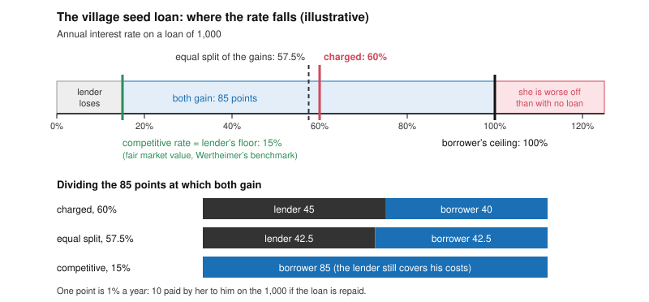

# Philosophy of Debt · Lesson 3.1: What exploitation is

> ⏱ ~15 min · Module 3: Exploitation, domination and the vulnerable borrower · Builds on: [2.3 Justifying interest](02-03-justifying-interest.md), [2.4 Marx: interest-bearing capital](02-04-marx-interest-bearing-capital.md) · Unlocks: [3.2 Predatory lending and usury caps](03-02-predatory-lending-and-usury-caps.md), [3.3 What may be pledged](03-03-what-may-be-pledged.md)

## Why this matters

Module 2 asked whether charging for a loan can ever be just. Module 3 sets that aside for a sharper question: when is a particular loan wrong, even though the borrower chose it, gained from it and was told the truth? Critics call pawnshops, loan sharks and payday lenders exploitative. Defenders reply that a deal both sides accept wrongs no one. This lesson states Alan Wertheimer's transactional account (*Exploitation*, 1996), separates it from harm, coercion and fraud, and sets beside it the structural rival from [2.4](02-04-marx-interest-bearing-capital.md).

## The idea

A hailstorm flattens a farmer's crop in early spring. To replant she needs 1,000 for seed, now. Lenders in the market town compete for business and charge 15% a year for loans this risky, but the town is days away and planting will not wait. The one lender in her village asks 60%. She takes it, and sensibly: without seed she loses the season.

Check the wrongs you already know.

- **Fraud?** No. She knows the terms.
- **Coercion?** No. He threatened nothing. He offered her something she lacked, and he had no duty to lend at all.
- **Harm?** No. She is better off with the loan than without it.

If something is still wrong, it lies in the split. The loan creates gains for both of them, and he has taken most of them by using the fact that she has nowhere else to go. Wertheimer calls this **mutually advantageous exploitation**, and here it is also consensual: both gain, she agrees, and it can still be wrong ([exploitation](../reference.md#exploitation)).

Not every use of another's situation is exploitation. A surgeon who sets your broken leg for the usual fee profits from your injury. In its moral sense the word needs *unfair* advantage, which means measuring the terms against a fair benchmark. Finding the benchmark is the whole difficulty.

## Source

Aquinas, *Summa Theologiae* II-II q.77 a.1, the body (English Dominican Province, 1920), on the just price of a sale, one question before the usury question that [2.2](02-02-aquinas-selling-what-does-not-exist.md) tests. One party needs the thing badly:

> …the just price will depend not only on the thing sold, but on the loss which the sale brings on the seller. … Yet if the one man derive a great advantage by becoming possessed of the other man's property, and the seller be not at a loss through being without that thing, the latter ought not to raise the price, because the advantage accruing to the buyer, is not due to the seller, but to a circumstance affecting the buyer. Now no man should sell what is not his, though he may charge for the loss he suffers.

The article has already set fraud aside ("apart from fraud"), so this wrong is not deceit. The [just price](../reference.md#just-price) has two sides: the seller may charge for what the sale costs *him*, but not for what the thing is worth to a needy *buyer*. The reason is entitlement, not harm: the buyer's gain comes from his own circumstance, so pricing it sells "what is not his". The fair price is fixed without reference to this buyer's need. Aquinas leaves "worth" to "a kind of estimate" (ad 1), which Raymond de Roover (1958) read as the going market price. A buyer may still pay more "of his own accord": the gain may be given, not exacted.

## The argument

**Wertheimer's account**, paraphrased from *Exploitation* (1996), with premise 5 from his *Coercion* (1987).

1. **To exploit is to take unfair advantage.** A exploits B when A gains from a transaction with B by using some feature of B's situation, on terms that are unfair to B. *In words:* using someone's need is not yet wrong; using it to get unfair terms is.
2. **The unfairness lies in the division of the gains.** A transaction is unfair to B when A's share of what it yields exceeds what fair terms would give him. *In words:* the complaint is about the split, not about whether the deal happened ([division of the gains](../reference.md#division-of-the-gains)).
3. **Fair terms are fair market value.** The benchmark is the price a hypothetical competitive market would set, with both sides informed and neither taking special advantage of the other's special vulnerability or weakness in decision-making. *In words:* charge what the deal would cost an ordinary customer with ordinary options ([fair market value](../reference.md#fair-market-value)).
4. **Harm is not required.** If B ends better off than with no transaction, the exploitation is *mutually advantageous*; if worse off, *harmful*. Either way she is worse off than fair terms would leave her. *In words:* measure the victim against a fair deal, not against no deal ([mutually advantageous exploitation](../reference.md#mutually-advantageous-exploitation)).
5. **Consent does not cleanse it.** Only a threat coerces: a proposal to leave B worse off than she is entitled to be, when she has no reasonable alternative. An offer adds an option, however desperate she is, so her consent to it can be valid. *In words:* desperation is not duress ([coercion](../reference.md#coercion)).

∴ **C.** A loan can be honest, freely accepted and good for the borrower, and still exploit her, if its price exceeds fair market value because the lender used her special lack of alternatives. Exploitation is its own wrong, not fraud (consent defeated by deceit), coercion (consent forced by a threat) or harm (a loss measured against no transaction).

The word "special" does the work. Locke drew the same line in *Venditio* (1661): a merchant may sell corn in a famine town at that town's price, but may not charge a ship in distress many times the usual price of an anchor. General scarcity stays in the fair price; this buyer's plight is screened out.

**The rival.** A [structural](../reference.md#structural-exploitation) account looks past the deal to the system that sets everyone's alternatives. In [2.4](02-04-marx-interest-bearing-capital.md), workers are paid the full value of their labour-power, a fair exchange by the market's own measure, and are exploited all the same, since they produce more value than they are paid. Marx's measure of exploitation mentions no price:

> The rate of surplus-value is therefore an exact expression for the degree of exploitation of labour-power by capital, or of the labourer by the capitalist. (*Capital* vol. 1, ch. IX §1, Moore and Aveling)

Interest is a share of that surplus, however fair the loan's terms. Between the poles, Robert Goodin (1987) makes exploiting a breach of a norm of protecting the vulnerable, whatever caused the vulnerability, and Ruth Sample (2003) a failure of respect, as in profiting from someone's unmet basic needs or from an injustice done to her.

**Where the argument is weakest.** Premise 3, attacked twice. Where no market exists (the only lender in reach, the only rescuer), the hypothetical price must be constructed, and constructions can be contested. And a competitive price reflects the parties' alternatives, so if poverty or injustice set those, the benchmark writes them into the fair price: the charge Sample and the structural theorists press. Wertheimer accepts the gap: a price at fair market value may fail to be just, all things considered, and still not be exploitative. The critic answers that this saves the account by shrinking what "exploitation" can condemn.

## The division of the gains

The village loan from The idea (illustrative). The lender's **floor** is the lowest rate at which lending beats his next-best use of the money; the borrower's **ceiling** is the highest rate at which the loan still beats no loan. Past the ceiling she is worse off than with no loan, the territory of harmful exploitation. Where the fair rate sits inside the range depends on the benchmark.

## Worked examples

**Example 1 (clean): the village seed loan.** First the benchmark. In [2.3](02-03-justifying-interest.md)'s notation the break-even rate $b$ satisfies $1+b=(1+r_f)/(1-p\ell)$, where $r_f$ is the safe return the lender could earn instead, $p$ the chance of default and $\ell$ the share lost if it happens. Competition leaves no premium above $b$. With $r_f = 3.5\%$, $p = 10\%$ and a total loss ($\ell = 1$):

$$1+b=\frac{1.035}{0.90}=1.15, \qquad b = 15\%.$$

The village lender's costs are the same, so 15% is also his floor. Her ceiling: the crop will leave her 1,000 ahead after repaying the principal, so any rate under 100% beats going without.

Run the account. The rates at which both gain run from 15% to 100%, a range of 85 points. At 60% he takes 45 of them and leaves her 40. She gains, so the exploitation is mutually advantageous (premise 4). She accepted an offer with open eyes, so it is **consensual** (premise 5). The rate is four times fair market value because she alone could not reach another lender, a special vulnerability (premise 3). Verdict on the account: exploitation. The unfair excess is $60 - 15 = 45$ points, 450 on the loan if it is repaid.

Swap the benchmark for an equal split of the gains, the Nash bargaining solution of [`game-theory-refresher` 4.1](../../game-theory-refresher/lessons/04-01-bargaining.md) when utility is linear in money. The fair rate becomes the midpoint, $(15+100)/2 = 57.5\%$, and 60% is nearly fair. Make her need greater, a ceiling of 200% because the crop would save the farm, and the midpoint jumps to $(15+200)/2 = 107.5\%$, while the competitive rate stays at 15%. By the Source's principle that is the flaw: the equal split charges her for her own desperation, a "circumstance affecting the buyer". Bargaining theorists reply that both parties create the gains, so both may share them.

**Example 2 (hard): the furnishing merchant.** In [`history-of-debt` 4.3](../../history-of-debt/lessons/04-03-debt-peonage-after-slavery.md), sharecropping families in the postwar cotton South bought supplies on credit against a lien on their crop, at credit prices well above cash prices, for reasons still disputed. Ransom and Sutch saw territorial monopoly: a farmer whose crop was under lien could not take it to a rival. Higgs and Wright saw competition, and the cost of lending to poor borrowers against a risky crop.

Advantage-taking, mutual advantage and an offer are present on either history, so premise 3 hands the moral question to an empirical one. If the market was competitive, the markup was fair market value and the merchant did not exploit. If each merchant was a local monopolist, the markup above the competitive level was exploitation.

Here is the strain. On either history the families' alternatives were set by a system: no land, lien laws, exclusion by race. A benchmark that takes those alternatives as given can certify even a competitive markup as fair. Sample would say the merchant profited from injustice and so exploited. A Marxian would say *was this deal fair?* was the wrong question. Wertheimer can grant that the system was unjust while denying that each merchant exploited. What divides them is whether exploitation is a wrong in the split of a deal or in the structure that sets its terms.

## Watch out

- **You might think exploitation means the loan left the borrower worse off.** The central cases are mutually advantageous. The borrower is measured against fair terms, not against no loan. Harmful exploitation, worse off than no deal, usually arrives with fraud or coercion.
- **You might think a desperate borrower's consent is coerced.** On Wertheimer's account only threats coerce, and a threat is measured against what she is owed. The village lender owed her nothing and offered something. So her consent is valid, and the wrong, if any, is exploitation, not coercion.
- **You might think "the market rate" is a moral finding.** "Merchants charged high credit prices" is historical. "A competitive market would have charged the same" is an economic counterfactual. "The price was fair" is normative. Premise 3 bridges the second to the third, and only evidence about competition bridges the first to the second.

## One-liner

> Exploitation is taking unfair advantage, a wrong in how a deal's gains are split, so it survives the borrower's consent and benefit; everything then turns on the benchmark for a fair split, and on whether the market's price is it.

## Problems

**P1 (🟢) *(Exegetical.)*** On Wertheimer's account, classify each invented case as mutually advantageous exploitation, coercion, fraud, or none of these, and give the deciding reason. One sentence each.

(a) A snowstorm shuts the highway. A tow-truck driver finds a motorist stuck on the shoulder, warm and in no danger, and offers a tow to town for 900 dollars. Local firms charge 180 dollars for a tow in a storm, but none can reach her tonight. She accepts.

(b) A lifeguard, paid by the town to guard its beach, sees a swimmer caught in a rip current and shouts that he will swim out only if she promises him 500 dollars. She promises.

(c) A credit-union member must pay a deposit by tomorrow or lose a flat. The credit union lends her 2,000 dollars at the rate it charges every member with her credit record, which is the rate competing lenders quote for that record.

(d) A lender's advertisement promises "no fees". The contract's small print adds a 300-dollar charge, which the borrower first notices on her statement.

**P2 (🟡) *(Exegetical (a) · Evaluative (b).)*** (a) State Wertheimer's benchmark for fair terms in one sentence, naming one thing it keeps in the price and one thing it screens out. (b) Build a case, other than the furnishing merchant of Example 2, in which the benchmark gives a verdict you judge wrong, or gives none. Name the premise your case attacks, and say whether the objection generalizes. Any verdict passes. 150 words or fewer for (b).

**P3 (🔴, optional) *(Formal (a) · Exegetical (b).)*** A borrower needs 400 dollars on a holiday Saturday to secure a sublet that will save her 100 dollars against her next-best housing. Her neighbour, the only lender she can reach before the deadline, lends it for one month and charges 12%. His costs, including what the cash would earn elsewhere and a little risk, come to 2% for the month. Competing lenders charge 3% a month for borrowers like her, but none can fund her before Tuesday.

(a) Compute in dollars the gains from the loan, each side's share at 12%, the rate that would split the gains equally, and the neighbour's excess over the competitive rate.
(b) Name the crux between a Wertheimerian and a theorist who takes an equal split of the gains as fair, and say what argument would move each. 100 words or fewer.

Solutions

**P1** *(Exegetical — strict.)*

**Must hit, strict:**
- (a) **Mutually advantageous exploitation.** The driver owes her no tow, so his proposal is an offer she gains from, but its price is $900/180 = 5$ times the storm-tow benchmark because no rival can reach her: a special vulnerability.
- (b) **Coercion.** His job puts him under a duty to rescue her, so "pay or I stay" threatens to leave her worse off than she is entitled to be, and she has no reasonable alternative. Any fee would be coercive here, so the size of the fee is not what decides it. (Adding that he also exploits her by the threat is fine.)
- (c) **None.** The rate is fair market value for her risk, so the credit union profits from her need only as the surgeon profits from a broken leg, and it charges nothing for her urgency.
- (d) **Fraud.** She consented to a loan described as fee-free, so deception defeated her consent, however fair the price. (Adding that the lender exploits her by fraud is fine.)

**Wrong turns:** calling (a) coercion because she "had no choice": desperation is not a threat, and the driver owes her nothing. Measuring (a) against a fair-weather price: the benchmark keeps the storm in. Calling (b) mutually advantageous because she is better off than drowning: a threat is measured against what she is owed. Calling (c) exploitation because she is desperate: premise 1 needs unfair terms, not only need.

**Model answer:** as above, one sentence each.

---

**P2** *(Exegetical (a) — strict · Evaluative (b) — graded on moves, not verdict.)*

**Must hit, strict (a):** fair market value is the price a hypothetical competitive market would set, with both parties informed and neither taking special advantage of the other's special vulnerability or weakness in decision-making. It keeps general supply and demand in the price, including general scarcity (Locke's famine town). It screens out this party's special plight (the ship in distress), monopoly power and deception.

**Must hit, any verdict (b):**
- A case stated precisely enough that the benchmark's verdict, or its silence, can be derived, with the derivation shown.
- Your own judgment of that verdict, with a reason.
- The premise attacked, named: for instance, that fair terms assume full information, that a competitive price exists here, or that a competitive price is a fair one.
- Whether the objection generalizes: the class of cases it covers, and the best reply open to Wertheimer.

**Wrong turns:** a case in which the price exceeds the benchmark and feels unfair: the account agrees with you, so it is no counterexample. A buyer who chooses to pay more, like Aquinas's buyer who pays "of his own accord": premise 1 requires the seller to *take* the advantage. Re-running Example 2 with new names.

**Model answer (b), one of several:** An analyst studies a small firm for months and concludes its bonds are worth 90 cents on the dollar. Nervous holders who have not done the work sell to him at the going price of 50. Premise 3's benchmark is a market with *informed* parties, where the price would be near 90, so the benchmark says he exploits them. I judge that wrong: his profit pays for the research, and a market that rewarded no one for it would price everything worse. The case attacks premise 3's full-information clause. It generalizes to every return on acquired knowledge. The best reply narrows the clause to taking advantage of *faulty* decision-making, such as an error the buyer engineers, rather than ignorance anyone could cure. Whether that narrowing is principled is the open question.

---

**P3** *(Formal (a) — strict · Exegetical (b) — strict.)*

**Must hit, strict (a):**
- Her ceiling is $100/400 = 25\%$ for the month; his floor is 2%. The gains from the loan are $(25\% - 2\%) \times 400 = 92$ dollars.
- At 12% the neighbour gets $(12\% - 2\%) \times 400 = 40$ dollars and she keeps $(25\% - 12\%) \times 400 = 52$ dollars. Check: $40 + 52 = 92$.
- An equal split is at $(2\% + 25\%)/2 = 13.5\%$, which gives each side $46$ dollars.
- His excess over the competitive rate is $(12\% - 3\%) \times 400 = 36$ dollars.
- So by the equal-split standard he charges *less* than fair ($12\% < 13.5\%$), and by the competitive standard he charges four times fair ($12/3 = 4$).

**Must hit, strict (b):**
- The crux is whether a fair price may rise with how much *this* borrower stands to gain (her ceiling). The equal-splitter affirms it, since both parties create the gains. The Wertheimerian denies it, since her need is her own circumstance and premise 3 screens it out.
- What moves the equal-splitter: the scaling argument. Raise her stake and the "fair" rate climbs with her desperation. A sublet saving 400 dollars puts her ceiling at 100% and the midpoint at $(2\% + 100\%)/2 = 51\%$, which is what the Source forbids.
- What moves the Wertheimerian: a case with no competitive market even to imagine, where only a bargaining rule yields a determinate fair price, or an argument that competitive prices themselves divide the gains by an arbitrary distribution of bargaining power.

**Wrong turns:** measuring his gain from zero rather than from his floor (the 48 dollars of interest is not 48 of gain). Taking the midpoint of 3% and 25% (14%), which mixes the competitive benchmark into the range. Naming "whether 12% is too high" as the crux: that is the disagreement, not the premise that produces it.

**Model answer:** (a) The gains are 92 dollars. At 12% he takes 40 and she keeps 52. An equal split is at 13.5%, 46 each. His excess over the competitive 3% is 36 dollars. (b) They disagree whether a fair price may depend on how much this borrower gains from the loan. The equal-splitter says yes, since both create the gains. The Wertheimerian says no, since her need is her own circumstance. Show the equal-splitter that his fair rate climbs with her desperation, to 51% if the sublet saved her 400, and he may give ground. Show the Wertheimerian a good with no competitive market to imagine, where only a bargaining rule yields a fair price, and he may.

## Flashback

**From Lesson [2.3](02-03-justifying-interest.md) (Justifying interest: time, abstinence, opportunity):** *(Formal (a) · Exegetical (b).)* An **invented** memo from a lender's pricing desk, not the words of any real person:

> "Our 14 percent on one-year equipment loans to small contractors breaks down as 6 points for the safe return we give up, 2 points for our pure time preference, and 6 points for expected default losses: 8 percent of these contractors default, and selling the equipment recovers a quarter of what they owe. Every point is covered, and nothing is left over."

(a) Using 2.3's exact form, compute the break-even rate and the four layers in points, and check that they sum to 14. (b) Name the memo's two errors and say by how many points each moves its total. **Show the arithmetic; one sentence per error in (b).**

Solution

**Must hit, strict (a):** the expected share lost is $p\ell = 0.08 \times 0.75 = 0.06$, so $1+b = 1.06/0.94 = 1.1277$ and $b = 12.77\%$. Layers: $\rho = 2.00$; the rest of the safe rate $6.00 - 2.00 = 4.00$; risk $12.77 - 6.00 = 6.77$; residual $14.00 - 12.77 = 1.23$. Sum: $2.00 + 4.00 + 6.77 + 1.23 = 14.00$.

**Must hit, strict (b):**
- **Double counting.** Pure time preference is a layer *inside* the safe rate, not an addition to it: the 6-point safe return already contains the 2 points, so listing them again overstates what is covered by 2.00 points.
- **The additive shortcut.** Expected loss is 6 points, but grossing the safe return up so that repayment after defaults still matches it takes 6.77, so the memo understates the risk layer by 0.77 points.
- **Net:** the memo claims $2.00 - 0.77 = 1.23$ points too much cover, exactly the residual it says does not exist.

**Wrong turns:** ignoring the recovery and using $p = 0.08$ as the share lost, which gives $1.06/0.92 - 1 = 15.22\%$, a break-even above the rate charged. "Fixing" the memo by grossing up $1.08$ instead of $1.06$ ($1.08/0.94 - 1 = 14.89\%$), which keeps the double count. Reporting the multiplicative residual premium, $1.14/1.1277 - 1 = 1.09\%$, as the residual layer; the layer in points is 1.23.

**Model answer:** (a) $b = 1.06/0.94 - 1 = 12.77\%$; the layers are 2.00, 4.00, 6.77 and 1.23, summing to 14.00. (b) The memo adds pure time preference on top of the safe return, though it is a layer of it, which overstates the cover by 2 points. It prices risk with the additive shortcut, 6 points instead of 6.77, which understates it by 0.77. Net, 1.23 of the 14 points are covered by no named ground, and that residual is where this lesson's question begins.

## Connections

- **Backward:** [2.3](02-03-justifying-interest.md)'s break-even rate is how Example 1 builds a benchmark where no market reaches the borrower. [2.4](02-04-marx-interest-bearing-capital.md) is the structural rival, and its pawnshop example is where the two accounts part: behind a worker's consumer loan there is no surplus to share, only a price to judge, which is this lesson's question. The Source is the question just before [2.2](02-02-aquinas-selling-what-does-not-exist.md)'s: q.77 lets a seller charge for his loss but not for the buyer's need, and q.78 lets a lender recover a loss but charge nothing for the use of a consumable lent. [`ethics` 2.3](../../ethics/lessons/02-03-humanity-autonomy-and-the-lie.md)'s possible-consent test condemns fraud and coercion because they make consent impossible. Consensual exploitation passes that test, which is why exploitation needs an account of its own.
- **Forward:** [3.2](03-02-predatory-lending-and-usury-caps.md) applies the benchmark to high-cost credit and asks what Wertheimer calls the question of moral force: whether a wrong the borrower consents to licenses the state to forbid it. [3.3](03-03-what-may-be-pledged.md) turns from the price of a loan to what may secure it.
- **Sideways:** [`history-of-debt` 4.3](../../history-of-debt/lessons/04-03-debt-peonage-after-slavery.md) handed this course the question whether high-rate credit to the poor is exploitation, and Example 2 shows its empirical dispute deciding the transactional verdict. [`theology-of-debt` 6.1](../../theology-of-debt/lessons/06-01-usury-and-finance-in-modern-teaching.md) reads modern Catholic teaching as condemning lending that exploits need, measured by what the borrower can bear rather than by the lender's costs: a different benchmark from Wertheimer's. [`philosophy-of-economics`](../../philosophy-of-economics/syllabus.md) 5.3 takes exploitation into labour markets and price gouging. The equal-split benchmark is the Nash solution of [`game-theory-refresher` 4.1](../../game-theory-refresher/lessons/04-01-bargaining.md).
