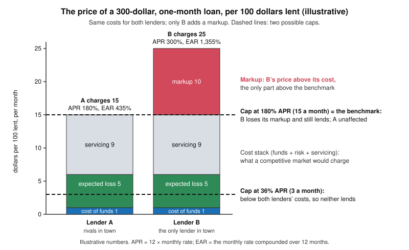

# Philosophy of Debt · Lesson 3.2: Predatory lending and usury caps

> ⏱ ~15 min · Module 3: Exploitation, domination and the vulnerable borrower · Builds on: [3.1 What exploitation is](03-01-what-exploitation-is.md), [2.3 Justifying interest](02-03-justifying-interest.md) · Unlocks: [3.3 What may be pledged](03-03-what-may-be-pledged.md)

## Why this matters

A payday loan is Module 3's hard case. The borrower asks for it, signs it and, by her own lights, is better off that week for having it. Yet its fee, stated as an annual rate, runs to hundreds of percent. Legislatures have answered with usury caps for centuries. Adam Smith, the great critic of meddling in trade, defended one, and Jeremy Bentham answered him in *Defence of Usury* (1787). This lesson applies [3.1](03-01-what-exploitation-is.md)'s account of [exploitation](../reference.md#exploitation) to high-cost credit, then asks: does condemning a loan license forbidding it?

## The idea

Keep two questions apart.

**Does the lender wrong the borrower?** On Wertheimer's account ([3.1](03-01-what-exploitation-is.md)), a lender exploits when it takes an unfair share of the gains, measured against [fair market value](../reference.md#fair-market-value): the price a competitive market would set if no one were under undue pressure or short of information. So the charge is never "the rate is high", only "the rate is above the benchmark". And a small, short loan is expensive even at cost: its price stacks the cost of funds, the expected default loss and a fixed cost of making and collecting it, large per dollar when the loan is small ([2.3](02-03-justifying-interest.md)'s [rate decomposition](../reference.md#rate-decomposition) plus a servicing cost). Pricing that tracks this stack is **risk-based pricing**. Anything above it is a **markup**, which a lender can add when borrowers are desperate or cannot shop. Only the markup raises the exploitation question.

**May the state forbid the loan?** A cap makes no one lend; it only stops loans priced above the line. So a cap either **reprices** such a loan, if its cost is below the cap, or **rations** it, if its cost is above: the loan is not made.

Bentham listed the reasons for a cap in order to knock each down (Letter I). Apart from "prevention of usury", they sort into three kinds:

- **Exploitation:** protect the needy from extortion by lenders.
- **Paternalism:** protect prodigals and the naive from their own choices. A cap binds the fully informed too, so for them it is *hard* [paternalism](../reference.md#paternalism) ([`political-philosophy`](../../political-philosophy/syllabus.md) 3.3).
- **Social allocation:** keep the nation's capital away from rash "projectors". This is Smith's reason, about third parties rather than the borrower.

Modern Catholic teaching makes the exploitation argument with a different benchmark: it condemns as usury profit drawn from need at rates beyond the borrower's reach, measuring a rate by what the borrower can bear, not by what the loan costs ([`theology-of-debt` 6.1](../../theology-of-debt/lessons/06-01-usury-and-finance-in-modern-teaching.md)).

## Source

Smith, *Wealth of Nations*, Book II, ch. 4, on setting the legal maximum rate:

> If it is fixed precisely at the lowest market price, it ruins, with honest people who respect the laws of their country, the credit of all those who cannot give the very best security, and obliges them to have recourse to exorbitant usurers. … If the legal rate of interest in Great Britain, for example, was fixed so high as eight or ten per cent. the greater part of the money which was to be lent, would be lent to prodigals and projectors, who alone would be willing to give this high interest.

Bentham, *Defence of Usury*, Letter XIII, "To Dr. Smith" (1787; 4th edition, 1818):

> I have made it, I hope, pretty apparent, that these restraints have no power or tendency to pick out bad projects from the good.

Smith's first sentence concedes Bentham's mechanism: set the cap at the best borrowers' rate and everyone else is cut off, not repriced. "With honest people who respect the laws" means *among law-abiding lenders*; the rationed borrower ends up with "exorbitant usurers", who break the law and charge for the risk. The second wants rationing, aimed at the right people: at 8 or 10 percent, only those who will waste the money bid. So Smith's cap, a little above what the safest borrowers pay, is built to ration ([prodigals and projectors](../reference.md#prodigals-and-projectors)). Bentham grants the mechanism and denies that it hits its target. A "projector", as he reads Smith, is anyone trying something new, and every new venture is riskier than an old trade, so the cap screens out invention along with folly. The crux is empirical: who borrows at high rates?

## The argument

**The exploitation argument for a cap** (a reconstruction, not any one author's):

1. **P1.** A lender exploits a borrower when the loan's terms give it an unfair share of the gains, measured against fair market value. *(Conceptual.)* *In words:* exploitation is a price above the fair price, not a high price.
2. **P2.** Some high-cost lenders charge well above that benchmark, because their borrowers are desperate, uninformed or without alternatives. *(Empirical.)*
3. **P3.** The state may forbid exploitative terms even when both parties consent and both gain. *(Normative.)* *In words:* exploitation's moral weight (how wrong it is) carries moral force (reasons for others, here the state, to act), in Wertheimer's terms ([moral weight and moral force](../reference.md#moral-weight-and-moral-force)).
4. **P4.** A cap at the benchmark removes the markup and leaves the loan, since a lender that covers its costs at the fair price keeps lending. *(Empirical.)* *In words:* the cap reprices; it does not ration.
5. **∴ C.** The state may cap rates at the benchmark.

**The reply: the [non-worseness claim](../reference.md#non-worseness-claim).** When a lender had a right not to lend at all, and the loan is consensual, mutually advantageous and harms no third party, lending cannot be worse than not lending. Wertheimer stated the claim (*Exploitation*, 1996), and Matt Zwolinski has defended it in work on price gouging (2008, 2009). The 300-percent lender does more for the borrower than the lender who stays away, whom no one blames. A cap that ends the loan leaves her with the need that drove her to borrow and one option fewer. Bentham said as much: as long as the borrower's net gain comes to anything at all, he is "just so much the better for borrowing, even on such comparatively disadvantageous terms" (Letter IV). The claim is contested: the *Stanford Encyclopedia* reports that most exploitation theorists doubt it, since it would make blaming a price gouger a mistake when we would not blame him for staying home. Accepting it need not excuse the gouger; it may instead show that staying home is worse than we thought.

**Where the argument is weakest.** P4, with P2 behind it. The critic, Bentham then and the claim's defenders now, says a cap reprices only where the lender has a markup to lose. Wertheimer himself allows a strategic argument for banning exploitative terms: it works against a monopolist, who would rather lend at a fair price than not at all, and fails in a competitive market, where the price already is the cost. So P4 holds or fails market by market, and a cap set below cost turns C into a ban. A second critic attacks P3: only harm or a violated right licenses the state to forbid, and a loan both parties want involves neither. A cap's defender can concede P4 and switch to paternalism, if borrowers' choices are defective, or to Smith's social reason. Neither needs P4, because rationing is their point. Neither is an exploitation argument.

## The decomposition

Two illustrative lenders make 300-dollar, one-month loans at the same cost per 100 dollars a month: 1 for funds (including a normal return), 5 for expected default, and 9 for servicing, a 27-dollar fixed cost spread over 300 dollars. That stack, 15, is what a competitive market without undue pressure would charge: the benchmark. A has rivals and charges 15; B, the only lender in its town, charges 25.

## Worked examples

**Example 1 (clean): two lenders, two caps.** The APR multiplies the monthly rate by 12, so A's is $12 \times 15\% = 180\%$ and B's is 300%. The [effective annual rate](../reference.md#effective-annual-rate) compounds instead: with monthly rate $i$, EAR $= (1+i)^{12} - 1$. A's is $1.15^{12} - 1 \approx 4.350$, about 435%, and B's is $1.25^{12} - 1 \approx 13.552$, about 1,355%. The EAR is what a year costs if each fee is itself borrowed: $300 \times 1.15^{12} \approx 1{,}605$ dollars owed. Paying each 45-dollar fee in cash for a year costs $12 \times 45 = 540$ dollars, the APR's 180%.

- **Wertheimer's test.** A charges the benchmark, so on his account A does not exploit, whatever its APR. B takes 10 of every 25 above the benchmark, 30 dollars a loan. If the loan is worth more to the borrower than its 75-dollar fee, that is mutually advantageous exploitation.
- **A cap at 36% APR** (3 dollars per 100 a month) sits below both lenders' costs. Neither lends, P4 fails, and the non-worseness claim bites on both sets of borrowers. A defender of this cap must say what those borrowers are left with; Allen Wood's alternative is to attack the need itself, say by redistribution, since a ban leaves the vulnerability untouched.
- **A cap at 180% APR** (15) leaves A alone. B still covers its costs, including a normal return, at 15, so the strategic argument predicts that B lends at A's price. B's borrowers get a fairer loan rather than none: P4 holds, and the non-worseness claim, which compares a loan with *no* loan, has nothing to bite on.

**Example 2 (hard): the rollover.** Dana (invented) borrows 300 dollars from A for a car repair, expecting to repay in a month. Each month she can pay the 45-dollar fee but not the principal, so she renews. After six months she has paid $6 \times 45 = 270$ dollars and still owes 300. Suppose, as critics charge of payday lenders, that A earns most of its revenue from borrowers like Dana.

Every renewal passes the price test, since 15 is the benchmark; if there is a wrong, it lies in the chain. Fair market value, for Wertheimer, also rules out taking special advantage of the other party's decision-making (1996, p. 232). A business that profits because borrowers predictably expect to repay in a month, and don't, may fail that clause without any price above the benchmark. Here the transactional account strains: it grades prices, and the complaint is about design. The non-worseness claim strains too. Each renewal beats defaulting, so each is mutually advantageous; whether the chain was, and whether agreeing to one month is agreeing to six, is exactly what the two sides dispute. The remedies follow the diagnosis. Tools aimed at the misprediction, such as a warning of how long borrowers typically stay in debt, or instalments unless she opts out, are soft paternalism. A rate cap binds Dana's clear-sighted neighbour too.

## Watch out

- **You might think "predatory" means "expensive".** On a benchmark account, a rate exploits only by exceeding fair market value. A's 180% may be fair, while a 20% loan from the only lender on an island may exploit. Whether a rate is above the benchmark is an empirical question about costs; whether that is wrong is a normative one. A fair price can still crush a poor borrower, since poverty raises risk and cost per dollar. That complaint is about the background, which a Marxian structural account ([2.4](02-04-marx-interest-bearing-capital.md)) aims at and a transactional account does not reach.
- **You might think the non-worseness claim shows exploitation is harmless.** It compares a loan with no loan. It says nothing against a fairer loan, and it bears first on how wrong the lender is (moral weight), not on what the state may do (moral force).
- **You might think "caps hurt the poor" and "caps protect the poor" are rival moral views.** Mostly they are rival predictions about whether a cap reprices or rations in a given market, each dressed as a conclusion. A historical claim ("every civilized society has capped usury") settles neither. Name which kind of claim is doing the work.

## One-liner

> An exploitation argument for a usury cap works only where the cap reprices a markup; where it rations, the case must turn paternalist or social and say what the rationed are left with, and which case you face is a fact about costs.

## Problems

**P1 (🟢) *(Formal (a)–(b) · Exegetical (c))*** An **invented** storefront lender makes one-month, single-payment loans. Each loan costs it 20 dollars to make and collect, whatever its size. Expected default losses are 1.5% of principal a month, and its funds, including a normal return, cost 0.5% of principal a month.
(a) Find the break-even monthly rate on a 250-dollar loan, and its APR and EAR.
(b) A state caps all loans at 36% APR. What is the smallest one-month loan this lender can make without losing money?
(c) Does the cap reprice or ration the 250-dollar loan, and which premise of "The argument" does your answer bear on? Two sentences.

**P2 (🟡) *(Exegetical)*** Diagnose this **invented** op-ed paragraph, not the words of any real person:

> "A loan at 300 percent is theft with paperwork. No one who understood the terms would sign, so the people who sign plainly don't understand them, and the state must protect them from their own mistakes. And a 36 percent cap costs the poor nothing: the lenders will simply earn less."

(a) The paragraph runs three claims together. Classify each as an exploitation claim, a paternalist claim or an empirical prediction, and quote the words that carry it. (b) Which claim does the non-worseness reply target, and what would have to be true of lenders' costs for that claim to hold? 150 words or fewer in all.

**P3 (🔴, optional) *(Evaluative)*** (a) Build a lending case, not a payday loan or a rollover, that meets all four conditions of the non-worseness claim: the lender had a right not to lend, the loan is consensual, both parties gain, and no third party is harmed. Make it a case in which you judge that lending on these terms is worse than not lending, or argue that no such case can be built. (b) Give the strongest reply a defender of the claim would make, and say whether your case gives the state a reason to forbid the loan or only a reason to blame the lender. 150 words or fewer. Any verdict passes.

Solutions

**P1** *(Formal (a)–(b) · Exegetical (c))*

(a) The fixed cost per dollar is $20/250 = 8\%$. Break-even monthly rate $= 8\% + 1.5\% + 0.5\% = 10\%$. APR $= 12 \times 10\% = 120\%$. EAR $= 1.10^{12} - 1 = 3.1384 - 1 \approx 213.8\%$.

(b) The cap allows $36\%/12 = 3\%$ a month. The lender breaks even when $20/L + 1.5\% + 0.5\% \le 3\%$, so $20/L \le 1\%$ and $L \ge 2{,}000$ dollars. Check: $20/2{,}000 + 2\% = 3\%$. At the cap the lender would lose $(10\% - 3\%) \times 250 = 17.50$ dollars on each 250-dollar loan.

**Must hit, strict (a)–(b):** 10% a month; APR 120%; EAR about 214%; smallest loan 2,000 dollars.
**Must hit, strict (c):** it **rations**. The loan costs 10% a month to make and the cap allows 3%, so a lender with these costs will not make it at any lawful price. The premise is **P4** (a cap removes the markup and leaves the loan), which fails here because there is no markup to remove. In effect the cap sets a minimum loan size.
**Wrong turns:** treating 36% as a monthly rate; computing the EAR as $12 \times 10\%$; forgetting that the fixed cost per dollar falls as the loan grows; calling the 250-dollar loan exploitative because its APR is 120%, when it is priced at cost.
**Model answer (c):** It rations: breaking even takes 10% a month and the cap allows 3%, so no lender with these costs makes the loan. That falsifies P4 for this loan, since there is no markup for the cap to remove.

---

**P2** *(Exegetical)*

**Must hit, strict (a):**
- **Exploitation claim:** "theft with paperwork". It condemns the rate itself, with no benchmark, but 300% exploits only if it exceeds fair market value for that loan. ("Theft" also blurs exploitation into fraud or coercion, which [3.1](03-01-what-exploitation-is.md) keeps apart.)
- **Paternalist claim:** "No one who understood the terms would sign … protect them from their own mistakes." It infers ignorance from the choice itself, which begs the question against Bentham's informed, needy borrower. Where borrowers really do misunderstand, the matching remedy is soft (inform, correct); a cap also binds the informed, so for them it is hard paternalism.
- **Empirical prediction:** "costs the poor nothing: the lenders will simply earn less". It predicts that the cap reprices rather than rations.

**Must hit, strict (b):** the non-worseness reply targets the prediction. If the cap rations, borrowers lose loans they preferred to none, so the cap is not costless to them. The prediction holds only if lenders' full costs (funds, expected loss, servicing) for these loans are at or below 36% APR, so that everything above 36% is markup. P1 shows how the fixed cost of a small loan makes that doubtful.
**Wrong turns:** grading the op-ed's verdict; filing "protect them from their own mistakes" under exploitation, when it concerns the borrower's choice, not the lender's advantage; saying the non-worseness claim denies that such loans exploit, when it grants that and denies only that they are worse than no loan.
**Model answer:** (a) "Theft with paperwork" is an exploitation charge, but it reads exploitation off the rate alone, with no benchmark. "No one who understood … their own mistakes" is paternalist. It infers ignorance from the signing, when an informed borrower in need might rationally accept, and a cap overrides informed borrowers too, which makes it hard paternalism for them. "Costs the poor nothing: the lenders will simply earn less" is an empirical prediction that the cap reprices. (b) The non-worseness reply targets that prediction. It is true only where lenders' costs sit at or below 36% and the rest is markup. Where small loans cost more than that to make, the cap rations, and borrowers lose loans they preferred to none.

---

**P3** *(Evaluative: graded on moves, not verdict)*

**Must hit, any verdict:**
- A case that meets **all four** conditions (the lender was free not to lend; consent; mutual advantage; no third-party harm), or an argument that every apparent counterexample breaks one of them.
- A judgment with a reason: why lending on these terms is worse than not lending, or why it is not.
- The defender's reply, stated at strength: either the case breaks a condition (a lender who alone can rescue, at trivial cost, may have had no right not to lend), or not lending is worse than we thought, so the lender is no worse than a bystander.
- Weight and force kept apart: blame versus prohibition, and whether a ban here would reprice (a lender with market power) or ration.

**Wrong turns:** a case that turns on fraud, coercion or harm to third parties, which falls outside the claim rather than refuting it; moving from "worse" straight to "should be banned".
**Model answer (one of several):** A collector learns that his neighbour must find 1,000 dollars by Friday to keep her shop, and no bank can lend in time. He owes her nothing and could profit at 8%, but demands 60%. She accepts, since the shop is worth far more. Both gain, and no one else is touched. I judge this worse than refusing: a refusal leaves her need alone, while this loan turns her need into his income. The defender replies that she prefers his loan to his refusal, so my verdict condemns the one person who helped; if the loan is wrong, refusing is worse than we thought. That is a verdict on weight: he deserves blame. On force: as the only lender in reach, he would likely lend at a capped fair rate rather than not at all, so the state has a reason to forbid these terms, not the loan.

## Flashback

**From Lesson [2.4](02-04-marx-interest-bearing-capital.md) (Marx: interest-bearing capital):** *(Exegetical (a) · Evaluative (b).)* An invented case. The workers at a family-owned steel mill belong to a pension fund, which holds the bonds that paid for the mill's expansion. The mill pays the fund 4 percent a year on the bonds, and that income will pay the workers' pensions. A critic says: "Here Marx's account of interest breaks down. The interest flows back to the very workers who produced it, so they are not exploited."

(a) On 2.4's reconstruction, where does the 4 percent come from, and by what title does the fund receive it? **Two sentences.** (b) Assess the critic's inference, and say what the case shows about "ownership, not function". **Any verdict; 100 words or fewer.**

Solution

**Must hit, strict (a):** the 4 percent is a slice of the **surplus value** the mill's workers produce beyond the value of their labour-power, paid out of the mill's profit to the owner of the borrowed money (2.4's premises 1 and 4). The fund's title is **ownership** of that money: as lender it performs no function in making steel (premise 6).

**Must hit, any verdict (b):**
- **The slide named:** from "the interest reaches the producers" to "the producers are not exploited".
- **2.4 run on it:** exploitation happens in production and is measured by the rate of surplus value, which no later division of the surplus changes. The interest is only one slice of the surplus, and the profit of enterprise still goes to the family that runs the mill.
- **"Ownership, not function" read as a title, not a class of people:** the workers draw the interest as owners, as C in 2.4's Example 1 books interest to himself as owner. On the account, the fund shares in the exploitation of its own members.
- **A verdict with a reason:** whether the case leaves the account standing, or blunts its normative charge for the slice that returns to those who produced it.

**Wrong turns:** saying the interest comes from the new plant itself, as if capital bore interest the way a pear tree bears pears: that is the appearance 2.4's Source diagnoses. Making the fund's title its members' saving, which is Senior's answer, not Marx's. Concluding that the account applies only when lender and worker are different people.

**Model answer ((b) is one of several):** (a) The 4 percent is part of the surplus value the steelworkers produce beyond the value of their labour-power, paid out of the mill's profit to whoever owns the borrowed money. The fund receives it by ownership alone, since as lender it does nothing to make steel. (b) The critic slides from "the interest reaches the producers" to "the producers are not exploited". On 2.4's account exploitation happens in production, at the rate of surplus value, which no division of the surplus alters, and the profit of enterprise still goes to the mill's owners. The workers draw the 4 percent as owners, as C in 2.4's Example 1 books interest to himself: "ownership, not function" names a title, not a class of people, so the fund shares in its own members' exploitation. Verdict: the account survives, but its normative sting weakens for the slice that comes home.

## Connections

- **Backward:** [3.1](03-01-what-exploitation-is.md) supplied the benchmark and the line between harmful and mutually advantageous exploitation; here they meet a price list. [2.3](02-03-justifying-interest.md)'s decomposition gains a servicing cost and a markup, and only the markup raises the exploitation question. The Marxian structural account ([2.4](02-04-marx-interest-bearing-capital.md)) is the rival view of a borrower whose fair price still crushes her.
- **Forward:** [3.3](03-03-what-may-be-pledged.md) asks what a borrower may put up as security. [5.2](05-02-moral-hazard-and-fairness-to-those-who-paid.md) asks whether relief is owed as compensation for predatory loans. Module 3's boss problem prices a two-week payday loan with rollovers and asks the cap question in full.
- **Sideways (the debt thread):** [`history-of-debt` 6.5](../../history-of-debt/lessons/06-05-student-and-consumer-debt.md) shows American rate ceilings being exported away after *Marquette* (1978). [`theology-of-debt` 6.1](../../theology-of-debt/lessons/06-01-usury-and-finance-in-modern-teaching.md) holds the Catholic position on usury as lending that feeds on need. [`economics-of-debt`](../../economics-of-debt/syllabus.md) 1.2 formalizes the selection effect Smith saw as credit rationing (Stiglitz–Weiss). The lemons logic behind it is [grad-micro 5.1](../../grad-micro/lessons/05-01-adverse-selection-lemons.md), and B's markup is [grad-micro 6.1](../../grad-micro/lessons/06-01-monopoly-price-discrimination.md)'s monopoly pricing. Present bias and nudges belong to [`philosophy-of-economics`](../../philosophy-of-economics/syllabus.md) 2.2–2.3, and its 5.3 runs the non-worseness claim on price gouging and sweatshops.
