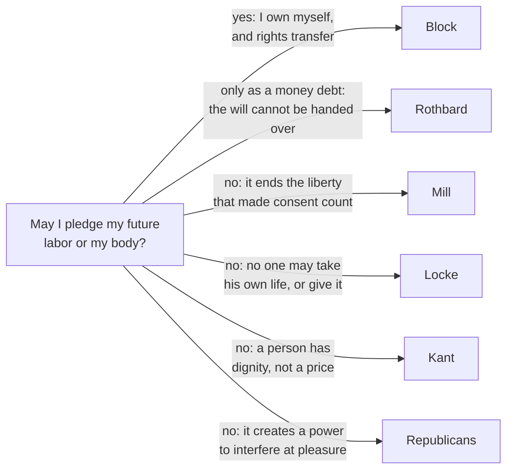

# Philosophy of Debt · Lesson 3.3: What may be pledged

> ⏱ ~15 min · Module 3: Exploitation, domination and the vulnerable borrower · Builds on: [3.1 What exploitation is](03-01-what-exploitation-is.md), [3.2 Predatory lending and usury caps](03-02-predatory-lending-and-usury-caps.md) · Unlocks: [4.1 The animal with the right to make promises](04-01-the-animal-with-the-right-to-make-promises.md), [5.3 Bankruptcy as a moral institution](05-03-bankruptcy-as-a-moral-institution.md)

## Why this matters

Economists ask what a borrower *can* pledge. She can promise away part of her future returns, but not her skills, which walk out the door with her ([`economics-of-debt` 1.3](../../economics-of-debt/lessons/01-03-pledgeable-income-collateral-and-monitors.md)). This lesson asks what she *may* pledge, and legal orders have long kept lists. Solon banned loans on the person, and Rome made goods, not the body, the security ([`history-of-debt` 1.4](../../history-of-debt/lessons/01-04-solons-shaking-off-of-burdens.md), [1.5](../../history-of-debt/lessons/01-05-nexum-and-the-roman-plebs.md)). Deuteronomy's creditor may not take a millstone ([`theology-of-debt` 1.1](../../theology-of-debt/lessons/01-01-lending-in-the-covenant.md)). A US Federal Trade Commission rule of 1984 still bars the lenders it covers from taking most assignments of future wages, or a lien on household goods the borrower already owns and keeps, wedding rings included. The lists agree more than their reasons do. [3.1](03-01-what-exploitation-is.md) and [3.2](03-02-predatory-lending-and-usury-caps.md) asked when a loan's *price* is unfair. This lesson asks when its *security* is.

## The idea

A **pledge** is what a creditor may take if you do not pay. Two questions sort pledges.

*What does it do for the creditor?* A car on a car loan is **value** collateral: on default the lender sells it and gets his money back. A grandmother's watch at a pawnshop is different. It fetches little, but its owner will pay a lot not to lose it, so it works by threat, not by sale. Call that a [**hostage**](../reference.md#hostage-collateral).

*What is pledged?* A thing, a share of future income, future labor, or the body. The contested line runs between the first two and the last two ([pledging future labor](../reference.md#pledging-future-labor)). A thing can be handed over, and taking it ends the matter. Future labor exists only as what you will do, so it cannot be handed over now. It can only be *commanded*, day after day, which is why labor pledges have needed force or criminal law behind them (*nexum* in [1.5](../../history-of-debt/lessons/01-05-nexum-and-the-roman-plebs.md), peonage in [`history-of-debt` 4.3](../../history-of-debt/lessons/04-03-debt-peonage-after-slavery.md)). A claim on income sits near the line: a wage assignment takes a share of what you earn but leaves you to decide whether and how to work.

The law's word for "never" is [**inalienability**](../reference.md#inalienability). Guido Calabresi and A. Douglas Melamed (1972) sorted the law's protections of what is yours into three rules: a *property rule* (no one takes it without your consent, at your price), a *liability rule* (others may take it at a price a court sets) and an *inalienability rule* (no transfer at all, even between willing parties). "What may be pledged?" asks which things belong under the third.

## Source

*The Merchant of Venice* I.iii (Project Gutenberg text). Antonio is binding himself for 3,000 ducats, lent for three months to his friend Bassanio. Shylock has just offered to take no interest, and now names the security:

> **Shylock.** This kindness will I show. / Go with me to a notary, seal me there / Your single bond; and in a merry sport, / If you repay me not on such a day, / In such a place, such sum or sums as are / Express’d in the condition, let the forfeit / Be nominated for an equal pound / Of your fair flesh, to be cut off and taken / In what part of your body pleaseth me.
>
> **Antonio.** Content, in faith, I’ll seal to such a bond, / And say there is much kindness in the Jew.

Four phrases carry [Shylock's bond](../reference.md#shylocks-bond). "Merry sport" frames it as a joke between men who expect repayment. "Forfeit" and "condition" give it the shape of a penalty: the flesh does not repay the ducats, it replaces them. "An equal pound / Of your fair flesh" is exact, and Portia will hold Shylock to that exactness. And "in what part of your body pleaseth me" gives the creditor not a thing but a choice over the debtor's body, made at his pleasure. By IV.i the written bond puts the cut next to Antonio's heart. The loan carries no interest at all, so whatever is wrong here is not the price.

## The argument

**The inalienability argument** (a reconstruction; the assembly is this lesson's).

1. **A pledge lets the creditor take the pledged good on default, without the debtor's consent at that time** *(conceptual)*. *In words:* that is what makes security secure.
2. **A thing can be taken without the debtor's cooperation, and taking it ends the matter. Future labor can only be commanded, and flesh taken only against a present will** *(conceptual)*. *In words:* collecting a car is an act on property; collecting labor or flesh is an act on a person.
3. **So a pledge of labor or of the body gives the creditor a standing power over the debtor's person, held for the life of the loan and used at his discretion** (from 1 and 2).
4. **No one may give another such a power over himself, even by free consent** *(normative)*.

∴ **A pledge of future labor or of the body is void from the start, however fair its price and however free the choice.**

Premise 4 carries the weight, and its defenders agree on little else.

- **Mill's self-defeat** ([Mill's slavery contract](../reference.md#mills-slavery-contract); *On Liberty*, 1859, ch. V; paternalism is [`political-philosophy` 3.3](../../political-philosophy/lessons/03-03-paternalism-and-legal-moralism.md)). We honor voluntary choices out of regard for liberty, and selling oneself spends all future liberty in one act: "The principle of freedom cannot require that he should be free not to be free. It is not freedom, to be allowed to alienate his freedom."
- **Locke's natural law** (*Second Treatise* §§23–24). Men are God's workmanship, and no one may take his own life: "No body can give more power than he has himself; and he that cannot take away his own life, cannot give another power over it." He accepted self-sale into limited service, like the Hebrew servant freed for a lost eye or tooth, never into a power of life and death.
- **Kant's dignity.** A person has dignity, not a price, so cannot stand as the equivalent of a sum ([`ethics` 2.3](../../ethics/lessons/02-03-humanity-autonomy-and-the-lie.md)).
- **Republican [non-domination](../reference.md#non-domination).** The wrong is the power's existence, not its use. A creditor who may cut you at pleasure dominates you even if he never would, as a benevolent master is still a master ([`political-philosophy` 3.1](../../political-philosophy/lessons/03-01-three-concepts-of-liberty.md)).

Some libertarians accept a version too. For Murray Rothbard (*The Ethics of Liberty*, 1982) the will cannot be surrendered, so rights over oneself can be waived but not alienated: you may agree to work, but no one may compel you to perform.

**Where the argument is weakest.** The phrase "even by free consent" in premise 4, attacked from two sides. Walter Block (2003) answers that self-ownership is a *right* to control one's person, not a psychological capacity, and rights can be transferred. On his view a self-owner may pledge himself, and premise 4 is paternalism wearing a principle's name. The second attack is harder. For someone with nothing, future labor is the only collateral. Void its pledge and she may get no loan at all, and [3.2](03-02-predatory-lending-and-usury-caps.md)'s [non-worseness claim](../reference.md#non-worseness-claim) asks how that leaves her better off. The defender's best reply is empirical: once self-pledge is lawful, lenders demand it of everyone in need, so the class is worse off even if each loan helps. Premise 4 cannot settle that claim about credit markets.

## Map of positions

The four noes agree about Shylock and split at the edges. Mill's objection shrinks with the pledge: he granted that the necessities of life require consenting to limits on freedom, and a year's service is not a life. The republican objection grows with the creditor's discretion, whatever is pledged.

## Worked examples

**Example 1 (clean: a car or a year of work).** Two borrowers each need 2,000 dollars (illustrative). Ana pledges her car. Ben owns nothing, so he signs that if he defaults he will work a year on the lender's farm.

- *Ana:* a thing, and value collateral. On default the lender repossesses and sells, and the relation ends. Premise 2 puts it on the property side, so premise 4 never engages.
- *Ben:* future labor. Default hands the lender a year's command over him: when he rises, where he goes, what he does. Premises 1–3 apply. The republican objects at full strength, since for a year Ben could not leave. Mill objects only in part. Locke accepts limited service so long as the lender has no power over Ben's life or limbs.
- *The law's line* is the one [`history-of-debt` 4.3](../../history-of-debt/lessons/04-03-debt-peonage-after-slavery.md) found in the peonage cases: Ben may choose to work the debt off, but he must stay free to quit and be sued instead. The pledge survives only as a debt of money, which is Rothbard's line too.

**Example 2 (hard: Venice's court, IV.i).** On the argument, Shylock's bond is void at the notary's table. Venice has no such rule, and Antonio has said why the Duke cannot simply refuse: the city's trade depends on strangers trusting its courts (III.iii). So Portia holds the bond forfeit and the claim lawful, then reads it to the letter:

> This bond doth give thee here no jot of blood. / The words expressly are “a pound of flesh”

Shylock must take flesh without blood, and exactly a pound. When he retreats to the money he is refused it. A statute against any *alien* who seeks a citizen's life then forfeits his goods and puts his life at the Duke's mercy, and the pardon he receives comes with a forced conversion.

The argument strains twice. First, the rescue is not the argument's. The court never says flesh is unpledgeable; it upholds the pledge and defeats it by construction. The German jurist Rudolf von Jhering held that the court should have voided the bond from the start as contrary to good morals, and that once it had upheld the bond, the blood reading cheated Shylock, however humane the motive (*The Struggle for Law*, trans. Lalor, 1879). Second, Shylock turns premise 4 on Venice. Venetians own bought slaves and would never free them on demand. He bought his pound of flesh too, and if the law refuses it, the law has no force. A city that lets persons be bought cannot assert premise 4 without condemning itself. And a court that decides after the fact which bonds to honor, under a statute that binds only aliens, holds the discretionary power the argument forbids to creditors. A defender replies that this is a reason to state the rule in advance and for everyone, not to drop it.

## Watch out

- **You might think "human capital is inalienable" in economics is this lesson's claim.** In [`economics-of-debt` 1.3](../../economics-of-debt/lessons/01-03-pledgeable-income-collateral-and-monitors.md) (after Hart and Moore, 1994) it is *empirical*: a lender cannot make you work, because you can always walk away. Here it is *normative*: the law should not help him try. Peonage is the empirical claim made false by criminal law.
- **You might think Shylock's bond wrongs Antonio by exploiting him.** The loan carries no interest, so on [3.1](03-01-what-exploitation-is.md)'s transactional account of [exploitation](../reference.md#exploitation) the priced gains all go to Antonio: he borrows for nothing. If the bond wrongs him, the wrong is in the security, not the division, which makes the play this module's cleanest case.
- **You might think inalienable means you cannot part with it at all.** Inalienability comes in degrees. Many countries let you give a kidney but not sell one. The peonage cases let a debtor work off a debt but forbid holding him to the work.

## One-liner

> A loan's price can be fair and its security still wrong: taking a pledged thing ends the matter, but a pledge of labor or the body gives a creditor power over a person, and the dispute is whether any consent can confer it.

## Problems

**P1 (🟢) *(Exegetical (a) · Evaluative (b))*** Three invented pledges.

- (i) In an invented country where kidney sales are legal and regulated, Dara borrows 20,000 dollars and pledges a kidney, to be removed if she defaults.
- (ii) An investor pays Eli's tuition in return for 10% of his earnings above a floor for eight years. The contract also obliges him to "make reasonable efforts to find full-time work".
- (iii) Fen pawns her grandmother's watch, which would fetch little from anyone else, for a 150-dollar loan.

(a) For each, name what is pledged (a thing, a share of income, labor, or the body) and whether it works as value or as a hostage. **One line each.** (b) Which of the three does premise 2 of the argument leave hardest to place, and what exactly makes it hard? **Two sentences.**

**P2 (🟡) *(Exegetical (a)–(b))*** Close reading. *The Merchant of Venice* I.iii (Project Gutenberg text). Before the bond is proposed:

> **Antonio.** If thou wilt lend this money, lend it not / As to thy friends, for when did friendship take / A breed for barren metal of his friend? / But lend it rather to thine enemy, / Who if he break, thou mayst with better face / Exact the penalty.

Later, after Bassanio objects to the bond:

> **Shylock.** Pray you, tell me this, / If he should break his day, what should I gain / By the exaction of the forfeiture? / A pound of man’s flesh, taken from a man, / Is not so estimable, profitable neither, / As flesh of muttons, beefs, or goats. I say, / To buy his favour, I extend this friendship.

(a) By this lesson's distinction, what kind of security does Shylock's own description make the forfeit? Quote the words that decide it. **Two sentences.** (b) Shylock offers the forfeit's worthlessness as a reason Antonio need not fear it. Why does that reason fail on the lesson's account of a hostage, and which words of Antonio's show he already expects a creditor to exact a penalty for something other than gain? **Three sentences.**

**P3 (🔴, optional) *(Evaluative.)*** Counterexample. *"Anything you own and may lawfully sell, you may pledge."* (a) Build a case, not from this lesson, of something the pledgor clearly owns and may sell that you judge should not be pledgeable, *or* argue that the principle survives the best such case you can build. (b) Say why the objection attaches to pledging rather than to selling. (c) State the freedom-of-contract reply in one sentence and say whether your case survives it. **150 words or fewer in total.** Any verdict; you are graded on the moves.

Solutions

**P1** *(Exegetical (a) · Evaluative (b))*

**Must hit, strict (a):**
- (i) **The body; value.** Kidneys sell lawfully there, so the lender can recover by sale. Adding "a hostage too" is acceptable if the answer names the market price as what makes it value.
- (ii) **A share of future income; value.** The investor recovers from Eli's pay. The work clause is not, by itself, a pledge of labor; that is (b)'s question.
- (iii) **A thing; a hostage.** It fetches little, so it works through what Fen will pay to keep it.

**Must hit, any verdict (b):**
- Pick one case and name a feature on *each* side of premise 2's line: what makes it property-like, and what makes it person-like.
- Say what fact would settle it. For the income-share agreement: whether the work clause can be enforced only by money damages or by compelling Eli to work. For the kidney: that collection needs surgery against a present will, even where a sale needs present consent.

**Wrong turns:** calling the income-share agreement a pledge of labor outright, when a claim on earnings leaves Eli to choose whether and how to work. Calling the watch value collateral because Fen values it, when value collateral means value *to the creditor*. Picking the watch for (b) because it is "personal": premise 2 asks whether *collecting* the pledge acts on the person, and taking a watch does not. Treating the legality of kidney *sales* as settling the *pledge*: a sale is performed with the seller's consent on the day, and a pledge is collected without it.

**Model answer:** (a) (i) The body, as value collateral, since kidneys sell lawfully there. (ii) A share of future income, as value collateral, recovered from his pay. (iii) A thing, as a hostage: it fetches little, but Fen will pay a lot to keep it. (b), one of several: The income-share agreement is hardest, because a claim on a share of Eli's pay leaves him to decide whether and how to work, which is the property side of premise 2, while "reasonable efforts to find full-time work" reaches his labor itself. If that clause can be enforced only by damages it stays on the property side, and if the investor can compel him to seek work it crosses to the person side.

---

**P2** *(Exegetical (a)–(b))*

**Must hit, strict (a):** a **hostage**, and a pledge of **the body**. The deciding words are "what should I gain / By the exaction of the forfeiture?" and "not so estimable, profitable neither, / As flesh of muttons, beefs, or goats". The flesh is worth nothing to the creditor, so it cannot secure the loan by sale, only by the threat to Antonio.

**Must hit, strict (b):**
- A hostage secures only if the debtor believes it may be taken. Worthlessness removes the creditor's *gain* from exacting the forfeit, not his *power* to exact it. So either the bond secures nothing (it really is a jest), or Shylock is prepared to take what gains him nothing, which means taking it for some reason other than recovery.
- Antonio's "lend it rather to thine enemy, / Who if he break, thou mayst with better face / Exact the penalty". He expects an enemy creditor to exact a penalty with a clear conscience, from enmity rather than for profit.

**Wrong turns:** reading "friendship" and "To buy his favour" as settling that the forfeit is harmless. That is Shylock's framing, and (b) asks whether it follows. Calling the flesh value collateral because a pound is a measured quantity. Answering (b) with "A breed for barren metal": that is Antonio's objection to *interest* (Aristotle's barren money, [2.1](02-01-aristotle-money-is-barren.md)), which explains why no interest is charged, not why a penalty would be exacted.

**Model answer:** (a) A hostage, and a pledge of the body. Shylock himself says the flesh is worth less than mutton ("what should I gain / By the exaction of the forfeiture?"), so it cannot repay him by sale and can work only as a threat to Antonio. (b) A hostage secures only if the debtor believes it may be taken, so a forfeit that gains the creditor nothing is either no security at all or one he means to exact for some reason other than gain. Its worthlessness removes his profit from exacting it, not his power to. Antonio has already named such a reason: an enemy may "with better face / Exact the penalty".

---

**P3** *(Evaluative)*

**Must hit, any verdict:**
- A case in which ownership and lawful sale are both clear: not the body or future labor, not stolen goods, not something whose sale is itself banned.
- The asymmetry, attached to *pledging*. A sale is present, certain and consented to when it happens. A pledge's loss is deferred and contingent, is collected without present consent, and often falls when the debtor is weakest. Alternatively (or as well), the thing works as a hostage, giving the creditor leverage beyond its value to him.
- The freedom-of-contract reply stated fairly: the owner is the best judge of her own risks, and a ban may leave her with no loan or a worse one (the non-worseness claim of [3.2](03-02-predatory-lending-and-usury-caps.md)). Then a verdict on whether the case survives, with a reason.

**Wrong turns:** using the body or future labor. The problem asks for something the pledgor *clearly* owns, and whether you own yourself is exactly what Block and his critics dispute; Block would accept the pledge anyway. Giving an objection that applies equally to selling: that is a counterexample to "anything you own you may sell", not to the pledge principle.

**Model answer (one of several):** Nadia owns her power wheelchair outright and may sell it, though she never would without a replacement. A lender offers 500 dollars (illustrative), secured by the chair and repossessable on default. A sale would be a present exchange at a price she accepts. The pledge's cost falls later, if at all, when she is poorest, and meanwhile the lender holds a threat over her mobility worth far more to her than the chair's resale value is to him: a hostage. Her signature shows how unlikely she thinks default is, not that losing the chair is bearable. The freedom-of-contract reply: she knows her risks better than a legislator, and a ban may leave her with no loan or a worse one. I think the case survives, but as an argument for a narrower rule: the lender may sue for the money but not take the chair.

## Flashback

**From Lesson [3.1](03-01-what-exploitation-is.md) (What exploitation is):** *(Exegetical.)* An **invented** blog post by a lender, not the words of any real person:

> "Stop calling me a loan shark. Nobody forced Hanna to borrow; she came to me. She left with the 2,000 dollars that saved her roof, so she is better off than if I had said no. She read and signed every term, so the price was fair by definition. And 20 percent for the month is what money cost in this valley the week the pass was closed. The market is the market."

(a) Name the charge each of the first three defenses answers, and say why none of them answers a charge of exploitation on Wertheimer's account. (b) The last defense is the only one aimed at that charge. Say what "the market" must mean for it to succeed, and what fact would settle whether it does. **100 words or fewer in all.**

Solution

**Must hit, strict (a):** "Nobody forced Hanna" answers **coercion**, "better off than if I had said no" answers **harm**, and "read and signed every term" answers **fraud**. None reaches exploitation, which is an unfair division of the gains: an offer freely accepted is not coerced, the borrower is measured against fair terms rather than against no loan, and full disclosure leaves the split untouched. "So the price was fair by definition" is the step from consent to fairness that Wertheimer denies: exploitation can be consensual.

**Must hit, strict (b):** "The market" must mean the rate a competitive market would set for borrowers like her that week. Money scarce across the whole valley is general scarcity, which fair market value keeps in, as Locke's merchant may sell corn in a famine town at that town's price. If it means what he could charge because she could reach no other lender, that is her special plight, which the benchmark screens out (the ship in distress), and his excess over the competitive rate is mutually advantageous, consensual exploitation. The fact that settles it: what competing lenders were charging borrowers of her risk that week, and whether she could reach them; if no one else was lending, the rate competition would leave on his own costs.

**Wrong turns:** treating 20 percent as proof of exploitation: a rate raised by valley-wide scarcity is fair market value however high it is. Measuring against an ordinary week, with the pass open. Calling her consent coerced because she needed the roof: desperation is not duress. Reading "she came to me" as settling anything: who approached whom does not bear on how the gains were split.

**Model answer:** (a) The first defense answers coercion, the second harm, the third fraud. None answers exploitation, an unfair split of the gains measured against fair terms rather than against no loan: a free, fully disclosed offer can carry it, so "fair by definition" is the step Wertheimer denies. (b) "The market" must mean what competing lenders charged borrowers like her that week, a valley-wide scarcity the benchmark keeps in. If it means what she alone paid, unable to reach other lenders, the excess is exploitation. The fact: what other lenders charged, and whether she could reach them.

## Connections

- **Backward:** [3.1](03-01-what-exploitation-is.md) judged a loan by how it divides the gains. This lesson judges it by what it lets the creditor take, and Shylock's interest-free loan pulls the two apart. [3.2](03-02-predatory-lending-and-usury-caps.md)'s non-worseness claim returns as the strongest objection to premise 4. Module 1 asked why a promise to repay binds ([1.2](01-02-hume-promises-as-artificial-obligation.md) to [1.4](01-04-contract-debt-and-the-duty-to-repay.md)). A pledge is the machinery that makes such a promise secure, and this lesson asks how far that machinery may reach.
- **Forward:** [4.1](04-01-the-animal-with-the-right-to-make-promises.md) reads the Second Essay of Nietzsche's *Genealogy*, where the earliest debtor pledges what he still has in his power (his body, his wife, his freedom, even his rest in the grave) and the creditor may cut from the body an amount matched to the debt. [5.3](05-03-bankruptcy-as-a-moral-institution.md) argues that bankruptcy's discharge protects what premise 4 protects: the debtor's future self.
- **Sideways:** the debt thread. [`history-of-debt`](../../history-of-debt/syllabus.md) supplies the episodes: Solon's ban ([1.4](../../history-of-debt/lessons/01-04-solons-shaking-off-of-burdens.md)), *nexum* and the rule of goods, not the person ([1.5](../../history-of-debt/lessons/01-05-nexum-and-the-roman-plebs.md)), and peonage ([4.3](../../history-of-debt/lessons/04-03-debt-peonage-after-slavery.md)). [`theology-of-debt` 1.1](../../theology-of-debt/lessons/01-01-lending-in-the-covenant.md) reads Deuteronomy's pledge laws (the millstone, the cloak returned by sunset) from inside the tradition. [`economics-of-debt` 1.3](../../economics-of-debt/lessons/01-03-pledgeable-income-collateral-and-monitors.md) treats pledgeable income and inalienable human capital as facts about incentives. The principles belong to [`political-philosophy`](../../political-philosophy/syllabus.md): non-domination (3.1), and paternalism with Mill's slavery contract (3.3). Portia's mercy speech in IV.i is [`philosophy-of-law`](../../philosophy-of-law/syllabus.md) 5.4's, on the paradox of mercy.
