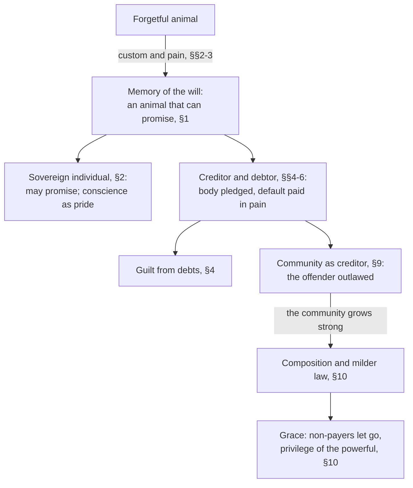

# Philosophy of Debt · Lesson 4.1: The animal with the right to make promises

> ⏱ ~15 min · Module 4: *Schuld*: debt, guilt and genealogy · Builds on: [1.2 Hume: promises as artificial obligation](01-02-hume-promises-as-artificial-obligation.md), [1.3 Promising after Hume](01-03-promising-after-hume.md), [3.3 What may be pledged](03-03-what-may-be-pledged.md) · Unlocks: [4.2 Owing the ancestors, owing God](04-02-owing-the-ancestors-owing-god.md), [4.3 Graeber's thesis examined](04-03-graebers-thesis-examined.md)

## Why this matters

Module 1 asked what makes a promise bind. Nietzsche's *Genealogy of Morals* (1887) asks an earlier question: what had to be done to a forgetful animal before it could promise at all? His answer, in §§1–10 of the Second Essay, runs through debt. Memory was burnt in by pain. The first promises anyone enforced were debtors' promises. Guilt grew out of debts, punishment out of collection, and mercy out of a creditor rich enough to write off a loss. It is the classic statement of the idea that morality began as a ledger, and Graeber's *Debt* ([4.3](04-03-graebers-thesis-examined.md)) takes it on directly. This lesson reconstructs §§1–10 and sorts their claims by kind.

## The idea

A lender's question is simple: will this person pay? It presupposes that the borrower next year is the person who promised this year, that he remembers, and that his will holds across the gap. Nietzsche thinks none of this is natural. Left alone, the human animal forgets, and healthily so: forgetting digests experience and clears room for the new. Promising needs a counter-power, a *memory of the will*, and the promiser must first be made regular and predictable, to others and to himself.

Hume ([1.2](01-02-hume-promises-as-artificial-obligation.md)) also denied that promising is natural. But he thought its point plain to anyone after very little experience of the world, and its sanction reputational: the breaker is never trusted again. Nietzsche thinks making a creature that can promise was the longest and cruellest work of prehistory. The tools were custom and pain. The scene was debt: a debtor made his promise credible by pledging his body, and a creditor facing default was paid in suffering.

One distinction before the text. This is a [genealogy](../reference.md#genealogy): a history of origins, told to change how we see what descends from them (the method belongs to [`modern-philosophy` 6.5](../../modern-philosophy/lessons/06-05-nietzsche-perspectivism-and-genealogy.md)). Whether the history is true is a historical question. What it would show about what we owe is a separate, normative one.

## Source

*Genealogy* II §1, in Horace B. Samuel's translation (1913), public domain:

> The breeding of an animal that *can promise*—is not this just that very paradox of a task which nature has set itself in regard to man? Is not this the very problem of man? … this very animal who finds it necessary to be forgetful, in whom, in fact, forgetfulness represents a force and a form of *robust* health, has reared for himself an opposition-power, a memory, with whose help forgetfulness is, in certain instances, kept in check—in the cases, namely, where promises have to be made; … an *active* refusal to get rid of it, a continuing and a wish to continue what has once been willed, an actual *memory of the will*; … how thoroughly must man have first become *calculable, disciplined, necessitated* even for himself and his own conception of himself, that, like a man entering into a promise, he could guarantee himself *as a future*.

First, "can promise" renders *versprechen darf*. The German says the animal that *may* promise: a standing, not a bare ability, hence this lesson's title. In §2 Samuel renders the same words "competent to promise". Second, forgetting is the healthy default, and memory is bred against it for one purpose, keeping promises. Third, in the last clause the promiser stands surety for himself, pledging his future self as a debtor pledges in §5.

## The argument

**Nietzsche's genealogy of the promising animal** (*Genealogy* II §§1–10; the numbering is this lesson's).

1. **Promising requires a memory of the will** (§1). The promiser keeps a past "I will" alive against active forgetting until the deed is done. *In words:* a promise is a will stretched across time.
2. **It requires a calculable self** (§§1–2). Before anyone can vouch for his future self, he must be made regular and predictable. The *morality of custom* (Samuel's term) did this over the whole of prehistory. *In words:* custom made people predictable before any one person could be trusted.
3. **The first memory was made by pain** (§3, the [mnemotechnics of pain](../reference.md#mnemotechnics-of-pain)). Nietzsche's axiom:

   > Something is burnt in so as to remain in his memory: only that which never stops *hurting* remains in his memory.

   So early pledges and obligations came wrapped in sacrifice, mutilation and savage penal law, and the harshness of old codes measures how hard forgetting was to beat. *In words:* cruelty was the first memory aid.
4. **The oldest enforced promise was a debtor's** (§§4–5). To make his promise of repayment credible, a debtor pledged what he still controlled: his body, his freedom, his wife, even his rest in the grave. On default the creditor could take an equivalent in pain, such as flesh cut in proportion to the debt. *In words:* the body was the collateral, and suffering the means of collection.
5. **Guilt descends from debts** (§§4–6). The idea that every injury has an equivalent, and can be paid off even in pain, grew from this contract. Nietzsche's challenge to earlier genealogists (§4):

   > Have these current genealogists of morals ever allowed themselves to have even the vaguest notion, for instance, that the cardinal moral idea of "ought" originates from the very material idea of "owe"?

   "Ought" is [*Schuld*](../reference.md#schuld), guilt; "owe" is *Schulden*, debts. §6 calls the law of contract the cradle of guilt, conscience and duty. Suffering could repay, Nietzsche conjectures (§6), because making someone suffer was a pleasure: the creditor was paid in a licence for cruelty. *In words:* guilt began as the defaulter's condition, and punishment as collection. (§§4–6 are compressed here; the boss problem in the [syllabus](../syllabus.md) reconstructs them step by step.)
6. **The [community is a creditor](../reference.md#community-as-creditor)** (§§8–9). Pricing and exchange are the oldest human relation, and the first justice was settling accounts between rough equals (§8). The community advances peace and protection. The criminal is a debtor who defaults *and* attacks his creditor, and the breach counts for more than the damage. So the community forecloses: it withdraws its peace and treats him as an enemy. *In words:* punishment began as expulsion from the peace.
7. **Power softens the creditor** (§10). As a community grows secure, it treats offences as payable, shields the offender from the injured party's anger, and separates the offender from his act. Weakness brings the harsh forms back. *In words:* a rich creditor can absorb a loss.

∴ **Justice ends in grace** (§10). Justice that began by holding that everything can and must be paid off ends by letting those who cannot pay go free, and its name for this is grace: [mercy as the privilege of the powerful](../reference.md#mercy-as-the-privilege-of-the-powerful). At the end of the breeding process stands the [sovereign individual](../reference.md#sovereign-individual) of §2, who *may* promise, and whose conscience is pride in his own reliability. *In words:* a ledger that began in cruelty ends in the power to let debts go, and in persons whose word needs no collateral.

**Where the argument is weakest.** P4 and P6 rest on a historical claim: that creditor and debtor, buyer and seller, are the oldest relation there is, older than any social organization (§8). The evidence offered is etymology and legal antiquities. Nietzsche himself calls his explanation of why suffering could repay a debt conjectural (§6). His Roman exhibit, the Twelve Tables' clause on cutting shares of a defaulter, is usually read literally, but Gellius's jurist, who reports it, had never heard of its use ([`history-of-debt` 1.5](../../history-of-debt/lessons/01-05-nexum-and-the-roman-plebs.md)). A critic says contract presupposes the community it is meant to explain. To lend, pledge and collect, people must already share rules about what counts as a promise, a pledge and a default. If so, guilt and debt may both descend from an older social bond, and the direction of derivation is open. That is Graeber's line, tested in [4.3](04-03-graebers-thesis-examined.md). A defender replies that the philosophical point survives a wrong chronology: morality's vocabulary bears the marks of an accounting relation, however that relation began.

## The genealogy at a glance

## Worked examples

**Example 1 (clean: one default, three settings).** An invented herder, Arn, cannot repay ten goats. Run the model.

- *A private debt (§5).* Arn pledged his body. On default the creditor takes an equivalent in pain, and what compensates him is not goats but power over someone powerless.
- *An offence against the whole (§9).* Suppose instead Arn took the goats from the common herd. Now his creditor is the community, which advanced him its peace. He has defaulted and attacked it, so it forecloses: outlawry, the *peaceless* state in which anyone may harm him.
- *A strong community (§10).* The same theft in a secure, prosperous town is priced. A fixed composition goes to the owner, and the town protects Arn from the owner's anger. A town rich enough might let him go.

The goats are the same throughout. What changes the response is who the creditor is and how much loss it can absorb.

**Example 2 (hard: a release that is owed).** §10 makes letting debtors go a luxury of the strong creditor. The Babylonian clean slate looks like its case: an act of royal power, proclaimed by a king, usually on taking the throne ([`history-of-debt` 1.2](../../history-of-debt/lessons/01-02-debt-bondage-and-the-royal-clean-slate.md)). Deuteronomy 15 fits less easily ([`history-of-debt` 1.3](../../history-of-debt/lessons/01-03-release-laws-in-ancient-israel.md)). There release comes every seventh year and binds every creditor, however modest. It forbids him to refuse the poor a loan as the year approaches, and it is framed as a duty to a brother (15:1–11), not a display of surplus power.

Nietzsche's defender has a textual reply. The chapter calls the release the Lord's (15:2), so the creditor who lets go is finally the most powerful creditor of all, and [4.2](04-02-owing-the-ancestors-owing-god.md) follows Nietzsche's account of gods as creditors. The critic answers that this makes §10 unfalsifiable, since any release can be credited to some powerful party. The strain is over what kind of claim §10 makes. As a historical generalization (law softens as communities grow secure), cases can test it, and this one pushes back. As an account of what mercy *is*, no case refutes it, and it must earn its place by what it explains. Note too that §10 is about penal law. Applying it to loans takes the model at its word that punishment and debt are one relation.

## Watch out

- **You might think Samuel's "ought" means duty.** In §§4 and 8 it translates *Schuld*, the German word for both guilt and debt; in §6 he renders the same word "guilt". "Owe" translates *Schulden*, debts, and "ower" is his word for the debtor (*Schuldner*). His own footnote explains the double rendering. Read "ought from owe" as guilt from debts. Duty, *Pflicht*, is a different word.
- **You might think Nietzsche is recommending cruelty.** He describes it, calls modern squeamishness about it hypocrisy, and in §7 claims that life was brighter before humanity grew ashamed of its cruelty. Readers dispute how far he admires it. But nothing in §§1–10 proposes reviving it, and §10 makes harshness the symptom of a weak or endangered community. (§7 also contains a racist aside about who feels pain; nothing in the argument depends on it.)
- **You might think that if guilt came from debt, guilt is "really" debt, or the duty to repay is debunked.** Those are three claims of three kinds: historical (where guilt came from), conceptual (what guilt now is) and normative (what we owe). Nietzsche himself insists (§12) that a thing's origin and its later purposes are different questions. Whether a genealogy can undermine anything without the [genetic fallacy](../reference.md#genetic-fallacy) is [4.3](04-03-graebers-thesis-examined.md)'s question.

## One-liner

> Nietzsche makes the promise a debtor's achievement: memory burnt in by pain, guilt born of debts, punishment as collection, and mercy as the luxury of a creditor strong enough to let the unpaid go.

## Problems

**P1 (🟢) *(Exegetical.)*** *Genealogy* II §2 (Samuel, 1913), on the sovereign individual:

> … the man of the personal, long, and independent will, *competent to promise* … he honours or he despises, and just as necessarily as he honours his peers, the strong and the reliable (those who can bind themselves by promises),—that is, every one who promises like a sovereign, with difficulty, rarely and slowly, who is sparing with his trusts but confers *honour* by the very fact of trusting, who gives his word as something that can be relied on, because he knows himself strong enough to keep it even in the teeth of disasters, even in the "teeth of fate,"—so with equal necessity will he have the heel of his foot ready for the lean and empty jackasses, who promise when they have no business to do so, and his rod of chastisement ready for the liar, who already breaks his word at the very minute when it is on his lips.

(a) On this passage, what qualifies someone to promise? (b) The passage scorns two kinds of promiser. Who are they, and what separates them? (c) Does the passage say that the first kind's promises do not bind? Quote the words that decide each answer. Two sentences per part.

**P2 (🟡) *(Exegetical.)*** An invented newspaper column, not the words of any real person:

> Our bankruptcy courts have gone soft. Nietzsche proved it long ago: pain is the only thing that makes a debtor remember, and conscience itself was born when creditors could carve a defaulter's flesh. A strong society, he taught, shows its strength by never letting a debt go; letting debtors off is a symptom of decline. It is time to bring back real consequences for those who do not pay.

Name three distinct errors in the column's use of Nietzsche and correct each from §§1–10 as this lesson presents them. Then name the step that would still fail if every claim about Nietzsche were accurate. 150 words or fewer.

**P3 (🔴, optional) *(Exegetical (a) · Evaluative (b).)*** An invented island settlement admits newcomers by an oath to the common compact, then feeds them from the common store through their first winter. In one week two people steal from the store. Tor was born there and has lived under the compact for forty years. Vela arrived nine days ago, swore the oath, and has eaten from the store since. The assembly's custom is outlawry: the thief is put out, and no one may shelter him. (a) On §9 as reconstructed in P6 of the argument, what does each thief owe, and to whom, and why is outlawry the response the model calls for? (b) Does the creditor model make Tor's theft graver than Vela's? Give a verdict, and say where the model stops determining one. Any verdict; 150 words or fewer for (b).

Solutions

**P1** *(Exegetical — strict.)*

**Must hit, strict:**
- (a) A strong, lasting will: the "long, and independent will" of one who "knows himself strong enough to keep it even in the teeth of disasters". The qualification is strength of will shown in how he promises ("with difficulty, rarely and slowly"), not a form of words, a social role or good intentions.
- (b) The "lean and empty jackasses, who promise when they have no business to do so", and "the liar, who already breaks his word at the very minute when it is on his lips". The first may mean what he says but lacks the strength to guarantee it, so his fault lies in promising at all. The liar never intends to keep his word. They also get different treatment: contempt ("the heel of his foot") for the first, punishment ("his rod of chastisement") for the second.
- (c) No. The passage ranks promisers by honour and contempt. It says nothing about whether the jackass's promise obliges him once made. "No business to do so" denies his *standing* to promise, not the force of what he promised. (The German is *ohne es zu dürfen*, "without being entitled to", the verb of §1's *darf*.)

**Wrong turns:** running the jackass and the liar together, when one fails in strength and the other in sincerity. Reading "no business to do so" as "his promises are void". Answering (a) with Hume's form of words ([1.2](01-02-hume-promises-as-artificial-obligation.md)), which the passage never mentions.

**Model answer:** (a) Strength of will: the sovereign has a "long, and independent will" and promises only what he "knows himself strong enough to keep … even in the teeth of disasters". That is why he promises "with difficulty, rarely and slowly". (b) The "empty jackasses" promise "when they have no business to do so", perhaps sincerely, but without the strength to make good. The liar "breaks his word at the very minute when it is on his lips", and he gets the rod where they get the heel. (c) No. "No business to do so" denies their entitlement to promise, and the passage is about whom the sovereign honours and scorns, not about what a promise already made obliges.

---

**P2** *(Exegetical — strict.)*

**Must hit, strict:** three of the first four errors, plus the failed step.
1. **"Proved."** Nietzsche calls his explanation of why suffering could repay a debt conjectural (§6), and the history under the whole essay is its weakest part.
2. **"Pain is the only thing that makes a debtor remember."** §3 says how memory was *first* made in prehistory, not what works now. The process ends (§2) in a person who keeps his word from strength of will, not fear of pain.
3. **"Shows its strength by never letting a debt go"; letting debtors off is "a symptom of decline".** This inverts §10. As a community's power grows its law softens, and letting non-payers go is the privilege of the most powerful. Harshness is what returns when a community is weakened.
4. *(Also acceptable.)* **Treating description as endorsement.** Nietzsche describes the creditor's cruelty and refuses modern squeamishness, but nothing in §§1–10 proposes reviving it.
- **The step:** "bring back real consequences" is normative. Even an accurate account of where memory or conscience came from, or of what Nietzsche approved, needs a bridge premise to reach it, such as "what first made memory is just to use now" or "what Nietzsche approved is right". The column supplies neither ([philosophical-method 2.3](../../philosophical-method/lessons/02-03-informal-fallacies-and-when-they-arent.md)).

**Wrong turns:** calling the conscience clause an error, when §6 does place the cradle of guilt, conscience and duty in the law of contract. Answering "Nietzsche was cruel, so ignore him", which is an ad hominem and corrects nothing.

**Model answer:** First, Nietzsche proved nothing: he calls his account of why suffering could repay a debt conjecture (§6). Second, §3 describes how memory was first made in prehistory. It is not a claim that only pain works now, and the essay's endpoint (§2) is a person who keeps his word from strength, not fear. Third, the column inverts §10: the stronger a community, the milder its law, and letting non-payers go is the privilege of the most powerful. Harshness returns when a community is weak. Finally, even if every claim about Nietzsche were right, "bring back real consequences" would not follow. Where a practice came from, and what a philosopher admired, cannot settle what is just now without a further premise the column never states.

---

**P3** *(Exegetical (a) — strict · Evaluative (b) — any verdict.)*

**Must hit, strict (a):** each thief owes the *community*, the creditor that advanced peace, protection and here food, against the pledge of the oath. Stealing from the store is a default *and* an attack on the creditor. The model's response is foreclosure: withdrawal of everything advanced, back into the unprotected, outlawed state where anyone may harm the offender. On §9 the direct damage, what was taken, is secondary to the breach of the covenant with the whole.

**Must hit, any verdict (b):**
- State the principle precisely: the offence is breach of the covenant with the whole, and the response withdraws everything advanced.
- Run it both ways. If the debt is measured by advances received, Tor, with forty years of them, defaults on far more. If the offence is the breach itself, both broke the same oath and earn the same outlawry, though Tor has more to lose by it.
- Say where the model stops: it has no measure of culpability (intent, need, knowledge of the rule), and it does not say how much must be advanced to make someone a full debtor.
- Name the objection a critic presses: a desert view grades offences by culpability, not by benefits received (retributivism is [`philosophy-of-law`](../../philosophy-of-law/syllabus.md) 5.2). (A Nietzschean can reply that grading by culpability is a late refinement: §4 holds that punishment long ignored whether the offender could have done otherwise.)

**Wrong turns:** measuring the offence by the amount stolen, which §9 treats as secondary. Saying Vela owes nothing because she is new: she swore the oath and ate from the store, so on the model she is a debtor.

**Model answer (b), one of several:** On §9 the offence is breaking the covenant with the whole, and the response takes back everything advanced. Read that way, the thefts are equal. Both thieves swore the same oath and both are put out, and if Tor suffers more it is because he has more to lose. Read the other way, the debt is the advances themselves, so Tor's forty years make his default larger than Vela's nine days. The model does not choose between these readings, and neither reading tracks culpability. A hungry newcomer who misread the rule and a settled member who stole for profit come out the same. That is where the model stops giving a verdict. My verdict is that the thefts are equally grave on the model, and that this is an objection to the model rather than a result.

## Flashback

**From Lesson [3.2](03-02-predatory-lending-and-usury-caps.md) (Predatory lending and usury caps):** *(Formal (a) · Exegetical (b).)* Smith, *Wealth of Nations* II.4, on laws that forbid interest outright:

> In some countries the interest of money has been prohibited by law. … This regulation, instead of preventing, has been found from experience to increase the evil of usury. The debtor being obliged to pay, not only for the use of the money, but for the risk which his creditor runs by accepting a compensation for that use, he is obliged, if one may say so, to insure his creditor from the penalties of usury.

Where interest is lawful, an **invented** lender charges its cost stack, 8 per 100 dollars lent for a month: 1 for funds (including a normal return), 3 for expected default and 4 for servicing. Then interest is banned. The lender keeps lending and its borrowers default exactly as before, but a tenth of its loans are discovered, and on those it collects nothing.

(a) What fee per 100 makes a loan worth as much to the lender, on average, as a lawful one? How much of that fee is Smith's insurance? (b) On 3.2's decomposition, is the insurance a markup or a cost? 3.2 says a cap either reprices a loan or rations it: what third outcome does Smith report, and what does that dichotomy assume that his report denies? **Two sentences for (b).**

Solution

**Must hit, strict (a):** a lawful loan to a borrower who repays brings 108 per 100 lent. Under the ban such a loan brings $0.9\,(100+f)$ on average, so $0.9\,(100+f) = 108$, $100 + f = 120$, and $f = 20$ per 100 a month. Smith's insurance is $20 - 8 = 12$ per 100, exactly the expected forfeit, $0.1 \times 120 = 12$. Defaults shrink both sides by the same factor, so they drop out.

**Must hit, strict (b):** a **cost**. The 12 prices the lender's expected loss from the penalty just as the 3 prices default, so the higher fee is risk-based pricing, not a markup, and the lender takes no larger share of the gains. The third outcome is **evasion**: lending goes on unlawfully, at a higher price to the borrowers who still borrow. The reprice-or-ration dichotomy assumes lenders obey the cap; Smith reports, as an empirical finding ("from experience"), that under a ban they do not. (His next paragraph says a legal rate fixed below the lowest market rate has effects "nearly the same as those of a total prohibition", much as 3.2 says a cap set below cost becomes a ban.)

**Wrong turns:** adding a tenth of the principal to the lawful fee (18): on a discovered loan the lender loses the fee too. Dividing only the fee by 0.9 (about 8.9), as if the principal were safe. Calling the 12 a markup because it exceeds the lawful cost. Reading "the evil of usury" as the lender's greed rather than the price the borrower pays.

**Model answer:** (a) $0.9\,(100+f) = 108$ gives $f = 20$ per 100 a month, of which 12 is Smith's insurance: the expected forfeit, a tenth of the 120 due. (b) The 12 is a cost, priced like the default premium, so the ban raises the price without giving the lender any markup. Smith's third outcome is evasion: the dichotomy assumes lenders obey the cap, and he reports that under a ban they lend anyway and charge the borrowers who remain for the law's risk.

## Connections

- **Backward:** [1.2](01-02-hume-promises-as-artificial-obligation.md) made the obligation of promises a convention whose interest anyone grasps quickly, sanctioned by loss of trust. Nietzsche agrees that promising is artificial and makes its making slow and cruel. [1.3](01-03-promising-after-hume.md)'s expectation and authority accounts ask what the *promisee* gets. Nietzsche's "right" to promise is a standing the *promiser* earns. The pledges of §5 (body, freedom, wife) are [3.3](03-03-what-may-be-pledged.md)'s question asked from the other side: what was pledged when nothing else could make a promise credible. Shylock's bond is the literary afterimage.
- **Forward:** [4.2](04-02-owing-the-ancestors-owing-god.md) follows the ledger from the community to the ancestors and the gods (§§16–22) and states the religious replies at full strength. [4.3](04-03-graebers-thesis-examined.md) tests Graeber's rival genealogy and asks what a genealogy can undermine. §10's grace returns as a creditor's release in [5.1](05-01-forgiving-a-debt-forgiving-a-wrong.md), and §9's community as creditor returns as "paying one's debt to society" in [6.4](06-04-debts-of-gratitude.md).
- **Sideways:** the debt thread. [`history-of-debt` 1.5](../../history-of-debt/lessons/01-05-nexum-and-the-roman-plebs.md) reads the Twelve Tables clause that §5 cites. [`theology-of-debt` 3.1](../../theology-of-debt/lessons/03-01-from-burden-to-debt.md) tests Anderson's thesis that sin shifted from burden to debt in Second Temple Aramaic: a philologist's genealogy of the same link, datable and documented, beside Nietzsche's conjecture about prehistory. [`economics-of-debt`](../../economics-of-debt/syllabus.md) asks Nietzsche's question with models: what makes a promise to repay credible? Collateral (1.3), the threat of exclusion from credit, which is Hume's sanction and §9's outlawry in modern dress (6.2), or sanctions beyond exclusion (6.3). Outside the thread, punishment theory is [`philosophy-of-law`](../../philosophy-of-law/syllabus.md) Module 5. §6's jab that even Kant's categorical imperative smells of cruelty is aimed at [ethics 2.2](../../ethics/lessons/02-02-the-formula-of-universal-law.md). The evolutionary debunking argument of [ethics 6.4](../../ethics/lessons/06-04-constructivism-and-debunking.md) has the same shape as a debunking genealogy: a causal history of a moral attitude, offered as a reason to doubt it.
