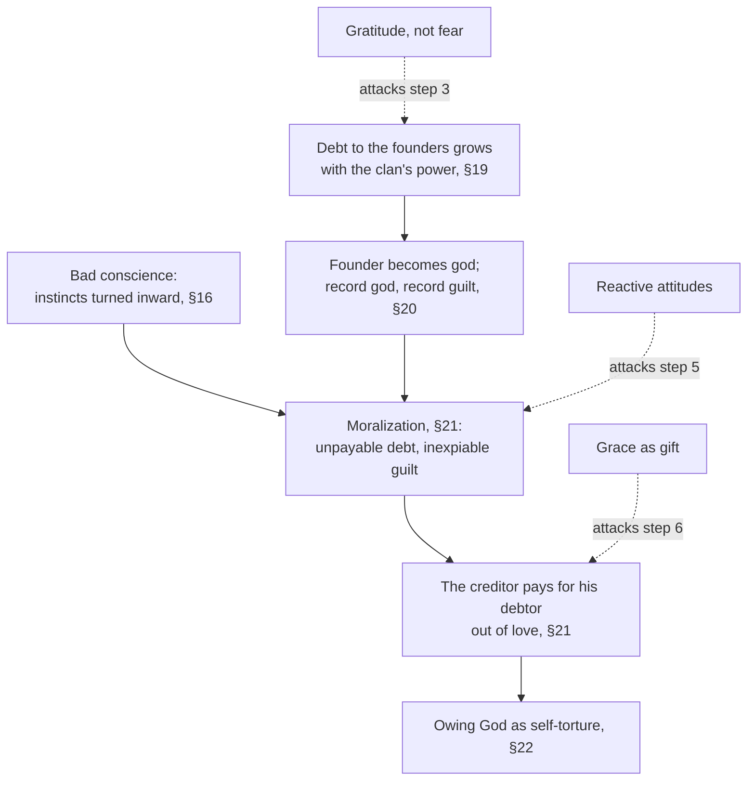

# Philosophy of Debt · Lesson 4.2: Owing the ancestors, owing God

> ⏱ ~15 min · Module 4: *Schuld*: debt, guilt and genealogy · Builds on: [4.1 The animal with the right to make promises](04-01-the-animal-with-the-right-to-make-promises.md) · Unlocks: [4.3 Graeber's thesis examined](04-03-graebers-thesis-examined.md), [5.1 Forgiving a debt, forgiving a wrong](05-01-forgiving-a-debt-forgiving-a-wrong.md)

## Why this matters

[4.1](04-01-the-animal-with-the-right-to-make-promises.md) followed Nietzsche's claim that *Schuld*, guilt, grew out of *Schulden*, debts, when a creditor could take payment in the debtor's body. The Second Essay's last movement (§§16–22) carries that claim as far as it will go: from a clan's debt to its founders to the Christian God who pays the debt himself. Its thesis, that guilt before God is a debt turned inward, is where the debt thread's theology and philosophy meet. `theology-of-debt` reads sin as debt from inside the tradition; this lesson asks whether Nietzsche's story of that idea holds, and states the religious and secular replies at full strength.

## The idea

By §15 Nietzsche has argued that punishment does not produce guilt: the punished felt that something had gone wrong, not that they ought not to have done it. So guilt needs another source, and §16 supplies one. A warlike animal was penned inside society and peace, and its instincts of cruelty lost their outlet: "All instincts which do not find a vent without, *turn inwards*". That self-directed cruelty is the **bad conscience**. It is not yet guilt. It is aggression with nowhere else to go.

Meanwhile the debt relation of 4.1 keeps growing. A clan believes it exists thanks to its founders, and pays them back in sacrifice and obedience. Every victory is credited to the founders, so the debt grows with the clan's success. Picture a family firm whose founder's portrait in the lobby gets bigger each time the firm doubles. At the limit the founder of the mightiest clan becomes a god, and the largest empire gets the largest god, and the largest debt.

Guilt in the full moral sense, on this story, is what happens when the two strands meet. A debt too large ever to pay is pushed inward, into the bad conscience, and becomes a guilt that can never be expiated. Christianity then offers the strangest settlement in the history of credit: the creditor pays.

## Source

*Genealogy* II §21 (Horace B. Samuel, 1913). Guilt has turned on the debtor, then on whatever can be blamed for his existence: Adam, Nature, existence itself.

> …till suddenly we stand before that paradoxical and awful expedient, through which a tortured humanity has found a temporary alleviation, that stroke of genius called Christianity:—God personally immolating himself for the debt of man, God paying himself personally out of a pound of his own flesh, God as the one being who can deliver man from what man had become unable to deliver himself—the creditor playing scapegoat for his debtor, from *love* (can you believe it?), from love of his debtor!…

Read it as a ledger. On Nietzsche's description payer and payee are one person, so nothing passes from debtor to creditor. In ledger terms that is a release, not a payment, and his incredulous parenthesis falls on the motive, since love is no creditor's reason. Note "temporary" too: the relief does not end the debt psychology, as §22 goes on to say. Two phrases are Samuel's, not Nietzsche's. The German has the creditor *sacrificing* himself (*sich opfernd*), not "playing scapegoat", and says only that God makes himself paid by himself. "A pound of his own flesh" is the translator's echo of Shylock ([3.3](03-03-what-may-be-pledged.md)). Build nothing on it.

## The argument

*Genealogy* II §§16–22 in six steps; quoted phrases are Samuel's.

1. **Penned in, the instincts turn inward** (§16). Cruelty once spent on enemies is dammed by peace and punishment and turns on its owner: the [bad conscience](../reference.md#bad-conscience).
2. **The clan owes its founders a legal debt, not a sentiment** (§19). The living believe the clan exists only through the ancestors' sacrifices, which must be paid back in sacrifice and obedience.
3. **The debt, and the fear, grow with the clan's power** (§19). The ancestors live on as potent spirits and are credited with every new advantage, so the debt accumulates. Fear of them rises with the clan's victories and falls with its decline. At the limit the founder is "transfigured into a god". *In words:* the stronger the tribe, the bigger its creditor. This is the [debt to the ancestors](../reference.md#debt-to-the-ancestors).
4. **The debt scales with the god** (§20). Subject peoples take over their masters' gods with the unpaid debts attached. Universal empires bring universal gods, and the Christian God, the "record god", brings the record amount of guilt.
5. **Moralization fuses the strands** (§21). *Schuld* and *Pflicht*, debt-guilt and duty, are pushed back into the bad conscience of step 1. A debt that cannot be paid becomes a penalty that cannot be paid ("eternal punishment"), and guilt turns on the debtor, then on his origins. This is the [moralization of *Schuld*](../reference.md#moralization-of-schuld).
6. **The creditor pays, and the relief is temporary** (§§21–22). God pays the debt himself (Source), but the man of bad conscience seizes the thought of owing God as his "instrument of torture" (§22).

∴ **Guilt before God is the old debt relation, moralized and fused with self-directed cruelty.** *In words:* the sense of owing God what can never be paid is a debt turned inward.

The conclusion is historical and psychological. The text draws no normative verdict, though §20's pairing of atheism with "a kind of second innocence" leans toward one.

**Where the argument is weakest.** Step 3 carries the whole passage from creditor to god, and Nietzsche offers it as "this crude kind of logic", not as evidence. He calls his account of the bad conscience a "hypothesis" (§16), and backs the ancestor cult with one example, the sacrifice of the first-born. A critic grants that offerings rise with a clan's fortunes and denies that debt and fear explain the rise, since gratitude to a benefactor predicts the same curve. The religious critic adds that step 2 assumes what it needs, that a benefit must be a loan. Nietzsche's "there is no gratis" for that age asserts this rather than showing it. The argument needs a datum only the debt reading predicts, and Example 1 looks for one.

## Map of positions

Solid arrows are Nietzsche's derivation; dashed arrows are replies, each aimed at one step.

**[Grace as gift](../reference.md#grace-as-gift)** (the religious reply). The creature was never God's debtor in the creditor's sense, because nothing it could pay was not first given: "Or who hath first given to him, and recompense shall be made him?" (Romans 11:35, Douay–Rheims). Paul sets grace against debt: a worker's reward is reckoned as a debt, not as grace (Romans 4:4). In Colossians 2:14 the "handwriting" against us, a note of hand on one reading, is blotted out and fastened to the cross ([`theology-of-debt` 2.4](../../theology-of-debt/lessons/02-04-the-bond-and-the-ransom.md)). Even the satisfaction theories make the payment a gift. For Anselm, Christ's death is the one gift made "not of debt but freely" ([3.3](../../theology-of-debt/lessons/03-03-anselm-cur-deus-homo.md)). For Aquinas, God could have forgiven sin without any satisfaction and wronged no one, and chose satisfaction as the "more copious mercy" (ST III q.46 aa.1–2; [3.4](../../theology-of-debt/lessons/03-04-aquinas-satisfaction-and-the-debt-of-punishment.md)). Aquinas even grants §19's debts: after God, a man owes most to his parents and his country (II-II q.101 a.1), and what he renders God is due yet "cannot be equal" (q.80 a.1). Religion and piety, the virtues of justice that answer these debts, issue in worship and service, not self-torment. David Bentley Hart's essay on Anselm puts the reply in its title: "A Gift Exceeding Every Debt" (1998). On this view Nietzsche describes the Cross accurately and inverts its effect. His answer is already in §22: whatever the doctrine calls a gift, the man of bad conscience makes his instrument of torture.

**[Reactive attitudes](../reference.md#reactive-attitudes)** (a secular reply, built from P. F. Strawson's "Freedom and Resentment", 1962, a paper about free will, not Nietzsche). Resentment, indignation and gratitude respond to the goodwill or ill will people show one another. Guilt, on a Strawsonian account, is that demand for regard turned on oneself, so its object is a person wronged, not a sum unpaid. You can feel guilt toward a stranger you humiliated and owe nothing, and owe a great deal without guilt on a mortgage paid on time. Debt may have lent guilt a vocabulary without giving it its object. The Nietzschean rejoinder is that Strawson describes the finished product, and a genealogy is about how it was made.

## Worked examples

**Example 1 (clean): the founder's shrine.** An invented clan's records of its founder's shrine show three things. (i) Over three winning generations every victory is credited to him, and the offerings grow. (ii) After a plague the elders decide he has never been given enough and sacrifice the clan's whole herd. (iii) A century later, conquered and scattered, the clan neglects the shrine and remembers the founder as an ordinary man.

Run §19. The obligation is legal, repaid in sacrifice and obedience (step 2). The creditor keeps advancing new benefits, so the debt grows, and (i) and (iii) show it tracking power (step 3). Now apply the weakest-premise test. (i) and (iii) fit gratitude just as well, since people give more when they receive more. Only (ii) is distinctive. The suspicion that the creditor has never been paid enough, and the "wholesale ransom" it periodically extorts, fit a debt that can always be called in better than a thank-you.

**Example 2 (hard): the unbeliever's guilt.** §20 ends with a forecast. As belief in the Christian God declines, the consciousness of owing should decline with it, and a triumphant atheism would free mankind from the feeling of owing its origin. §21 opens by correcting the forecast: it ignored the moralization, and the facts "differ terribly". Once debt was pushed into the bad conscience, guilt no longer needed its creditor.

So take a society in which belief halves in two generations. If guilt falls, §20 is confirmed. If it persists, §21 explains it. That is the strain: read together, the sections seem to fit either outcome. The defender replies that §21 predicts a specific shape for surviving guilt. It will be inexpiable, aimed at oneself, at nature or at existence itself, and owed to no one who could accept payment. The Strawsonian rejoinder is that most guilt unbelievers feel is remorse toward a particular person they wronged, which needs no creditor and never needed a genealogy of debt. Whether the theory can be tested turns on telling those two kinds of guilt apart.

## Watch out

- **You might think the English carries the argument, but actually the pun is German.** [*Schuld*](../reference.md#schuld) means both debt and guilt. Samuel sometimes saves the pun with English "ought" and "owe" (his note to §4), but in §§20–21 he renders the word and its compounds as "debt", "owing", "'ought' (owe)" and "guilt" by turns, so an English reader can miss that step 5 turns on one word.
- **You might think the bad conscience is guilt, but actually it comes first and from elsewhere.** §16's bad conscience is cruelty turned inward and needs no debt. Guilt in the moral sense is what the fusion in step 5 produces, and the essay's structure depends on keeping them apart.
- **You might think the genealogy shows that nothing is owed to God or to one's ancestors, but actually it only explains how a feeling arose.** Steps 1–6 are historical and psychological claims. Whether anything is owed is a normative question, and whether God exists is not addressed at all. Moving from the first to the others without a bridge premise is the [genetic fallacy](../reference.md#genetic-fallacy) ([`philosophical-method` 2.3](../../philosophical-method/lessons/02-03-informal-fallacies-and-when-they-arent.md)). Whether a genealogy can supply the bridge is [4.3](04-03-graebers-thesis-examined.md)'s question.

## One-liner

> Nietzsche makes guilt before God a debt turned inward: the clan's creditor grows into a god, the unpayable debt sinks into the bad conscience, and a creditor who pays himself either closes the ledger or writes its cruellest entry.

## Problems

**P1 (🟢) *(Exegetical.)*** *Genealogy* II §19 (Samuel, 1913):

> …each living generation recognises a legal obligation towards the earlier generation, and particularly towards the earliest, which founded the family (and this is something much more than a mere sentimental obligation, the existence of which, during the longest period of man's history, is by no means indisputable). There prevails in them the conviction that it is only thanks to sacrifices and efforts of their ancestors, that the race *persists* at all—and that this has to be *paid back* to them by sacrifices and services. … Gratis, perchance? But there is no gratis for that raw and "mean-souled" age. … Perhaps this is the very origin of the gods, that is, an origin from *fear*! And those who feel bound to add, "but from piety also," will have difficulty in maintaining this theory, with regard to the primeval and longest period of the human race.

(a) A reader sums up: "Nietzsche denies that gratitude or piety ever had anything to do with religion." Does the passage support that? Name the words that decide it. (b) Which words make the clan's obligation a debt rather than a feeling, and what is it repaid with? **Two sentences per part.**

**P2 (🟡) *(Exegetical (a) · Evaluative (b).)*** An **invented** city holds a Founders' Day each year for its founders and its war dead. Speakers call what the city owes them "a debt we can never repay". The ceremony's budget has grown with the city's prosperity and was cut during a long recession. No one fears the founders, and no one has ever proposed giving more than the ceremony. (a) Run §19's model on the case: which of its predictions fit, and which of its distinctive marks are missing? (b) Is the city's relation to its founders better described as a debt in Nietzsche's sense, as piety in Aquinas's sense (the worship owed to parents and country, which no return can equal), or as neither? Say where §19 stops determining a verdict. **Two sentences for (a); 150 words or fewer for (b).**

**P3 (🔴) *(Exegetical.)*** Nietzsche (§§21–22) and a theologian who holds the grace-as-gift reply agree on a description of the Cross: the creditor bears the debtor's debt himself, out of love. (a) Say what each claims the Cross does to the debt. (b) Name the single premise one side must deny for them to disagree. (c) Say what evidence or argument would move each side. **150 words or fewer.**

Solutions

**P1** *(Exegetical — strict.)*

**Must hit, strict (a):** No. The passage restricts the claim in time and softens it in force. In time: the doubt about sentimental obligation covers "the longest period of man's history", "no gratis" holds for "that raw and 'mean-souled' age", and the piety addition is in difficulty only "with regard to the primeval and longest period", which leaves later periods open. In force: sentimental obligation is "by no means indisputable" (doubted, not denied), and the origin in fear comes with "Perhaps".

**Must hit, strict (b):** "a legal obligation", set against "a mere sentimental obligation"; "paid back"; and "there is no gratis", so what the ancestors gave was not free. It is repaid "by sacrifices and services".

**Wrong turns:** reading "by no means indisputable" as "false"; treating "Perhaps this is the very origin of the gods" as a flat assertion; answering (b) with "fear", which is the clan's attitude to its creditor, not what makes the obligation a debt.

**Model answer:** (a) Not as stated: the passage speaks only of "the longest period of man's history", "that raw and 'mean-souled' age" and "the primeval and longest period", so piety is excluded for the earliest times, not for all. Even there it calls sentimental obligation "by no means indisputable" rather than absent, and hedges the origin in fear with "Perhaps". (b) The obligation is "legal", "much more than a mere sentimental obligation", and what the ancestors gave must be "paid back" because "there is no gratis". It is repaid "by sacrifices and services".

---

**P2** *(Exegetical (a) — strict · Evaluative (b) — any verdict.)*

**Must hit, strict (a):** Fits: an acknowledged obligation to founders, and giving that tracks the city's fortunes, rising with prosperity and falling in the recession. Missing: fear of the founders, the suspicion that they have never been given enough, and the extorted "wholesale ransom", which are the marks that separate §19's debt from gratitude (Example 1). Deification is missing too.

**Must hit, any verdict (b):**
- A verdict (debt, piety or neither) tied to named features of the case.
- Note that "a debt we can never repay" fits both readings, since for Aquinas the due to parents and country cannot be equalled and for Nietzsche the debt grows past payment. The phrase settles nothing.
- Say where §19 stops: the predictions that fit are shared with gratitude, and the distinctive ones are absent. Say whether absence counts against the model or leaves it silent.

**Wrong turns:** counting the budget's rise with prosperity as confirmation of Nietzsche, when gratitude predicts it equally. Treating the speakers' word "debt" as proof of a debt in §19's sense. Reading Aquinas's piety as a debt that must be paid in full, when his point is that it cannot be.

**Model answer (b), one of several:** Piety fits better. The city names a due it cannot equal and answers it with commemoration scaled to what it can afford. That is service and honour to country, as Aquinas describes piety, not repayment. The features that match §19, growth in good years and cuts in bad ones, are exactly what gratitude predicts, so they give Nietzsche no support. His distinctive marks, fear and the extorted ransom, are absent. Here §19 stops determining a verdict. A Nietzschean can call Founders' Day a tamed descendant of the old debt, and nothing in the case could confirm or refute that. A debt verdict would need some anxiety that the dead have never been given enough.

---

**P3** *(Exegetical — strict on the crux; any defensible formulation passes.)*

**Must hit, strict:**
- (a) **Nietzsche:** the Cross brings only a "temporary alleviation". The man of bad conscience turns owing such a God into his "instrument of torture" (§22), and guilt is driven toward inexpiability rather than ended. **Theologian:** the Cross cancels the debt (the bond blotted out, Colossians 2:14; for Aquinas God could have forgiven outright). What remains is thanks, which is not a balance owed (Romans 11:35; 4:4).
- (b) The crux: **whether a benefit that can never be repaid must leave its recipient in debt.** Nietzsche affirms it: that is why the relief is temporary and owing God becomes torture (§§21–22). The theologian denies it: a gift answered by gratitude creates no creditor's claim.
- (c) One mover for each side, as below: evidence about how such gifts are actually received, or an argument about whether gift and debt are different relations.

**Wrong turns:** placing the crux at whether God exists. They could settle that and still disagree about what an unrepayable gift does, since the dispute is about the concept and the psychology. Saying they disagree about the description, when they share it. Answering with the genetic fallacy, which is 4.3's question.

**Model answer:** (a) For Nietzsche the Cross relieves only for a time: owing a God who paid for you becomes the believer's instrument of self-torture. For the theologian it cancels the bond, and what is left is thanks, not a balance. (b) The crux is whether a benefit that can never be repaid must leave its recipient owing. Nietzsche affirms it; the theologian denies it. (c) Nietzsche would be moved by evidence that people who receive grace, or any great unrepayable gift, typically feel release rather than deeper guilt, or by an argument that a gift and a loan are different relations ([6.4](06-04-debts-of-gratitude.md)). The theologian would be moved by evidence that the doctrine reliably breeds scrupulosity and a sense of unworthiness, or by the argument that his own tradition concedes the point, since for Aquinas worship is due to God even though it "cannot be equal".

## Flashback

**From Lesson [3.3](03-03-what-may-be-pledged.md) (What may be pledged):** *(Exegetical (a)–(b) · Evaluative (c).)* Mill, *On Liberty* ch. V, on why a contract to sell oneself as a slave "would be null and void":

> The reason for not interfering … with a person's voluntary acts, is consideration for his liberty. His voluntary choice is evidence that what he so chooses is desirable, or at the least endurable, to him … But by selling himself for a slave, he abdicates his liberty; he foregoes any future use of it, beyond that single act. He therefore defeats, in his own case, the very purpose which is the justification of allowing him to dispose of himself.

(a) Reconstruct the argument in numbered premises and a conclusion. (b) An **invented** borrower pledges that, if she defaults, she will crew the lender's fishing boat for one season with no right to quit. Does Mill's argument, as stated, void the pledge? Name the words that decide. (c) Flag the premise you think weakest, state the strongest objection to it, and say whether the objection generalizes. **Two sentences each for (b) and (c).**

Solution

**Must hit, strict (a):** in any wording, with P3 as a *total* surrender:

- **P1.** We leave a person's voluntary acts alone out of regard for his liberty.
- **P2.** His voluntary choice is evidence that what he chooses is good, or at least endurable, for him.
- **P3.** Selling himself as a slave abdicates his liberty: he gives up any future use of it beyond that one act.
- **∴ C.** In selling himself he defeats the very purpose that justifies letting him dispose of himself, so the principle of liberty gives no reason to enforce the sale.

P1 and P2 may be merged as the justification for leaving him alone.

**Must hit, strict (b):** **no, not as stated.** P3 rests on "abdicates" and "any future use of it, beyond that single act", and a season's crewing suspends her liberty for a season and then returns it, so the self-defeat premise is false of this pledge. (Mill goes on to grant that "the necessities of life" require us to consent to "this and the other limitation" of freedom.)

**Must hit, any verdict (c):** a premise named, the objection stated at full strength, and a verdict on whether it generalizes. For instance:

- **P1**, from a rights-based libertarian such as Block (3.3): the ground of non-interference is his right to control himself, not the value of his future liberty, and a right includes the power to transfer it, so enforcing the sale honours the ground instead of defeating it. It generalizes to every sale or pledge of oneself, which Block accepts.
- **P2** turned against Mill: the sale is itself a voluntary choice, so by P2 it is evidence that the sale is endurable to him. Mill's next sentence replies that the slave's position lacks the presumption "that would be afforded by his voluntarily remaining in it", and the objector must then say why a single choice deserves the deference Mill reserves for a choice continually renewed.

**Wrong turns:** voiding the season's pledge because it gives the creditor command over her person: that is 3.3's premise 2 and the republican's reason, not this argument's. Reading C as "self-sale harms him": the argument turns on liberty defeating its own purpose, not on harm. Taking C to say that self-sale is wicked, when it concerns only what the principle of liberty can require.

**Model answer:** (a) P1: We leave a person's voluntary acts alone out of regard for his liberty. P2: His choice is evidence that what he chooses is good, or at least endurable, for him. P3: Selling himself as a slave gives up "any future use" of his liberty "beyond that single act". ∴ In selling himself he defeats the very purpose that justifies letting him dispose of himself, so liberty gives no reason to enforce the sale. (b) Not as stated: P3 rests on "abdicates" and "any future use of it, beyond that single act", and a season's crewing suspends her liberty for a season and then returns it. Only an added premise, that surrendering more liberty defeats the purpose more, would reach the pledge, and the passage states none. (c), one of several: P1 is weakest, because a rights-based libertarian such as Block grounds non-interference in the right to control oneself, a right that includes the power to transfer it, so enforcing the sale honours the ground rather than defeating it. The objection generalizes to every sale or pledge of oneself, a result Block accepts.

## Connections

- **Backward:** [4.1](04-01-the-animal-with-the-right-to-make-promises.md) supplied the creditor-debtor relation and the [community as creditor](../reference.md#community-as-creditor) (§9); §19 moves the creditor's seat from the living community to the dead founders. [1.1](01-01-the-grammar-of-owing.md)'s marks of a debt explain the Source's oddity: only a creditor can release, and a creditor who pays himself has released. Samuel's "pound of his own flesh" borrows the bond of [3.3](03-03-what-may-be-pledged.md).
- **Forward:** [4.3](04-03-graebers-thesis-examined.md) takes up the primordial-debt theory, on which human life begins in a debt to the gods and society, a close cousin of §19 that Graeber rejects. It also asks whether a genealogy can carry normative force. [5.1](05-01-forgiving-a-debt-forgiving-a-wrong.md) separates releasing a debt from forgiving a wrong, a distinction the grace reply needs, since it says the Cross does both. [6.4](06-04-debts-of-gratitude.md) asks whether what we owe parents and society is a debt at all. The module's boss problem is in the [syllabus](../syllabus.md).
- **Sideways (the debt thread):** `theology-of-debt` reads from inside the idea Nietzsche genealogizes: sin becoming debt in the Second Temple period ([3.1](../../theology-of-debt/lessons/03-01-from-burden-to-debt.md)), then Anselm ([3.3](../../theology-of-debt/lessons/03-03-anselm-cur-deus-homo.md)) and Aquinas ([3.4](../../theology-of-debt/lessons/03-04-aquinas-satisfaction-and-the-debt-of-punishment.md)). [`history-of-debt` 1.1](../../history-of-debt/lessons/01-01-credit-before-coins.md) tests the history of credit that genealogists lean on. Genealogy as a method is [`modern-philosophy`](../../modern-philosophy/syllabus.md) 6.5, and [`ethics` 6.4](../../ethics/lessons/06-04-constructivism-and-debunking.md) runs a debunking argument of the same shape with evolution in place of history. For P3's method, see [finding the crux](../../philosophical-method/lessons/04-03-finding-the-crux.md).
