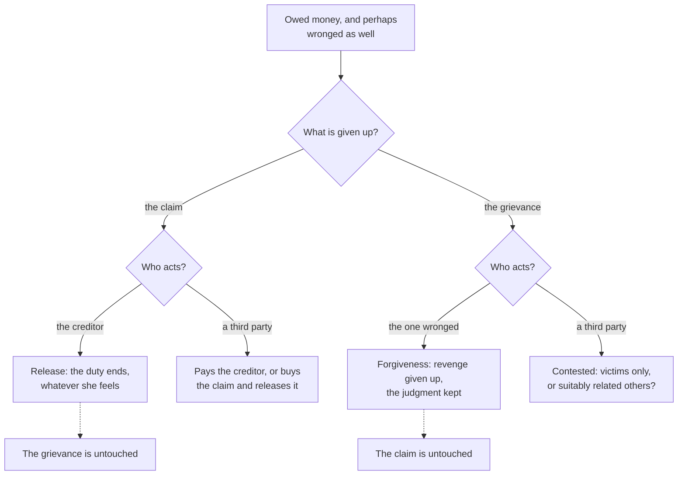

# Philosophy of Debt · Lesson 5.1: Forgiving a debt, forgiving a wrong

> ⏱ ~15 min · Module 5: Forgiveness, relief and the fresh start · Builds on: [1.1 The grammar of owing](01-01-the-grammar-of-owing.md), [4.1 The animal with the right to make promises](04-01-the-animal-with-the-right-to-make-promises.md) · Unlocks: [5.2 Moral hazard and fairness to those who paid](05-02-moral-hazard-and-fairness-to-those-who-paid.md), [5.3 Bankruptcy as a moral institution](05-03-bankruptcy-as-a-moral-institution.md)

## Why this matters

A bank forgives a loan and a victim forgives an assailant, and English uses one verb for both. Module 5 argues about cancelling debts: who may do it, on what grounds, and at whose expense. That argument goes wrong fast if the two acts are run together. A creditor can cancel a debt and stay furious with the debtor. A victim can forgive a wrong and still sue for what it cost her. This lesson pulls the acts apart, asks who has standing to perform each, and then asks why a judge, who holds no claim and suffered no wrong, has trouble doing either.

## The idea

Start with what each act works on.

**Releasing a debt works on a claim.** The creditor holds a claim-right, and the debtor the matching duty. In Hohfeld's terms (1913) she also holds a *power* to extinguish that duty, and he a *liability* to having it extinguished. Hart's will theory makes this control the mark of a right: the right-holder is a small-scale sovereign over the other's duty, free to waive or enforce it (*Essays on Bentham*, 1982). Hohfeld's scheme and the will and interest theories belong to [`philosophy-of-law`](../../philosophy-of-law/syllabus.md) 6.1–6.2. A [release](../reference.md#release) needs standing, since only the holder of a claim can give it up ([1.1](01-01-the-grammar-of-owing.md)), and a recognized way of saying so. Nothing else. It needs no wrong: you can release a loan that is not yet due. It needs no feeling: a release signed through gritted teeth is a release.

**Forgiving a wrong works on a relation between persons.** It needs a wrong and a person who was wronged. Its core, on nearly every account, is a change in how the wronged person stands toward the wrongdoer: at least giving up revenge and ill-will, while still judging that what he did was wrong.

So the two come apart both ways. A landlord can waive a month's rent and still resent the tenant's insult. A woman cheated by her business partner can forgive him and still press her claim to the money.

A third party cannot release a claim she does not hold, but she has two other moves. She can **pay** the creditor on the debtor's behalf, which satisfies the claim, so it ends without anyone giving it up. Or she can **buy** the claim and release it as its new holder. What she cannot do, on the standard view, is forgive a wrong done to someone else.

## Source

Joseph Butler, *Fifteen Sermons Preached at the Rolls Chapel* (1726), quoted from the London edition of 1841. Sermon VIII, "Upon Resentment", on what settled resentment answers to:

> "From hence it appears, that it is not natural, but moral evil; it is not suffering, but injury, which raises that anger or resentment, which is of any continuance."

Sermon IX, "Upon Forgiveness of Injuries", on what the command to forgive and to love one's enemies (the sermon's text is Matthew 5:43–44) forbids:

> "Therefore the precepts in the text, and others of the like import with them, must be understood to forbid only the excess and abuse of this natural feeling, in cases of personal and private injury"

Four phrases carry the weight. "Of any continuance" limits the claim to *settled* resentment; sudden anger, Butler says, can be mere instinct against harm, like closing your eyes when something falls toward them. "Not suffering, but injury" makes a wrong, not a loss, the object, so someone who harms you innocently is no fit target. "Only the excess and abuse" makes the command a limit on [resentment](../reference.md#resentment), not its abolition. Sermon VIII lists the abuses: imagining an injury, magnifying it, resenting an innocent cause, indignation out of proportion, and inflicting harm to gratify the feeling, which is revenge. And "personal and private" sets the scope: indignation on behalf of others is not what the precept targets.

## The argument

**The separation argument** (this lesson's reconstruction, built from Butler and the analysis of rights).

1. **To release a debt is to exercise a power over a claim:** the holder extinguishes the debtor's duty by declaring it. *In words:* releasing is something you do to what you are owed, by saying so.
2. **A release requires standing, but neither a wrong nor any particular feeling.** *In words:* a loan never breached can be released, and a release signed in anger still counts.
3. **Forgiveness answers to injury, not loss** (Sermon VIII). *In words:* where no one did wrong, there is nothing to forgive, only something to release.
4. **To forgive is to keep one's resentment within what the injury warrants and to give up revenge and ill-will, while still judging the act wrong.** Butler's measure (Sermon IX): the injured party should feel toward the offender what good people with no stake in the case would feel, judging the fault as justly, and should still wish him well. *In words:* forgiving changes the victim's stance, not the ledger. Keeping the judgment is what separates it from [condonation](../reference.md#condonation), treating the act as though it were not wrong.
5. **Standing to forgive belongs to the one wronged.** This victim-only view mirrors the rule that only the one owed the money can cancel the debt, an analogy Glen Pettigrove draws ("Standing to Forgive", 2009). Some philosophers, Pettigrove among them, extend [standing to forgive](../reference.md#standing-to-forgive) to suitably related third parties.
6. **∴ Releasing a debt and forgiving a wrong are distinct acts.** Either can occur without the other, and they can have different agents. *In words:* a creditor who was also wronged holds two things, a claim and a grievance, and may give up one, both or neither.

Premise 4 is Butler's version of [forgiveness](../reference.md#forgiveness). A common modern definition asks more: to forgive is to forswear resentment, which P. F. Strawson counts among the [reactive attitudes](../reference.md#reactive-attitudes) ("Freedom and Resentment", 1962), or to overcome it for moral reasons (Jeffrie Murphy, in Murphy and Hampton, *Forgiveness and Mercy*, 1988). The conclusion survives either version, since both make forgiveness a change in the victim's stance.

**Where the argument is weakest.** Premise 4, read as an account of what forgiving *is*. Normative-power accounts deny that forgiving is at bottom a change of heart; Brandon Warmke ("The Normative Significance of Forgiveness", 2016) likens it to promising or cancelling a debt. A sincere "I forgive you" releases the wrongdoer from what the wrong left him owing, such as further apology and amends (Dana Nelkin, 2013). Warmke adds that it binds the forgiver not to go on blaming, so a forgiver who keeps blaming wrongs the one forgiven. She can have forgiven while still resentful. The critic's evidence: we ask for and grant forgiveness the way we ask for and grant releases. Critics of the power view reply that one can forgive the dead, or someone who has already made full amends, when nothing is left to release, and that many people say "I forgive you" sincerely and are still trying to. Notice what survives. On the power view, releasing the money and forgiving the lie release *different* claims, so "either without the other" stands. What is at stake is whether forgiveness is essentially a change in the victim's stance or a change in the norms between two people.

## Who can cancel what

Dashed arrows mark what each act leaves behind.

## Worked examples

**Example 1 (clean): one creditor, two things to give up.** Invented. Rosa lends her cousin Teo 4,000 dollars for what he says is a deposit on a flat. He spends it on a holiday and cannot repay. Rosa holds a claim to 4,000 dollars and a grievance about the lie.

- *She releases and still resents.* "Forget the money. I'm done with you." Teo owes nothing (premises 1–2), and the lie is unforgiven.
- *She forgives and still collects.* She drops the grudge, wishes him well, still judges the lie wrong, and expects repayment in instalments. Nothing is inconsistent: forgiving the lie gives up revenge, not the loan. Butler holds that even a public execution does not cancel the duty of good-will toward the criminal (Sermon IX).
- *Her mother pays Rosa.* The claim is satisfied and ends. No one released it and no one forgave anything. Whether Teo now owes his mother depends on whether she meant a loan or a gift. The lie is still Rosa's to forgive.
- *She shrugs.* "Everyone fudges what a loan is for." That is condonation, not forgiveness: the lie is treated as no wrong at all.

**Example 2 (hard): the judge's mercy.** Invented. A man defrauds an elderly neighbour of her savings. At his sentencing she says she forgives him, and the judge, moved, halves the prison term. The neighbour can forgive (she was wronged), and she can release her civil claim to the money (it is hers). She cannot release the state's prosecution. The judge holds no claim and suffered no wrong, so his leniency is neither a release nor forgiveness. Here the map strains, and the strain has a name, the [paradox of mercy](../reference.md#paradox-of-mercy) (cited to [`philosophy-of-law`](../../philosophy-of-law/syllabus.md) 5.4): if the shorter sentence is what justice requires, it is not mercy; if it is less than justice requires, it is an injustice.

The debt model offers one exit, at a price. A creditor who waives what is owed to *her* wrongs no one, so her mercy is neither required nor unjust; Portia's plea to Shylock ([3.3](03-03-what-may-be-pledged.md)) asks a creditor for exactly that. If punishment is a debt owed to someone who may waive it, the victim or the community, then mercy is a release and the paradox dissolves. Nietzsche's §10 reads a community's leniency this way, as the luxury of a creditor grown rich ([4.1](04-01-the-animal-with-the-right-to-make-promises.md)). The price is that two identical offenders may fare differently because one creditor waived. Anselm denies the premise for God, whom he treats as guardian of the order rather than a private creditor, so God cannot fittingly remit sin by mercy alone ([`theology-of-debt` 3.3](../../theology-of-debt/lessons/03-03-anselm-cur-deus-homo.md)). Whether a judge is more like the creditor or the guardian, the release/forgive distinction cannot decide. That is where the dispute over mercy lives.

## Watch out

- **You might think Butler defines forgiving as ceasing to resent.** He says the command forbids "only the excess and abuse" of resentment. A forgiver may still resent in proportion, with good-will alongside. Forswearing resentment is Strawson's formula, and overcoming it is Murphy's account. So "she forgave him but still resents it" is no contradiction for Butler, though it is on theirs.
- **You might think the word's history settles what forgiveness is.** The Lord's Prayer names God's forgiveness of sin with the verb the Greek Old Testament uses for releasing loans in Deuteronomy 15 ([`theology-of-debt` 2.2](../../theology-of-debt/lessons/02-02-forgive-us-our-debts.md)). That is a historical fact about vocabulary. Whether forgiving a wrong *is* a release is a conceptual question, and whether anyone *ought* to forgive or release is a normative one. [4.3](04-03-graebers-thesis-examined.md) met the same gap between origin and validity.
- **You might think a release shows good-will, or that forgiveness ends the debt.** A release can be pure calculation, when collecting would cost more than it recovers. And forgiveness leaves the claim standing, so "I forgave him" never answers "does he still owe you?"

## One-liner

> Releasing gives up a claim and needs no change of heart; forgiving gives up a grievance and cancels no claim; so a creditor who was also wronged can do either without the other.

## Problems

**P1 (🟢) *(Exegetical.)*** Three invented cases. For each, say whether there has been a release, forgiveness, both or neither, and what, if anything, is still owed and to whom. **Two sentences each.**

(a) A bank records an unpaid credit-card balance as a loss in its accounts ("writes it off"), keeps the legal claim, and later sells the account to a collection agency.
(b) A landlord learns that his tenant forged a reference to get the flat. He tells her, "Don't worry about it, everybody does that," and goes on charging the full rent.
(c) Ines is assaulted on a train. At her attacker's sentencing she tells him that she forgives him and wishes him well. The same month her lawyer files a civil claim against him for her medical costs.

**P2 (🟡) *(Exegetical.)*** Butler, Sermon IX (1841 edition):

> Resentment is not inconsistent with good-will: for we often see both together in very high degrees, not only in parents towards their children, but in cases of friendship and dependence, where there is no natural relation. These contrary passions, though they may lessen, do not necessarily destroy each other. We may therefore love our enemy, and yet have resentment against him for his injurious behaviour towards us. But when this resentment entirely destroys our natural benevolence towards him, it is excessive, and becomes malice or revenge. The command to prevent its having this effect, i. e. to forgive injuries, is the same as to love our enemies; because that love is always supposed, unless destroyed by resentment.

(a) Does the passage make forgiving *ceasing to resent*, or *keeping resentment from destroying good-will*? Quote the words that decide. (b) Invented: Nadia cancels the 3,000 dollars her son owes her and tells him she forgives him for lying about what the loan was for. Months later she is still hurt and a little cool with him, but she wishes him well and has never tried to get even. Has she forgiven him on the passage's account? On the forswearing account? What did cancelling the loan add to her forgiveness? **Two sentences per part.**

**P3 (🔴) *(Exegetical (a) · Evaluative (b).)*** Return to Ines in P1(c). (a) Name the single premise on which the attitude view of forgiveness (Butler; Strawson and Murphy) and the normative-power view (Nelkin, Warmke) divide, and say what kind of case would move each side. **Two sentences.** (b) Is Ines's lawsuit consistent with her forgiveness? Answer on the view you find stronger, say what the other view implies, and name the cost of your answer. **Any verdict; 150 words or fewer.**

Solutions

**P1** *(Exegetical.)*

**Must hit, strict:**
- (a) **Neither.** A write-off is the bank's accounting judgment that it will not collect; the claim survives, and after the sale the agency holds it, along with the power to release it. The full balance is still owed, now to the agency, and nothing in the case touches any grievance.
- (b) **Neither: condonation.** "Everybody does that" treats the forgery as no wrong, while forgiving would keep the judgment that it was one (premise 4). No claim was given up, so the full rent is owed as before.
- (c) **Forgiveness without release.** She has given up the grievance, as far as the case shows, but kept her claim to compensation, which becomes a debt without a promise once a court fixes the sum ([1.1](01-01-the-grammar-of-owing.md)). The attacker still owes her medical costs if the claim succeeds, and the criminal sentence was never hers to release.

**Wrong turns:** calling (a) "loan forgiveness" because the balance leaves the bank's books; the books changed, the debtor's duty did not. Calling (b) forgiveness because the landlord "let it go". In (c), assuming that forgiving obliges her to drop the suit (on Butler's account it does not; P3 asks about the normative-power view), or that she could release the sentence.

**Model answer:** (a) Neither: the write-off records an expected loss and the sale transfers the claim. The whole balance is still owed, to the agency. (b) Neither: the landlord condones the forgery by treating it as no wrong, which forgiveness never does. The rent is still owed in full. (c) Forgiveness without release: Ines gives up her grievance but keeps her claim to damages. Her attacker still owes her compensation if the claim succeeds, and his sentence belongs to the court, not to her.

---

**P2** *(Exegetical.)*

**Must hit, strict (a):** **Keeping resentment from destroying good-will.** The decisive words: "Resentment is not inconsistent with good-will"; "We may therefore love our enemy, and yet have resentment against him"; resentment becomes "malice or revenge" only "when this resentment entirely destroys our natural benevolence"; and Butler glosses "to forgive injuries" as the command "to prevent its having this effect."

**Must hit, strict (b):** On the passage's account, **yes**. Her resentment has lessened her warmth, which the passage allows ("though they may lessen, do not necessarily destroy"), but her benevolence survives and she seeks no revenge. On the forswearing account, **not yet**, since she still resents. Cancelling the loan is **no part of** the forgiveness: it released her claim to the 3,000 dollars, a separate act she could have done without forgiving, or skipped while forgiving. At most it is evidence of her good-will.

**Wrong turns:** treating "entirely" as decoration; it is what lets lessened benevolence count as forgiving. Counting the cancelled loan as the forgiveness, or as proof of it. Reading "a little cool" as malice.

**Model answer:** (a) The passage makes forgiving the prevention of resentment's destroying good-will, not the absence of resentment: we may "love our enemy, and yet have resentment against him", and resentment turns into "malice or revenge" only when it "entirely destroys our natural benevolence." The command to forgive is the command "to prevent its having this effect." (b) On Butler's account Nadia has forgiven, because her benevolence is lessened but not destroyed and she seeks no revenge, while on the forswearing account she has not finished forgiving, because she still resents. Cancelling the loan is no part of that forgiveness, since releasing the 3,000 dollars is a different act from forgiving the lie, though it may show her good-will.

---

**P3** *(Exegetical (a) · Evaluative (b).)*

**Must hit, strict (a):** The crux is **whether forgiving is essentially a change in the victim's stance** (her feelings, and her renouncing revenge and ill-will) **or the exercise of a normative power** that changes what the wrongdoer owes and what the forgiver may still do. The attitude view would be moved by cases where a sincere "I forgive you" seems to bind, such as a forgiver who keeps blaming and seems to wrong the one forgiven. The power view would be moved by forgiveness where nothing is left to release (the dead, a wrongdoer who has made full amends) or where someone sincerely says the words and is still struggling to forgive.

**Must hit, any verdict (b):**
- State your view's principle precisely and run it on the suit. On the attitude view, forgiveness forbids revenge and ill-will, not claiming compensation, so the suit is consistent unless she brings it to make him suffer. On the power view, the answer depends on what her "I forgive you" released.
- Say what the other view implies. If the release covered amends (Nelkin's formulation), the suit takes back part of what she gave. If it covered only apology and further blame, the suit is consistent, as a creditor may release part of a claim and keep the rest.
- Name the cost: the attitude view must explain why a declared forgiveness seems to change what the forgiver may do; the power view must say what fixes the scope of a release made in three words, or the verdict goes indeterminate.
- Say whether your answer generalizes to every victim who forgives and still seeks compensation.

**Wrong turns:** treating "she forgave him, so she must drop the suit" as obvious. Running compensation together with punishment: the suit seeks her costs, and the sentence was never hers. Calling the forswearing definition Butler's.

**Model answer (b), one of several:** I take the power view. Forgiving is a release, and a release has a scope. Ines told him she forgives him and wishes him well. The natural reading is that she released him from further apology and bound herself not to keep blaming him. Her medical costs are a separate claim, which she neither mentioned nor waived, just as a creditor who forgives a lie can keep the loan. So the suit is consistent with her forgiveness. The attitude view agrees by a different route: compensation is not revenge. My cost is dependence on scope. Had she said "I forgive you for everything", my view would have to ask whether that waived the damages too, and the words alone might not settle it. That generalizes: on the power view, forgiveness gives up exactly what the forgiver meant to give up, so it is only as determinate as her meaning.

## Flashback

**From Lesson [4.2](04-02-owing-the-ancestors-owing-god.md) (Owing the ancestors, owing God):** *(Exegetical (a) · Evaluative (b).)* An **invented** case. Tessa and two friends were sailing when a squall capsized their boat, and only Tessa reached the shore. An inquest found no one at fault, and both friends' families hold nothing against her. Ten years on she still feels guilty for being alive, says nothing she does could ever make up for it, and denies herself anything that gives her pleasure.

(a) Which features of Tessa's guilt match the guilt Nietzsche describes in *Genealogy* II §21, and why is her case hard for the Strawsonian account of guilt? (b) Does the case support Nietzsche's derivation of guilt from debt, or only §16's bad conscience? Name the feature your answer turns on. **Two sentences for (a); 80 words or fewer for (b).**

Solution

**Must hit, strict (a):** The shape 4.2 reads out of §21: her guilt is **inexpiable** (nothing "could ever make up for it"; Samuel's word is "inexpiability"), **aimed at herself and at her own existence** ("guilty for being alive"), and **owed to no one who could accept payment**, since no one holds anything against her. On the Strawsonian account guilt is the demand for regard turned on oneself, so its object is **a person wronged**. Tessa wronged no one, so the Strawsonian must either deny that this is guilt proper (grief in guilt's clothing, say) or widen the account.

**Must hit, any verdict (b):**
- Note that her self-denial is what §16's bad conscience predicts on its own: cruelty turned inward, which needs no debt.
- Name the one debt-shaped feature, the sense of a balance that can never be made up, and weigh it. For Nietzsche it is the mark of moralized debt, since §21 derives inexpiability from "the impossibility of paying the debt"; for the Strawsonian it is a vocabulary debt lent to guilt without giving it its object.
- A verdict with a reason, and a fact about the case that would change it.

**Wrong turns:** Counting the fact that she owes no one as evidence against Nietzsche: §21's moralized guilt is guilt that no longer needs a creditor. Counting her self-punishment as evidence for the debt genealogy, when the bad conscience explains it without any debt. Saying the families could end her guilt by forgiving her: where no one did wrong there is nothing to forgive (this lesson's premise 3), and no claim to release either.

**Model answer:** (a) Tessa's guilt is inexpiable, aimed at herself and at her own existence, and owed to no one who could accept payment, which is the shape of §21's moralized guilt. The Strawsonian makes guilt's object a person wronged, and Tessa wronged no one, so on that account her feeling is either not guilt proper or a case the account must be widened to fit. (b), one of several: On these facts, only §16. Her self-denial is cruelty turned inward, which the bad conscience explains with no debt in it, and nothing in the case involves a creditor, a benefit or a sum. The one debt-shaped feature is her sense of a balance she can never make up, and a Strawsonian can call that borrowed vocabulary. If she spoke of her survival as something she must keep paying for, the debt reading would gain ground.

## Connections

- **Backward:** [1.1](01-01-the-grammar-of-owing.md) counted release among the ways a debt ends and gave it to the creditor alone; premise 1 says what that power is, and Ines's damages claim, once a court fixes it, is one of 1.1's debts without a promise. A promisee's power to release a promise ([1.3](01-03-promising-after-hume.md)) is the same kind of power. Nietzsche's community grown rich enough to let its debtors go ([4.1](04-01-the-animal-with-the-right-to-make-promises.md)) is Example 2's creditor model of mercy, and his God who pays the debt to himself ([4.2](04-02-owing-the-ancestors-owing-god.md)) is, in ledger terms, a creditor releasing under the name of payment. Strawson's reactive attitudes are [`metaphysics` 6.2](../../metaphysics/lessons/06-02-compatibilism.md), and the lesson's move is the distinguo of [`philosophical-method` 3.2](../../philosophical-method/lessons/03-02-distinctions-and-verbal-disputes.md).
- **Forward:** [5.2](05-02-moral-hazard-and-fairness-to-those-who-paid.md) asks whether relief is fair to those who paid, a question about who bears a release that the word "forgiveness" hides. [5.3](05-03-bankruptcy-as-a-moral-institution.md) studies a release no creditor chose, the bankruptcy discharge, and [5.4](05-04-jubilee-as-a-moral-principle.md) puts release on a calendar. The module's boss problem asks what Butler implies about two defaulting borrowers, and whether a state that pays their creditors has forgiven anyone.
- **Sideways (the debt thread):** [`theology-of-debt` 2.2](../../theology-of-debt/lessons/02-02-forgive-us-our-debts.md) reads the prayer that joins the two acts, and its [2.3](../../theology-of-debt/lessons/02-03-the-parables-of-debt.md) the parable of the servant who was released but would not release. [`history-of-debt` 1.2](../../history-of-debt/lessons/01-02-debt-bondage-and-the-royal-clean-slate.md) shows kings cancelling debts they were not always owed. [`economics-of-debt`](../../economics-of-debt/syllabus.md) models what an expected release does to lending.
