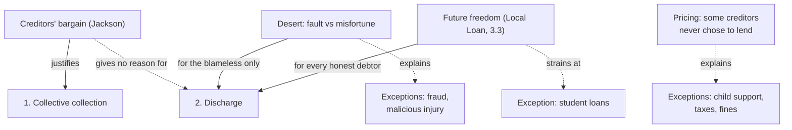

# Philosophy of Debt · Lesson 5.3: Bankruptcy as a moral institution

> ⏱ ~15 min · Module 5: Forgiveness, relief and the fresh start · Builds on: [5.1 Forgiving a debt, forgiving a wrong](05-01-forgiving-a-debt-forgiving-a-wrong.md), [5.2 Moral hazard and fairness to those who paid](05-02-moral-hazard-and-fairness-to-those-who-paid.md), [3.3 What may be pledged](03-03-what-may-be-pledged.md) · Unlocks: [5.4 Jubilee as a moral principle](05-04-jubilee-as-a-moral-principle.md), Boss problem 5 ([syllabus](../syllabus.md))

## Why this matters

In [5.1](05-01-forgiving-a-debt-forgiving-a-wrong.md), [release](../reference.md#release) was the creditor's power. Bankruptcy lets a court discharge the debt over the creditor's objection. Is the discharge a wrong the law tolerates, mercy for the unlucky, a deal creditors would have struck themselves, or a protection no contract may remove? The answers come apart on the debts the law refuses to discharge, and on the one debtor no court can discharge at all: a state.

## The idea

Bankruptcy does two things, and they need different justifications.

1. **Collective collection.** Creditors stop racing to seize assets. The debtor's present property is sold once and shared in proportion to claims.
2. **Discharge.** Whatever the sale does not cover is cancelled by law, and the debtor's future earnings are her own.

History first: discharge began in England as a prize creditors paid traders for disclosing their assets, and over two centuries failure was recast from moral fault toward misfortune ([`history-of-debt` 4.2](../../history-of-debt/lessons/04-02-debtors-prisons-and-the-invention-of-bankruptcy.md)). How the institution arose does not settle whether it is just. Three accounts try to.

- **Desert.** Promises bind ([1.4](01-04-contract-debt-and-the-duty-to-repay.md)), and release is the creditor's to give. The state may override him only for a debtor ruined by misfortune rather than fault. That is the old line between failure as *sin* and failure as *misfortune*, restated today as [brute versus option luck](../reference.md#brute-and-option-luck) ([5.2](05-02-moral-hazard-and-fairness-to-those-who-paid.md)). The blameworthy should keep paying.
- **The [creditors' bargain](../reference.md#creditors-bargain).** Thomas Jackson (first in the *Yale Law Journal*, 1982, then *The Logic and Limits of Bankruptcy Law*, 1986; paraphrased) justifies the collective proceeding as the agreement creditors would make in advance, before knowing who would win the race. Beyond that, bankruptcy should respect the rights creditors held outside it. The bargain explains part 1. Jackson defended the discharge separately, drawing on psychology: borrowers systematically misjudge the risks they load onto their future selves, so the right must be one they cannot sign away.
- **Future freedom.** A claim on all of someone's future earnings, with no end date, puts her working life at a creditor's disposal. The principle of [3.3](03-03-what-may-be-pledged.md) lets a borrower pledge a share of future income but not her labor ([pledging future labor](../reference.md#pledging-future-labor)). On this view an unlimited claim on income crosses that line, and the discharge cuts it off, as the Supreme Court reasoned in 1934.

## Source

*Local Loan Co. v. Hunt*, 292 U.S. 234 (1934), Justice Sutherland for the Court (US opinions are public domain). Hunt borrowed 300 dollars in 1930 and, as security, assigned part of his future wages. After his discharge the lender sued his employer to collect from his later wages, relying on Illinois decisions that such an assignment survived. Having quoted an earlier decision on relieving "the honest debtor" so that he may "start afresh", the Court wrote:

> This purpose of the act has been again and again emphasized by the courts as being of public as well as private interest, in that it gives to the honest but unfortunate debtor who surrenders for distribution the property which he owns at the time of bankruptcy, a new opportunity in life and a clear field for future effort, unhampered by the pressure and discouragement of pre-existing debt.

And on the wage assignment:

> The power of the individual to earn a living for himself and those dependent upon him is in the nature of a personal liberty quite as much if not more than it is a property right. … From the viewpoint of the wage-earner there is little difference between not earning at all and earning wholly for a creditor.

**The rationale is inherited.** The earlier decision spoke of "business misfortunes"; here the same purpose shelters a wage-earner, far from the traders for whom discharge was invented (history-of-debt 4.2). **Two interests are named:** "public as well as private". **The filter has a grammar.** The one condition the sentence spells out is a clause about conduct in the proceeding, "who surrenders for distribution the property which he owns": the old disclosure bargain. Whether "unfortunate" adds a test of how the debts arose, the sentence does not say; Boss problem 5 asks. The second passage turns purpose into principle and gives the [fresh start](../reference.md#fresh-start) its philosophy: earning power is a liberty at least as much as a property right. (The phrase "fresh start" is not in the opinion.)

## The argument

**The [future-freedom argument](../reference.md#future-freedom-argument) for discharge**, reconstructed from the Source and [3.3](03-03-what-may-be-pledged.md); P3 to P5 are the lesson's, not the Court's.

- **P1. Earning power is a liberty, not only an asset.** The power to earn a living is "in the nature of a personal liberty". *In words:* your future work is part of your life, not just part of your estate.
- **P2. An unlimited claim on future earnings commands that power.** A debt collectible from every future paycheck, without end, makes the debtor's working life serve the creditor. *In words:* past some point, owing everything you will earn is a kind of servitude.
- **P3. The conditions of future agency are [inalienable](../reference.md#inalienability).** No one may sell or pledge them, and the law should not enforce such a pledge even when it was freely made (self-sale, *nexum* and Mill's slavery contract in 3.3). *In words:* some things cannot be put up as security, however willing the borrower.
- **P4. For an insolvent debtor, a surviving debt is such a claim.** Once present property is gone, only future earnings remain to collect from. *In words:* when you cannot pay, a debt that never ends is a lien on the rest of your life.
- **P5. Honest surrender satisfies the creditor's rightful claim.** He is entitled to what the debtor has, not to what P3 forbids anyone to pledge. *In words:* hand over everything you own, truthfully, and you have paid all you could rightly owe.

**∴ C.** The law should discharge the honest debtor who surrenders her property, and the right to that discharge should not be waivable.

**Where the argument is weakest.** P4, with P2 behind it. A critic grants P3 and holds to 3.3's own line: a share of future income may be pledged, because a claim on earnings leaves the debtor free to choose whether and how to work. The creditor gets part of the proceeds, not command of the labor. Income tax already takes a share of everyone's future earnings, and no one calls that servitude. So the argument earns a floor (exempt property, a cap on garnished wages, a time limit), not discharge of the whole balance. The Court met the point about size with a principle rather than a line: the amount assigned "may here be small, but the principle, once established, will equally apply where both are very great." The critic replies that a cap is exactly the line that stops the slide. The defender answers that an unpayable debt harms by its horizon, not its monthly bite: the "pressure and discouragement" runs for life under any cap.

## Map of positions

US law excepts from discharge, among others, child support and alimony, certain taxes, debts obtained by fraud, debts for willful and malicious injury, fines owed to the government, and student loans unless excepting them would impose "undue hardship" (11 U.S.C. § 523(a); the student-loan history is [`history-of-debt` 6.5](../../history-of-debt/lessons/06-05-student-and-consumer-debt.md)). No single account explains these [non-dischargeable debts](../reference.md#non-dischargeable-debt). Fraud and malicious injury fit desert: the debt was born of a wrong. Support, taxes and fines fit a fourth idea, the pricing argument. A card issuer charged for the risk of discharge in its rate; a child, a tax office or a court never chose to extend credit, so never priced it. Student loans sit worst with future freedom: the loan bought the very earning power a discharge would shield, and a new graduate has almost nothing to surrender.

## Worked examples

**Example 1 (clean): the race and the pool.** A printer who runs her own shop fails owing three creditors 50,000 dollars each. All figures are illustrative. Sold as a working business, the shop fetches 90,000 dollars; auctioned piece by piece, 60,000.

- *Race.* The first creditor to levy takes 50,000 in full, the second the 10,000 left, the third nothing. Before anyone knows the order, each has an equal chance at each place, so each expects $\frac{50{,}000 + 10{,}000 + 0}{3} = 20{,}000$ dollars.
- *Pool.* One sale at 90,000, shared pro rata: $90{,}000 / 150{,}000 = 0.6$ of each claim, so 30,000 each, for certain.

Asked in advance, every creditor prefers the pool: 30,000 for sure beats an expected 20,000 with a one-in-three chance of nothing. That is the bargain, a mutual-advantage argument of the kind in [`ethics` 5.1](../../ethics/lessons/05-01-contractarianism-morality-as-mutual-advantage.md); [`economics-of-debt` 7.3](../../economics-of-debt/lessons/07-03-designing-bankruptcy.md) treats the same common-pool problem as mechanism design.

Now suppose she could pay another 30,000 over five years from wages. Would the three, bargaining among themselves, release it? No: release takes 10,000 from each and gives it to someone outside the bargain. Taken alone, the bargain's rule of respecting rights held outside bankruptcy would have let Hunt's Illinois lien stand; the Court overrode it for the fresh start. A different contract could produce a discharge: a borrower choosing before she knows her luck might buy one as insurance, paid for in higher rates (economics-of-debt 8.1). That reading grants 5.2's incentive objection in full and says lenders price it.

**Example 2 (hard): a state.** A sovereign that cannot pay has no bankruptcy court. It cannot be liquidated, and it restructures by offer, binding dissenters mainly through collective action clauses ([`history-of-debt` 6.3](../../history-of-debt/lessons/06-03-holdouts-and-the-law-of-sovereign-restructuring.md)).

- *The bargain transfers.* Bondholders suing one by one face Example 1's common-pool problem, and a collective action clause is the bargain written into the contract in advance: a supermajority binds the rest.
- *Future freedom loses its debtor.* *Local Loan*'s exchange is surrender for release: hand over "the property which he owns" and keep your future. A state can surrender almost nothing a court could sell, and its "future effort" is its citizens', many unborn when the debt was contracted.
- *Desert has no single debtor to judge.* The officials who borrowed, the citizens who elected or endured them, the lenders who knew what they were funding: whose fault is a state's failure?

Only the creditors' half of bankruptcy transfers to states. The debtor-side reasons apply, if at all, to citizens, and yield not a discharge but a question about which debts can bind a people: [6.1](06-01-the-earth-belongs-to-the-living.md) for generations, [6.3](06-03-whose-debt-is-it.md) for odious debt.

## Watch out

- **You might think the discharge's history settles its justification.** It began as a creditors' device, so it serves creditors; or the law came to see failure as misfortune, so discharge is for the unfortunate. Both slide from a historical claim to a normative one. The bargain is a claim about what creditors *would* agree to, and the future-freedom argument about what no one *may* pledge. Neither stands or falls with the history.
- **You might think a discharge is forgiveness.** In 5.1's terms it is neither the creditor's release (the court acts over his objection) nor forgiveness of a wrong (no resentment is in question). It ends the legal claim. Whether a moral debt survives is argued in [`theology-of-debt` 6.3](../../theology-of-debt/lessons/06-03-the-ethics-of-personal-debt.md), where a Catholic moral manual and its own American editor disagree.
- **You might think the future-freedom argument condemns every surviving debt.** It condemns claims that put a working life at a creditor's disposal. A capped, time-limited claim may pass P2. Child support sets the debtor's future against a child's, a conflict inside the argument rather than a counterexample to it.

## One-liner

> Creditors would bargain their way into bankruptcy's collective sale but never into its discharge, which needs its own reason, mercy for misfortune or a future no one may pledge; the debts a law refuses to discharge show which reason it holds.

## Problems

**P1 (🟢) *(Formal (a)–(b) · Exegetical (c))*** A café owner fails owing a bank 60,000 dollars and a supplier 40,000 dollars. Sold as a going business, the café fetches 80,000 dollars; seized and auctioned piecemeal by whichever creditor levies first, 50,000. All figures are illustrative. (a) If each creditor is equally likely to levy first, what does each expect from the race, and what does each receive from a collective sale shared pro rata? (b) The supplier delivers every morning and will always levy first. Give each creditor's recovery from the race now, and the value the race destroys. (c) The supplier says: "I would never have agreed to your collective proceeding." Which premise of Jackson's argument does that attack? Two sentences.

**P2 (🟡) *(Exegetical (a) · Evaluative (b))*** An invented country discharges all debts after an honest surrender of property. Two amendments are proposed.

- **Rule T:** income taxes assessed in the three years before filing survive the discharge. They get no priority in the sale of the debtor's property.
- **Rule W:** a lender may take as security an assignment of up to 10% of the borrower's wages for five years, and the assignment survives the discharge.

(a) For each rule, say what the creditors' bargain implies and what the future-freedom argument implies. One sentence each, four in all. (b) Should the country adopt Rule W? Give a verdict, name the premise of the future-freedom argument your verdict turns on, and answer the strongest objection to your verdict. 120 words or fewer for (b).

**P3 (🔴, optional) *(Exegetical)*** Two invented legislators debate a proposal to let judges refuse a discharge to a debtor whose debts were "incurred recklessly".

- **A:** "Bankruptcy is for people ruined by misfortune. Someone who borrowed recklessly chose his debts, and he should keep paying them."
- **B:** "How the debts arose is beside the point. No one may be made to work for his creditors for the rest of his life, whatever he did. If he surrenders what he owns, he must be released."

Name the single premise they divide on, and say what argument or evidence would move each of them. 150 words or fewer; no verdict required.

Solutions

**P1** *(Formal (a)–(b) · Exegetical (c))*

**Must hit, strict (a):** in the race, if the bank levies first it takes the whole 50,000 (short of its 60,000 claim) and the supplier gets 0; if the supplier levies first it takes its 40,000 and the bank gets the 10,000 left. Expected: bank $\frac{50{,}000 + 10{,}000}{2} = 30{,}000$ dollars; supplier $\frac{0 + 40{,}000}{2} = 20{,}000$ dollars. In the pool, $80{,}000 / 100{,}000 = 0.8$ of each claim: bank $0.8 \times 60{,}000 = 48{,}000$, supplier $0.8 \times 40{,}000 = 32{,}000$. Both prefer the pool.

**Must hit, strict (b):** supplier 40,000, bank 10,000, total 50,000. The race destroys $80{,}000 - 50{,}000 = 30{,}000$ dollars, the going-concern value. The supplier gains $40{,}000 - 32{,}000 = 8{,}000$ over the pool, and the bank loses $48{,}000 - 10{,}000 = 38{,}000$. (Credit for noting that the bank could pay the supplier more than 8,000 to join the pool and still keep almost $48{,}000 - 8{,}000 = 40{,}000$, far above its 10,000 from the race.)

**Must hit, strict (c):** the premise that the agreement that counts is the one creditors would make *before knowing their place in line*, and that this hypothetical agreement binds them once they know it. The supplier never stood behind that ignorance, so it attacks the step from hypothetical agreement to actual obligation: the "no contract at all" objection to hypothetical consent ([`political-philosophy` 1.2](../../political-philosophy/lessons/01-02-consent-actual-tacit-and-hypothetical.md)).

**Wrong turns:** in (a), giving the bank 60,000 when it levies first, though only 50,000 is there to seize. In (c), saying the supplier denies that the race destroys value (the 30,000 is lost whoever wins), or calling the complaint a moral-hazard point.

**Model answer (c):** The supplier attacks the premise that what creditors would agree to before they know who wins the race binds a creditor who knows it will win, since the bargain's force comes from an ignorance of position the supplier never had. A defender replies that the rule existed before the supplier gave credit, so it lent under the rule and in that sense accepted it.

---

**P2** *(Exegetical (a) · Evaluative (b))*

**Must hit, strict (a):**
- *Bargain, Rule T:* no verdict. The bargain governs how creditors share present property, and T changes only what the debtor owes one creditor afterward; a bargain that gives no reason to discharge anything gives none against a debt surviving. (Also accept: its respect for rights held outside bankruptcy leans toward survival.)
- *Bargain, Rule W:* for it. The assignment is a security right the lender holds outside bankruptcy, and enforcing it against later wages takes nothing from the other creditors' pool. It is, capped, the Illinois rule *Local Loan* rejected.
- *Future freedom, Rule T:* against it, or at least for a cap, since an open-ended surviving tax debt is a claim on future earnings (P2, P4), unless the argument can show that a public creditor's claim is different.
- *Future freedom, Rule W:* it turns on P2. A tenth of wages for five years is far from "earning wholly for a creditor", so the argument condemns W only if it follows the Court in holding that the principle does not depend on the amount. (3.3's line, which permits pledging a share of income, points the same way as P2.)

**Must hit, any verdict (b):** a verdict; P2 or P4 named as the premise it turns on (does a capped, time-limited claim put earning power at the creditor's disposal?); the strongest objection answered. If adopting W: the Court's slide argument, including small assignments stacking across lenders. If rejecting W: the critic's tax parallel and the bargain's respect for the lender's security.

**Wrong turns:** saying the bargain supports discharge. Saying W breaks the bargain (it takes nothing from other creditors). Treating the borrower's consent to W as settling the matter, when P3 exists precisely to override consent. Answering (b) from desert alone.

**Model answer (b), one of several:** Adopt it, with one change. The verdict turns on P2. A tenth of wages for five years does not make the debtor earn "wholly for a creditor": she keeps nine-tenths, chooses her work and is free in five years, a burden like a temporary tax rise, which no one calls servitude. The strongest objection is the Court's: the principle does not depend on the amount, and small assignments can stack until the debtor works for lenders. So cap the total, not the loan: no more than 10% of wages across all assignments, for five years. Drawn that way, the line cannot slide.

---

**P3** *(Exegetical)*

**Must hit, strict:**
- The crux: *whether fault in how a debt arose can forfeit the protection a discharge gives.* A treats the discharge as relief conditional on desert, judged backward from the debt's origin. B treats it as a protection of future agency that no past fault forfeits: P3 with no forfeiture exception. Neither disputes that debts bind.
- What would move B (any one): cases B probably accepts in which fault does limit someone's future, such as criminal fines and restitution, or fraud and malicious-injury debts surviving discharge. Accepting them concedes forfeiture in principle, and B then owes an account of why recklessness differs from wrongdoing.
- What would move A (any one): the parallel with other inalienable protections (the reckless may not sell themselves or be held in peonage either, 3.3), so fault does not generally license servitude. Or evidence that judges cannot reliably tell recklessness from misfortune, which would make A's rule arbitrary in practice.

**Wrong turns:** naming moral hazard as the crux; neither speaker argues from incentives, and that is 5.2's question. Naming "whether debts bind", which both accept. Giving a verdict.

**Model answer:** They divide on whether fault in incurring a debt can forfeit the discharge's protection. For A the discharge is relief for the unlucky, so the debt's origin decides; for B it protects the debtor's future, which no past fault can pledge away. B would be moved by cases where he already lets fault limit a future (fines, restitution, fraud debts that survive discharge), since the question then becomes where the line falls, not whether there is one. A would be moved by the parallel with self-sale and peonage, which the reckless may not enter either, or by evidence that courts cannot reliably sort recklessness from misfortune.

## Flashback

**From Lesson [5.1](05-01-forgiving-a-debt-forgiving-a-wrong.md) (Forgiving a debt, forgiving a wrong):** *(Exegetical.)* An **invented** case. Anton lent his nephew Felix 8,000 dollars. When Anton asked for it back, Felix sent him a letter calling him a miser who cared more for money than for his family. Anton died a month later. His will left everything, the 8,000-dollar claim included, to his daughter Greta, and the estate has been settled. Greta sends Felix a note: "I release you from the 8,000 dollars, and I forgive you for that letter." Anton's oldest friend, Hugo, sends Felix a note in exactly the same words.

(a) What did each note do to the 8,000 dollars? (b) Can Greta forgive the letter? Answer on the victim-only view and on the view that extends standing to suitably related third parties, and say why the debt analogy behind the victim-only view cannot decide between them. **Two sentences for (a); three for (b).**

Solution

**Must hit, strict (a):** Greta's note **released** the debt. The claim passed to her under the will, and with it the power to extinguish Felix's duty; a release needs only standing and a recognized way of saying so, whatever she feels. Hugo's note did **nothing** to it: he holds no claim, so as a third party he could only pay Greta, which would satisfy the claim, or buy the claim from her and release it as its new holder.

**Must hit, strict (b):** On the **victim-only view**, no: the insult was done to Anton, and standing to forgive belongs to the one wronged (accept the refinement that she may forgive any wrong the letter did to her). On the **extended view** (Pettigrove among others), a daughter is a strong candidate for a suitably related third party, so perhaps yes. The analogy cannot decide: standing to release reached Greta only because claims are **transferable**, since a creditor can sell or give a claim away ([1.1](01-01-the-grammar-of-owing.md)), and whether a grievance can pass to anyone is exactly what the two views dispute.

**Wrong turns:** Saying Greta cannot release a debt that was owed to her father: the claim is hers now. Counting Hugo's note as a release because it uses the right words: a release needs standing, and words from someone who holds no claim release nothing. Arguing that because the claim passed to Greta the grievance did too, which assumes the answer to (b). Letting one act settle the other: if her forgiveness fails on the victim-only view, her release still stands.

**Model answer:** (a) Greta's note released the debt, since the claim passed to her under the will and a release needs only the holder's say-so. Hugo's note did nothing to it, because he holds no claim; he could only pay Greta or buy the claim from her and then release it. (b) On the victim-only view Greta cannot forgive the letter, because the wrong was done to her father, not to her. On the extended view a daughter is a strong candidate for a suitably related third party, so she may. The analogy cannot decide: standing to release reached Greta because a creditor can give a claim away, and whether a grievance can pass to anyone is exactly what the two views dispute.

## Connections

- **Backward:** [5.1](05-01-forgiving-a-debt-forgiving-a-wrong.md) made release the creditor's power; a discharge is the state's act, not the creditor's, so it needs a justification a creditor's release never did. [3.3](03-03-what-may-be-pledged.md) allowed a pledge of future income but not of future labor; the future-freedom argument says an unlimited claim on income crosses that line. [5.2](05-02-moral-hazard-and-fairness-to-those-who-paid.md) owns moral hazard and the brute and option luck line the desert account rests on. [1.4](01-04-contract-debt-and-the-duty-to-repay.md) showed that a limit on what the law will compel is not a release, and called the discharge the largest such limit; its duty to repay is common ground for every account here.
- **Forward:** [5.4](05-04-jubilee-as-a-moral-principle.md) replaces the court and the surrender with a release scheduled for everyone in advance. [6.1](06-01-the-earth-belongs-to-the-living.md) and [6.3](06-03-whose-debt-is-it.md) take up Example 2's question of whose future a public debt claims. Boss problem 5 close-reads the *Local Loan* passage.
- **Sideways:** in the debt thread, [`history-of-debt` 4.2](../../history-of-debt/lessons/04-02-debtors-prisons-and-the-invention-of-bankruptcy.md) tells how discharge was invented, [6.3](../../history-of-debt/lessons/06-03-holdouts-and-the-law-of-sovereign-restructuring.md) why sovereigns have no bankruptcy court, and [6.5](../../history-of-debt/lessons/06-05-student-and-consumer-debt.md) how student loans lost the exit. [`theology-of-debt` 6.3](../../theology-of-debt/lessons/06-03-the-ethics-of-personal-debt.md) asks whether a moral debt survives discharge. [`economics-of-debt` 7.3](../../economics-of-debt/lessons/07-03-designing-bankruptcy.md) designs the collective proceeding and 8.1 models the discharge as insurance. Non-waivability raises the paternalism question [`political-philosophy` 3.3](../../political-philosophy/lessons/03-03-paternalism-and-legal-moralism.md) examines through Mill's slavery contract, and the Contracts Clause and state insolvency laws as doctrine are [`constitutional-law`](../../constitutional-law/syllabus.md) 4.2's.
