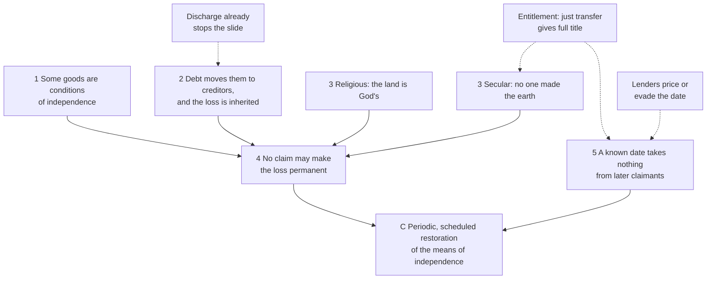

# Philosophy of Debt · Lesson 5.4: Jubilee as a moral principle

> ⏱ ~15 min · Module 5: Forgiveness, relief and the fresh start · Builds on: [5.2 Moral hazard and fairness to those who paid](05-02-moral-hazard-and-fairness-to-those-who-paid.md), [5.3 Bankruptcy as a moral institution](05-03-bankruptcy-as-a-moral-institution.md), [`history-of-debt` 1.3](../../history-of-debt/lessons/01-03-release-laws-in-ancient-israel.md), [`theology-of-debt` 1.3](../../theology-of-debt/lessons/01-03-the-jubilee-the-land-is-mine.md) · Unlocks: [6.1 The earth belongs to the living](06-01-the-earth-belongs-to-the-living.md)

## Why this matters

A bankruptcy discharge ([5.3](05-03-bankruptcy-as-a-moral-institution.md)) releases one debtor at a time, after the fall, and can be refused to a debtor who cheated. A Jubilee releases everyone on a date fixed in advance and asks nothing about how anyone got into debt. It is the thread's most radical form of relief and its most invoked, from Jubilee 2000 ([`history-of-debt` 5.5](../../history-of-debt/lessons/05-05-jubilee-2000-and-hipc.md)) to papal appeals ([`theology-of-debt` 6.2](../../theology-of-debt/lessons/06-02-international-debt-and-the-jubilee-call.md)). The thread reads Leviticus 25 three ways: as **law** in its Near Eastern setting ([`history-of-debt` 1.3](../../history-of-debt/lessons/01-03-release-laws-in-ancient-israel.md)), as **theology** of God's ownership of the land ([`theology-of-debt` 1.3](../../theology-of-debt/lessons/01-03-the-jubilee-the-land-is-mine.md)), and as a **mechanism** that lenders price ([`economics-of-debt`](../../economics-of-debt/syllabus.md) 8.2). None of them asks whether *no claim may bind for ever* is a principle of justice, or whether it survives without God as the landlord. This lesson does.

## The idea

There are two ways to stop a family's slide into permanent dependence. You can rescue it after it falls, with charity, a discharge or a one-off write-off. Or you can write an expiry date into every claim that could take its livelihood. Leviticus does the second. A sale of farmland is really a lease running to the fiftieth year, and an Israelite who sells himself works as a hired man until then (25:39–41). Strictly, nothing is forgiven, because the claim was never permanent. And the law protects livelihoods, not property as such: a house in a walled city, unredeemed after a year, is sold for good, while fields and village houses go back (25:29–31).

Abstracted, the [Jubilee principle](../reference.md#jubilee-as-principle) has a limiting half (no claim may strip a household of its means of independence for good) and a restoring half (periodically, those means come back). What comes back can be read three ways.

- **Restoration.** Each family recovers its own holding, however large. This is the letter of Leviticus: backward-looking, and not equalizing.
- **Sufficiency.** No one stays at another's mercy for good. This looks forward.
- **A level start.** Everyone begins again with equal means. Ronald Dworkin called equal resources at the start, laissez-faire afterwards, the [starting-gate](../reference.md#starting-gate-equality) theory, and rejected it as arbitrary: equality owed at one moment is owed at others ("What Is Equality? Part 2", 1981). A periodic Jubilee is a starting gate that comes round again, though one Dworkin would fault for ignoring whether a loss came from choice ([`political-philosophy`](../../political-philosophy/syllabus.md) 2.5–2.6).

## Source

Thomas Paine, *Agrarian Justice* (written 1795–96, published 1797), from Conway's edition of the *Writings*. The argument has Leviticus's shape, with no one on the title deed.

> [I]t is the value of the improvement only, and not the earth itself, that is individual property. Every proprietor, therefore, of cultivated land, owes to the community a *ground-rent* (for I know of no better term to express the idea) for the land which he holds … Man did not make the earth, and, though he had a natural right to occupy it, he had no right to locate as his property in perpetuity any part of it; neither did the creator of the earth open a land-office, from whence the first title-deeds should issue. … In advocating the case of the persons thus dispossessed, it is a right, and not a charity, that I am pleading for.

Read three phrases.

- **"In perpetuity"** is Leviticus's "for ever" in secular dress. Paine keeps private landholding but denies that any title to the ground runs for ever against those born later. The **"land-office"** marks the difference: Leviticus's God keeps the title, while for Paine no one ever issued a private one. Both routes end at the same place.
- **"The value of the improvement only"** concedes the Lockean point that the farmer owns what his labour added. The common claim is to the unimproved ground, so the remedy is a rent, not a share-out of farms, which Paine rejects as unjust.
- **"Owes"** turns the Jubilee around. Paine finds a [ground-rent](../reference.md#ground-rent) owed by landholders to the community, for the dispossessed, and "a right, and not a charity" makes paying it justice, not relief.

The plan: a national fund pays everyone fifteen pounds sterling at twenty-one, as partial compensation for the lost natural inheritance, and ten pounds a year for life from fifty. It is filled by taking a tenth of each estate as it passes at death, and more when it goes to distant relatives.

## The argument

1. **Some goods are conditions of independence.** A household without them lives on terms set by others: in Leviticus its fields and its members' freedom, in Paine a share of the earth's natural value. *In words:* some losses cost standing, not just wealth.
2. **Left alone, debt moves those goods from debtors who fall behind to their creditors, and the loss passes to their children.** It is empirical: the ancient slide ran from land to children to the debtor himself ([`history-of-debt` 1.3](../../history-of-debt/lessons/01-03-release-laws-in-ancient-israel.md)).
3. **No private title to those goods is absolute.** *Religious form:* the land "shall not be sold for ever: because it is mine" (Lev 25:23), so a seller only ever had a tenancy to sell. *Secular form:* no one made the earth, so no one may hold it in perpetuity against those born later, and private right covers the improvement, not the ground.
4. **So no claim, whether a debt, a sale or a pledge, may make that loss permanent.** *In words:* you may lose your field for a time, but not for good, and not for your grandchildren.
5. **A restoration fixed in advance honours 4 without taking anything from later claimants.** Anyone who lends or buys after the rule is set knows the date and pays only for a claim that runs out, as Leviticus prices land by the harvests left (25:15–16). *In words:* a lease that ends on schedule confiscates nothing.

∴ **Justice requires a periodic, scheduled restoration of the means of independence.** In Leviticus, land and persons return in the fiftieth year. In Paine, every twenty-one-year-old receives a stake.

**Where the argument is weakest.** Premise 3, in both forms. The critic is Robert Nozick's [entitlement theory](../reference.md#entitlement-theory) (*Anarchy, State, and Utopia*, 1974; [`political-philosophy`](../../political-philosophy/syllabus.md) 2.4). What is justly acquired and justly transferred is owned outright, including the power to sell for ever, so a law that turns sales into leases takes part of what owners hold. The religious form answers him only for those who accept God's title, and they keep its premise rather than its calendar: Catholic teaching treats the calendar as a lapsed judicial precept but holds owners to be stewards of goods destined for all ([`theology-of-debt` 1.2](../../theology-of-debt/lessons/01-02-the-seventh-year-deuteronomy-15.md), [1.3](../../theology-of-debt/lessons/01-03-the-jubilee-the-land-is-mine.md)). The secular form meets Nozick on shared ground. He keeps a version of Locke's proviso: an appropriation wrongs anyone it leaves worse off than if the land had stayed in common, and the remedy is compensation, not surrender. That is Paine's baseline and Paine's remedy. They part over a fact: Nozick held that market economies readily satisfy the proviso; Paine, that millions were worse off than if born before civilization began. Premise 5 moves the fight to the transition. A release written into titles wrongs no later buyer, but someone owned land outright when the law passed. Paine collects at death, when "the bequeather gives nothing: the receiver pays nothing". The critic replies that the power to bequeath was part of what the owner held.

## Argument map

Solid arrows support; dashed arrows are objections.

## Worked examples

**Example 1 (clean): Paine's plan as a Jubilee.** Premises 1–3 are the natural inheritance, Paine's claim that poverty has become hereditary, and the secular title. Premise 5 holds because the fund collects at deaths and pays at twenty-first birthdays, dates anyone can foresee, and Paine insists it takes nothing from any present possessor during his life. Three things change from Leviticus.

- **What returns** is money, not the family's own field, and the same sum goes to rich and poor. Restoration becomes sufficiency plus a small level start.
- **The clock is personal.** Each estate pays when its owner dies, and each person collects at twenty-one. Without a national release day, lenders have no date to see coming.
- **No debt is released.** The Jubilee has become an inheritance tax. On Paine's own figures, England's capital of 1,300 million pounds (Pitt's 1796 estimate) passes by death once in thirty years, about 43⅓ million a year. A tenth of that, plus a further tenth on the 13⅓ million going to distant relatives, gives 4⅓ + 1⅓ = 5⅔ million a year (about 13 percent of what passes): 4 million for 400,000 pensions, 1.35 million for the 90,000 new adults a year he expects to claim, the rest for the blind and lame.

**Example 2 (hard): scheduled against surprise.** An invented state, Marenia, cancels all consumer debts on one unannounced day and promises never to repeat it. Set it beside a release written into every loan in advance, and run the objections of [5.2](05-02-moral-hazard-and-fairness-to-those-who-paid.md) ([scheduled and surprise release](../reference.md#scheduled-and-surprise-release)).

- **Fairness to creditors.** Marenia takes claims held on terms that never included a release. A scheduled release takes nothing from those who lent after it was set: they priced it in.
- **[Moral hazard](../reference.md#moral-hazard).** Marenia rewards borrowing already done, so it creates no hazard unless people expect another release. The schedule's hazard is known and dated: a loan made just before the date need never be repaid, which is why lenders stop lending as it nears. That is the freeze Deuteronomy 15:9 forbids and Hillel's *prosbul* engineered around ([`history-of-debt` 1.3](../../history-of-debt/lessons/01-03-release-laws-in-ancient-israel.md)).
- **Credibility.** Each design makes a promise that is hard to keep. Marenia's is *never again*, and lenders who have seen one surprise price the next into every loan. The schedule's is *on this date, whatever happens*, and when the date comes creditors will press for delay. Jeremiah 34 records a release of slaves proclaimed under siege, then revoked ([`theology-of-debt` 1.2](../../theology-of-debt/lessons/01-02-the-seventh-year-deuteronomy-15.md)). The model of rules against discretion is [`economics-of-debt`](../../economics-of-debt/syllabus.md) 8.1's.

So the surprise charges lenders who lent in good faith and, through a premium, future borrowers. The schedule charges borrowers who need credit near the date. Which is fairer turns on who should bear the loss, and on what those shut out of credit are owed: Deuteronomy's duty to lend anyway, a charitable lender like the *monti di pietà* ([`history-of-debt` 2.2](../../history-of-debt/lessons/02-02-jewish-lenders-and-the-monti-di-pieta.md)), or Paine's stake, which makes borrowing less necessary. The Catholic appeals on international debt take a third route ([`theology-of-debt` 6.2](../../theology-of-debt/lessons/06-02-international-debt-and-the-jubilee-call.md)): debts bind, but may not be exacted at the price of a people's hunger, so creditors are asked to lighten, defer or cancel, with a Jubilee year as the occasion. Because that relief runs through the creditors' own power of [release](../reference.md#release) ([5.1](05-01-forgiving-a-debt-forgiving-a-wrong.md)), their fairness complaint cannot arise, though that of those who repaid still can.

## Watch out

- **You might think the Jubilee cancels debts.** Leviticus 25 returns land and persons. Debts are released in Deuteronomy's seventh year ([`theology-of-debt` 1.2](../../theology-of-debt/lessons/01-02-the-seventh-year-deuteronomy-15.md)). Modern "Jubilee" campaigns merge the two, so check which release an argument needs.
- **You might think the argument stands or falls with ancient history.** Premise 2 is empirical, and it has to hold *now*. If the end of debt bondage and the [fresh start](../reference.md#fresh-start) of discharge already prevent permanent dependence, [5.3](05-03-bankruptcy-as-a-moral-institution.md)'s institution satisfies the principle with no calendar. Defenders reply that dependence now runs through lost credit, lost housing and inherited poverty, which discharge does not reach. That dispute is about present facts, which no reading of Leviticus or Paine settles.

## One-liner

> The Jubilee principle is a limit, not a pardon: no claim may make the loss of a livelihood permanent, because the land is God's or because no one made the earth, and fixing the date in advance spares creditors a surprise by charging borrowers near the date.

## Problems

**P1 (🟢) *(Exegetical.)*** Paine, *Agrarian Justice* (Conway's edition):

> It is the practice of what has unjustly obtained the name of civilization (and the practice merits not to be called either charity or policy) to make some provision for persons becoming poor and wretched only at the time they become so. Would it not, even as a matter of economy, be far better to adopt means to prevent their becoming poor? This can best be done by making every person when arrived at the age of twenty-one years an inheritor of something to begin with. The rugged face of society, chequered with the extremes of affluence and want, proves that some extraordinary violence has been committed upon it, and calls on justice for redress. The great mass of the poor in all countries are become an hereditary race, and it is next to impossible for them to get out of that state of themselves.

(a) Which two policies does Paine contrast, and which words fix the difference between them? (b) He gives two grounds for the second policy. Name each with the words that mark it, and say which ground survives if you deny the Source's premise that no one may hold the earth itself as private property. (c) One sentence infers a past injustice from the present distribution of wealth. Give its key words, and say why an entitlement theorist rejects the inference. **Two sentences per part.**

**P2 (🟡) *(Formal (a)–(b) · Evaluative (c).)*** Illustrative numbers; ignore interest and discounting. A lender's borrowers repay slowly: each year, a borrower who has not yet repaid pays off the whole loan with probability 0.4, independently of earlier years. Compare two release rules.

- **Rule N (national day):** every unpaid debt lapses on one national release day. A loan made $k$ years before that day gives the borrower $k$ year-ends at which to repay.
- **Rule P (personal clock):** each debt lapses ten years after the day it was made.

(a) Under Rule N, what fraction of a loan does the lender expect to recover when $k = 1$, $3$ and $10$? What fraction under Rule P?
(b) The lender lends only if he expects to recover at least 90 percent. For which $k$ does he lend under Rule N, and when does he lend under Rule P?
(c) Which part of the Jubilee argument does Rule P keep, and what does it give up? Say whether the trade is worth making. **100 words or fewer.**

**P3 (🔴, optional) *(Exegetical (a) · Evaluative (b).)*** An invented island republic, Tavora. Over forty years, distress sales after bad harvests have put most farmland in the hands of a few families. The legislature debates a Reversion Act: every sale of farmland becomes a lease that ends on a Reversion Day held every fifty years, when the land returns without payment to the family that sold it. **Version 1** covers only sales made after the Act. **Version 2** also reverts land sold in the past forty years.

(a) Apply the entitlement objection to each version, assuming for this part that every past sale was free of force and fraud. From whom, if anyone, does each version take something justly held? **Two sentences per version.**
(b) Give the best reply to the objection against Version 2, using either Paine's timing (collect at death) or Nozick's own principle of rectification, and say where the reply stops working. **150 words or fewer.**

Solutions

**P1** *(Exegetical — strict.)*

**Must hit, strict (a):** provision for people "only at the time they become so", after they have fallen, against "means to prevent their becoming poor": a grant that makes each person at twenty-one "an inheritor of something to begin with". The deciding words are about timing: "only at the time they become so" against "prevent" and "to begin with".

**Must hit, strict (b):** *economy* ("even as a matter of economy, be far better"): prevention costs less than relief. *Justice as redress* ("calls on justice for redress") for an "extraordinary violence". The economy ground survives the denial untouched, since it says nothing about who may own the earth. The justice ground survives only if the violence can be shown in the historical record, because the Source's version of the wrong was the loss of a common inheritance.

**Must hit, strict (c):** "The rugged face of society, chequered with the extremes of affluence and want, proves that some extraordinary violence has been committed upon it." The entitlement theory is historical. Holdings are just or unjust by how they arose, not by their pattern, and free exchanges from a just start can produce great inequality, so a pattern alone proves no injustice.

**Wrong turns:** reading "economy" as another word for justice, when it means thrift: prevention is cheaper for society. Treating the first policy as debt relief; it is poor relief, though it has the same after-the-fall shape as a discharge. In (c), saying the entitlement theorist denies that any violence occurred. He denies the inference, not the possibility.

**Model answer:** (a) Paine contrasts provision made for people "only at the time they become so" poor with a grant that prevents the fall, making everyone at twenty-one "an inheritor of something to begin with". The timing words, "only at the time" against "prevent" and "to begin with", fix the difference. (b) One ground is economy ("even as a matter of economy"), since prevention is cheaper than relief, and the other is justice, as redress for an "extraordinary violence". Only the economy ground survives the denial intact; the justice ground would then need the violence shown in history rather than read off the distribution. (c) "The rugged face of society, chequered with the extremes of affluence and want, proves that some extraordinary violence has been committed". An entitlement theorist judges holdings by their history, not their pattern, and free exchanges from a just start can produce such extremes, so the pattern proves nothing.

---

**P2** *(Formal (a)–(b) — strict · Evaluative (c) — any verdict.)*

**Must hit, strict (a):** the chance of no repayment in $k$ tries is $0.6^k$, so the expected recovery is $1 - 0.6^k$.
- $k = 1$: $1 - 0.6 = 0.4$.
- $k = 3$: $1 - 0.216 = 0.784$.
- $k = 10$: $1 - 0.6^{10} = 1 - 0.00605 = 0.994$ (to three places).

Under Rule P every loan gets ten tries whenever it is made, so the recovery is $0.994$ for every loan.

**Must hit, strict (b):** need $1 - 0.6^k \ge 0.9$, so $0.6^k \le 0.1$ and $k \ge \ln 0.1 / \ln 0.6 = 4.51$. Check the whole years: $k = 4$ gives $1 - 0.1296 = 0.870$, refused; $k = 5$ gives $1 - 0.0778 = 0.922$, accepted. He lends only when $k \ge 5$, so no new loans are made in the last four years before the release day. Under Rule P he always lends, since $0.994 \ge 0.9$. No loan is ever near a shared date, so there is no freeze.

**Must hit, any verdict (c):**
- **Keeps** the limiting half, premise 4 for debts: no claim runs past ten years. Every loan bears the same small expected loss (about 0.6 percent), so there is no freeze.
- **Gives up** at least one of these. The restoring half: a lapse returns nothing already lost, and a field sold stays sold. The common day: each new loan starts a new clock, so a household can stay in debt for ever by refinancing, whereas Rule N leaves everyone clear on one day.
- A verdict on whether bounding each *claim*, rather than each *household's condition*, is enough, with a reason.

**Wrong turns:** adding probabilities ($0.4k$, which passes 1 at $k = 3$) instead of computing $1 - 0.6^k$. Answering (b) with $k \ge 4$ ($0.870 < 0.9$), or leaving $k \ge 4.51$ unrounded when repayment happens only at year-ends. In (c), saying Rule P gives up nothing because it avoids the freeze.

**Model answer (c), one of several:** Rule P keeps premise 4 for debts, since no claim outlives ten years, and it avoids the freeze because no loan ever approaches a shared date; the lapse just costs every loan about 0.6 percent. It gives up two things. It restores nothing already lost, and because each refinancing starts a new clock, a household can stay indebted for ever while every single claim still expires. I think that loss is decisive. The Jubilee's concern was a household's condition, not the age of each claim, so Rule P would need a stake or a discharge beside it.

---

**P3** *(Exegetical (a) — strict · Evaluative (b) — any verdict.)*

**Must hit, strict (a):**
- **Version 2** takes from present holders land they acquired by just transfer. On the entitlement view that is confiscation, and the objection applies at full force.
- **Version 1** takes nothing from later buyers, who knowingly buy a lease priced by the years left. It does take something from present owners: the power to sell their land outright, which on the entitlement view is part of what they justly hold. Advance notice shrinks and moves the transition cost; it does not remove it.

**Must hit, any verdict (b):**
- The reply stated precisely and run on Tavora. *Rectification:* Nozick's theory itself undoes past injustice in acquisition or transfer, so sales made under fraud or coercion may be reversed without confiscation (add exploitation of the desperate, [3.1](03-01-what-exploitation-is.md), only if you argue it counts as an injustice in transfer). *Paine's timing:* revert or tax each holding when its holder dies, when on Paine's view no living person is deprived.
- Where it stops. Rectification needs each injustice shown, sale by sale, and concentration alone does not show it (P1 (c)), so it cannot license a blanket reversion. Paine's timing stops where the critic counts the power to bequeath as part of the owner's title, and it turns returning the land into compensation in money.
- A verdict on whether Version 2, or a narrowed version of it, survives.

**Wrong turns:** calling Version 1 costless to everyone. Defending Version 2 by appeal to God's title as in Leviticus: Leviticus presents that condition as part of the original grant of the land, which is why it has no transition problem, and Tavora's titles carried no such condition. Treating the sellers' need as enough, by itself, to make a sale an unjust transfer on the entitlement view.

**Model answer (b), one of several:** Rectification gives the strongest reply, because it uses the objector's own theory. Nozick allows injustice in past transfers to be undone, and a sale forced by hunger to a creditor who rigged the terms is a plausible case of it. A Reversion Act that let each seller's family prove force or fraud in court would be rectification, not confiscation. But that is not Version 2. Version 2 reverts every sale, the free ones included, and it infers injustice from concentration, which rectification cannot do without proof case by case. So the reply saves a narrower law: reversion on proof for past sales, and Version 1 going forward. The blanket Version 2 still takes from people who held justly.

## Flashback

**From Lesson [5.2](05-02-moral-hazard-and-fairness-to-those-who-paid.md) (Moral hazard and fairness to those who paid):** *(Exegetical.)* Find the crux. An **invented** case. A river floods and destroys 300 homes in a valley. Flood insurance had been on sale there at a published premium. The owners who bought it are being paid by their insurers, but most of the destroyed homes were uninsured. A bill would cancel the mortgage balances on the uninsured homes, with the lenders bearing the loss. Two legislators:

- **A:** "Nobody chooses a flood. These families were struck by bad luck, not bad choices, so no one who paid has anything to complain about."
- **B:** "They were offered insurance and turned it down. Cancel their debts, and nobody in this valley will buy a policy again."

(a) Sort B's two sentences by 5.2's two objections, and say which of them answers A. (b) Name the single premise on which A and B's disagreement about desert turns, and say what fact or argument would move each of them. **Two sentences per part.**

Solution

**Must hit, strict (a):** B's **first** sentence belongs to the **desert** objection. On Dworkin's bridge between the two kinds of luck, cover that was available and declined makes the bad outcome **option luck**, so the uninsured stood where their insured neighbours stood, free to choose (5.2's B1). B's **second** sentence belongs to the **incentive** objection: it predicts that owners will expect relief again (A1) and so take less care to insure (A3). Only the first answers A, whose claim is about desert; the prediction would hold even if every owner were blameless. (Credit for noting that charging the loss to lenders cuts against B's prediction: lenders who bear it have reason to require insurance on new mortgages.)

**Must hit, strict (b):** The crux is **whether declining the insurance made the loss the owners' option luck**, that is, whether the cover was a real option they chose to refuse. A would be moved by evidence that the premium was affordable and the flood risk well known, or by the argument that a loss one could have insured against, and chose not to, is a gamble one took. B would be moved by evidence that the premium was beyond these owners' means, or that the risk was hidden or understated (say, official flood maps placed the homes outside the risk zone), so that the loss stays brute luck.

**Wrong turns:** Taking B's second sentence as a reply to A: a prediction about who will buy insurance says nothing about what these families deserve, and it would hold for the blameless too, as 5.2's furnace rule showed. Treating "nobody chooses a flood" as settling the luck question: the flood is brute luck, but an uninsured loss can still be option luck when cover was on offer. Placing the crux at whether relief will be expected: that is the incentive disagreement, which A never engages.

**Model answer:** (a) B's first sentence is a desert point: on Dworkin's bridge, cover offered and declined turns the loss into option luck, so the uninsured stood where their insured neighbours stood (B1). The second is an incentive point, predicting that owners will expect relief again (A1) and stop insuring (A3), and only the first answers A, whose claim is about desert. (b) They divide on whether declining the insurance made the loss the owners' option luck, that is, whether the cover was a real option they chose to refuse. A would be moved by evidence that the premium was affordable and the flood risk well known; B by evidence that the premium was beyond these owners' means or the risk understated, so that the loss stays brute luck.

## Connections

- **Backward:** [5.1](05-01-forgiving-a-debt-forgiving-a-wrong.md) made release the creditor's own power. A Jubilee is a release no creditor chose, so its case has to be made from justice, not forgiveness. [5.2](05-02-moral-hazard-and-fairness-to-those-who-paid.md) supplied the fairness and moral-hazard objections that Example 2 reshaped with advance notice, and [5.3](05-03-bankruptcy-as-a-moral-institution.md)'s discharge is the Jubilee's case-by-case cousin. A rule that land may not be sold for ever is an inalienability rule, the subject of [3.3](03-03-what-may-be-pledged.md).
- **Forward:** [6.1](06-01-the-earth-belongs-to-the-living.md) turns the secular premise into a claim about generations. Jefferson's letter of 1789 argues that the earth belongs in usufruct to the living, so no generation may bind the next, and it proposes that future public debts be void as to whatever remains unpaid nineteen years from their date. That is P2's Rule P applied to a nation, and P2's refinancing worry applies to it. Madison's reply, seven years before Paine's pamphlet, draws the same line between the natural earth and its improvements and turns it the other way: improvements made by the dead are a charge on the living who enjoy them. Later in *Agrarian Justice* Paine also argues that whoever accumulates personal property beyond what his own hands produce owes part of it back to society, and [6.4](06-04-debts-of-gratitude.md) asks whether such a *social debt* is a debt at all.
- **Sideways:** this is the debt thread's showcase. Leviticus 25 is law in [`history-of-debt` 1.3](../../history-of-debt/lessons/01-03-release-laws-in-ancient-israel.md), theology in [`theology-of-debt` 1.3](../../theology-of-debt/lessons/01-03-the-jubilee-the-land-is-mine.md) (with the papal Jubilee appeals in [6.2](../../theology-of-debt/lessons/06-02-international-debt-and-the-jubilee-call.md)), and a mechanism in [`economics-of-debt`](../../economics-of-debt/syllabus.md) 8.1–8.2, which prices credit by years to release and treats the *prosbul* as an opt-out. How far HIPC is from the Levitical model is [`history-of-debt` 5.5](../../history-of-debt/lessons/05-05-jubilee-2000-and-hipc.md)'s Watch out. In political philosophy, Paine's stake heads a family of proposals that endow people in advance rather than relieve them after a fall. [`political-philosophy`](../../political-philosophy/syllabus.md) 6.4 sets Rawls's property-owning democracy against welfare-state capitalism and tests basic income, and its 2.6 supplies the distinction between brute and option luck that a release may or may not track. The universal destination of goods, the social doctrine behind the religious form of premise 3, is [`catholic-social-teaching`](../../catholic-social-teaching/syllabus.md) 3.5.
