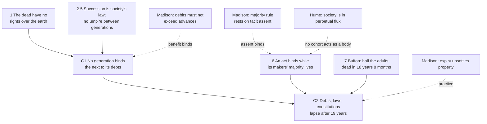

# Philosophy of Debt · Lesson 6.1: The earth belongs to the living

> ⏱ ~15 min · Module 6: Generations, nations and society · Builds on: [5.4 Jubilee as a moral principle](05-04-jubilee-as-a-moral-principle.md), [1.1 The grammar of owing](01-01-the-grammar-of-owing.md) · Unlocks: [6.2 Public debt and the unborn](06-02-public-debt-and-the-unborn.md), [6.3 Whose debt is it?](06-03-whose-debt-is-it.md)

## Why this matters

A public debt binds people who never agreed to it: a 30-year bond is repaid partly by taxpayers too young to vote for it and partly by people not yet born. In September 1789, writing from Paris while the French were forming a constitution, Thomas Jefferson asked whether that could be right. He answered no, and attached a number: nineteen years. James Madison's reply is the classic statement of when the answer is yes. He wrote in February 1790, as Congress weighed Hamilton's plan to fund the Revolutionary debt ([`history-of-debt` 4.1](../../history-of-debt/lessons/04-01-hamiltons-assumption-plan.md)). The exchange sets this module's question: what can be owed by people who never signed anything?

## The idea

In Roman law a **usufruct** is the right to use another's property and take its fruits without impairing its substance, and it ends when the holder dies (Justinian, *Institutes* II.4). A life tenant of an orchard may eat and sell the apples. She may not fell the trees, and at her death the orchard passes on whole. Jefferson's premise is that each generation holds the earth this way: the [usufruct of the living](../reference.md#usufruct-of-the-living). A tenant who borrows against the harvests after her death is spending the next tenant's apples. So a generation may borrow only what it can repay in its own time.

"Its own time" needs a number. Jefferson starts with a fiction: a generation that comes of age together at 21 and dies together 34 years later, the average further life the bills of mortality gave a 21-year-old. At 21 it could bind itself for 34 years, at 22 for 33, at 54 for one. Real generations overlap, so he fixes a single term: a contract binds until a majority of the adults alive on its date are dead. From Buffon's mortality table he finds that half of those aged 21 and over at any moment are dead within 18 years 8 months, and rounds to the nearest whole number. That is the [nineteen-year rule](../reference.md#nineteen-year-rule), and he applies it to laws and constitutions as well as debts.

Madison's reply: the dead leave bills as well as gifts, and a bill may pass on if it is no larger than the gift. Without [tacit consent](../reference.md#tacit-consent), he adds, not even majority rule could bind a new adult.

## Source

Jefferson to Madison, 6 September 1789 (*Papers of Thomas Jefferson* 15:392–97, as printed in *The Founders' Constitution*), two excerpts:

> I set out on this ground, which I suppose to be self evident, "that the earth belongs in usufruct to the living": that the dead have neither powers nor rights over it. … Then no man can, by natural right, oblige the lands he occupied, or the persons who succeed him in that occupation, to the paiment of debts contracted by him. For if he could, he might, during his own life, eat up the usufruct of the lands for several generations to come, and then the lands would belong to the dead, and not to the living, which would be the reverse of our principle.

> … this requisition is municipal only, not moral; flowing from the will of the society … but that between society and society, or generation and generation, there is no municipal obligation, no umpire but the law of nature.

"Self evident" marks the first claim as an axiom, not a conclusion. "By natural right" is the qualifier everything else depends on. Jefferson grants that a society may make an heir pay the debts of the man whose land he inherits; that "requisition" is "municipal", the society's own law, not morality's. Between whole generations no society stands above both to make such a law. Note, too, what usufruct presupposes: a right over property *not one's own*. Jefferson never names the owner. Leviticus does ([`theology-of-debt` 1.3](../../theology-of-debt/lessons/01-03-the-jubilee-the-land-is-mine.md)).

## The argument

**Jefferson**, reconstructed in the letter's order.

1. **Usufruct.** The earth belongs in usufruct to the living; the dead have no powers or rights over it.
2. **Succession is conventional.** At death a person's holding reverts to society, and heirs or creditors take it only by society's law.
3. **The reductio.** If anyone could by natural right charge his successors with his debts, he could eat up the fruits of several generations, and the earth would belong to the dead, contrary to 1.
4. **Aggregation.** The whole has no more rights than its members have individually.
5. **No umpire.** Between generations there is no common superior, only the law of nature: they stand as independent nations do.

∴ **C1.** No generation can bind the next to pay its debts. It may contract only what it can pay in its own time.

6. **Majority** (implicit in the letter). The will of the majority binds the whole; so where births and deaths are continuous, an act binds until a majority of the adults alive at its date are dead. *In words:* in a stable population, an act binds only while those who could have voted for it are most of the adults it binds.
7. **Mortality.** On Buffon's table that takes 18 years 8 months, say 19.

∴ **C2.** No debt can validly run past 19 years. Since persons and property are the whole object of government, no constitution or law can either; enforcing one longer is force, not right. Nor is the power to repeal a substitute, since faction, bribery and unequal representation obstruct repeal.

Beside the argument from right sits one from consequences: declaring debts void after 19 years would put lenders on their guard and bridle the spirit of war. That makes the rule a scheduled [jubilee](../reference.md#jubilee-as-principle) for public debt, and its success an empirical question.

**Madison** (4 February 1790) sorts a society's acts into three classes.

- **The constitution.** The doctrine may hold in theory, but a government revised every 19 years would lose the reverence antiquity lends it, breed faction and risk an interregnum.
- **Irrevocable stipulations, such as debts.** Here he wants exceptions in theory too. The living's title covers the earth in its natural state only; improvements made by the dead are a charge on the living who take their benefit. Some debts serve the unborn, such as debts for repelling a conquest, and some serve mainly posterity (perhaps, he says, the present American debt), and 19 years may not pay them. Hence the [benefit principle](../reference.md#benefit-principle):

  > All that is indispensable in adjusting the account between the dead & the living is to see that the debits against the latter do not exceed the advances made by the former.

  *In words:* the dead may bill the living up to the value of what they left them. He adds at once that few of the burdens nations had inherited would pass even this test.
- **Ordinary laws.** The objections are practical: property rights resting on law would lapse, values would fall as the expiry approached, and industry would slacken.

His remedy is tacit consent, the received doctrine that assent to established laws may be inferred where no positive dissent appears (Locke's version is [`history-of-political-thought` 4.2](../../history-of-political-thought/lessons/04-02-locke-limited-government-and-toleration.md)). Yet he would welcome Jefferson's principle as a curb on the living's power to burden their successors unjustly.

**Where the argument is weakest.** Not premise 1, which Madison accepts for the natural earth, but the step to C1. Premises 1–5 show that the dead have no *authority* over the living. C1 needs more: that nothing else can bind the living to what the dead borrowed. Madison names two other routes, accepting the benefits and tacit assent. A Jeffersonian replies that neither reaches the unborn: a benefit you cannot refuse does not make you a debtor, and silence is not consent when you were born into the arrangement. These are the open questions of fair play and tacit consent ([`political-philosophy`](../../political-philosophy/syllabus.md) 1.2–1.3). A second target is premise 6's move from generations that come and go together to generations renewed daily. Hume had granted that if generations succeeded each other all at once, "as is the case with silk-worms and butterflies", each might found its own polity, and drawn the opposite moral for real societies: since society is in perpetual flux, each new brood must conform to the established constitution (a paragraph added to "Of the Original Contract" in 1777). Jefferson's defenders reply that the 19-year cohort is only a clock, marking when an act's authors have stopped being the people it binds.

## Argument map

Solid arrows support; dashed arrows attack.

## Worked examples

**Example 1 (clean: Jefferson's own Genoese loan).** Jefferson imagines Louis XV's generation borrowing from Genoese lenders to spend on itself, on terms of no interest for 19 years and then 12⅝ per cent a year forever. His other French example assumes 5 per cent (10,000 milliards of livres yielding 500 milliards a year). Let 19 years of unpaid 5 per cent interest compound:

$$1.05^{19} = 2.52695, \qquad 0.05 \times 2.52695 = 0.12635 = 12.635\%.$$

That is 12⅝ per cent (12.625) to about a hundredth of a point, so the terms are simply 5 per cent with the interest capitalized. Whether or not Jefferson computed it so, the example keeps the rate out of the question. By C1 the successors owe nothing, since the living spent the money; that is Jefferson's verdict. By Madison's principle the advances to them are zero, so any debit exceeds them, and they are excused on his ground too. **The clean case does not separate the two men.** Only a debt that leaves something behind can.

**Example 2 (hard: a war of defence).** An invented country borrows 100 million (any currency) at 5 per cent to repel an invasion, and the independence it keeps will serve its grandchildren. If the debt is perpetual, every year's taxpayers pay 5 million interest. Under Jefferson's rule it must be gone within 19 years, which takes a level payment of

$$100 \times \frac{0.05}{1 - 1.05^{-19}} = 8.27 \text{ million a year}.$$

The lender is indifferent, since both schedules are worth 100 million at 5 per cent. But the war generation's annual bill rises by about 65 per cent, and its successors inherit the independence free. Madison's objection lands here: the charge should follow the advance. His principle strains in turn: what is independence worth to the unborn, and who keeps the account? The borrowers, who have every reason to find that their debts were for posterity. Jefferson's rule needs no accountant; Madison's needs one who does not work for the borrower.

## Watch out

- **You might think the two men disagree only about principle.** Part of the quarrel is factual: Jefferson thought America's debts payable within the lives of those then alive, while Madison doubted 19 years would discharge them. Whether a 19-year expiry would depress property and credit is also empirical, like the credit freeze Deuteronomy 15:9 foresaw ([`history-of-debt` 1.3](../../history-of-debt/lessons/01-03-release-laws-in-ancient-israel.md)). What a "generation" is, when births are continuous, is conceptual; whether a benefit can bind someone who never consented is normative. Settling one leaves the others open.
- **You might think Jefferson denies that heirs must pay a dead man's debts.** He grants that a society may require it. His objection applies only between whole generations, which have no society above them.
- **You might think 19 is the principle.** The principle is that a generation binds only itself. Nineteen is the output of one mortality table, and a different table gives a different term (P1).

## One-liner

> Jefferson: a generation holds the earth for life, so it may borrow only what it can repay before its adult majority dies, about nineteen years; Madison: the dead may bill the living, never for more than they left them.

## Problems

**P1 (🟢) *(Formal (a) · Exegetical (b))*** (a) Jefferson's fiction has everyone come of age at 21 and die at 55. Keep that life course, but let births be constant, so today's adults are spread evenly over ages 21 to 55. How many years pass before half of today's adults are dead? Compare with the 18 years 8 months from Buffon's table. (b) His term ends when a majority of the adults alive at a contract's date are dead, and he rounds 18 years 8 months to 19. For how long does a 19-year debt then bind after that majority is gone, and what whole number of years does his own principle support? One sentence for (b).

**P2 (🟡) *(Exegetical)*** Madison to Jefferson, 4 February 1790 (*Papers of James Madison* 13:18–21):

> May it not be questioned whether it be possible to exclude wholly the idea of tacit assent, without subverting the foundation of civil Society? On what principle does the voice of the majority bind the minority? It does not result I conceive from the law of nature, but from compact founded on conveniency. … strict Theory at all times presupposses the assent of every member to the establishment of the rule itself. If this assent can not be given tacitly, or be not implied where no positive evidence forbids, persons born in Society would not on attaining ripe age be bound by acts of the Majority; and either a unanimous repetition of every law would be necessary on the accession of new members, or an express assent must be obtained from these to the rule by which the voice of the Majority is made the voice of the whole.

(a) Which premise of the lesson's reconstruction of Jefferson does this passage target, and which words show it? (b) State the dilemma it poses for Jefferson in two sentences. 120 words or fewer in all.

**P3 (🔴) *(Exegetical (a) · Evaluative (b))*** An invented republic votes two 40-year bond issues. One builds a national rail line engineered to run for a century. The other pays for a year of bicentennial celebrations. (a) What do Jefferson's nineteen-year rule and Madison's benefit principle each say about each issue? Two sentences per principle. (b) Where does each principle stop determining a verdict here? Any verdict; 150 words or fewer for (b).

Solutions

**P1** *(Formal (a) · Exegetical (b))*

**Must hit, strict (a):** with ages spread evenly from 21 to 55 and everyone dying at 55, remaining lifetimes are spread evenly from 0 to 34 years. Half of today's adults have 17 years or less left, so half are dead after $34/2 = 17$ years. Buffon's table gives $18\tfrac{2}{3}$ years, which is $18\tfrac{2}{3} - 17 = 1\tfrac{2}{3}$ years (1 year 8 months) longer. The number depends on the mortality assumption.

**Must hit, strict (b):** $19 - 18\tfrac{2}{3} = \tfrac{1}{3}$ year, so a 19-year debt binds for **4 months** after the contracting majority is gone. His principle supports **18 years**, the largest whole number that does not pass 18 years 8 months. Nineteen is the nearest whole number, not the one his principle licenses.

**Wrong turns:** answering 34 in (a), which is when the *last* of today's adults dies, not half of them. Averaging the ages 21 and 55 to get 38, which is an age, not a waiting time. Calling 19 the cautious choice: rounding up extends the debt past the point where his own principle ends it.

**Model answer:** (a) Remaining lives run evenly from 0 to 34 years, so half of today's adults are dead in 17 years, 1 year 8 months sooner than Buffon's 18 years 8 months. (b) Rounding up lets a 19-year debt bind for 4 months after its makers' majority is dead, so his own principle supports 18 years.

---

**P2** *(Exegetical)*

**Must hit, strict (a):** the target is premise 6, that the majority's will binds the whole, on which Jefferson's term is built. The words: "On what principle does the voice of the majority bind the minority?" and "not … from the law of nature, but from compact founded on conveniency", which rests majority rule on "the assent of every member".

**Must hit, strict (b):** a dilemma with both horns. *Either* new adults can assent tacitly to majority rule, and then nothing in principle stops them assenting tacitly to the laws and debts already standing, which removes the ground for a 19-year limit. *Or* they cannot, and then no majority act binds anyone who came of age after it, short of unanimous re-enactment or express assent. Even inside Jefferson's 19 years, then, his rule binds newcomers only by the tacit assent he rejects.

**Wrong turns:** reading "compact founded on conveniency" as calling majority rule illegitimate; it explains what majority rule rests on. Answering with the benefit principle, which is a different argument from a different class of acts. Taking Madison to say majority rule is natural, which the passage denies.

**Model answer:** (a) It targets premise 6, Jefferson's reliance on majority rule, and with it C2's claim that failing to repeal a law is not consenting to it. "On what principle does the voice of the majority bind the minority?" and "compact founded on conveniency" show that majority rule itself rests on every member's assent. (b) If new adults may assent tacitly to majority rule, they may equally assent tacitly to standing laws and debts, and the 19-year limit loses its ground. If they may not, no majority act binds anyone who came of age after it, so even Jefferson's 19-year term binds newcomers only by tacit assent.

---

**P3** *(Exegetical (a) · Evaluative (b))*

**Must hit, strict (a):**
- **Jefferson:** purpose is irrelevant. Both 40-year issues run past 19 years, so each is void as to whatever remains unpaid 19 years from its date; to be valid, each must be retired within 19 years.
- **Madison:** the celebrations are consumed by those who hold them, so any charge left to later citizens exceeds what was advanced to them, and the present generation should pay. The rail line serves later citizens for a century, so charging them is legitimate as long as the debits do not exceed the benefit it leaves them.

**Must hit, any verdict (b):**
- **Jefferson's gap:** the rule is blind to benefit. It treats the two issues identically, so later citizens ride the line free while the voting generation pays for a century's asset in 19 years (or does not build it). Say whether that is a defect or the price of a rule that needs no one's judgment.
- **Madison's gap:** someone must value the line to people not yet born (it may be obsolete in 30 years) and decide whether celebrations leave lasting goods, such as a shared memory or visitors, and the borrowers are the interested party. The principle also assumes that benefits bind people who never chose them, which is the premise the consent-based critic attacks.
- Any verdict on which gap matters more, with a reason.

**Wrong turns:** letting Jefferson's rule treat the rail line more kindly; it has no benefit clause. Reading Madison as licensing any debt for a durable asset: the charge is capped by the advance, so size and term still matter. Treating the question as settled because the rail line is "obviously" useful: usefulness to the unborn is exactly what has to be measured.

**Model answer (b), one of several:** Jefferson's rule gives the same verdict for both issues, which is its strength and its gap. It needs no accountant, but it cannot tell a century's railway from a year's party. Later citizens get the line free, and the voting generation either pays for it in 19 years or does not build it. Madison's principle separates the cases, but only by asking for an account no one can audit. What is the line worth to citizens not yet born, if a better technology arrives in thirty years? Could the celebrations claim a lasting advance in national memory? Whoever keeps that account is the borrower. The deeper gap is consent. Madison's route binds the unborn by what they receive, and a Jeffersonian denies that receiving what you did not choose can make you a debtor. I judge Madison's gap the more tractable, since an independent auditor could value the line, but consent is the premise on which the two really divide.

## Flashback

**From Lesson [5.3](05-03-bankruptcy-as-a-moral-institution.md) (Bankruptcy as a moral institution):** *(Exegetical (a)–(b).)* Apply to a new case. An **invented** country voids any loan clause by which a borrower gives up her right to a bankruptcy discharge. A bill would make such clauses enforceable, and lenders say they would then offer the same loan at 8 percent with the clause or at 11 percent without it. All figures are illustrative.

(a) What does each of these imply about the bill: the creditors' bargain; the reading of discharge as insurance bought through the interest rate; Jackson's separate argument for discharge from borrowers' psychology; the future-freedom argument? One sentence each, four in all. (b) Describe a borrower to whom Jackson's argument no longer applies but the future-freedom argument still does, and say what the difference shows about the kind of claim each rests on. **Two sentences for (b).**

Solution

**Must hit, strict (a):**
- *Creditors' bargain:* no objection. It justifies the collective sale of present property and gives no reason for a discharge, so it gives none against waiving one. Its rule of respecting rights held outside bankruptcy leans toward enforcing the clause, which takes nothing from the other creditors' share. (Accept "silent" or "leans for".)
- *Insurance:* for the bill. The clause declines a policy the borrower would otherwise buy through the rate. The three points are its premium, and she may decline insurance she judges not worth the price.
- *Jackson's psychological argument:* against. Borrowers systematically misjudge the risks they load onto their future selves, so they would take the 8 percent too readily, and the right must be one they cannot sign away.
- *Future freedom:* against. Once her property is surrendered, a surviving debt is a claim on her future earnings (P4), which P3 makes inalienable even when the pledge is freely made, so the right to a discharge cannot be waived.

**Must hit, strict (b):** a borrower who judges her risk accurately, for instance one who takes independent advice and estimates her chance of default correctly. Jackson's argument rests on an empirical claim about how borrowers misjudge risk, so it lapses for her. The future-freedom argument rests on a normative claim about what no one may pledge, so it holds however well informed she is. (Credit for noting that a lawmaker who cannot tell accurate judges from the rest may keep the ban for everyone on Jackson's ground; the ban's justification still depends on a fact about borrowers.)

**Wrong turns:** saying the creditors' bargain condemns the clause, or supports the discharge the clause gives up: it gives no reason for a discharge at all. Treating her signature, or the lower rate, as settling the matter, when P3 exists to override consent. In (b), choosing a borrower who is merely unlikely to default: if she misjudges even a small risk, Jackson's argument still applies. What separates the two arguments is accurate judgment, not low risk.

**Model answer:** (a) The creditors' bargain has no objection: it justifies the collective sale, not the discharge, and its respect for rights held outside bankruptcy leans toward enforcing the clause. On the insurance reading the bill is fine, since the three points are the premium and a borrower may decline a policy she thinks not worth its price. Jackson's argument opposes it, because borrowers who misjudge the risks they load onto their future selves will take the 8 percent too readily. The future-freedom argument opposes it, because the surviving debt would claim an insolvent debtor's future earnings, which P3 forbids anyone to pledge, however freely. (b) A borrower who takes independent advice and judges her chance of default correctly falls outside Jackson's argument but inside the future-freedom one. Jackson's rests on an empirical claim about how borrowers misjudge risk, and the future-freedom argument on a normative claim about what no one may pledge.

## Connections

- **Backward:** Module 1's promises bound the people who made them ([1.2](01-02-hume-promises-as-artificial-obligation.md), [1.3](01-03-promising-after-hume.md)), and [1.1](01-01-the-grammar-of-owing.md) asked what makes an obligation a debt. Here the question is who the debtor is when the borrower is a generation. [5.4](05-04-jubilee-as-a-moral-principle.md)'s scheduled release returns as Jefferson's rule, a 19-year limit written into every public debt, and Madison's warning that values fall as the date nears is the credibility problem of a release known in advance. The fresh start of [5.3](05-03-bankruptcy-as-a-moral-institution.md) is a release for a person; Jefferson wants one for a generation.
- **Forward:** [6.2](06-02-public-debt-and-the-unborn.md) asks whether public debt burdens the unborn at all, and turns Madison's benefit principle into a rule for public borrowing. [6.3](06-03-whose-debt-is-it.md) makes benefit one of three grounds of collective liability, beside authorization and membership. Jefferson allows even innocent buyers of perpetual grants no right to reimbursement, only generosity; Sack's odious-debt conditions, by contrast, turn partly on what the creditor knew. [6.4](06-04-debts-of-gratitude.md) asks whether benefits from parents and society create debts at all.
- **Sideways:** In the debt thread, [`history-of-debt` 4.1](../../history-of-debt/lessons/04-01-hamiltons-assumption-plan.md) is the American debt Madison had in mind, and how it was funded. [`theology-of-debt` 1.3](../../theology-of-debt/lessons/01-03-the-jubilee-the-land-is-mine.md) gives the same no-permanent-sale structure a different ground, God's ownership of the land. [`economics-of-debt`](../../economics-of-debt/syllabus.md) asks when a public debt is sustainable. Burke's partnership of the living, the dead and the unborn, and Paine's reply that the dead have no authority over the living, are [`history-of-political-thought` 5.3](../../history-of-political-thought/lessons/05-03-burke-prescription-against-abstract-rights.md). Jefferson's overlapping cohorts are the setting of [`grad-macro` 3.1](../../grad-macro/lessons/03-01-olg-model.md), and [3.4](../../grad-macro/lessons/03-04-social-security-transfers.md) shows when transfers between cohorts who never meet can leave every cohort better off. Treating generations as independent nations is an argument from analogy, to be tested as [`philosophical-method` 2.2](../../philosophical-method/lessons/02-02-arguments-from-analogy.md) tests them.
