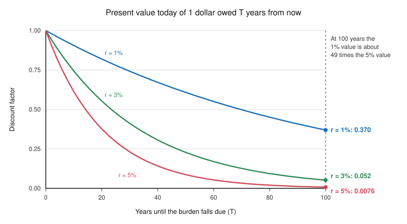

# Philosophy of Debt · Lesson 6.2: Public debt and the unborn

> ⏱ ~15 min · Module 6: Generations, nations and society · Builds on: [6.1 The earth belongs to the living](06-01-the-earth-belongs-to-the-living.md), [2.3 Justifying interest](02-03-justifying-interest.md) · Unlocks: [6.3 Whose debt is it?](06-03-whose-debt-is-it.md)

## Why this matters

In [6.1](06-01-the-earth-belongs-to-the-living.md) Jefferson argued that each generation holds the earth only in [usufruct](../reference.md#usufruct-of-the-living), so none may bind the next with its debts. Madison replied that some debts are run up for the next generation's sake. Both assumed that a public debt is a charge on people not yet born. Modern states mostly refinance maturing debt instead of repaying it, so their debts can outlive the voters who ran them up. This lesson asks whether public borrowing burdens the unborn at all, whether it can wrong people whose existence it helps decide, and what a burden a century away should weigh now.

## The idea

An invented country borrows from its own savers to fight a war. Thirty years on, it taxes its workers to pay its bondholders. There are two ways to keep the books.

- **The nation's books.** The taxes go to bondholders in the same country in the same year, so the country is not a cent poorer. The war's real cost, the steel and the soldiers' time, was paid when they were used up; later output cannot be sent back to the battlefield. Debt shifts no burden forward; it only moves money around inside the future. This is Abba Lerner's position ("The Burden of the National Debt", 1948; slogan: "we owe it to ourselves"). He excepted debt owed abroad, whose repayment ships goods out.
- **The persons' books.** The savers swapped cash for bonds because they preferred the bonds, so they sacrificed nothing. The worker taxed thirty years later pays and gets nothing back, so the burden falls on her. This is James Buchanan's reply (*Public Principles of Public Debt*, 1958): only persons bear burdens, and a national total hides who pays.

Both books are accurate; they answer different questions ([burden of public debt](../reference.md#burden-of-public-debt)). Neither says whether anyone is *wronged*. That turns on an empirical question (does the borrowing also displace private investment?), a conceptual one (can a policy wrong someone whose existence it decided?) and a normative one dressed as arithmetic (what does a distant burden weigh today?).

## Source

Hume, *Of Public Credit* (1752), paragraph 2, in Green and Grose's edition:

> our modern expedient, which has become very general, is to mortgage the public revenues, and to trust that posterity will pay off the incumbrances contracted by their ancestors: And they, having before their eyes, so good an example of their wise fathers, have the same prudent reliance on their posterity; who, at last, from necessity more than choice, are obliged to place the same confidence in a new posterity.

Smith, *Wealth of Nations* V.iii, "Of Public Debts" (1776):

> In the payment of the interest of the public debt, it has been said, it is the right hand which pays the left. The money does not go out of the country. It is only a part of the revenue of one set of the inhabitants which is transferred to another; and the nation is not a farthing the poorer. … But though the whole debt were owing to the inhabitants of the country, it would not, upon that account, be less pernicious.

Hume's irony ("wise fathers", "prudent reliance") describes a debt handed down with no last payer: a rollover. Where he thought the chain ends is [`history-of-debt` 3.4](../../history-of-debt/lessons/03-04-humes-prophecy-carrying-a-great-debt.md). Smith reports the transfer defence, Lerner's view two centuries early, and calls it mercantile sophistry. He accepts that the interest passes from one set of inhabitants to another but denies that the transfer is harmless. His reason, in the pages that follow, is causal: the taxes that pay the interest fall on landlords and owners of capital, so land goes unimproved and capital leaves. That empirical claim foreshadows the modern crowding-out case. Neither text says whether the payer is wronged.

## The argument

**The [uncompensated-burden argument](../reference.md#uncompensated-burden-argument)**, reconstructed; Buchanan supplies P2.

1. **P1.** Borrowing now creates claims that later taxpayers must service, unless the state inflates the debt away or repudiates it. *(Empirical.)*
2. **P2.** The bondholders are compensated, having chosen to trade cash for later payments; the later taxpayers pay and receive nothing. *(Conceptual: burdens are counted person by person.)* *In words:* on the persons' books, the bill lands on whoever pays the tax.
3. **P3.** When the money pays for present consumption, those taxpayers get no offsetting benefit, and none of them consented; most could not have, being children or unborn. *(Empirical, then normative.)*
4. **P4.** Imposing on a person a cost she did not consent to, and that no benefit offsets, wrongs her. *(Normative.)*

∴ **C.** Borrowing to fund present consumption wrongs the later taxpayers who service the debt.

*In words:* a generation that borrows to consume sends the bill to people who never sat at the table.

| Position | Presses | Kind of claim |
|---|---|---|
| Lerner: internal debt is a transfer inside the future | P2 | Conceptual |
| Ricardian equivalence: bequests cover heirs' taxes ([grad-macro 3.4](../../grad-macro/lessons/03-04-social-security-transfers.md)) | P2 | Empirical |
| $r<g$: the debt rolls over as its ratio to income falls ([`economics-of-debt` 5.2](../../economics-of-debt/lessons/05-02-when-r-is-less-than-g.md)) | P1 | Empirical |
| Crowding out: less private capital (Diamond, 1965; [grad-macro 3.1](../../grad-macro/lessons/03-01-olg-model.md)) | Strengthens P2: a loss even on the nation's books (if $r>g$) | Empirical |
| Madison's debits and advances ([6.1](06-01-the-earth-belongs-to-the-living.md)) | P3 | Normative and empirical |
| Parfit's non-identity problem | P4: a wrong to whom? | Conceptual |

**Where the argument is weakest.** A critic attacks P4: it proves too much. Every generation inherits costs it never agreed to (laws, pension promises, bridges needing repair) with benefits it never paid for, and nobody thinks each such cost wrongs the heir. The premise needs a baseline, says a critic in Madison's line or Burke's: the heir is wronged only if the whole bequest leaves her worse off than it should. Madison's test was that "the debits against the latter do not exceed the advances made by the former", the [benefit principle](../reference.md#benefit-principle). As a rule for public borrowing it says: borrow for what will still serve the later taxpayer, and charge her no more than it leaves her. Where the advance is an evil averted, as with Madison's debts for repelling a conquest, the ledger needs a comparison with what she would otherwise have had, and for people born long after the borrowing the non-identity problem says there is none (Example 2). Defenders can restrict P4 to net burdens on people who exist either way, or make "worse off" non-comparative.

## The discount

At rate $r$, a burden $B$ due in $T$ years is worth $B/(1+r)^T$ today; $1/(1+r)^T$ is the [discount factor](../reference.md#discounting). An illustrative 1 billion dollars due in 100 years is worth 370 million dollars today at 1 percent (factor 0.370), 52.0 million at 3 percent (0.0520) and 7.60 million at 5 percent (0.00760), a spread of about 49 times.

Now make the burden a debt. Borrow 1 billion dollars and roll it over at 3 percent, adding the interest, for 100 years: the bill is $1.03^{100} = 19.2$ billion dollars. Discounted at 3 percent it is worth exactly the billion borrowed. At 1 percent it is worth 7.1 billion today; at 5 percent, 0.15 billion. In general a debt $B$ compounding at $i$ and discounted at $r$ is worth $B\,[(1+i)/(1+r)]^T$ today, more than was borrowed exactly when $r<i$.

Which $r$? Use the split [2.3](02-03-justifying-interest.md) took from [grad-macro 2.3](../../grad-macro/lessons/02-03-ramsey-cass-koopmans.md), $r = \rho + \sigma g$: $\rho$ is [pure time preference](../reference.md#time-preference), counting welfare less because it comes later; $g$ is the growth rate of consumption per head; $\sigma$, the curvature of utility, says how fast an extra dollar's value falls as people get richer. Illustratively, $\rho = 0$, $\sigma = 1.5$ and $g = 2\%$ give 3 percent; adding $\rho = 2\%$ gives 5 percent. $g$ is a forecast; $\rho$ is a value judgment, the target of Ramsey's charge; $\sigma$ is partly each. The ethics of setting them is [`philosophy-of-economics`](../../philosophy-of-economics/syllabus.md) Module 4's.

## Worked examples

**Example 1 (clean: a borrowed rebate).** An invented government mails every adult a one-off rebate, paid for with 30-year bonds sold at home.

- **P1** holds, barring $r<g$.
- **P2.** A later taxpayer who holds no bonds pays and gets nothing back. Notice who she is. Today's young adults, still working then, got the rebate; for them the scheme is borrowing from their own future selves. The transfer between generations falls on today's children and the unborn.
- **P3.** The rebate is spent now, and today's children had no vote.
- **P4.** Today's children exist however the rebate is financed, so P4's comparison is available: they are worse off than if the rebate had come out of this year's taxes.

The argument goes through for today's children unless an empirical escape holds: their parents save the rebate and bequeath it, or $r<g$ lets the debt roll. What remains open is economics, not philosophy.

**Example 2 (hard: 6.1's war debt, a century on).** Take [6.1](06-01-the-earth-belongs-to-the-living.md)'s invented war of defence, financed by perpetual bonds, a century later. War changes who meets whom and when children are conceived. Derek Parfit argued that almost any large policy does (*Reasons and Persons*, 1984, ch. 16): within a few generations, none of the people alive would have existed had the choice gone the other way. His case is a community that depletes its resources, making life slightly better for two centuries and much worse after, yet worse for no one, since the later people would not have been born under conservation.

Run P4 on the taxpayer a century on. Had the choice gone the other way she would not exist, so she is not worse off than otherwise, and a person-affecting reading of P4 finds no victim. This [non-identity problem](../reference.md#non-identity-problem) cuts both ways: Madison's claim that the war's benefit, a conquest averted, descends to her fails on the same comparison. It arises only when the alternatives compared contain different people; for today's children in Example 1 they do not. The replies:

- **Impersonal.** Parfit, who thought depletion worse, sought a principle about outcomes: with the same number of people either way, it is worse if those who live are worse off than those who would have lived (his "Same Number Quality Claim"). Its price is population ethics ([`decision-theory`](../../decision-theory/syllabus.md) 5.3–5.4).
- **Non-comparative.** A burden can harm without making anyone worse off than otherwise (Seana Shiffrin), or violate a right without harming (James Woodward). The price is a defensible threshold or list of rights.
- **Standpoints.** Contractualists such as Rahul Kumar ask whether a principle could be reasonably rejected from the standpoint of a *type* of person, here whoever pays this tax in a century ([ethics 5.2](../../ethics/lessons/05-02-contractualism-what-no-one-could-reasonably-reject.md)'s generic reasons).
- **Bite the bullet.** David Boonin accepts that such choices, if they leave lives worth living, wrong no one; objections must rest on people who exist either way.

Catholic social teaching extends the common good to future generations and calls intergenerational solidarity a matter of justice (*Laudato Si'* 159, 2015, paraphrased; [`catholic-social-teaching`](../../catholic-social-teaching/syllabus.md) 6.1), a ground that, like the impersonal and standpoint replies, needs no victim made worse off.

## Watch out

- **You might think "we owe it to ourselves" settles a moral question.** It is an accounting claim about totals and says nothing about whether the person who pays is wronged. The same slide runs the other way: "the taxpayer bears the burden" does not yet say she is wronged either.
- **You might think the non-identity problem licenses burdening the far future.** It removes one explanation of the wrong, the person-affecting one, and leaves the other replies standing.
- **You might think discounting at the borrowing rate is neutral bookkeeping.** It builds in the answer: discount a rolled-over debt at the rate it compounds and a century of burden is worth exactly the original loan, whatever the century holds.

## One-liner

> Whether public debt wrongs the unborn is three questions: is it a burden or a transfer (accounting and evidence), can people who owe their existence to a policy be wronged by it (non-identity), and what does a distant burden weigh now (a discount rate, a value judgment in arithmetic's clothing)?

## Problems

**P1 (🟢) *(Formal (a)–(b) · Exegetical (c).)*** An invented government borrows 1 billion dollars and rolls the debt over at 4 percent a year, adding the interest, until a single payment settles it 75 years from now. (a) How large is that payment? (b) What is it worth today at social discount rates of 2, 4 and 6 percent? (c) State the general rule your answers illustrate, and say which part of the choice between 2 and 6 percent is a forecast and which a value judgment. Two sentences for (c).

**P2 (🟡) *(Exegetical (a)–(b).)*** **Find the crux.** Two invented advisers to an invented government that has just borrowed from its own citizens to pay for an emergency:

> **Ilse:** "The emergency was paid for this year, with this year's concrete and this year's labour. In thirty years our citizens will pay interest to our citizens, and the country will not be a cent poorer. There is no burden on the future, only a transfer inside it."
>
> **Tomas:** "The savers who bought our bonds swapped cash for bonds because they wanted to; they gave up nothing. In thirty years a nurse will pay tax and get nothing back. That is a burden, and it falls on her. 'The country' never pays a tax."

(a) Name the single premise one of them must deny: the crux. Two sentences. (b) Say what argument or finding would move Ilse toward Tomas, and what would move Tomas toward Ilse. 100 words or fewer.

**P3 (🔴, optional) *(Exegetical (a) · Evaluative (b).)*** **Apply to a hard case.** Invented: Brisa borrows to pay a large bonus to every family that has a baby in the next five years, financed with 50-year bonds. Demographers expect the bonus to change the timing of most births in those years, so most children born then would not otherwise have existed. The bonds will be serviced by taxes that fall mostly 25 to 50 years from now, when those children are working adults.

(a) In two sentences: why can a taxpayer born under the bonus not make a person-affecting complaint against the bonus programme, and which later taxpayers can?
(b) Brisa's finance minister says: "No one born under the bonus can complain about the bonds, because without the bonus they would not exist." Is the argument sound? Test it against paying for the same bonus with a tax on today's adults, saying what you must assume about who would then be born, and say where your answer stops giving a verdict. Any verdict; 150 words or fewer.

Solutions

**P1** *(Formal (a)–(b), strict · Exegetical (c), strict.)*

**Must hit, strict (a):** $1.04^{75} = 18.945$, so the payment is about **18.9 billion dollars**.

**Must hit, strict (b):** present value $= 18.945/(1+r)^{75}$ billion dollars, or equivalently $[1.04/(1+r)]^{75}$.
- 2 percent: $1.02^{75} = 4.4158$, so $18.945/4.4158 = 4.29$ billion dollars.
- 4 percent: exactly 1 billion dollars, since $(1.04/1.04)^{75} = 1$.
- 6 percent: $1.06^{75} = 79.057$, so $18.945/79.057 = 0.240$ billion, about 240 million dollars.

**Must hit, strict (c):** a debt $B$ compounding at $i$ and discounted at $r$ is worth $B\,[(1+i)/(1+r)]^T$ today: more than was borrowed when $r<i$, exactly the loan when $r=i$, less when $r>i$. In $r = \rho + \sigma g$, the growth rate $g$ is the forecast and pure time preference $\rho$ the value judgment; $\sigma$ is partly both, so either classification of it passes if $g$ and $\rho$ are placed correctly.

**Wrong turns:** discounting the 1 billion instead of the 18.9 billion payment, which yields only the bare factors 0.226, 0.0528 and 0.0126; simple interest in (a), $1 + 0.04 \times 75 = 4$ billion; calling 4 percent "the right rate because the market set it", which assumes what (c) asks you to argue.

**Model answer (c):** A deferred debt weighs more today than the money borrowed exactly when the social discount rate is below the rate at which the debt compounds, so at 2 percent the future's bill is worth 4.29 billion against the 1 billion received, at 4 percent the two match, and at 6 percent the bill looks cheap. Choosing between 2 and 6 percent mixes a forecast of growth $g$ with a value judgment about pure time preference $\rho$ ($\sigma$ is partly each), and only the forecast can be settled by evidence.

---

**P2** *(Exegetical, strict.)*

**Must hit, strict (a):** They agree on every fact stated: the real resources were used up now, and the later taxes and interest stay inside the country. They disagree about what a burden is and who can bear one. Ilse counts the real resources the community gives up at a date, so a transfer between later citizens burdens no one. Tomas counts losses person by person against each person's alternatives, so the voluntary buyer bears nothing and the nurse bears the cost. The crux premise: *a burden is borne only where the community's total real resources fall* (Ilse affirms it, Tomas denies it).

**Must hit, strict (b):** one mover for each side.
- *Ilse* moves on the concept if shown that a total can hide a loss to a person (the separateness-of-persons point, [ethics 1.3](../../ethics/lessons/01-03-justice-and-the-separateness-of-persons.md)), or that with finite lives the cohort taxed later is not the cohort that bought the bonds or used the resources, so lifetime consumption shifts between cohorts though no year's total changes ([grad-macro 3.1](../../grad-macro/lessons/03-01-olg-model.md)). Evidence of crowding out moves her only on the facts: a loss on her own books, with her concept intact.
- *Tomas* moves if the later taxpayers turn out to be compensated: they inherit the bonds, or their parents' bequests cover the tax (Ricardian equivalence, [grad-macro 3.4](../../grad-macro/lessons/03-04-social-security-transfers.md)), so no later person is worse off on net. Evidence that $r<g$ lets the debt roll with no tax ever levied also moves him, but on the facts, not the concept.

**Wrong turns:** naming "internal or external debt" as the crux, when both treat the debt as internal; naming crowding out, which is a third, empirical channel that both can accept; saying Ilse denies that the later taxes will be levied; declaring a winner, which neither part asks for.

**Model answer:** (a) Both accept the facts: the resources were used up now, and the later interest stays inside the country. They split on whether a burden exists only where the community's total real resources fall (Ilse), or wherever a person loses relative to her alternatives, so that the voluntary buyer bears nothing and the nurse bears the cost (Tomas). (b) Ilse would move if shown that her totals hide a loss to someone, or that with overlapping cohorts the people taxed later are not the ones who bought the bonds or used the resources, so lifetime consumption shifts even though no year's total does. Evidence of crowding out would move her on the facts, not the concept. Tomas would move if the later taxpayers turned out to be compensated, holding the bonds by inheritance or receiving bequests that cover the tax.

---

**P3** *(Exegetical (a), strict · Evaluative (b), graded on moves, not verdict.)*

**Must hit, strict (a):** without the programme a child born in the window would not have been conceived, or would have been conceived at another time and so been someone else. So she is not worse off than she would otherwise have been, and a person-affecting principle finds no victim. People who exist either way can make the complaint: anyone already born or conceived when the programme began who will pay the bond taxes, which means today's children and adults still working then.

**Must hit, any verdict (b):**
- **The comparison.** The minister compares the bonus with bonds against no bonus. A complaint about the *bonds* compares debt finance against tax finance of the same bonus.
- **The assumption.** Assume the bonus, not its financing, decides who is conceived. Then the bonus-born exist under both options, and under debt finance they pay a bill that today's adults would otherwise have paid, so a person-affecting complaint against the financing survives and the minister's argument fails.
- **If the assumption fails,** because heavier taxes on today's parents would also shift conceptions, non-identity returns. Name and apply one ground that does not need a victim made worse off: impersonal, non-comparative harm or rights, or a contractualist standpoint. Or bite the bullet.
- **Where it stops:** the fertility facts are empirical; or the bonus paid for the bonus-born's own infancy, so the benefit principle may license charging them up to that advance.
- **A one-line verdict.**

**Wrong turns:** accepting the minister's argument because the children owe their existence to the programme, which answers a complaint against the programme, not against the bonds; saying the bonus-born are harmed because they would be better off "without the debt", without saying which alternative contains the same people; forgetting the taxpayers who exist either way.

**Model answer (b), one of several:** The minister compares the programme with no programme, and against that the bonus-born have no person-affecting complaint. But the complaint is about the bonds, and its alternative is the same bonus paid by a tax on today's adults. If the bonus, not its financing, decides who is conceived, the same children exist under both, and under debt finance they pay as adults a bill that today's adults, their parents among them, would otherwise have paid. That is a person-affecting complaint, so the argument fails. My verdict rests on that assumption: if heavier taxes on today's parents would shift conceptions, non-identity returns and the complaint needs an impersonal or standpoint principle. Even then the benefit principle trims it, since the bonus paid for these children's own infancy and they can fairly be charged up to that advance. Verdict: unsound as stated; how much of the charge wrongs them turns on the fertility facts and the size of the advance.

## Flashback

**From Lesson [5.4](05-04-jubilee-as-a-moral-principle.md) (Jubilee as a moral principle):** *(Exegetical.)* Close reading. Paine, *Agrarian Justice* (Conway's edition), a little before the ground-rent passage 5.4 read:

> …the first principle of civilization ought to have been, and ought still to be, that the condition of every person born into the world, after a state of civilization commences, ought not to be worse than if he had been born before that period. But the fact is, that the condition of millions … is far worse than if they had been born before civilization began, or had been born among the Indians of North America at the present day.

(a) Which words state a principle, and which a factual claim? Say what the principle compares, and for whom. (b) Nozick keeps a version of Locke's proviso: an appropriation wrongs anyone it leaves worse off than if the land had stayed in common. Do Paine and Nozick differ over this passage's principle or over its fact, and what evidence would bear on their difference? **Two sentences per part.**

Solution

**Must hit, strict (a):** the principle is "the first principle of civilization ought to have been, and ought still to be, that the condition of every person born into the world … ought not to be worse than if he had been born before that period". It is normative, and it compares each person born after civilization began with his own lot had he been born before it: a floor for every individual, not a comparison of totals or averages. "But the fact is" marks the factual claim, an empirical comparison: "the condition of millions … is far worse".

**Must hit, strict (b):** over the fact. Nozick's proviso uses the same kind of baseline, a person's lot without the appropriation, and, as 5.4 notes, the same remedy, compensation rather than surrender; but he held that market economies readily satisfy it, while Paine holds that millions fall below it. What bears on the difference is comparative evidence on how the worst-off fare under private property against a world without appropriation. (Credit for noting that the passage's last clause supplies Paine's own evidence, a present-day comparison, and that whether it is a fair stand-in for the counterfactual is itself disputed.)

**Wrong turns:** answering from 5.4's premise 3, whether the earth itself can be private property: there Paine and Nozick do differ in principle, but this passage's test is one they share. Reading the principle as a claim about totals or averages, when it protects "every person". Giving a verdict on who has the facts right, when the question asks what evidence would bear.

**Model answer:** (a) The principle is that "the condition of every person born into the world, after a state of civilization commences, ought not to be worse than if he had been born before that period": a normative floor that compares each later-born person with his own lot before civilization, person by person rather than in totals. "But the fact is" marks the factual claim, an empirical comparison: "the condition of millions … is far worse". (b) They differ over the fact, not the principle: Nozick's proviso uses the same kind of baseline and the same remedy of compensation, but he held that market economies readily satisfy it, while Paine holds that millions fall below it. What bears on it is comparative evidence on how the worst-off fare under private property against a world without appropriation, which Paine tries to supply with a present-day comparison whose fairness is itself open to dispute.

## Connections

- **Backward:** [6.1](06-01-the-earth-belongs-to-the-living.md) gave Jefferson's usufruct and Madison's reply. This lesson turns Madison's accounting of debits and advances into P3 and P4, and asks whom the account is kept for. The discount generalizes the fact that left 6.1's lender indifferent between repayment schedules: at the loan's own rate, every schedule is worth the principal. [2.3](02-03-justifying-interest.md)'s time preference, and Ramsey's charge against it, return as the $\rho$ in a social discount rate. [5.4](05-04-jubilee-as-a-moral-principle.md)'s scheduled release is the other device that limits how long a debt can run.
- **Forward:** [6.3](06-03-whose-debt-is-it.md) asks on what grounds citizens owe what their state borrowed. Its benefit ground is this lesson's benefit principle, and its authorization ground asks who did the borrowing, which this lesson leaves aside. [6.4](06-04-debts-of-gratitude.md) turns the question round: do we owe the past?
- **Sideways:** the debt thread. [`history-of-debt` 3.4](../../history-of-debt/lessons/03-04-humes-prophecy-carrying-a-great-debt.md) runs the arithmetic of carrying a great debt, and [4.1](../../history-of-debt/lessons/04-01-hamiltons-assumption-plan.md) follows the Revolutionary debt that Madison suggested was incurred chiefly for posterity. [`economics-of-debt` 5.1](../../economics-of-debt/lessons/05-01-the-government-budget-constraint.md)–[5.2](../../economics-of-debt/lessons/05-02-when-r-is-less-than-g.md) models debt dynamics and when $r<g$ lets a debt roll. [`theology-of-debt` 6.2](../../theology-of-debt/lessons/06-02-international-debt-and-the-jubilee-call.md) reads international debt from inside Catholic teaching. The formal neighbours are [grad-macro 3.4](../../grad-macro/lessons/03-04-social-security-transfers.md) (overlapping generations, pensions and Ricardian equivalence), [`decision-theory`](../../decision-theory/syllabus.md) 5.3–5.4 (population ethics) and [`philosophy-of-economics`](../../philosophy-of-economics/syllabus.md) Module 4 (the social discount rate). For the method of P2, see [finding the crux](../../philosophical-method/lessons/04-03-finding-the-crux.md).
