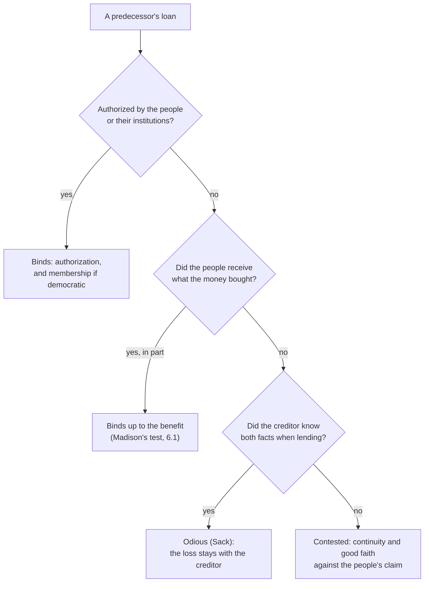

# Philosophy of Debt · Lesson 6.3: Whose debt is it? Collective responsibility and odious debt

> ⏱ ~15 min · Module 6: Generations, nations and society · Builds on: [6.1 The earth belongs to the living](06-01-the-earth-belongs-to-the-living.md), [6.2 Public debt and the unborn](06-02-public-debt-and-the-unborn.md) · Unlocks: [6.4 Debts of gratitude](06-04-debts-of-gratitude.md)

## Why this matters

A government falls. Its successor inherits a treasury, an army and a stack of loan agreements it did not sign. Many of the citizens who will be taxed to service those loans never voted for the government that took them out, and some sat in its prisons. The creditors reply that they lent to the state, not to a party, and the state is still there. [6.1](06-01-the-earth-belongs-to-the-living.md) and [6.2](06-02-public-debt-and-the-unborn.md) asked whether one generation can bind the next. This lesson asks the question across a change of regime instead of across time: on what ground can anyone owe what their state borrowed, and when does that ground give out? The episodes, from Cuba in 1898 to Iraq in 2004, are in [`history-of-debt` 5.5](../../history-of-debt/lessons/05-05-jubilee-2000-and-hipc.md). Here they are argued about.

## The idea

Start with a firm. Its treasurer borrows 50,000 dollars in the firm's name. If she had authority to borrow, the firm owes the money, even after she leaves and even if every shareholder who hired her has since sold out. If she forged her authority and pocketed the money, the firm owes nothing, and a lender who never asked to see her authority bears the loss. If the money was spent on the firm's roof, the firm may owe something anyway, because it kept the benefit.

Those three thoughts are the three grounds of [collective liability](../reference.md#collective-liability) for public debt.

- **Authorization.** Citizens owe because the officials who borrowed acted in their name, with authority they gave.
- **Benefit.** Citizens owe because they received what the money bought.
- **Membership.** Citizens owe because they belong to a political community whose acts are theirs, even when they were outvoted.

Behind all three sits the creditors' default rule, [state continuity](../reference.md#state-continuity): the debtor is the state, which persists through changes of government, so a successor may not choose which of its predecessors' debts to keep. **Odious debt** is the claim that some debts fall outside every ground at once.

## Source

Hobbes, *Leviathan* (1651), ch. XVI, "Of Persons, Authors, and Things Personated":

> From hence it followeth, that when the Actor maketh a Covenant by Authority, he bindeth thereby the Author, no lesse than if he had made it himselfe; and no lesse subjecteth him to all the consequences of the same. … And therefore he that maketh a Covenant with the Actor, or Representer, not knowing the Authority he hath, doth it at his own perill. For no man is obliged by a Covenant, whereof he is not Author; nor consequently by a Covenant made against, or beside the Authority he gave.

An *actor* speaks and acts in another's name. The *author* is the one who owns those words and acts, as an owner owns goods. The passage makes authorization the channel through which one person's promise binds another. It sets the channel's limits ("against, or beside the Authority he gave"), and it puts the risk of unverified authority on the other party. In debt terms, a lender who does not know whether an official may borrow for the people lends "at his own perill" ([author and actor](../reference.md#author-and-actor)).

## The argument

**The odious-debt argument.** Alexander Sack (1927, paraphrased) held that a debt does not bind a people when three conditions hold together: it was contracted without the people's consent, it was not spent for their benefit, and the creditors knew both when they lent ([odious debt](../reference.md#odious-debt)). Built on the three grounds, the argument runs:

1. **P1.** Citizens owe a debt their state contracted only if they authorized the borrowing, benefited from it, or are bound through membership in a legitimate community that contracted it. *(Normative: the grounds are exhaustive.)*
2. **P2.** Authorization reaches only as far as the authority given: an actor who borrows "against, or beside" it binds no author. *(Conceptual, from Hobbes.)*
3. **P3.** A regime that holds power by force against the people's will has no authority from them to borrow. *(Normative.)*
4. **P4.** Money spent against the people, on their repression or the rulers' pockets, confers no benefit that could ground a claim on them. *(Empirical case by case, normative in principle.)*
5. **P5.** Membership binds citizens to the acts of a community whose institutions they share, not to the acts of a regime that shuts them out. *(Normative.)*
6. **P6.** A creditor who knew that P3 and P4 held lent at his own peril, and cannot claim the good faith that would shift the loss to the people. *(Normative.)*

∴ **C.** When no consent, no benefit and creditor knowledge hold together, no ground binds the people, and the loss stays where it fell: on the lender.

*In words:* Sack's conditions are not three separate complaints. Two of them knock out grounds, and the third removes the creditor's defence.

| Sack's condition | What it defeats | Why |
|---|---|---|
| No consent | Authorization; membership, for a regime that excluded the people | No authority was given, and no institutions were shared |
| No benefit | Benefit | Nothing was received that the people must restore |
| Creditor knowledge | The creditor's good-faith reliance, which state continuity protects | Hobbes: "at his own perill" |

**Membership, stated fairly.** Anna Stilz (*Liberal Loyalty*, 2009, and later work on collective responsibility, paraphrased) argues that citizens of a democratic state are co-authors of its acts through institutions they share, so they may be held liable for its costs even when they voted against them. On this view the ground reaches dissenters in a democracy but not the subjects of a dictatorship. That is why P5 matters. Without it a creditor could say that every national, as a member, owes every national debt.

**Where the argument is weakest.** P1, from two directions. A state-continuity theorist denies that liability runs through the people at all. The debtor is the state, a legal person that outlives revolutions, and the three grounds explain only why its debts may fairly be charged to its taxpayers, not *whether* it owes. Creditors add the incentive objection. If a successor may repudiate after the fact by finding the three conditions, every lender to every poor state prices in the risk that the next government will say so, and legitimate borrowers pay more. Michael Kremer and Seema Jayachandran (2003, paraphrased; the models are [`economics-of-debt`](../../economics-of-debt/syllabus.md)'s) answered with timing: let an independent body declare a regime odious *before* further loans are made, so that only knowing lenders bear the loss and the successor's claim is not self-serving. Either way, the argument's conclusion must be defended against the charge that it makes lending to everyone dearer.

## Where each ground gives out

Kant supplies a limit of a different kind, about purpose rather than consent. The fourth preliminary article of *Perpetual Peace* (1795; Campbell Smith's translation) reads: "No national debts shall be contracted in connection with the external affairs of the state." Borrowing for roads or granaries is "above suspicion". A credit system used as a war chest is not, because "the final inevitable bankruptcy of the state in question must involve in the loss many who are innocent" ([Kant's fourth preliminary article](../reference.md#kants-fourth-preliminary-article)). Notice two things. The article forbids *contracting* such debts; it does not say they are void once contracted. And the remedy it names is other states uniting against the borrower, not a successor walking away.

## Worked examples

**Example 1 (clean): the Tinoco arbitration.** Federico Tinoco seized power in Costa Rica in 1917 and fell in 1919. The restored government passed a law annulling his regime's acts, and Britain took up claims on behalf of two companies, one of them the Royal Bank of Canada. The sole arbitrator, William Howard Taft, ruled in 1923. On continuity he sided with the claimants: Tinoco's regime had been the government in fact, so its acts could bind Costa Rica whatever other states had recognized. On the bank's claim he sided with Costa Rica. The bank had paid out the funds in circumstances that showed it knew they were going to Tinoco personally, and it could not show it had furnished money for the government's legitimate use.

Run the grounds. Continuity kept the state as the debtor through the change of regime. The bank lost anyway, on the ground Hobbes's passage predicts: it had dealt with an actor for purposes it knew fell outside any authority to bind the people. That is Sack's third condition at work four years before Sack named it, and it shows that the conditions can operate *inside* a continuity framework rather than against it.

**Example 2 (hard): the colonial railway.** An invented colony became independent in 1960. Its colonial administration had borrowed abroad in the colony's name, secured on the colony's revenues, to build a railway from the mines to the port. The new government is asked to service the debt.

- *Authorization.* The borrowing was done by an administration the colonized did not choose, so P3 looks satisfied. Yet the lenders relied on the imperial power's authority, which was real in their own law.
- *Benefit.* The railway still runs and now carries passengers as well as ore, though it was built for extraction. Madison's test from [6.1](06-01-the-earth-belongs-to-the-living.md) says the debt binds up to the advance and no further, so Sack's second condition holds only in part.
- *Knowledge.* The lenders knew the colonized had no voice, but they probably believed the railway would serve them.
- *Membership.* The colonized were subjects, not members of a community whose institutions they shared.

The grounds split the debt instead of accepting or rejecting it whole: a claim up to the railway's continuing benefit, and none for the rest. The strain is that "benefit" needs a baseline (benefit compared with what?), which is where [6.2](06-02-public-debt-and-the-unborn.md)'s problem returns. And the remainder must fall on someone: the lenders, or the imperial power that was the real author. In 1898 the American negotiators left the Cuban debt with Spain on much this reasoning ([`history-of-debt` 5.5](../../history-of-debt/lessons/05-05-jubilee-2000-and-hipc.md)).

## Watch out

- **You might think odious debt is settled international law.** It is a doctrine often invoked and, as [`history-of-debt` 5.5](../../history-of-debt/lessons/05-05-jubilee-2000-and-hipc.md) reports, never squarely applied by a tribunal. That is a historical claim. Whether such debts bind is a normative one, and the absence of a ruling settles nothing either way.
- **You might think Hobbes is on the repudiating successor's side.** He supplies the structure (author, actor, the lender's peril) but not the conclusion. For Hobbes, subjects are authors of everything their sovereign does, whether it came to power by agreement or by conquest (chs. XVIII and XX), so his own theory makes nearly every effective government authorized. The odious-debt theorist borrows his model and replaces his theory of sovereignty.
- **You might think Kant licenses repudiating war debts.** His article forbids contracting them and justifies other states in resisting a state that does. It says nothing about what a successor owes.

## One-liner

> A people owes its state's debts because it authorized them, benefited from them, or shares in the community that contracted them; odious debt is the case where all three give out at once, and a lender who knew it lent at his own peril.

## Problems

**P1 (🟢) *(Exegetical.)*** Hobbes, *Leviathan* ch. XVI, the paragraph after the Source:

> And he that maketh a Covenant with the Author, by mediation of the Actor, not knowing what Authority he hath, but onely takes his word; in case such Authority be not made manifest unto him upon demand, is no longer obliged: For the Covenant made with the Author, is not valid, without his Counter-assurance. But if he that so Covenanteth, knew before hand he was to expect no other assurance, than the Actors word; then is the Covenant valid; because the Actor in this case maketh himselfe the Author. And therefore, as when the Authority is evident, the Covenant obligeth the Author, not the Actor; so when the Authority is feigned, it obligeth the Actor onely; there being no Author but himselfe.

(a) When is the covenant valid although the other party saw no proof of the actor's authority, and whom does it then bind? Quote the deciding words. (b) Whom does a covenant bind when the authority is "feigned"? (c) An invented case: a firm dismisses its treasurer in March. In April she signs a loan in the firm's name, and the lender, who has dealt with her for years, asks for nothing. On the passage, who is bound, and what should the lender have done to bind the firm? Two sentences for each part.

**P2 (🟡) *(Exegetical (a) · Evaluative (b).)*** An invented country, Velmark, holds free and contested elections. Its government, re-elected with 52 percent of the vote, had borrowed 3 billion dollars from foreign banks and spent most of it on a stadium, a festival and fuel subsidies in the year before the election. The loan prospectuses described these purposes accurately. Four years later a new government calls the debt "odious" and proposes to stop paying.

(a) For each of Sack's three conditions, say whether it holds, and which grounds of liability therefore still bind Velmark's citizens. One sentence per condition.
(b) A citizen who voted against the government and marched against the subsidies says that she, at least, owes nothing. Assess her claim, stating the membership ground at full strength and one objection to it. Any verdict; 150 words or fewer.

**P3 (🔴, optional) *(Formal (a) · Exegetical (b) · Evaluative (c).)*** An invented province, Doran, owes 10 billion dollars in bonds issued over twenty years by its elected assembly, in which every district was represented. Of that, 2 billion built the harbour of the port city of Askel. The other 8 billion paid for roads, schools and pensions across the province, Askel included. Askel now leaves Doran by a referendum Doran accepts, to become a separate province. Askel has 30 percent of Doran's population and 45 percent of its tax base.

(a) Compute Askel's share of the debt under three rules: by population; by tax base; and by benefit, where the harbour is Askel's alone and the rest is divided by population.
(b) Which grounds of liability bind Askel's citizens, and does any of Sack's conditions hold? Two sentences.
(c) Choose a rule and defend it against its strongest objection. Say also what the bondholders, who lent to Doran, are owed by Askel directly. Any verdict; 150 words or fewer.

Solutions

**P1** *(Exegetical, strict.)*

**Must hit, strict:**
- (a) It is valid when the other party "knew before hand he was to expect no other assurance, than the Actors word". It then binds the actor, "because the Actor in this case maketh himselfe the Author".
- (b) "when the Authority is feigned, it obligeth the Actor onely; there being no Author but himselfe". Feigned authority binds the actor alone.
- (c) The firm is not bound, since in April she had no authority to give. Her covenant binds her alone, as feigned authority does, and a lender who demands proof that is not produced is "no longer obliged". To bind the firm, the lender should have required the authority to be "made manifest unto him upon demand", for instance by a current resolution of the board.

**Wrong turns:** treating years of dealing as present authority, when the passage asks what authority she *has*. Saying the lender has no claim at all: he still holds the actor. Importing modern agency law's apparent authority, under which the firm's silence about the dismissal might bind it. That is a real doctrine, but it is not in the passage, and noting it as the point where the passage stops is a good extra.

**Model answer:** (a) When the other party "knew before hand he was to expect no other assurance, than the Actors word", and then it binds the actor, who "maketh himselfe the Author". (b) The actor only: "when the Authority is feigned, it obligeth the Actor onely". (c) The firm is not bound, because the treasurer had no authority in April, so her covenant binds her alone. The lender should have demanded that her authority be "made manifest", say by a current board resolution, and had it failed to appear he would have been free of the covenant.

---

**P2** *(Exegetical (a), strict · Evaluative (b), any verdict.)*

**Must hit, strict (a):**
- **No consent: fails.** The government was elected in free elections and borrowed through the country's own institutions, so authorization binds, and so does membership in a democratic community.
- **No benefit: fails.** Wasteful spending is not spending against the people. The subsidies and the stadium reached citizens, so the benefit ground binds, at least in part.
- **Creditor knowledge: fails.** The banks knew the purposes, but the purposes were lawful and public, so there was no lack of consent or benefit for them to know of.
- So the debt is not odious in Sack's sense. All three grounds bind, benefit perhaps only in part.

**Must hit, any verdict (b):**
- The membership ground stated at full strength: a democratic citizen is a co-author of the state's acts through institutions she shares, and dissent is part of the process that makes those acts the community's, so being outvoted does not release her (Stilz's view).
- Her objection stated precisely: she did all a citizen can to prevent the borrowing, and liability for what one actively opposed looks unfair.
- Whether the objection generalizes: if it released her, it would release every outvoted citizen from every law and debt, and no democracy could act. Or a narrower version, limited to debts she opposed through legal means, with its cost stated.
- A one-line verdict.

**Wrong turns:** calling reckless or electoral spending odious, which confuses bad policy with the absence of consent or benefit. Treating 52 percent as lack of consent. In (b), letting the verdict rest on how wasteful the stadium was, which is not the membership question.

**Model answer (b), one of several:** On the membership view she is bound. Velmark's institutions are hers too: she voted, marched and lost, and those same institutions made the borrowing the community's act. Her dissent was part of the process that makes the result binding, not an exemption from it. Her objection has force. She did everything a citizen can to stop the loans, and paying for what one fought seems to punish civic virtue. But the objection proves too much. It would free every outvoted citizen from every tax, law and debt, and no democracy could act at all. What she can fairly claim is a voice in how the debt is repaid, not release from it. Verdict: she owes her share, and her dissent grounds a complaint against the policy, not against her liability.

---

**P3** *(Formal (a), strict · Exegetical (b), strict · Evaluative (c), any verdict.)*

**Must hit, strict (a):**
- By population: $0.30 \times 10 = 3.0$ billion dollars.
- By tax base: $0.45 \times 10 = 4.5$ billion dollars.
- By benefit: $2 + 0.30 \times 8 = 2 + 2.4 = 4.4$ billion dollars.

**Must hit, strict (b):** authorization and membership bind, because Askel's citizens were represented in the elected assembly that issued the bonds. Benefit binds too, wholly for the harbour and in part for the province-wide spending. None of Sack's conditions holds: there was consent, there was benefit, and so there was nothing odious for the bondholders to know.

**Must hit, any verdict (c):**
- A rule chosen, with the principle behind it: benefit (who got what the money bought), capacity (who can pay), or head count (equal citizens, equal shares).
- The strongest objection to it. Population ignores both benefit and capacity, since Askel got the harbour and has a larger tax base. Tax base charges Askel for spending that went elsewhere. Benefit needs a baseline for the province-wide spending, and pensions are owed to people, who may live on either side of the new border.
- The bondholders: they lent to Doran, which continues. Askel owes them nothing directly unless they agree to accept Askel as a new debtor, since a debtor cannot substitute another without the creditor's consent ([1.1](01-01-the-grammar-of-owing.md)). Askel's share is owed to Doran, or assumed with the bondholders' consent.
- A one-line verdict.

**Wrong turns:** treating the secession as grounds for odiousness, when the debt was authorized by an assembly in which Askel sat. Dividing the harbour by population. Saying that the bondholders can now sue Askel for its share.

**Model answer (c), one of several:** Benefit, at 4.4 billion dollars. The assembly that borrowed was Askel's too, so Askel owes a share, and the fairest share follows what the money bought: the harbour is wholly Askel's, and the rest served everyone in proportion to their numbers. The strongest objection is that capacity is ignored: Askel holds 45 percent of the tax base and could carry 4.5 billion more easily than the rest of Doran can carry its share. But capacity is a reason for the rich to help the poor, not a measure of what anyone borrowed, so it belongs in a separate transfer, not in the split of the debt. The bondholders lent to Doran, and Doran remains their debtor. Askel's 4.4 billion is owed to Doran unless the bondholders agree to take Askel as a debtor in its place.

## Flashback

**From Lesson [6.1](06-01-the-earth-belongs-to-the-living.md) (The earth belongs to the living):** *(Exegetical.)* Diagnose. Jefferson's letter of 6 September 1789 reads: "Then no man can, by natural right, oblige the lands he occupied, or the persons who succeed him in that occupation, to the paiment of debts contracted by him." An **invented** blog post:

> Jefferson settled it in 1789: the earth belongs "in usufruct to the living", and "no man can … oblige the lands he occupied … to the paiment of debts contracted by him." So when my aunt died owing 30,000 dollars, the bank had no right to be paid from the house she left me. The same letter says a generation lasts nineteen years. I came of age two years after our state voted its 30-year highway bonds, so I belong to the next generation, and those bonds were never mine to pay.

(a) What does the blogger's first ellipsis leave out, and why does the omission matter to the claim about the house? (b) What do Jefferson's nineteen years measure? On his rule, for how long do the highway bonds bind the blogger, and when do they bind no one? **Two sentences per part.**

Solution

**Must hit, strict (a):** the ellipsis drops "by natural right", the qualifier the whole argument depends on. Jefferson grants that a society's laws may give a dead man's land to his creditor, or to his child "on condition he satisfies the creditor"; that requirement is "municipal only, not moral", the society's own law, which it may lawfully impose. His objection is to one generation charging the next, where no society stands above both, so a law charging the aunt's debt on the house is untouched by the letter.

**Must hit, strict (b):** nineteen is not the length of a generation. It is the time, on Buffon's table, until half of the adults alive at a contract's date are dead (18 years 8 months, rounded to 19), and it is one term for the whole society counted from the contract's date, not a personal clock that starts when someone comes of age. So on Jefferson's rule the bonds bind the blogger for the $19 - 2 = 17$ years from coming of age to year 19, and bind no one as to what remains unpaid after year 19, the last $30 - 19 = 11$ years of their term.

**Wrong turns:** saying Jefferson denies that heirs may be made to pay a dead man's debts; he denies only that the dead man can impose them "by natural right". Treating nineteen years as a lifespan or a personal clock. Concluding that the bonds are wholly void, or wholly binding, on his rule. Answering (b) from Madison's reply (the highways will outlast nineteen years), when the question asks what Jefferson's rule says. (Credit for noting that Madison's tacit-assent dilemma asks how Jefferson's term can bind a newcomer like the blogger at all.)

**Model answer:** (a) The ellipsis drops "by natural right". Jefferson grants that a society may by its own law require an heir to pay the debts of the person whose land he inherits, a requirement "municipal only, not moral", and he reserves his objection for one generation charging the next, where no society stands above both; so a law charging the aunt's debt on the house is untouched by the letter. (b) Nineteen is the time, on Buffon's table, until half the adults alive at a contract's date are dead (18 years 8 months, rounded), a single term for the whole society counted from the contract's date, not a generation's length or a personal clock. So on Jefferson's rule the bonds bind the blogger for the 17 years from coming of age to year 19, and bind no one as to what remains unpaid after that.

## Connections

- **Backward:** [6.1](06-01-the-earth-belongs-to-the-living.md) supplied Madison's test, which is the benefit ground, and Jefferson's claim that the living cannot be bound by the dead. [6.2](06-02-public-debt-and-the-unborn.md) supplied the uncompensated-burden argument and the baseline problem that Example 2 runs into. [1.1](01-01-the-grammar-of-owing.md) noted that a debtor cannot substitute a new debtor without the creditor's agreement: state succession is the case where politics tries to do it anyway. [1.4](01-04-contract-debt-and-the-duty-to-repay.md) asked whether a legal debt carries a moral one, including a debt sold to strangers, as the Revolutionary debt was ([`history-of-debt` 4.1](../../history-of-debt/lessons/04-01-hamiltons-assumption-plan.md)).
- **Forward:** [6.4](06-04-debts-of-gratitude.md) asks whether "debt" is the right model for what members owe their society at all, once no loan stands behind it.
- **Sideways:** the debt thread. [`history-of-debt` 5.5](../../history-of-debt/lessons/05-05-jubilee-2000-and-hipc.md) holds Cuba in 1898, Iraq in 2004 and Sack's conditions as history, [4.4](../../history-of-debt/lessons/04-04-haitis-independence-debt.md) a debt imposed at gunpoint on a new state, and [6.3](../../history-of-debt/lessons/06-03-holdouts-and-the-law-of-sovereign-restructuring.md) the law creditors use to collect. [`theology-of-debt` 6.2](../../theology-of-debt/lessons/06-02-international-debt-and-the-jubilee-call.md) reads Catholic teaching on the shared responsibility of creditors and debtors. [`economics-of-debt`](../../economics-of-debt/syllabus.md) models sovereign default and the incentive case for declaring regimes odious in advance. Legitimacy and political obligation in general belong to [`political-philosophy`](../../political-philosophy/syllabus.md).
