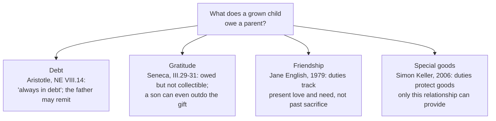

# Philosophy of Debt · Lesson 6.4: Debts of gratitude: do we owe society?

> ⏱ ~15 min · Module 6: Generations, nations and society · Builds on: [1.1 The grammar of owing](01-01-the-grammar-of-owing.md), [6.3 Whose debt is it?](06-03-whose-debt-is-it.md) · Unlocks: the course's boss problems ([syllabus](../syllabus.md))

## Why this matters

"After all I've done for you." "Pay your debt to society." "We owe everything to those who came before us." Each borrows the language of debt for a relation with no loan in it. [1.1](01-01-the-grammar-of-owing.md) found that [gratitude](../reference.md#gratitude) is owed to someone, a directed obligation, but lacks a debt's other marks: no quantity, no transfer, no discharge by payment. This lesson asks whether the debt model ever fits benefits, parents and society, and what changes when it is applied. A debt can be demanded, priced and paid off, after which nothing more is owed. Each of those, applied to a parent or a benefactor, changes the relation it describes. The course ends where it began, with the question of when "owe" is literal.

## The idea

Two people do you a good turn in the same week. At two in the morning a neighbour drives your feverish child to the hospital. A bank lends you 2,000 dollars. You now owe both of them something, but only one of them holds a claim with a sum, a date and a remedy.

Suppose the neighbour's act were a debt too. She could demand it, name a price, sell the claim to someone else, and once you paid, you would owe her nothing more. Most people think each of those would spoil something. If she later asks you for a loan, you may have reason to help that you would not have with a stranger. But "you owe me, after that night" turns her kindness into an invoice sent after the fact.

Three classic positions come out of this puzzle. Seneca held that a benefit becomes a loan the moment it can be collected. Aristotle, who knew the difference, still said a son is "always in debt" to his father. And at the end of the nineteenth century Léon Bourgeois built a political programme on the claim that everyone is born in debt to society.

## Source

Aristotle, *Nicomachean Ethics* VIII.14 (Ross), on friendships between unequals:

> …the man who is benefited in respect of wealth or virtue must give honour in return, repaying what he can. For friendship asks a man to do what he can, not what is proportional to the merits of the case; since that cannot always be done, e.g. in honours paid to the gods or to parents; for no one could ever return to them the equivalent of what he gets, but the man who serves them to the utmost of his power is thought to be a good man. This is why it would not seem open to a man to disown his father (though a father may disown his son); being in debt, he should repay, but there is nothing by doing which a son will have done the equivalent of what he has received, so that he is always in debt. But creditors can remit a debt; and a father can therefore do so too.

Aristotle runs the debt model all the way through. There is a creditor, the father. There is a measure, "the equivalent of what he has received", and it is exactly what the son can never reach, so the debt cannot be discharged by payment and never closes. That is why a son may not disown his father. The model's last mark then arrives on cue: "creditors can remit a debt", so the father, and only the father, may end it ([release](../reference.md#release)). The measure has quietly changed, though. What friendship asks is "what he can", not the equivalent. Where no equivalent exists, the son's duty is measured by his capacity, not by what he received.

## The argument

Seneca, *On Benefits* III.6–8 (Aubrey Stewart's translation), asks whether ingratitude should be an offence at law. He calls it "this most odious vice", and yet: "With the exception of Macedonia, no nation has ever established an action at law for ingratitude." His case against it, reconstructed:

1. **P1.** What makes a benefit a benefit is that the giver leaves its return to the receiver's free choice.
2. **P2.** A return that can be sued for is secured, so a benefit that can be sued for is a loan: "if I call him before a judge, it begins to be not a benefit, but a loan". *In words:* enforcement changes what was given.
3. **P3.** Gratitude is admirable only when it is not compelled. A compelled return is mere repayment: "There is no credit in being grateful, unless it is safe to be ungrateful."
4. **P4.** A court needs a definite object it can measure. The worth of a benefit turns on the giver's cost, timing and spirit (the same sum is a trifle from a rich man and everything from a poor one, III.8), which no judge can weigh.

∴ **C.** Ingratitude is to be condemned, "only to be hated", but not made actionable. Gratitude is owed, but not as a debt.

*In words:* keep the moral verdict and refuse the legal instrument. The obligation is real; its enforcement would destroy it ([benefit and loan](../reference.md#benefit-and-loan)).

**Where the argument is weakest.** P2 and P4, from the law's own practice. Roman law already turned some benefits into debts: the absent man whose affairs another managed must repay her expenses "even though he knows nothing" ([1.1](01-01-the-grammar-of-owing.md)'s quasi-contract), and modern law lets some rescuers recover their costs. So a benefit can be made collectible, at least for its cost, without being ruined. Seneca's defender replies that what is recovered there is the expense, not the benefit. The goodwill and the free choice remain outside the law. A critic presses on P4 instead: some claims measure need rather than benefit. A law letting a destitute parent claim support from an adult child asks what the parent lacks, not what the child received. Such a law escapes P4 and survives as a question about P2 and P3.

## Four answers to what grown children owe

- **Debt.** Aristotle's model, above. Its strength is that it explains why the duty lasts. Its oddity is that it makes the child a permanent debtor who cannot pay.
- **Gratitude.** Seneca denies the premise that the gift of life is unrepayable. His opponent argues that nothing a son gives can match what his father gave, since without the father the son could give nothing. Seneca replies that the argument proves too much. Whoever once healed the father would then be owed an unpayable debt too, and a son who saves his father's life gives more than he received, because he gives it to someone who understands the gift (III.29–31).
- **Friendship.** Jane English ("What Do Grown Children Owe Their Parents?", 1979, paraphrased) argues that "owe" is the wrong word. Favours asked for create debts, but what parents give out of love is not a favour asked for. Grown children's duties are those of friendship: they depend on the relationship as it now stands and on the parents' present needs, and they fade if the friendship has ended.
- **Special goods.** Simon Keller ("Four Theories of Filial Duty", 2006, paraphrased) grounds filial duty in goods that only the parent–child relationship can provide, such as being known and cared for by one's own child.

## Worked examples

**Example 1 (clean): the neighbour's drive.** Run 1.1's marks. The neighbour is a determinate creditor: you owe *her*, and ingratitude would slight her. But there is no quantity, no one to sell the claim to, and no payment that would close it. So you owe her gratitude, not a debt. What does gratitude require when she asks for a loan? On Aristotle's measure, "what he can": a response fitted to her need and your means, which may well mean helping. On Seneca's, the choice is yours, and her "you owe me" would turn her kindness into a loan after the fact. Aristotle agrees about that last point in a different case. When a benefit was given with a view to a return, the receiver should "settle up just as if we had been benefited on fixed terms" (NE VIII.13). So the giver's purpose fixes the category. A drive given freely creates gratitude, while one given on terms creates a debt.

**Example 2 (hard): the surgeon trained at public expense.** An invented country trains its surgeons free of charge. One of them, fully trained, emigrates for a better salary. Does she owe her country anything?

Bourgeois says yes (*Solidarité*, 1896, paraphrased). Everyone is born into an inheritance of language, science, tools and public works built by others, and so everyone begins life as a debtor to the association of past and present members. No one agreed to this, so Bourgeois grounds the *dette sociale*, the social debt, in a [quasi-contract](../reference.md#quasi-contract): the agreement people would have made had they been asked beforehand. The debt is discharged by contribution, through taxes and social insurance, and it is enforceable. Bourgeois applies the debt model to society at full strength, which is exactly what Seneca refused to do for private benefits.

Now test it. The surgeon's training has a cost, so there is a quantity. The creditor is less clear: the state, the taxpayers, or the patients she will not treat. The debt cannot be sold, and it is not discharged by the taxes she pays abroad. An objection from the debate over fair play (cited to [`political-philosophy` 1.3](../../political-philosophy/lessons/01-03-fair-play-gratitude-and-associative-obligation.md)) says benefits thrust on people do not bind them. Robert Nozick imagined neighbours setting up a public address system: having enjoyed the broadcasts does not oblige you to take your turn running it. But the surgeon accepted her training, knowing what it was. The strain comes from the other side. If the country had wanted repayment, it could have said so in advance with a service bond, and that would be a genuine debt. Making the claim after the fact is Seneca's case of a benefit turned into a loan. The benefit ground in [6.3](06-03-whose-debt-is-it.md) charged beneficiaries for someone else's loan. Here the benefactor itself is presenting the bill.

## Watch out

- **You might think that to owe is to be in debt.** Gratitude is owed to someone, yet it has no quantity, cannot be transferred, and is not ended by payment ([1.1](01-01-the-grammar-of-owing.md)). "Owe" is wider than "debt".
- **You might think Seneca excuses ingratitude.** He calls it the most odious vice. What he denies is that it should be actionable. That is a claim about institutions, not about whether ingratitude is wrong. Keep the two apart.
- **You might think a quasi-contract is a kind of contract.** It is the agreement one *would* have made, and a hypothetical agreement binds no one merely by being hypothetical. Bourgeois needs a further argument that its terms are fair, which is where the fair-play debate begins.

## One-liner

> A benefit becomes a debt only when it acquires a quantity, a collector and a way to be paid off, and each of those, applied to parents, benefactors or society, changes the relation it names: that is why "owe" is literal for loans and a claim to be argued everywhere else.

## Problems

**P1 (🟢) *(Exegetical.)*** Using 1.1's four marks of a debt (a quantity, a determinate creditor, transferability, discharge by payment or release), classify each invented case as a debt, owed but not a debt, or neither. Give the deciding mark in one sentence each.

(a) A mother pays her son's rent for a year. They both sign a note: "to be repaid, without interest, when you find work."
(b) A stranger pulls you out of a river and refuses any reward.
(c) A burglar is sentenced to two years in prison. A second burglar, convicted of the same offence, is fined 500 dollars. Both are said to be "paying their debt to society."
(d) A foundation pays a student's tuition on condition that she teaches in the region for five years or repays the tuition.

**P2 (🟡) *(Exegetical (a)–(b).)*** Seneca, *On Benefits* III.30 (Stewart):

> "Whatever I have bestowed upon my father," says my opponent, "however great it may be, yet is less valuable than what my father has bestowed upon me, because if he had not begotten me, it never could have existed at all." By this mode of reasoning, if a man has healed my father when ill, and at the point of death, I shall not be able to bestow anything upon him equivalent to what I have received from him; for had my father not been healed, he could not have begotten me. Yet think whether it be not nearer the truth to regard all that I can do, and all that I have done, as mine, due to my own powers and my own will?

(a) Reconstruct the opponent's argument in three numbered premises and a conclusion, and say how Seneca's physician case attacks it. (b) Find the crux between Seneca and Aristotle's "always in debt" (Source): name the premise one of them must deny. Two sentences for (b).

**P3 (🔴, optional) *(Evaluative.)*** Jane English's view, paraphrased: grown children owe their parents only what friendship requires; the duties depend on the present relationship and the parents' present needs, and they lapse if the friendship has ended. Build a counterexample: a case in which the view gives a verdict you judge wrong, or gives none. Name the part of the view your case attacks, and say whether the objection generalizes and what English's best reply would be. Any verdict passes; 150 words or fewer.

Solutions

**P1** *(Exegetical, strict.)*

**Must hit, strict:**
- (a) **Debt.** A fixed sum (the year's rent), a determinate creditor (the mother), a claim she could assign, discharged by payment or by her release. Being family does not stop a loan from being a loan; the note makes the terms explicit.
- (b) **Owed but not a debt.** Gratitude is directed to the rescuer, but it has no quantity, cannot be transferred, and is not ended by payment. Her refusal of a reward shows there was no price.
- (c) **The fine is a debt; the prison term is not.** The fine has a sum and a creditor (the state), and anyone may pay it on the burglar's behalf. No one can serve another's sentence, and a term is not discharged by any payment. So "paying a debt to society" is literal for the fine and a metaphor for the prison term.
- (d) **Debt, conditional.** The tuition is a sum and the foundation a determinate creditor. The debt is discharged by service or by repayment, and the condition is set in advance, so the benefit was made a debt openly and not after the fact.

**Wrong turns:** calling (a) gratitude because the lender is a parent. Calling both parts of (c) metaphors, or both debts. Treating (d) as a gift because it comes from a foundation.

**Model answer:** (a) Debt: a sum, a named creditor and a note, dischargeable by payment. (b) Owed, not a debt: gratitude to her, but no quantity, transfer or discharge. (c) The fine is a debt that anyone may pay; the prison term cannot be paid by anyone, so "debt to society" is a metaphor for it. (d) A conditional debt, discharged by five years' teaching or by repayment, and set up in advance.

---

**P2** *(Exegetical, strict.)*

**Must hit, strict (a):**
- P1. Without my father's gift of life, I could have given him nothing.
- P2. A gift that is the condition of every later gift is worth more than any of them.
- P3. Everything I give my father is a later gift, made possible by his.
- ∴ C. Nothing I give my father can equal what he gave me.
- **Seneca's attack:** a reductio on P2. The physician who healed the father before the son was born is also the condition of everything the son does, so by P2 the son could never repay the physician either, which is absurd. Seneca then denies P2 directly: what I do is "mine, due to my own powers and my own will", and a condition of an achievement is not its author.

**Must hit, strict (b):** the crux is P2, that the gift which makes all others possible outweighs them all. Aristotle's "there is nothing by doing which a son will have done the equivalent" needs it, or something like it, and Seneca denies it.

**Wrong turns:** calling the argument about love or feeling, when it is about value and equivalence. Reading Seneca as saying sons owe their fathers nothing: he says a son can repay and even outdo the gift, which assumes something is owed. Naming "whether sons should honour fathers" as the crux, when both agree that they should.

**Model answer (b):** The crux is whether the gift that makes every later gift possible must outweigh all of them. Aristotle's "always in debt" needs that premise, and Seneca denies it, holding that what the son achieves is his own and can exceed its condition.

---

**P3** *(Evaluative, any verdict.)*

**Must hit, any verdict:**
- English's view stated precisely: filial duties are the duties of friendship. They vary with the present relationship and present needs, and they lapse when the friendship ends. Past sacrifice alone creates no debt.
- A case with a determinate verdict from the view, or with none: for instance, a parent with dementia who no longer recognizes the child; a child who ended the friendship through her own cruelty; a parent who gave great sacrifices and was rebuffed.
- Your judgment of the verdict, with a reason.
- The part of the view attacked: that the duties lapse with the friendship, or that past sacrifice counts for nothing.
- Generalization and English's best reply. She can say that duties of decency, or ordinary beneficence, remain when friendship ends, so the child still owes what any person owes someone in need.

**Wrong turns:** a case where the parent abused the child, which English's view handles and most people agree with. A case that attacks the debt model instead of English's. Offering only a verdict, with no premise named.

**Model answer, one of several:** A father who gave up his career to raise his daughter now has advanced dementia and no longer knows her. Friendship, which needs mutual recognition, has ended through no one's fault. English's view implies that the daughter's special duties have lapsed and that she owes him only what any decent stranger would owe. I judge that wrong: her reasons to visit, arrange his care and speak for him feel stronger than a stranger's. The case attacks the lapse clause, not the claim that sacrifice creates no debt. It generalizes to any parent whose capacity for friendship is lost to illness. English's best reply is that the relationship persists in the daughter's memory and love, so a one-sided friendship still grounds duties. But if friendship can be one-sided and backward-looking, the view has moved toward the gratitude account it meant to replace.

## Flashback

**From Lesson [6.2](06-02-public-debt-and-the-unborn.md) (Public debt and the unborn):** *(Formal (a) · Exegetical (b).)* Illustrative numbers. An **invented** country's adults are aged 20 to 79, with equal numbers at every age and a stable population. It will pay every adult aged 65 to 79 a one-off bonus of 1,000 dollars, which costs 250 dollars per adult. **Option T:** tax every adult 250 dollars now. **Option D:** borrow at 3 percent and repay in a single payment in 30 years, by an equal tax on every adult then alive.

(a) What does each adult pay in year 30 under D? In present value at 3 percent, the rate at which anyone can borrow or save, what does D cost or save each member of four groups, compared with T: adults now aged 20 to 49, adults now aged 50 to 79, today's children, and people born in the next ten years? (b) 6.2's uncompensated-burden argument says that borrowing for present consumption wrongs later taxpayers who pay, receive no offsetting benefit and never consented. Which of the four groups can press it against D, and what might block the complaint of the last group? **Two sentences for (b).**

Solution

**Must hit, strict (a):** under D each adult alive in year 30 pays $250 \times 1.03^{30} = 250 \times 2.42726 = 606.82$ dollars, about 607, which is worth $606.82 / 1.03^{30} = 250$ dollars today.
- *Adults now aged 20 to 49* (50 to 79 in year 30): 607 then instead of 250 now, so no change. They borrow from their own future selves.
- *Adults now aged 50 to 79:* dead before year 30, so they pay nothing instead of 250. Each saves 250.
- *Today's children* (30 to 49 in year 30) and *people born in the next ten years* (20 to 29 then): 607 in year 30 instead of nothing. Each loses 250 in present value.
- The two sides balance: 30 age cohorts save 250 each and 30 lose 250 each, so D moves 250 a head from today's children and the next decade's births to today's older adults.

**Must hit, strict (b):**
- Only the losers can press it, today's children and people born in the next ten years: they pay for a bonus they never received and never voted on (P2–P3). Adults now aged 20 to 49 lose nothing, and adults now aged 50 to 79 gain.
- Today's children exist under either option, so P4's comparison with T is available for them. For people born in the next ten years it holds only if the choice between T and D does not change who is conceived. If it does, the non-identity problem removes the person-affecting complaint, and the argument needs an impersonal, non-comparative or standpoint principle.
- (Credit for the empirical escape: if the older adults saved their 250 and it passed down by bequest to the later payers, no one would lose. That is Ricardian equivalence, pressing P2.)

**Wrong turns:** dividing the repayment among the 15 bonus cohorts, or among today's adults, instead of among the adults alive in year 30. Simple interest, $250 \times (1 + 0.03 \times 30) = 475$. Counting adults now aged 20 to 49 as burdened: at the rate they can borrow and save, 607 in year 30 is the same as 250 now. Applying the non-identity problem to today's children, who exist whichever option is chosen.

**Model answer:** (a) Under D each adult alive in year 30 pays $250 \times 1.03^{30} = 606.82$ dollars, worth 250 today. So D changes nothing for adults now aged 20 to 49, who pay 607 later instead of 250 now; saves 250 for adults now aged 50 to 79, who die before the bill arrives; and costs 250 in present value to each of today's children and each person born in the next ten years, who pay 607 instead of nothing. (b) Only those last two groups can press the argument, since they pay for a bonus they never received or voted on, and today's children, who exist under either option, can compare their lot under D with their lot under T. For people born in the next ten years that comparison holds only if the choice of finance does not change who is conceived; if it does, the non-identity problem leaves their complaint needing an impersonal, non-comparative or standpoint principle.

## Connections

- **Backward:** [1.1](01-01-the-grammar-of-owing.md) set out the four marks, classified gratitude as owed but not a debt, and introduced the quasi-contract that Bourgeois borrows for society. [5.1](05-01-forgiving-a-debt-forgiving-a-wrong.md) is the creditor's power of release that Aristotle hands the father. [4.2](04-02-owing-the-ancestors-owing-god.md) gave Nietzsche's darker version of owing everything to those who came before: a debt to the ancestors that grows with the tribe's power. [6.3](06-03-whose-debt-is-it.md)'s benefit ground charged beneficiaries for a loan they did not make, and [6.1](06-01-the-earth-belongs-to-the-living.md)'s Madison measured what the dead had advanced.
- **Sideways:** [`theology-of-debt` 1.1](../../theology-of-debt/lessons/01-01-lending-in-the-covenant.md) reads mercy to the poor as a loan to God ("He that hath mercy on the poor, lendeth to the Lord", Proverbs 19:17), and its [3.1](../../theology-of-debt/lessons/03-01-from-burden-to-debt.md) follows almsgiving as a deposit laid up in heaven: the debt model applied to charity from inside a tradition. Fair play and gratitude as grounds of political obligation belong to [`political-philosophy` 1.3](../../political-philosophy/lessons/01-03-fair-play-gratitude-and-associative-obligation.md), and the hypothetical contract behind Bourgeois's quasi-contract to [`ethics` 5.1](../../ethics/lessons/05-01-contractarianism-morality-as-mutual-advantage.md).
- **The course, looking back:** the course began by asking what it is to owe. It found that "debt" is literal where a quantity, a creditor, transferability and discharge all hold, as with loans, taxes and fines. It is contested where one mark is missing or disputed: promises, forgiveness, the debts of generations and of regimes. And it is a model to be argued for, not assumed, for guilt, gratitude and society. Whether any of those contested debts binds was left open in every module, and the boss problems ask you to decide.
