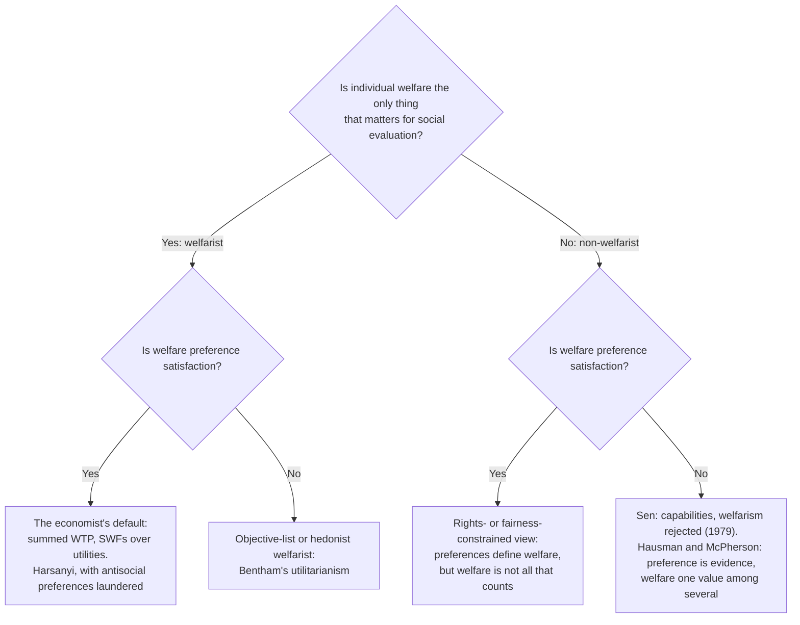

# Philosophy of Economics · Lesson 1.1: Welfarism and preference satisfaction

> ⏱ ~15 min · Module 1: Welfare and its measurement · Builds on: [`ethics` 1.2 What is good for a person?](../../ethics/lessons/01-02-what-is-good-for-a-person.md), [`grad-micro` 2.1 Preferences and utility representation](../../grad-micro/lessons/02-01-preferences-utility-representation.md) · Unlocks: [1.2 Money and happiness as measures](01-02-money-and-happiness-as-measures.md), [3.1 The Pareto principle](03-01-the-pareto-principle.md)

## Why this matters

Economics makes normative claims in technical clothing: a policy is "efficient", welfare rose, a future harm is worth less than a present cost, people chose what they wanted. This course finds the value judgment inside each technique. Its six modules take welfare and its measurement, choice and nudges, efficiency and cost-benefit analysis, discounting, the moral limits and justice of markets, and what models explain. It takes no side in any of those debates, and it supplies the normative footing that [`public-economics`](../../public-economics/syllabus.md) leaves open for its welfare weights and cost-benefit tests. It starts with the premise under all of them: that a policy is good insofar as it gives people what they prefer.

## The idea

A welfare economist ranking two policies usually does two separate things at once.

First, she decides that the only thing relevant to the ranking is how well off each person ends up. Not rights, not fairness of procedure, not whether anyone deserved anything: just individual welfare. That is **welfarism**, a claim about *what social evaluation may look at* ([welfarism](../reference.md#welfarism)).

Second, she decides what a person's welfare *is*: the satisfaction of her preferences. That is the **preference-satisfaction view**, a claim about *what is good for a person* ([preference-satisfaction view](../reference.md#preference-satisfaction-view)).

The two travel together in practice, which is why they are easy to confuse, but each can be held without the other. A hedonistic utilitarian is a welfarist who rejects the second claim. A rights theorist can grant that welfare is preference satisfaction and deny that welfare is all that matters. [`ethics` 1.2](../../ethics/lessons/01-02-what-is-good-for-a-person.md) set out the rival theories of well-being (hedonism, desire satisfaction, objective list) and ran adaptive preference through them; this lesson asks what happens when the desire theory becomes a policy *metric*.

Why do economists default to preferences? Three reasons, each respectable. Preferences are observable, roughly, through choices and willingness to pay. Deferring to them avoids the planner deciding what is good for you. And the formal machinery of [`grad-micro` 2.1](../../grad-micro/lessons/02-01-preferences-utility-representation.md) represents a preference ordering with a utility function, so "welfare" becomes something you can sum.

## The argument

Let $x, y$ be social states, $i = 1, \dots, n$ the people, $w_i(x)$ person $i$'s welfare in $x$, and $u_i$ a utility function representing $i$'s preference ordering $\succeq_i$ over states.

**The economist's default, reconstructed.**

- **P1 (welfarism).** The social ranking of states depends only on the vector of individual welfare levels: if $(w_1(x),\dots,w_n(x)) = (w_1(x'),\dots,w_n(x'))$ and likewise for $y, y'$, then $x$ is ranked above $y$ exactly when $x'$ is ranked above $y'$. *In words:* two situations that are alike in everyone's welfare must be ranked alike, whatever else differs. The term is Amartya Sen's ("Utilitarianism and Welfarism", 1979), who analysed utilitarianism as welfarism combined with sum-ranking.
- **P2 (preference satisfaction).** $w_i(x) \ge w_i(y)$ exactly when $x \succeq_i y$, so $u_i$ measures $w_i$. *In words:* you are better off in whichever state you prefer.
- **P3 (measurement).** Choices and willingness to pay reveal $\succeq_i$ (examined in [2.1](02-01-preference-and-revealed-preference.md) and [1.2](01-02-money-and-happiness-as-measures.md)).
- **∴ C.** Rank policies by some increasing function of the $u_i$: summed willingness to pay, a social welfare function as in [`grad-micro` 6.5](../../grad-micro/lessons/06-05-social-choice-welfare.md), or the Pareto test of [3.1](03-01-the-pareto-principle.md).

**Three pressures on P2.**

*Laundering.* Preferences cover whole states, including other people's lots. Some are malicious, envious or simply misinformed. Harsanyi (1977) had already proposed excluding antisocial preferences such as sadism and malice from his utilitarian sum. Robert Goodin ("Laundering Preferences", in Elster and Hylland, eds., *Foundations of Social Choice Theory*, 1986) generalized the move: filter preferences before they enter the social calculus ([laundered preferences](../reference.md#laundered-preferences)). The filter's contents are a value judgment. The question this lesson presses is *which premise* the filter revises.

*Information.* A preference resting on a false belief (I want the glass because I think it holds water; it holds bleach) is not one whose satisfaction helps me. The **informed-preference** repair counts only the preferences you would have with full information and clear reasoning ([informed preferences](../reference.md#informed-preferences)).

*Adaptation.* People who have long been deprived often come to want little; Jon Elster called it sour grapes, and Sen argued that the chronically deprived adjust their desires to what seems feasible, so a metric of satisfied desire registers their deprivation as small ([adaptive preferences](../reference.md#adaptive-preferences)). As a policy matter this is worse than a philosophical puzzle: a preference-satisfaction metric steers resources *away* from the group whose preferences have shrunk, since there is less unmet preference there to satisfy.

**The evidential retreat.** Daniel Hausman and Michael McPherson ("Preference Satisfaction and Welfare Economics", *Economics and Philosophy*, 2009) give up P2 and keep most of the practice. Replace it with:

- **P2′.** When people are concerned with their own interests and are reasonably good judges of what serves them, their preferences are reliable *evidence* of their welfare. *In words:* preferences are a good thermometer, not the temperature ([preferences as evidence](../reference.md#preferences-as-evidence)).

On P2′ welfare economics is defensible wherever the two conditions roughly hold, which covers much ordinary market and policy evaluation, and it has a principled reason to discount preferences where they fail: other-regarding preferences fail the first condition, misinformed and adapted ones the second. Laundering stops looking ad hoc.

**Where the argument is weakest.** P2′ itself. To say when someone is a "good judge" of her interests, you need some account of what her interests are, independent of her preferences. So the evidential view does not avoid the ethics 1.2 dispute; it postpones it to exactly the cases where preferences and welfare come apart, which are the cases policy most needs to decide. Its defenders reply that a thermometer can be calibrated against a few clear cases without a full theory of heat, and that those cases are rare enough for the default to stand.

## Map of positions

Read the diagram as two independent questions. Most objections in this module hit one branch point and leave the other standing, so the first thing to ask of any objection is which question it answers.

## Worked examples

**Example 1 (clean): the town pool.** All numbers illustrative. A town council asks whether to open its public pool to the 300 residents of a neighbouring housing estate. A survey of willingness to pay finds:

- each estate resident would pay 40 dollars a season for access: $300 \times 40 = 12{,}000$ dollars;
- each of the town's 1,000 residents would pay 5 dollars to avoid the extra crowding: $1{,}000 \times 5 = 5{,}000$ dollars;
- each town resident would also pay 10 dollars to keep "those people" out, a preference about who the estate residents are, not about crowding: $1{,}000 \times 10 = 10{,}000$ dollars.

Unlaundered, opening the pool nets $12{,}000 - 5{,}000 - 10{,}000 = -3{,}000$ dollars: keep it closed. Launder the exclusionary preference and it nets $12{,}000 - 5{,}000 = +7{,}000$ dollars: open it. The verdict flips at an exclusionary willingness to pay of $7{,}000 / 1{,}000 = 7$ dollars a head.

Now the signature move: *which premise did the laundering revise?* Two answers, and they are different theories.

1. **Revise P2.** Satisfying a malicious preference does not make the town residents better off; welfare is laundered preference satisfaction. Welfarism survives, but the account of welfare is no longer the economist's simple one.
2. **Revise P1.** Satisfying it does make them better off, but social evaluation should ignore welfare gained from others' exclusion. That keeps P2 and gives up welfarism: the *content* of a preference, non-welfare information, now affects the ranking.

Sen pressed cases like this against welfarism itself, which is route 2. Harsanyi, who laundered from inside a welfarist utilitarianism, needs route 1. The arithmetic is identical; the philosophy is not.

**Example 2 (hard): informed but unstable.** A health agency must decide whether to fund a demanding long-term treatment that keeps patients alive with a lower quality of life. Invented case: asked in advance, healthy, well-informed people say they would rather not live on the treatment. People who are actually on it, equally well informed, overwhelmingly prefer to continue. Neither group is misinformed, and both are thinking of their own interests.

On P2 there is no single answer, because a person's preference is indexed to a time: the welfare of the same person differs depending on whether you consult her before or after. P2 needs a rule for which self counts, and the theory supplies none.

P2′ does better at first: both preferences are evidence, so look for a third source (reports of experienced satisfaction, say). But notice what that means. To decide whether the on-treatment preference is healthy adaptation or sour grapes, you need an independent judgment of how the patients' lives actually go. That is the weak point named above, now in a case where both of Hausman and McPherson's conditions hold and still underdetermine the answer.

## Watch out

- **You might think rejecting welfarism means rejecting the preference-satisfaction view, but** they are answers to different questions. A critic who says "efficiency ignores fairness" attacks P1; one who says "people want what is bad for them" attacks P2. Policy arguments routinely run them together.
- **You might think "people prefer A" settles "A is better for them", but** the first is an empirical claim, the second is a conceptual claim about what welfare is, and "the state should provide A" is a normative claim that also needs P1. P2 is exactly the bridge between the first two, and no survey can test the bridge.
- **You might think laundering removes only irrational preferences, but** a malicious preference can be fully informed and perfectly consistent. The filter applies a moral standard, and it should be stated as one.

## One-liner

> Welfarism says only welfare counts; the preference-satisfaction view says welfare is getting what you prefer; economics usually assumes both, and every laundering, adaptation or evidence argument is about which of the two to give up.

## Problems

**P1 (🟢) *(Formal (a) · Exegetical (b).)*** An **invented** policy brief from a city planning office, not the words of any real person or agency:

> "The vacant lot can become a community garden or a parking lot. Our survey finds 400 residents willing to pay 30 dollars a year for the garden and 150 commuters willing to pay 90 dollars a year for parking. (1) Teachers say children would learn to grow food in the garden, but since parents' willingness to pay already includes whatever that is worth to them, there is no further benefit to count. (2) Some residents argue the garden is fairer, since the lot would serve everyone rather than only car owners; fairness, however, is not a benefit, and the analysis must count only what people gain. Parking wins."

(a) Compute each option's total willingness to pay, the margin, and the willingness to pay per garden resident at which the garden would tie. (b) For sentences (1) and (2), say which premise of the default (P1 welfarism or P2 preference satisfaction) does the work, and name a position that would reject it. One sentence each.

**P2 (🟡) *(Evaluative.)*** Build a case, other than the town pool, in which counting a fully informed preference's satisfaction as a welfare gain gives a social verdict you judge wrong. Then say whether laundering that preference revises P1 or P2, and what a defender of the unlaundered default would reply. Any verdict passes. 150 words or fewer.

**P3 (🔴, optional) *(Exegetical.)*** Marta, fully informed and thinking only of her own life, prefers a high-paying, stressful job to a lower-paying one in which she would be healthier and report more day-to-day satisfaction. Analyst C holds the informed-preference view as an account of what welfare *is*; analyst E holds Hausman and McPherson's evidential view. (a) State each analyst's verdict on which job is better for Marta. (b) Name the single premise that divides them, say which kind of claim it is (empirical, conceptual or normative), and say what could move each. 120 words or fewer for (b).

Solutions

**P1** *(Formal (a) · Exegetical (b))*

(a) Garden: $400 \times 30 = 12{,}000$ dollars. Parking: $150 \times 90 = 13{,}500$ dollars. Parking leads by $13{,}500 - 12{,}000 = 1{,}500$ dollars. The garden ties at $13{,}500 / 400 = 33.75$ dollars per resident.

**Must hit, strict (b):**

- **Sentence (1) rests on P2.** It counts the children's learning only as far as someone prefers it, so a benefit no one is willing to pay for is no benefit. An objective-list view, on which knowledge is good for the children whether or not anyone pays for it, rejects this. (So does any view that counts the children's own welfare instead of their parents' willingness to pay for it.)
- **Sentence (2) rests on P1.** It excludes fairness from the ranking because fairness is not anyone's welfare gain. A non-welfarist, a rights- or fairness-constrained view, or Sen, rejects it.

**Wrong turns:** assigning (2) to P2 because "fairness is a preference too". Residents may prefer fairness, and then a preference-satisfaction analyst could count *that preference*, but the brief's stated ground is that fairness is "not a benefit", a claim about what social evaluation may look at. Assigning (1) to P3 (measurement): the brief does not doubt the survey; it denies that unpaid-for learning is welfare.

**Model answer:** (a) 12,000 vs 13,500 dollars; parking by 1,500; the garden ties at 33.75 dollars a head. (b) Sentence (1) leans on P2, which an objective-list theorist rejects. Sentence (2) leans on P1, which a non-welfarist such as Sen rejects.

---

**P2** *(Evaluative)*

**Accept:** any case where the preference is fully informed (so the informed-preference repair cannot remove it), its satisfaction plausibly registers as a welfare gain on P2, and counting it changes or worsens a social verdict.

**Must hit, any verdict:**

- The case built so the preference is informed and satisfaction clearly changes the ranking.
- A verdict, with a reason.
- An explicit choice: laundering denies that satisfaction benefits the holder (revises P2) or denies that the benefit counts socially (revises P1).
- The defender's reply stated at strength: who is to decide which preferences count, and on what authority, given that laundering hands the filter to the analyst.

**Wrong turns:** a misinformed preference, which informed-preference theory already handles; a case where the preference is outweighed anyway, so counting it changes nothing; skipping the P1/P2 choice.

**Model answer, one of several:** A village votes on a footpath across common land. Most villagers mildly prefer the path; a few residents, fully informed, intensely prefer that a disliked family's children be unable to walk to school by the short route. Summed intensity blocks the path. I judge that wrong. Laundering here should revise P1: the spiteful residents may really be better off getting their way, but social evaluation should not count a gain whose content is another's exclusion. The defender replies that once the analyst may strike preferences by their content, nothing principled stops him striking ones he merely disapproves of, and the deference that justified the default is gone.

---

**P3** *(Exegetical)*

**Must hit, strict (a):**

- **C:** the high-paying job is better for her, by definition, since her preference is informed and self-regarding.
- **E:** her preference is strong evidence for the high-paying job, but the health and satisfaction evidence points the other way; the verdict is open and depends on weighing the evidence, so E may conclude the other job is better for her.

**Must hit, strict (b):**

- The crux: whether a fully informed, self-regarding preference can be mistaken about the person's own good. C denies it; E affirms it.
- It is a conceptual claim, about what welfare is.
- What moves them is conceptual argument, not data: for C, a case in which informed preference seems plainly wrong about the person's good (pressure toward an objective or hedonic standard); for E, an argument that there is no fact about welfare apart from idealized preference, so the "independent evidence" has nothing to be evidence of.

**Wrong turns:** treating the crux as empirical ("we need better surveys of Marta's satisfaction"), which E needs as evidence but which cannot settle whether evidence about satisfaction bears on welfare at all. Saying E denies she is informed: the case stipulates she is.

**Model answer:** (a) C: the high-paying job, because she informedly prefers it. E: undecided; her preference counts for that job, but health and satisfaction evidence counts against it. (b) They divide on whether an informed, self-interested preference can be wrong about the person's own good. That is a conceptual claim about what welfare is, so no further data on Marta settles it. C would move if shown cases where informed preference is plainly mistaken about the chooser's good; E would move if persuaded there is no fact about welfare beyond idealized preference.

## Connections

- **Backward:** [`ethics` 1.2](../../ethics/lessons/01-02-what-is-good-for-a-person.md) supplied the theories of well-being and the adaptive-preference row of its table; this lesson turns the desire theory into P2 and asks what it does as a metric. [`grad-micro` 2.1](../../grad-micro/lessons/02-01-preferences-utility-representation.md) is the representation theorem that makes P2 computable, and it says nothing about whether satisfying the represented preference is good for anyone.
- **Forward:** [1.2](01-02-money-and-happiness-as-measures.md) tests P3's money metric and the happiness alternative; [1.3](01-03-capabilities-as-a-welfare-metric.md) builds Sen's rival to P2. [2.1](02-01-preference-and-revealed-preference.md) asks what a preference is. [3.1](03-01-the-pareto-principle.md) shows the Pareto principle inherits both P1 and P2.
- **Sideways:** the social welfare functions of [`grad-micro` 6.5](../../grad-micro/lessons/06-05-social-choice-welfare.md) and the welfare weights of [`public-economics`](../../public-economics/syllabus.md) Module 5 are P1 and P2 in formal dress: the weights decide how to aggregate, these premises decide what is being aggregated. Harsanyi's aggregation theorem in [`decision-theory`](../../decision-theory/syllabus.md) 5.1 rests on Pareto indifference, a welfarist premise.
