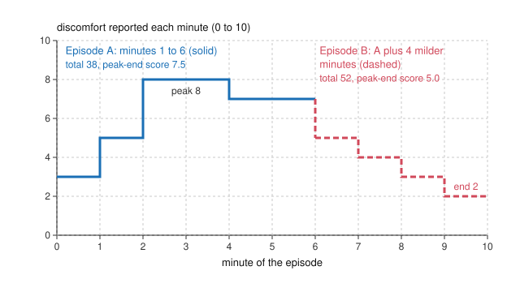

# Philosophy of Economics · Lesson 1.2: Money and happiness as measures

> ⏱ ~15 min · Module 1: Welfare and its measurement · Builds on: [1.1 Welfarism and preference satisfaction](01-01-welfarism-and-preference-satisfaction.md), [`public-economics` 2.3 Excess burden and the Harberger triangle](../../public-economics/lessons/02-03-excess-burden-and-the-harberger-triangle.md) · Unlocks: [1.3 Capabilities as a welfare metric](01-03-capabilities-as-a-welfare-metric.md), [3.3 Cost-benefit analysis and the value of a life](03-03-cost-benefit-analysis-and-the-value-of-a-life.md)

## Why this matters

[1.1](01-01-welfarism-and-preference-satisfaction.md) asked what welfare is. Policy needs a number, and economics offers two: money (what people would pay) and happiness (what people report feeling). Each is a measuring instrument, and each instrument quietly picks a theory of well-being from [`ethics` 1.2](../../ethics/lessons/01-02-what-is-good-for-a-person.md). Money leans on preference satisfaction, and on top of it adds a judgment about whose dollars count how much. Happiness leans toward hedonism, or toward a person's verdict on her own life. This lesson finds the value judgment inside each and shows that the two can disagree even about one person on one afternoon.

## The idea

Ask two people what a new footbridge is worth to them. Both want it equally: same desire, same intensity, same pleasure once it is built. One has 20,000 dollars to her name and one has 200,000. The richer one will pay far more, because a dollar matters less to him. Add up [willingness to pay](../reference.md#willingness-to-pay) and the bridge looks ten times as valuable to him. Nothing about the bridge or the wanting differs. Only the measuring rod does.

The money metric is not careless: it is the cleanest way to read preferences off behaviour without comparing minds. But summing it makes a claim in the act of adding: a dollar is a dollar, whoever holds it.

Happiness data try to skip the rod and measure the thing itself. Daniel Kahneman's work showed that "the thing itself" splits. There is how an experience feels moment by moment, how you remember it afterwards, and what you choose next time, and the three need not agree.

## The argument

**The money-metric argument** (the standard case for ranking projects by summed WTP, reconstructed).

1. **A person is better off as more of her preferences are satisfied** (the preference-satisfaction view, [1.1](01-01-welfarism-and-preference-satisfaction.md)). *Conceptual-normative.*
2. **Her WTP for a change is the largest sum she would give up and still be no worse off by her own lights**, so it measures, in money, how much she prefers the change. *Conceptual.* Under a utility function $u$ and wealth $w$, WTP for a gain solves $u(w-\text{WTP})+\Delta u=u(w)$.
3. **Money gains and losses can be added across people at par**: a dollar of WTP counts the same whoever reports it. *Normative.*
4. **A project whose summed WTP exceeds its cost could pay for itself and leave someone better off** (the potential-compensation test, [3.2](03-02-the-limits-of-pareto-and-the-compensation-tests.md)). *Conceptual.*

∴ **Rank projects by summed WTP net of cost.**

*In words:* each person prices her own gain, and we add the prices.

Equivalent and compensating variation ([`public-economics` 2.3](../../public-economics/lessons/02-03-excess-burden-and-the-harberger-triangle.md)) are the two exact versions of premise 2: pay to get the gain, or be paid to forgo it. They differ by an income effect, which is why [WTP and WTA](../reference.md#wtp-and-wta) differ.

Under log utility, $u(w)=\ln w$, premise 2 gives a closed form:

$$\text{WTP}=w\left(1-e^{-\Delta u}\right).$$

*In words:* for a fixed gain in welfare, WTP is a fixed **share of wealth**. Double the wealth, double the WTP. That is the [wealth dependence of WTP](../reference.md#wealth-dependence-of-wtp), and premise 3 converts it into a ranking.

**The happiness alternative.** Q1: what matters for a person is how her life goes as she experiences or judges it. Q2: self-reports (moment-by-moment feeling, or a 0–10 life-satisfaction rating) measure that on a scale that is comparable across people. ∴ Rank projects by the [subjective well-being](../reference.md#subjective-well-being) they add. This needs no prices and no premise 3. It needs Q2 instead.

**Where the argument is weakest.** For money, premise 3. A critic says that adding WTP at par weights each person's welfare by her wealth, a [distributional weight](../reference.md#distributional-weights) nobody would defend if it were stated aloud. The defender replies that the weights are not a hidden welfare judgment but a division of labour: rank by efficiency here and redistribute through the tax system, which does it more cheaply than distorting project choice (Kaplow and Shavell, 1994). The rejoinder is that this works only if the compensation is actually paid. For happiness, Q2. People use response scales differently, and Bond and Lang (*Journal of Political Economy*, 2019) showed that because answers come in ordered categories, which group is happier on average is generally not identified without strong assumptions about how people map feelings to numbers, and several published rankings reverse under plausible transformations.

## The case

Kahneman, Wakker and Sarin ("Back to Bentham?", 1997) separate three things economists run together:

- **Decision utility**: the weight an outcome gets in choice. Revealed preference and WTP read this.
- **Experienced utility**: the moment-by-moment flow of pleasure and pain, what Bentham meant.
- **Remembered utility**: the retrospective evaluation of an episode.

[Experienced and remembered utility](../reference.md#experienced-and-remembered-utility) come apart systematically. In a cold-water study (Kahneman, Fredrickson, Schreiber and Redelmeier, *Psychological Science*, 1993), subjects held one hand in 14°C water for 60 seconds, and the other hand for those 60 seconds plus 30 more while the water warmed slightly to 15°C. Asked which to repeat, a significant majority chose the longer trial, which contained strictly more pain. Redelmeier and Kahneman's study of colonoscopy patients (1996) found the same pattern clinically. Retrospective ratings track roughly the average of the worst moment and the last one, the [peak-end rule](../reference.md#peak-end-rule), and largely ignore how long the episode lasted (**duration neglect**; Fredrickson and Kahneman, 1993).

The figure stylizes this with invented ratings and the peak-end rule taken literally.

## Worked examples

**Example 1 (clean): the footbridge and the two projects.** All numbers illustrative. Ana has wealth 20,000 dollars, Ben 200,000, both with log utility.

- **Same gain.** The bridge raises each one's utility by $\Delta u=0.05$. Ana's WTP is $20{,}000(1-e^{-0.05})=975.41$; Ben's is $200{,}000(1-e^{-0.05})=9{,}754.12$. Same desire, ten times the money.
- **Two projects.** Project A gives Ana $\Delta u=0.10$ (a clinic nearer her home); project B gives Ben $\Delta u=0.05$. Summed WTP: A is $20{,}000(1-e^{-0.10})=1{,}903.25$, B is $9{,}754.12$, so WTP picks B. Summed log utility: $0.10>0.05$, so utility picks A.
- **The income effect.** Ben's WTA to forgo his gain is $200{,}000(e^{0.05}-1)=10{,}254.22$, 500 dollars more than his WTP: [CV and EV](../../public-economics/lessons/02-03-excess-burden-and-the-harberger-triangle.md) bracketing the same gain.

The value judgment is visible now. Dividing each WTP by wealth, which under log utility is weighting by marginal utility of money, $u'(w)=1/w$, gives $0.0952$ for A against $0.0488$ for B and restores the utility ranking. The welfarist who uses that weighting (an interpersonal comparison of utility) and the economist who sums at par (premise 3) are not disagreeing about Ana or Ben. They disagree about whether a dollar's worth of welfare depends on whose dollar it is.

**Example 2 (hard): one person, two episodes.** Mira faces a medical procedure in one of two versions, A or B, as in the figure. B is A with four milder minutes added.

- **Experienced utility** sums discomfort: A totals $3+5+8+8+7+7=38$, B totals $38+5+4+3+2=52$. A is better; B is A plus extra pain.
- **Remembered utility** (peak-end, stylized): A scores $(8+7)/2=7.5$, B scores $(8+2)/2=5.0$. B is remembered as better.
- **Decision utility**: if Mira is like the cold-water subjects, she chooses B for next time, and her WTP to get B rather than A is positive.

A preference-satisfaction metric and WTP side with B; a hedonist metric of experienced utility sides with A. No interpersonal comparison is involved, so premise 3 is idle. The split is inside one person. A hedonist says Mira's choice is a memory error, and respecting it adds pain. A defender of choice says that how an episode ends and how it is remembered are part of what Mira cares about, and that a measure overriding her considered preference is paternalism. Which one tracks her welfare is the ethics 1.2 question, now with a policy price.

## Watch out

- **You might think life satisfaction is a hedonic measure, but actually** a 0–10 rating of "your life as a whole" asks for a judgment, not a feeling. Affect measures (how you felt yesterday) lean hedonist; life-satisfaction scales sit closer to a person's evaluation of her own life, and the two can respond differently to the same change, such as a rise in income.
- **You might think "people adapt" is a normative verdict, but actually** it is an empirical claim, and a contested one. Early set-point views held that people return to baseline after almost anything. Later panel work found adaptation real but incomplete for some events, disability among them (Diener, Lucas and Scollon, *American Psychologist*, 2006). Whether an adapted gain or loss *should* count is a separate, normative question, the [adaptive-preference](../reference.md#adaptive-preferences) worry from 1.1 in hedonic form.
- **You might think summed WTP avoids interpersonal comparison, but actually** it makes one by default: it says a dollar carries equal welfare for everyone. Refusing to compare utilities does not make the comparison go away; it fixes the weights at par.

## One-liner

> WTP prices welfare in dollars and so weights people by wealth; happiness data skip the dollars but split into feeling, memory and judgment, and assume everyone uses the scale alike.

## Problems

**P1 (🟢) *(Formal (a)–(b) · Exegetical (c).)*** All numbers illustrative. Cara has wealth 30,000 dollars and Dev 120,000, both with log utility, $u=\ln w$. Policy X raises Cara's utility by 0.08; policy Y raises Dev's by 0.03. (a) Compute each person's WTP for their policy, and say which policy summed WTP prefers and which summed log utility prefers. (b) How large would Dev's utility gain from Y have to be for the two WTPs to tie? (c) Reweight each WTP by $\bar w/w$ with $\bar w=75{,}000$ (so a person with 75,000 dollars has weight 1). Which policy wins now, and which premise of the money-metric argument have you replaced? One sentence for the premise.

**P2 (🟡) *(Exegetical.)*** An invented municipal memo:

> "Program H expands a hospice and raises its 400 users' average life satisfaction by 0.6 points on a 0–10 scale. Program P builds a park and raises 20,000 residents' average by 0.02 points. The aggregate happiness gain is 240 points for H and 400 for P. Aggregate willingness to pay is 1.2 million dollars for H and 0.9 million for P. The metrics disagree, but happiness is what people actually care about and WTP is just money, so we recommend P. And because a happiness point is the same for everyone, no distributional judgment is involved."

(a) Which theory of well-being does each metric lean on, and what slide between kinds of claim does "happiness is what people actually care about" make? (b) Name two assumptions hidden in the memo's last sentence. Two sentences per part.

**P3 (🔴, optional) *(Evaluative.)*** An invented government proposes ranking every spending program by its effect on average reported life satisfaction instead of by summed WTP. Give the strongest case for the proposal, the strongest objection to it, and a reply to that objection. Any verdict; 150 words or fewer.

Solutions

**P1** *(Formal (a)–(b) · Exegetical (c), strict.)*

(a) $\text{WTP}=w(1-e^{-\Delta u})$. Cara: $30{,}000(1-e^{-0.08})=30{,}000\times0.07688=2{,}306.51$. Dev: $120{,}000(1-e^{-0.03})=120{,}000\times0.02955=3{,}546.54$. Summed WTP prefers **Y**; summed log utility prefers **X** ($0.08>0.03$).

(b) Solve $120{,}000(1-e^{-x})=2{,}306.51$: $1-e^{-x}=0.019221$, so $x=-\ln(0.980779)=0.0194$. Dev's gain need be only about **0.019**, a quarter (0.243) of Cara's 0.08, for summed WTP to call it a tie.

(c) Weights $75{,}000/30{,}000=2.5$ and $75{,}000/120{,}000=0.625$. Weighted WTP: Cara $2.5\times2{,}306.51=5{,}766.27$, Dev $0.625\times3{,}546.54=2{,}216.58$. **X** wins, matching the utility ranking. You have replaced **premise 3** (a dollar counts the same whoever holds it) with weights proportional to marginal utility of money, $1/w$ under log utility, an explicit interpersonal comparison.

**Must hit, strict (c):** X wins; premise 3 is the one replaced; the new weights are a normative choice (here, utilitarian weights under log utility), not a correction of an error.

**Wrong turns:** computing WTP as $w\,\Delta u$ (the small-gain approximation: 2,400 and 3,600; the ranking survives but the numbers are off). Saying in (c) that premise 2 changed: each person's WTP is the same number; only how it is added changed.

---

**P2** *(Exegetical, strict.)*

**Must hit, strict (a):**

- WTP leans on **preference satisfaction**, read through decision utility and weighted by wealth. Life-satisfaction points lean on a **judgment of one's life as a whole**, closer to an evaluative view than to strict hedonism; an affect measure would be the hedonist one.
- The slide: "what people care about" is an **empirical** claim about motivation, used to settle a **normative** one, which metric policy should count. Even if true, it would not show that summed survey points measure what people care about better than their own trade-offs do.

**Must hit, strict (b), any two:**

- **Interpersonal comparability of scale use:** a 0.6 reported by hospice users and a 0.02 by park users mean the same amount of welfare (the Bond and Lang problem).
- **Cardinality and additivity:** points from an ordered scale can be added across people, so 20,000 tiny gains outweigh 400 large ones.
- **Equal weighting is itself distributional:** treating every point alike is a choice of weights, just as summing WTP at par is. "No judgment" is false either way.
- **Timing and duration:** the ratings are snapshots; hospice users' gains last weeks, park users' years, and adaptation may erode the park's.

**Wrong turns:** calling life satisfaction plain hedonism. Saying the memo's error is preferring happiness to money; the problem is the slide and the hidden assumptions, not the verdict.

**Model answer:** (a) WTP leans on preference satisfaction weighted by wealth, while life-satisfaction points lean on each person's judgment of her life as a whole rather than on felt pleasure. "Happiness is what people actually care about" is an empirical claim about motivation doing the work of a normative claim about which metric should rank policy. (b) The memo assumes that people in both programs use the 0–10 scale the same way, so a hospice point and a park point carry equal welfare. It also assumes ordered survey responses can be summed across 20,000 people at par, which is itself a distributional weighting, not its absence.

---

**P3** *(Evaluative, any verdict.)*

**Must hit, any verdict:**

- **The case at full strength:** it measures welfare directly rather than through a wealth-weighted proxy; it drops premise 3, so the poor's gains are not discounted by their poverty; it captures harms WTP misses, such as loneliness, which no market prices.
- **The objection, naming its premise:** Q2 (comparability and cardinality of reports), or adaptation (people who have adapted to deprivation report contentment, so the metric under-serves them), or the experienced/remembered split (which self-report?).
- **The reply, and whether the objection generalizes:** say whether the objection hits only life-satisfaction scales or every welfare metric, WTP included (which has its own adaptation and comparability problems).

**Wrong turns:** stating the objection before the case. Treating "people adapt" as settling the normative question. A reply that just reasserts the proposal.

**Model answer, one of several:** At its best, the proposal measures what policy is for, how lives go, rather than a proxy that weights each person by wealth; the poor's gains count fully, and goods no one can buy, like company and safety, show up. The strongest objection attacks the step from reports to comparable welfare: people adapt, so the deprived may report contentment, and ordered answers cannot reliably be compared or summed across groups. A defender replies that WTP has the same adaptation problem, since the deprived also want and pay less, and that comparability is testable, with anchoring vignettes and panel data on within-person change. The objection therefore generalizes: it argues for auditing any welfare metric, not specifically against this one.

## Connections

- **Backward:** [1.1](01-01-welfarism-and-preference-satisfaction.md) separated welfarism from the preference-satisfaction view; WTP is that view priced in money, and the adaptive-preference worry returns here as hedonic adaptation. The three theories of well-being these metrics lean on are [`ethics` 1.2](../../ethics/lessons/01-02-what-is-good-for-a-person.md). EV, CV and their income effects are [`public-economics` 2.3](../../public-economics/lessons/02-03-excess-burden-and-the-harberger-triangle.md); surplus as summed WTP is [`grad-micro` 4.1](../../grad-micro/lessons/04-01-partial-equilibrium-surplus.md).
- **Forward:** [1.3](01-03-capabilities-as-a-welfare-metric.md) offers a third metric that is neither money nor feeling. [2.1](02-01-preference-and-revealed-preference.md) asks whether choice reveals welfare at all, and [2.2](02-02-the-behavioural-challenge.md) extends Mira's split between choice and experience. Premise 4 is the Kaldor-Hicks test of [3.2](03-02-the-limits-of-pareto-and-the-compensation-tests.md), and [3.3](03-03-cost-benefit-analysis-and-the-value-of-a-life.md)-[3.4](03-04-cbas-critics-and-defenders.md) decide which distributional weights cost-benefit analysis should use.
- **Sideways:** weights proportional to $1/w$ are the social marginal welfare weights of [`public-economics` 5.1](../../public-economics/lessons/05-01-the-linear-income-tax.md) under utilitarianism with log utility, and the social welfare functions behind them are [`grad-micro` 6.5](../../grad-micro/lessons/06-05-social-choice-welfare.md). P3's method is [steelmanning](../../philosophical-method/lessons/04-02-steelmanning-and-the-burden-of-proof.md). What utility is, and whether interpersonal comparison makes sense, is [`decision-theory`](../../decision-theory/syllabus.md) 5.1-5.2.
