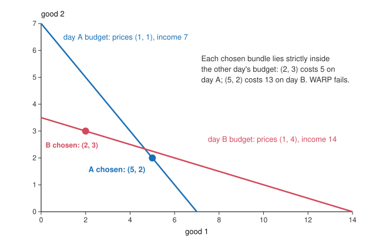

# Philosophy of Economics · Lesson 2.1: Preference and revealed preference

> ⏱ ~15 min · Module 2: Rationality, choice and nudges · Builds on: [1.1 Welfarism and preference satisfaction](01-01-welfarism-and-preference-satisfaction.md), [1.2 Money and happiness as measures](01-02-money-and-happiness-as-measures.md), [`grad-micro` 2.6](../../grad-micro/lessons/02-06-revealed-preference.md) · Unlocks: [2.2 The behavioural challenge](02-02-the-behavioural-challenge.md), [2.3 Nudges and behavioural welfare economics](02-03-nudges-and-behavioural-welfare-economics.md)

## Why this matters

Module 1 measured welfare by preference satisfaction and read preferences off what people pay. That inference needs a bridge: from *she chose x* to *she prefers x* to *x is good for her*. Revealed preference theory is the economist's bridge, and it can be read two ways. On one reading, preference just *is* a pattern of choice, so the first step is a definition and costs nothing. On the other, preference is a state of mind that choice is evidence for, so the step is an inference that can fail. This lesson asks which reading economics needs, and what Amartya Sen's critique does to each.

## The idea

A dinner guest is offered a fruit bowl holding one apple. She takes nothing. Later a bowl holding two apples comes round, and she takes one. Sen used a case like this ("Internal Consistency of Choice", *Econometrica*, 1993): politeness forbids taking the *last* apple, not taking an apple.

Read her choices as a behaviourist would, and she looks inconsistent. From {nothing, apple} she picked nothing, so nothing beats an apple. From {nothing, apple, apple} she picked an apple, so an apple beats nothing. No single ranking produces both.

Read them as anyone at the table would, and she is perfectly consistent. She wants an apple, cares about manners, and believes taking the last one is rude. Her choices follow from what she wants and believes; it is the *menu* that changed what taking an apple means.

The two readings agree on every observation. They disagree about what a preference is. That is a conceptual question, and the welfare inference of Module 1 rides on the answer.

## The argument

**The formal tool, reloaded.** Observe prices $p^t$ and chosen bundles $x^t$; $x^t$ is *directly revealed preferred* to $x^s$ when $p^t\cdot x^s\le p^t\cdot x^t$, so $x^s$ was affordable and passed over. The Weak Axiom (WARP) forbids two bundles each revealed preferred to the other; GARP forbids cycles; and Afriat's theorem says finite data satisfy GARP exactly when some well-behaved utility function rationalizes them ([`grad-micro` 2.6](../../grad-micro/lessons/02-06-revealed-preference.md), [WARP and GARP](../reference.md#warp-and-garp)).

For choices from menus, write $C(S)\subseteq S$ for what is chosen from menu $S$. **Property alpha** (contraction consistency): if $x\in C(S)$ and $x\in T\subseteq S$, then $x\in C(T)$. *In words:* something chosen from a big menu is still chosen when the menu shrinks around it ([property alpha](../reference.md#property-alpha)). Choices rationalizable by a single ordering must satisfy it.

**Position 1: revealed preference as behaviourism.** Paul Samuelson's 1938 *Economica* note set out to rebuild demand theory from observed choices alone, dropping utility and introspection. Its strongest modern defenders, Faruk Gul and Wolfgang Pesendorfer ("The Case for Mindless Economics", 2008), argue that economics models choices, not minds, so evidence about mental states can neither confirm nor refute it ([revealed preference theory](../reference.md#revealed-preference-theory)).

- **P1.** Economics should use only concepts it can define in observable terms.
- **P2.** A mental state can be observed only through the choices it produces.
- **P3.** "x is preferred to y" can be defined as "x is chosen when y is available".
- **∴ C1.** Preference is a choice pattern, and consistency conditions on choice (WARP, GARP, alpha) are the whole content of rationality.

*In words:* there is nothing behind the choices to get right or wrong.

**Position 2: preference as a mental state.** Daniel Hausman (*Preference, Value, Choice, and Welfare*, 2012) holds that a preference is a *total comparative evaluation*: a ranking of options that weighs everything the agent cares about, self-interest, morals and manners included ([total comparative evaluation](../reference.md#preference-as-total-comparative-evaluation)).

- **P4.** Choice is caused by preferences *together with beliefs*: what you think the options are and what they will bring.
- **P5.** So from choices alone you can recover preferences only by fixing beliefs, and you can recover beliefs only by fixing preferences.
- **∴ C2.** Choice is evidence of preference, not its definition, and economists already rely on assumptions about beliefs whenever they "reveal" anything.

*In words:* every revealed-preference inference carries a hidden premise about what the chooser believed.

**Sen's critique.** Two arguments, aimed at the bridge from choice to welfare.

1. *Consistency is not internal.* Whether a set of choices is consistent cannot be settled by the choices alone; it depends on the chooser's objectives and norms. The guest violates alpha and is perfectly coherent ([menu dependence](../reference.md#menu-dependence)).
2. *Commitment* ("Rational Fools", *Philosophy and Public Affairs*, 1977). **Sympathy** is concern for others that affects your own welfare: their suffering pains you, so helping them makes you better off. **Commitment** is choosing an act you believe will leave you worse off than an available alternative, from duty or principle ([commitment and sympathy](../reference.md#commitment-and-sympathy)). Sympathy keeps choice tracking the chooser's welfare. Commitment drives a wedge between them, so an economics that equates preference, choice and welfare under one word cannot describe it: Sen's "rational fool".

**The value judgment in the technique.** A revealed-preference test is innocent as a test. The judgment enters when its relation is relabelled "better for her" and fed into welfare economics: that step assumes no commitment, no menu-borne norms, and correct beliefs.

**Where the argument is weakest.** For the behaviourist, P3. Defining preference by choice makes "she chose against her preference" a contradiction, yet commitment, weakness of will and mistakes about the options all seem to be just that. And to rescue the guest, a behaviourist must redescribe the options as "take the last apple" and "take one of two", which uses exactly the norms and beliefs the program meant to leave out. For Hausman, the critic attacks his reply to Sen: if commitment is folded into total evaluations, preference satisfaction stops being well-being, and the welfarism of [1.1](01-01-welfarism-and-preference-satisfaction.md) loses its standard link. Hausman accepts this ("Sympathy, Commitment, and Preference", *Economics and Philosophy*, 2005): he and Sen agree that choice and welfare come apart, and differ over where to put the gap.

## The case

Example 1's data (illustrative). Each day the consumer passed over a bundle that she chose on the other day, when she could have afforded it.

## Worked examples

**Example 1 (clean): a WARP test.** Day A: prices $(1,1)$, bundle $(5,2)$, spending $5+2=7$. Day B: prices $(1,4)$, bundle $(2,3)$, spending $2+12=14$.

- Day B's bundle at day A's prices: $1(2)+1(3)=5<7$. Affordable and passed over, so $(5,2)$ is revealed preferred to $(2,3)$.
- Day A's bundle at day B's prices: $1(5)+4(2)=13<14$. Affordable and passed over, so $(2,3)$ is revealed preferred to $(5,2)$.

Both strictly: WARP and GARP fail, and by Afriat no utility function rationalizes these two choices. What follows depends on the position. For the behaviourist, this consumer has no preference ordering over these bundles; the theory's content is exhausted. For Hausman, the test has refuted a *joint* hypothesis: stable preferences, plus beliefs that the bundles were the same goods on both days. Which conjunct failed is a further empirical question. The test is the same; what it refutes is not.

**Example 2 (hard): the last apple.** Let $n$ be taking nothing and $a_1,a_2$ two apples. Observed: $C(\{n,a_1\})=\{n\}$ and $C(\{n,a_1,a_2\})=\{a_1\}$. Take $S=\{n,a_1,a_2\}$ and $T=\{n,a_1\}$: $a_1\in C(S)$, $a_1\in T\subseteq S$, but $a_1\notin C(T)$. Property alpha fails. Any ordering would need $n$ strictly above $a_1$ (from $T$) and $a_1$ at least as good as $n$ (from $S$): impossible.

Now the strain. Redescribe the options as "take the last apple" and "take one apple of two", and the violation disappears, since the guest never faced the same option twice. This rescue is always available, and that is the trouble: if any violation can be redescribed away, consistency conditions forbid nothing, and the theory has no empirical content. To redescribe in a *principled* way you need to know which features of the menu the chooser cares about, which is Sen's point and Hausman's: the bridge from choice to preference is built from beliefs and norms you cannot read off the choices.

## Watch out

- **You might think a WARP violation proves irrationality.** It proves only that no single stable ordering over the bundles *as described* fits the data. Whether the chooser is irrational is a further claim, needing the external standard Sen insists on.
- **You might think "revealed preferred" is an empirical finding about her mind.** It is a defined relation on choice data. Reading it as a fact about her evaluation is Hausman's evidential inference. Reading it as a fact about her *welfare* is a further, normative step. Three kinds of claim, one word.
- **You might think sympathy is the opposite of self-interest.** On Sen's definition, sympathetic action raises the chooser's own welfare, which is why it leaves the choice-to-welfare inference intact. Commitment is the case that breaks it.

## One-liner

> A choice is evidence of a preference only through the chooser's beliefs and norms, and evidence of her welfare only if she is not acting from commitment; revealed preference theory tests consistency, but the step from consistent choice to welfare is a value judgment the test cannot supply.

## Problems

**P1 (🟢) *(Formal (a) · Exegetical (b).)*** Three observations, two goods: day 1, prices $(2,1)$, bundle $x^1=(3,4)$; day 2, prices $(1,2)$, bundle $x^2=(2,5)$; day 3, prices $(1,1)$, bundle $x^3=(5,1)$.

(a) Compute each day's spending and every cross-cost. List every direct revealed-preference relation, name the pair that violates WARP, and say whether GARP also fails.
(b) The data show $x^2$ directly revealed preferred to $x^3$. In one sentence each, say what that statement means to a Samuelsonian behaviourist and to Hausman.

**P2 (🟡) *(Exegetical.)*** Classify each invented case as **sympathy**, **commitment** or **neither** in Sen's sense, giving the deciding reason in one sentence. Then say in which cases the choice remains evidence of the chooser's own welfare.

(a) Lena gives 50 dollars a month to a refugee charity because news from the camps keeps her awake at night, and giving lets her sleep.
(b) Omar, a ticket inspector on a flat wage, reports a fare-dodging friend. He expects to feel worse about it all week, nothing in his pay or prospects depends on it, and he does it because he gave his word to do the job honestly.
(c) Tess donates to her old university only because the published donor list brings clients to her consulting firm.

**P3 (🔴, optional) *(Formal (a) · Exegetical (b).)*** An invented case. At a restaurant whose list offers a house red at 10 dollars a glass and a mid-range red at 20, a diner orders the house red. On another night the list adds a reserve red at 60; she orders the mid-range red. Nothing else differs.

(a) Write her choices as a choice function, show that they violate property alpha, and show that no ordering of the three wines rationalizes both.
(b) A behaviourist economist says she has no stable preference over these wines. A Hausmanian says her preferences may be stable and the 60-dollar wine changed her beliefs. Name the crux between them, and say what evidence or argument would move each. 100 words or fewer.

Solutions

**P1** *(Formal (a) — strict · Exegetical (b) — strict.)*

(a) Spending: day 1, $2(3)+1(4)=10$; day 2, $1(2)+2(5)=12$; day 3, $1(5)+1(1)=6$. Cross-costs:

| at prices of | $x^1$ | $x^2$ | $x^3$ | spending |
|---|---|---|---|---|
| day 1, $(2,1)$ | 10 | **9** | 11 | 10 |
| day 2, $(1,2)$ | **11** | 12 | **7** | 12 |
| day 3, $(1,1)$ | 7 | 7 | 6 | 6 |

Bold entries are affordable bundles passed over. Direct relations: $x^1$ over $x^2$ ($9<10$), $x^2$ over $x^1$ ($11<12$), $x^2$ over $x^3$ ($7<12$). On day 3 neither other bundle was affordable ($7>6$), so day 3 reveals nothing.

**Must hit, strict (a):**

- The pair $x^1,x^2$ violates WARP: each was chosen while the other was strictly affordable.
- Both relations are strict, so GARP fails too and, by Afriat, no utility function rationalizes the data.
- The pairs $(x^2,x^3)$ and $(x^1,x^3)$ involve no violation: one direction only, and none at all directly between $x^1$ and $x^3$.

**Must hit, strict (b):**

- Behaviourist: it means only that $x^2$ was chosen on a day when $x^3$ was affordable; the relation is *defined* by that choice and says nothing about her mind.
- Hausman: it is defeasible evidence that she ranks $x^2$ above $x^3$ all things considered, given assumptions about her beliefs (that she knew $x^3$ was available and what it was) and that her evaluation did not change.

**Wrong turns:** treating day 3 as revealing something because $x^3$ is cheap: revelation needs the *other* bundle affordable on the day of choice. Saying the violation shows irrationality: that is a further claim on either view. For (b), giving Hausman a welfare claim: his inference reaches her evaluation, and evaluation can include commitments that are not good for her.

**Model answer:** (a) as above: $x^1$ and $x^2$ each revealed strictly preferred to the other, so WARP and GARP fail; $x^2$ is also revealed preferred to $x^3$. (b) For the behaviourist the statement just records a choice from a set that contained $x^3$. For Hausman it is evidence, resting on assumptions about her beliefs, that her overall evaluation ranks $x^2$ above $x^3$.

---

**P2** *(Exegetical — strict.)*

**Must hit, strict:**

- (a) **Sympathy.** The refugees' plight affects Lena's own welfare (she cannot sleep), and giving makes her better off, so she gives because helping helps her.
- (b) **Commitment.** Omar chooses an act he believes leaves him worse off than an available alternative (staying quiet), from a principle (his word), not from any gain to himself.
- (c) **Neither.** Tess acts from plain self-interest; no concern for others enters, so her gift is a purchase of advertising.
- Choice remains evidence of the chooser's own welfare in (a) and (c). In (b) it does not: Omar's choice reveals what he judged he should do, not what is good for him.

**Wrong turns:** calling (a) commitment because the act benefits others: Sen classifies by whether the act raises the chooser's welfare, and Lena's does. Calling (c) sympathy because it is a donation: the label follows the motive, not the act. Saying that on Hausman's view Omar acts against his preference: Hausman counts the committed choice as satisfying his total evaluation, which is why, for Hausman, preference satisfaction is not well-being.

**Model answer:** as above, one sentence each, with (a) and (c) as the cases where the choice still tracks the chooser's welfare.

---

**P3** *(Formal (a) — strict · Exegetical (b) — strict.)*

(a) Label the wines by price. $C(\{10,20\})=\{10\}$ and $C(\{10,20,60\})=\{20\}$. Take $S=\{10,20,60\}$, $T=\{10,20\}$: $20\in C(S)$ and $20\in T\subseteq S$, but $20\notin C(T)$, so alpha fails. An ordering would need the 10-dollar wine strictly above the 20 (only 10 chosen from $T$) and the 20 strictly above the 10 (only 20 chosen from $S$): a contradiction.

**Must hit, strict (a):**

- The choice function stated and the alpha violation shown with $S$ and $T$ named.
- The two strict rankings that no single ordering can contain.

**Must hit, strict (b):**

- The crux is the premise about what a preference is: a pattern of choice (so choice data fix it, and these data show none) or a mental state that produces choice together with beliefs (so the same data are compatible with stable preferences and a change of belief).
- What moves the Hausmanian: hold beliefs fixed, for instance give her each wine's quality rating on both nights. If the switch persists, the belief reading fails, and he must posit a menu-dependent evaluation or a mistake.
- What moves the behaviourist: the redescription argument. To save consistency he must redefine the options by menu ("the cheaper of two wines"), which needs facts about her beliefs or norms, the very states his definition excludes.

**Wrong turns:** naming "whether she is rational" as the crux: both can agree on that once the definition is fixed. Proposing to ask her as decisive evidence against the behaviourist: he rejects self-reports as data, so it moves only someone who already accepts mental states.

**Model answer:** (a) as above. (b) They disagree over whether a preference is a choice pattern or a mental state that combines with beliefs to produce choice. Give her quality ratings on both nights: if her switch persists, the belief story fails and the Hausmanian must call her evaluation menu-dependent or mistaken. Press the behaviourist to restore consistency: he can do so only by describing options as "the middle wine on this list", which brings in her beliefs about lists, so his definition leans on mental states after all.

## Flashback

**From Lesson [1.2](01-02-money-and-happiness-as-measures.md) (Money and happiness as measures):** *(Formal (a)–(b) · Exegetical (c).)* An invented case, illustrative numbers. A dental clinic runs a procedure in two versions. In version A a patient rates her discomfort minute by minute (0–10, higher is worse) as 2, 5, 9, 6. Version B is A followed by three more minutes rated 4, 3, 2. Take experienced utility as total discomfort, and remembered utility as the stylized peak-end score: the average of the worst minute and the last.

(a) Compute each version's total and peak-end score, and say which version each measure favours.
(b) The clinic could instead add a tail of $m$ minutes, each rated $r$, with $0<r\le 9$. For which $r$ is the lengthened version remembered as better than A, and does $m$ matter? What happens to total discomfort as $m$ grows?
(c) An invented board memo: "Patients who have had both versions overwhelmingly rate B as better and ask for it next time. Revealed preference shows what people want, so B raises their welfare, and adopting it simply respects their choices." Which of Kahneman's three utilities does each piece of the memo's evidence read, and what premise turns that evidence into "B raises their welfare"? Two sentences.

Solution

(a) A: total $2+5+9+6=22$; peak-end $(9+6)/2=7.5$. B: total $22+4+3+2=31$; peak-end $(9+2)/2=5.5$. Experienced utility favours **A** (9 fewer units of discomfort); remembered utility favours **B**.

(b) With $r\le 9$ the peak stays at 9 and the last minute is $r$, so the remembered score is $(9+r)/2$, which beats A's 7.5 exactly when $r<6$: any tail milder than A's final minute. The length $m$ does not enter at all (duration neglect). Total discomfort is $22+mr$, which rises with every added minute, so for any $r$ in $(0,6)$ and any $m\ge 1$ the lengthened version is remembered as better and experienced as worse.

**Must hit, strict (c):**

- "Rate B as better" afterwards reads **remembered** utility; "ask for it next time" reads **decision** utility. Neither reads **experienced** utility, which is what the totals in (a) measure.
- The premise is a theory of well-being: that a person's welfare is what her choices and retrospective verdicts favour (the preference-satisfaction view), not the flow of experience (hedonism). "Revealed preference shows what people want" is a claim about choice; "raises their welfare" is a normative-conceptual claim that a hedonist denies, since B adds discomfort.

**Wrong turns:** taking B's last minute as its first tail minute, giving $(9+4)/2$. Answering (b) with a bound that depends on $m$. Diagnosing the memo as an interpersonal-comparison problem: one patient, two episodes, no dollars summed across people. Treating (c) as asking whether the memo's verdict is wrong; a defender of choice can hold that how an episode ends is part of what the patient cares about, and the rubric grades naming the premise, not rejecting it.

**Model answer:** (a) A totals 22 with peak-end 7.5; B totals 31 with peak-end 5.5; experience favours A, memory favours B. (b) B is remembered as better for any tail rated below 6, however long, while each minute adds $r$ to the total. (c) The ratings read remembered utility and the requests read decision utility, while the minute-by-minute totals are experienced utility. The memo gets from those to "raises their welfare" only by assuming the preference-satisfaction view of well-being, which is exactly what a hedonist, pointing to the 9 extra units of discomfort, rejects.

## Connections

- **Backward:** [1.1](01-01-welfarism-and-preference-satisfaction.md) treated preferences as the measure of welfare; this lesson asks what makes a choice evidence of one ([preferences as evidence](../reference.md#preferences-as-evidence)). [1.2](01-02-money-and-happiness-as-measures.md) read willingness to pay off choices, which inherits every gap named here. The axioms and Afriat's theorem are [`grad-micro` 2.1](../../grad-micro/lessons/02-01-preferences-utility-representation.md) and [2.6](../../grad-micro/lessons/02-06-revealed-preference.md); the theories of well-being that welfare is measured against are [`ethics` 1.2](../../ethics/lessons/01-02-what-is-good-for-a-person.md).
- **Forward:** [2.2](02-02-the-behavioural-challenge.md) turns from commitment and menus to framing and present bias, where choices conflict with each other rather than with welfare. [2.3](02-03-nudges-and-behavioural-welfare-economics.md) gives Bernheim and Rangel's choice-based welfare economics, a descendant of Samuelson's program that keeps choice as the data and drops the claim that choices must be consistent.
- **Sideways:** [`decision-theory`](../../decision-theory/syllabus.md) 1.4 runs the same dispute for utility under risk: realism (utility as a mental quantity) against constructivism (utility as a summary of choices). The method of P3(b) is [`philosophical-method` 4.3](../../philosophical-method/lessons/04-03-finding-the-crux.md). Menu-dependent regret is a decision rule that violates alpha by design ([`decision-theory`](../../decision-theory/syllabus.md) 3.3).
