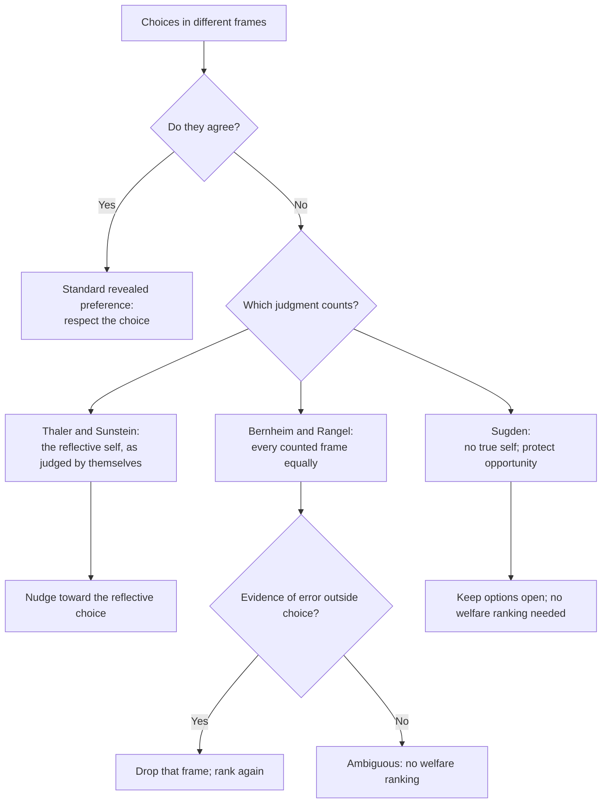

# Philosophy of Economics · Lesson 2.3: Nudges and behavioural welfare economics

> ⏱ ~15 min · Module 2: Rationality, choice and nudges · Builds on: [2.1 Preference and revealed preference](02-01-preference-and-revealed-preference.md), [2.2 The behavioural challenge](02-02-the-behavioural-challenge.md) · Unlocks: [3.1 The Pareto principle](03-01-the-pareto-principle.md)

## Why this matters

[2.2](02-02-the-behavioural-challenge.md) left the welfare economist holding two incompatible choices from one person: the plan made at date 0 and the grab made at date 1, or the choice under the gain frame and the choice under the loss frame. Revealed preference ([2.1](02-01-preference-and-revealed-preference.md)) said: respect what she chooses. Now she chooses two things. Any policy that sets a default, orders a menu or picks a frame has to side with one of them, or find a way not to. This lesson states three answers: Thaler and Sunstein's libertarian paternalism, Bernheim and Rangel's choice-based welfare, and the critics who say the first manipulates and both presuppose a self that may not exist.

## The idea

Thaler and Sunstein open *Nudge* (2008) with a cafeteria. Put the fruit at eye level and more fruit is eaten; put the cake there and more cake is eaten. Nobody's options changed, only their arrangement. Someone must arrange the food somehow, so there is no neutral layout to retreat to. Whoever designs the menu, the form or the default is a **choice architect** whether they like it or not ([choice architecture](../reference.md#choice-architecture)).

Their proposal: since the arrangement will influence choice anyway, arrange it to make choosers better off "as judged by themselves" (their phrase), while leaving every option available at trivial cost. That is **libertarian paternalism**: paternalist in aim, libertarian in means ([libertarian paternalism](../reference.md#libertarian-paternalism)). It first appeared as "Libertarian Paternalism" (*American Economic Review* Papers and Proceedings, 2003) and in Sunstein and Thaler's longer "Libertarian Paternalism Is Not an Oxymoron" (*University of Chicago Law Review*, 2003).

The phrase "as judged by themselves" carries the load. When the person's own choices conflict, which of them is the judgment?

## The argument

**Thaler and Sunstein's case**, reconstructed from the 2003 papers and *Nudge*.

1. **Inevitability.** Every choice is presented in some architecture: an order, a default, a frame. *In words:* there is no menu without a layout.
2. **Influence (empirical).** Architecture changes what people choose, through inertia, salience and framing ([2.2](02-02-the-behavioural-challenge.md)).
3. So some influence on choice is unavoidable; the only question is its direction.
4. **The standard.** Where influence is unavoidable, it should push toward what choosers would select by their own considered lights: informed, attentive, not tempted ([as judged by themselves](../reference.md#as-judged-by-themselves)).
5. **Liberty.** If every option stays available and opting out is nearly costless, the intervention coerces no one.

∴ **C.** Planners may, and often should, design choice architecture to steer people toward their own considered ends, without restricting their choices.

P2 is empirical, P1 and the "no neutral layout" step are conceptual, P4 and P5 are normative. The argument's force comes from P3: if the neutral option does not exist, the anti-paternalist cannot demand it.

**The formal rival: choice-based welfare.** Bernheim and Rangel ("Beyond Revealed Preference", *Quarterly Journal of Economics*, 2009) refuse to pick a self ([choice-based welfare](../reference.md#choice-based-welfare)). A *generalized choice situation* is $G=(X,d)$: a menu $X$ and an **ancillary condition** $d$, any feature of the setting that might affect choice without changing the options (the default, the shelf height, the date of choosing). $C(G)\subseteq X$ is what is chosen. The **welfare-relevant domain** $\mathcal{G}$ is the set of situations whose choices the analyst agrees to count. Then

$$x\,P^*\,y \iff y\notin C(G)\ \text{ for every } G\in\mathcal{G} \text{ with } x,y\in X.$$

*In words:* $x$ is unambiguously better than $y$ if $y$ is never chosen when $x$ is available, in any counted frame. An option $x$ is a **welfare optimum** if nothing is unambiguously better. Where frames disagree, $P^*$ is silent: it is incomplete, and it ranks only what every frame agrees on. It returns standard revealed preference whenever choices are consistent.

The analyst may shrink $\mathcal{G}$, dropping frames where the chooser demonstrably erred (she never saw the option, misread the price). But the evidence for an error must come from outside choice: what she attended to, believed or knew.

**Find the value judgment.** Bernheim-Rangel smuggles in that *every counted frame has equal standing*: no self outranks another, so conflict yields silence. Thaler-Sunstein smuggle in that *one judgment, the reflective one, is the person's own*. Swap the first premise for the second and the ranking becomes complete wherever the planner can say what the reflective self wants.

**The objections.** Daniel Hausman and Brynn Welch ("To Nudge or Not to Nudge", *Journal of Political Philosophy*, 2010) grant that nudges need not coerce, but argue that nudges which work by exploiting flaws in deliberation (inertia, salience) rather than by giving reasons bypass the person's rational agency, so they threaten autonomy even when opting out is free ([manipulation objection](../reference.md#manipulation-objection)). Cheap exit protects liberty of choice, not control over one's own choosing. The reply from P1: if some architecture must shape choice, the nudger only chooses *which* shaping, and a deliberately good one is no worse than an accidental bad one; and a nudge can satisfy a publicity test, staying effective even when disclosed. Robert Sugden presses a deeper objection (with Infante and Lecouteux, "Preference purification and the inner rational agent", *Journal of Economic Methodology*, 2016): "as judged by themselves" posits an inner rational agent with coherent preferences trapped inside a psychological shell, and there is no evidence that such an agent exists. Without one, there is nothing to be "true" to. His alternative values people's opportunity to choose, not the satisfaction of preferences they lack (*The Community of Advantage*, 2018).

Libertarian paternalism is not soft paternalism in Feinberg's sense: soft paternalism interferes only to check that a choice is voluntary and informed, while nudges steer choices that are already both. That axis is cited to [`political-philosophy`](../../political-philosophy/syllabus.md) 3.3.

**Where the argument is weakest.** Premise 4. A critic says that when the date-0 self and the date-1 self disagree, naming one of them "the person's own judgment" is the planner's verdict, not the chooser's: the paternalism has moved from the means into the standard. The defender replies that people themselves endorse their reflective judgments when asked, which is evidence from outside any single choice. Bernheim and Rangel accept the critic's point and pay for it with silence.

## Whose preference counts

The three branches part at the second diamond, which is a normative question, not an empirical one.

## Worked examples

**Example 1 (clean): the cafeteria.** Illustrative choices of one diner between fruit ($F$) and cake ($K$), menu $\{F,K\}$ each time:

| Situation | Ancillary condition | Chosen |
|---|---|---|
| $G_1$ | cake at eye level | $K$ |
| $G_2$ | fruit at eye level | $F$ |
| $G_3$ | side by side, equal height | $F$ |

Is $F\,P^*\,K$? No: $K$ was chosen in $G_1$ with $F$ available. Is $K\,P^*\,F$? No: $F$ was chosen in $G_2$ and $G_3$. So $P^*$ is empty and both are welfare optima. Choice data alone cannot say that moving the fruit up helps her.

Now suppose an eye-tracker shows she never looked below eye level in $G_1$: she did not consider the fruit. That is evidence from outside choice of an error, so drop $G_1$. On $\{G_2,G_3\}$, $K$ is never chosen when $F$ is available, so $F\,P^*\,K$ and $F$ is the unique optimum. Thaler and Sunstein reach the same verdict faster by reading $G_3$ as her reflective choice. Same answer, different premise: one needed evidence of a mistake, the other a theory of which self is real.

**Example 2 (hard): the organ-donor default.** An opt-out system presumes consent to posthumous donation unless a person registers refusal. Studies comparing countries report large gaps in consent between opt-in and opt-out regimes (Johnson and Goldstein, "Do Defaults Save Lives?", *Science*, 2003). The case strains every branch of the figure. The beneficiaries are strangers, so "as judged by themselves" is not the justification on offer: this is a nudge for others' benefit, not paternalism at all. Bernheim and Rangel find the opt-in and opt-out frames in conflict, and dropping one needs evidence that people who never registered erred. But not deciding may itself be a considered stance about one's body. And the default works through inertia, the mechanism Hausman and Welch object to, applied to a decision many hold to require explicit consent. Defenders answer that the opt-in default is also an architecture, also works through inertia, and costs lives. P1 again: the choice is between defaults, never between a default and none.

## Watch out

- **You might think evidence that nudges work shows they are justified.** "The default raises take-up" is empirical; "the higher take-up is better for those people" is normative and needs P4. A default can work well and still point the wrong way.
- **You might think "libertarian" means the nudge cannot wrong anyone.** P5 secures that no option is removed. The manipulation objection grants this and attacks a different value: control over how one's choices are formed.
- **You might think Bernheim-Rangel is value-free because it uses only choices.** Its equal-standing premise is a value judgment, and trimming the domain imports a theory of mistakes. It is more cautious, not more neutral.

## One-liner

> When a person's choices conflict, a nudge must say which one is really hers; libertarian paternalism names the reflective self, Bernheim and Rangel count every frame and fall silent where they disagree, and the critics say naming a "true" self is where the planner's judgment slips in.

## Problems

**P1 (🟢) *(Formal (a)-(b) · Exegetical (c).)*** One person chooses an insurance deductible: low ($L$), medium ($M$) or high ($H$). Illustrative data:

| Situation | Menu | Ancillary condition | Chosen |
|---|---|---|---|
| $G_1$ | $\{L,M,H\}$ | default $L$ | $L$ |
| $G_2$ | $\{L,M,H\}$ | default $H$ | $M$ |
| $G_3$ | $\{L,M,H\}$ | active choice, no default | $M$ |
| $G_4$ | $\{L,H\}$ | default $H$ | $H$ |

(a) Find every pair ranked by $P^*$ and the welfare optima. (b) Logs show that in $G_1$ she submitted the form without opening the deductible page. Drop $G_1$ and redo (a). (c) In one sentence, say what judgment the analyst made in (b) that choice data could not supply.

**P2 (🟡) *(Exegetical.)*** An **invented** memo from a fictional city energy office:

> "We will switch every household to the green tariff by default. Three in four residents told our survey they prefer clean energy, so the default simply gives people what they truly want. Opting out takes one click, so no one's freedom is affected."

(a) Name the standard the memo uses for "what they truly want" and the evidence it rests on, and say why Bernheim and Rangel would not accept that evidence as it stands. (b) Name a second premise of Thaler and Sunstein's argument the memo leans on, and the objection that premise faces. (c) Say why the justification may not need "what they truly want" at all. Two sentences per part.

**P3 (🔴, optional) *(Evaluative.)*** State the manipulation objection to the cafeteria nudge of Example 1 at full strength, then the best reply. Say whether the reply also covers a nudge that works only if the chooser does not notice it. 150 words or fewer. Any verdict.

Solutions

**P1** *(Formal (a)-(b) · Exegetical (c).)*

(a) Check each pair against every situation containing both.

- $L$ vs $M$: $L$ chosen in $G_1$ with $M$ available; $M$ chosen in $G_2,G_3$ with $L$ available. Ambiguous.
- $L$ vs $H$: $L$ chosen in $G_1$ with $H$ available; $H$ chosen in $G_4$ with $L$ available. Ambiguous.
- $M$ vs $H$: they share $G_1,G_2,G_3$, where the choices are $L,M,M$. $H$ is never chosen, so $M\,P^*\,H$. $M$ is chosen, so not $H\,P^*\,M$.

$P^*=\{(M,H)\}$. Optima: $L$ and $M$ (nothing beats either; $M$ beats $H$).

(b) On $\{G_2,G_3,G_4\}$: $L$ is never chosen, so $M\,P^*\,L$ (shared $G_2,G_3$, choices $M,M$) and $H\,P^*\,L$ (shared $G_2,G_3,G_4$, choices $M,M,H$). $M\,P^*\,H$ still holds ($G_2,G_3$). So $M\,P^*\,H\,P^*\,L$, and $M$ is the unique optimum.

**Must hit, strict (c):** that inattention in $G_1$ is a mistake whose choice does not count, a judgment about her mental state resting on non-choice evidence (the logs), not on what she chose.

**Wrong turns:** declaring $L$ beaten in (a) because it was chosen only under its own default; one counted choice is enough to block $P^*$. Using $G_4$ to rank $M$ against anything: $M$ is not on its menu.

**Model answer:** (a) $M\,P^*\,H$ only; optima $L$ and $M$. (b) $M\,P^*\,H\,P^*\,L$; optimum $M$. (c) The analyst judged that a choice made without looking at the options is an error, and that judgment comes from evidence about attention, not from any choice.

---

**P2** *(Exegetical, strict.)*

**Must hit, strict:**

- (a) The standard is "as judged by themselves", read off a **stated** preference from a survey. Bernheim and Rangel count choices, and conflicting choices across defaults make the ranking ambiguous; a survey answer is not a choice, and could count only as evidence that some frame is a mistake, which the memo does not show.
- (b) P5, liberty through cheap exit ("one click"). It faces the manipulation objection: the default works through inertia, so free exit protects the option, not the residents' control over how their choice is formed.
- (c) Clean energy benefits third parties, so the default may be justified, or not, as a nudge for others' sake rather than as paternalism. "As judged by themselves" is then the wrong standard to argue over.

**Wrong turns:** treating "three in four" as a revealed preference: it is stated, not chosen. Calling the memo coercive: it removes no option.

**Model answer:** as above, two sentences per part.

---

**P3** *(Evaluative, graded on moves, not verdict.)*

**Must hit, any verdict:**

- The objection at strength: the nudge works through a deliberative flaw (salience), not through reasons, so it bypasses rational agency; free exit does not answer this, because the wrong is in how the choice is formed, not in which options exist.
- The reply at strength: inevitability (some placement must shape choice, so the nudger only chooses which), and publicity (fruit at eye level works even when disclosed).
- Whether the reply generalizes: inevitability still applies to a covert nudge, but publicity fails, so a covert nudge loses half the reply.

**Wrong turns:** answering with liberty of choice ("she can still take cake"), which the objection grants. Treating effectiveness as a reply.

**Model answer, one of several:** The salience nudge moves the diner by exploiting where her eyes fall, not by giving her a reason, so it treats her deliberation as a mechanism to be set, and the open option of cake does nothing to restore her control over that. Reply: every cafeteria puts something at eye level, so the alternative to a deliberate nudge is an accidental one, not none; and this one survives disclosure, since a diner told why the fruit is there can still endorse it or reach past it. The reply weakens for a nudge that works only unnoticed: inevitability still holds, but the publicity half fails, and a nudge that must be hidden is one she could not consent to if she saw it. So the objection survives for covert nudges even if the reply defeats it here.

## Flashback

**From Lesson [2.1](02-01-preference-and-revealed-preference.md) (Preference and revealed preference):** *(Formal (a) · Evaluative (b).)* An invented case. A city councillor votes over a year on where to site a new homeless shelter: $x$ is a vacant lot on her own street, $y$ a lot across town, $z$ no shelter. The agenda offers different menus, and her recorded votes are $C(\{x,y\})=\{x\}$, $C(\{x,z\})=\{x\}$, $C(\{y,z\})=\{y\}$ and $C(\{x,y,z\})=\{x\}$.

(a) Check property alpha for every menu and its sub-menus, and give an ordering that rationalizes all four choices.
(b) Complete the case in two or three sentences so that her votes stay exactly as recorded, yet voting $x$ is not evidence that $x$ is best for her, and name the idea from 2.1 your completion uses. Then say in one sentence where in the inference from choice to welfare the error enters.

Solution

(a) Only $S=\{x,y,z\}$ has two-element sub-menus that matter: $x\in C(S)$, and $x$ is chosen from both $\{x,y\}$ and $\{x,z\}$, so alpha holds. The two-element menus have only singleton sub-menus, where alpha holds trivially. The ordering $x\succ y\succ z$ picks the chosen option from every menu, and it is the only strict ordering that does.

**Accept (b):** any completion that keeps all four votes and in which she chooses $x$ while believing it leaves her worse off than an available alternative, from principle, duty or a promise (commitment), or chooses it on a false belief about what $x$ will bring.

**Must hit, any verdict (b):**

- The completion names **commitment** in Sen's sense (or a false belief, the condition 2.1 says the welfare step also assumes) and keeps the recorded choices intact.
- The error enters not at the consistency test, which she passes, but at the step that relabels "revealed preferred" as "better for her".

**Wrong turns:** a sympathy story ("helping the homeless makes her feel good"): sympathetic action raises her own welfare, so the choice still tracks it. A story that changes a recorded vote, or one about menu-borne norms that would show up as an alpha violation these data do not contain. Concluding that a consistent record certifies the welfare reading: consistency is necessary for an ordering, not sufficient for the ordering to be her good.

**Model answer, one of several:** She campaigned on a pledge to put services where the need is greatest, which is her own street; she expects the shelter next door to cost her sleep and some of her house's value, and thinks she would be better off with $y$, but votes $x$ whenever it is on the agenda because she gave her word. That is Sen's commitment: an act chosen though the chooser believes an available alternative is better for her. Her votes pass alpha and fit $x\succ y\succ z$, so the error enters only when that revealed ordering is read as her welfare ordering.

## Connections

- **Backward:** [2.1](02-01-preference-and-revealed-preference.md)'s revealed preference is the special case of $P^*$ when choices never conflict. [2.2](02-02-the-behavioural-challenge.md) supplied the conflicts: present bias and framing are why a single person yields two incompatible choice records.
- **Forward:** [3.1](03-01-the-pareto-principle.md) asks what the Pareto principle requires; with $P^*$ incomplete for one person, a Pareto ranking across persons inherits the gaps.
- **Sideways:** soft vs hard paternalism and Mill's harm principle are in [`political-philosophy`](../../political-philosophy/syllabus.md) 3.2-3.3. The publicity test echoes the possible-consent reading of Kant's humanity formula in [`ethics` 2.3](../../ethics/lessons/02-03-humanity-autonomy-and-the-lie.md). Revealed preference as a formal theory is [`grad-micro` 2.6](../../grad-micro/lessons/02-06-revealed-preference.md). Time inconsistency in a *government*, answered by a costly-to-revise rule rather than a nudge, is [`economics-of-debt` 8.1](../../economics-of-debt/lessons/08-01-forgiveness-commitment-and-the-fresh-start.md).
