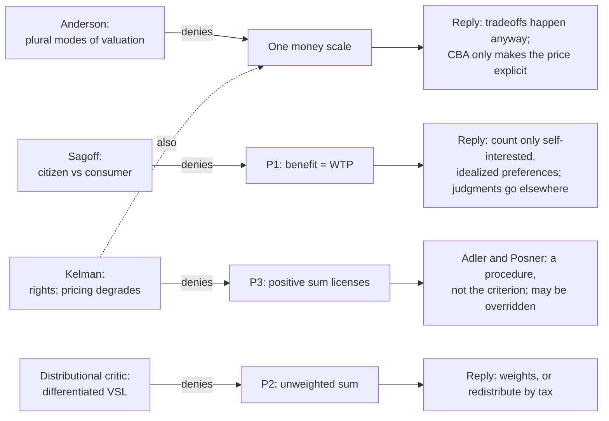

# Philosophy of Economics · Lesson 3.4: CBA's critics and defenders

> ⏱ ~15 min · Module 3: Efficiency and cost-benefit analysis · Builds on: [3.2 The limits of Pareto and the compensation tests](03-02-the-limits-of-pareto-and-the-compensation-tests.md), [3.3 Cost-benefit analysis and the value of a life](03-03-cost-benefit-analysis-and-the-value-of-a-life.md) · Unlocks: [4.1 Why discount?](04-01-why-discount.md), [5.1 Commodification](05-01-commodification.md)

## Why this matters

"You can't put a price on that" is the commonest objection to [cost-benefit analysis](../reference.md#cost-benefit-analysis), and also the vaguest. It hides at least four different objections, and each one attacks a different premise of the argument [3.3](03-03-cost-benefit-analysis-and-the-value-of-a-life.md) reconstructed. The defenders reply to each one differently, and their best reply changes what CBA claims to be. This lesson sorts the objections by the premise each attacks, then states the two strongest defences. The skill is diagnosis: given a complaint about CBA, say which premise it denies and what reply it invites.

## The idea

Recall 3.3's three premises. **P1:** a person's benefit is her willingness to pay (WTP). **P2:** social benefit is the unweighted sum. **P3:** a positive sum licenses the policy. There is also an assumption under all three: that every good at stake can be put on one money scale.

The critics divide along those lines:

- **Anderson** denies the hidden assumption. People value things in different *ways*, and money expresses only one of them.
- **Sagoff** denies P1 for a whole class of preferences. When a person supports protecting a wilderness, he is often stating a judgment as a citizen about what the community should do, not reporting what he wants as a consumer.
- **Kelman** denies P3. An act can be right when its costs exceed its benefits, and pricing some goods is itself a wrong.
- **The distributional critic** denies P2, which is 3.3's "weakest premise".

The defenders do not deny that these are real concerns. **Adler and Posner** concede that CBA is not the test of what is right and recast it as a *procedure* that tracks one moral factor well. **Sunstein** defends it as a check on the errors of unaided judgment about risk.

## The argument

**The four objections, each at strength.**

1. **[Incommensurability](../reference.md#incommensurability) and plural modes of valuation** (Elizabeth Anderson, *Value in Ethics and Economics*, 1993). To value something rationally is to take the attitude toward it that it merits. People *use* commodities, *respect* persons, *love* friends and *appreciate* a landscape. Each mode carries its own norms, and those norms determine what counts as a fitting trade. Market pricing expresses the use mode. A CBA that asks what a canyon is worth in money therefore treats the canyon as a thing to be used. Anderson's claim is not that the number is too low. Her claim is that a single money scale misdescribes how the canyon is valued. *Attacks:* the one-scale assumption under P1. (The thesis that goods have no common measure has an older form in natural law: see [`ethics` 4.5](../../ethics/lessons/04-05-the-new-natural-law-theory.md).)
2. **[Citizen and consumer preferences](../reference.md#citizen-and-consumer-preferences)** (Mark Sagoff, *The Economy of the Earth*, 1988). The same person who would happily ski at a new resort may vote against building it. That is not inconsistency. The first is a want about his own life; the second is a belief about what the nation owes its wild places. A belief is judged by reasons, not weighed by how much the believer would pay, so pricing it is a category mistake. *Attacks:* P1, for preferences that are judgments rather than wants.
3. **The ethical critique** (Steven Kelman, "Cost-Benefit Analysis: An Ethical Critique", *Regulation*, 1981). Kelman makes three claims. An act can be right even though its benefits do not exceed its costs, as when it secures a right. Putting a money value on non-market goods such as health or life can reduce the value people place on them. And because the benefits-exceed-costs test should so often not decide, spending heavily on cost-benefit studies is not justified. The first claim is deontological, in the sense of [`ethics` 2.4](../../ethics/lessons/02-04-constraints-and-options.md). *Attacks:* P3, and through the pricing point the one-scale assumption.
4. **Distribution.** WTP is bounded by wealth, so the sum counts the rich more ([3.3](03-03-cost-benefit-analysis-and-the-value-of-a-life.md)'s bypass). Its sharpest current form is the **[differentiated VSL](../reference.md#differentiated-vsl)**: if the VSL is WTP for risk reduction, then consistency requires a lower VSL for poorer people. *Attacks:* P2.

**The defence: [decision procedure, not criterion of rightness](../reference.md#decision-procedure-and-criterion-of-rightness)** (Matthew Adler and Eric Posner, *New Foundations of Cost-Benefit Analysis*, 2006). This is the distinction [`ethics` 1.5](../../ethics/lessons/01-05-modern-consequentialism.md) drew for consequentialism, between what makes an act right and the method an agent uses to choose.

- P1′. Overall well-being is morally relevant, though not necessarily decisive. (They call this *weak welfarism*.)
- P2′. Agencies must choose among many projects, with limited information and under pressure from interest groups.
- P3′. CBA, with its inputs corrected (idealized and self-interested preferences, adjustments where wealth distorts WTP), tracks changes in overall well-being better than the procedures agencies could use instead.

∴ C′. Agencies should use CBA as their standard decision procedure. Its verdict is evidence about one moral factor, and other factors may override it.

*In words:* CBA earns its place the way a checklist does. Nobody thinks the checklist *is* safety; the claim is that following it does better than going without one.

**Sunstein's supplement** (*Risk and Reason* and *The Cost-Benefit State*, both 2002). Unaided judgments about risk are distorted by availability (vivid recent harms loom large), by probability neglect, and by ignoring the risks a regulation itself creates. Writing the numbers down disciplines those intuitions. On this view CBA works as a [check on regulatory intuition](../reference.md#cba-as-a-check-on-intuition), and it need not be the final word. On the differentiated VSL, Sunstein ("Valuing Life: A Plea for Disaggregation", *Duke Law Journal*, 2004) argues that the VSL should vary with the population protected, including by income. He then adds the crucial qualification: when the beneficiaries pay little or none of the cost, the case for a lower VSL for the poor weakens, and distributional grounds may justify a higher one.

**Find the value judgment.** The defence moves the normative weight off CBA's arithmetic and onto P1′ and P3′. P1′ is a moral claim: well-being counts, along with whatever else counts. P3′ is an empirical claim about institutions: CBA does better than the alternatives. A critic can accept every number and still reject either premise.

**Where the argument is weakest.** P3′ and the word "override". If other moral factors may override CBA, someone must decide when they do, and that judgment is exactly the unaided intuition that Sunstein's argument says is unreliable. The critic (Kelman's heir) presses a dilemma. If agencies seldom override the procedure, then in practice it functions as the criterion, and the retreat from "criterion" is only verbal. If they often override it, the procedure no longer disciplines anything. Adler and Posner's answer is that a presumption with stated grounds for rebuttal is a coherent middle position, the same kind courts use. Whether it holds is partly an empirical question about how agencies behave.

## Map of positions

The left column says *which premise* each critic denies; the right column gives the welfarist reply aimed at that premise. A reply aimed at the wrong premise misses.

## Worked examples

**Example 1 (clean): the marsh op-ed.** An **invented** newspaper column, not the words of any real person:

> "The state's consultants say residents would pay 4 million dollars to keep the Harlow marsh, and the highway saves 6 million, so the marsh goes. But nobody here values the marsh the way they value a used car. We go there to stand still and look at herons. Asking what we'd pay for that is like asking what we'd pay for a friend. The question itself gets the marsh wrong."

*Diagnosis.* The column does not dispute the 4 million or the 6 million, so it is not a measurement complaint. It does not mention who gains or who loses, so it is not distributional. It does not say a promise or a right is violated, so it is not Kelman's deontic claim. "The way they value a used car" against "stand still and look" contrasts use with appreciation, and the friend analogy appeals to love. That is **Anderson's** objection: the single money scale misdescribes how the marsh is valued.

*The welfarist reply aimed at that premise:* the highway decision gets made either way, so a price is implicit in whatever is chosen. CBA only makes it explicit, and the residents' 4 million is their own valuation, not the consultants'. *Anderson's rejoinder:* a decision that weighs the marsh is not thereby a decision that *prices* it. Deliberation can weigh reasons without converting them into money.

*Turn it into Sagoff.* Change the column's last line to: "We voted for the wetland act because a decent state protects such places, whatever any of us would pay." Now the claim is that a judgment has been treated as a want, which is the citizen-consumer objection.

**Example 2 (hard): a differentiated VSL in an aid budget.** Illustrative numbers. A development agency has 30 million dollars for one of two projects:

- **U**, urban road safety in a country where income is 40,000 dollars a head, preventing 5 deaths;
- **R**, rural clean water in a country where income is 5,000 a head, preventing 12 deaths.

The reference VSL is 8 million at 40,000. A differentiated VSL scales with income: $\mathrm{VSL}_i=8\,(y_i/40{,}000)^{\varepsilon}$, where $y_i$ is income per head and $\varepsilon$ is the income elasticity of the VSL. Set $\varepsilon=1$ for illustration.

| | Uniform VSL ($\varepsilon=0$) | Differentiated ($\varepsilon=1$) |
|---|---|---|
| U: $5\times 8$ | 40, net +10 | 40, net +10 |
| R | $12\times 8=96$, net +66 | $12\times 1=12$, net −18 |
| Ranking | R first | U first; R fails |

The ranking flips where $12\times 8\times(1/8)^{\varepsilon}=40$, that is, $\varepsilon=\ln(12/5)/\ln 8\approx 0.42$. R stops passing at $\varepsilon=\ln(96/30)/\ln 8\approx 0.56$.

*Where it strains.* The differentiated VSL is what P1 implies: it is the rural residents' own WTP. The uniform VSL departs from P1. It multiplies the rural residents' WTP for risk reduction by $8=(40{,}000/5{,}000)^1$, which is a distributional weight with $\eta=1$ (3.3's notation) applied to mortality only. So "uniform VSL" is not neutral; it is weighting in disguise. Sunstein's qualification bears directly on the case. The rural residents pay nothing, since the donor pays. The P1 rationale for the lower VSL is that people should not be made to buy protection they would not buy, and that rationale has no force when the protection is a gift. An agency that uses $\varepsilon=1$ here steers aid away from the people who gain the most lives per dollar.

## Watch out

- **You might think "you can't put a price on it" is one objection, but actually it is at least four.** Ask which premise it denies: the single scale (Anderson), WTP as welfare (Sagoff), positive sum as licence (Kelman), or equal weights (distribution). Each invites a different reply.
- **You might think Sagoff's point is empirical (people answer surveys badly), but actually it is conceptual.** Even a perfectly accurate WTP for a citizen judgment would, on his view, measure the wrong kind of thing. Survey biases ([3.3](03-03-cost-benefit-analysis-and-the-value-of-a-life.md)'s scope problem) are a separate, empirical objection.
- **You might think Adler and Posner defend CBA as the truth about right action, but actually they give that up.** Their claim is normative only through P1′. The rest is a comparative claim about institutions, and it stands or falls on evidence.

## One-liner

> Each critic of CBA denies a different premise (Anderson the single money scale, Sagoff WTP for citizen judgments, Kelman that a positive sum licenses, the distributional critic equal weights); the best defence demotes CBA from criterion of rightness to a decision procedure that tracks well-being, and a "uniform" VSL turns out to be a distributional weight in disguise.

## Problems

**P1 (🟢) *(Exegetical.)*** A county hearing on whether to permit a quarry beside a nineteenth-century cemetery. **Invented** testimony, not the words of any real person:

> (i) "My survey answer was zero dollars; I'll never set foot there. I still voted for the preservation ordinance, because a county that respects its dead is a better county."
> (ii) "The deed of 1890 promised the families the ground would never be disturbed. A promise is not cancelled because the quarry's profits exceed the cost."
> (iii) "The profits go to shareholders out of state. The dust lands on the trailer park across the road."
> (iv) "Graves are honoured, not priced. Asking what they're worth in money already treats them as something they are not."

(a) For each statement, name the objection it makes and the premise of CBA it denies. One line each. (b) Give the welfarist reply to statement (iii) in two sentences.

**P2 (🟡) *(Exegetical (a) · Evaluative (b).)*** A critic writes: "Adler and Posner's retreat is empty. If CBA is not the criterion of right action, the agency has no reason to follow it whenever it disagrees with the agency's other values; and if the agency follows it anyway, CBA is the criterion in all but name." (a) State the distinction the critic targets, and say what would make a decision procedure justified even though it is not the criterion. Two sentences. (b) Give the critic's argument its strongest form, then the best reply. Any verdict passes. 150 words or fewer.

**P3 (🔴, optional) *(Formal (a) · Evaluative (b).)*** Illustrative numbers. A health agency can fund one of two clinics, each costing 12 million dollars. Clinic H serves a region where income is 60,000 dollars a head and prevents 3 deaths; clinic L serves a region where income is 12,000 a head and prevents 6 deaths. The reference VSL is 6 million at 60,000, and $\mathrm{VSL}_i=6\,(y_i/60{,}000)^{\varepsilon}$. (a) Compute each clinic's net benefit under a uniform VSL and under $\varepsilon=1$, give the ranking each time, and find the $\varepsilon$ at which the ranking flips. (b) The clinics are funded by a foreign donor; neither region pays. Say what premise an advocate of the differentiated VSL needs here, and whether it survives. 100 words or fewer.

Solutions

**P1** *(Exegetical (a)–(b) · strict)*

**Must hit, strict (a):**

- (i) Sagoff's citizen-consumer objection: the speaker's WTP as a consumer is zero, but his support is a citizen judgment about what the county should do. It denies P1 (WTP measures the benefit) for preferences that are judgments.
- (ii) Kelman's deontic objection: a right or promise can make an act wrong even when benefits exceed costs. It denies P3 (a positive sum licenses).
- (iii) The distributional objection: the gains go to the well-off and the losses fall on the poor, and the unweighted sum ignores this. It denies P2 (equal weights).
- (iv) Anderson's plural-modes objection (with Kelman's point that pricing degrades): honouring is a mode of valuation that money misdescribes. It denies the one-scale assumption.

**Must hit, strict (b):** either distributional weights on the trailer park's losses (3.3's $g_i$), or the Kaplow-Shavell reply that the quarry should be judged on unweighted CBA and the residents compensated through taxes or a direct payment. The reply must target P2, not the measurement of the dust.

**Wrong turns:** reading (iv) as Sagoff because it mentions what the county values; Sagoff needs a judgment about what the community should do, while (iv) is about the *kind* of valuation graves receive. Reading (ii) as distributional because the families are the losers; the claim is that a promise binds whatever the totals.

**Model answer (b):** Weight the trailer park's losses more heavily with distributional weights, or approve the quarry only if its owners actually compensate the residents. Either way the reply accepts that the dust is a real cost and fixes how it is counted, not whether it is counted.

---

**P2** *(Exegetical (a) — strict · Evaluative (b) — graded on moves, not verdict)*

**Must hit, strict (a):**

- A criterion of rightness says what makes a choice right; a decision procedure is a method for choosing. Adler and Posner hold that overall well-being is one morally relevant factor (weak welfarism) and that CBA is a procedure for tracking it.
- A procedure is justified, though not the criterion, if following it tends to produce better choices by the true criterion than the available alternatives do, given limited information, bias and interest-group pressure.

**Must hit, any verdict (b):**

- The critic's dilemma at full strength: deciding when to override CBA requires the unaided judgment the procedure exists to discipline, so either overrides are rare (CBA is the criterion in practice) or frequent (CBA disciplines nothing).
- A reply that engages the dilemma: a rebuttable presumption with stated, reviewable grounds for override is a stable middle position, as legal presumptions are. Or a concession that the dilemma bites, saying which horn.
- Say what would settle it: evidence about how often and on what grounds agencies depart from CBA, and whether those departures track the other moral factors or track lobbying.

**Wrong turns:** answering as if Adler and Posner claim CBA is the criterion. Treating "decision procedure" as a weaker claim that needs no defence; it needs the comparative empirical premise P3′.

**Model answer (b), one of several:** At its strongest the critic says this: CBA was meant to replace unreliable intuition, yet "may be overridden" hands the final word back to intuition. Rare overrides make CBA the criterion in practice; frequent ones leave it decorative. The reply is that the dilemma is false. A presumption that holds unless a stated reason (a right, a severe distributional effect) is given and defended publicly changes behaviour without ruling everything. The override has to be argued for, and the CBA shows how much well-being it costs. Whether agencies actually work this way is an empirical question, and if their overrides track lobbying rather than reasons, the critic wins on the facts.

---

**P3** *(Formal (a) — strict · Evaluative (b) — graded on moves, not verdict)*

(a) Uniform ($\varepsilon=0$): H gives $3\times 6=18$, net $18-12=+6$ million; L gives $6\times 6=36$, net $36-12=+24$ million. L ranks first and both pass.

$\varepsilon=1$: $\mathrm{VSL}_L=6\times(12{,}000/60{,}000)=1.2$ million, so L gives $6\times 1.2=7.2$, net $7.2-12=-4.8$ million. H is unchanged at $+6$. H ranks first and L fails.

The flip: $36\times(1/5)^{\varepsilon}=18$, so $5^{\varepsilon}=2$ and $\varepsilon=\ln 2/\ln 5\approx 0.43$.

**Must hit, strict (a):** +6 and +24 million (L first) uniform; +6 and −4.8 million (H first, L fails) at $\varepsilon=1$; flip at $\varepsilon\approx 0.43$.

**Must hit, any verdict (b):**

- The premise: the region's WTP is the right measure of its benefit even when it pays nothing, so the lower VSL reflects its own valuation, not the donor's.
- Whether it survives: Sunstein's rationale for differentiation is not forcing people to buy protection they would not buy. With a donor paying, that rationale lapses. The advocate needs a different premise, for example that the donor's money should go wherever it buys the most WTP-measured welfare, which runs into P2's equal weights.

**Wrong turns:** forgetting to scale the VSL for clinic H (it is at the reference income, so it stays 6). Thinking a uniform VSL is the "neutral" choice; it weights L's WTP by 5.

**Model answer (b), one of several:** The advocate needs P1: the region's own WTP for risk reduction measures its benefit, whoever pays. But the strongest case for differentiation is that the poor should not be made to pay for protection at more than they value it, and here they pay nothing. The donor could give cash instead, and the poorer region might prefer that. So the surviving argument is a Kaplow-Shavell argument about the cheapest transfer, not a respect-for-preferences argument. Whether it survives depends on whether cash is really on offer.

## Flashback

**From Lesson [3.2](03-02-the-limits-of-pareto-and-the-compensation-tests.md) (The limits of Pareto and the compensation tests):** *(Formal (a) · Exegetical (b).)* Two **invented** cases, each with unanimous consent.

- **(i) The patent.** Two co-inventors, Hal and Ines, dispute a patent worth 100,000 dollars. They can settle by splitting it equally, or go to trial, where the winner takes the whole patent and each pays 15,000 dollars in legal fees. Each puts their own chance of winning at 80%. Both are risk-neutral, and both choose trial.
- **(ii) The vaccine.** Every resident of a town accepts the health authority's estimates, which no one disputes: a vaccine cuts each person's overall yearly risk of serious illness, side effects included, from 1 in 1,000 to 1 in 5,000, though a few vaccinated people will suffer a side effect without ever having been exposed to the disease. Everyone chooses to be vaccinated.

(a) For case (i), compute each co-inventor's expected value of trial on their own beliefs. Then let $q$ be a single shared probability that Hal wins, and show that no $q$ makes both prefer trial to settling.
(b) For each case, say whether the ex ante Pareto principle endorses the choice and whether the Gilboa-Samet-Schmeidler restriction withdraws that endorsement. Then say which case is spurious unanimity and which only a divergence between ex ante and ex post Pareto, and what feature of the cases decides it. Four sentences or fewer.

Solution

(a) On their own beliefs each expects $0.8\times100{,}000-15{,}000=65{,}000$ dollars from trial against 50,000 from settling, so each prefers trial.

With a shared $q$: Hal prefers trial iff $100{,}000q-15{,}000>50{,}000$, that is $q>0.65$; Ines prefers trial iff $100{,}000(1-q)-15{,}000>50{,}000$, that is $q<0.35$. Both cannot hold. Equivalently, their expected trial values sum to $100{,}000-30{,}000=70{,}000$ for every $q$, against 100,000 from settling.

**Must hit, strict (a):** 65,000 against 50,000 for each; Hal needs $q>0.65$ and Ines $q<0.35$, so no shared $q$ works (the fees burn 30,000 whatever happens).

**Must hit, strict (b):**

- **(i)** Ex ante Pareto endorses trial, since each prefers it on their own beliefs. Gilboa, Samet and Schmeidler withdraw the endorsement: the unanimity rests on beliefs that cannot both be right (their chances sum to 160%), so the principle is silent.
- **(ii)** Ex ante Pareto endorses vaccination, and the restriction leaves the endorsement standing, because everyone shares the same probabilities. Ex post, a resident who suffers the side effect and would never have caught the disease is worse off, so the outcome is not an ex post Pareto improvement.
- **The deciding feature is whether beliefs are shared.** Case (i) is spurious unanimity: the agreement exists only because of disagreement about the facts. Case (ii) is the ex ante versus ex post divergence: the agreement survives evaluation under one shared probability, and the question is only whether to judge choices under risk by prospects or by outcomes ([`decision-theory`](../../decision-theory/syllabus.md) 5.2).

**Wrong turns:** calling (ii) spurious unanimity because someone ends up worse off; ex post losers appear under any risk, and spurious unanimity is about the reasons for agreeing, not the outcome. Concluding from (a) that the Pareto principle rejects the trial: the ex ante principle endorses it, which is the objection. Computing Ines's expected value with Hal's 80%.

**Model answer:** (a) Each expects 65,000 from trial against 50,000 from settling; with a shared $q$, Hal needs $q>0.65$ and Ines $q<0.35$, so no shared belief makes both prefer trial. (b) Ex ante Pareto endorses both choices. Gilboa, Samet and Schmeidler withdraw the endorsement in (i), where the co-inventors' beliefs are incompatible, and leave it in (ii), where everyone uses the authority's figures. So (i) is spurious unanimity, a consensus built on opposite beliefs, while (ii) is an ordinary divergence between judging by prospects and judging by outcomes; what separates them is whether the people agreeing share the probabilities on which they agree.

## Connections

- **Backward:** each objection targets a premise of [3.3](03-03-cost-benefit-analysis-and-the-value-of-a-life.md)'s reconstruction, and the distributional one restates its "weakest premise". The welfarist replies lean on the preference-satisfaction view and its laundering of [1.1](01-01-welfarism-and-preference-satisfaction.md). The potential-compensation gap of [3.2](03-02-the-limits-of-pareto-and-the-compensation-tests.md) resurfaces in P3(b): cash that could be sent is not cash that is sent.
- **Forward:** [4.1](04-01-why-discount.md) adds time to CBA's sum, where the critic's question becomes whether a future death should count for less. Anderson's modes of valuation return in [5.1](05-01-commodification.md), as the argument that some goods are degraded by sale, not only by pricing.
- **Sideways:** Adler and Posner's move is the criterion/decision-procedure distinction of [`ethics` 1.5](../../ethics/lessons/01-05-modern-consequentialism.md), and Anderson's thesis that money expresses only one way of valuing echoes Kant's distinction between price and dignity ([`ethics` 2.3](../../ethics/lessons/02-03-humanity-autonomy-and-the-lie.md)). The weights hidden in a uniform VSL are [`public-economics` 5.1](../../public-economics/lessons/05-01-the-linear-income-tax.md)'s welfare weights.
