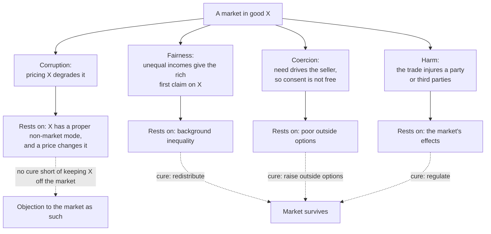

# Philosophy of Economics · Lesson 5.1: Commodification

> ⏱ ~15 min · Module 5: Markets: their moral limits and their justice · Builds on: [1.1 Welfarism and preference satisfaction](01-01-welfarism-and-preference-satisfaction.md), [3.1 The Pareto principle](03-01-the-pareto-principle.md) · Unlocks: [5.2 Repugnant markets and blocked exchanges](05-02-repugnant-markets-and-blocked-exchanges.md), [5.3 Exploitation in labour markets](05-03-exploitation-in-labour-markets.md)

## Why this matters

The economist's default about a new market is short: a voluntary trade happens only if both sides expect to gain, so allowing one adds an option and takes none away. By the Pareto reasoning of [3.1](03-01-the-pareto-principle.md), permitting it can only help. Yet most people think some things should not be for sale, and some markets seem to spoil what they touch. This lesson sorts the objections. Some say a market *corrupts* a good. Others say it is unfair, coercive or harmful, and those can be cured without closing the market. The difference decides what any reply has to show.

## The idea

In a well-known field experiment (Gneezy and Rustichini, "A Fine Is a Price", *Journal of Legal Studies*, 2000), Israeli day-care centres began fining parents who collected their children late. Late pickups went *up*, and stayed up after the fine was withdrawn. One reading: before the fine, lateness was a small wrong done to a teacher, and parents avoided it from decency. The fine turned it into a service with a price, and many decided the price was worth paying.

That is the picture behind [**commodification**](../reference.md#commodification): treating a good as something to be bought and sold, valued as a commodity is valued. Four thinkers frame the debate.

- **Michael Sandel** (*What Money Can't Buy*, 2012) separates two objections. The [**fairness argument**](../reference.md#fairness-argument): where incomes are unequal, a market lets the rich take what others need, and a poor seller's "choice" may be made under the pressure of need. The [**corruption argument**](../reference.md#corruption-argument): putting a price on some goods degrades them, because it values them in a lower way than they deserve. Fairness is an objection to markets *under inequality*. Corruption would survive perfect equality.
- **Elizabeth Anderson** (*Value in Ethics and Economics*, 1993) supplies the theory of "lower ways": goods are properly valued in different [**modes**](../reference.md#modes-of-valuation) (use, respect, love, appreciation), which [3.4](03-04-cbas-critics-and-defenders.md) set against cost-benefit analysis. Here the point is what market norms are. They are, roughly, impersonal, self-interested, responsive to wants rather than needs, and settled by exit (take your money elsewhere) rather than voice. Applied to a good whose value lies in a personal or civic relation, those norms change what the good *is*.
- **Margaret Jane Radin** (*Contested Commodities*, 1996) adds two complications. A *domino effect*: once some instances of a good are sold, everyone's instance may come to be seen as having a price. And a *double bind*: banning a sale to protect the good can deny desperately poor people their best option. Her answer is often [**incomplete commodification**](../reference.md#contested-commodities): allow sale under rules that keep the non-market meaning alive.
- **Karl Polanyi** (*The Great Transformation*, 1944) gives the sociological version: labour, land and money are *fictitious commodities*, not produced for sale, and a society that treats them as commodities subordinates itself to the market. That argument is [`social-theory`](../../social-theory/syllabus.md) [5.3](../../social-theory/lessons/05-03-polanyis-great-transformation.md)'s.

The reply comes from Jason Brennan and Peter Jaworski, [**Markets Without Limits**](../reference.md#markets-without-limits) (2016). Their thesis, paraphrased: whatever you may do for free, you may do for money. Their claim is not that everything may be sold. Some things may not be possessed or done at all (a hostage, say), and a market may be wrong because of *how* it runs: fraud, harm, exploitation. Their denial is narrower. Nothing is wrong *just because* money changed hands.

## The argument

**The corruption argument** (a reconstruction of Sandel's and Anderson's common core; the assembly is this lesson's).

1. **Some goods are properly valued in a non-market mode** (love, respect, civic duty, the gift) *(normative)*. *In words:* a friendship valued as a service, or a vote valued as a possession, is valued wrongly.
2. **Buying and selling a good expresses the market mode of valuation toward it, and tends to induce that mode in those who take part** *(two claims: conceptual and empirical)*. *In words:* a price says "this is the kind of thing you may have if you pay," and people come to treat it that way.
3. **Valuing a good in a lower mode than it calls for degrades it, whether or not anyone's preferences are worse satisfied** *(normative)*.

∴ **C.** A market in such a good degrades it, however equal the incomes and however free the trades.

**The formal tool: the option-adding inference.** Let $S$ be a person's set of feasible options before a market opens, and $S'=S\cup\{\text{sell }x\text{ at }p\}$ after. If she chooses by her preferences and the value of each option in $S$ is unchanged, then her best choice in $S'$ is at least as good as her best in $S$. *In words:* a new option can only be turned down. Kenneth Arrow put this presumption to Richard Titmuss's study of blood donation ("Gifts and Exchanges", 1972): a market widens each person's choices.

**The value judgment inside it** is the clause "the value of each option in $S$ is unchanged." Call it *invariance*: giving blood freely, or collecting your child on time, means the same once a price exists. The corruption argument is a denial of invariance. Premise 2 says the market changes the old options, not just adds a new one. The inference is valid, so the dispute is entirely about that premise. Keep its two halves apart:

- *Crowding out* (the empirical half) says payment can reduce the motivation it was meant to supplement. The day-care result is evidence for it. Whether it happens in a given market is a question for data.
- *Expressive meaning* (the conceptual half) says a price *means* something about a good, whatever anyone then does. That is a claim about social meaning, which no field experiment settles.

**Where the argument is weakest.** Premise 2. Brennan and Jaworski attack both halves. Against expressive meaning: what money signals is a contingent cultural convention. In some cultures a cash wedding gift is an insult, in others it is the norm. Where a convention makes a beneficial trade look degrading, they argue, the convention should yield, not the trade. Against crowding out: it is an empirical, case-by-case cost of a particular market design, an incidental wrong of exactly the kind their thesis allows. The defender's best reply is that some meanings are not conventional but *constitutive*: a bought friendship is not a friendship, so the market norm and the good are incompatible by definition, not by custom. The critic answers that such cases show only that some goods cannot be bought. Payment does not degrade them; it fails to obtain them.

## Map of the arguments

Three of the four arguments object to a market under conditions that could change. Only corruption objects to the market itself. That is why Brennan and Jaworski can grant the other three and still hold their thesis, and why [5.2](05-02-repugnant-markets-and-blocked-exchanges.md)'s noxious-markets framework, built from the conditional arguments, is a different project from Sandel's.

## Worked examples

**Example 1 (clean): the fine as a price.** Illustrative numbers. 100 parents each get a benefit $b$ from arriving late, spread evenly from 0 to 50 dollars. Breaking the norm costs each a guilt cost of 30 dollars. The centre adds a fine $f=10$.

- *Before:* a parent is late if $b>30$. That is $100\times\frac{50-30}{50}=40$ parents.
- *Invariance holds* (the fine adds to the guilt): late if $b>40$, so $100\times\frac{10}{50}=20$. Lateness halves. This is the economist's prediction.
- *Invariance fails* (the fine replaces the guilt, because lateness is now a paid service): late if $b>10$, so $100\times\frac{40}{50}=80$. Lateness doubles.

Run the four arguments. *Fairness* and *coercion* have no grip: the fine is the same for everyone, and no one is driven by need. *Harm* applies a little: teachers stay later. *Corruption* fits exactly: a norm of consideration became a price. The model shows what the evidence can and cannot do. The rise in lateness is empirical support for crowding out. The verdict that something of value was *lost* needs premise 3: on a preference-satisfaction view of welfare ([1.1](01-01-welfarism-and-preference-satisfaction.md)), the 80 parents who now pay are doing what they prefer.

**Example 2 (hard): paid blood.** Titmuss (*The Gift Relationship*, 1970) compared a voluntary blood system with a part-commercial one and argued that paying donors damages the gift relationship. Giving blood to a stranger is a gift only in a system where blood is not otherwise for sale. Arrow's reply was the option-adding inference: anyone who wants to give still can.

The case strains each side. For Brennan and Jaworski it is easy: giving blood is permitted free, so selling it is permitted. If paying donors lowered supply or safety, that would be a fault in this market's design, not in sale as such. For the corruption argument it is hard, because its strongest form needs a loss that is not a loss of blood. Titmuss's claim is that the *option* of giving a gift of a certain kind (blood that cannot be bought anywhere) disappears once a market exists. If that is right, invariance fails in the conceptual sense, and the market removes an option while adding one. But the claim then rests on what giving *means* to donors. Brennan and Jaworski can answer that meaning is what donors make of it: a donor who knows others are paid can still give, and mean it as a gift.

## Watch out

- **You might think evidence of crowding out proves the corruption argument, but actually it supports only premise 2's empirical half.** "Lateness rose" is empirical. "The fine made lateness a price" is conceptual. "Something of value was lost" is normative. A defender of markets can accept the first two and deny the third.
- **You might think the fairness argument is an argument against markets, but actually it is an argument against inequality.** Equalize incomes and outside options and it falls away. Sandel separated the two arguments for exactly this reason. An answer that refutes fairness has not touched corruption.
- **You might think commodification is the same question as inalienability.** Inalienability ([`philosophy-of-debt` 3.3](../../philosophy-of-debt/lessons/03-03-what-may-be-pledged.md)) bars transfer of any kind, even a gift. Radin's *market-inalienability* bars only sale: you may give a kidney but not sell one. The commodification debate is about that narrower line, which is exactly where Brennan and Jaworski's "free, so for money" principle cuts.

## One-liner

> A market adds an option only if prices leave the old options unchanged; the corruption argument denies that, and only it objects to a market as such, while the fairness, coercion and harm arguments object to the conditions a market runs under.

## Problems

**P1 (🟢) *(Exegetical (a)–(b).)*** An **invented** op-ed, not the words of any real person, about an invented city scheme paying residents 50 dollars a shift to visit isolated elderly people:

> "(i) A lonely widow visited by someone who comes for the cheque is not being befriended; a kindness you are paid for is no longer a kindness. (ii) The people who sign up will be the poorest residents, who cannot afford to say no to 50 dollars. (iii) Richer districts will top up the stipend, so their elderly will get the best visitors. (iv) Untrained visitors rotating through shifts will leave frail people confused and at risk of falls."

(a) Label each sentence as the corruption, fairness, coercion or harm argument. **One line each.** (b) Which sentence would still stand if every resident had the same income, good alternative work, and visitors were trained and regulated? Why? **Two sentences.**

**P2 (🟡) *(Evaluative.)*** Counterexample. (a) Build a case, not from this lesson, of an act it is permissible to do for free but, you judge, wrong to do for money, *or* argue that Brennan and Jaworski's principle survives the best case you can build. (b) State the reply Brennan and Jaworski would give and say whether your case survives it. **150 words or fewer in total.** Any verdict; you are graded on the moves.

**P3 (🔴, optional) *(Formal (a) · Exegetical (b).)*** Illustrative numbers. An invented town has 300 residents who regularly attend its open council meetings. It starts paying 20 dollars per meeting attended. (a) Compute total attendance and the percentage change if: (A) 40% of the regulars stop coming and 60 newcomers join; (B) 10% of the regulars stop and 150 newcomers join. (b) Under B attendance rises. Which side, Sandel or Brennan and Jaworski, can still say the payment wronged something, and name the single premise the other side must deny. Then say why scenario A would not separate them. **100 words or fewer for (b).**

Solutions

**P1** *(Exegetical (a)–(b))*

**Must hit, strict (a):**

- (i) **Corruption**: payment changes what the visit is, so it is no longer a kindness.
- (ii) **Coercion**: need, not free choice, drives the sellers.
- (iii) **Fairness**: unequal wealth gives richer districts first claim on the good.
- (iv) **Harm**: the scheme's effects injure the people it serves.

**Must hit, strict (b):** sentence **(i)**. It is the only one that rests on no condition the stated changes remove: equal incomes answer (iii), good alternatives answer (ii), training and regulation answer (iv), but the claim that a paid visit is not a kindness is about the payment itself.

**Wrong turns:** labelling (ii) as fairness. Sandel files both under fairness, but this lesson separates unequal access (buyers) from unfree consent (sellers), and the problem asks for that distinction. Answering (b) with (iv) because harm "does not depend on income": it does depend on how the scheme is run, which regulation changes.

**Model answer:** (a) (i) corruption; (ii) coercion; (iii) fairness; (iv) harm. (b) Sentence (i). Equality, alternatives and regulation remove the grounds of (ii), (iii) and (iv), but (i) objects to paying for the visit as such, so it survives every change to the conditions.

---

**P2** *(Evaluative)*

**Accept:** any case where the free act is clearly permissible and payment is the only change, followed by a fair statement of the Brennan-Jaworski reply and a reasoned verdict on it.

**Must hit, any verdict:**

- A case where the act done free is clearly permitted, and the only difference is payment, not deception, harm or a changed act.
- The reply stated fairly: the wrong lies in an incidental feature (concealment, a third party's reliance, a conflict of interest), not in money as such; or the good is not obtained by payment at all, which is impossibility, not a moral limit.
- A verdict on whether the case survives, with the reason.

**Wrong turns:** using an act that is wrong for free too (selling a vote you may not give away either, or a hostage): that is no counterexample, since the principle covers only what you may do free. Cases where the payment is hidden: the deception, not the money, is then doing the work, and the reply wins at once.

**Model answer (one of several):** A professor writes a student a strong recommendation letter: permitted, and generous. The student offers 500 dollars for it, the letter is honest, and the payment is disclosed. It still seems wrong, because a letter's worth is the unbought judgment it reports. The reply: the wrong is a conflict of interest that misleads readers, an incidental feature; and once payment is disclosed, the letter simply loses its value as evidence, which is a fact about the good, not a moral limit on the market. I think the case partly survives. Disclosure removes the deception, but it does not explain why the professor *wrongs* the readers by taking the money, as distinct from wasting their time.

---

**P3** *(Formal (a) · Exegetical (b))*

(a) A: $300\times(1-0.40)=180$ stay, $180+60=240$, a change of $-60$, or $-20\%$. B: $300\times(1-0.10)=270$ stay, $270+150=420$, a change of $+120$, or $+40\%$.

**Must hit, strict (a):** 240 (down 20%) and 420 (up 40%).

**Must hit, strict (b):**

- Under B, **Sandel** (the corruption argument) can still object: civic participation has become something done for pay, a lower mode of valuation, even though more people attend.
- The premise Brennan and Jaworski must deny: that the *meaning* a payment expresses counts against it apart from its consequences (premise 2's expressive half with premise 3). They hold that meaning is a contingent convention, and that a clear gain in participation outweighs it.
- A does not separate them: falling attendance is a bad consequence, which Brennan and Jaworski can treat as an incidental fault of this scheme. Both sides can oppose it, for different reasons.

**Wrong turns:** reading A as confirming Sandel. Crowding out is empirical evidence, and both sides accept that a scheme with bad consequences is faulty. Naming "whether crowding out happens" as the crux: in B, the side that objects does so without it.

**Model answer (b):** Under B only Sandel can object: paying citizens to deliberate values civic duty in the market mode, however many come. Brennan and Jaworski must deny that a payment's expressive meaning weighs against it independently of results; for them it is a convention, outweighed by more participation. Scenario A cannot separate them, because falling attendance is a consequence both can condemn: Sandel as crowding out, Brennan and Jaworski as a badly designed scheme.

## Flashback

**From Lesson [4.2](04-02-the-ramsey-equation-and-the-stern-nordhaus-debate.md) (The Ramsey equation and the Stern-Nordhaus debate):** *(Formal (a)–(b) · Exegetical (c).)* Illustrative numbers. Two appraisers both calibrate the Ramsey equation $r=\delta+\eta g$ to an observed real return of 4.2 percent and growth of $g=1.4$ percent. Appraiser A takes $\eta=1$; appraiser B takes $\delta=0.2$ percent.

(a) Find A's $\delta$ and B's $\eta$. Then compute each one's optimal saving rate $s=(r-\delta)/(\eta r)$ in 4.2's simple economy (capital returns $r$, no technical progress).

(b) For a scenario in which growth is 0.7 percent, with each appraiser's $\delta$ and $\eta$ unchanged, compute each one's discount rate.

(c) In two sentences: what do (a) and (b) together show about the claim that calibrating to market returns settles the discount rate?

Solution

(a) A: $\delta=4.2-1\times1.4=2.8$ percent. B: $\eta=(4.2-0.2)/1.4=2.857$. Saving rates: A, $s=(4.2-2.8)/(1\times4.2)=1.4/4.2=33.3$ percent; B, $s=(4.2-0.2)/(2.857\times4.2)=4.0/12.0=33.3$ percent. They are equal because on a calibrated path $r-\delta=\eta g$, so $s=g/r$ for both.

(b) A: $r=2.8+1\times0.7=3.5$ percent. B: $r=0.2+2.857\times0.7=0.2+2.0=2.2$ percent.

**Must hit, strict:**

- (a) $\delta_A=2.8$ percent, $\eta_B\approx2.86$; both saving rates 33.3 percent.
- (b) 3.5 percent for A, 2.2 percent for B.
- (c) At the calibration point the two splits are indistinguishable: same $r$, same saving rate. The market return fixes $r$, not how it divides between $\delta$ and $\eta g$. That split, which calibration leaves to a choice, decides the rate as soon as the appraisal moves to another growth path (and, through $\eta$, the weights between richer and poorer people), so matching markets does not settle the rate for the cases that matter.

**Wrong turns:** taking the equal saving rates to show the two appraisers agree about everything. Concluding that the gap in (b) is a disagreement about growth: both use the same 0.7 percent, and the gap comes entirely from the split. Saying more market data would settle the matter: returns observed under other growth rates could pin down a descriptive $\eta$, but whether that $\eta$ should be society's inequality aversion is the normative question 4.2 left open.

**Model answer:** (a) $\delta_A=2.8$ percent and $\eta_B\approx2.86$; both imply saving 33.3 percent of output. (b) A discounts at 3.5 percent, B at 2.2. (c) One observed return is matched equally well by a patient, inequality-averse split and an impatient, less averse one, so the market fixes $r$ but not its parts. The parts decide the rate once growth differs from the calibration path, so which split to use is a choice that calibrating to markets does not make for the analyst.

## Connections

- **Backward:** the option-adding inference is the Pareto reasoning of [3.1](03-01-the-pareto-principle.md) applied to a choice set, and its blind spot is [1.1](01-01-welfarism-and-preference-satisfaction.md)'s: if welfare is preference satisfaction, a degraded good that people still choose is no loss at all. The cost-benefit critics of [3.4](03-04-cbas-critics-and-defenders.md) (Anderson, Sagoff) make the same complaint about valuing in money what should be valued otherwise.
- **Forward:** [5.2](05-02-repugnant-markets-and-blocked-exchanges.md) turns the conditional arguments into a framework (Satz's noxious markets) and asks what repugnance is evidence of. [5.3](05-03-exploitation-in-labour-markets.md) takes the coercion argument into labour markets, where Polanyi's first fictitious commodity is sold.
- **Sideways:** [`philosophy-of-debt` 3.3](../../philosophy-of-debt/lessons/03-03-what-may-be-pledged.md) owns inalienability and Mill's slavery contract; this lesson's market-inalienability is its narrower cousin. Polanyi's fictitious commodities and the Marxian sociology of commodification belong to [`social-theory`](../../social-theory/syllabus.md) ([2.3](../../social-theory/lessons/02-03-capitalism-and-the-test-of-history.md), 5.3), and [`political-philosophy`](../../political-philosophy/syllabus.md) ceded its "what money shouldn't buy" lesson here.
