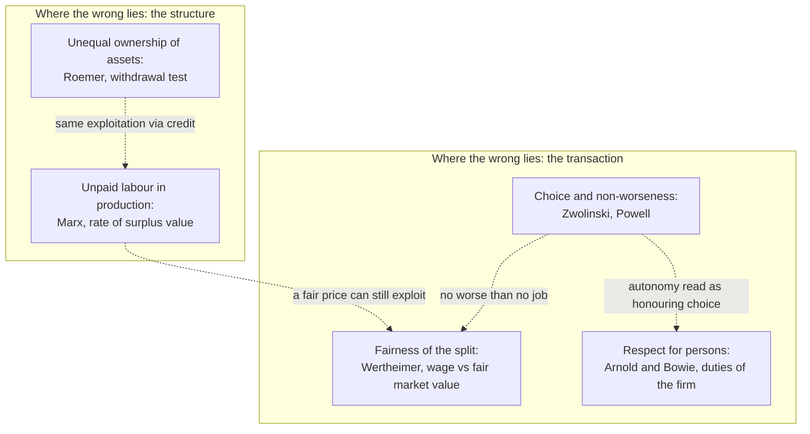

# Philosophy of Economics · Lesson 5.3: Exploitation in labour markets

> ⏱ ~15 min · Module 5: Markets: their moral limits and their justice · Builds on: [5.1 Commodification](05-01-commodification.md), [`philosophy-of-debt` 3.1 What exploitation is](../../philosophy-of-debt/lessons/03-01-what-exploitation-is.md) · Unlocks: [5.4 Markets and desert](05-04-markets-and-desert.md), [5.5 Hayek](05-05-hayek-knowledge-order-and-the-mirage-of-social-justice.md)

## Why this matters

A garment worker takes a factory job at a wage above anything else on offer. She chose it and gained from it, and the wage is what a competitive labour market pays. Economists call that a voluntary trade. Critics call it exploitation. The debt course built the tools for judging one deal. This lesson asks what they cannot see: whether a wage can exploit at a fair price, and whether the wrong lies in the deal or in who owns what.

## The idea

**Reload.** On Alan Wertheimer's account (*Exploitation*, 1996), [taught in full in the debt course](../../philosophy-of-debt/lessons/03-01-what-exploitation-is.md), A exploits B by taking unfair advantage: A gains on terms that give A more than a fair share of the gains, and the fair share is set by *fair market value*, the price a competitive market would set with neither side using the other's special vulnerability. So a deal can benefit B, have her free consent, and still exploit her: *mutually advantageous exploitation* ([exploitation](../reference.md#exploitation)). The [non-worseness claim](../reference.md#non-worseness-claim) ([debt 3.2](../../philosophy-of-debt/lessons/03-02-predatory-lending-and-usury-caps.md)) adds that such a deal cannot be worse than no deal, when A had a right not to deal at all.

**What those tools leave out.** Wertheimer grades the *split* of one transaction against a market benchmark. Run that on a wage set by a competitive labour market and it comes back clean almost by definition: the wage *is* fair market value. Two rival traditions say the test is looking in the wrong place.

- **Marx:** the wage is a fair exchange, and exploitation happens anyway, *after* the exchange, in production.
- **Roemer:** exploitation is not about labour or wages at all; it is what unequal ownership of productive assets produces, and a credit market produces exactly the same thing.

Then the sweatshop debate asks the practical question these accounts leave open: what does a firm owe the workers it exploits, if anything, given that they chose the job?

## The argument

**1. Marx: equal exchange, unequal outcome.** In *Capital* vol. 1 ch. 6 the worker sells her *labour-power*, her capacity to work for a day, and Marx grants that she gets its full value: the labour-time needed to produce her means of subsistence. No cheating. Then he leaves the market:

> This sphere … is in fact a very Eden of the innate rights of man. There alone rule Freedom, Equality, Property and Bentham.

The irony is in "Eden" and "Bentham": the market's freedom and equality are real but superficial. Production, the "hidden abode", is where the buyer uses what he bought, and a day's labour produces more value than a day's labour-power costs. The difference is [surplus value](../reference.md#surplus-value), and the rate of surplus value $s/v$ (surplus value over wages) is Marx's measure of exploitation (ch. IX, quoted in [debt 3.1](../../philosophy-of-debt/lessons/03-01-what-exploitation-is.md)). *In words:* exploitation is not a bad price; it is unpaid labour at a fair price.

**2. Roemer: from labour to property.** John Roemer (*A General Theory of Exploitation and Class*, 1982) modelled corn economies where people differ only in how much seed they own. He showed that the asset-rich end up hiring and the asset-poor end up hired. The rich work less than the labour embodied in what they consume, and the poor work more. Then he generalized away from labour, with a [withdrawal test](../reference.md#property-relations-account). In paraphrase: a coalition $S$ is *capitalistically exploited* if (i) $S$ would be better off withdrawing from the economy with its per-capita share of society's alienable productive assets, keeping its own labour and skills, and (ii) the remaining members would be worse off. Roemer adds a condition that the rest dominate $S$. *In words:* you are exploited if you would gain from an equal split of the means of production and the others would lose. Swap the per-capita share for $S$'s own assets and you get *feudal* exploitation. Add inalienable assets such as skill and you get *socialist* exploitation.

**3. The isomorphism.** Roemer also showed that an economy where owners hire workers and one where workers borrow capital from owners produce the same class positions, the same hours and the same exploitation. Capital hiring labour and labour renting capital come to the same thing. So, he concluded, the wage relation is not the culprit. Differential ownership under competitive markets is. This is the bridge to the debt thread: the interest Marx treats as a slice of surplus value ([debt 2.4](../../philosophy-of-debt/lessons/02-04-marx-interest-bearing-capital.md)) is, on Roemer's model, the same exploitation in another market.

**4. Roemer's turn.** In "Should Marxists Be Interested in Exploitation?" (*Philosophy and Public Affairs*, 1985), Roemer argued that labour-exploitation is a poor proxy for what is wrong. His 1982 models had already shown that, with different skills or preferences for leisure, a rich person can come out exploited and a poor one an exploiter. What carries the moral weight is the injustice, if any, of the unequal distribution of productive assets. Exploitation matters only as its symptom.

**5. Sweatshops: three positions.**

- **Choice-based defence.** Matt Zwolinski ("Sweatshops, Choice, and Exploitation", *Business Ethics Quarterly*, 2007) argues that workers' choices to accept sweatshop jobs are morally significant both as exercises of autonomy and as expressions of their preferences. Boycotts or mandated standards that cost those jobs override the workers' own judgment and leave them with worse options. Benjamin Powell and Zwolinski (2012) add the economics: these jobs often pay more than the workers' alternatives.
- **Kantian respect.** Denis Arnold and Norman Bowie ("Sweatshops and Respect for Persons", *Business Ethics Quarterly*, 2003) hold multinationals responsible for their suppliers. Respect for persons ([`ethics` 2.3](../../ethics/lessons/02-03-humanity-autonomy-and-the-lie.md)) gives them duties to see that local labour law is obeyed, to refrain from coercion, to meet minimum safety standards and to pay a living wage. They reply to the objection that this would cost more jobs than it saves.
- **Unfair split.** A Wertheimerian asks whether the wage is below fair market value. That is hard to show in a competitive labour market. It is easier to show where an employer has monopsony power or uses a special vulnerability.

The [sweatshop debate](../reference.md#sweatshop-debate) is not between autonomy and welfare. Both sides claim autonomy. One side reads it as honouring the choices people make from the options they have. The other reads it as securing the conditions under which choosing means something.

**Where the argument is weakest.** The structural accounts rest on the per-capita benchmark. Why is an equal split of today's assets the baseline, rather than what each person's own past choices earned? Roemer's own answer concedes the point: if unequal holdings arose justly, the exploitation they produce is not unjust. Then the critic says "exploitation" has stopped doing moral work, and everything turns on a theory of just acquisition, which is [5.4](05-04-markets-and-desert.md)'s and Nozick's ground. A second complaint (Anderson and Thompson, 1988) is that profits in Roemer's models are only a scarcity rent. Make seed plentiful enough that some sits idle, and its return falls to zero and the exploitation disappears. Marx located exploitation in production, and here it vanishes with scarcity.

## Map of positions

Read across the dashed edges. The transactional views argue about one employer's terms, and the structural views say no fair price could fix what they condemn. Arnold-Bowie and Zwolinski share a box because both invoke the worker's agency.

## Worked examples

**Example 1 (clean): a corn island.** Illustrative numbers. Four islanders each need 1 bushel of corn a season and work no more than they must. A *factory* turns 1 day of labour plus 1 bushel of seed into 2 bushels, which returns the seed and nets 1. A *farm* needs no seed but takes 2 days per bushel. Ama owns all 2 bushels of seed; Ben, Cal and Dee own none.

*Wage.* Seed covers only 2 factory days and the workers need far more, so the farm is in use at the margin, and the factory wage settles at the farm's rate, $w = \tfrac12$ bushel a day. Ama hires both seed-days and keeps $2(1 - \tfrac12) = 1$ bushel, working 0 days. The workers earn 1 bushel in wages and farm the other 2, which takes 4 days. Each works 2 days.

*Labour accounting.* The island works $2 + 4 = 6$ days for $2 + 2 = 4$ bushels, 1.5 days per bushel. Each worker works 2 days for a bushel embodying 1.5, a surplus of 0.5 day, so $s/v = 0.5/1.5 = \tfrac13$. Ama works 0 and consumes 1.5 days' worth. Check: $3 \times 0.5 = 1.5$.

*Withdrawal test.* Per-capita seed is $2/4 = 0.5$. Ben, Cal and Dee withdraw with 1.5: 1.5 factory days plus 1.5 farmed bushels at 2 days each, $1.5 + 3 = 4.5$ days, so 1.5 days each instead of 2. Ama with 0.5 seed needs $0.5 + 0.5 \times 2 = 1.5$ days instead of 0. The workers gain and Ama loses, so the workers are capitalistically exploited.

*Isomorphism.* Ama instead lends seed at interest $r$ per bushel-season. Borrowing beats farming until $1 - r = \tfrac12$, so $r = \tfrac12$. The workers borrow both bushels, work 2 seed-days and net $2 - 1 = 1$ bushel after interest, then farm the rest. Ama receives 1 bushel. Hours, consumption and exploitation are identical.

Every trade here is voluntary, competitive and mutually advantageous. Wertheimer's test finds nothing wrong, and the non-worseness claim is satisfied. Both structural tests find exploitation.

**Example 2 (hard): the frugal start.** Rewind. The four began with 0.5 bushel of seed each. Ben, Cal and Dee ate theirs in a good season, by choice. Ama ate less and bought their seed later at a fair price. Example 1 follows exactly, so the labour accounting and the withdrawal test still say the three are exploited.

Is anything wrong? Roemer's 1985 answer: not if the holdings arose justly. The case then shows exploitation without injustice, which is why he demotes exploitation to a symptom. A Nozickian agrees and stops there. A Marxian replies that the case is the fable Marx mocks in *Capital* vol. 1 ch. XXVI, where economists explain property by a past with two sorts of people:

> one, the diligent, intelligent, and, above all, frugal elite; the other, lazy rascals, spending their substance, and more, in riotous living.

Real holdings, Marx says, came from enclosure and conquest, not saving. That reply is *empirical*, a claim about history. Granting the empirical point leaves the *conceptual* question open: whether exploitation is wrong in itself, or wrong only when its origin is.

## Watch out

- **You might think Marx says workers are underpaid.** In ch. 6 they are paid the full value of their labour-power. The charge is that the full value of labour-power is less than the value labour produces, so a "fair wage" campaign does not answer him.
- **You might think "sweatshop jobs beat the alternatives" settles the debate.** That is an empirical claim, and both sides can grant it. The non-worseness claim turns it into a normative one, the job is no worse than no job, and Arnold and Bowie deny that this fixes what the firm owes. Name which kind of claim each sentence makes.
- **You might think the withdrawal test is a policy proposal.** It is a counterfactual used to *define* exploitation. Nobody has to withdraw. Whether to redistribute assets is a further normative question the definition does not answer.

## One-liner

> Wertheimer grades the split of one deal, and a competitive wage passes. Marx finds exploitation at a fair price, in production, and Roemer moves it into ownership, where a labour market and a credit market are the same. Sweatshop debaters agree that agency matters and disagree about what respecting it requires.

## Problems

**P1 (🟢) *(Formal (a)–(c) · Exegetical (d).)*** Illustrative numbers. Five islanders each need 1 bushel a season and work no more than they must. The factory turns 1 day plus 1 bushel of seed into 2 bushels (net 1). The farm takes 3 days per bushel and no seed. Eda owns all 3 bushels of seed; four workers own none. The wage settles at the farm's rate, and Eda hires every seed-day and works none.

(a) Find the wage, Eda's income, each worker's days, the island's labour per bushel, and the rate of surplus value.
(b) Run Roemer's withdrawal test for the four workers as a coalition. Who gains and who loses?
(c) If Eda lends her seed instead, what interest rate per bushel-season reproduces the outcome, and what does she receive?
(d) In two sentences: what does (c) show about where exploitation lies, on Roemer's view?

**P2 (🟡) *(Exegetical (a) · Evaluative (b).)*** An invented case. In an export zone with dozens of competing garment factories, a supplier pays the same wage as its rivals, about 50 percent more than local farm work. A local estimate of a living wage is twice the factory wage. Workers who refuse overtime beyond the legal limit are dismissed.

(a) Give the verdict on this job of Wertheimer's account, Roemer's account and Arnold and Bowie's account, one sentence each, naming what decides it.
(b) Take the account you find most plausible and say where in this case it stops settling the verdict. Any verdict; 100 words or fewer.

**P3 (🔴, optional) *(Exegetical.)*** A brand weighs requiring its suppliers to pay the living wage. A Zwolinski-style adviser objects, and an Arnold-Bowie-style adviser supports the requirement. Name the single premise they disagree about, separate it from the empirical dispute that travels with it, and say what argument or evidence would move each side. 150 words or fewer.

Solutions

**P1** *(Formal (a)–(c) · Exegetical (d).)*

(a) The wage is the farm's rate, $w = \tfrac13$ bushel a day. Eda's income is $3(1 - \tfrac13) = 2$ bushels. The workers earn $3 \times \tfrac13 = 1$ bushel in wages and farm the other 3, taking $3 \times 3 = 9$ days. Total labour is $3 + 9 = 12$ days, so each worker works 3 days. Output is $3 + 3 = 6$ bushels, so labour per bushel is $12/6 = 2$ days. Each worker works 3 days for a bushel embodying 2, a surplus of 1 day, so $s/v = 1/2 = 50\%$. Eda works 0 and consumes $2 \times 2 = 4$ days' worth. Check: $4 \times 1 = 4$.

(b) Per-capita seed is $3/5 = 0.6$. The coalition withdraws with $4 \times 0.6 = 2.4$. It works 2.4 factory days, then farms $4 - 2.4 = 1.6$ bushels at 3 days each, 4.8 days. That is $7.2$ days in all, or 1.8 days each instead of 3. Eda with 0.6 seed works 0.6 factory days and farms 0.4 bushel in 1.2 days, 1.8 days for 1 bushel, instead of 0 days for 2. The workers gain and Eda loses, so the workers are capitalistically exploited.

(c) Borrowing a seed-day nets $1 - r$, which must equal the farm's $\tfrac13$, so $r = \tfrac23$ per bushel-season. Eda lends 3 and receives $3 \times \tfrac23 = 2$ bushels. The workers net $3 \times \tfrac13 = 1$ bushel from 3 borrowed seed-days.

**Must hit, strict (a)–(c):** $w = \tfrac13$; Eda 2 bushels; 3 days per worker; 2 days per bushel; $s/v = 50\%$; coalition 1.8 days each, Eda 1.8 days; $r = \tfrac23$, interest 2.

**Must hit, strict (d):** the same hours, consumption and exploitation arise whether capital hires labour or labour borrows capital. So the source is unequal ownership of the seed under competitive markets, not the wage relation or anything special to labour markets.

**Wrong turns:** valuing a bushel at the factory's 1 day rather than the island's average of 2. Comparing the coalition's withdrawal with Eda's current *corn* rather than the coalition's own current days. In (c), setting $r$ to the factory's whole net output of 1.

**Model answer (d):** Since lending seed reproduces every hour and bushel of hiring labour, the wage relation cannot be what generates the exploitation. On Roemer's view it lies in the unequal ownership of seed under competitive markets.

---

**P2** *(Exegetical (a) · Evaluative (b).)*

**Must hit, strict (a):**

- **Wertheimer:** the wage matches rivals' in a competitive market, so it is at fair market value and not exploitative as a price. Dismissal for refusing *illegal* overtime threatens to leave workers worse off than they are entitled to be, which makes it coercion rather than exploitation.
- **Roemer:** asset-poor workers who would be better off withdrawing with a per-capita share of productive assets are capitalistically exploited, whatever the wage or the employer's conduct.
- **Arnold and Bowie:** the duties are breached on three counts: local labour law (the overtime limit), coercion (the dismissals) and the living wage (pay is half of it).

**Must hit, any verdict (b):**

- The chosen account stated precisely.
- The exact point where it underdetermines: for Wertheimer, whether many rival employers rule out a special vulnerability; for Roemer, whether present holdings are unjust (Example 2); for Arnold and Bowie, what a living wage is and who must pay for it if it costs jobs.
- A reason why the case leaves that point open.

**Wrong turns:** calling the wage exploitative on Wertheimer's account because it is low. Running the overtime threat as an unfair split. Treating Roemer's verdict as depending on the employer's conduct.

**Model answer (b), one of several:** Arnold and Bowie's account settles the overtime and the law, but not the wage. A living wage at double the current pay may cost jobs, and the account says the firm must pay it while replying that the harm is overstated. If the reply fails here, the account must say whether respect requires the wage anyway. The case cannot tell us, because the employment effect is unknown.

---

**P3** *(Exegetical, strict on the premise; no verdict graded.)*

**Must hit, strict:**

- **The premise:** what respect for the workers' autonomy requires. Zwolinski holds that it requires honouring the choices they make from their actual options, so removing an option they chose disrespects them. Arnold and Bowie hold that it requires securing conditions of agency, including a living wage, which a choice among desperate options does not waive.
- **The empirical dispute kept separate:** how many jobs a living-wage requirement would cost. Arnold and Bowie argue the harm is overstated, and Zwolinski that it is real. Even if no jobs were lost, the normative crux would remain.
- **What moves each:** Zwolinski, a case where honouring choice plainly fails respect, such as a worker accepting dangerous work only because of injustice the firm profits from. Arnold and Bowie, strong evidence that the requirement would put many of its intended beneficiaries out of work, which forces them to say whether respect still demands it.

**Wrong turns:** naming "whether sweatshops are good" as the crux. Casting the dispute as autonomy against welfare, when both appeal to autonomy. Collapsing the crux into the employment-effect question.

**Model answer:** Both advisers appeal to the workers' autonomy and disagree about what respecting it requires. The Zwolinski side reads respect as honouring the choices workers make from the options they have. The Arnold-Bowie side reads it as securing the conditions, a living wage among them, that make choice more than a pick among desperate options. A separate empirical dispute rides along: how many jobs the requirement would cost. Evidence of large job losses would press the Arnold-Bowie side to say whether respect still requires the wage. A case where an accepted job profits from an injustice done to the worker would press the Zwolinski side to say whether her choice still settles what she is owed.

## Flashback

**From Lesson [5.1](05-01-commodification.md) (Commodification):** *(Formal (a)–(b) · Exegetical (c).)* An invented case, illustrative numbers. A river town asks its 200 residents to join weekend clean-up shifts. A shift costs each resident a private cost $c$, spread evenly from 0 to 50 dollars across residents, and gives each a warm glow worth 20 dollars from helping. A resident signs up if what she gets from a shift exceeds $c$. The council then starts paying 15 dollars a shift.

(a) Count sign-ups before the payment, and after it if (A) invariance holds, so the payment adds to the warm glow, or (B) the payment replaces the warm glow entirely. Give each change in percent.
(b) Suppose instead the payment leaves a fraction $\theta$ of the warm glow intact ($0\le\theta\le1$). For which $\theta$ does paying raise sign-ups? How many sign up at $\theta=\tfrac12$?
(c) An invented council statement after outcome B: "Sign-ups fell once we started paying. That proves the payment turned a civic duty into a job, and something of real value has been lost, however many shifts get done." Split it into its empirical, conceptual and normative claims, and say which of them a Brennan-Jaworski defender can accept while rejecting the conclusion. **Three sentences.**

Solution

(a) Before: sign up if $c<20$, so $200\times\frac{20}{50}=80$. (A) Sign up if $c<20+15=35$, so $200\times\frac{35}{50}=140$, a change of $+60$, or $+75\%$. (B) Sign up if $c<15$, so $200\times\frac{15}{50}=60$, a change of $-20$, or $-25\%$.

(b) Sign up if $c<20\theta+15$. Paying raises sign-ups if $20\theta+15>20$, that is $\theta>\tfrac14$: the payment helps as long as it destroys less than three quarters of the glow. At $\theta=\tfrac12$ the cutoff is $10+15=25$, so $200\times\frac{25}{50}=100$ sign up.

**Must hit, strict (a)–(b):** 80 before; 140 ($+75\%$) under A; 60 ($-25\%$) under B; $\theta>\tfrac14$; 100 at $\theta=\tfrac12$.

**Must hit, strict (c):**

- **Empirical:** sign-ups fell after the payment began (crowding out, the empirical half of premise 2).
- **Conceptual:** the payment changed what a shift *is*, from civic duty to paid work (expressive meaning, premise 2's conceptual half).
- **Normative:** valuing the shift that way is a loss in itself, apart from how many shifts get done (premise 3).
- A Brennan-Jaworski defender can accept the first two and deny the third: the drop is a cost of this scheme's design, and a reclassified activity is no loss unless premise 3 holds. The statement's "proves" runs empirical evidence into a normative conclusion it cannot reach.

**Wrong turns:** in (b), answering $\theta>\tfrac34$ by confusing the share of the glow destroyed with the share that survives. In (c), calling "turned a civic duty into a job" empirical: no count of sign-ups shows what a shift means. Reading outcome B as confirming the corruption argument: a defender of markets condemns a scheme that backfires too, on its results.

**Model answer (c):** The empirical claim is that sign-ups fell once payment began, the conceptual claim is that payment made the shift a job rather than a civic duty, and the normative claim is that this change of mode is a loss whatever the number of shifts. A Brennan-Jaworski defender can grant the first as a design fault and even the second, and denies the third, so the conclusion needs premise 3, which the evidence does not supply. "Proves" is the error: the falling count supports only the empirical half of premise 2.

## Connections

- **Backward:** [`philosophy-of-debt` 3.1](../../philosophy-of-debt/lessons/03-01-what-exploitation-is.md) owns Wertheimer's account and its structural rival, and [3.2](../../philosophy-of-debt/lessons/03-02-predatory-lending-and-usury-caps.md) owns the non-worseness claim. This lesson takes both into labour markets, where a competitive wage passes the transactional test. [5.1](05-01-commodification.md) asked whether markets corrupt or coerce. Marx's ch. 6 sets out what treating labour-power as a commodity hides.
- **Forward:** [5.4](05-04-markets-and-desert.md) asks whether market income can be deserved, which is Example 2's question about Ama. [5.5](05-05-hayek-knowledge-order-and-the-mirage-of-social-justice.md) gives Hayek's case that market outcomes are neither just nor unjust, and the structural-injustice reply. The Module 5 boss problem in the [syllabus](../syllabus.md) returns to ch. 6 and to price gouging.
- **Sideways:** Roemer's isomorphism is the debt thread's bridge. Interest, which [`philosophy-of-debt` 2.4](../../philosophy-of-debt/lessons/02-04-marx-interest-bearing-capital.md) reads as a slice of surplus value, is the same exploitation as the wage in another market. The withdrawal test is a blocking test, like the core of [`grad-game-theory` 6.1](../../grad-game-theory/lessons/06-01-coalitional-games-core.md), but it measures a coalition's options from an equal split of assets rather than from its actual holdings. Marx's theory of history is [`history-of-political-thought` 6.5](../../history-of-political-thought/lessons/06-05-marx-from-hegel-to-historical-materialism.md), and the respect-for-persons formula behind Arnold and Bowie is [`ethics` 2.3](../../ethics/lessons/02-03-humanity-autonomy-and-the-lie.md).
