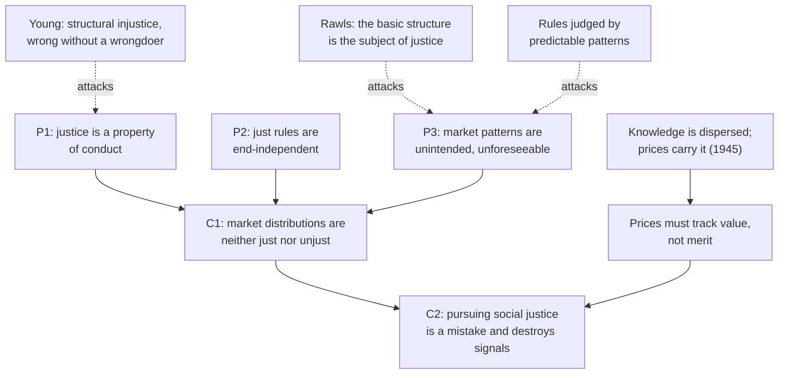

# Philosophy of Economics · Lesson 5.5: Hayek: knowledge, order, and the mirage of social justice

> ⏱ ~15 min · Module 5: Markets: their moral limits and their justice · Builds on: [3.1 The Pareto principle](03-01-the-pareto-principle.md), [5.4 Markets and desert](05-04-markets-and-desert.md) · Unlocks: [6.1 Idealization and isolation](06-01-idealization-and-isolation.md)

## Why this matters

[5.4](05-04-markets-and-desert.md) asked whether market incomes are *deserved*. Friedrich Hayek's answer is that the question is malformed: market outcomes are neither just nor unjust, any more than the weather is. If he is right, "social justice" names nothing, and every argument that a market distribution is unfair, from luck egalitarianism to the just wage, misfires before it starts. His case rests on an argument about knowledge that most economists accept, so it is the strongest defence of markets that does not appeal to desert. This lesson reconstructs it and states three replies at full strength.

## The idea

Three claims, in order, each depending on the one before.

**1. The knowledge problem.** In "The Use of Knowledge in Society" (*American Economic Review*, 1945), Hayek argued that the economic problem is not how to allocate given resources, which assumes someone already holds all the relevant data. The data never exist in one place. They are scattered as local, often unspoken knowledge of particular circumstances: which machine is idle, which shipment is late, which customer will switch ([knowledge problem](../reference.md#knowledge-problem)). Prices compress that dispersed knowledge into one number per good. His example is tin: if a new use for tin appears somewhere, or a source of it dries up, users of tin need not know which happened. They need only respond to the higher price, and their responses pass the news on to the users of substitutes, and so on, until the whole system has adjusted, though no one in it knows why.

**2. Spontaneous order.** The resulting pattern is an order, but nobody designed it. In *Law, Legislation and Liberty* vol. 1 (*Rules and Order*, 1973) Hayek contrasts a made order (*taxis*), like an army, which serves its maker's ends, with a grown order (*kosmos*), like a language, which emerges from individuals following general rules and serves no single end ([spontaneous order](../reference.md#spontaneous-order)). The market order, which he calls a *catallaxy*, is the second kind.

**3. Value is not merit.** In *The Constitution of Liberty* (1960, ch. 6), Hayek separated what a person's services are *worth to others* (value) from how *praiseworthy* her conduct is (merit) ([value and merit](../reference.md#value-and-merit)). Markets reward value. The surgeon with a rare talent and the prospector who stumbled on ore earn much; the diligent worker in a dying trade earns little. Hayek's striking claim is that markets *must not* try to reward merit: prices work as signals only if they tell people where their efforts are most valued now, whatever they deserve. The demand shock in [5.4](05-04-markets-and-desert.md) that changed a worker's marginal product without changing her effort is, for Hayek, the system working.

## The argument

In *The Mirage of Social Justice* (*Law, Legislation and Liberty* vol. 2, 1976), Hayek turns these claims into an argument that "social justice" is a category mistake, like calling a stone dishonest ([social justice as a category mistake](../reference.md#social-justice-as-category-mistake)). Reconstructed, paraphrased:

1. **Justice is a property of conduct.** Only the actions of persons, or the rules governing them, can be just or unjust. *In words:* injustice needs someone who did it.
2. **Rules of just conduct are end-independent.** In a free society the rules (property, contract, no fraud) are general and say nothing about who should end up with what.
3. **Market distributions are unintended.** The pattern of incomes results from millions of choices under those rules; no one intends it, and no one could foresee who gets what.
4. **So no one is responsible for the pattern.** From 3, and from 1, it is the wrong kind of thing to be just or unjust.

∴ **C1.** A market distribution reached by just conduct is neither just nor unjust. Complaints of "social injustice" misapply a concept.

5. **Making the pattern just would require a distributor.** To ensure that rewards track merit or need, some authority must decide what each person should get, and direct people accordingly.
6. **That destroys the signal.** Rewards set by merit no longer tell people where their efforts are most valued (claim 3 of The idea), and a distributor lacks the dispersed knowledge to replace them (claim 1).

∴ **C2.** Pursuing social justice in the market both rests on a mistake and undermines the order that feeds everyone.

Two clarifications. Hayek was not against all aid. He endorsed a guaranteed minimum income provided outside the market, as insurance against misfortune, as long as it did not try to tie rewards to desert. And notice which justification of markets is *not* in play: efficiency in the sense of [3.1](03-01-the-pareto-principle.md). The first welfare theorem assumes the information Hayek says no one has ([Pareto optimality](../reference.md#pareto-optimality)). His defence is epistemic and procedural, which is why it survives the incomparability that sinks "the market is efficient, so it is good."

**Three replies**, each stated as its defenders would.

- **The basic structure (Rawls).** In *A Theory of Justice* (1971), the primary subject of justice is the basic structure: the major institutions (property, markets, taxes, the family) that together shape everyone's prospects. Grant Hayek premise 3; the *choice of rules* is still a choice, and its distributive tendencies are known on average even if no individual outcome is. The question is not "who caused this income?" but "could the rules be justified to those who fare worst under them?" (cited to [`political-philosophy`](../../political-philosophy/syllabus.md) 2.2–2.3).
- **Structural injustice (Young).** Iris Marion Young (*Responsibility for Justice*, 2011) argued that some injustice is wronging without a wrongdoer: when the normal working of social processes, each action blameless, puts large groups under systematic threat of domination or deprivation. Responsibility then is not blame for a past act but a forward-looking share, held by everyone whose actions sustain the process, in changing it (her social connection model) ([structural injustice](../reference.md#structural-injustice); cited to [`political-philosophy` 4.4](../../political-philosophy/lessons/04-04-feminist-political-philosophy.md)). This denies premise 1 outright.
- **Rule-governed processes can be judged.** We assess a game's rules by the outcomes they predictably produce: a dice game whose rules give one player loaded dice is unfair though no one rolls on purpose. Unforeseeability of *individual* outcomes does not make the *pattern* unforeseeable, and keeping a rule whose pattern is known is an act. This denies premise 3 as Hayek needs it.

Luck egalitarians ([brute and option luck](../reference.md#brute-and-option-luck)) add a further line: they accept that markets reward value, not merit, and treat that as precisely the problem, since much value reflects brute luck in talent and demand (cited to [`political-philosophy` 2.6](../../political-philosophy/lessons/02-06-luck-relations-priority-and-sufficiency.md)).

**Where the argument is weakest.** Premise 1, read with premise 3. Hayek's critics say he equivocates between two senses of "no one is responsible": no one *chose this outcome* (true) and no one is answerable for *maintaining the rules that predictably produce outcomes of this shape* (false, since legislatures keep revising property, contract and tax law). Hayek's reply is that once rules are adjusted to hit a distributive target they stop being end-independent, which is premise 2, so the debate moves to whether rules can be shaped by distributive concerns while staying general. That question is open, and is where the two sides actually meet.

## Argument map

Solid arrows are Hayek's support; dashed arrows are replies and the premise each denies.

## Worked examples

**Example 1 (clean): the tin shock.** Illustrative numbers. Two industries use tin: canners with demand $q_C=70-2p$ and solder makers with $q_S=50-p$ (tonnes, $p$ in hundreds of dollars per tonne). With 90 tonnes supplied, the market clears where $120-3p=90$: $p=10$, canners take 50, solder makers 40.

A mine floods and supply falls to 75. Clearing: $120-3p=75$, so $p=15$. Canners now take $70-30=40$ (a cut of 10, or 20 percent) and solder makers $50-15=35$ (a cut of 5, or 12.5 percent). Neither industry learned about the flood. Each saw a price of 15 and cut back to where its last tonne was worth 15 to it: from the inverse demands, $(70-40)/2=15$ and $50-35=15$.

Compare a planner who knows only the shortfall and cuts everyone by the same proportion, one sixth: canners get $41\tfrac{2}{3}$, solder makers $33\tfrac{1}{3}$. Now the canners' last tonne is worth $(70-41\tfrac{2}{3})/2=14\tfrac{1}{6}$ and the solder makers' is worth $50-33\tfrac{1}{3}=16\tfrac{2}{3}$, so moving tonnes from canning to solder would gain value. To do better the planner needs both demand schedules, which is exactly the knowledge Hayek says is dispersed. The price did it with one number.

*Find the value judgment.* "Worth 15 to it" is willingness to pay, so the price rations by WTP, which tracks wealth ([1.2](01-02-money-and-happiness-as-measures.md)). Hayek's epistemic claim (prices transmit information) is separate from the normative claim (the resulting allocation should stand).

**Example 2 (hard): the stranded town.** The canners in Example 1 are concentrated in one town. The cut costs 300 jobs there, through no fault or choice of the workers. Hayek: nobody wronged them; the signal told them their labour is now more valuable elsewhere, and a minimum income outside the market can cushion them. Young: if the town's workers can foresee that this pattern recurs (whoever bears supply shocks, it is regularly those with the least savings and mobility), then the process is structurally unjust, and everyone who benefits from the cheap reallocation shares responsibility for changing it. The rule-judging reply: the rule "let prices fall where they may" has a predictable incidence, and choosing it over, say, adjustment insurance is a choice someone can be asked to justify. Note what the case does *not* settle: whether the price signal should be blunted. All three replies can accept the signal and ask only who bears its cost.

## Watch out

- **You might think Hayek claims market outcomes are just.** He claims they are neither just nor unjust; "the market gives people what they deserve" is a desert claim he rejects ([desert bases](../reference.md#desert-bases)).
- **You might think the knowledge problem settles the justice question.** It is an empirical-epistemic claim about what planners can know. C1 needs a conceptual claim (what justice applies to). Grant the first entirely and the second can still fail; most of Hayek's critics accept the knowledge problem.
- **You might think "no one intended it" means "no one is responsible."** That inference is premise 1 at work, a contestable normative thesis about responsibility, not a fact about markets.

## One-liner

> Hayek: prices must reward value, not merit, to carry knowledge no one holds, and an outcome no one intends cannot be unjust; his critics answer that the rules producing it are chosen, and can be.

## Problems

**P1 (🟢) *(Formal (a) · Exegetical (b).)*** Example 1's tin market at its original supply of 90 tonnes (canners $q_C=70-2p$, solder makers $q_S=50-p$, $p=10$). A battery industry appears with demand $q_B=30-2p$; supply stays at 90.

(a) Find the new price and each industry's quantity, and how much each original industry cuts back.
(b) A solder maker's profits fall. Reconstruct, in four or five numbered premises and a conclusion, Hayek's argument that this fall is neither just nor unjust, and flag the premise a critic would attack first. 120 words or fewer.

**P2 (🟡) *(Exegetical.)*** An **invented** speech by a fictional mayor, not the words of any real person:

> "Our nurses work twelve-hour shifts and save lives; a currency trader moves numbers on a screen and earns forty times as much. A market that pays like this has failed. It does not even know what these people are worth."

(a) Using Hayek's distinction, say which sentence runs value and merit together, and how. (b) The mayor says the market "does not know" what nurses are worth. In what sense would Hayek agree, and in what sense would he say the market knows something no one else does? 100 words or fewer in total.

**P3 (🔴, optional) *(Evaluative.)*** Give the strongest version of Young's structural-injustice objection to Hayek's premise 1, then Hayek's best reply. 150 words or fewer. Any verdict passes.

Solutions

**P1** *(Formal (a), strict · Exegetical (b), strict.)*

(a) Total demand $(70-2p)+(50-p)+(30-2p)=150-5p=90$, so $p=12$. Canners take $70-24=46$, solder makers $50-12=38$, batteries $30-24=6$; check $46+38+6=90$. Canners cut $50-46=4$, solder makers $40-38=2$.

**Must hit, strict (a):** $p=12$; quantities 46, 38, 6; cuts 4 and 2.

**Must hit, strict (b):**

- A premise that justice applies only to conduct (or rules of conduct) of persons.
- A premise that the rules followed are general and do not target outcomes.
- A premise that the price rise was not intended or foreseeable by anyone (no one chose that solder makers lose).
- The conclusion that the fall is neither just nor unjust (not that it is just).
- Weakest premise flagged: the conduct-only premise or the unforeseeability premise, with the critic named or described (basic structure, structural injustice, rules judged by predictable patterns).

**Wrong turns:** concluding the outcome is just or deserved: that is a desert argument Hayek rejects. Using the knowledge problem as the main premise: it supports the claim that rewards must follow value, not that the outcome cannot be unjust.

**Model answer:** (a) as above. (b) P1: only conduct of persons, or rules of conduct, can be just or unjust. P2: the solder maker and battery firms acted under general rules of property and contract. P3: no one intended or foresaw that solder makers would lose. P4: so no one is responsible for the loss. ∴ The fall is neither just nor unjust. A critic attacks P1 first (Young: a process can be unjust with no wrongdoer), or P3 as applied to the rules (the incidence of such shocks is foreseeable in general).

---

**P2** *(Exegetical, strict.)*

**Must hit, strict (a):** the second sentence ("a market that pays like this has failed") infers market failure from a mismatch between pay and merit (effort, social importance, lives saved). For Hayek the market measures value, what the marginal service is worth to those who buy it at current scarcity, not merit, so the mismatch is not a failure by the market's own standard.

**Must hit, strict (b):** Hayek agrees the market does not know, and does not try to know, moral worth or merit. He would say prices register something no one else knows: the dispersed, current relative scarcity of each kind of service and what others are willing to give up for it.

**Wrong turns:** saying Hayek thinks traders deserve more: he denies market pay tracks desert. Reading the first sentence as the confusion: it is a true comparison of merit and pay; the error is the inference that follows. Treating "worth" as having one meaning in the speech.

**Model answer:** (a) "A market that pays like this has failed" treats pay as if it should measure merit, which the first sentence measured in effort and lives saved; Hayek says markets reward value to others, so pay diverging from merit is no failure. (b) He agrees the market has no idea what the nurse morally deserves. But the trader's pay carries information about how scarce and wanted that service is at the margin, which no mayor knows.

---

**P3** *(Evaluative, graded on moves.)*

**Must hit, any verdict:**

- Young's objection stated precisely: injustice can be a property of social processes, not only of conduct; when blameless actions jointly and predictably expose groups to deprivation or domination, there is wrong without a wrongdoer; responsibility is forward-looking and shared by participants.
- Named as a denial of premise 1 (conduct-only justice), not of the knowledge problem.
- Hayek's reply at strength: remedying a structural pattern requires someone to target outcomes, which ends end-independent rules (premise 2) and the signal role of prices; or "responsibility" with no wrongdoer is redescribed sympathy.
- Say what the exchange turns on: whether rules can respond to known patterns while remaining general.

**Wrong turns:** answering with luck egalitarianism or desert instead of Young. Making Young's point about one employer's bad conduct: that is ordinary injustice Hayek accepts. Giving Hayek the reply "markets are efficient", which [3.1](03-01-the-pareto-principle.md) shows does not rank the alternatives.

**Model answer, one of several:** Young: Hayek assumes injustice needs an unjust act. But if ordinary market rules, followed blamelessly by everyone, predictably leave the same groups exposed to deprivation, the process is unjust, and responsibility falls forward on all who sustain it to reform it. The wrong lives in the structure, not in anyone's choice. Hayek: then the remedy is someone deciding which groups should get what, and rules that serve a distributive target stop being general rules; a floor of support he accepts, but continual correction of patterns turns the catallaxy into an organization and silences prices. Verdict: the dispute reduces to whether rules can be revised in light of known patterns without becoming targeted, and Young's case is strongest where the patterns are stable and the revisions general.

## Flashback

**From Lesson [5.3](05-03-exploitation-in-labour-markets.md) (Exploitation in labour markets):** *(Formal (a)–(b) · Exegetical (c).)* Illustrative numbers. Four islanders each need 1 bushel of corn a season and work no more than they must. The factory turns 1 day of labour plus 1 bushel of seed into 2 bushels (net 1); the farm takes 2 days per bushel and no seed. Ola owns 2 bushels of seed, Pim owns 1, and Quin and Rae own none. The wage settles at the farm's rate. Ola hires out both her seed-days and works none; Pim works his own seed-day himself; Quin and Rae take Ola's two jobs, one day each, and farm the rest of what they need.

(a) Find the wage, each islander's days of work, the island's labour per bushel, and each islander's days worked minus the labour embodied in the bushel she or he consumes. Who is labour-exploited, and who is an exploiter?
(b) Run Roemer's withdrawal test for Pim alone and for the coalition of Quin and Rae, checking both sides of the test.
(c) Pim works with his own hands, yet comes out an exploiter in (a). In two sentences: why, and what does that show, on Roemer's 1985 view, about what carries the moral weight and what question decides whether anything is wrong?

Solution

(a) Seed covers only 3 factory days and the workers need more, so the farm is in use at the margin and $w=\tfrac12$ bushel a day. Ola keeps $2(1-\tfrac12)=1$ bushel and works 0 days. Pim's 1 factory day nets him 1 bushel. Quin and Rae each earn $\tfrac12$ bushel for 1 day and farm the other $\tfrac12$ in 1 day: 2 days each. The island works $0+1+2+2=5$ days for 4 bushels, so $\tfrac54=1.25$ days per bushel. Days worked minus embodied: Ola $0-1.25=-1.25$, Pim $1-1.25=-0.25$, Quin and Rae $2-1.25=+0.75$ each. Check: $0.75+0.75=1.25+0.25$. Quin and Rae are exploited ($s/v=0.75/1.25=60\%$); Ola and Pim are exploiters.

(b) Per-capita seed is $3/4=0.75$. *Pim alone* withdraws with 0.75: 0.75 factory days plus 0.25 bushel farmed in 0.5 day, 1.25 days instead of his current 1. He would lose, so he is not capitalistically exploited. *Quin and Rae* withdraw with 1.5: 1.5 factory days plus 0.5 bushel farmed in 1 day, 2.5 days, or 1.25 each instead of 2. The remaining pair, Ola and Pim, with 1.5 would also need 2.5 days instead of their current $0+1=1$. The coalition gains and the rest lose, so Quin and Rae are capitalistically exploited.

**Must hit, strict (a)–(b):** $w=\tfrac12$; days 0, 1, 2, 2; 1.25 days per bushel; $-1.25$, $-0.25$, $+0.75$, $+0.75$; Pim's withdrawal 1.25 days against 1 (not exploited); Quin and Rae 1.25 each against 2, with Ola and Pim 2.5 against 1 (exploited).

**Must hit, strict (c):**

- Pim owns more than the per-capita seed (1 against 0.75), and that seed lets his 1 day yield a bushel that costs the island 1.25 days on average, so he consumes more labour than he performs, working or not.
- On Roemer's 1985 view labour exploitation is only a symptom of unequal ownership of productive assets; the moral weight lies in whether that distribution is unjust, so what decides it is how Ola and Pim came by their seed, a question of just acquisition (the frugal start of 5.3's Example 2).

**Wrong turns:** valuing a bushel at the factory's 1 day rather than the island's average of 1.25, which makes Pim break even. Calling Pim exploited because he works. In (b), testing the coalition without checking that Ola and Pim would lose, or comparing Pim's withdrawal with Ola's current days rather than his own.

**Model answer (c):** Pim's above-average seed lets one day of his work bring him a bushel that embodies 1.25 days of the island's labour, so the accounting counts him an exploiter however hard he works. For Roemer that shows labour exploitation tracks asset holdings rather than anyone's conduct at work; whether it is wrong depends on whether the unequal holdings arose justly, which exploitation theory itself cannot settle.

## Connections

- **Backward:** [3.1](03-01-the-pareto-principle.md) showed that efficiency ranks almost nothing; Hayek's defence of markets is epistemic instead. [5.4](05-04-markets-and-desert.md) asked whether market income is deserved, and Hayek's value-merit distinction is his answer: it is not, and should not be. Willingness to pay as a rationing measure is [1.2](01-02-money-and-happiness-as-measures.md)'s.
- **Forward:** Boss problem 5 sets Hayek's view against desert and luck-egalitarian views. [6.1](06-01-idealization-and-isolation.md) asks what models with perfectly informed agents can explain, the idealization Hayek's 1945 paper attacks.
- **Sideways:** the first welfare theorem in [`grad-micro` 4.4](../../grad-micro/lessons/04-04-two-welfare-theorems.md) assumes away Hayek's problem. Rawls's basic structure is in [`political-philosophy` 2.2](../../political-philosophy/lessons/02-02-rawls-the-original-position.md), Nozick's entitlement theory (justice in procedure, a cousin of Hayek's view) in 2.4, Young in 4.4.
