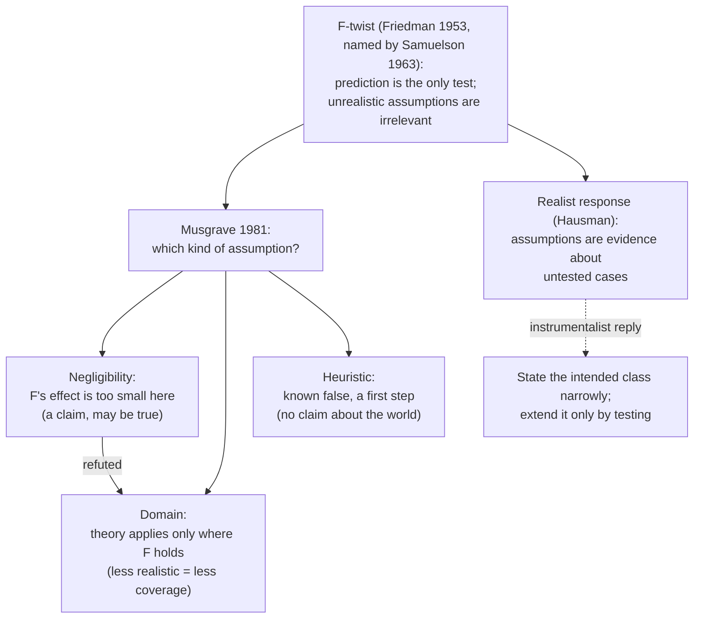

# Philosophy of Economics · Lesson 6.2: Friedman's "as if" and its critics

> ⏱ ~15 min · Module 6: What economic models explain · Builds on: [6.1 Idealization and isolation](06-01-idealization-and-isolation.md), [2.2 The behavioural challenge](02-02-the-behavioural-challenge.md) · Unlocks: [6.3 How-possibly models and credible worlds](06-03-how-possibly-models-and-credible-worlds.md)

## Why this matters

Tell an economist that firms do not compute marginal revenue, or that people do not discount exponentially, and the usual reply is "So what? The model predicts." That reply has a source: Milton Friedman's "The Methodology of Positive Economics" (in *Essays in Positive Economics*, University of Chicago Press, 1953), probably the most-read methodology essay economists have. It has also drawn more criticism than any other. This lesson reconstructs Friedman's argument and sorts the assumptions it defends by the job each one does. It then asks what the "so what" reply costs. The cost turns out to be specific: an instrumentalist can keep prediction, but must give up explanation and the welfare reading of preferences, and has to justify every extension to a new domain.

## The idea

The essay answered a live dispute. In the 1940s, surveys of business managers (Richard Lester's in the *American Economic Review*, 1946, is the best known) reported that firms priced by rules of thumb and did not equate marginal cost with marginal revenue. Critics concluded that marginalist theory was false. Friedman's reply, paraphrased:

- **Positive economics is judged by prediction.** A hypothesis is tested by whether its predictions hold for the class of phenomena it is meant to explain, and nothing else counts. Comparing its assumptions with "reality" is no test.
- **Good theories have false assumptions.** A hypothesis explains much by little. It abstracts a few common elements from a mass of detail, so its assumptions are bound to be descriptively false. Friedman pressed this into a provocation: the more significant the theory, the more unrealistic its assumptions.
- **"As if."** The leaves on a tree are distributed *as if* each leaf sought the sunlight and moved freely to get it. An expert billiard player shoots *as if* he knew the equations of mechanics. Firms behave *as if* they maximized expected returns, and a selection argument says why: firms that behave otherwise lose money and shrink or exit. (Armen Alchian had given the selection argument in the *Journal of Political Economy*, 1950.)
- **Galileo's falling bodies.** The law $s=\tfrac12 gt^2$ (distance fallen against time) assumes a vacuum. For a dense ball dropped from a roof it predicts well anyway. For a feather it does not, which shows that whether an assumption is good enough depends on what it is used for.

Paul Samuelson named the core thesis the **[F-twist](../reference.md#f-twist)** (*American Economic Review* Papers and Proceedings, 1963). His label summarizes it as: a theory is vindicated if some of its consequences are empirically valid to a useful approximation, and the unrealism of its assumptions is irrelevant to its worth.

## The argument

**The F-twist, reconstructed.**

1. **P1.** The aim of a positive theory is accurate prediction of the phenomena in its intended class.
2. **P2.** A theory's worth is fixed entirely by how well it serves its aim.
3. **P3.** Whether the theory's assumptions are true does not affect how well it predicts, beyond what testing the predictions already reveals.

∴ **C.** The truth of a theory's assumptions is irrelevant to its worth. *In words:* if prediction is the only job, and false assumptions do not stop the job getting done, they do not matter.

This is **instrumentalism**: a theory is a tool for prediction, not a description of hidden causes. Its rival, **realism**, holds that a good theory gets the causal structure at least approximately right, so its assumptions are claims that can be true or false and that matter ([instrumentalism and realism](../reference.md#instrumentalism-and-realism); the general debate is [`philosophy-of-science`](../../philosophy-of-science/syllabus.md) 5.1-5.4).

**Musgrave's untwisting.** Alan Musgrave ("'Unreal Assumptions' in Economic Theory: The F-Twist Untwisted", *Kyklos*, 1981) argued that "assumption" covers three different claims, and Friedman's dictum fails for each in a different way ([Musgrave's assumption types](../reference.md#musgrave-assumption-types)).

- A **negligibility assumption** says a factor $F$ has an effect on the phenomenon too small to matter. "No air resistance" for the dropped ball means *air resistance is negligible here*. That claim is not unrealistic. It is a substantive claim that can be true, and here it is.
- A **domain assumption** says the theory applies only where $F$ holds. When a negligibility assumption is refuted (the feather), it becomes a domain assumption: the law holds only for dense bodies over short drops. The more unrealistic a domain assumption, the fewer cases the theory covers, so the less testable and significant it is. That is the reverse of Friedman's dictum.
- A **heuristic assumption** is known to be false and made to simplify a first step, to be dropped later. An example is treating a planet as if no other planet pulled on it, before adding the others. It makes no claim about the world, so it is neither realistic nor unrealistic.

*In words:* once you ask what an assumption *says*, the unrealistic ones turn out to be either true claims about smallness, limits on scope that cost the theory something, or temporary scaffolding. None of them is a false claim that the theory is better for.

**The realist response.** Daniel Hausman's essay "Why Look Under the Hood?" (in *Essays on Philosophy and Economic Methodology*, 1992) puts it with a used car. Nobody buying one rests content with a test drive when they can look under the hood. Predictions are tested on a small sample of circumstances, and the assumptions are evidence about how the model will do on the cases not yet tested. On this view P3 fails: knowing that a mechanism is wrong tells you where the predictions will fail next.

**Find the value judgment.** P1 and P2 are not empirical claims. They are a choice about what science is for. Once that choice is made, it fixes what counts as evidence. It is also why the F-twist is silent on welfare. Welfare economics needs preferences that really exist (as [1.1](01-01-welfarism-and-preference-satisfaction.md) says, satisfying them is supposed to make people better off). An "as if" utility function claims no such thing. It is a device that fits the choices, and fitting choices tells you nothing about what makes people better off.

**Where the argument is weakest.** P3, together with the word "intended" in P1. A critic says that every use of economics in policy takes a model somewhere it has not been tested: a new tax, a new market structure, a new era. In such cases the only guide to whether a model will still predict is whether its mechanism is right, so P3 is false exactly where economics is used. The instrumentalist replies that this only says the intended class should be stated narrowly and enlarged by testing. A realist reading of Friedman (Uskali Mäki's, in the 2009 Cambridge volume he edited on the essay's legacy) adds that much of the essay concerns negligibility, so Friedman is closer to Musgrave than the F-twist makes him look. The critic answers that a class of phenomena enlarged only by testing never licenses a forecast, which was the point of the exercise.

## Map of positions

Musgrave's arrow from negligibility to domain is the key move: a refuted assumption does not refute the theory, it shrinks its domain.

## Worked examples

**Example 1 (clean): price-taking in two markets.** Illustrative numbers, using the $n$-firm Cournot result of [`grad-micro` 6.2](../../grad-micro/lessons/06-02-oligopoly.md). Demand is $p=200-2Q$, where $p$ is price and $Q$ total output; every firm has marginal cost $c=40$. Suppose the market really is Cournot: firms choose quantities simultaneously, and each knows its output moves the price. The price-taking model ([`grad-micro` 4.1](../../grad-micro/lessons/04-01-partial-equilibrium-surplus.md)) assumes falsely that no firm can move the price. It predicts $p=c=40$ and $Q=(200-40)/2=80$ whatever the number of firms $n$.

Cournot gives markup $p-c=\dfrac{a-c}{n+1}=\dfrac{160}{n+1}$ and $Q=\dfrac{n}{n+1}\cdot 80$. Measure the price-taking error against the Cournot outcome:

| | Cournot $p$ | Cournot $Q$ | Price error $\frac{p-40}{p}=\frac{4}{n+5}$ | Quantity error $\frac{80-Q}{Q}=\frac1n$ |
|---|---|---|---|---|
| $n=2$ | 93.33 | 53.33 | 57.1% | 50.0% |
| $n=79$ | 42 | 79 | 4.8% | 1.3% |

The assumption is equally false in both markets: every Cournot firm has some market power. With 79 firms the power is too small to matter, so price-taking works as a **negligibility** assumption and predicts within 5%. With 2 firms the negligibility claim is refuted and becomes a **domain** assumption: the model applies only to markets with many small firms. Friedman can claim the first row. The second row is Musgrave's point. The model's falsity was the same in both, so the instrumentalist needs a way to tell in advance which row a new market is in. The usual answer is to count firms and check their market shares. That is a check of the assumption.

**Example 2 (hard): the behavioural challenge revisited.** [2.2](02-02-the-behavioural-challenge.md) showed that individuals reverse their choices in the way the beta-delta model predicts ([quasi-hyperbolic discounting](../reference.md#quasi-hyperbolic-discounting)). Friedman's reply runs as follows. The exponential model was never a claim about minds. If it predicts aggregate saving well, the reversals are irrelevant. The reply is coherent, but in this case it has a price.

- *Prediction.* An exponential discounter never pays to restrict her own future options. Commitment devices (savings accounts locked until a date, prepaid memberships) are a market phenomenon, and the as-if model predicts no demand for them. So the falsity shows up in a prediction. The instrumentalist must restrict the domain to markets without commitment products, which is Musgrave's conversion again. The alternative is a different as-if model, such as Gul and Pesendorfer's preferences over menus (cited in 2.2).
- *Welfare.* Suppose a model fits saving data equally well with exponential and with beta-delta preferences. Positive economics can be indifferent between them. A pension reform appraised for welfare cannot, because the two models disagree about whether the saver is making a mistake ([2.3](02-03-nudges-and-behavioural-welfare-economics.md)). The F-twist has nothing to say here. Where a choice affects welfare, the question of which mechanism is true comes back.

## Watch out

- **You might think the F-twist is an empirical claim, but actually it is a methodological norm.** "Firms do not compute marginal revenue" is empirical. "That does not matter" is a claim about what makes a theory good. Survey evidence can refute the first and cannot touch the second.
- **You might think "unrealistic" means "false", but actually it often means "incomplete".** Leaving out the colour of the billiard balls makes a model incomplete without making it false. Many of Friedman's examples are of this kind, which is part of why Mäki reads him as a realist.
- **You might think good predictions show the assumptions are harmless everywhere, but actually they show it only in the domain tested.** Example 1's price-taking assumption did well at $n=79$ and badly at $n=2$, with no change in how false it was.

## One-liner

> Friedman's F-twist says only predictions count, so false assumptions are irrelevant; Musgrave shows that "assumption" covers negligibility claims (which can be true), domain limits (which cost coverage) and heuristic steps (which claim nothing); and the instrumentalist who keeps prediction must give up explanation, the welfare reading of preferences, and any untested extension.

## Problems

**P1 (🟢) *(Exegetical, strict.)*** An **invented** growth textbook introduces a Solow model ([`grad-macro` 2.1](../../grad-macro/lessons/02-01-solow-model.md)) with these four sentences. For each, say whether it is a **negligibility**, **domain** or **heuristic** assumption in Musgrave's sense, with the deciding words. One line each.

> (i) "We first treat population as constant; section 3 lets it grow at rate $n$."
> (ii) "Wear on machines varies a little with their age, but for steady-state income this changes our answer by under one percent, so we use a single depreciation rate."
> (iii) "The model is for closed economies; where capital crosses borders freely, it does not apply."
> (iv) "Our test of the model's cross-country predictions showed that the effect of trade on capital per worker, which we had set aside as negligible, is large in small open economies; we therefore restrict the model to large economies."

**P2 (🟡) *(Exegetical (a) · Evaluative (b).)*** An **invented** reply from a modeller to a critic, not the words of any real person:

> "Yes, our households live forever and know the whole future path of interest rates. No household does. But the model forecasts how consumption responds to rate changes better than any rival we have tried, so the realism of its households is beside the point."

(a) Reconstruct the reply as three premises and a conclusion, matching it to the F-twist. (b) Flag the weakest premise and give the strongest objection to it and the best reply, any verdict. 150 words or fewer.

**P3 (🔴, optional) *(Formal (a)–(b) · Evaluative (c).)*** Illustrative numbers. Demand is $p=120-2Q$ and marginal cost is $c=40$; suppose the market is in fact $n$-firm Cournot. (a) Give the price-taking prediction of $p$ and $Q$, and the Cournot $p$ and $Q$ for $n=3$ and $n=19$, with the price error $(p-40)/p$ for each. (b) Find the smallest $n$ for which the price-taking prediction of price is in error by less than 5%. (c) An instrumentalist says the price-taking model is "good for markets of 38 or more firms". Is that a negligibility or a domain claim, and what must she check about a new market before using the model there? Two sentences.

Solutions

**P1** *(Exegetical, strict)*

**Must hit, strict:**

- (i) **Heuristic**: "first … section 3 lets it grow" marks a known falsehood used as a first step, to be dropped later.
- (ii) **Negligibility**: "changes our answer by under one percent" claims the factor's effect is too small to matter for this phenomenon.
- (iii) **Domain**: "it does not apply" where capital is mobile limits the theory's scope.
- (iv) **Domain**, reached from a refuted negligibility assumption: "set aside as negligible … is large … we therefore restrict". This is Musgrave's conversion.

**Wrong turns:** calling (ii) heuristic because the single rate is a simplification; it is a simplification *justified by a smallness claim*, and that makes it negligibility. Calling (iv) negligibility because the word appears; the assumption was negligibility before the test and is a domain restriction after it.

**Model answer:** (i) heuristic; (ii) negligibility; (iii) domain; (iv) domain, converted from a refuted negligibility assumption.

---

**P2** *(Exegetical (a) — strict · Evaluative (b) — graded on moves, not verdict)*

**Must hit, strict (a):**

- P1: the model's aim is to forecast how consumption responds to interest-rate changes (prediction within an intended class).
- P2: a model is to be judged by how well it achieves its aim, here against rival models.
- P3: the false assumptions (infinitely lived, perfectly foresighted households) do not reduce its forecasting performance.
- C: the falsity of the assumptions is irrelevant to the model's worth. This is the F-twist, with "better than any rival" making P2 comparative.

**Must hit, any verdict (b):**

- Flag P3, or the restriction of the aim in P1. P2 is the less natural choice and needs an argument that prediction is not the only aim.
- The objection at full strength: the forecasts were tested on past rate changes. Policy uses the model where it has not been tested, and the false mechanism is the best evidence of where it will fail. Perfect foresight is the obvious candidate, for example after an unannounced or unprecedented change.
- The reply: restrict the intended class to rate changes like those tested, and extend it only as tests come in. Or reread the assumption as negligibility: foresight errors average out in the aggregate response. That reading is a substantive claim, and it can be tested.

**Wrong turns:** attacking the conclusion by saying the assumptions are false. The modeller grants this. Treating "better than any rival" as settling the matter; a comparative win in the tested domain says nothing about untested ones.

**Model answer (b), one of several:** P3 is weakest. It holds for the rate changes the model was tested on, but a central bank consults the model before changes that have not happened yet. For those, the households' perfect foresight is a claim about the mechanism, and it fails most where policy is new. So the falsity of the assumption predicts where the forecasts will break. The modeller's best reply is Musgrave's: read foresight as a negligibility claim (individual forecast errors wash out in the aggregate) and test that directly, or confine the model to familiar rate changes. Either way the reply has stopped treating the assumption as irrelevant. It has become a claim to be checked.

---

**P3** *(Formal (a)–(b) — strict · Evaluative (c) — graded on moves, not verdict)*

(a) Price-taking: $p=c=40$, $Q=(120-40)/2=40$.

Cournot: markup $\dfrac{a-c}{n+1}=\dfrac{80}{n+1}$, $Q=\dfrac{n}{n+1}\cdot40$.

- $n=3$: markup $80/4=20$, so $p=60$; $Q=\tfrac34\times40=30$. Price error $20/60=33.3\%$.
- $n=19$: markup $80/20=4$, so $p=44$; $Q=\tfrac{19}{20}\times40=38$. Price error $4/44=9.1\%$.

(b) Price error $=\dfrac{80/(n+1)}{40+80/(n+1)}=\dfrac{80}{40n+120}=\dfrac{2}{n+3}$. Need $\dfrac{2}{n+3}<0.05$, so $n+3>40$ and $n>37$. The smallest is $n=38$: $2/41=4.9\%$. (At $n=37$ the error is $2/40=5.0\%$ exactly.)

**Must hit, strict (a)–(b):** 40 and 40 for price-taking; $p=60$, $Q=30$, error 33.3% at $n=3$; $p=44$, $Q=38$, error 9.1% at $n=19$; $n=38$.

**Must hit, any verdict (c):**

- It is a **domain** claim: the model applies only to markets with at least 38 firms. Within that domain it treats each firm's market power as negligible.
- Before using it she must check that the new market satisfies the domain condition, by counting firms and checking that no few firms hold large shares, and that it is Cournot-like rather than collusive. That is a check on the truth of the assumptions, which the F-twist said was irrelevant.

**Wrong turns:** measuring the error against the price-taking price (dividing by 40 instead of $p$), which gives $n=40$; accept that if the reader says so explicitly. Calling (c) heuristic; nothing is dropped later.

**Model answer (c), one of several:** It is a domain claim: the model is said to hold only for markets with 38 or more firms, where each firm's power over price is negligible. Before using it, she has to establish that the new market has many firms of small share competing rather than colluding. That is, she has to check whether an assumption is realistic.

## Flashback

**From Lesson [5.5](05-05-hayek-knowledge-order-and-the-mirage-of-social-justice.md) (Hayek: knowledge, order, and the mirage of social justice):** *(Exegetical (a)–(c).)* An **invented** op-ed by a fictional columnist, not the words of any real person:

> "(i) No wage board could ever gather what millions of buyers and sellers know about which skills are scarce this year; prices do that for us. (ii) So when streaming took off, and projectionists' pay fell while video editors' pay rose, no one was treated unjustly. (iii) No one planned that shift, so no one is responsible for it, and the state has no business helping the projectionists."

(a) What does sentence (i) establish, and which premise of Hayek's argument does (ii) need that (i) cannot supply?
(b) Which part of (iii) would Hayek accept, which part would he reject, and why?
(c) Name two replies from the lesson that deny different premises behind (iii), and say what each says about the projectionists.

**Two sentences per part.**

Solution

**Must hit, strict (a):** (i) is the knowledge problem, an empirical-epistemic claim: dispersed knowledge is carried by prices and no board could replace them. It supports the claim that rewards must follow value (C2's signal argument), and at most the unforeseeability premise (P3). (ii) is C1, which also needs the conceptual premise P1, that justice is a property only of the conduct of persons or of rules of conduct; the knowledge problem cannot establish what justice applies to.

**Must hit, strict (b):** Hayek accepts "no one planned that shift, so no one is responsible for it": that is P3 to P4 of his argument. He rejects "the state has no business helping": he endorsed a guaranteed minimum income outside the market, as insurance against misfortune, provided it does not try to tie rewards to desert. Help is permitted; help justified as remedying an injustice is not.

**Must hit, strict (c):** any two of the three, each tied to its premise:

- **Young (structural injustice)** denies P1: if blameless market processes predictably leave groups like displaced workers deprived, there is a wrong without a wrongdoer, and everyone who sustains and benefits from the process shares forward-looking responsibility for changing it.
- **Rules judged by predictable patterns** denies P3 as Hayek needs it: no one foresaw *this* shift, but that technological change regularly falls on workers in declining trades is foreseeable, and keeping rules with that incidence is an act someone can be asked to justify.
- **Rawls (basic structure)** also denies P3 as Hayek needs it: the choice of rules is still a choice, and the question is whether the rules can be justified to those, like the projectionists, who fare worst under them.

**Wrong turns:** in (a), saying Hayek rejects the inference in (ii): he accepts the conclusion, by a different route. In (b), reading Hayek as opposed to all aid. In (c), answering with desert or luck egalitarianism, which grants that markets reward value and objects to that; it does not deny a premise behind (iii). Pairing Rawls and the rule-judging reply as the "two different premises": both deny P3.

**Model answer:** (a) Sentence (i) shows only that no board could match prices as carriers of dispersed knowledge, which supports rewarding value and at most P3. Sentence (ii) needs P1, the conceptual claim that only conduct can be unjust, which no fact about knowledge supplies. (b) Hayek accepts that no one is responsible for an unplanned pattern, since that is P3 to P4. He rejects the ban on help, because he endorsed a minimum income outside the market, so long as it is insurance and not a reward for desert. (c) Young denies P1: a blameless process that predictably deprives displaced workers is unjust without a wrongdoer, and all who sustain it share responsibility for changing it. The rule-judging reply denies P3: the incidence of technological change on declining trades is foreseeable, so keeping the rules that produce it is a choice that must be justified to the projectionists.

## Connections

- **Backward:** [6.1](06-01-idealization-and-isolation.md) read a false assumption as an isolation of a real tendency, which is a realist reading. Friedman is the instrumentalist alternative. [2.2](02-02-the-behavioural-challenge.md) supplied the anomalies that Example 2 tests the F-twist against, and its "misspecified model" rival is the instrumentalist's natural ally. The welfare cost in Example 2 is [1.1](01-01-welfarism-and-preference-satisfaction.md)'s welfarism, which needs preferences that really exist.
- **Forward:** [6.3](06-03-how-possibly-models-and-credible-worlds.md) asks what the realist must answer in turn: how a model whose assumptions are known false could *explain*, and not merely predict.
- **Sideways:** instrumentalism, realism and van Fraassen's constructive empiricism in general are [`philosophy-of-science`](../../philosophy-of-science/syllabus.md) 5.1-5.4, where 5.4 cites this lesson. The Cournot numbers rest on [`grad-micro` 6.2](../../grad-micro/lessons/06-02-oligopoly.md). The representative firm in [`grad-micro` 3.4](../../grad-micro/lessons/03-04-aggregation-and-the-firm.md) is an "as if" device of a different kind: it is an exact theorem, not an approximation.
