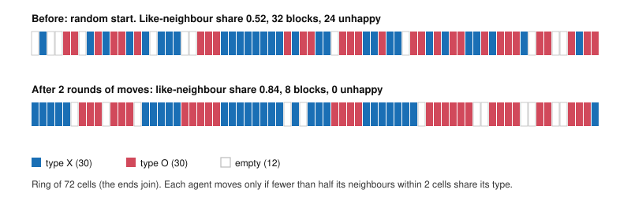

# Philosophy of Economics · Lesson 6.3: How-possibly models and credible worlds

> ⏱ ~15 min · Module 6: What economic models explain · Builds on: [6.1 Idealization and isolation](06-01-idealization-and-isolation.md), [6.2 Friedman's "as if" and its critics](06-02-friedmans-as-if-and-its-critics.md) · Unlocks: [`philosophy-of-science`](../../philosophy-of-science/syllabus.md) Module 4

## Why this matters

Two of the most celebrated models in social science predict almost nothing and assume plainly false things. Thomas Schelling's segregation model puts identical agents on a checkerboard; George Akerlof's lemons market has one good, one hidden quality and no warranties. Neither earns its fame the way [6.2](06-02-friedmans-as-if-and-its-critics.md)'s Friedman demands, by forecasting well, and neither isolates a real cause in the way [6.1](06-01-idealization-and-isolation.md)'s Mäki describes, at least not obviously. Yet economists say both *explain*. This lesson asks what they could explain, and meets the argument that they cannot explain anything at all.

## The idea

**Two questions an explanation can answer.** A *how-actually* explanation says what in fact produced a phenomenon. A *how-possibly* explanation shows only that a mechanism *could* produce it, which matters when people believed it couldn't ([how-possibly explanation](../reference.md#how-possibly-explanation)). The distinction goes back to William Dray (*Laws and Explanation in History*, 1957) and was later used heavily in biology.

**Schelling's model** ("Dynamic Models of Segregation", *Journal of Mathematical Sociology*, 1971). Two types of agent live on a line or grid. Each is content if at least some fraction $\tau$ of its neighbours share its type, and moves if not. Nobody wants a segregated neighbourhood; many would happily be in a minority. Run it and the population sorts itself into large single-type blocks ([Schelling segregation model](../reference.md#schelling-segregation-model)). The lesson: segregation at the level of the whole does not require segregationist preferences at the level of the individual.

**Minimal models.** Till Grüne-Yanoff ("Learning from Minimal Economic Models", *Erkenntnis*, 2009) calls models like this *minimal*: they make no claim to represent any actual mechanism, yet we learn from them ([minimal model](../reference.md#minimal-model)). What we learn is modal. Before Schelling, a reasonable person could hold the *impossibility hypothesis* that marked segregation needs strong preferences for one's own type. The model refutes it. That changes what we should believe about the world without saying anything about what actually happens in any city.

**Credible worlds.** Robert Sugden ("Credible Worlds: The Status of Theoretical Models in Economics", *Journal of Economic Methodology*, 2000), using exactly these two models, offers a bolder reading. A model is a constructed world, parallel to ours, not a simplified description of it. Its value lies in being *credible*: its agents behave in ways we recognize, its mechanism is coherent, so it could be true, as a realistic novel could be ([credible worlds](../reference.md#credible-worlds)). We then reason *inductively* from model world to real world, as a biologist reasons from mice to humans: if the mechanism produces segregation there, and segregation is seen here, perhaps the same mechanism is at work. Contrast Mäki's isolation view from [6.1](06-01-idealization-and-isolation.md) ([isolation](../reference.md#isolation)): for Mäki the model is a *true* description of a real cause shielded from others; for Sugden it is a fiction we find believable.

## The argument

The case that a false model can explain, reconstructed:

1. **The model world exhibits a mechanism.** In model $M$, mechanism $m$ (mild like-type preferences plus moving) produces phenomenon $P$ (segregated blocks).
2. **The model world is credible.** $m$ operates in $M$ in a way that could operate in the real world.
3. **$P$ is observed in the real world.**
4. **Inductive step.** When a credible mechanism yields an observed phenomenon, it is a candidate cause of it.

∴ **C1.** $m$ is a *how-possibly* explanation of real $P$.

5. **Upgrading needs evidence.** To say $m$ *actually* produced $P$ here requires showing $m$ operates here, at sufficient strength, and that rival mechanisms do not account for $P$ instead.

∴ **C2.** A how-actually claim needs causal evidence the model cannot supply. *In words:* the model nominates a suspect; it does not convict. Convicting is the job of causal inference ([`econometrics` 3.1](../../econometrics/lessons/03-01-potential-outcomes-identification.md)): what would segregation have been had preferences, or lending rules, been different?

**Reiss's challenge.** Julian Reiss ("The Explanation Paradox", *Journal of Economic Methodology*, 2012) argued that three widely held claims are jointly inconsistent ([explanation paradox](../reference.md#explanation-paradox)):

- **(R1)** Economic models are false.
- **(R2)** Economic models are nevertheless explanatory.
- **(R3)** Only true accounts explain.

Something must go. *Deny R1:* the isolation account says a model is true of the cause it isolates, false only about what it leaves out. *Deny R3:* how-possibly and credible-world accounts say a potential explanation already explains something. *Deny R2:* models are heuristic tools that generate hypotheses, and only the empirical work explains. Reiss himself argued that none of the escapes he examined succeeds and the paradox is genuine; a 2013 symposium in the same journal debated the replies. R3 is where general theories of explanation enter. On the deductive-nomological model the explanans must be true; causal and interventionist accounts ask what difference-makers a model identifies; unification accounts ask how much it brings under one pattern (all cited to [`philosophy-of-science`](../../philosophy-of-science/syllabus.md) 4.1-4.3). Which account you hold largely fixes which claim you drop.

**Find the value judgment in the technique.** The technique here is the model, and the smuggled premise is epistemic before it is ethical. The step from "could" to "did" is premise 5, and a policy argument that skips it is dressing a how-possibly result as a how-actually claim, and then as a normative one: "segregation comes from preferences, so no exclusionary rule is to blame."

**Where the argument is weakest.** Premise 2 together with 4. A critic asks what "credible" adds. Credibility is a judgment about the model, made by economists trained to find such models natural; why should that feeling track how the world works? Without a stated similarity relation between model and target, the inductive step has no warrant, and supplying one tends to turn credible worlds back into isolations, with all of 6.1's questions about which assumptions distort. Sugden's defenders reply that every inductive inference rests on judgments of relevant similarity, and that the mouse-to-human inference is no better grounded in principle.

## The picture

One run of a Schelling ring, simulated for this lesson: 30 agents of each type and 12 empty cells, each agent looking 2 cells either side, threshold $\tau=\tfrac12$.

## Worked examples

**Example 1 (clean): Schelling on a ring.** Take the figure's set-up. An unhappy agent (fewer than half its occupied neighbours like it) moves to the nearest empty cell where it would be content. Measure segregation by the *like-neighbour share*: each agent's fraction of occupied neighbours of its own type, averaged over agents. Under random placement it sits near one half.

Averaged over 300 random starts, the like-neighbour share rises from 0.49 to 0.84, and the number of single-type blocks around the ring falls from about 30 to 8. With $\tau=\tfrac14$ (content even as a one-in-four minority) it still rises, to 0.61. Note what no agent wants: at $\tau=\tfrac12$, a perfectly alternating pattern $XOXO\ldots$ would leave each agent with exactly half its four neighbours alike, content. The integrated arrangement satisfies everyone; the dynamics do not find it.

What this establishes is modal: segregation of this degree *can* arise from preferences this mild. That refutes the impossibility hypothesis. It says nothing about the strength of preferences in any real city.

**Example 2 (hard): the lemons model as a credible world.** Akerlof's mechanism ([lemons model](../reference.md#lemons-model); derived in [`grad-micro` 5.1](../../grad-micro/lessons/05-01-adverse-selection-lemons.md)): if only sellers know quality, the price buyers offer reflects the average car on sale, owners of good cars withdraw, and trade with gains on both sides can vanish. A two-type version, illustrative, in thousands of dollars: good cars worth 10 to sellers and 12 to buyers, lemons worth 4 and 5. If half the cars are good, a buyer values a random car at $0.5(12)+0.5(5)=8.5<10$, so good cars leave and only lemons trade; the gain of 2 per good car is lost. If four-fifths are good, $0.8(12)+0.2(5)=10.6\ge 10$ and all cars trade. The threshold share is $\lambda^*$ solving $12\lambda+5(1-\lambda)=10$, so $\lambda^*=\tfrac57\approx 0.71$.

Why is this hard? The minimal reading is secure: mutually beneficial trade can collapse without fraud, irrationality or monopoly, which many economists in 1970 would have doubted. The credible-worlds reading reaches further, to real markets, and there the numbers bite: whether unravelling happens depends on the share of good goods and on how far buyers' and sellers' valuations differ, which the model leaves free. A claim about a real market must estimate those, and must rule out rival explanations of thin trade such as transaction costs or fixes the model omits (warranties, inspection, reputation). The model tells you which parameters to go and measure. It does not measure them.

## Watch out

- **You might think "how-possibly" is a weaker how-actually.** It answers a different question. Its target is an impossibility or necessity belief; it can be decisive against that belief while silent about any real case.
- **You might think a model that explains must predict.** That is Friedman's standard from [6.2](06-02-friedmans-as-if-and-its-critics.md). Schelling's model makes no usable forecast of any city's map; its claim to explain rests on credibility or isolation, not on predictive success.
- **You might think "segregation can arise from mild preferences" shows that it does.** That turns a modal claim into an empirical one, and often then into a normative one about who is responsible. Keep the three apart: the model establishes the first, causal evidence is needed for the second, and the third needs an ethical premise as well.

## One-liner

> A model with false assumptions can still show how something *could* happen, refuting the belief that it couldn't; whether it shows how something *did* happen depends on what makes its world credible, and Reiss's paradox makes you choose which of falsity, explanatoriness or the truth requirement to give up.

## Problems

**P1 (🟢) *(Formal (a), (b) · Exegetical (c).)*** Ten agents sit on a ring (position 10 is next to position 1): $X\,X\,O\,X\,O\,O\,X\,O\,X\,O$ at positions 1 to 10. Each agent's neighbours are the two adjacent agents; an agent is content if at least half its neighbours share its type.

(a) Give each agent's like-neighbour share, the average share, and the list of unhappy agents.
(b) The agents at positions 3 and 7 swap places. Recompute the average share and the unhappy list.
(c) In two sentences: what kind of explanation could a full simulation along these lines provide, and of what?

**P2 (🟡) *(Exegetical.)*** An **invented** methodology preface, not the words of any real author:

> "(i) Our models are not false: each is a true account of one causal factor acting in isolation. (ii) And even where a model's world is unlike ours, showing how an outcome could arise already explains something. (iii) Strictly, of course, models explain nothing; they are tools for generating hypotheses that empirical work then tests."

For each sentence, say which of Reiss's three claims it gives up, and the price of giving it up. One sentence per part.

**P3 (🔴, optional) *(Evaluative.)*** An **invented** city report: "Residential segregation in Riverton is the product of mild preferences, as Schelling showed. No exclusionary practice is needed to explain it, so none needs remedying." Assess whether Schelling's model can bear the explanatory weight the report puts on it. 150 words or fewer. Any verdict passes.

Solutions

**P1** *(Formal (a), (b), strict · Exegetical (c), strict.)*

(a) Shares, positions 1 to 10: $\tfrac12,\tfrac12,0,0,\tfrac12,\tfrac12,0,0,0,0$. For example, position 3 ($O$) has neighbours $X$ and $X$, share 0; position 5 ($O$) has $X$ and $O$, share $\tfrac12$. Average $= (4\times\tfrac12)/10 = \tfrac15$. Unhappy: 3, 4, 7, 8, 9, 10.

(b) The ring becomes $X\,X\,X\,X\,O\,O\,O\,O\,X\,O$. Shares: $\tfrac12,1,1,\tfrac12,\tfrac12,1,1,\tfrac12,0,0$. Average $= 6/10 = \tfrac35$. Unhappy: 9 and 10.

**Must hit, strict (a), (b):** average $\tfrac15$ with six unhappy (3, 4, 7, 8, 9, 10); after the swap, average $\tfrac35$ with two unhappy (9, 10).

**Must hit, strict (c):** a how-possibly (or minimal-model) explanation; of how sorting into blocks can emerge from preferences that do not demand segregation, refuting the belief that segregation requires strong preferences. Not a how-actually explanation of any real pattern.

**Wrong turns:** forgetting that the ring wraps, so position 10 neighbours position 1. Reading (c)'s answer as "it shows people prefer segregation": the point is the reverse.

**Model answer:** (a), (b) as above. (c) It would give a how-possibly explanation: it shows that segregated blocks can arise from agents content to be in a half-and-half neighbourhood. That refutes the belief that segregation needs segregationist preferences, without showing what produced segregation anywhere real.

---

**P2** *(Exegetical, strict.)*

**Must hit, strict:**

- (i) gives up R1 (models are false): the isolation account; its price is having to show the isolated factor is real and that the idealizations used to isolate it do not distort it (the burden from [6.1](06-01-idealization-and-isolation.md)).
- (ii) gives up R3 (only true accounts explain): how-possibly or credible-world explanation; its price is a weaker notion of explanation, and a need to say why a potential explanation tells us anything about this world.
- (iii) gives up R2 (models explain): the heuristic view; its price is conceding that celebrated models explain nothing, which clashes with how economists use and credit them.

**Wrong turns:** reading (ii) as denying R1: it concedes the model's world is unlike ours. Reading (iii) as denying R3: it accepts that explanation needs truth and so denies models the title. Noticing that the preface is inconsistent is fine, but the question asks for each sentence's move.

**Model answer:** (i) drops R1, at the cost of showing that the isolated cause is real and undistorted by the idealizations. (ii) drops R3, at the cost of saying why a merely possible explanation counts as one. (iii) drops R2, at the cost of saying Schelling and Akerlof explained nothing.

---

**P3** *(Evaluative, graded on moves.)*

**Must hit, any verdict:**

- Separate how-possibly from how-actually: Schelling shows mild preferences *can* produce segregation; the report claims they *did* in Riverton.
- Say what the upgrade needs: evidence on Riverton's actual preferences and moving behaviour, and on rival mechanisms (exclusionary lending, zoning, steering), ideally causal evidence of what would have happened without them.
- Name the further slide: from an empirical cause to the normative conclusion that nothing needs remedying, which needs an extra premise (that preference-driven outcomes call for no remedy, or that no rule contributed).
- Give the best case for the report (a credible-worlds inference is a real inductive step; the model shifts the burden onto those who allege exclusion) and say what it turns on.

**Wrong turns:** asserting real-world facts about segregation as if settled. Dismissing the model because its assumptions are false: false assumptions do not stop it supporting a how-possibly claim. Treating "both mechanisms may operate" as a resolution without saying how to apportion them.

**Model answer, one of several:** The report needs a how-actually claim, and Schelling supplies a how-possibly one. His model refutes the belief that segregation requires strong preferences; it is silent on whether Riverton's segregation came from preferences, from exclusionary lending or zoning, or both. On Sugden's view the model makes the preference mechanism a credible candidate, and perhaps shifts some burden to anyone alleging exclusion; but the inductive step needs evidence that Riverton's residents have such preferences and move on them, and that the rival mechanisms were absent or weak. Even granting that, "so none needs remedying" adds a normative premise the model cannot provide. The verdict turns on the evidence the report omits, not on the model.

## Flashback

**From Lesson [6.1](06-01-idealization-and-isolation.md) (Idealization and isolation):** *(Formal (a) · Exegetical (b).)* Illustrative numbers. A textbook trade model assumes goods move between two regions at zero transport cost. Region A produces cement at 40 dollars a tonne and steel at 400; region B produces cement at 55 and steel at 410. In fact shipping either good from A to B costs 12 dollars a tonne. The question $Q$: which region supplies each good to region B's buyers? (a) Give the model's answer for each good, then the delivered price of A's good in B and the answer once the 12 dollars is added back. (b) Using Lesson 6.1's two-condition test, say for which good the zero-cost idealization is harmless for $Q$ and for which it fails, and why the size of the distortion does not decide it. Three sentences.

Solution

(a) Model: A is cheaper in both goods ($40<55$, $400<410$), so A supplies both. With transport: cement from A costs $40+12=52<55$ delivered, so A still supplies cement; steel from A costs $400+12=412>410$, so B supplies its own steel.

**Must hit, strict (b):**

- Cement: harmless for $Q$. De-idealizing leaves the answer unchanged, and the delivered price moves by a computable correction of 12, condition (i).
- Steel: fails. De-idealizing reverses the answer, so the "correction" is the whole answer.
- Size does not decide it: the omitted cost is 30 percent of A's cement price and 3 percent of its steel price, yet the idealization fails for steel. What matters for this $Q$ is the omitted cost against the price gap (12 against 15, and 12 against 10).

**Wrong turns:** judging harmlessness by the distortion's share of the price, which gets both goods backwards. Concluding the model is refuted for steel: the cost-gap tendency still operates there (condition (ii) holds), and is outweighed by a disturbing cause, transport cost, in Mill's sense. Declaring the idealization harmless or harmful outright rather than for $Q$: the verdict is always relative to the question asked.

**Model answer:** For cement the zero-cost idealization is harmless for $Q$: adding back the 12 dollars leaves A as the supplier, and only shifts the delivered price by a computable amount. For steel it fails, because the delivered price of 412 exceeds B's 410 and de-idealizing reverses the answer. Size does not decide it, since the omitted cost is a tenth as large a share of the steel price as of the cement price; what decides it is how the omitted cost compares with the price gap the question turns on.

## Connections

- **Backward:** [6.1](06-01-idealization-and-isolation.md)'s isolation is one way to deny Reiss's R1; [6.2](06-02-friedmans-as-if-and-its-critics.md)'s instrumentalism ties explanation to prediction, which these models fail. The lemons model is [`grad-micro` 5.1](../../grad-micro/lessons/05-01-adverse-selection-lemons.md)'s.
- **Forward:** Boss problem 6 runs the lemons model through all three lessons of this module. General accounts of explanation are [`philosophy-of-science`](../../philosophy-of-science/syllabus.md) 4.1-4.3, and model realism its Module 5.
- **Sideways:** the step from how-possibly to how-actually is the identification problem of [`econometrics` 3.1](../../econometrics/lessons/03-01-potential-outcomes-identification.md). Models of collective action, whose aggregate outcomes no participant chose, are the staple of [`political-economy`](../../political-economy/syllabus.md).

## Closing the course

The course had one move: find the value judgment inside the technique, and keep empirical, conceptual and normative claims apart while you do.

- **Module 1, welfare:** every welfare metric chooses a theory of well-being; WTP weights people by wealth, happiness data split into feeling, memory and judgment, and a capabilities index hands the hard choices to its list, weights and aggregation.
- **Module 2, choice:** consistent choice is not yet welfare; when choices conflict, a nudge must decide which self is really yours.
- **Module 3, efficiency:** Pareto is silent on every trade-off, compensation tests pretend the losers are paid, and CBA's money metric and equal weights are value judgments a VSL can disguise.
- **Module 4, discounting:** in $r=\delta+\eta g$, only $g$ is a forecast; pure time preference and $\eta$ are ethics, and so is choosing to read the rate off markets.
- **Module 5, markets:** the case against a market may target the market itself or the conditions it runs under; exploitation, desert and Hayek's denial that market outcomes can be unjust each turn on a premise about what justice applies to.
- **Module 6, models:** a false model can isolate a real cause, predict, or show what is possible; which it does decides what it explains.

Where next: explanation and realism in general in [`philosophy-of-science`](../../philosophy-of-science/syllabus.md); welfare functions and Harsanyi in [`decision-theory`](../../decision-theory/syllabus.md); the economics of welfare weights and taxes in [`public-economics`](../../public-economics/syllabus.md); and the politics behind collective choices in [`political-economy`](../../political-economy/syllabus.md).
