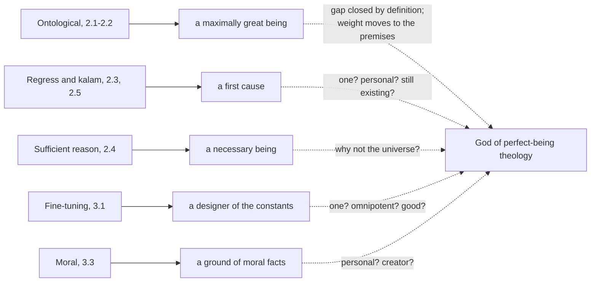

# Philosophy of Religion · Lesson 1.1: Which God, and what an argument must do

> ⏱ ~15 min · Module 1: The concept of God and the divine attributes · Builds on: [philosophical-method 1.3 Reconstruction and charity](../../philosophical-method/lessons/01-03-reconstruction-and-charity.md), [philosophical-method 2.4 Weighing evidence in odds form](../../philosophical-method/lessons/02-04-weighing-evidence-in-odds-form.md) · Unlocks: [1.2 Omnipotence and its paradoxes](01-02-omnipotence-and-its-paradoxes.md)

## Why this matters

This course asks whether the concept of God holds together (Module 1), whether arguments from pure reason or from the existence of anything at all reach God (Module 2), whether design, morality, experience or miracles count as evidence (Module 3), whether evil and divine hiddenness count against (Module 4), and whether belief needs arguments at all (Module 5). It takes no side, because [`apologetics-foundations`](../../apologetics-foundations/syllabus.md) builds an argued case for theism on top of it, and that case is only as good as the neutral statements it inherits. Aquinas's Ways inside his own metaphysics live in [`thomistic-synthesis`](../../thomistic-synthesis/syllabus.md); the attributes as Catholic dogma live in [`trinity-and-god`](../../trinity-and-god/syllabus.md).

Two questions come before any argument. *Which* God is at issue? And what would count as an argument *working*? Get either wrong and you will grade a successful argument a failure, or the reverse.

## The idea

A detective proves that someone with a key entered the flat. That is real progress, and it is not yet "the butler did it." Most arguments for God have this shape. Their conclusion is a first cause, a necessary being, a designer of the constants, a ground of moral facts. Whether that conclusion is *God* takes further work.

So fix the target first. The most common method for fixing it is **[perfect-being theology](../reference.md#perfect-being-theology)**: God is the greatest possible being, so God has every great-making property in the highest compossible degree. The formula is Anselm's: God is "a being than which nothing greater can be conceived" (*Proslogion* 2, Deane). Modern statements of the method include Thomas Morris, *Our Idea of God* (1991), and Katherin Rogers, *Perfect Being Theology* (2000). The method yields the standard list: omnipotent, omniscient, perfectly good, necessarily existent, creator of everything else.

The method does not settle *which* properties are great-making, and here perfect-being theists split.

- **[Classical theism](../reference.md#classical-theism)** (Augustine, Anselm, Maimonides, Aquinas) adds that God is **simple** (no parts, not even distinct properties), **immutable**, **impassible** (not acted on by creatures) and **timeless**. Change, parts and being affected are read as marks of limitation.
- **[Theistic personalism](../reference.md#theistic-personalism)** is Brian Davies's label (*An Introduction to the Philosophy of Religion*) for the view that God is a person in much the sense we are, only without limits: a being who knows, wills, and may respond in time. Swinburne (*The Coherence of Theism*, 1977) and Wolterstorff ("God Everlasting", 1975) hold God is everlasting rather than timeless, and Plantinga (*Does God Have a Nature?*, 1980) argues against simplicity. Many so labelled reject the label; "neoclassical theism" is a common alternative.

In words: both camps run the same method, and disagree about whether responsiveness is a perfection or a limitation.

This matters downstream. The ontological argument targets maximal greatness; the problem of evil targets power plus goodness; the foreknowledge argument ([1.3](01-03-omniscience-and-human-freedom.md)) bites differently on a timeless God; hiddenness ([4.5](04-05-divine-hiddenness.md)) targets a God who seeks relationship. An argument against one concept may miss another entirely.

**Is God-talk coherent at all?** A. J. Ayer (*Language, Truth and Logic*, 1936) argued that a sentence about a transcendent God is neither true by definition nor empirically checkable, so it is not false but meaningless. Antony Flew's "Theology and Falsification" (1950) pressed a milder version: a claim compatible with every possible observation asserts nothing. The common replies are that the verification principle fails its own test, and that words can be said of God by **analogy**, neither univocally nor equivocally ([thomistic-synthesis 4.4](../../thomistic-synthesis/lessons/04-04-analogy.md)). Few now hold the meaninglessness thesis. The live coherence questions are narrower: does each attribute make sense, and do they fit together? That is Module 1's job.

## The argument

Every argument for God can be split into two stages. Write $X$ for whatever the first stage concludes.

1. **Stage one.** An argument concludes that $X$ exists (a first cause, a necessary being, a designer). *In words:* this is where most of the literature fights.
2. **Stage two, the bridge.** Anything that is $X$ is (or probably is) God: one, personal, omnipotent, omniscient, perfectly good.
3. ∴ God exists (or probably exists).

This is **[the gap problem](../reference.md#the-gap-problem)**: step 2 is a separate argument with separate premises. Aquinas closes each of the Five Ways with a line like "and this everyone understands to be God" (*ST* I q.2 a.3, English Dominican Province); the Thomist reply is that this records how the word is used, and that qq.3–11 do the bridging work one attribute at a time ([thomistic-synthesis 3.1](../../thomistic-synthesis/lessons/03-01-demonstrating-that-god-exists.md)). Hume's Philo presses the gap against design: if men combine to build a ship, "why may not several deities combine in contriving and framing a world?" (*Dialogues* V).

**What counts as success.** Three standards, often confused:

- **Soundness.** Valid, with true premises. An argument can be sound and persuade no one.
- **Dialectical success.** It should move a reasonable person who does not already accept the conclusion. Oppy (*Arguing about Gods*, 2006) sets this bar at *every* reasonable person, and argues that no argument for *or* against God's existence meets it.
- **Probabilistic support** ([proof and probability](../reference.md#proof-and-probability)). Swinburne (*The Existence of God*) separates a **C-inductive** argument, whose premises raise the probability of the conclusion, from a **P-inductive** one, whose premises make it more probable than not. Most arguments in Module 3 aim only at the first.

Atheistic arguments split the same way: Mackie's logical problem of evil (1955) aims at proof, Draper's evidential argument at probability.

**Cumulative cases.** Several C-inductive arguments can jointly be P-inductive. In odds form ([philosophical-method 2.4](../../philosophical-method/lessons/02-04-weighing-evidence-in-odds-form.md)):

$$\frac{P(G \mid E_1 \wedge E_2)}{P(\neg G \mid E_1 \wedge E_2)} = \frac{P(G)}{P(\neg G)} \times L_1 \times L_2'$$

where $G$ is the hypothesis, $L_1 = \frac{P(E_1 \mid G)}{P(E_1 \mid \neg G)}$, and $L_2'$ is the ratio for $E_2$ *given* $E_1$. In words: ratios multiply cleanly only when each item is weighed given the ones already counted; two arguments that share a premise count once. A [cumulative case](../reference.md#cumulative-case) is a theist's method (Swinburne) and an atheist's (Draper, comparing theism with naturalism on the total evidence).

Module 4 meets the problem of evil, a reductio against theism, and each of the five reply types of [philosophical-method 4.1](../../philosophical-method/lessons/04-01-objections-and-replies.md) appears there.

**Where the argument is weakest.** The two-stage frame is accepted on both sides; the dispute is over how wide the gap is. A critic (Hume's Philo, Oppy) says stage two is where theistic arguments are thinnest: a first cause could be many, impersonal or indifferent, and each bridge needs premises as contestable as stage one. A defender says the critic assumes the bridge is an add-on. Classical theists argue that a first uncaused cause must be pure actuality and therefore simple, infinite and unique; Swinburne argues that a person with *no* limits is the simplest hypothesis, so stage one's evidence flows to the unlimited God rather than to a committee.

## The argument map

Solid arrows are stage one. Dashed arrows are the bridges each argument still owes; the labels are the questions a critic asks of them.

## Worked examples

**Example 1 (clean case: a first cause).** Grant a regress argument ([metaphysics 4.4](../../metaphysics/lessons/04-04-ordered-causal-series.md) supplies the per se series). What has been shown? That at least one uncaused cause exists. Not shown: that there is exactly one, since each series could end in a different first member (the quantifier slip flagged in [philosophical-method 1.4](../../philosophical-method/lessons/01-04-argument-forms-and-formal-fallacies.md)); that it is personal; that it is good; that it still exists. Two bridges are on offer. The Thomist: an uncaused cause has no unactualized potential, so it is pure act, hence simple, hence unique and unlimited. The Swinburnian: a hypothesis positing zero limits is simpler than one positing a specific finite power, so it is the better explanation. Oppy replies to both that the naturalist has a stopping point of equal simplicity, an initial physical state with no further cause. Every party now argues the bridge, not the regress.

**Example 2 (hard case: a cumulative case across different targets).** A design argument supports "a designer"; a moral argument supports "a moral ground." Can their ratios be multiplied as evidence for *God*? Only if each is computed for the same hypothesis $G$. Evidence that a designer exists is evidence for $G$ only to the extent $G$ predicts design better than its rivals, including a limited designer. And the problem of evil enters the same ledger, since it bears on $G$'s goodness, not on "a designer." A cumulative case for $G$ must carry every item, favourable or not, into one product.

## Watch out

- **You might think closing the gap is cheap, but** it is a full argument with premises of its own. Score stage one and stage two separately.
- **You might think an argument that persuades no atheist has failed, but** that is dialectical failure. Soundness and probabilistic support are separate questions.
- **You might think classical theists deny God is personal, but** most affirm God knows and wills. They deny that God is a person *univocally* with us, or one subject among others.

## One-liner

> Fix which God is meant, split the argument into reaching $X$ and showing $X$ is God, and say whether it claims proof, persuasion or only a raised probability.

## Problems

**P1 (🟢) *(Exegetical (a) · Evaluative (b))*** A student newspaper prints this (invented) op-ed:

> "Every chain of causes has to start somewhere. So there is a first cause of everything. A first cause has nothing before it, so it is eternal. Whatever made the whole universe must be all-powerful. And since the world is full of beauty, its maker is good. Science has now handed us the God of our grandparents."

(a) Name **three** places where a property is added that the previous step does not deliver, and for each say what is missing. (b) Choose one of your three, and give the best repair a defender would offer and the critic's reply to it. 120 words or fewer for (b).

**P2 (🟡) *(Exegetical (a) · Formal (b))*** (a) Classify each invented argument by the standard it aims at: soundness, dialectical success, C-inductive support, or P-inductive support. One line each.

- (i) "My premises are ones you, an agnostic, already accept. So you should accept that a necessary being exists."
- (ii) "Gratuitous suffering is logically incompatible with an omnipotent, perfectly good God. Gratuitous suffering exists. I grant most theists will reject my second premise, but it is true."
- (iii) "The fact that minds depend on brains is somewhat more expected if there is no God than if there is. That alone doesn't make atheism more likely than not."

(b) An atheist builds a cumulative case for naturalism $N$ over theism $G$. She grants prior odds $N : G$ of $1:4$. Three items have likelihood ratios $1.5$, $2$ and $2$. Compute the posterior odds and probability of $N$ if the ratios are independent. Then her critic shows the third item is fully predicted by the second, so its ratio given the second is $1$: recompute. Is the case P-inductive in either version?

**P3 (🔴, optional) *(Exegetical.)*** A classical theist and a theistic personalist both say God answers prayer. The personalist says: "So God changes: first God hears the prayer, then God acts." The classical theist says: "No. God timelessly wills that this good come about through this prayer." (a) Name the single premise about responsiveness one asserts and the other denies. (b) Name one consideration that would move one side, and say which side. 120 words or fewer in total.

Solutions

**P1** *(Exegetical (a) · Evaluative (b))*

**Accept:** any three of the gaps below, each with what is missing stated precisely.

**Must hit, strict (a):**

- "Every chain has a start" to "a first cause of everything": a quantifier slip. Each chain could start with a different first cause; uniqueness is not given.
- "Nothing before it" to "eternal": being uncaused does not by itself give having no beginning or no end, nor that it still exists.
- "Made the universe" to "all-powerful": enough power to produce this universe is not unlimited power.
- "World is beautiful" to "maker is good": aesthetic order is not moral goodness, and the evidence about goodness includes evil.
- "The God of our grandparents": personal, revealed and worshipped properties are nowhere argued (and "science has handed us" misdescribes a philosophical premise).

**Must hit, any verdict (b):**

- A repair a real defender gives (Thomist: pure act, hence unique and unlimited; Swinburne: an unlimited being is the simpler hypothesis; or a separate argument for goodness).
- The critic's reply aimed at the repair's own premise, not at stage one.

**Wrong turns:** attacking whether chains need a start at all, which is stage one, not a gap; treating "God of our grandparents" as the only gap.

**Model answer (b), one of several:** Gap: "all-powerful." Swinburne's repair: we must posit some power sufficient for the universe; infinite power is simpler than any particular finite amount, as zero or infinity is a simpler value than some particular finite figure, so the simplest adequate hypothesis is an omnipotent cause. Critic's reply (Oppy-style): simplicity is being judged inside a theistic framework; the naturalist's initial physical state, with exactly the powers it displays, is no less simple, and "infinite" power is a further posit the evidence does not require.

---

**P2** *(Exegetical (a) · Formal (b))*

**Must hit, strict (a):**

- (i) Dialectical success: it relies on premises the audience already accepts.
- (ii) Soundness: a deductive argument claimed true whether or not opponents grant the premise. (An atheistic argument, Mackie's shape.)
- (iii) C-inductive: it raises the probability of atheism, explicitly not past one half.

**Worked arithmetic (b):**

Independent:

$$\frac{1}{4} \times 1.5 \times 2 \times 2 = \frac{6}{4} = 3:2$$

so $P(N \mid E) = \frac{3}{5} = 60\%$. P-inductive.

With the third item's ratio given the second equal to $1$:

$$\frac{1}{4} \times 1.5 \times 2 \times 1 = \frac{3}{4}$$

so $P(N \mid E) = \frac{3}{7} \approx 43\%$. Not P-inductive, though still C-inductive: it raised $P(N)$ from $\frac{1}{5}$ to $\frac{3}{7}$. Each item alone is only C-inductive: the best alone gives odds $\frac{1}{2}$, probability $\frac{1}{3}$.

**Wrong turns:** reading odds $3:2$ as probability $\frac{3}{2}$ or $\frac{2}{3}$; dropping the third item's ratio to $0$ rather than $1$.

---

**P3** *(Exegetical.)*

**Must hit, strict (a):** the disputed premise is *genuine responsiveness requires a change in the responder: first hearing, then acting*. The personalist asserts it; the classical theist denies it, holding that God's single timeless act of will can include the prayer as part of why the good occurs. Credit for noting both agree prayer makes a difference to what happens.

**Must hit (b):** a real mover, side named. For example: a convincing account of how a timeless will can be *because of* a temporal prayer without change would move the personalist; an argument that "because of" between a prayer and a timeless will makes no sense without a before and after would move the classical theist.

**Wrong turns:** naming "God exists" or "prayer works" as the crux, which both accept; saying the classical theist denies God answers prayer.

**Model answer:** (a) Whether responding requires changing. The personalist says a response is an act that follows and depends on what it responds to, so God changes. The classical theist says God eternally wills this good *through* this prayer, so the prayer matters and God does not change. (b) A clear model of timeless dependence, as Boethian eternity tries to supply ([1.4](01-04-eternity-immutability-and-simplicity.md)), would move the personalist; a proof that dependence without succession is incoherent would move the classical theist.

## Connections

- **Backward:** stage one and stage two are [philosophical-method 1.3](../../philosophical-method/lessons/01-03-reconstruction-and-charity.md)'s numbered reconstruction applied to a two-step case; soundness is [philosophical-method 1.2](../../philosophical-method/lessons/01-02-validity-and-soundness.md)'s; the cumulative case is [philosophical-method 2.4](../../philosophical-method/lessons/02-04-weighing-evidence-in-odds-form.md)'s independence rule.
- **Forward:** [1.2](01-02-omnipotence-and-its-paradoxes.md)–[1.4](01-04-eternity-immutability-and-simplicity.md) test the attributes one at a time; [1.4](01-04-eternity-immutability-and-simplicity.md) is where classical theism's simplicity meets its strongest objections. Module 2's lessons each end with the gap; Module 3 states every argument in odds form.
- **Sideways:** what Catholic teaching says reason can reach, and what it leaves open, is [trinity-and-god 1.2](../../trinity-and-god/lessons/01-02-the-one-true-god-and-what-reason-can-reach.md) and [thomistic-synthesis 3.1](../../thomistic-synthesis/lessons/03-01-demonstrating-that-god-exists.md); Anselm's formula as a piece of history is [ancient-medieval-philosophy 6.1](../../ancient-medieval-philosophy/lessons/06-01-anselm-and-the-proslogion-as-history.md).
