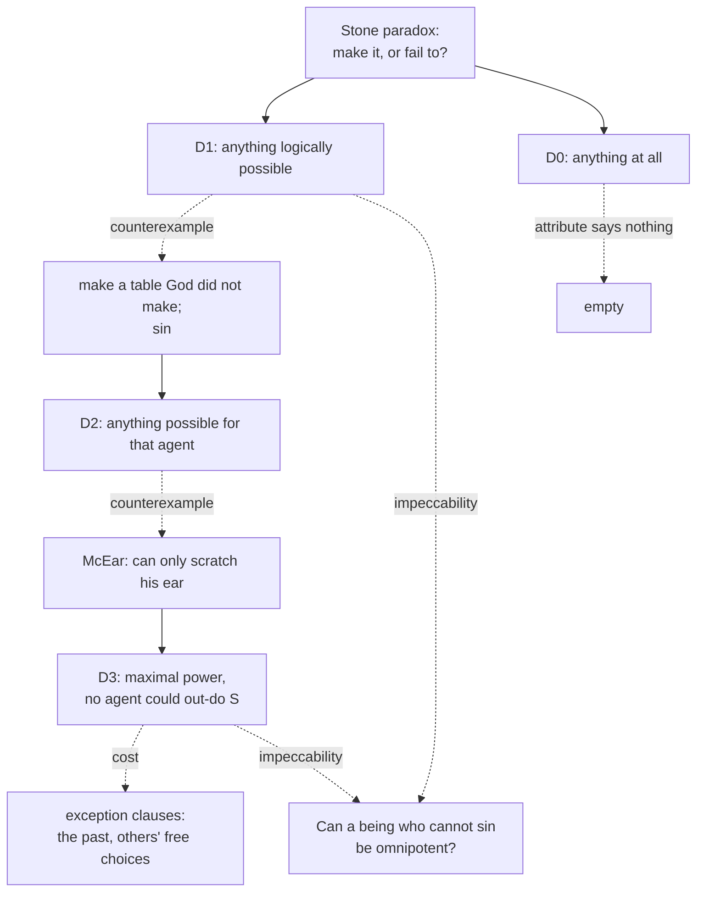

# Philosophy of Religion · Lesson 1.2: Omnipotence and its paradoxes

> ⏱ ~15 min · Module 1: The concept of God and the divine attributes · Builds on: [1.1 Which God, and what an argument must do](01-01-which-god-and-what-an-argument-must-do.md) · Unlocks: [1.3 Omniscience and human freedom](01-03-omniscience-and-human-freedom.md)

## Why this matters

[Perfect-being theology](../reference.md#perfect-being-theology) (1.1) says God has every great-making property to the maximal degree, and power is the first one on everyone's list. If "maximal power" turns out to be an incoherent notion, like "the largest integer", then the God of the arguments in Modules 2–4 is not a possible being, and no argument could reach Him. That is the **incoherence argument** strategy: refute theism without touching the evidence, by showing the concept fails.

This lesson takes the oldest test case. The real question is not whether the stone paradox can be answered (it can, several ways), but **what each answer costs**: every definition that survives it gives something up, and the bill comes due on another attribute.

## The idea

"Can God make a stone so heavy that He cannot lift it?" This is the [paradox of the stone](../reference.md#paradox-of-the-stone). Both answers seem to name something God cannot do. If He can make it, there is a stone He cannot lift. If He cannot make it, there is a stone He cannot make. Either way, not omnipotent.

You met the scholastic answer as an example of *distinguo* in [philosophical-method 3.2](../../philosophical-method/lessons/03-02-distinctions-and-verbal-disputes.md): "cannot" in the sense of *lacks the power*, denied; "cannot" in the sense of *the description picks out nothing to be done*, granted. This lesson asks whether that move is principled, and where it leads.

Two modern replies sharpen it. **George Mavrodes** ("Some Puzzles Concerning Omnipotence", 1963) says the task "make a stone an omnipotent being cannot lift" is a **pseudo-task**: given that the maker is omnipotent, the description is self-contradictory, so failing to do it is no more a limit than failing to draw a square circle. **C. Wade Savage** ("The Paradox of the Stone", 1967) does not assume omnipotence. He notes that "x cannot make a stone x cannot lift" means only that *whatever stone x can make, x can lift*, and that entails no limit on making or lifting.

Behind both lies a definition: **[omnipotence](../reference.md#omnipotence) is the power to do anything logically possible.** The rest of the lesson tests that definition and its successors.

## Source

Aquinas, *Summa Theologiae* I q.25 a.3 (English Dominican Province translation, public domain). Having rejected "whatever is possible to created nature" (too little) and "whatever is possible to His power" (circular), he grounds omnipotence in what is possible *absolutely*, where the predicate is not incompatible with the subject:

> Therefore, everything that does not imply a contradiction in terms, is numbered amongst those possible things, in respect of which God is called omnipotent: whereas whatever implies contradiction does not come within the scope of divine omnipotence, because it cannot have the aspect of possibility. Hence it is better to say that such things cannot be done, than that God cannot do them.

Two things to notice. First, the last sentence *is* Mavrodes's pseudo-task point, seven centuries early: the failure is located in the object, not the power. Second, "absolutely possible" is not the narrow logical possibility of a formal consistency check. Aquinas's examples (Socrates sitting; a man being a donkey) turn on natures, so his criterion is closer to what [metaphysics 3.1](../../metaphysics/lessons/03-01-kinds-of-necessity.md) calls conceptual or metaphysical possibility. That page warns that "logically possible" is used in both ways; hold every definition below to one.

## The argument

**The stone paradox** (standard formulation):

1. **Either God can make a stone God cannot lift, or God cannot.**
2. **If God can, there is a possible task God cannot do: lift that stone.**
3. **If God cannot, there is a possible task God cannot do: make that stone.**
4. **An omnipotent being can do every possible task.**
5. **So God is not omnipotent.**

*Where it turns:* P2 and P3 both assume the tasks are *possible* ones. Mavrodes denies this for P3 (for an omnipotent maker, "a stone its maker cannot lift" is contradictory). Savage denies that P3 states a limit at all: the inability is a consequence of unlimited lifting power, not a lack of making power.

The paradox therefore drives us to a definition. Here is the ladder of attempts, each with the counterexample that pushed people up the next rung.

- **D0. Can do anything at all, even the contradictory.** Descartes is often read this way (universal possibilism: God could have made twice four not equal eight). The stone is no problem, but the attribute then rules nothing out, and critics say it stops saying anything.
- **D1. Can do anything logically possible** (Aquinas's account, roughly). *Counterexample:* "make a table that God did not make" is consistent (carpenters do it), yet God cannot do it. So is "sin": humans do it; on most perfect-being views God cannot.
- **D2. Can do anything logically possible *for that agent* to do.** This absorbs the table. But Alvin Plantinga's **[McEar](../reference.md#mcear)** (*God and Other Minds*, 1967) breaks it: a being necessarily such that the only thing he does is scratch his ear. Everything possible for McEar he can do, so D2 calls him omnipotent.
- **D3. [Maximal power](../reference.md#maximal-power)** (Thomas Flint and Alfred Freddoso, "Maximal Power", 1983; related accounts by Hoffman and Rosenkrantz, and by Wierenga, *The Nature of God*, 1989). In simplified form: *S is omnipotent iff S can bring about any state of affairs that any agent could bring about in S's situation, holding fixed the past and what free creatures would freely do.* In words: no possible agent could out-do S. McEar fails it, since others can do more. The table and the past are excluded by the "holding fixed" clauses.

**Where the argument is weakest.** For the paradox itself, P3. Most philosophers, theist and atheist, take some version of the pseudo-task or Savage reply to answer it, though J. L. Cowan ("The Paradox of Omnipotence", 1965) argued that restricting omnipotence to logically possible tasks cannot. The live pressure is on what replaces it. A critic says D3's exception clauses are written to fit God and that a definition you need to patch for every counterexample is evidence the target concept is unstable. The defender replies that the clauses track something principled: no agent, however powerful, can change a fixed past or make *another's* free choice, so those are not limits on power, and the critic's demand for a clause-free definition holds omnipotence to a standard no ordinary concept ("knows", "causes") meets either.

## The argument map

Solid arrows move up the ladder of definitions; dashed arrows are the objection each definition faces. Impeccability presses on every rung.

## Worked examples

**Example 1 (clean case: the stone under D1 and D3).** Under D1, "make a stone God cannot lift" is a task only if it is possible. Given that God is essentially omnipotent, a stone too heavy for Him is like a married bachelor: there is nothing to make. Under D3 the question becomes: could *any* agent in God's situation bring about "there exists a stone its maker cannot lift"? A human can, by making a boulder. But no agent can bring about "there exists a stone *an omnipotent being* cannot lift", so D3 does not require it. Notice the shift: on D3 the paradox is answered by which *state of affairs* is specified, not by the logic of "can".

**Example 2 (hard case: impeccability).** This is where the bill comes due. The [impeccability](../reference.md#impeccability) argument:

1. **A perfect being is omnipotent.**
2. **A perfect being is essentially morally perfect, so cannot sin.**
3. **Sinning (lying, say) is something some agents can do.**
4. **A being that cannot do what some agent can do is not omnipotent.**
5. **So no being is both, and perfect-being theology is incoherent.**

Three replies, each denying a different premise:

- **Aquinas denies P3 as a statement of power.** In q.25 a.3 ad 2, to sin is "to fall short of a perfect action", so being able to sin is being able to fail, a liability rather than a power. God cannot sin *because* of omnipotence.
- **Nelson Pike** ("Omnipotence and God's Ability to Sin", 1969) **weakens P2.** "God" is a title, like "the champion": no one *holding the title* sins, but the individual who holds it has the power to and freely refrains. Pike adds that this is needed for God to be morally praiseworthy, which he argues requires the ability to do otherwise.
- **A state-of-affairs definition like D3 reframes P4.** God can bring about every *state of affairs* a liar brings about (the false sentence uttered, the hearer misled) except one whose description includes the agent's own wrongdoing; the defender holds that this clause is no more ad hoc than the clause for the past.

The costs are real. Aquinas's reply needs the claim that all sin is privation, which [4.3](04-03-theodicies.md) assesses. Pike's makes God's goodness contingent, which most classical theists reject (1.1). The maximal-power reply adds one more exception clause. This is the "omnipotence against freedom" question that [trinity-and-god 1.2](../../trinity-and-god/lessons/01-02-the-one-true-god-and-what-reason-can-reach.md) sends to this course; whether a simple God *could* do otherwise returns in [1.4](01-04-eternity-immutability-and-simplicity.md).

## Watch out

- **You might think the stone paradox is the big threat, but** it is the easy case. The hard cases are counterexamples to the *repair*: the table, McEar, and above all sin.
- **You might think "God cannot do the impossible" concedes a limit, but** both Aquinas and Mavrodes deny there is any task there to fail at. You can reject that, but then you owe an account of what the failed "task" is.
- **You might think answering the paradox shows God exists, but** it shows at most that the concept is not obviously incoherent: a concept question, not an existence question (1.1). An atheist can grant it, and many do.

## One-liner

> The stone falls to the pseudo-task reply; what the reply leaves behind is a definition of omnipotence (logical possibility, then maximal power) that needs exception clauses, and impeccability is where those clauses are hardest to defend.

## Problems

**P1 (🟢) *(Exegetical.)*** Close reading. Aquinas, *ST* I q.25 a.3, reply to Objection 2 (English Dominican Province), answering the objection that God cannot sin and so is not omnipotent:

> To sin is to fall short of a perfect action; hence to be able to sin is to be able to fall short in action, which is repugnant to omnipotence. Therefore it is that God cannot sin, because of His omnipotence. Nevertheless, the Philosopher says (Topic. iv, 3) that God can deliberately do what is evil. But this must be understood either on a condition, the antecedent of which is impossible—as, for instance, if we were to say that God can do evil things if He will. For there is no reason why a conditional proposition should not be true, though both the antecedent and consequent are impossible.

(a) Which premise of the impeccability argument (Example 2) does the first two sentences deny, and which words decide it? (b) How does Aquinas read Aristotle's claim that God can do evil, and what logical point licenses that reading? 100 words or fewer in total.

**P2 (🟡) *(Evaluative (a) · Exegetical (b).)*** Consider **Nullo**, an invented being that is essentially incapable of any action whatever: there is no world in which Nullo does anything. (a) Show that Nullo is a counterexample to D2 ("S is omnipotent iff S can do everything logically possible for S to do"), and say how it differs from McEar. (b) State whether D3 (maximal power) classifies Nullo correctly, and which clause does the work. 120 words or fewer.

**P3 (🔴, optional) *(Evaluative.)*** Steelman and reply, both sides. (a) Give the strongest version of the impeccability argument, choosing the example of a "sin" that makes P3 hardest to deny. (b) Give the best reply to your version, naming the premise it denies. (c) Say in one sentence what that reply costs. 150 words or fewer in total.

Solutions

**P1** *(Exegetical.)*

**Must hit, strict (a):**

- It denies **P3 read as a statement of power** (equivalently, that the ability to sin is a power whose lack would fall under P4). Sinning is "to fall short", so the ability to sin is an "ability" to fail, which is "repugnant to omnipotence".
- The deciding words: "to be able to sin is to be able to fall short in action". A strong answer notes the striking order: God cannot sin *because of* His omnipotence, not despite it.

**Must hit, strict (b):**

- Aristotle's claim is read as a **conditional with an impossible antecedent**: "God can do evil things if He will."
- The licensing point: a conditional can be true when both antecedent and consequent are impossible, so asserting it does not assert that God has any power to do evil.

**Wrong turns:** saying Aquinas denies that God is omnipotent with respect to evil acts (he denies that evil-doing falls under power at all); reading "if He will" as a real possibility that God might will evil.

**Model answer:** (a) It denies that the ability to sin is a power: sin is "to fall short of a perfect action", so being able to sin is being able to fail, which is "repugnant to omnipotence". God cannot sin because He is omnipotent. (b) As a conditional, "God can do evil things if He will", whose antecedent is impossible; a conditional can be true though both its parts are impossible, so it attributes no power to do evil.

---

**P2** *(Evaluative (a) · Exegetical (b).)*

**Must hit, any verdict (a):**

- The set of things logically possible *for Nullo* to do is empty, so Nullo vacuously can do all of them, and D2 counts Nullo omnipotent, which is plainly wrong.
- The difference from McEar: McEar has one essential power, so D2 still had something to count; Nullo shows the definition fails even with *zero* powers, so the defect is that D2 indexes possibility to the agent's own nature and so is satisfied by any being whatever its range. A strong answer adds that this is Aquinas's own circularity worry ("all that He is able to do") in modern dress.

**Must hit, strict (b):**

- D3 classifies Nullo as **not** omnipotent: other agents could bring about states of affairs (a stone moved, a sentence spoken) in Nullo's situation, and Nullo can bring about none. The work is done by the **comparative clause**, "any state of affairs that any agent could bring about", which measures S against other possible agents rather than against S's own nature.

**Wrong turns:** saying Nullo fails D2 because it cannot do the possible task of moving a stone (that task is not possible *for Nullo*, which is exactly the flaw); appealing to D3's past or free-choice clauses, which are irrelevant here.

**Model answer:** (a) Nothing is logically possible for Nullo to do, so Nullo can do everything possible for Nullo, and D2 calls it omnipotent. McEar at least had one power; Nullo shows D2 is met by any being at all, because it indexes possibility to the agent's own nature. (b) D3 gets it right: some agent in Nullo's situation could move a stone, and Nullo cannot, so Nullo is not maximal. The comparative clause, "any agent could bring about", does the work.

---

**P3** *(Evaluative, graded on moves, not on the verdict.)*

**Accept:** any example and any of the three replies (Aquinas's privation reply, Pike's title reply, the maximal-power reframing, or another that names a premise), provided the steelman is not a straw man and the cost is specific.

**Must hit, any verdict:**

- (a) An example where the wrongdoing is hard to redescribe as mere failure or as a non-state-of-affairs, e.g. *deliberately breaking a promise one has made*, which looks like the exercise of a capacity (keeping or not keeping) rather than a lack. The argument stated with numbered or clearly separated premises, the conclusion that a perfect being is impossible.
- (b) A reply naming the premise denied: P2 (Pike: the titleholder can, but does not), P3-as-power (Aquinas: the ability to do wrong is a defect), or P4 (maximal power: the excluded state of affairs is indexed to the agent's own wrongdoing).
- (c) A specific cost: contingent goodness (Pike); dependence on the privation account of evil (Aquinas); an extra exception clause whose principle must be defended (maximal power).

**Wrong turns:** answering with "God can do anything He wants and never wants evil", which concedes the power and so concedes P3; treating the steelman as a proof that God does not exist (it targets the coherence of a concept, not the evidence).

**Model answer, one of several:** (a) P1. A perfect being is omnipotent. P2. It is essentially perfectly good, so cannot break a promise it has made. P3. Breaking a promise is something agents can do, and keeping or breaking is one capacity used two ways. P4. A being unable to do what some agent can do is not omnipotent. ∴ No being is both. (b) Aquinas denies P3-as-power: keeping and breaking are not one capacity; breaking faith is falling short of the act a promise calls for, and the ability to fall short is a liability, not a power. (c) The reply stands or falls with the claim that every wrong act is a privation.

## Connections

- **Backward:** [1.1](01-01-which-god-and-what-an-argument-must-do.md) fixed the target (the God of perfect-being theology) and separated the concept question from the existence question; this lesson is the first concept question. [philosophical-method 3.2](../../philosophical-method/lessons/03-02-distinctions-and-verbal-disputes.md) supplied the *distinguo*; [metaphysics 3.1](../../metaphysics/lessons/03-01-kinds-of-necessity.md) supplied the grades of possibility that "logically possible" equivocates between.
- **Forward:** [1.3](01-03-omniscience-and-human-freedom.md) runs the same test on omniscience, and the "fixed past" clause of maximal power returns there as the fixity of the past (Aquinas's q.25 a.4 says even God cannot make the past not to have been). [1.4](01-04-eternity-immutability-and-simplicity.md) asks whether a simple, immutable God could have done otherwise at all. J. L. Mackie's "Evil and Omnipotence" (1955), the source of the logical problem of evil in [4.1](04-01-the-logical-problem-of-evil.md), also posed a paradox of omnipotence; the privation claim Aquinas's reply needs is assessed in [4.3](04-03-theodicies.md).
- **Sideways:** omnipotence as Catholic dogma (Lateran IV's *omnipotens*) is [`trinity-and-god`](../../trinity-and-god/syllabus.md)'s; this course asks only whether the attribute is coherent. How Aquinas's "powerful" is said of God by analogy (q.25 a.1 ad 2) is in [thomistic-synthesis 5.2](../../thomistic-synthesis/lessons/05-02-providence-and-secondary-causes.md).
