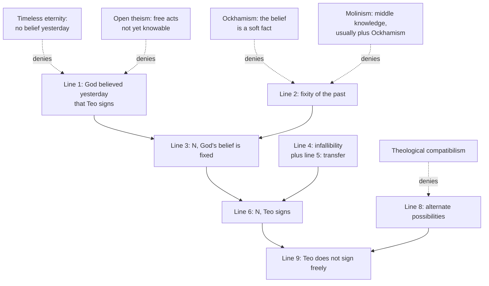

# Philosophy of Religion · Lesson 1.3: Omniscience and human freedom

> ⏱ ~15 min · Module 1: The concept of God and the divine attributes · Builds on: [1.2 Omnipotence and its paradoxes](01-02-omnipotence-and-its-paradoxes.md), [`metaphysics` 6.1 Determinism and the consequence argument](../../metaphysics/lessons/06-01-determinism-and-the-consequence-argument.md), [`metaphysics` 3.1 Kinds of necessity](../../metaphysics/lessons/03-01-kinds-of-necessity.md) · Unlocks: [1.4 Eternity, immutability, and simplicity](01-04-eternity-immutability-and-simplicity.md), [4.1 The logical problem of evil](04-01-the-logical-problem-of-evil.md)

## Why this matters

[Omniscience](../reference.md#omniscience) is knowing every truth. If it is already true that you will refuse a bribe next Tuesday, an omniscient God knew it last year, and cannot have been wrong. Then how could you take the bribe? Boethius's prisoner pressed this in *Consolation* V.3, concluding that praise, blame, hope and prayer lose their point. This lesson reconstructs that argument in its modern form, separates a fallacious version from a valid one, and maps what each standard response gives up. The stakes run forward: the free will defense in [4.1](04-01-the-logical-problem-of-evil.md) needs libertarian freedom *and* a God who knows what free creatures would do.

## The idea

Picture an infallible forecaster. Her forecasts are not causes: the weather does what it does, and she simply cannot be wrong about it. Two facts together make trouble. Her forecast is *in the past*, and you cannot now change the past. And her forecast *guarantees* the outcome. If both hold, the outcome looks as fixed as the forecast.

The careless version of the worry gets the guarantee wrong. "Necessarily, if she forecast it, it happens" does not say "if she forecast it, it necessarily happens." The first puts the necessity on the link; the second puts it on the outcome. That is the scope distinction from [`metaphysics` 3.1](../../metaphysics/lessons/03-01-kinds-of-necessity.md), which the medievals called the [necessity of the consequence and of the consequent](../reference.md#necessity-of-the-consequence-and-of-the-consequent). Spotting it kills the careless argument. It does not kill the careful one, which gets necessity onto the forecast itself from the pastness of the past.

## The argument

**The fallacious version.** Let $G$ = *God believed yesterday that Teo signs the petition at noon today*, and $S$ = *Teo signs at noon today*. Read $\Box$ as "necessarily."

1. $\Box(G \to S)$ *(infallibility: no world has God believing it and Teo not signing)*
2. $G$ *(foreknowledge)*
3. $\therefore \Box S$ *(invalid)*

In words: from a necessary link and a true antecedent, only $S$ follows (by 1, the T axiom $\Box p \to p$, and modus ponens with 2). To get $\Box S$ you need $\Box G$ as well, and then the K axiom does it. A two-world countermodel shows the gap. In world $w_1$, God believes and Teo signs; in $w_2$, God does not believe and Teo does not sign. Premise 1 holds in both worlds, $G$ holds at $w_1$, but $S$ fails at $w_2$, so $\Box S$ is false at $w_1$. Reading premise 1 as $G \to \Box S$ would make the argument valid, but that premise is false.

**The valid version.** Nelson Pike ("Divine Omniscience and Voluntary Action," *Philosophical Review*, 1965) restarted the modern debate; Linda Zagzebski (*The Dilemma of Freedom and Foreknowledge*, 1991) gave the form most now use. Write $N p$ for *p is true and no one now has any choice about whether p*: the accidental necessity of what is settled.

1. $G$. *(Supposition: infallible foreknowledge.)*
2. If $p$ is a fact about the past, then $N p$. *(The [fixity of the past](../reference.md#fixity-of-the-past).)*
3. $N G$. *(1, 2.)*
4. $\Box(G \to S)$. *(Infallibility, as before.)*
5. If $N p$ and $\Box(p \to q)$, then $N q$. *(Transfer of necessity.)*
6. $N S$. *(3, 4, 5.)*
7. If $N S$, Teo cannot do otherwise than sign. *(Meaning of N.)*
8. If Teo cannot do otherwise, he does not sign freely. *(Principle of alternate possibilities.)*
9. $\therefore$ Teo does not sign freely. *(6, 7, 8.)*

In words: the past fixes God's belief, and the belief strictly entails the act, so the act is as fixed as the belief. Line 3 supplies exactly what the fallacious version lacked: a necessity on the antecedent. It is not $\Box G$, but the weaker, time-indexed $N G$, and line 5 is built to pass that weaker necessity along.

This is the consequence argument of [`metaphysics` 6.1](../../metaphysics/lessons/06-01-determinism-and-the-consequence-argument.md) with God's past belief in place of P0 and infallibility in place of the laws. One difference matters. Line 5 is the *strict-entailment* form of transfer, the repair that metaphysics 6.1 reached after McKay and Johnson's coin case refuted Beta. That case never touches the theological version. There is wide agreement that the argument is valid, so every response denies a premise.

**The responses, and what each gives up.**

- **[Ockhamism](../reference.md#ockhamism)** (after William of Ockham; revived by Marilyn Adams, 1967, and Alvin Plantinga, "On Ockham's Way Out," 1986) denies line 2 for God's belief. Only *hard* facts about the past are fixed. "It was true yesterday that Teo would sign" is a [soft fact](../reference.md#soft-and-hard-facts): it is partly about today, so Teo has a choice about it. Plantinga argues God's past belief is soft for the same reason. Teo has *counterfactual* power over it: he can act so that, were he to act, God would always have believed otherwise. *Cost:* a principled hard/soft line. Critics, Pike first among them, argue a belief is a state of the believer at a time, as hard as anything gets.
- **[Molinism](../reference.md#molinism)** (Luis de Molina, *Concordia*, 1588) explains *how* God could know free acts. Between his knowledge of necessary truths and his knowledge of what he decides lies **middle knowledge**: counterfactuals of creaturely freedom, such as *if Teo were in circumstances C, he would freely sign*. Knowing these and choosing C, God knows Teo will sign without causing it. This is a theory of how God knows, not by itself a denial of a premise; Molinists usually add an Ockhamist reply to line 2. *Cost:* the **grounding objection** (Robert Adams, "Middle Knowledge and the Problem of Evil," 1977; William Hasker, *God, Time, and Knowledge*, 1989). What makes such a counterfactual true before Teo exists? It cannot be God's decree, or the act is not free in the libertarian sense; and it cannot be Teo, who does not yet exist. Molinists reply that counterfactuals need no grounds beyond themselves, as many ordinary conditionals seem to need none.
- **Timeless eternity** (Boethius, Aquinas) denies line 1 as written. God has no beliefs *yesterday*: he sees all times in one non-temporal present, so there is no *fore*knowledge for line 2 to fix. *Cost:* Zagzebski's parallel argument puts "it is in the timeless realm" in place of "it is past." If we have no more choice about God's timeless knowing than about his past knowing, the argument re-forms. The reply is that the intuition fixing the timeless is weaker than the one fixing the past. Whether timelessness is coherent at all is [1.4](01-04-eternity-immutability-and-simplicity.md)'s question.
- **[Open theism](../reference.md#open-theism)** (Clark Pinnock and others, *The Openness of God*, 1994; Hasker, 1989) also denies line 1, keeping libertarian freedom. God knows every truth that can be known, but free acts not yet done are not knowable. Open theists differ on whether that is because such propositions are not yet true or because they are true but unknowable. *Cost:* a revised notion of omniscience, and providence that takes risks and can be surprised. Predictive prophecy then needs another explanation.
- **Theological compatibilism** denies line 8: freedom does not require alternatives, as Frankfurt cases ([`metaphysics` 6.3](../../metaphysics/lessons/06-03-frankfurt-cases-and-alternate-possibilities.md)) suggest, or freedom is compatible with being settled. *Cost:* the libertarian freedom that the free will defense in [4.1](04-01-the-logical-problem-of-evil.md) typically relies on.

**Where the argument is weakest.** The critic of the argument attacks line 2 as applied to God: a belief whose content is about Teo's noon is as much about noon as "it was true that Teo would sign," and that fact is plainly soft. The argument's defender answers that this reply rests on its own premise: that God's believing can be fixed by what it is about. Ordinary believing is a mental state fixed when it occurs, and, the defender argues, if an infallible belief is soft then nearly every past fact turns out soft. The dispute is over what makes a fact *about* a time.

## The argument map

Solid arrows build the valid argument; dashed arrows mark the premise each response denies.

## Worked examples

**Example 1 (clean case: a fallible forecaster).** Dana, a superb bookmaker, judged last week that the challenger will concede tonight's chess game. She is right 99 times in 100. Run the valid argument. Lines 2–3 go through: her judgment is past, and fixed. Line 4 fails: it is not necessary that if Dana judged it, the challenger concedes, since there are worlds where she judged so and was wrong. Without a strict link, line 5 has nothing to transfer. So a past belief alone, however reliable, threatens nobody. The whole problem is **infallibility plus pastness**, which is why it is a problem only for a God who is essentially omniscient and temporal.

**Example 2 (hard case: the prophet and the belief).** Suppose God reveals to a prophet, who says aloud on Monday, "Teo will sign on Wednesday." The Ockhamist can call *God believed on Monday that Teo would sign* a soft fact. But *the prophet uttered these words on Monday* is a hard fact if anything is: a sound in the air. Still, the utterance does not strictly entail the signing; prophets can be mistaken or lie. The strict entailment runs only from *the prophet uttered it **because God revealed it***, so the Ockhamist must call that fact soft too. Critics argue the soft region keeps growing until it absorbs ordinary events. Ockhamists reply that softness follows entailment, so it spreads only as far as infallible facts spread. The case does not settle the dispute, but it shows where it lives: whether a fact's being *about* the future can depend on what it entails.

## Watch out

- **You might think the problem is that foreknowledge causes the act, but** the valid version claims no causation. Line 5 transfers *lack of choice*, not causal power. Boethius's prisoner already rejects the "it's known because it will happen, not the reverse" reply (V.3), since it leaves the necessity in place.
- **You might think the scope distinction answers the argument, but** it answers only the fallacious version. The valid version gets necessity onto the antecedent from the fixity of the past.
- **You might think open theism denies omniscience, but** its defenders redefine omniscience as knowing every truth that can be known, and argue that future free acts fall outside this, just as omnipotence excludes making a square circle ([1.2](01-02-omnipotence-and-its-paradoxes.md)).

## One-liner

> Infallible knowledge in the past plus a fixed past makes your act as settled as God's belief; every response denies that the belief is past, that the past is fixed for it, that the act is knowable, or that freedom needs alternatives.

## Problems

**P1 (🟢) *(Formal (a) · Exegetical (b))*** The Oracle of Vell is infallible: necessarily, whatever it announces is true. On Monday it announced, "Mira will refuse the crown on Friday." Let $A$ = *the Oracle announced on Monday that Mira refuses*, $R$ = *Mira refuses on Friday*. (a) Write the inference from the announcement to "Mira refuses necessarily" in two ways, once with the necessity on the conditional and once on the consequent. Say which inference is valid, and give a countermodel for the invalid one. (b) Name the further premise that turns the valid shape into a threat to Mira's freedom, and say in one sentence why an *announcement*, unlike a belief, makes Ockhamists unwilling to deny that premise for $A$.

**P2 (🟡) *(Exegetical)*** A forum thread, invented:

> **Post 1:** God knows what I'll eat for breakfast tomorrow. Whatever God knows is necessarily true. So it's necessary that I eat it, and I'm not free. QED.
>
> **Post 2:** Easy fix: God's knowing doesn't *cause* your breakfast. Your choice causes God's knowledge, not vice versa. Problem solved.

(a) Name the error in Post 1 precisely, using modal notation. (b) Explain why Post 2 does not answer the valid version of the argument, naming the premise it leaves untouched. Two sentences per part.

**P3 (🔴, optional) *(Exegetical (a) · Evaluative (b))*** A Molinist and an open theist both hold libertarian freedom and both say God's knowledge is as complete as it can be. (a) Name the single claim about counterfactuals of creaturely freedom that one affirms and the other denies, and say which is which. (b) State the grounding objection at full strength, then the best Molinist reply, in 150 words or fewer. Any verdict, or none.

Solutions

**P1** *(Formal (a) · Exegetical (b))*

(a) Necessity on the conditional: $\Box(A \to R)$, $A$, therefore $\Box R$. **Invalid.** Countermodel: two worlds, $w_1$ with $A$ and $R$ true and $w_2$ with both false. $\Box(A \to R)$ holds (the conditional is true at both), $A$ holds at $w_1$, and $R$ fails at $w_2$, so $\Box R$ is false at $w_1$. What does follow is $R$, by T and modus ponens. Necessity on the consequent: $A \to \Box R$, $A$, therefore $\Box R$. **Valid** by modus ponens, but its premise is not what infallibility says. Infallibility gives only $\Box(A \to R)$.

**Must hit, strict (b):**

- The premise is the fixity of the past, giving $N A$, plus transfer: if $N A$ and $\Box(A \to R)$, then $N R$.
- An announcement is a public physical event on Monday, a paradigm hard fact. So Ockhamists cannot call it soft in the way they call God's belief soft.

**Wrong turns:** calling the conditional-necessity inference valid "because the Oracle can't be wrong" (infallibility licenses $R$, not $\Box R$); in (b), naming infallibility itself as the extra premise, which is already in place.

**Model answer (b):** The extra premise is the fixity of the past: no one now has a choice about the fact that the Oracle announced it, so by transfer no one has a choice about $R$. An announcement is a sound made on Monday, a hard fact if anything is, so the Ockhamist must look instead for a soft fact elsewhere, for instance in "the Oracle announced it *infallibly*."

---

**P2** *(Exegetical)*

**Must hit, strict (a):**

- Post 1 slides from $\Box(K \to B)$ ("necessarily, if God knows it, I eat it") to $\Box B$. That is a scope fallacy, confusing the necessity of the consequence with that of the consequent.
- From $\Box(K \to B)$ and $K$ only $B$ follows; $\Box B$ would need $\Box K$.

**Must hit, strict (b):**

- The valid version makes no causal claim. It transfers lack of choice through strict entailment.
- Post 2 leaves the fixity of the past untouched: God's belief, held yesterday, is something no one now has a choice about. Together with infallibility and transfer, that is enough.

**Wrong turns:** saying Post 2 is right but irrelevant to Post 1 (Post 2 is a reply to a stronger argument than Post 1 makes, and fails against it); in (a), writing $K \to \Box B$ as the error, when that is the false *premise* the valid reading would need.

**Model answer:** (a) Post 1 moves from $\Box(K \to B)$ and $K$ to $\Box B$, but the box covers only the conditional; you get $B$, and $\Box B$ would need $\Box K$. (b) The valid argument never says knowledge causes anything: it says God's past belief is fixed (fixity of the past) and strictly entails the act, and lack of choice transfers across strict entailment. Post 2 denies a causal claim nobody made and leaves the fixity premise standing; Boethius's prisoner rejects the same reply in V.3.

---

**P3** *(Exegetical (a) · Evaluative (b))*

**Must hit, strict (a):** the claim is that there are true counterfactuals of creaturely freedom (determinately true "if Teo were in C, he would freely sign") prior to God's creative decision. The Molinist affirms it; the open theist denies it, holding that such conditionals are not true, or not knowable, before the agent chooses.

**Must hit, any verdict (b):**

- The objection as a dilemma: the truth-maker is either God's will (then the act is not libertarian-free) or the creature (who does not yet exist, and may never exist). With no third ground, the counterfactual has no truth value.
- A reply that answers the dilemma's assumption: deny that every truth needs a ground of that kind, giving a parallel case of a truth with no evident grounds, or locate a ground the dilemma omits.

**Wrong turns:** naming "God exists" or "humans are free" as the crux, since both accept them; in (b), answering the objection by appeal to God's power, which only sharpens the first horn.

**Model answer (b), one of several:** Objection: a counterfactual of freedom must be made true by something. Not by God's decree, since a decreed choice is not libertarian-free. Not by the agent, who at the moment of middle knowledge does not exist and may never be created. Nor by the agent's character, which would make the choice predictable rather than free. So nothing makes it true, and God cannot know it. Reply: the objection assumes a truthmaker principle the Molinist need not accept. "If the coin had been tossed it would have landed heads" is held to be true or false without present grounds, and tensed truths about the past are likewise held true by presentists who deny the past exists. If those need no ground beyond themselves, neither need counterfactuals of freedom; the demand is a contested metaphysics, not a datum.

## Flashback

**From Lesson [1.1](01-01-which-god-and-what-an-argument-must-do.md) (Which God, and what an argument must do):** *(Formal (a) · Exegetical (b).)* An invented parish newsletter argues: "Start sceptical, at prior odds of 1:9 that God exists. The argument from cosmic order has likelihood ratio 3, the moral argument 2, the argument from the intelligibility of nature 3. Multiply: posterior odds 2:1, so God's existence is now more probable than not." A reader makes two points the editor accepts. The intelligibility argument rests on the same key premise as the cosmic-order argument, so given the first two items its ratio is only 1.5. And the editor himself grants that the world's suffering has a ratio of $\frac{1}{2}$ (it favours no God), but left it out. (a) Compute the posterior odds and probability of God with each correction alone, then with both. (b) In Swinburne's terms, is the corrected case C-inductive, P-inductive, or neither? Name the rule from 1.1 that each correction enforces. Two sentences for (b).

Solution

**Worked arithmetic (a):**

Dependence corrected only: $\frac{1}{9} \times 3 \times 2 \times 1.5 = 1$, odds $1:1$, $P(G) = \frac{1}{2}$.

Suffering included only: $\frac{1}{9} \times 3 \times 2 \times 3 \times \frac{1}{2} = 1$, odds $1:1$, $P(G) = \frac{1}{2}$.

Both: $\frac{1}{9} \times 3 \times 2 \times 1.5 \times \frac{1}{2} = \frac{1}{2}$, odds $1:2$, $P(G) = \frac{1}{3}$.

The prior probability was $\frac{1}{10}$.

**Must hit, strict (b):**

- C-inductive (it raises $P(G)$ from $\frac{1}{10}$ to $\frac{1}{3}$) but not P-inductive (that needs $P(G) > \frac{1}{2}$; even one correction alone leaves it at exactly $\frac{1}{2}$, not above).
- The dependence correction enforces the rule that each item is weighed *given the items already counted*, so a shared premise counts once. The suffering correction enforces the rule that a cumulative case carries *every* item, favourable or not, into one product.

**Wrong turns:** calling odds $1:1$ P-inductive; dropping the intelligibility argument entirely, which treats its ratio as 1 rather than 1.5; entering suffering by subtracting rather than multiplying by $\frac{1}{2}$; reading the result as a verdict on theism, when the numbers are the newsletter's own stipulations.

**Model answer (b):** The corrected case is C-inductive, raising the probability of God from one in ten to one in three, but not P-inductive, since it stops below one half. The first correction applies the rule that ratios multiply only when each is taken given the items already counted, so two arguments sharing a premise count once; the second applies the rule that a cumulative case must include unfavourable evidence in the same product.

## Connections

- **Backward:** the valid argument is the consequence argument of [`metaphysics` 6.1](../../metaphysics/lessons/06-01-determinism-and-the-consequence-argument.md), with God's past belief as P0; the scope distinction is [`metaphysics` 3.1](../../metaphysics/lessons/03-01-kinds-of-necessity.md)'s Watch-out; Boethius's text and his two necessities are read in [`ancient-medieval-philosophy` 5.3](../../ancient-medieval-philosophy/lessons/05-03-time-eternity-and-foreknowledge.md), which flags reading them as the modal scope distinction as anachronistic exegesis. Line 8 is the principle Frankfurt cases attack in [`metaphysics` 6.3](../../metaphysics/lessons/06-03-frankfurt-cases-and-alternate-possibilities.md).
- **Forward:** [1.4](01-04-eternity-immutability-and-simplicity.md) asks whether a timeless God is coherent, and whether timelessness fits a simple and immutable God; Module 1's boss problem asks whether it answers the valid version. Middle knowledge returns in [4.1](04-01-the-logical-problem-of-evil.md), where Plantinga's free will defense turns on what free creatures would do in circumstances God could create.
- **Sideways:** a timeless God sits most naturally with a B-series ([`metaphysics` 5.1](../../metaphysics/lessons/05-01-the-a-theory-and-the-b-theory.md)), and open theism with an A-theory on which the future is not yet settled. The Thomist (physical premotion) versus Molinist dispute over how God's causality reaches a free act, a dispute inside Catholic theology, is named in [`thomistic-synthesis` 5.2](../../thomistic-synthesis/lessons/05-02-providence-and-secondary-causes.md), which cedes it to the dogmatic courses; Ockham's wider logic is [`ancient-medieval-philosophy` 8.4](../../ancient-medieval-philosophy/lessons/08-04-ockham-nominalism-and-the-razor.md).
